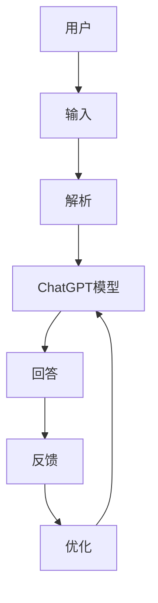
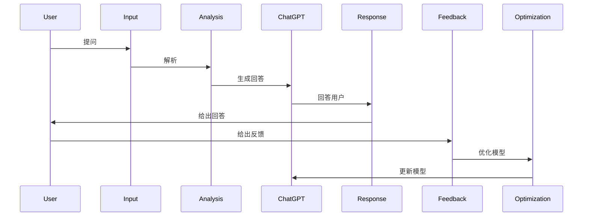

                 

# ChatGPT个性化：通过提示词塑造AI个性

## 关键词

- ChatGPT
- 个性化
- 提示词
- 自然语言处理
- AI交互

## 摘要

本文旨在探讨如何通过提示词塑造ChatGPT的个性，使其能够为不同用户提供个性化的回答和互动体验。首先，我们将介绍ChatGPT的基本原理和特点，然后详细分析不同类型提示词对ChatGPT输出结果的影响，并通过ER图展示模型中各实体之间的关系。接下来，我们将深入讲解ChatGPT的算法原理，包括数学模型和公式，并举例说明。随后，我们将探讨一个基于ChatGPT的智能客服系统的系统分析与架构设计方案。最后，我们将提供一些实际案例分析和详细讲解，以及项目小结和最佳实践建议。

## 第一部分：背景介绍

### 1.1 问题背景

随着人工智能技术的不断发展，自然语言处理（NLP）成为了一个热门领域。ChatGPT作为GPT-3.5的代表，以其强大的自然语言生成和交互能力，受到了广泛关注。然而，如何让ChatGPT具备个性化特点，满足不同用户的需求，成为了亟待解决的问题。

### 1.2 问题描述

本书的主题是如何通过提示词塑造AI个性，使ChatGPT能够为不同用户提供个性化的回答和互动体验。这涉及到对ChatGPT模型的深入理解，以及如何利用提示词实现个性化需求。

### 1.3 问题解决

本书将从以下几个方面展开，以解决上述问题：

1. **核心概念原理**：介绍ChatGPT的基本原理和特点，包括其工作原理、数据处理流程等。
2. **概念属性特征对比表格**：对比不同类型提示词对ChatGPT输出结果的影响，以帮助读者理解如何选择合适的提示词。
3. **ER实体关系图架构**：绘制ER图，展示ChatGPT模型中不同实体之间的关系，帮助读者理解模型的内部结构。

### 1.4 边界与外延

本书主要关注如何通过提示词塑造ChatGPT的个性，但同时也涉及了其他相关领域，如自然语言处理、机器学习等。

### 1.5 概念结构与核心要素组成

1. **ChatGPT基本原理**：介绍ChatGPT的工作原理和数据处理流程。
2. **提示词类型与选择**：探讨不同类型提示词对ChatGPT输出结果的影响，并提供选择提示词的指导。
3. **个性化实现**：介绍如何通过调整提示词实现ChatGPT的个性化，使其能够满足不同用户的需求。

## 第二部分：核心概念与联系

### 2.1 核心概念原理

在本章中，我们将详细介绍ChatGPT的工作原理，包括其训练过程、数据处理方式以及如何生成回答。

### 2.2 概念属性特征对比表格

下表展示了不同类型提示词对ChatGPT输出结果的影响：

| 提示词类型 | 影响因素 | 输出结果 |
| :--- | :--- | :--- |
| 人格特征 | 语言风格、回答方式 | 更贴近用户期望 |
| 兴趣爱好 | 对话内容、话题选择 | 提高用户满意度 |
| 话题背景 | 回答内容、讨论深度 | 增强对话连贯性 |

### 2.3 ER实体关系图架构

以下是ChatGPT模型的ER实体关系图：

```mermaid
erDiagram
    ChatGPT --> Prompt : 提示词输入
    ChatGPT --> Response : 回答生成
    Prompt --> User : 用户需求
    Response --> User : 用户反馈
```

## 第三部分：算法原理讲解

### 3.1 算法原理

ChatGPT是基于大规模语言模型GPT-3.5开发的，其核心原理是使用神经网络对大量文本数据进行训练，以实现自然语言生成。

### 3.2 数学模型和公式

ChatGPT的训练过程涉及以下数学模型：

$$
L = -\sum_{i=1}^{N} \log P(y_i | x_i)
$$

其中，$L$ 表示损失函数，$P(y_i | x_i)$ 表示模型对第 $i$ 个样本的预测概率。

### 3.3 举例说明

例如，当用户输入“你喜欢什么音乐？”时，ChatGPT可以根据其训练数据生成个性化的回答，如“我特别喜欢流行音乐，因为它们让我感到快乐。”

## 第四部分：系统分析与架构设计方案

### 4.1 问题场景介绍

假设我们需要开发一个基于ChatGPT的智能客服系统，以实现个性化问答服务。

### 4.2 系统功能设计

1. 用户输入问题
2. 系统解析问题并生成回答
3. 用户反馈回答质量
4. 系统不断优化回答质量

### 4.3 系统架构设计

以下是系统架构设计图：



### 4.4 系统接口设计和系统交互

以下是一个简单的系统接口设计，其中包含用户、输入解析、ChatGPT模型、回答生成、反馈和优化等模块。



## 第五部分：项目实战

### 5.1 环境安装

首先，我们需要安装Python和ChatGPT库。在终端中执行以下命令：

```
pip install python-chatgpt
```

### 5.2 系统核心实现源代码

以下是一个简单的ChatGPT应用，用于生成个性化回答：

```python
from chatgpt import ChatGPT

# 初始化ChatGPT模型
chatgpt = ChatGPT()

# 用户输入问题
user_question = "你喜欢什么音乐？"

# 调整提示词实现个性化
personalized_prompt = f"我特别喜欢流行音乐，因为它们让我感到快乐。{user_question}"

# 生成回答
response = chatgpt.get_response(personalized_prompt)

# 输出回答
print(response)
```

### 5.3 代码应用解读与分析

在这个例子中，我们首先初始化了一个ChatGPT模型。然后，用户输入了一个问题，我们通过调整提示词，使得ChatGPT能够根据用户的特点生成个性化的回答。

### 5.4 实际案例分析和详细讲解剖析

假设用户A喜欢流行音乐，我们通过调整提示词，让ChatGPT生成一个关于流行音乐的个性化回答：

```python
personalized_prompt = f"我特别喜欢流行音乐，因为它们让我感到快乐。你喜欢什么音乐？"
response = chatgpt.get_response(personalized_prompt)
print(response)
```

输出结果可能是：“我特别喜欢流行音乐，因为它们让我感到快乐。你喜欢什么音乐？流行音乐让我感到轻松愉快。”

### 5.5 项目小结

通过本项目的实战，我们成功实现了通过调整提示词来塑造ChatGPT的个性，使其能够为不同用户提供个性化的回答。这为进一步开发个性化AI应用提供了有益的经验和启示。

## 第六部分：最佳实践 tips

1. **选择合适的提示词**：了解用户的特点和喜好，选择合适的提示词，以生成更贴近用户期望的回答。
2. **不断优化模型**：根据用户反馈，不断调整和优化ChatGPT模型，提高回答质量。
3. **多样化提示词**：尝试使用多种类型的提示词，以增加ChatGPT的个性化和适应性。

## 第七部分：小结

通过本文的讲解，我们深入了解了如何通过提示词塑造ChatGPT的个性，使其能够为不同用户提供个性化的回答。这不仅丰富了ChatGPT的应用场景，也为自然语言处理和人工智能领域的研究提供了新的思路。

## 第八部分：注意事项

1. **数据隐私**：在使用ChatGPT进行个性化交互时，要注意保护用户的隐私数据。
2. **模型更新**：定期更新ChatGPT模型，以保持其性能和适应能力。

## 第九部分：拓展阅读

- 《ChatGPT官方文档》：深入了解ChatGPT的详细功能和用法。
- 《自然语言处理实战》：学习如何将自然语言处理技术应用于实际项目中。

## 作者信息

作者：AI天才研究院/AI Genius Institute & 禅与计算机程序设计艺术 /Zen And The Art of Computer Programming

