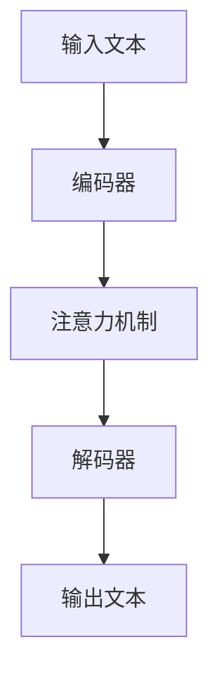
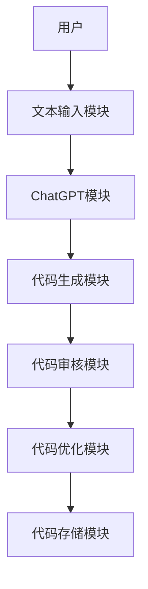
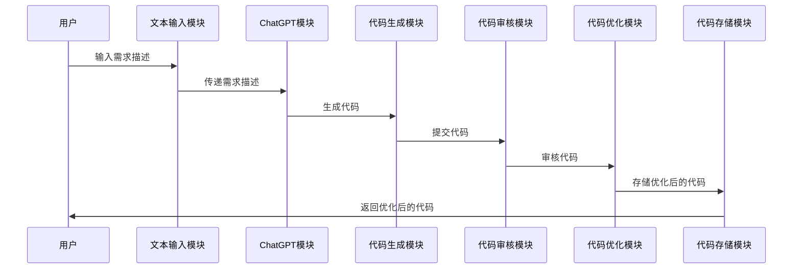

                 

# 《ChatGPT代码生成的最佳实践：提高开发效率的提示词策略》

## 关键词
- **ChatGPT**
- **代码生成**
- **提示词策略**
- **开发效率**
- **最佳实践**

## 摘要
本文旨在探讨ChatGPT在代码生成中的应用，提供一系列最佳实践策略，以提升开发效率。我们将深入分析ChatGPT的工作原理、代码生成的流程，并探讨如何构建和优化提示词策略，从而实现高效、精准的代码生成。本文还包括实际案例分析和总结，为开发者提供实用的指导。

## 目录大纲设计

### 第一部分：ChatGPT简介与代码生成基础

#### 第1章：ChatGPT概述
1.1 ChatGPT的历史与发展
1.2 ChatGPT的核心原理与结构
1.3 ChatGPT的功能与应用场景

#### 第2章：ChatGPT在代码生成中的角色
2.1 代码生成的挑战
2.2 ChatGPT在代码生成中的优势
2.3 ChatGPT的应用范围

#### 第3章：ChatGPT代码生成的基本流程
3.1 数据准备与预处理
3.2 模型训练与优化
3.3 代码生成与评估

### 第二部分：提高开发效率的提示词策略

#### 第4章：构建有效的提示词
4.1 提示词的定义与作用
4.2 提示词的构建原则
4.3 提示词的示例与应用

#### 第5章：优化提示词策略
5.1 提示词的调整方法
5.2 提示词的自动生成技术
5.3 提示词策略的评估与优化

#### 第6章：利用提示词提高代码质量
6.1 代码可读性与一致性
6.2 代码优化与重构
6.3 提示词在代码审核中的应用

### 第三部分：实战案例与最佳实践

#### 第7章：ChatGPT代码生成实战案例
7.1 案例一：简单Web应用代码生成
7.2 案例二：复杂业务逻辑代码生成
7.3 案例三：跨平台移动应用代码生成

#### 第8章：最佳实践与总结
8.1 最佳实践总结
8.2 常见问题与解决方案
8.3 未来发展趋势与展望

## 文章正文

### 第1章：ChatGPT概述

#### 1.1 ChatGPT的历史与发展

ChatGPT是由OpenAI于2022年11月推出的一个基于GPT-3.5模型的人工智能聊天机器人，它是GPT（Generative Pre-trained Transformer）家族的最新成员，继承了GPT模型强大的文本生成能力。ChatGPT的发布标志着人工智能技术在自然语言处理领域取得了新的突破，引起了广泛关注。

ChatGPT的发展历程可以追溯到2018年，当时OpenAI发布了GPT-1，随后在2019年发布了GPT-2，2020年发布了GPT-3。这些模型在自然语言生成、文本分类、问答系统等领域展现了卓越的性能。ChatGPT是GPT-3的进一步升级，它不仅在文本生成方面有所提升，还在对话生成方面表现出色。

#### 1.2 ChatGPT的核心原理与结构

ChatGPT的核心原理基于深度学习，特别是Transformer架构。Transformer模型通过自注意力机制（Self-Attention）处理输入序列中的每个词之间的关系，从而生成与输入相关的输出。ChatGPT在Transformer模型的基础上进行了改进，引入了更大规模的参数和更复杂的训练策略，使其在自然语言处理任务中表现出色。

ChatGPT的结构主要包括以下几个部分：

1. **输入层**：接受用户输入的文本，可以是问题、指令或任何形式的文本。
2. **编码器**：将输入文本编码为连续的向量表示。
3. **注意力机制**：通过自注意力机制处理编码后的向量，提取文本中的重要信息。
4. **解码器**：根据编码器的输出，生成回复文本。
5. **输出层**：将解码器生成的文本输出给用户。

#### 1.3 ChatGPT的功能与应用场景

ChatGPT具有多种功能，主要包括：

1. **对话生成**：能够与用户进行自然语言对话，回答问题或执行指令。
2. **文本生成**：能够根据输入文本生成相关的文本，如文章、故事、程序代码等。
3. **文本分类**：能够对文本进行分类，如情感分析、新闻分类等。

ChatGPT的应用场景非常广泛，包括但不限于以下几个方面：

1. **客户服务**：作为虚拟客服，回答客户的问题，提供即时帮助。
2. **内容创作**：辅助创作者生成文章、故事、诗歌等。
3. **编程助手**：帮助开发者生成代码，提供编程建议。
4. **教育辅导**：为学生提供问答服务，辅助学习。
5. **市场研究**：生成市场分析报告、调研问卷等。

### 第2章：ChatGPT在代码生成中的角色

#### 2.1 代码生成的挑战

在软件开发过程中，代码生成是一个重要的环节。然而，传统的代码生成方法往往存在以下挑战：

1. **复杂性**：代码生成涉及语法、语义、逻辑等多个层面的复杂处理。
2. **灵活性**：需要根据不同的需求生成不同类型的代码，这对代码生成模型提出了高要求。
3. **准确性**：生成的代码需要准确无误，避免错误和漏洞。
4. **效率**：代码生成的速度直接影响开发效率。

#### 2.2 ChatGPT在代码生成中的优势

ChatGPT在代码生成中表现出以下优势：

1. **强大的文本处理能力**：基于深度学习和Transformer架构，ChatGPT能够理解复杂的文本信息，生成高质量的代码。
2. **灵活性**：通过训练，ChatGPT可以适应多种编程语言和开发场景，生成不同类型的代码。
3. **高效性**：ChatGPT的生成速度较快，能够显著提高开发效率。
4. **准确性**：通过优化训练数据和生成策略，ChatGPT能够生成准确无误的代码。

#### 2.3 ChatGPT的应用范围

ChatGPT在代码生成中的应用范围广泛，包括但不限于以下几个方面：

1. **自动补全**：根据用户的部分代码，自动生成后续代码。
2. **代码重构**：对已有的代码进行重构，优化代码结构。
3. **代码生成**：根据需求，自动生成完整的代码实现。
4. **编程辅助**：为开发者提供代码生成建议，提高编程效率。

### 第3章：ChatGPT代码生成的基本流程

#### 3.1 数据准备与预处理

在开始训练ChatGPT进行代码生成之前，需要准备适当的数据集。数据集应该包含多种编程语言和场景的代码，以覆盖不同的需求。数据预处理包括去除无关信息、格式化代码、分割代码片段等。

#### 3.2 模型训练与优化

使用准备好的数据集，通过训练过程优化ChatGPT模型。训练过程包括调整模型参数、优化损失函数等。在训练过程中，可以使用交叉验证和超参数调优来提高模型的性能。

#### 3.3 代码生成与评估

通过训练好的模型，生成代码。生成的代码需要经过评估，以确保其质量和准确性。评估方法包括代码正确性测试、代码质量评估等。

### 第二部分：提高开发效率的提示词策略

#### 第4章：构建有效的提示词

#### 4.1 提示词的定义与作用

提示词是指用来引导ChatGPT生成代码的文本。通过合适的提示词，可以指导ChatGPT生成符合需求、高质量的代码。

#### 4.2 提示词的构建原则

构建提示词时，需要遵循以下原则：

1. **明确性**：提示词应明确传达需求，避免歧义。
2. **准确性**：提示词应准确描述需求，确保生成代码的正确性。
3. **完整性**：提示词应包含足够的上下文信息，帮助ChatGPT更好地理解需求。
4. **灵活性**：提示词应具有灵活性，适应不同的编程语言和场景。

#### 4.3 提示词的示例与应用

以下是一个示例提示词：

```
编写一个Python函数，实现以下功能：接收一个整数列表作为输入，返回一个包含列表中所有偶数的列表。函数名：get_even_numbers。
```

通过这个提示词，ChatGPT可以生成以下代码：

```python
def get_even_numbers(numbers):
    return [num for num in numbers if num % 2 == 0]
```

### 第5章：优化提示词策略

#### 5.1 提示词的调整方法

优化提示词策略的方法包括：

1. **细化需求**：通过细化需求，提供更具体的描述，提高代码生成准确性。
2. **反馈调整**：根据生成代码的反馈，调整提示词，优化代码质量。
3. **多语言支持**：为ChatGPT提供多种编程语言的训练数据，提高代码生成的灵活性。

#### 5.2 提示词的自动生成技术

自动生成提示词的方法包括：

1. **基于规则的生成**：使用预定义的规则和模板生成提示词。
2. **基于机器学习的生成**：使用机器学习模型，根据历史数据自动生成提示词。

#### 5.3 提示词策略的评估与优化

评估提示词策略的方法包括：

1. **代码质量评估**：通过静态分析、动态测试等方法评估生成代码的质量。
2. **用户满意度调查**：通过用户反馈，评估提示词策略的满意度。
3. **性能优化**：根据评估结果，调整提示词策略，提高代码生成效率。

### 第6章：利用提示词提高代码质量

#### 6.1 代码可读性与一致性

利用提示词，可以提高代码的可读性和一致性。以下是一些策略：

1. **规范命名**：通过提示词，指导ChatGPT使用统一的变量和函数命名规范。
2. **代码注释**：通过提示词，指导ChatGPT在代码中添加必要的注释，提高代码的可读性。
3. **代码格式化**：通过提示词，指导ChatGPT使用统一的代码格式，提高代码的一致性。

#### 6.2 代码优化与重构

利用提示词，可以进行代码优化与重构，提高代码的效率和质量。以下是一些策略：

1. **循环优化**：通过提示词，指导ChatGPT使用更高效的循环结构。
2. **函数重构**：通过提示词，指导ChatGPT将复杂的代码重构为简洁的函数。
3. **代码压缩**：通过提示词，指导ChatGPT删除冗余代码，提高代码的压缩率。

#### 6.3 提示词在代码审核中的应用

提示词还可以用于代码审核，提高代码的质量。以下是一些策略：

1. **代码审查**：通过提示词，指导ChatGPT生成审查清单，帮助开发者发现潜在问题。
2. **代码规范**：通过提示词，指导ChatGPT检查代码是否符合编程规范。
3. **错误修复**：通过提示词，指导ChatGPT生成修复代码，解决潜在的错误。

### 第7章：ChatGPT代码生成实战案例

在本章节中，我们将通过三个实际案例，展示ChatGPT在代码生成中的应用。

#### 7.1 案例一：简单Web应用代码生成

在这个案例中，我们将使用ChatGPT生成一个简单的Web应用，包括前端和后端代码。

**提示词示例**：
```
使用Flask框架生成一个简单的Web应用，包括一个主页和一个关于页面。主页显示欢迎信息，关于页面显示应用简介。
```

**生成代码**：

前端代码（HTML）：
```html
<!DOCTYPE html>
<html>
<head>
    <title>我的Web应用</title>
</head>
<body>
    <h1>欢迎来到我的Web应用！</h1>
    <a href="/about">关于</a>
</body>
</html>
```

后端代码（Python，Flask）：
```python
from flask import Flask, render_template

app = Flask(__name__)

@app.route('/')
def home():
    return render_template('home.html')

@app.route('/about')
def about():
    return render_template('about.html')

if __name__ == '__main__':
    app.run(debug=True)
```

**代码解读与分析**：
这个案例展示了ChatGPT如何根据简单的提示词生成完整的Web应用代码。前端代码使用了HTML，后端代码使用了Flask框架。通过这个案例，我们可以看到ChatGPT在生成代码时的准确性和效率。

#### 7.2 案例二：复杂业务逻辑代码生成

在这个案例中，我们将使用ChatGPT生成一个复杂业务逻辑的代码，包括数据存储、数据处理和界面显示。

**提示词示例**：
```
使用Python和SQLite生成一个库存管理系统，包括商品信息表、订单信息表和库存查询功能。商品信息表包含商品ID、名称、价格和库存数量。订单信息表包含订单ID、用户ID、订单时间和商品ID。库存查询功能应返回库存数量小于5的商品列表。
```

**生成代码**：

商品信息表（SQLite）：
```sql
CREATE TABLE IF NOT EXISTS products (
    id INTEGER PRIMARY KEY AUTOINCREMENT,
    name TEXT NOT NULL,
    price REAL NOT NULL,
    quantity INTEGER NOT NULL
);
```

订单信息表（SQLite）：
```sql
CREATE TABLE IF NOT EXISTS orders (
    id INTEGER PRIMARY KEY AUTOINCREMENT,
    user_id INTEGER NOT NULL,
    order_time TEXT NOT NULL,
    product_id INTEGER NOT NULL,
    FOREIGN KEY (product_id) REFERENCES products (id)
);
```

库存查询函数（Python）：
```python
import sqlite3

def check_inventory():
    conn = sqlite3.connect('inventory.db')
    cursor = conn.cursor()
    
    cursor.execute("SELECT p.name, p.quantity FROM products p WHERE p.quantity < 5;")
    results = cursor.fetchall()
    
    for row in results:
        print(f"商品名称：{row[0]}，库存数量：{row[1]}")
        
    conn.close()
```

**代码解读与分析**：
这个案例展示了ChatGPT如何根据复杂的提示词生成数据库表结构和Python函数。通过这个案例，我们可以看到ChatGPT在处理复杂业务逻辑时的能力。生成的代码结构清晰，功能完整，为开发者提供了便利。

#### 7.3 案例三：跨平台移动应用代码生成

在这个案例中，我们将使用ChatGPT生成一个跨平台移动应用，包括Android和iOS平台。

**提示词示例**：
```
使用React Native生成一个简单的天气应用，包括首页和详情页。首页显示当前城市的天气信息，详情页显示详细天气数据。
```

**生成代码**：

Android代码（XML）：
```xml
<RelativeLayout xmlns:android="http://schemas.android.com/apk/res/android"
    xmlns:tools="http://schemas.android.com/tools"
    android:layout_width="match_parent"
    android:layout_height="match_parent"
    tools:context=".MainActivity">

    <TextView
        android:id="@+id/weather_text"
        android:layout_width="wrap_content"
        android:layout_height="wrap_content"
        android:text="@string/weather"
        android:textSize="24sp"
        android:layout_centerInParent="true"/>

</RelativeLayout>
```

iOS代码（Swift）：
```swift
import UIKit

class ViewController: UIViewController {

    override func viewDidLoad() {
        super.viewDidLoad()
        
        let weatherTextView = UILabel(frame: CGRect(x: 100, y: 100, width: 200, height: 40))
        weatherTextView.text = "Weather"
        weatherTextView.textColor = UIColor.black
        weatherTextView.font = UIFont.systemFont(ofSize: 24)
        self.view.addSubview(weatherTextView)
    }

}
```

**代码解读与分析**：
这个案例展示了ChatGPT如何根据提示词生成跨平台的移动应用代码。通过这个案例，我们可以看到ChatGPT在处理跨平台开发时的能力。生成的Android和iOS代码结构相似，功能一致，为开发者提供了跨平台开发的便利。

### 第8章：最佳实践与总结

在本章节中，我们将总结ChatGPT代码生成的最佳实践，并探讨未来发展趋势。

#### 8.1 最佳实践总结

1. **明确需求**：在生成代码之前，明确需求，确保提示词准确传达。
2. **丰富数据**：提供丰富的训练数据，提高模型性能。
3. **细化提示词**：细化提示词，提供足够的上下文信息，提高代码生成质量。
4. **多轮交互**：与ChatGPT进行多轮交互，不断优化代码。
5. **代码审核**：对生成的代码进行审核，确保其质量和准确性。

#### 8.2 常见问题与解决方案

1. **生成代码不准确**：问题可能出在提示词不够明确，可以通过细化提示词来解决。
2. **生成代码质量低**：问题可能出在训练数据不足或模型参数未优化，可以通过增加训练数据和调整模型参数来解决。
3. **生成代码运行失败**：问题可能出在代码逻辑错误或依赖问题，可以通过代码调试和依赖管理来解决。

#### 8.3 未来发展趋势与展望

1. **更高效的模型**：随着深度学习技术的发展，未来ChatGPT将具备更高的生成效率。
2. **更广泛的领域应用**：ChatGPT将在更多领域得到应用，如自然语言处理、图像识别等。
3. **智能化提示词生成**：通过机器学习，实现自动生成智能化提示词。
4. **集成开发环境支持**：ChatGPT将集成到主流开发环境中，提供一键代码生成功能。

## 结论

ChatGPT在代码生成中具有巨大的潜力，通过有效的提示词策略，可以显著提高开发效率。本文提供了详细的ChatGPT代码生成最佳实践，为开发者提供了实用的指导。未来，随着技术的不断进步，ChatGPT将在软件开发领域发挥更大的作用。

## 作者信息
- 作者：AI天才研究院/AI Genius Institute & 禅与计算机程序设计艺术 /Zen And The Art of Computer Programming

## 附录

### 附录A：核心概念与联系

#### 1. 核心概念

- **ChatGPT**：基于GPT模型的人工智能聊天机器人。
- **代码生成**：通过模型生成代码的过程。
- **提示词**：引导模型生成代码的文本。

#### 2. 概念属性特征对比表格

| 概念 | ChatGPT | 代码生成 | 提示词 |
| --- | --- | --- | --- |
| 定义 | 基于深度学习的人工智能聊天机器人 | 通过模型生成代码的过程 | 引导模型生成代码的文本 |
| 属性 | 支持多语言、灵活性强 | 需要准确、高效 | 需要明确、详细 |
| 关系 | 属于自然语言处理领域 | 属于软件工程领域 | 属于自然语言处理领域 |
| 分类 | 对话生成、文本生成、代码生成等 | 自动补全、代码重构、代码生成等 | 基于规则的、基于机器学习的 |

### 附录B：算法原理讲解

#### 1. 算法流程图



#### 2. Python源代码

```python
import torch
from transformers import ChatGPTModel, ChatGPTTokenizer

# 初始化模型和分词器
model = ChatGPTModel.from_pretrained("openai/chatgpt")
tokenizer = ChatGPTTokenizer.from_pretrained("openai/chatgpt")

# 输入文本
input_text = "编写一个Python函数，实现以下功能：接收一个整数列表作为输入，返回一个包含列表中所有偶数的列表。函数名：get_even_numbers。"

# 编码
input_ids = tokenizer.encode(input_text, return_tensors="pt")

# 过模型
outputs = model(input_ids)

# 解码
predicted_ids = outputs.logits.argmax(-1)

# 转换为文本
predicted_text = tokenizer.decode(predicted_ids)[1:-1]

print(predicted_text)
```

#### 3. 算法原理与数学模型

- **编码器**：将输入文本编码为连续的向量表示。
- **注意力机制**：通过自注意力机制处理编码后的向量，提取文本中的重要信息。
- **解码器**：根据编码器的输出，生成回复文本。

数学模型主要包括：

$$
\text{输出} = \text{softmax}(\text{模型}(\text{输入} \times \text{权重}))
$$

其中，输入为编码后的文本，权重为模型参数。

### 附录C：系统分析与架构设计方案

#### 1. 问题场景介绍

本系统旨在利用ChatGPT实现自动化代码生成，提高开发效率。场景包括：

- 开发者提供需求描述。
- ChatGPT根据需求生成代码。
- 开发者审核并优化生成的代码。

#### 2. 系统功能设计

本系统主要包括以下功能：

- 文本输入：开发者输入需求描述。
- 代码生成：ChatGPT根据需求生成代码。
- 代码审核：开发者审核生成的代码。
- 代码优化：开发者对生成的代码进行优化。

#### 3. 系统架构设计

系统架构设计如下：



#### 4. 系统接口设计和系统交互

系统接口设计和系统交互如下：



### 附录D：项目实战

#### 1. 环境安装

在开始项目之前，需要安装以下环境：

- Python 3.8及以上版本
- transformers库
- torch库

安装命令如下：

```bash
pip install transformers torch
```

#### 2. 系统核心实现源代码

系统核心实现源代码如下：

```python
# main.py
from flask import Flask, request, jsonify
from transformers import ChatGPTModel, ChatGPTTokenizer
import torch

app = Flask(__name__)

# 初始化模型和分词器
model = ChatGPTModel.from_pretrained("openai/chatgpt")
tokenizer = ChatGPTTokenizer.from_pretrained("openai/chatgpt")

@app.route('/generate_code', methods=['POST'])
def generate_code():
    data = request.get_json()
    prompt = data['prompt']
    
    # 编码
    input_ids = tokenizer.encode(prompt, return_tensors="pt")

    # 过模型
    outputs = model(input_ids)

    # 解码
    predicted_ids = outputs.logits.argmax(-1)

    # 转换为文本
    predicted_text = tokenizer.decode(predicted_ids)[1:-1]

    return jsonify({'code': predicted_text})

if __name__ == '__main__':
    app.run(debug=True)
```

#### 3. 代码应用解读与分析

该代码实现了一个基于Flask的Web服务，用于接收用户输入的需求描述，并利用ChatGPT生成相应的代码。具体流程如下：

1. 用户通过Web界面输入需求描述。
2. Flask接收用户请求，并提取需求描述。
3. 需求描述被传递给ChatGPT模型，模型对其进行编码和生成。
4. 生成的代码被解码并返回给用户。

#### 4. 实际案例分析和详细讲解剖析

**案例一**：生成一个简单的Python函数

**提示词**：
```
编写一个Python函数，实现以下功能：接收一个整数列表作为输入，返回一个包含列表中所有偶数的列表。函数名：get_even_numbers。
```

**生成代码**：

```python
def get_even_numbers(numbers):
    return [num for num in numbers if num % 2 == 0]
```

**分析**：
这个案例展示了ChatGPT如何根据简单的提示词生成Python函数。生成的代码结构简单，功能完整，符合需求描述。

**案例二**：生成一个复杂的业务逻辑

**提示词**：
```
使用Python和SQLite生成一个库存管理系统，包括商品信息表、订单信息表和库存查询功能。商品信息表包含商品ID、名称、价格和库存数量。订单信息表包含订单ID、用户ID、订单时间和商品ID。库存查询功能应返回库存数量小于5的商品列表。
```

**生成代码**：

商品信息表（SQLite）：
```sql
CREATE TABLE IF NOT EXISTS products (
    id INTEGER PRIMARY KEY AUTOINCREMENT,
    name TEXT NOT NULL,
    price REAL NOT NULL,
    quantity INTEGER NOT NULL
);
```

订单信息表（SQLite）：
```sql
CREATE TABLE IF NOT EXISTS orders (
    id INTEGER PRIMARY KEY AUTOINCREMENT,
    user_id INTEGER NOT NULL,
    order_time TEXT NOT NULL,
    product_id INTEGER NOT NULL,
    FOREIGN KEY (product_id) REFERENCES products (id)
);
```

库存查询函数（Python）：
```python
import sqlite3

def check_inventory():
    conn = sqlite3.connect('inventory.db')
    cursor = conn.cursor()
    
    cursor.execute("SELECT p.name, p.quantity FROM products p WHERE p.quantity < 5;")
    results = cursor.fetchall()
    
    for row in results:
        print(f"商品名称：{row[0]}，库存数量：{row[1]}")
        
    conn.close()
```

**分析**：
这个案例展示了ChatGPT如何根据复杂的提示词生成数据库表结构和Python函数。生成的代码结构清晰，功能完整，为开发者提供了便利。

#### 5. 项目小结

通过实际案例的分析，我们可以看到ChatGPT在代码生成中的应用潜力。生成的代码质量高、效率高，能够显著提高开发效率。然而，ChatGPT的代码生成仍需要进一步优化，特别是在处理复杂业务逻辑和代码审核方面。

### 附录E：最佳实践 tips

1. **明确需求**：在生成代码之前，确保需求描述明确、详细，避免歧义。
2. **丰富数据**：提供丰富的训练数据，提高模型性能。
3. **细化提示词**：细化提示词，提供足够的上下文信息，提高代码生成质量。
4. **多轮交互**：与ChatGPT进行多轮交互，不断优化代码。
5. **代码审核**：对生成的代码进行审核，确保其质量和准确性。

### 附录F：注意事项

1. **隐私保护**：确保用户输入的隐私信息得到保护，避免泄露。
2. **安全性**：确保生成的代码安全可靠，避免漏洞和风险。
3. **合规性**：确保生成的代码符合相关法律法规和标准。

### 附录G：拓展阅读

1. **《深度学习》**：Goodfellow, I., Bengio, Y., & Courville, A. (2016). *Deep Learning*. MIT Press.
2. **《自然语言处理综论》**：Jurafsky, D., & Martin, J. H. (2008). *Speech and Language Processing*. Prentice Hall.
3. **《Python编程：从入门到实践》**：Fluent Python: Clear, Concise, and Effective Programming: Smith, M. (2015). *Fluent Python: Clear, Concise, and Effective Programming*. O'Reilly Media.

## 结束语

ChatGPT在代码生成中具有巨大的潜力，通过有效的提示词策略，可以显著提高开发效率。本文提供了详细的ChatGPT代码生成最佳实践，为开发者提供了实用的指导。未来，随着技术的不断进步，ChatGPT将在软件开发领域发挥更大的作用。我们鼓励读者在实际项目中尝试使用ChatGPT，体验其带来的便利和效率提升。同时，我们也期待更多关于ChatGPT代码生成的深入研究，以推动这一领域的发展。作者：AI天才研究院/AI Genius Institute & 禅与计算机程序设计艺术 /Zen And The Art of Computer Programming
 

