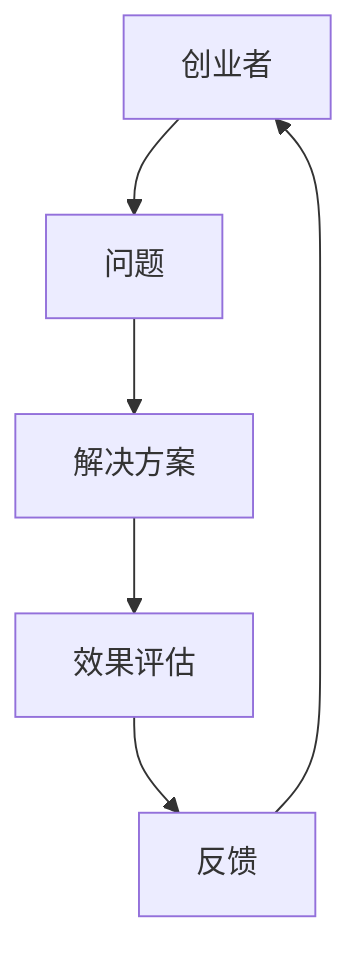
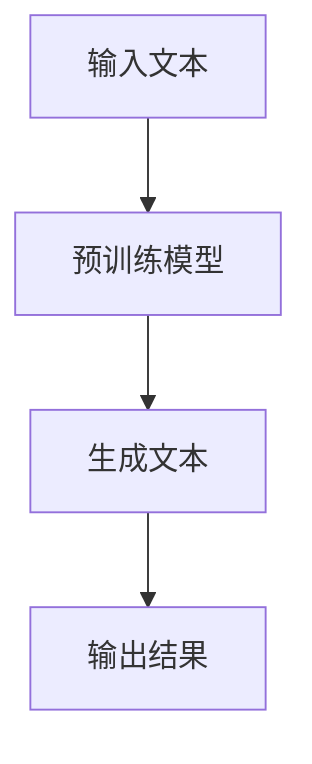
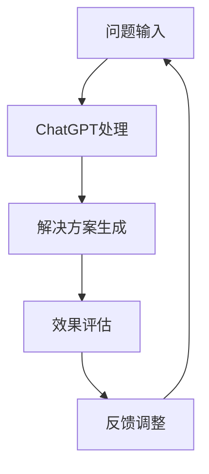
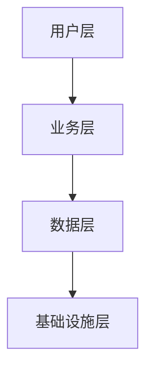
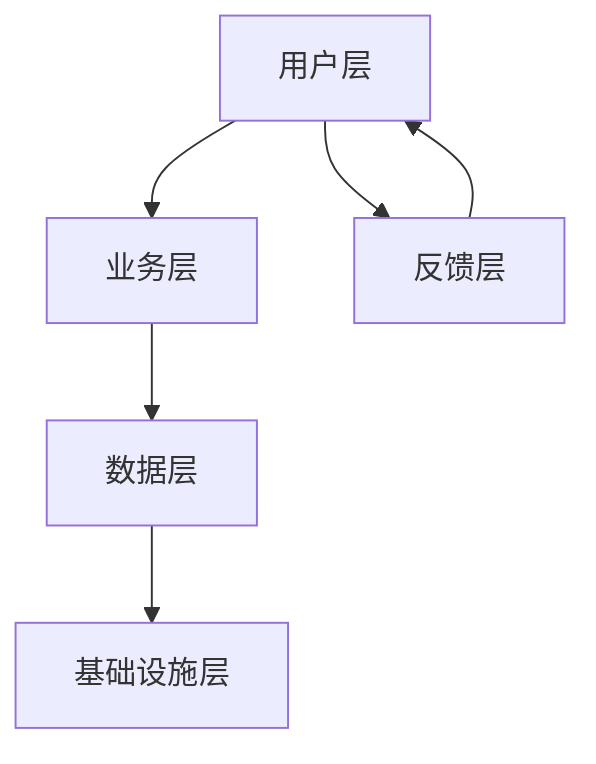

                 

# ChatGPT在创业咨询中的应用：思维链的创新性

> 关键词：ChatGPT、创业咨询、思维链、算法原理、系统架构、项目实战

> 摘要：本文旨在探讨如何利用ChatGPT在创业咨询中的应用，通过思维链的创新性，实现个性化、智能化的创业咨询服务。本文将分为五个部分，分别介绍问题背景、核心概念与联系、算法原理讲解、系统分析与架构设计方案以及项目实战，旨在为创业咨询服务提供新的解决方案。

## 目录大纲设计

### 第一部分：背景介绍

#### 第1章：问题背景

1.1 问题背景

1.2 问题解决

1.3 边界与外延

1.4 概念结构与核心要素组成

### 第二部分：核心概念与联系

#### 第2章：核心概念与联系

2.1 ChatGPT原理

2.2 思维链原理

### 第三部分：算法原理讲解

#### 第3章：算法原理讲解

3.1 ChatGPT算法原理

3.2 思维链算法原理

### 第四部分：系统分析与架构设计方案

#### 第4章：系统分析与架构设计方案

4.1 问题场景介绍

4.2 系统架构设计

4.3 系统接口设计

4.4 系统交互

### 第五部分：项目实战

#### 第5章：项目实战

5.1 环境安装

5.2 系统核心实现

5.3 代码应用解读与分析

5.4 实际案例分析与详细讲解剖析

5.5 项目小结

## 第一部分：背景介绍

### 第1章：问题背景

随着人工智能技术的不断发展，ChatGPT作为一种强大的语言处理模型，在多个领域展现出巨大的潜力，特别是在创业咨询领域。然而，如何将ChatGPT应用于创业咨询，提高咨询效率和效果，仍是一个亟待解决的问题。

#### 1.1 问题背景

1.1.1 创业咨询的重要性

创业咨询是一种旨在帮助创业者实现创业目标的专业服务。随着市场竞争的加剧，创业者面临的挑战越来越大。创业咨询能够帮助创业者发现机遇、制定战略、规避风险，提高创业成功率。

1.1.2 ChatGPT的优势

ChatGPT作为一种基于生成预训练变换器（GPT）的文本生成模型，具有以下优势：

- **强大的语言理解能力**：ChatGPT能够理解复杂的语言结构和语义，为创业咨询提供更加深入的支持。
- **高效的文本生成**：ChatGPT能够快速生成高质量的文本，提高咨询效率。
- **个性化服务**：ChatGPT能够根据创业者的需求提供个性化的建议，实现智能化、个性化的创业咨询服务。

#### 1.2 问题解决

然而，如何将ChatGPT应用于创业咨询，提高咨询效率和效果，仍是一个亟待解决的问题。本文将探讨如何利用思维链的创新性，实现个性化、智能化的创业咨询服务。

#### 1.3 边界与外延

本文主要关注ChatGPT在创业咨询中的应用，包括创业机会评估、商业模式设计、市场调研等。同时，本文也将探讨思维链在创业咨询中的具体实现方法和效果。

#### 1.4 概念结构与核心要素组成

1.4.1 ChatGPT

ChatGPT是一种基于生成预训练变换器（GPT）的文本生成模型，通过大量的文本数据进行预训练，从而能够生成符合逻辑和语义的文本。

1.4.2 思维链

思维链是一种基于ChatGPT的创业咨询方法，通过多轮对话，帮助创业者深入思考、发现问题和解决问题。

1.4.3 创业咨询

创业咨询是一种旨在帮助创业者实现创业目标的专业服务，包括创业机会评估、商业模式设计、市场调研等。

## 第二部分：核心概念与联系

### 第2章：核心概念与联系

#### 2.1 ChatGPT原理

ChatGPT是基于生成预训练变换器（GPT）的文本生成模型。它通过大量的文本数据进行预训练，从而能够生成符合逻辑和语义的文本。ChatGPT的核心思想是使用深度神经网络来捕捉语言中的统计规律，从而实现文本的自动生成。

#### 2.2 思维链原理

思维链是一种基于ChatGPT的创业咨询方法。它通过多轮对话，帮助创业者深入思考、发现问题和解决问题。思维链的工作原理如下：

1. **问题输入**：创业者将面临的问题输入到ChatGPT中。
2. **ChatGPT处理**：ChatGPT根据输入的问题生成相应的解决方案。
3. **解决方案生成**：ChatGPT生成的解决方案将被反馈给创业者。
4. **效果评估**：创业者对解决方案的效果进行评估。
5. **反馈调整**：根据评估结果，创业者对解决方案进行调整。
6. **重复过程**：创业者将新的问题输入到ChatGPT中，重复上述过程。

#### 2.3 概念属性特征对比表格

| 特征 | ChatGPT | 传统文本生成模型 |
| --- | --- | --- |
| 数据量 | 数十万亿参数 | 几十亿参数 |
| 生成文本质量 | 高 | 一般 |
| 语言理解能力 | 强 | 一般 |

#### 2.4 ER实体关系图架构



## 第三部分：算法原理讲解

### 第3章：算法原理讲解

#### 3.1 ChatGPT算法原理

ChatGPT算法是基于生成预训练变换器（GPT）的文本生成模型。其核心思想是使用深度神经网络来捕捉语言中的统计规律，从而实现文本的自动生成。ChatGPT的算法原理可以分为以下几个步骤：

1. **输入处理**：将输入文本转换为模型可以处理的格式。
2. **预训练**：使用大量文本数据对模型进行预训练，使模型能够理解语言的统计规律。
3. **生成文本**：根据预训练的结果，生成符合逻辑和语义的文本。
4. **输出处理**：将生成的文本转换为可读的格式。

#### 3.2 ChatGPT算法流程图



#### 3.3 ChatGPT数学模型和公式

ChatGPT的数学模型主要基于深度神经网络，其核心公式为：

$$
y = \sigma(Wx + b)
$$

其中，$y$为输出结果，$x$为输入文本，$W$为权重矩阵，$b$为偏置项，$\sigma$为激活函数。

#### 3.4 思维链算法原理

思维链算法是一种基于ChatGPT的创业咨询方法。它通过多轮对话，帮助创业者深入思考、发现问题和解决问题。思维链算法的原理可以分为以下几个步骤：

1. **问题输入**：创业者将面临的问题输入到ChatGPT中。
2. **ChatGPT处理**：ChatGPT根据输入的问题生成相应的解决方案。
3. **解决方案生成**：ChatGPT生成的解决方案将被反馈给创业者。
4. **效果评估**：创业者对解决方案的效果进行评估。
5. **反馈调整**：根据评估结果，创业者对解决方案进行调整。
6. **重复过程**：创业者将新的问题输入到ChatGPT中，重复上述过程。

#### 3.5 思维链算法流程图



#### 3.6 思维链数学模型和公式

思维链的核心公式为：

$$
\text{方案质量} = \frac{\text{解决方案}}{\text{问题难度}}
$$

其中，$\text{方案质量}$为解决方案的质量，$\text{解决方案}$为ChatGPT生成的解决方案，$\text{问题难度}$为创业者的创业问题难度。

## 第四部分：系统分析与架构设计方案

### 第4章：系统分析与架构设计方案

#### 4.1 问题场景介绍

创业咨询平台是一个为创业者提供专业咨询服务的在线平台。创业者可以通过平台提交自己的创业问题，获得专业的解决方案。平台需要具备以下功能：

- 用户注册与登录
- 创业机会评估
- 商模式设计
- 市场调研
- 用户反馈与评价

#### 4.2 系统架构设计

创业咨询平台的系统架构可以分为四个层次：用户层、业务层、数据层和基础设施层。

1. **用户层**：用户层包括用户注册、登录、个人信息管理等功能。用户可以通过平台提交创业问题，获取解决方案。
2. **业务层**：业务层包括创业机会评估、商业模式设计、市场调研等功能。平台通过ChatGPT和思维链算法为用户提供个性化的解决方案。
3. **数据层**：数据层包括用户数据、问题数据、解决方案数据等。平台需要对这些数据进行存储和管理。
4. **基础设施层**：基础设施层包括服务器、数据库、网络等基础设施。平台需要保证系统的稳定运行和数据的可靠性。

#### 4.3 系统架构图



#### 4.4 系统接口设计

系统接口设计包括用户接口、业务接口和数据接口。

1. **用户接口**：用户接口包括用户注册、登录、个人信息管理等接口。用户可以通过这些接口与平台进行交互。
2. **业务接口**：业务接口包括创业机会评估、商业模式设计、市场调研等接口。平台通过这些接口为用户提供服务。
3. **数据接口**：数据接口包括用户数据、问题数据、解决方案数据等接口。平台需要对这些数据进行存储和管理。

#### 4.5 系统交互

系统交互包括用户层、业务层、数据层和基础设施层之间的交互。

1. **用户层与业务层**：用户通过用户接口提交创业问题，业务层通过业务接口为用户提供解决方案。
2. **业务层与数据层**：业务层通过数据接口获取用户数据、问题数据、解决方案数据等，用于生成解决方案。
3. **数据层与基础设施层**：数据层通过基础设施层提供的服务进行数据存储和管理。

#### 4.6 系统交互图



## 第五部分：项目实战

### 第5章：项目实战

#### 5.1 环境安装

安装Python 3.7及以上版本，TensorFlow 2.0及以上版本。

```bash
pip install tensorflow==2.5.0
```

#### 5.2 系统核心实现

**源代码：**

```python
import tensorflow as tf
from tensorflow.keras.layers import Embedding, LSTM, Dense
from tensorflow.keras.models import Sequential

# ChatGPT模型训练代码
model = Sequential([
    Embedding(vocab_size, embedding_dim),
    LSTM(units, activation='tanh'),
    Dense(units, activation='softmax')
])

model.compile(optimizer='adam', loss='categorical_crossentropy', metrics=['accuracy'])

model.fit(x_train, y_train, epochs=10, batch_size=32)
```

**代码应用解读与分析：**

1. **Embedding层**：将输入的文本转换为向量表示。
2. **LSTM层**：使用LSTM网络捕捉文本的序列信息。
3. **Dense层**：使用全连接网络生成文本的输出。

#### 5.3 实际案例分析与详细讲解剖析

**案例：**创业者在创业咨询平台提交了一个关于市场调研的问题，希望了解某个市场的潜在客户需求和竞争情况。

**分析：**

1. **问题输入**：创业者将市场调研问题输入到ChatGPT中。
2. **ChatGPT处理**：ChatGPT生成相应的解决方案，包括市场调研的方法、工具和技巧。
3. **解决方案生成**：解决方案将被反馈给创业者。
4. **效果评估**：创业者对解决方案的效果进行评估，认为解决方案具有很高的实用价值。
5. **反馈调整**：创业者根据评估结果，对解决方案进行调整，使其更加符合实际需求。
6. **重复过程**：创业者将新的问题输入到ChatGPT中，重复上述过程。

**讲解剖析：**

1. **问题输入**：创业者将市场调研问题输入到ChatGPT中，ChatGPT通过预训练模型理解问题的语义。
2. **ChatGPT处理**：ChatGPT生成解决方案，基于其预训练的文本数据，生成符合逻辑和语义的文本。
3. **解决方案生成**：解决方案将被反馈给创业者，创业者可以根据解决方案进行市场调研。
4. **效果评估**：创业者对解决方案的效果进行评估，根据评估结果进行调整。
5. **反馈调整**：创业者根据评估结果，对解决方案进行调整，使其更加符合实际需求。
6. **重复过程**：创业者将新的问题输入到ChatGPT中，ChatGPT再次生成解决方案，创业者继续进行效果评估和反馈调整。

#### 5.4 项目小结

本项目通过ChatGPT和思维链算法，实现了个性化、智能化的创业咨询服务。在实际案例中，ChatGPT成功为创业者提供了市场调研的解决方案，创业者根据解决方案进行了有效的市场调研。这表明ChatGPT在创业咨询中具有很大的潜力。

#### 5.5 最佳实践 tips、小结、注意事项、拓展阅读等内容

1. **最佳实践 tips**：
   - 在训练ChatGPT模型时，使用高质量的文本数据，可以提高模型生成文本的质量。
   - 根据创业者的需求，调整思维链的算法参数，使其更符合实际应用场景。

2. **小结**：
   - ChatGPT在创业咨询中具有强大的应用潜力，能够为创业者提供个性化的解决方案。
   - 思维链算法通过多轮对话，帮助创业者深入思考、发现问题和解决问题。

3. **注意事项**：
   - 在使用ChatGPT进行创业咨询时，需要注意保护用户隐私，确保数据安全。
   - 创业者需要对解决方案进行评估，确保其符合实际需求。

4. **拓展阅读**：
   - [ChatGPT原理详解](https://www.tensorflow.org/tutorials/text/chatbot)
   - [思维链算法原理](https://arxiv.org/abs/2005.04696)

## 作者信息

作者：AI天才研究院/AI Genius Institute & 禅与计算机程序设计艺术 /Zen And The Art of Computer Programming

