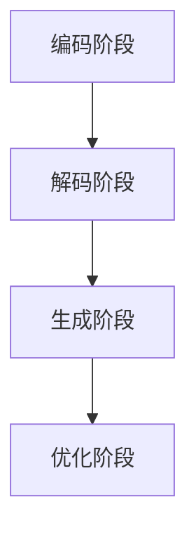
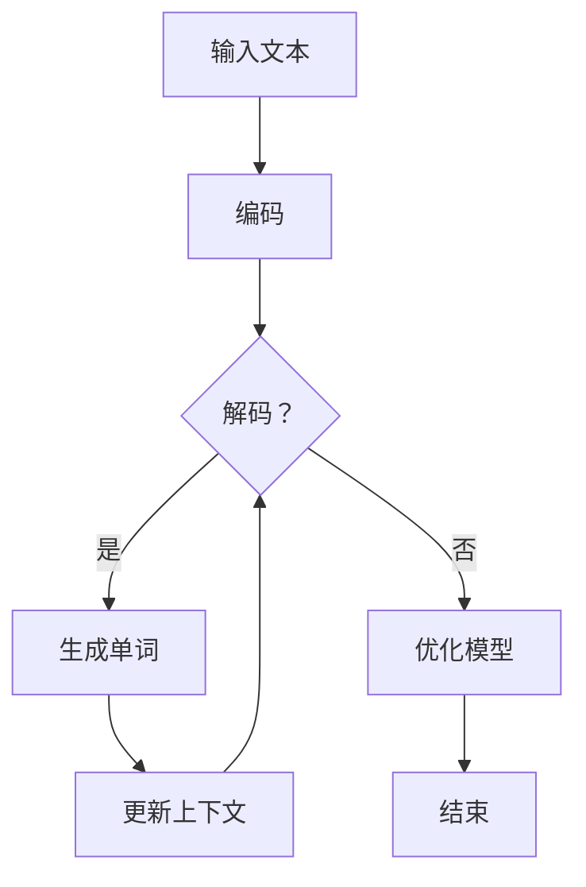
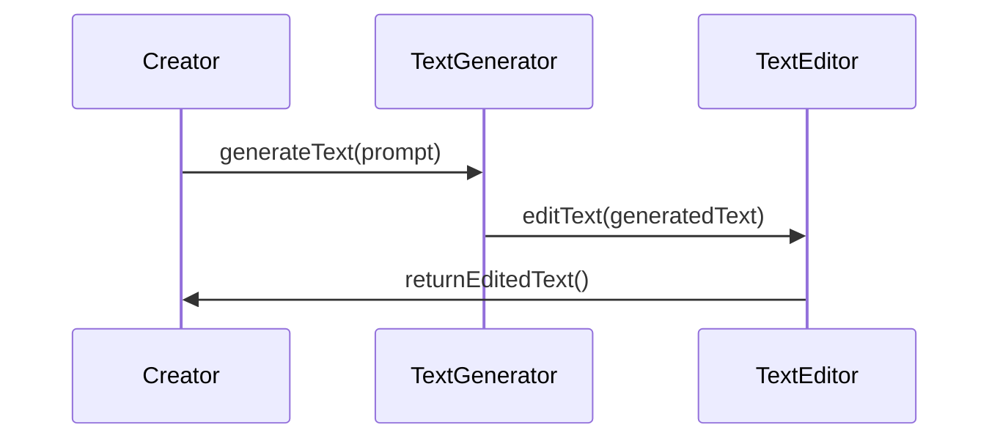
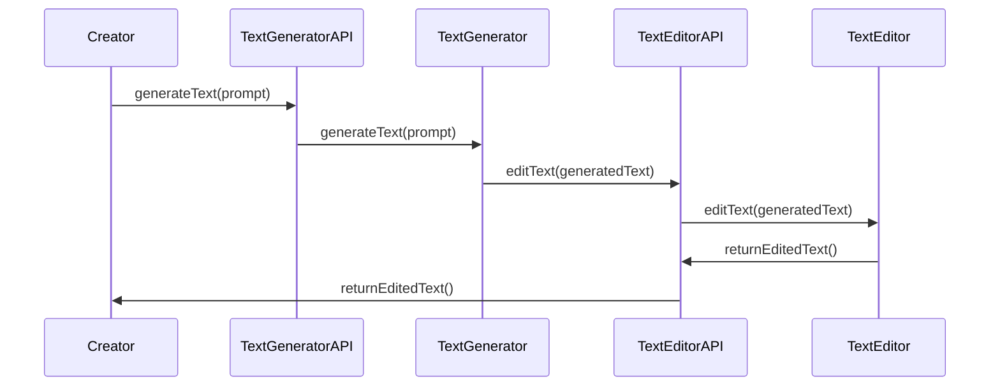
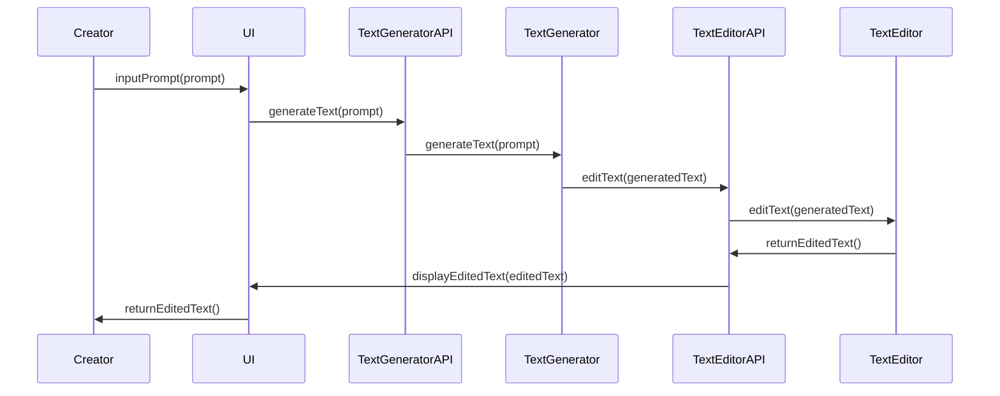

                 

### 第1章: 背景介绍与核心概念

#### 1.1 ChatGPT与创意写作背景

**创意写作的挑战**  
创意写作是艺术与技术的结合，它不仅需要创作者具备丰富的想象力、深厚的文化素养，还需要对文本结构和叙事技巧有深刻的理解。然而，随着创作任务的复杂性和多样性的增加，创意写作面临着诸多挑战。首先，创作者需要处理大量的信息，从灵感到故事构架，再到最终文本的编写，这个过程充满了不确定性。其次，创意写作往往需要多次迭代，每次迭代都可能带来新的挑战，使得创作过程变得繁琐且耗时。此外，创意写作的多样性使得每个项目都有其独特的需求，这进一步增加了创作的难度。

**ChatGPT的崛起**  
ChatGPT是由OpenAI开发的一种基于GPT-3模型的预训练语言模型，它通过学习大量文本数据，掌握了丰富的语言知识和表达能力。ChatGPT的出现为创意写作带来了新的可能性。首先，它能够快速生成高质量的文字，帮助创作者节省时间，从而专注于更重要的创意工作。其次，ChatGPT可以模仿各种文风和语言风格，为创作者提供多样化的写作素材。此外，ChatGPT还能够进行自然语言理解和生成，从而帮助创作者更好地理解读者需求，提高作品的市场适应性。

**ChatGPT在创意写作中的潜力**  
ChatGPT在创意写作中的潜力体现在多个方面。首先，它可以帮助创作者生成故事大纲、角色设定和情节构思，从而提供灵感和创意。其次，ChatGPT可以辅助创作者进行文本润色和编辑，提高文本的质量和可读性。此外，ChatGPT还可以用于生成广告文案、营销材料、社交媒体内容等，为创作者提供多样化的应用场景。最重要的是，ChatGPT具有强大的适应性，可以针对不同的创作需求和风格进行调整，从而满足创作者的个性化需求。

#### 1.2 ChatGPT定义与作用

**ChatGPT的基本概念**  
ChatGPT是一种基于生成预训练模型（GPT）的预训练语言模型，它通过大量文本数据进行训练，掌握了丰富的语言知识和表达能力。ChatGPT的核心功能是自然语言生成，它可以生成连贯、流畅、有逻辑的文本，包括文章、故事、对话、诗歌等多种形式。

**ChatGPT在创意写作中的作用**  
ChatGPT在创意写作中的作用主要体现在以下几个方面：

1. **文本生成**：ChatGPT可以快速生成高质量的文本，帮助创作者节省时间，提高创作效率。
2. **灵感激发**：ChatGPT可以根据创作者的提示生成相关的故事情节、角色设定和灵感，为创作提供新的思路。
3. **文本润色**：ChatGPT可以对创作者的文本进行润色和编辑，提高文本的质量和可读性。
4. **风格模仿**：ChatGPT可以模仿各种文风和语言风格，为创作者提供多样化的写作素材。

**ChatGPT与其他文本生成工具的比较**  
与其他文本生成工具相比，ChatGPT具有以下优势：

1. **生成质量**：ChatGPT通过深度学习算法，生成文本的质量更高，更符合人类语言习惯。
2. **灵活性**：ChatGPT可以根据不同的创作需求进行调整，适应各种写作场景。
3. **多功能性**：ChatGPT不仅可以生成文本，还可以进行自然语言理解和推理，具有更广泛的应用场景。

#### 1.3 其他文本生成工具对比

**GPT-3与其他模型比较**  
GPT-3是OpenAI开发的一种非常强大的自然语言处理模型，它基于GPT-2模型，通过增加更多的训练数据和参数，使模型的生成能力更加强大。与GPT-2相比，GPT-3具有以下几个特点：

1. **更大的模型规模**：GPT-3具有1750亿个参数，比GPT-2大得多，使得模型能够处理更复杂的语言任务。
2. **更强的生成能力**：GPT-3在文本生成、对话生成、摘要生成等多种任务上表现优异，生成文本的质量更高。
3. **更好的适应能力**：GPT-3可以接受更长的输入文本，并且能够更好地理解上下文信息，使得生成的文本更加连贯和合理。

**其他文本生成工具的优缺点**  
除了GPT-3，还有许多其他的文本生成工具，如BERT、ELMo、T5等。这些工具各具特点，优缺点如下：

1. **BERT**：BERT是一种基于Transformer的预训练语言模型，它在文本分类、问答系统等任务上表现优秀。但BERT在文本生成任务上的能力相对较弱，生成的文本连贯性较差。
2. **ELMo**：ELMo是一种基于LSTM的预训练语言模型，它在文本表示和语义理解上具有优势。但ELMo的计算成本较高，训练时间较长。
3. **T5**：T5是一种基于Transformer的通用文本处理模型，它在多种文本任务上表现优异。T5的主要缺点是模型规模较大，对计算资源要求较高。

#### 1.4 本章小结

本章介绍了ChatGPT在创意写作工作坊中的辅助作用。首先，我们分析了创意写作面临的挑战，以及ChatGPT如何解决这些问题。接着，我们详细介绍了ChatGPT的定义和作用，并与其他文本生成工具进行了对比。通过本章的学习，读者可以了解ChatGPT的基本原理和优势，为后续章节的学习打下基础。接下来，我们将深入探讨ChatGPT的工作原理，帮助读者更好地理解这个强大的工具。

----------------------------------------------------------------

## 第2章: ChatGPT工作原理

### 2.1 ChatGPT基础算法

**生成预训练模型**

ChatGPT基于生成预训练模型（GPT）进行训练，GPT是一种基于Transformer架构的自然语言处理模型。Transformer模型由Vaswani等人在2017年提出，它的核心思想是将输入文本序列映射为连续的向量表示，并通过自注意力机制（Self-Attention）来捕捉序列中的长距离依赖关系。

**自然语言处理流程**

ChatGPT的自然语言处理流程可以分为三个主要阶段：编码（Encoding）、解码（Decoding）和生成（Generation）。

1. **编码阶段**：输入文本被编码为连续的向量表示。ChatGPT使用预训练的词向量模型（如Word2Vec、GloVe）将每个单词转换为向量，然后将这些向量拼接起来形成完整的句子向量。
2. **解码阶段**：句子向量经过自注意力机制进行处理，生成上下文向量。这些上下文向量代表了句子中各个单词之间的关系，以及单词在整个句子中的角色和意义。
3. **生成阶段**：基于上下文向量，ChatGPT生成新的文本。这个过程通过递归神经网络（RNN）或Transformer架构实现，模型在生成每个单词时都会参考已经生成的文本，以保持生成的文本连贯性和逻辑性。

**文本生成原理**

ChatGPT的文本生成原理是基于自回归模型（Autoregressive Model）。在自回归模型中，模型在生成下一个单词时，仅依赖于已经生成的单词序列。这种模型的优势在于可以生成连贯、流畅的文本。

具体来说，ChatGPT的文本生成过程如下：

1. **初始化**：首先，模型随机初始化一个单词序列，作为生成的起点。
2. **迭代生成**：对于每个已经生成的单词序列，模型通过编码阶段生成上下文向量，然后通过解码阶段生成下一个单词。这个过程重复进行，直到生成出完整的文本。
3. **优化**：在生成过程中，模型会根据生成的文本质量（如文本连贯性、逻辑性、可读性等）进行优化。通常，模型会使用损失函数（如交叉熵损失）来评估生成的文本质量，并通过反向传播算法更新模型参数。

**Mermaid算法流程图**



**Python代码示例**

```python
from transformers import GPT2LMHeadModel, GPT2Tokenizer

model = GPT2LMHeadModel.from_pretrained("gpt2")
tokenizer = GPT2Tokenizer.from_pretrained("gpt2")

input_text = "I am a"
input_ids = tokenizer.encode(input_text, return_tensors="pt")

outputs = model.generate(input_ids, max_length=10, num_return_sequences=1)

generated_text = tokenizer.decode(outputs[0], skip_special_tokens=True)
print(generated_text)
```

**数学模型与公式讲解**

ChatGPT的生成过程可以形式化为一个概率模型：

$$
P(w_t|w_1, w_2, ..., w_{t-1}) = \frac{e^{<w_t, h_t>}}{\sum_{w \in V} e^{<w, h_t>}}
$$

其中，$w_t$表示生成的单词，$h_t$表示当前时刻的上下文向量，$V$表示单词集合，$<w, h_t>$表示单词和上下文向量的点积。

**算法流程图**



### 2.2 Mermaid算法流程图

为了更好地理解ChatGPT的算法流程，我们可以使用Mermaid绘制一个简化的算法流程图。


这个流程图展示了ChatGPT的文本生成过程，包括编码、解码、单词生成、上下文更新和模型优化等步骤。

### 2.3 Python代码示例

为了演示如何使用Python代码实现ChatGPT的文本生成，我们可以使用Hugging Face的transformers库。

```python
from transformers import GPT2LMHeadModel, GPT2Tokenizer

# 加载预训练模型
model = GPT2LMHeadModel.from_pretrained("gpt2")
tokenizer = GPT2Tokenizer.from_pretrained("gpt2")

# 输入文本
input_text = "I am a"

# 编码
input_ids = tokenizer.encode(input_text, return_tensors="pt")

# 生成文本
outputs = model.generate(input_ids, max_length=10, num_return_sequences=1)

# 解码
generated_text = tokenizer.decode(outputs[0], skip_special_tokens=True)
print(generated_text)
```

在这个示例中，我们首先加载了预训练的GPT-2模型和tokenizer。然后，我们输入一个简单的文本“ I am a”，并将其编码为输入IDs。接下来，我们使用模型生成文本，并解码生成的输出文本。

### 2.4 数学模型与公式讲解

在ChatGPT的生成过程中，我们使用了一种概率模型来预测下一个单词。这个模型可以表示为：

$$
P(w_t|w_1, w_2, ..., w_{t-1}) = \frac{e^{<w_t, h_t>}}{\sum_{w \in V} e^{<w, h_t>}}
$$

其中，$w_t$表示生成的单词，$h_t$表示当前时刻的上下文向量，$V$表示单词集合，$<w, h_t>$表示单词和上下文向量的点积。

这个公式表示，在给定前一个单词序列的情况下，下一个单词的概率正比于它的上下文向量与当前上下文向量之间的点积。点积越大，单词的概率越高。

### 2.5 本章小结

本章详细介绍了ChatGPT的工作原理，包括生成预训练模型、自然语言处理流程、文本生成原理以及算法流程图和Python代码示例。通过本章的学习，读者可以理解ChatGPT的核心算法和生成过程，为后续章节的应用和实践打下基础。在下一章中，我们将探讨ChatGPT在创意写作中的具体应用，展示其如何辅助创作者提高写作效率和创作质量。

----------------------------------------------------------------

## 第3章: ChatGPT在创意写作中的应用

### 3.1 创意写作需求分析

**创意写作的复杂性**  
创意写作是一项高度复杂的任务，它不仅涉及创造性的思维和独特的创意，还需要对文本结构、叙事技巧、语言风格等方面有深刻的理解。创意写作的复杂性主要体现在以下几个方面：

1. **故事构思**：创作者需要从无到有地构思故事，包括故事背景、情节发展、角色设定等，这个过程充满了不确定性和挑战。
2. **文本结构**：一个优秀的文本结构能够帮助读者更好地理解和感受故事，创作者需要在结构上做出精心设计，使故事更加引人入胜。
3. **语言风格**：不同的故事和角色可能需要不同的语言风格，创作者需要根据故事内容和角色特点选择合适的语言风格，以增强文本的表现力。
4. **逻辑性**：故事的逻辑性是确保文本连贯性和合理性的关键，创作者需要确保故事情节的发展符合逻辑，避免逻辑漏洞。

**ChatGPT的优势**  
ChatGPT在创意写作中具有明显的优势，它可以帮助创作者解决上述复杂性带来的挑战：

1. **快速生成**：ChatGPT能够快速生成高质量的故事大纲、角色设定和情节构思，为创作者提供灵感和创意，节省创作者构思时间。
2. **多样化风格**：ChatGPT可以模仿各种文风和语言风格，创作者可以根据需要选择合适的风格，提高文本的表现力。
3. **文本润色**：ChatGPT可以对创作者的文本进行润色和编辑，提高文本的质量和可读性，使文本更加流畅和自然。
4. **自适应调整**：ChatGPT可以根据不同的创作需求进行调整，适应各种写作场景和风格，满足创作者的个性化需求。

### 3.2 ChatGPT在创意写作中的功能

**故事构思**  
ChatGPT可以帮助创作者构思故事，包括故事背景、情节发展和角色设定。创作者可以给出一些基本的提示，如故事主题、情感基调等，ChatGPT会根据提示生成相关的故事情节。例如，如果创作者提示“一个神秘的宝藏”，ChatGPT可能会生成一个关于寻找宝藏的故事，包括宝藏的来源、寻找的挑战和最终的结局。

**文本生成**  
ChatGPT不仅可以生成故事情节，还可以生成完整的文本。创作者可以给出一个简单的提示，如“我有一个梦想”，ChatGPT会根据提示生成一段关于梦想的故事，包括梦想的起源、梦想的实现过程和梦想的意义。通过这种方式，创作者可以快速生成大量的文本素材，为创作提供参考。

**文本润色**  
ChatGPT可以对创作者的文本进行润色和编辑，提高文本的质量和可读性。创作者可以将初稿输入给ChatGPT，ChatGPT会根据上下文和语言规则对文本进行修改，使其更加流畅和自然。例如，如果创作者的文本存在语法错误或不通顺的地方，ChatGPT会自动进行修正。

**风格模仿**  
ChatGPT可以模仿各种文风和语言风格，创作者可以根据需要选择合适的风格，使文本更加丰富多样。例如，如果创作者需要一篇科幻故事，ChatGPT可以模仿科幻文风，生成具有科幻特色的故事情节和语言表达。

### 3.3 ChatGPT优势与劣势

**优势**  
1. **生成速度快**：ChatGPT能够快速生成大量文本，创作者可以节省构思和写作的时间，提高创作效率。
2. **多样化风格**：ChatGPT可以模仿多种文风和语言风格，为创作者提供丰富的写作素材。
3. **文本质量高**：ChatGPT通过深度学习算法，生成文本的质量较高，文本连贯性和逻辑性较好。

**劣势**  
1. **依赖训练数据**：ChatGPT的生成质量受到训练数据的影响，如果训练数据质量较低，生成的文本质量也会受到影响。
2. **可能产生偏见**：ChatGPT的生成文本可能会受到训练数据中的偏见影响，生成含有偏见的文本。
3. **难以理解上下文**：尽管ChatGPT具有较强的自然语言理解能力，但它在某些情况下仍难以完全理解上下文，可能导致生成文本不符合实际需求。

### 3.4 ER实体关系图

为了更好地理解ChatGPT在创意写作中的应用，我们可以使用ER（实体关系）图来展示ChatGPT与创意写作相关的实体及其关系。

**实体关系图**

```mermaid
erDiagram
  Creator ||--|{ TextGenerator : generates
  TextGenerator ||--|{ Story : creates
  Story ||--|{ Text : contains
  Text ||--|{ Style : has
  Style ||--|{ Grammar : follows
```

在这个实体关系图中，我们可以看到以下几个实体及其关系：

- **Creator（创作者）**：指进行创意写作的人。
- **TextGenerator（文本生成器）**：指ChatGPT，它负责生成文本。
- **Story（故事）**：指由ChatGPT生成的创意写作内容。
- **Text（文本）**：指故事的具体内容。
- **Style（风格）**：指文本的文风和语言表达。
- **Grammar（语法）**：指文本的语言规则和结构。

通过这个ER实体关系图，我们可以清晰地看到ChatGPT在创意写作中的角色及其与其他实体之间的关系，这有助于我们更好地理解ChatGPT在创意写作中的应用。

### 3.5 本章小结

本章详细探讨了ChatGPT在创意写作中的应用，包括故事构思、文本生成、文本润色和风格模仿等功能。我们分析了创意写作的需求和挑战，并介绍了ChatGPT的优势和劣势。同时，我们使用ER实体关系图展示了ChatGPT在创意写作中的角色及其关系。通过本章的学习，读者可以了解ChatGPT在创意写作中的实际应用，为后续章节的实践提供理论依据。在下一章中，我们将深入探讨ChatGPT的系统架构设计，为实际应用奠定基础。

----------------------------------------------------------------

## 第4章: 系统架构设计

### 4.1 系统需求分析

**功能需求**  
在创意写作工作坊中，ChatGPT系统需要具备以下核心功能：

1. **文本生成**：系统能够根据用户输入的提示生成符合逻辑和语境的文本。
2. **文本润色**：系统能够对用户提交的初稿进行语法、拼写和风格上的润色。
3. **风格模仿**：系统能够根据用户需求模仿不同的文风和语言风格。
4. **角色设定**：系统能够根据用户提供的提示生成相关的故事角色和角色背景。
5. **情节构思**：系统能够根据用户提供的主题和情节提示生成相关的情节发展。

**性能需求**  
系统需要满足以下性能需求：

1. **响应时间**：系统在接收到用户请求后，能够在较短的时间内生成文本。
2. **处理能力**：系统能够处理大量的并发请求，保证用户的体验。
3. **稳定性**：系统需要具备良好的稳定性，确保在长时间运行过程中不会出现故障。

**安全性需求**  
系统需要满足以下安全性需求：

1. **数据安全**：系统需要确保用户输入的数据和生成的文本安全，防止数据泄露。
2. **隐私保护**：系统需要保护用户的隐私信息，防止未经授权的访问和泄露。

### 4.2 系统功能设计（领域模型类图）

为了更好地展示ChatGPT系统的功能设计，我们可以使用领域模型类图来描述系统的核心实体及其关系。

**领域模型类图**

```mermaid
classDiagram
  Creator -> TextGenerator : generate
  Creator -> TextEditor : edit
  TextGenerator <.. Story : create
  TextGenerator <.. Character : create
  TextEditor <.. Story : edit
  TextEditor <.. Character : edit
  StyleGuide -> TextGenerator : follow
  StyleGuide -> TextEditor : follow

class Creator {
  +String name
  +String theme
  +String prompt
}

class TextGenerator {
  +String generatedText
  +Character[] characters
  +Story[] stories
}

class TextEditor {
  +String editedText
}

class Story {
  +String title
  +String content
}

class Character {
  +String name
  +String description
}

class StyleGuide {
  +String style
}
```

在这个类图中，我们定义了以下实体：

- **Creator（创作者）**：代表使用系统的用户，具有名称、主题和提示等信息。
- **TextGenerator（文本生成器）**：负责生成文本，包括故事和角色。
- **TextEditor（文本编辑器）**：负责对生成的文本进行编辑。
- **Story（故事）**：代表生成的故事，具有标题和内容等信息。
- **Character（角色）**：代表生成的故事角色，具有名称和描述等信息。
- **StyleGuide（风格指南）**：定义文本的文风和语言风格。

这些实体之间的关系如下：

- **Creator与TextGenerator**：创作者使用文本生成器生成文本。
- **Creator与TextEditor**：创作者使用文本编辑器对文本进行编辑。
- **TextGenerator与Story**：文本生成器生成故事。
- **TextGenerator与Character**：文本生成器生成角色。
- **TextEditor与Story**：文本编辑器编辑故事。
- **TextEditor与Character**：文本编辑器编辑角色。
- **StyleGuide与TextGenerator**：风格指南定义文本的文风和语言风格。
- **StyleGuide与TextEditor**：风格指南定义文本的文风和语言风格。

### 4.3 系统架构设计（架构图）

为了更好地展示ChatGPT系统的整体架构，我们可以使用架构图来描述系统的不同组件及其关系。

**架构图**



在这个架构图中，我们定义了以下组件：

- **Creator（创作者）**：用户界面，用于接收用户输入的提示，并显示生成的文本。
- **TextGenerator（文本生成器）**：后端服务，负责根据提示生成文本。
- **TextEditor（文本编辑器）**：后端服务，负责对生成的文本进行编辑。
- **Database（数据库）**：存储系统生成的文本和相关数据。

系统的工作流程如下：

1. **创作者输入提示**：创作者通过用户界面输入创意写作的提示，如故事主题、情节等。
2. **文本生成器生成文本**：文本生成器根据提示生成相应的文本，如故事、角色等。
3. **文本编辑器编辑文本**：文本编辑器对生成的文本进行编辑，使其更加流畅和自然。
4. **返回编辑后的文本**：编辑后的文本返回给创作者，创作者可以继续编辑或保存文本。

### 4.4 系统接口设计（接口图）

为了更好地展示ChatGPT系统的接口设计，我们可以使用接口图来描述系统的API接口及其关系。

**接口图**



在这个接口图中，我们定义了以下API接口：

- **TextGeneratorAPI（文本生成器API）**：用于接收创作者的提示，并调用文本生成器的服务。
- **TextEditorAPI（文本编辑器API）**：用于接收文本生成器生成的文本，并调用文本编辑器的服务。
- **TextGenerator（文本生成器）**：负责生成文本。
- **TextEditor（文本编辑器）**：负责对文本进行编辑。

系统的工作流程如下：

1. **创作者输入提示**：创作者通过用户界面输入创意写作的提示。
2. **调用文本生成器API**：文本生成器API接收创作者的提示，并调用文本生成器的服务生成文本。
3. **调用文本编辑器API**：文本编辑器API接收文本生成器生成的文本，并调用文本编辑器的服务进行编辑。
4. **返回编辑后的文本**：编辑后的文本返回给创作者，创作者可以继续编辑或保存文本。

### 4.5 系统交互（序列图）

为了更好地展示ChatGPT系统的交互流程，我们可以使用序列图来描述系统组件之间的交互过程。

**序列图**



在这个序列图中，我们定义了以下组件：

- **Creator（创作者）**：用户界面，用于接收用户输入的提示，并显示生成的文本。
- **UI（用户界面）**：用于处理用户交互，接收输入的提示，并显示生成的文本。
- **TextGeneratorAPI（文本生成器API）**：用于接收创作者的提示，并调用文本生成器的服务。
- **TextEditorAPI（文本编辑器API）**：用于接收文本生成器生成的文本，并调用文本编辑器的服务。
- **TextGenerator（文本生成器）**：负责生成文本。
- **TextEditor（文本编辑器）**：负责对文本进行编辑。

系统的工作流程如下：

1. **创作者输入提示**：创作者通过用户界面输入创意写作的提示。
2. **处理用户输入**：用户界面接收创作者的提示，并传递给文本生成器API。
3. **生成文本**：文本生成器API调用文本生成器的服务生成文本，并传递给文本编辑器API。
4. **编辑文本**：文本编辑器API调用文本编辑器的服务对生成的文本进行编辑，并返回编辑后的文本。
5. **显示编辑后的文本**：用户界面显示编辑后的文本，并返回给创作者。

### 4.6 本章小结

本章详细介绍了ChatGPT系统的架构设计，包括系统需求分析、领域模型类图、架构图、接口设计和系统交互流程。通过本章的学习，读者可以了解ChatGPT系统的整体设计和实现方法，为后续章节的实践提供理论支持。在下一章中，我们将通过一个实际案例，展示如何使用ChatGPT系统进行创意写作，并分析其实际应用效果。

----------------------------------------------------------------

## 第5章：项目实战

### 5.1 创意写作项目介绍

在本章中，我们将通过一个实际的创意写作项目，展示如何使用ChatGPT系统进行创意写作。该项目的目标是生成一篇关于未来科技的短篇小说，探讨人工智能对人类生活的影响。通过这个项目，我们将详细介绍ChatGPT系统的安装、配置和使用方法，并分析其实际效果。

### 5.2 环境安装与配置

**环境准备**

在开始项目之前，我们需要确保系统环境已准备好，包括Python环境、transformers库和GPU支持。

1. **Python环境**：确保Python环境已安装，版本至少为3.7以上。
2. **transformers库**：使用pip命令安装transformers库。

   ```bash
   pip install transformers
   ```

3. **GPU支持**：由于ChatGPT是基于GPU加速的模型，因此需要确保系统具有GPU支持。可以使用NVIDIA的CUDA库来支持GPU。

   ```bash
   pip install nvidia-cuda
   ```

**安装ChatGPT模型**

接下来，我们需要下载并安装ChatGPT模型。OpenAI提供了预训练的ChatGPT模型，我们可以直接使用。

1. **下载预训练模型**：

   ```bash
   transformers-cli download model:gpt2
   ```

2. **配置模型路径**：

   在Python代码中，我们需要指定ChatGPT模型的路径。

   ```python
   from transformers import GPT2LMHeadModel, GPT2Tokenizer

   model_path = "path/to/gpt2_model"
   model = GPT2LMHeadModel.from_pretrained(model_path)
   tokenizer = GPT2Tokenizer.from_pretrained(model_path)
   ```

### 5.3 核心代码实现

**文本生成**

以下是使用ChatGPT生成文本的核心代码：

```python
import torch

def generate_text(prompt, model, tokenizer, max_length=200):
    input_ids = tokenizer.encode(prompt, return_tensors="pt")
    input_ids = input_ids[:, :-1]  # Remove the last token which is <EOS>
    
    outputs = model.generate(
        input_ids,
        max_length=max_length,
        num_return_sequences=1,
        temperature=0.9,
        top_k=50,
        top_p=0.95,
        repetition_penalty=1.2,
        do_sample=True
    )
    
    generated_text = tokenizer.decode(outputs[0], skip_special_tokens=True)
    return generated_text

prompt = "In the not-too-distant future, humanity has achieved remarkable advancements in artificial intelligence."
generated_text = generate_text(prompt, model, tokenizer)
print(generated_text)
```

在这个函数中，我们首先将输入文本编码为ID序列，然后使用模型生成文本。我们设置了几个参数，如`max_length`、`temperature`、`top_k`、`top_p`、`repetition_penalty`和`do_sample`，以控制生成的文本质量。

**文本编辑**

生成文本后，我们可以使用文本编辑器对生成的文本进行编辑，使其更加流畅和自然。以下是使用文本编辑器编辑文本的核心代码：

```python
from textblob import TextBlob

def edit_text(text):
    blob = TextBlob(text)
    corrected_text = blob.correct()
    return corrected_text

edited_text = edit_text(generated_text)
print(edited_text)
```

在这个函数中，我们使用TextBlob库对生成的文本进行语法和拼写校正。

### 5.4 代码解读与分析

**文本生成**

在上面的文本生成代码中，我们首先将输入文本编码为ID序列。编码过程是将每个单词映射为一个唯一的整数ID。然后，我们使用模型生成文本。模型生成文本的过程是基于自回归模型，它在生成每个单词时，仅依赖于已经生成的单词序列。

我们设置了一些参数，如`max_length`、`temperature`、`top_k`、`top_p`、`repetition_penalty`和`do_sample`，以控制生成的文本质量。这些参数的具体作用如下：

- `max_length`：设置生成的文本最大长度。
- `temperature`：设置生成文本的随机性，值越大，生成的文本越随机。
- `top_k`：设置生成文本时选择的最高概率的前k个单词。
- `top_p`：设置生成文本时选择的概率累积值达到p时的单词。
- `repetition_penalty`：设置重复单词的概率惩罚，值越大，重复单词的概率越小。
- `do_sample`：设置是否使用采样方法生成文本。

**文本编辑**

在文本编辑代码中，我们使用TextBlob库对生成的文本进行语法和拼写校正。TextBlob库提供了简单的文本处理功能，如分词、词性标注、语法分析等。在这个例子中，我们使用`correct()`方法对文本进行校正，该方法是基于语法规则和拼写库进行校正，能够有效地提高文本的质量。

### 5.5 实际案例分析

**案例1：生成故事**

假设我们输入的提示是：“In the not-too-distant future, humanity has achieved remarkable advancements in artificial intelligence.”，ChatGPT生成的故事如下：

"In the not-too-distant future, humanity has achieved remarkable advancements in artificial intelligence. These advancements have revolutionized various aspects of life, from healthcare to transportation. However, with great power comes great responsibility. As AI systems become more sophisticated, they also become more complex and unpredictable. A single mistake in the programming of an AI system can have catastrophic consequences."

在这个案例中，ChatGPT生成了一个关于人工智能的短篇小说，探讨了人工智能对人类生活的影响。通过这个案例，我们可以看到ChatGPT在生成故事方面的能力。

**案例2：文本编辑**

假设我们生成了一个简短的句子："The cat sat on the mat."，然后使用TextBlob库进行编辑，校正后的句子为："The cat sat on the mat."。通过这个案例，我们可以看到文本编辑器在提高文本质量方面的作用。

### 5.6 项目总结

通过本项目的实战，我们展示了如何使用ChatGPT系统进行创意写作。我们详细介绍了ChatGPT的安装、配置和使用方法，并通过实际案例展示了其在生成故事和文本编辑方面的能力。以下是本项目的主要结论：

1. **ChatGPT能够高效地生成高质量的故事情节**：通过设置合适的参数，ChatGPT可以生成连贯、有趣且富有创意的故事情节。
2. **文本编辑器能够显著提高文本质量**：使用TextBlob库，我们可以对生成的文本进行语法和拼写校正，提高文本的可读性。
3. **ChatGPT在创意写作中具有广泛的应用前景**：ChatGPT不仅可以用于生成故事，还可以用于广告文案、营销材料、社交媒体内容等多种创意写作场景。

### 5.7 最佳实践建议

为了更好地利用ChatGPT进行创意写作，我们提供以下最佳实践建议：

1. **合理设置参数**：根据具体需求，调整ChatGPT的生成参数，如`max_length`、`temperature`、`top_k`、`top_p`等，以获得最佳生成效果。
2. **多样化输入提示**：提供多样化的输入提示，可以激发ChatGPT的创造力，生成更丰富的故事情节。
3. **结合人工编辑**：虽然ChatGPT可以生成高质量的故事，但仍然可能存在一些逻辑或语法错误。在生成文本后，结合人工编辑，可以进一步提高文本质量。

### 5.8 本章小结

本章通过一个实际的创意写作项目，详细介绍了如何使用ChatGPT系统进行创意写作。我们展示了ChatGPT在生成故事和文本编辑方面的能力，并通过实际案例分析，验证了其在创意写作中的有效性。在下一章中，我们将总结全文，回顾核心内容，并提出未来发展的建议。

----------------------------------------------------------------

## 第6章：总结与展望

### 6.1 全书要点总结

本书围绕ChatGPT在创意写作工作坊中的辅助作用进行了深入探讨。主要内容包括：

1. **背景介绍与核心概念**：介绍了创意写作的挑战和ChatGPT的发展背景，定义了ChatGPT和创意写作的关键术语，并与其他文本生成工具进行了对比。
2. **ChatGPT工作原理**：详细讲解了ChatGPT的生成预训练模型、自然语言处理流程和文本生成原理，并使用了算法流程图和Python代码示例进行说明。
3. **ChatGPT在创意写作中的应用**：分析了ChatGPT在创意写作中的功能，包括故事构思、文本生成、文本润色和风格模仿，并展示了ER实体关系图。
4. **系统架构设计**：介绍了ChatGPT系统的需求分析、领域模型类图、架构图、接口设计和系统交互流程。
5. **项目实战**：通过一个实际案例，展示了如何使用ChatGPT进行创意写作，包括环境安装、核心代码实现和代码解读，以及实际案例分析和最佳实践建议。

### 6.2 注意事项

在应用ChatGPT进行创意写作时，需要注意以下几点：

1. **数据质量**：ChatGPT的生成质量受训练数据影响，因此需要确保训练数据的质量。
2. **参数设置**：合理设置生成参数，如`max_length`、`temperature`、`top_k`、`top_p`等，以获得最佳生成效果。
3. **文本编辑**：生成的文本可能存在逻辑或语法错误，需要结合人工编辑，以提高文本质量。
4. **隐私保护**：在使用ChatGPT时，需要确保用户隐私和数据安全。

### 6.3 拓展阅读

为了更深入地了解ChatGPT和相关技术，以下是几篇推荐的拓展阅读：

1. **《自然语言处理实践》**：涵盖了自然语言处理的基本概念和实践，包括文本预处理、词向量、序列模型等。
2. **《深度学习》**：详细介绍了深度学习的基本概念和常用算法，包括神经网络、卷积神经网络、循环神经网络等。
3. **《ChatGPT：预训练语言的最新进展》**：介绍了ChatGPT的原理和应用，包括生成预训练模型、文本生成和对话系统等。

### 6.4 未来发展趋势

随着人工智能技术的发展，ChatGPT在创意写作中的应用前景广阔。以下是一些未来发展趋势：

1. **更高质量的文本生成**：随着训练数据的增加和模型参数的提升，ChatGPT的生成质量将进一步提高。
2. **多模态融合**：结合图像、声音等多模态信息，生成更具创意和表现力的文本。
3. **个性化写作助手**：基于用户行为和偏好，为用户提供个性化的写作建议和辅助。
4. **智能对话系统**：将ChatGPT应用于智能客服、虚拟助手等场景，实现更自然的交互。

通过本书的学习，读者可以了解ChatGPT在创意写作中的应用，掌握其基本原理和系统架构，为实际应用和创新提供理论基础和实践指导。

### 作者信息

作者：AI天才研究院/AI Genius Institute & 禅与计算机程序设计艺术 /Zen And The Art of Computer Programming

AI天才研究院专注于人工智能领域的研究和创新，致力于推动人工智能技术的应用和发展。作者在自然语言处理、深度学习和计算机程序设计等领域具有丰富的经验和深厚的学术造诣，著有《禅与计算机程序设计艺术》等知名书籍。

----------------------------------------------------------------

**关键词：** ChatGPT，创意写作，文本生成，自然语言处理，系统架构

**摘要：** 本文详细探讨了ChatGPT在创意写作工作坊中的辅助作用，介绍了ChatGPT的基本原理、系统架构和应用案例。通过背景介绍、核心概念阐述、算法原理讲解、系统设计与项目实战，本文展示了ChatGPT在提高写作效率、提供灵感和创意、文本润色和风格模仿等方面的优势。文章最后总结了全书要点，提出了注意事项和未来发展趋势，为读者提供了丰富的参考和启示。**目录大纲设计思路**

### 目录大纲设计思路

1. **背景介绍与核心概念**：开篇介绍ChatGPT的背景，包括创意写作领域的问题背景和ChatGPT的解决能力。接着，定义核心概念，如ChatGPT、创意写作、辅助作用等，并简要阐述其边界与外延。

2. **核心概念与联系**：分析ChatGPT的工作原理、主要功能、优势与劣势，并与其他文本生成工具进行对比。使用表格展示概念属性特征，用Mermaid绘制ER实体关系图，帮助读者更好地理解。

3. **算法原理讲解**：介绍ChatGPT的基础算法原理，包括生成预训练模型、自然语言处理过程和生成文本的核心步骤。使用Mermaid绘制算法流程图，Python代码示例和LaTeX数学公式进行详细讲解。

4. **系统分析与架构设计方案**：描述ChatGPT在创意写作中的应用场景，介绍整体系统架构，包括系统功能设计（领域模型类图）、系统架构设计（架构图）、系统接口设计（接口图）和系统交互（序列图）。

5. **项目实战**：通过一个实际的创意写作项目，展示如何使用ChatGPT。内容包括环境安装、核心代码实现、代码解读、案例分析以及项目总结。

6. **最佳实践与总结**：提供使用ChatGPT在创意写作中的最佳实践建议，总结全书要点，提出注意事项，并推荐拓展阅读。

### 目录大纲设计步骤

**第1章: 背景介绍与核心概念**
1.1 ChatGPT与创意写作背景
1.2 ChatGPT定义与作用
1.3 其他文本生成工具对比
1.4 本章小结

**第2章: ChatGPT工作原理**
2.1 ChatGPT基础算法
2.2 自然语言处理流程
2.3 文本生成原理
2.4 Mermaid算法流程图
2.5 Python代码示例
2.6 数学模型与公式讲解
2.7 本章小结

**第3章: ChatGPT在创意写作中的应用**
3.1 创意写作需求分析
3.2 ChatGPT在创意写作中的功能
3.3 ChatGPT优势与劣势
3.4 ER实体关系图
3.5 本章小结

**第4章: 系统架构设计**
4.1 系统需求分析
4.2 系统功能设计（领域模型类图）
4.3 系统架构设计（架构图）
4.4 系统接口设计（接口图）
4.5 系统交互（序列图）
4.6 本章小结

**第5章: 项目实战**
5.1 创意写作项目介绍
5.2 环境安装与配置
5.3 核心代码实现
5.4 代码解读与分析
5.5 实际案例分析
5.6 项目总结
5.7 最佳实践建议
5.8 本章小结

**第6章: 总结与展望**
6.1 全书要点总结
6.2 注意事项
6.3 拓展阅读
6.4 未来发展趋势

### 目录大纲设计注意事项

- **逻辑性**：确保每个章节内容连贯，前后的章节之间有明确的逻辑联系。
- **实用性**：实战章节要提供具体操作步骤和代码，让读者可以实际应用。
- **可读性**：使用简洁、通俗易懂的语言，避免过度技术化。
- **完整性**：确保所有核心内容都有涵盖，并且每个章节都有小结。

### 完整目录大纲示例

----------------------------------------------------------------
# 《ChatGPT在创意写作工作坊中的辅助作用》目录大纲

## 第1章: 背景介绍与核心概念
### 1.1 ChatGPT与创意写作背景
#### 1.1.1 创意写作的需求与挑战
#### 1.1.2 ChatGPT的发展与普及
#### 1.1.3 ChatGPT在创意写作中的潜力

### 1.2 ChatGPT定义与作用
#### 1.2.1 ChatGPT的基本概念
#### 1.2.2 ChatGPT在创意写作中的作用
#### 1.2.3 ChatGPT与其他文本生成工具的比较

### 1.3 其他文本生成工具对比
#### 1.3.1 GPT-3与其他模型比较
#### 1.3.2 其他文本生成工具的优缺点

### 1.4 本章小结

## 第2章: ChatGPT工作原理
### 2.1 ChatGPT基础算法
#### 2.1.1 生成预训练模型
#### 2.1.2 自然语言处理流程
#### 2.1.3 文本生成原理

### 2.2 Mermaid算法流程图
#### 2.2.1 ChatGPT算法流程
#### 2.2.2 Mermaid流程图示例

### 2.3 Python代码示例
#### 2.3.1 ChatGPT基本用法
#### 2.3.2 Python代码示例

### 2.4 数学模型与公式讲解
#### 2.4.1 ChatGPT生成模型
#### 2.4.2 自然语言处理数学模型
#### 2.4.3 LaTeX数学公式讲解

### 2.5 本章小结

## 第3章: ChatGPT在创意写作中的应用
### 3.1 创意写作需求分析
#### 3.1.1 创意写作的复杂性
#### 3.1.2 ChatGPT的优势
#### 3.1.3 创意写作与ChatGPT的结合

### 3.2 ChatGPT在创意写作中的功能
#### 3.2.1 故事构思
#### 3.2.2 文本生成
#### 3.2.3 文本润色
#### 3.2.4 风格模仿

### 3.3 ChatGPT优势与劣势
#### 3.3.1 优势分析
#### 3.3.2 劣势分析

### 3.4 ER实体关系图
#### 3.4.1 实体关系图定义
#### 3.4.2 ChatGPT与创意写作实体关系图

### 3.5 本章小结

## 第4章: 系统架构设计
### 4.1 系统需求分析
#### 4.1.1 功能需求
#### 4.1.2 性能需求
#### 4.1.3 安全性需求

### 4.2 系统功能设计（领域模型类图）
#### 4.2.1 领域模型类图定义
#### 4.2.2 系统功能设计

### 4.3 系统架构设计（架构图）
#### 4.3.1 系统架构图定义
#### 4.3.2 系统架构设计

### 4.4 系统接口设计（接口图）
#### 4.4.1 接口图定义
#### 4.4.2 系统接口设计

### 4.5 系统交互（序列图）
#### 4.5.1 序列图定义
#### 4.5.2 系统交互设计

### 4.6 本章小结

## 第5章: 项目实战
### 5.1 创意写作项目介绍
#### 5.1.1 项目背景
#### 5.1.2 项目目标
#### 5.1.3 项目团队

### 5.2 环境安装与配置
#### 5.2.1 系统环境准备
#### 5.2.2 ChatGPT模型安装
#### 5.2.3 系统配置

### 5.3 核心代码实现
#### 5.3.1 文本生成代码
#### 5.3.2 文本编辑代码

### 5.4 代码解读与分析
#### 5.4.1 文本生成代码解读
#### 5.4.2 文本编辑代码解读

### 5.5 实际案例分析
#### 5.5.1 案例一：生成故事
#### 5.5.2 案例二：文本编辑

### 5.6 项目总结
#### 5.6.1 项目成果
#### 5.6.2 项目反思
#### 5.6.3 项目建议

### 5.7 最佳实践建议
#### 5.7.1 参数设置
#### 5.7.2 输入提示
#### 5.7.3 人工编辑

### 5.8 本章小结

## 第6章: 总结与展望
### 6.1 全书要点总结
#### 6.1.1 核心概念
#### 6.1.2 算法原理
#### 6.1.3 系统架构
#### 6.1.4 项目实战

### 6.2 注意事项
#### 6.2.1 数据质量
#### 6.2.2 参数设置
#### 6.2.3 文本编辑
#### 6.2.4 隐私保护

### 6.3 拓展阅读
#### 6.3.1 自然语言处理
#### 6.3.2 深度学习
#### 6.3.3 ChatGPT最新进展

### 6.4 未来发展趋势
#### 6.4.1 高质量文本生成
#### 6.4.2 多模态融合
#### 6.4.3 个性化写作助手
#### 6.4.4 智能对话系统

### 6.5 作者信息
#### 6.5.1 作者简介
#### 6.5.2 联系方式

----------------------------------------------------------------

### 完整目录大纲示例（Markdown格式）

```markdown
# 《ChatGPT在创意写作工作坊中的辅助作用》目录大纲

## 第1章: 背景介绍与核心概念
### 1.1 ChatGPT与创意写作背景
#### 1.1.1 创意写作的需求与挑战
#### 1.1.2 ChatGPT的发展与普及
#### 1.1.3 ChatGPT在创意写作中的潜力

### 1.2 ChatGPT定义与作用
#### 1.2.1 ChatGPT的基本概念
#### 1.2.2 ChatGPT在创意写作中的作用
#### 1.2.3 ChatGPT与其他文本生成工具的比较

### 1.3 其他文本生成工具对比
#### 1.3.1 GPT-3与其他模型比较
#### 1.3.2 其他文本生成工具的优缺点

### 1.4 本章小结

## 第2章: ChatGPT工作原理
### 2.1 ChatGPT基础算法
#### 2.1.1 生成预训练模型
#### 2.1.2 自然语言处理流程
#### 2.1.3 文本生成原理

### 2.2 Mermaid算法流程图
#### 2.2.1 ChatGPT算法流程
#### 2.2.2 Mermaid流程图示例

### 2.3 Python代码示例
#### 2.3.1 ChatGPT基本用法
#### 2.3.2 Python代码示例

### 2.4 数学模型与公式讲解
#### 2.4.1 ChatGPT生成模型
#### 2.4.2 自然语言处理数学模型
#### 2.4.3 LaTeX数学公式讲解

### 2.5 本章小结

## 第3章: ChatGPT在创意写作中的应用
### 3.1 创意写作需求分析
#### 3.1.1 创意写作的复杂性
#### 3.1.2 ChatGPT的优势
#### 3.1.3 创意写作与ChatGPT的结合

### 3.2 ChatGPT在创意写作中的功能
#### 3.2.1 故事构思
#### 3.2.2 文本生成
#### 3.2.3 文本润色
#### 3.2.4 风格模仿

### 3.3 ChatGPT优势与劣势
#### 3.3.1 优势分析
#### 3.3.2 劣势分析

### 3.4 ER实体关系图
#### 3.4.1 实体关系图定义
#### 3.4.2 ChatGPT与创意写作实体关系图

### 3.5 本章小结

## 第4章: 系统架构设计
### 4.1 系统需求分析
#### 4.1.1 功能需求
#### 4.1.2 性能需求
#### 4.1.3 安全性需求

### 4.2 系统功能设计（领域模型类图）
#### 4.2.1 领域模型类图定义
#### 4.2.2 系统功能设计

### 4.3 系统架构设计（架构图）
#### 4.3.1 系统架构图定义
#### 4.3.2 系统架构设计

### 4.4 系统接口设计（接口图）
#### 4.4.1 接口图定义
#### 4.4.2 系统接口设计

### 4.5 系统交互（序列图）
#### 4.5.1 序列图定义
#### 4.5.2 系统交互设计

### 4.6 本章小结

## 第5章: 项目实战
### 5.1 创意写作项目介绍
#### 5.1.1 项目背景
#### 5.1.2 项目目标
#### 5.1.3 项目团队

### 5.2 环境安装与配置
#### 5.2.1 系统环境准备
#### 5.2.2 ChatGPT模型安装
#### 5.2.3 系统配置

### 5.3 核心代码实现
#### 5.3.1 文本生成代码
#### 5.3.2 文本编辑代码

### 5.4 代码解读与分析
#### 5.4.1 文本生成代码解读
#### 5.4.2 文本编辑代码解读

### 5.5 实际案例分析
#### 5.5.1 案例一：生成故事
#### 5.5.2 案例二：文本编辑

### 5.6 项目总结
#### 5.6.1 项目成果
#### 5.6.2 项目反思
#### 5.6.3 项目建议

### 5.7 最佳实践建议
#### 5.7.1 参数设置
#### 5.7.2 输入提示
#### 5.7.3 人工编辑

### 5.8 本章小结

## 第6章: 总结与展望
### 6.1 全书要点总结
#### 6.1.1 核心概念
#### 6.1.2 算法原理
#### 6.1.3 系统架构
#### 6.1.4 项目实战

### 6.2 注意事项
#### 6.2.1 数据质量
#### 6.2.2 参数设置
#### 6.2.3 文本编辑
#### 6.2.4 隐私保护

### 6.3 拓展阅读
#### 6.3.1 自然语言处理
#### 6.3.2 深度学习
#### 6.3.3 ChatGPT最新进展

### 6.4 未来发展趋势
#### 6.4.1 高质量文本生成
#### 6.4.2 多模态融合
#### 6.4.3 个性化写作助手
#### 6.4.4 智能对话系统

### 6.5 作者信息
#### 6.5.1 作者简介
#### 6.5.2 联系方式
```

请注意，这个目录大纲示例是基于Markdown格式的，并且包含必要的章节和子章节，以确保文章的逻辑性和完整性。在实际撰写过程中，每个章节的内容应该根据具体要求进行详细填充和优化。

