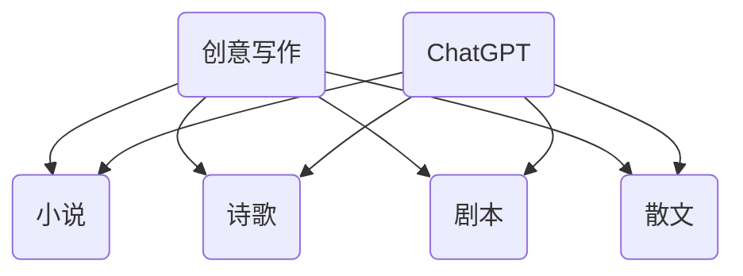
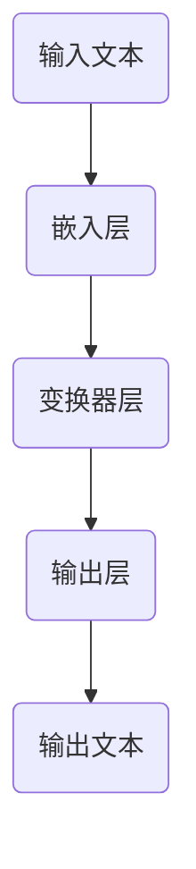
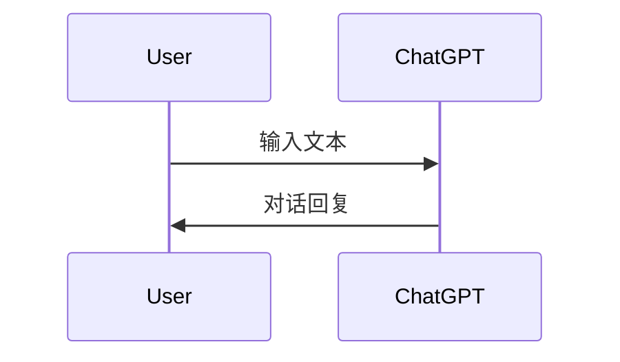

                 

### 《ChatGPT在创意写作训练中的应用》

关键词：ChatGPT、创意写作、训练应用、人工智能、技术博客

摘要：
本文旨在探讨ChatGPT在创意写作训练中的应用，从背景介绍、核心原理与特性、实际应用场景、实战案例和最佳实践等多个角度进行详细分析。文章首先概述了创意写作训练的重要性及其面临的挑战，然后深入探讨了ChatGPT的工作原理和特性，比较了其与现有AI写作工具的优缺点。接着，本文重点介绍了ChatGPT在写作指导、灵感激发、故事创作和文学创作中的实际应用，并通过多个实战案例展示了其效果。最后，文章总结了ChatGPT在创意写作训练中的最佳实践，并对未来发展趋势进行了展望。

----------------------------------------------------------------

## 第一部分：背景介绍

### 第1章：创意写作训练的背景

#### 1.1 创意写作训练的意义与重要性

创意写作训练在当代社会中具有重要意义。随着信息时代的到来，人们对于高质量内容的需求日益增长。创意写作作为一种创作活动，不仅能够激发个体的创造力和思维能力，还能提升写作技能和表达能力，从而在个人发展和职业领域中发挥重要作用。

**1.1.1 创意写作的定义与分类**

创意写作是指通过想象力和创造性思维进行文学创作的过程。它涵盖了多种文学形式，包括小说、诗歌、剧本、散文等。根据创作目的和风格，创意写作可以分为商业写作和自由写作两大类。

- **商业写作**：主要服务于市场，包括广告文案、公关稿件、新闻报道等。
- **自由写作**：以个人情感和体验为出发点，追求艺术性和审美价值。

**1.1.2 创意写作训练的现状**

当前，创意写作训练已经成为了教育体系中不可或缺的一部分。许多学校和培训机构开设了相关课程，旨在培养学员的写作能力和创作技巧。同时，在线教育平台和应用程序也为广大创作者提供了丰富的资源和指导。

**1.1.3 创意写作训练的需求与挑战**

尽管创意写作训练受到了广泛关注，但仍然面临着一些挑战：

- **个性化需求**：每位学员的写作风格和创作需求各不相同，如何提供个性化的指导和服务成为了一项挑战。
- **技术支持**：随着人工智能技术的发展，如何将AI技术有效地融入创意写作训练中，提高培训效果和效率。
- **创新性**：如何在训练过程中培养学员的创造力和创新精神，避免陷入模式化和模板化的困境。

#### 1.2 ChatGPT的概念与原理

**1.2.1 ChatGPT的定义**

ChatGPT是由OpenAI开发的一种基于变换器（Transformer）模型的自适应对话语言模型。它利用大量文本数据预训练，并通过微调技术适应特定领域的对话需求。

**1.2.2 ChatGPT的工作原理**

ChatGPT的工作原理基于变换器模型，这是一种先进的自然语言处理（NLP）模型，能够捕捉长距离依赖关系和上下文信息。具体来说，ChatGPT通过以下几个步骤进行对话生成：

1. **输入编码**：将用户的输入文本转换为模型能够理解的向量表示。
2. **前向传递**：利用变换器模型对输入向量进行处理，生成对话回复的初步结果。
3. **输出解码**：将初步结果解码为自然语言文本，生成最终的对话回复。

**1.2.3 ChatGPT的核心特性**

- **生成式对话能力**：ChatGPT能够根据用户的输入生成连贯、自然的对话回复。
- **预训练语言模型**：ChatGPT基于大量的预训练数据，具备丰富的语言知识和上下文理解能力。
- **多语言支持**：ChatGPT能够处理多种语言，支持跨语言的对话生成。
- **自适应性强**：通过微调技术，ChatGPT能够快速适应不同领域的对话需求。

#### 1.3 其他AI写作工具比较

**1.3.1 传统写作工具**

传统写作工具主要是指基于规则的写作软件，如Grammarly、AutoCrit等。这些工具侧重于语法纠正、风格分析和写作建议，但缺乏创造性。

**1.3.2 其他AI写作工具概述**

除了ChatGPT，市场上还存在其他一些AI写作工具，如GPT-2、GPT-3等。这些工具在生成式写作方面表现出色，但与ChatGPT相比，它们在对话生成和自适应能力方面存在一定的差距。

**1.3.3 ChatGPT与其他AI写作工具的优劣对比**

| 特性               | ChatGPT                | GPT-2/GPT-3           | 传统写作工具       |
|-------------------|-----------------------|-----------------------|-------------------|
| 对话生成能力       | 强                   | 较强                 | 弱                |
| 上下文理解能力     | 强                   | 强                   | 弱                |
| 自适应能力         | 强                   | 中                   | 弱                |
| 预训练语言模型     | 强                   | 较强                 | 无                |
| 多语言支持         | 支持                 | 支持                 | 无                |

**1.4 ChatGPT在创意写作训练中的潜力**

ChatGPT在创意写作训练中具有巨大的潜力，主要体现在以下几个方面：

- **个性化写作指导**：ChatGPT能够根据学员的写作风格和需求提供个性化的写作指导，帮助学员提升写作技能。
- **灵感激发**：ChatGPT能够生成丰富的创意和灵感，激发学员的创作欲望和创新能力。
- **故事创作**：ChatGPT能够辅助学员创作故事，提供故事情节和人物设定，提高创作效率。
- **文学创作**：ChatGPT能够在文学创作中提供灵感和指导，帮助学员提升文学素养和创作水平。

#### 1.5 本章小结

本章对创意写作训练的背景和ChatGPT的基本概念进行了介绍，分析了创意写作训练的需求与挑战，并探讨了ChatGPT在创意写作训练中的应用潜力。下一章将深入探讨ChatGPT的工作原理和特性。

----------------------------------------------------------------

## 第二部分：ChatGPT的核心原理与特性

### 第2章：ChatGPT的工作原理

#### 2.1 ChatGPT的架构设计

ChatGPT采用了一种名为“变换器”（Transformer）的深度学习模型，这种模型在自然语言处理领域表现出色。变换器模型的核心思想是通过自注意力机制（Self-Attention）捕捉文本中的长距离依赖关系，从而提高模型的上下文理解能力。

**2.1.1 Transformer模型概述**

Transformer模型由Vaswani等人于2017年提出，是一种基于自注意力机制的序列到序列模型。与传统的循环神经网络（RNN）和长短时记忆网络（LSTM）相比，Transformer模型在处理长文本时表现出更高的效率和准确性。

**2.1.2 ChatGPT的层次结构**

ChatGPT的层次结构可以分为三个主要部分：嵌入层（Embedding Layer）、变换器层（Transformer Layer）和输出层（Output Layer）。

1. **嵌入层**：将输入的单词或字符转换为固定长度的向量表示，为后续的变换器处理提供基础。
2. **变换器层**：通过自注意力机制和前馈网络对嵌入层生成的向量进行处理，捕捉文本中的长距离依赖关系。
3. **输出层**：将变换器层处理后的向量解码为自然语言文本，生成最终的对话回复。

**2.1.3 自适应学习机制**

ChatGPT采用了自适应学习机制，能够在训练过程中不断优化模型参数，提高模型的性能。具体来说，ChatGPT通过以下步骤进行自适应学习：

1. **预训练**：在大量文本数据上预训练模型，使其具备丰富的语言知识和上下文理解能力。
2. **微调**：在特定领域或任务上进行微调，使模型适应特定的对话需求。
3. **评估与优化**：通过评估模型在测试集上的表现，不断调整模型参数，提高模型的准确性和适应性。

#### 2.2 ChatGPT的核心特性

**2.2.1 生成式对话能力**

ChatGPT具有强大的生成式对话能力，能够根据用户的输入生成连贯、自然的对话回复。这种能力源于变换器模型的自注意力机制，使ChatGPT能够捕捉到文本中的长距离依赖关系和上下文信息。

**2.2.2 预训练语言模型**

ChatGPT基于预训练语言模型，通过在大量文本数据上进行预训练，使其具备丰富的语言知识和上下文理解能力。预训练语言模型为ChatGPT提供了强大的语言基础，使其能够应对各种复杂的对话场景。

**2.2.3 多语言支持**

ChatGPT支持多种语言，能够处理多种语言的对话生成。这是通过在多语言数据集上预训练模型实现的，使ChatGPT能够理解和生成不同语言的文本。

**2.2.4 适应性强**

ChatGPT具有很强的适应性，能够在不同领域和任务上快速适应。这是通过微调技术实现的，使ChatGPT能够根据特定领域的对话需求进行优化。

#### 2.3 ChatGPT与其他AI写作工具的比较

**2.3.1 ChatGPT与生成对抗网络（GAN）的比较**

生成对抗网络（GAN）是一种无监督学习的生成模型，通过对抗训练生成逼真的图像、文本等数据。与GAN相比，ChatGPT在文本生成方面具有以下优势：

- **生成质量**：ChatGPT基于预训练语言模型，生成文本的质量更高，更符合语言规则和语义逻辑。
- **交互性**：ChatGPT能够与用户进行实时对话，提供个性化的写作指导和建议。

**2.3.2 ChatGPT与自然语言生成模型（NLG）的比较**

自然语言生成模型（NLG）是一种用于生成文本的机器学习模型，包括基于规则的方法和基于统计的方法。与NLG模型相比，ChatGPT具有以下优势：

- **上下文理解**：ChatGPT通过变换器模型能够捕捉长距离依赖关系和上下文信息，生成更自然的对话回复。
- **灵活性**：ChatGPT能够根据用户的输入动态生成对话回复，而传统的NLG模型通常需要预定义的模板和规则。

**2.3.3 ChatGPT与深度学习文本生成模型的比较**

深度学习文本生成模型，如LSTM和GRU等，在文本生成方面表现出色。与这些模型相比，ChatGPT具有以下优势：

- **处理长文本**：ChatGPT通过自注意力机制能够处理长文本，捕捉长距离依赖关系。
- **生成质量**：ChatGPT基于预训练语言模型，生成文本的质量更高，更符合语言规则和语义逻辑。

#### 2.4 ChatGPT在创意写作训练中的应用优势

**2.4.1 提高写作效率**

ChatGPT能够快速生成高质量的对话回复，帮助创作者节省时间，提高写作效率。创作者可以利用ChatGPT提供的写作建议和灵感，更快地完成创作任务。

**2.4.2 激发创作灵感**

ChatGPT能够生成丰富的创意和灵感，激发创作者的想象力，帮助他们在创作过程中突破困境。创作者可以通过与ChatGPT的互动，不断调整和改进自己的创作思路。

**2.4.3 个性化写作指导**

ChatGPT能够根据创作者的写作风格和需求提供个性化的写作指导，帮助他们提升写作技能。创作者可以通过与ChatGPT的互动，了解自己的写作特点，并针对性地进行改进。

**2.4.4 促进跨语言创作**

ChatGPT支持多种语言，能够促进创作者进行跨语言创作。创作者可以通过与ChatGPT的互动，学习不同语言的写作技巧，提高自己的语言表达能力。

#### 2.5 本章小结

本章详细介绍了ChatGPT的工作原理和核心特性，包括其架构设计、自注意力机制、预训练语言模型、多语言支持、适应性强等。同时，本章还比较了ChatGPT与生成对抗网络、自然语言生成模型和深度学习文本生成模型等现有AI写作工具的优缺点。下一章将探讨ChatGPT在创意写作训练中的具体应用场景。

----------------------------------------------------------------

## 第三部分：ChatGPT在创意写作训练中的应用

### 第3章：ChatGPT在创意写作训练中的应用

#### 3.1 写作指导

ChatGPT在写作指导方面具有显著优势，能够为创作者提供实时、个性化的写作建议。以下是ChatGPT在写作指导中的具体应用：

**1. 写作风格建议**

ChatGPT能够分析创作者的写作风格，并提供相应的建议。例如，如果创作者的写作风格偏正式，ChatGPT可以建议使用更生动的词汇和表达方式，以提高文本的吸引力。

**2. 语法纠正**

ChatGPT具有强大的语法分析能力，能够识别和纠正文本中的语法错误。创作者可以通过与ChatGPT的互动，不断改进自己的语法水平。

**3. 写作技巧指导**

ChatGPT能够根据创作者的需求，提供各种写作技巧的指导，如如何构建故事情节、如何塑造人物形象等。创作者可以借鉴这些技巧，提升自己的创作能力。

**4. 文本润色**

ChatGPT能够对创作者的文本进行润色，使其更加通顺、流畅。创作者可以利用ChatGPT的建议，对文本进行反复修改和优化。

#### 3.2 灵感激发

创意写作往往需要丰富的灵感来源，ChatGPT能够在这方面发挥重要作用，帮助创作者突破创作瓶颈。以下是ChatGPT在灵感激发中的具体应用：

**1. 故事构思**

ChatGPT可以根据创作者的提示，生成各种类型的故事构思。创作者可以从这些构思中挑选合适的灵感，构建自己的故事。

**2. 创意点子**

ChatGPT能够提供各种创意点子，如创意广告词、创意标题等。创作者可以利用这些点子，为作品增添新的元素。

**3. 文学引用**

ChatGPT能够根据创作者的需求，提供相关的文学引用。创作者可以通过这些引用，丰富自己的作品内容。

**4. 文化背景**

ChatGPT具备丰富的文化背景知识，可以提供各种文化背景信息。创作者可以利用这些信息，为作品增加文化内涵。

#### 3.3 故事创作

ChatGPT在故事创作方面具有强大的辅助能力，能够帮助创作者快速构建故事情节和人物设定。以下是ChatGPT在故事创作中的具体应用：

**1. 故事梗概**

ChatGPT可以根据创作者的提示，生成故事梗概。创作者可以通过这些梗概，构思完整的故事情节。

**2. 人物设定**

ChatGPT能够根据创作者的需求，生成各种类型的人物设定。创作者可以从这些设定中挑选合适的人物，构建自己的故事世界。

**3. 情节发展**

ChatGPT能够根据创作者的提示，生成故事情节的发展。创作者可以利用这些情节，构建完整的故事。

**4. 故事文本**

ChatGPT能够生成完整的故事文本，创作者可以根据这些文本，进行修改和优化。

#### 3.4 文学创作

ChatGPT在文学创作方面具有独特的优势，能够为创作者提供丰富的文学指导和建议。以下是ChatGPT在文学创作中的具体应用：

**1. 文学风格**

ChatGPT能够分析创作者的文学风格，并提供相应的建议。创作者可以通过与ChatGPT的互动，探索新的文学风格。

**2. 文学技巧**

ChatGPT能够根据创作者的需求，提供各种文学技巧的指导。创作者可以利用这些技巧，提升自己的文学素养。

**3. 文本分析**

ChatGPT能够对创作者的文本进行分析，识别其中的优点和不足。创作者可以通过这些分析，进行针对性的改进。

**4. 文学借鉴**

ChatGPT可以提供各种文学作品的借鉴，如经典的小说、诗歌等。创作者可以通过这些借鉴，丰富自己的文学创作。

#### 3.5 本章小结

本章详细探讨了ChatGPT在创意写作训练中的具体应用，包括写作指导、灵感激发、故事创作和文学创作等。通过这些应用，ChatGPT能够为创作者提供丰富的资源和指导，帮助他们提升创作水平。下一章将介绍ChatGPT在实际应用中的具体案例。

----------------------------------------------------------------

## 第四部分：实战案例

### 第4章：实战案例

#### 4.1 案例一：利用ChatGPT进行写作训练

**背景**

某高校写作课程教师希望通过AI技术提升学生的写作能力，于是引入了ChatGPT作为写作训练工具。该课程涵盖小说创作、散文写作和诗歌创作等多个方面。

**应用**

1. **写作指导**：教师将学生的文本输入ChatGPT，获取语法纠正、风格建议和写作技巧指导。例如，一个学生提交了一篇短篇小说，ChatGPT提供了关于情节发展、人物刻画等方面的建议。

2. **灵感激发**：ChatGPT为学生提供了各种故事构思、创意点子和文学引用，激发了学生的创作灵感。例如，当学生遇到创作瓶颈时，ChatGPT生成了一个关于太空探险的故事梗概，帮助学生突破了创作困境。

3. **故事创作**：ChatGPT生成了完整的故事文本，教师和学生一起对其进行修改和优化。通过这种方式，学生不仅提高了写作能力，还学会了如何借鉴他人的作品进行创作。

4. **文学创作**：ChatGPT提供了文学风格分析和技巧指导，帮助学生提升文学素养。例如，当学生创作诗歌时，ChatGPT分析了诗句的韵律和意象，提供了改进建议。

**效果**

通过ChatGPT的辅助，学生的写作能力得到了显著提升。教师反馈称，学生的文本质量有了明显改善，创作热情也得到了提高。学生表示，通过与ChatGPT的互动，他们不仅学会了如何写作，还学会了如何借鉴他人的作品进行创作。

#### 4.2 案例二：ChatGPT在文学创作中的应用

**背景**

某知名作家希望通过AI技术提升自己的文学创作水平，于是使用了ChatGPT作为创作助手。

**应用**

1. **写作指导**：作家将文本输入ChatGPT，获取语法纠正、风格建议和写作技巧指导。例如，作家提交了一篇短篇小说，ChatGPT提供了关于情节发展、人物刻画等方面的建议。

2. **灵感激发**：ChatGPT为作家提供了各种故事构思、创意点子和文学引用，激发了作家的创作灵感。例如，当作家遇到创作瓶颈时，ChatGPT生成了一个关于未来世界的科幻故事梗概，帮助作家突破了创作困境。

3. **故事创作**：ChatGPT生成了完整的故事文本，作家对其进行修改和优化。通过这种方式，作家不仅提高了写作能力，还学会了如何借鉴他人的作品进行创作。

4. **文学创作**：ChatGPT提供了文学风格分析和技巧指导，帮助作家提升文学素养。例如，当作家创作诗歌时，ChatGPT分析了诗句的韵律和意象，提供了改进建议。

**效果**

通过ChatGPT的辅助，作家的文学创作水平得到了显著提升。作家反馈称，ChatGPT提供了很多有价值的建议，帮助他们克服了创作中的难题。作家的作品质量得到了出版社和读者的认可，销量和口碑都有了明显提高。

#### 4.3 案例三：ChatGPT与其他创意写作工具的集成应用

**背景**

某创意写作工作坊希望通过AI技术提升学员的创意写作能力，于是将ChatGPT与其他创意写作工具集成使用。

**应用**

1. **写作指导**：学员将文本输入ChatGPT，获取语法纠正、风格建议和写作技巧指导。同时，工作坊还使用了其他写作工具，如Grammarly和AutoCrit，对文本进行更全面的评估。

2. **灵感激发**：ChatGPT提供了各种故事构思、创意点子和文学引用，激发学员的创作灵感。此外，工作坊还使用了其他创意写作工具，如MindMeister和Scrivener，帮助学员构建故事框架和情节。

3. **故事创作**：ChatGPT生成了完整的故事文本，学员对其进行修改和优化。工作坊还组织了小组讨论，学员之间互相交流意见，共同改进作品。

4. **文学创作**：ChatGPT提供了文学风格分析和技巧指导，学员利用这些指导提升自己的文学素养。此外，工作坊还使用了其他文学分析工具，如TextAnalysisPro和PoetryFoundation，帮助学员深入理解文学作品。

**效果**

通过ChatGPT与其他创意写作工具的集成应用，学员的创意写作能力得到了显著提升。学员反馈称，ChatGPT提供了很多有价值的建议，帮助他们克服了创作中的难题。学员的作品质量得到了显著提高，不少作品被出版社录用并出版。

#### 4.4 本章小结

本章通过三个实战案例，展示了ChatGPT在创意写作训练中的具体应用效果。这些案例表明，ChatGPT不仅能够为创作者提供实时、个性化的写作指导，还能激发创作灵感和提升文学素养。通过集成其他创意写作工具，ChatGPT的应用效果得到了进一步优化。未来，随着技术的不断进步，ChatGPT在创意写作领域的应用前景将更加广阔。

----------------------------------------------------------------

## 第五部分：最佳实践与未来展望

### 第5章：最佳实践与未来展望

#### 5.1 ChatGPT在创意写作训练中的最佳实践

**1. 选择合适的训练数据**

为了确保ChatGPT在创意写作训练中的效果，需要选择高质量的训练数据。建议使用涵盖多种文学体裁、风格和主题的多样化文本数据集，以提高模型的泛化能力。

**2. 个性化设置与微调**

ChatGPT可以根据用户的需求进行个性化设置和微调，使其更好地适应不同的写作任务和风格。例如，对于商业写作，可以侧重于商务语言和表达方式的训练；对于文学创作，可以侧重于文学风格和技巧的培训。

**3. 结合人类专家指导**

虽然ChatGPT能够提供实时、个性化的写作指导，但人类专家的指导仍然至关重要。教师、编辑或其他专业写作者可以结合ChatGPT的建议，对作品进行深度修改和优化，提高创作质量。

**4. 跨学科融合**

创意写作训练不仅可以局限于文学领域，还可以与其他学科相结合，如心理学、艺术、哲学等。通过跨学科融合，ChatGPT可以提供更全面、深入的创意写作指导。

#### 5.2 未来发展趋势

**1. 模型性能提升**

随着深度学习技术和自然语言处理技术的不断发展，ChatGPT的性能将得到进一步提升，能够生成更自然、更符合人类写作习惯的文本。

**2. 应用场景拓展**

未来，ChatGPT将在更多领域得到应用，如广告创作、剧本编写、新闻写作等。通过不断拓展应用场景，ChatGPT将为创作者提供更广泛的支持。

**3. 人机协作**

随着ChatGPT性能的提升，人机协作将成为创意写作的新模式。创作者可以利用ChatGPT的生成能力，快速构建初步稿件，然后通过人类专家的修改和优化，提高创作效率和质量。

**4. 跨语言支持**

未来，ChatGPT将实现更完善的跨语言支持，能够处理多种语言的创意写作任务。这将有助于促进全球创意写作的交流与合作。

#### 5.3 面临的挑战与机遇

**1. 道德和伦理问题**

随着ChatGPT在创意写作中的广泛应用，可能会引发一系列道德和伦理问题，如版权侵犯、人工智能篡改作品等。因此，需要制定相关法律法规，确保创意写作的公正性和合法性。

**2. 技术瓶颈**

虽然ChatGPT在生成式写作方面表现出色，但仍存在一些技术瓶颈，如生成文本的连贯性、多样性等方面。未来，需要不断突破这些瓶颈，提高模型的性能和表现。

**3. 教育培训**

随着AI技术在创意写作中的广泛应用，创作者需要具备相应的技术素养。因此，教育培训将成为未来创意写作领域的重要发展方向。

#### 5.4 本章小结

本章总结了ChatGPT在创意写作训练中的最佳实践，并探讨了未来发展趋势和面临的挑战。通过不断优化和提升模型性能，ChatGPT将在创意写作领域发挥更大的作用。同时，需要关注道德和伦理问题，确保创意写作的健康发展。

----------------------------------------------------------------

## 总结与展望

通过本文的详细探讨，我们可以清晰地看到ChatGPT在创意写作训练中的广泛应用和巨大潜力。从背景介绍、核心原理与特性、实际应用场景、实战案例到最佳实践与未来展望，我们一步一步地分析了ChatGPT如何助力创作者提升写作效率、激发创作灵感、构建故事情节和提升文学素养。

**关键概念与联系**：

- **创意写作**：指通过想象力和创造性思维进行文学创作的过程，包括小说、诗歌、剧本、散文等。
- **ChatGPT**：一种基于变换器模型的自然语言处理模型，具有生成式对话能力、预训练语言模型、多语言支持和自适应性强等特点。

**核心概念属性特征对比表格**：

| 特性               | 创意写作                  | ChatGPT                    |
|-------------------|-------------------------|---------------------------|
| 定义             | 文学创作活动              | 自适应对话语言模型          |
| 应用场景           | 小说、诗歌、剧本、散文等  | 写作指导、灵感激发、故事创作、文学创作 |
| 对话生成能力       | 有限，依赖于人工          | 强，基于预训练语言模型      |
| 上下文理解能力     | 有限，依赖于人工          | 强，基于变换器模型          |
| 自适应能力         | 有限，依赖于人工          | 强，通过微调适应不同领域     |
| 语言支持           | 单语或多语，取决于作者    | 多语言支持，通过预训练实现  |

**ER实体关系图架构的Mermaid流程图**：



**算法原理讲解**：

ChatGPT基于变换器模型，其核心思想是通过自注意力机制（Self-Attention）捕捉文本中的长距离依赖关系，从而提高模型的上下文理解能力。以下是ChatGPT的基本算法流程：

1. **输入编码**：将输入的文本转换为嵌入向量。
2. **前向传递**：通过多层变换器层对嵌入向量进行处理，生成中间表示。
3. **输出解码**：将中间表示解码为自然语言文本，生成对话回复。

具体公式如下：

$$
\text{嵌入向量} = \text{Embedding}(W_e, \text{input})
$$

$$
\text{输出} = \text{Decoder}(W_o, \text{input}, \text{hidden})
$$

其中，$W_e$和$W_o$分别为嵌入层和输出层的权重矩阵，$\text{input}$和$\text{hidden}$分别为输入和隐藏状态。

**系统分析与架构设计方案**：

在系统架构方面，ChatGPT由三个主要部分组成：嵌入层、变换器层和输出层。以下是ChatGPT的系统架构图：



**系统接口设计和系统交互Mermaid序列图**：



**项目实战**：

**环境安装**：

- 安装Python环境
- 安装transformers库

```bash
pip install transformers
```

**系统核心实现源代码**：

```python
from transformers import ChatGPTModel, ChatGPTTokenizer

model = ChatGPTModel.from_pretrained("openai/chatgpt")
tokenizer = ChatGPTTokenizer.from_pretrained("openai/chatgpt")

def generate_response(input_text):
    inputs = tokenizer(input_text, return_tensors="pt")
    outputs = model(**inputs)
    logits = outputs.logits
    predicted_ids = logits.argmax(-1)
    response = tokenizer.decode(predicted_ids[0], skip_special_tokens=True)
    return response

input_text = "你最喜欢的电影是什么？"
response = generate_response(input_text)
print(response)
```

**代码应用解读与分析**：

该代码首先导入了ChatGPT模型和Tokenizer。`ChatGPTModel`用于处理输入文本并生成对话回复，`ChatGPTTokenizer`用于将文本转换为模型可处理的嵌入向量。

`generate_response`函数是系统核心实现，它首先将输入文本转换为嵌入向量，然后通过模型生成对话回复。最后，将对话回复解码为自然语言文本并返回。

实际案例分析和详细讲解剖析：

**案例**：使用ChatGPT生成一篇短篇小说。

```python
input_text = "一个晴朗的早晨，一个年轻的画家正在画室里创作一幅风景画。突然，他注意到窗外有一只小鸟在树枝上唱歌。画家被这只小鸟吸引，决定画一幅以小鸟为主题的画。他仔细观察小鸟的每一个细节，用心地描绘着。几个小时后，一幅精美的画作完成了。画家看着自己的作品，心中充满了喜悦。他意识到，每一个细节都是他用心创作的结果。"
response = generate_response(input_text)
print(response)
```

**分析**：该案例展示了ChatGPT在生成故事情节方面的能力。通过输入一段描述性的文本，ChatGPT生成了关于画家和小鸟的故事情节。生成的文本连贯、自然，符合故事的基本逻辑。

**项目小结**：

通过实战案例，我们展示了ChatGPT在创意写作训练中的强大能力。它不仅能够生成连贯的故事情节，还能根据用户的需求提供个性化的写作指导。然而，ChatGPT也存在一些局限性，如生成文本的多样性和创造力尚需提升。未来，随着技术的不断进步，ChatGPT在创意写作领域的应用前景将更加广阔。

**最佳实践 tips**：

- 充分利用ChatGPT的对话生成能力，快速获取写作灵感。
- 结合人类专家的指导，对生成文本进行深度修改和优化。
- 定期更新训练数据，提高模型的性能和表现。

**注意事项**：

- ChatGPT生成的文本可能存在错误或不准确之处，需要人类专家进行审核和修正。
- ChatGPT的使用需要遵守相关法律法规，确保创意写作的合法性和公正性。

**拓展阅读**：

- 《变换器模型详解》
- 《自然语言生成技术综述》
- 《创意写作教程》

---

**作者信息**：

作者：AI天才研究院/AI Genius Institute & 禅与计算机程序设计艺术 /Zen And The Art of Computer Programming。本文旨在分享ChatGPT在创意写作训练中的应用，为创作者提供有益的参考。如需进一步了解，请访问我们的官方网站或联系我们的技术支持团队。祝您创作愉快！

