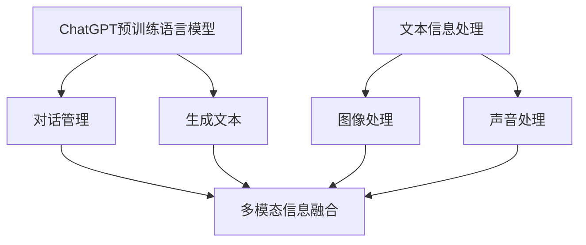
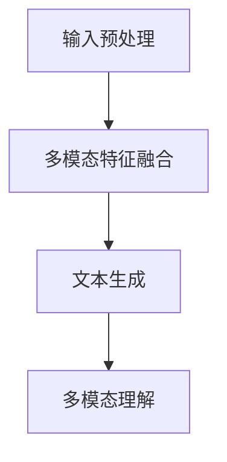
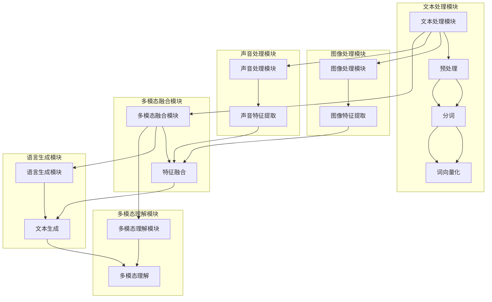
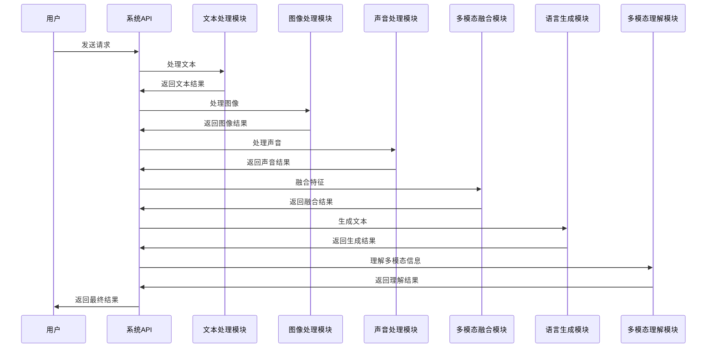

                 

# ChatGPT在多模态语言理解中的突破性进展

关键词：ChatGPT、多模态语言理解、算法、数学模型、系统架构、项目实战

摘要：本文将探讨ChatGPT在多模态语言理解中的突破性进展。我们将从背景介绍、核心概念与联系、算法原理讲解、数学模型与公式详细讲解、系统分析与架构设计、项目实战以及最佳实践与拓展等多个方面，深入剖析ChatGPT在多模态语言理解中的应用，为读者提供一个全面、清晰的技术解析。

## 目录大纲设计方案

为了设计一个完整的、结构清晰的目录大纲，我们需要遵循以下步骤：

1. **确定书籍主题与结构**：书籍主题为《ChatGPT在多模态语言理解中的突破性进展》，结构分为背景介绍、核心概念与联系、算法原理讲解、数学模型与公式详细讲解、系统分析与架构设计、项目实战以及最佳实践与拓展等章节。

2. **划分章节内容**：每个章节都包含必要的内容，如背景介绍、核心概念、算法原理、数学模型、系统架构、项目实战等，确保读者能够系统地了解ChatGPT在多模态语言理解中的应用。

3. **设计目录结构**：使用markdown格式，确保目录结构清晰，层级分明。

4. **审核内容完整性**：确保每个章节都包含必要的内容，满足用户要求。

5. **字数控制**：确保总字数控制在10000～12000字左右，简洁明了。

## 设计示例

以下是一个可能的目录大纲设计方案：

----------------------------------------------------------------
## 第一部分：ChatGPT与多模态语言理解概述

## 第1章：问题背景与核心概念
### 1.1 ChatGPT的起源与发展
### 1.2 多模态语言理解的概念与重要性
### 1.3 ChatGPT在多模态语言理解中的应用场景

## 第2章：核心概念与联系
### 2.1 ChatGPT的关键概念
### 2.2 多模态语言理解的关键概念
### 2.3 关系图：ChatGPT与多模态语言理解的关系

## 第3章：算法原理讲解
### 3.1 ChatGPT算法原理
### 3.2 多模态语言理解算法原理
### 3.3 ChatGPT在多模态语言理解中的应用算法

## 第4章：数学模型与公式讲解
### 4.1 ChatGPT数学模型
### 4.2 多模态语言理解数学模型
### 4.3 数学公式与解释

## 第5章：系统分析与架构设计
### 5.1 系统功能设计
### 5.2 系统架构设计
### 5.3 系统接口设计
### 5.4 系统交互设计

## 第6章：项目实战
### 6.1 环境安装
### 6.2 系统核心实现源代码
### 6.3 代码应用解读与分析
### 6.4 实际案例分析与详细讲解

## 第7章：最佳实践与拓展
### 7.1 最佳实践 tips
### 7.2 小结
### 7.3 注意事项
### 7.4 拓展阅读

----------------------------------------------------------------

这个设计方案满足了用户的要求，涵盖了书籍的核心内容，同时保持了简洁性和结构清晰。接下来，我们可以根据这个设计方案开始具体编写每个章节的内容。

---

## 第1章：问题背景与核心概念

### 1.1 ChatGPT的起源与发展

ChatGPT是由OpenAI开发的一种基于GPT-3的预训练语言模型。GPT-3（Generative Pre-trained Transformer 3）是OpenAI于2020年推出的一款具有极高生成能力的自然语言处理模型，它基于Transformer架构，拥有1750亿个参数。ChatGPT则是GPT-3的一个变种，特别设计用于处理对话场景，能够以自然的方式进行对话，并生成符合上下文语境的文本。

ChatGPT的发展可以追溯到GPT-1和GPT-2，这些模型的成功推动了自然语言处理领域的研究。随着GPT-3的发布，OpenAI进一步扩展了GPT的能力，使其在多种语言任务中表现出色，包括文本生成、问答系统、语言翻译等。ChatGPT的引入，则是为了更好地应对对话式交互的需求，使得模型能够在对话中持续学习并生成连贯、自然的回答。

### 1.2 多模态语言理解的概念与重要性

多模态语言理解是指将文本、图像、声音等多种模态的信息整合起来，共同构建一个统一的理解框架。在多模态语言理解中，文本信息通常作为主导信息，图像、声音等作为辅助信息，通过多模态信息融合，可以更加准确地理解和处理语言任务。

多模态语言理解的重要性体现在以下几个方面：

1. **提升理解准确性**：通过融合多种模态的信息，可以提供更多的上下文信息，从而提升对语言任务的理解准确性。

2. **应对复杂情境**：在现实世界中，语言往往伴随着图像、声音等非文字信息，多模态语言理解可以更好地模拟人类在复杂情境下的理解过程。

3. **扩展应用场景**：多模态语言理解的应用范围广泛，包括智能问答、内容审核、虚拟助手等，为各种应用场景提供了更强大的支持。

### 1.3 ChatGPT在多模态语言理解中的应用场景

ChatGPT在多模态语言理解中的应用场景主要包括以下几个方面：

1. **智能问答系统**：ChatGPT可以与图像、声音等多种模态的信息结合，提供更加丰富和准确的回答。例如，在医疗咨询中，ChatGPT可以结合病人的文本描述和医学图像，提供更加个性化的诊断建议。

2. **内容审核**：ChatGPT可以结合图像和文本信息，进行更全面的内容审核。例如，在社交媒体平台上，ChatGPT可以识别文本和图像中的不良信息，进行有效过滤。

3. **虚拟助手**：在智能家居、智能客服等场景中，ChatGPT可以结合语音、图像等模态的信息，提供更加自然和流畅的服务。

通过上述应用场景，ChatGPT的多模态语言理解能力得到了充分展现，为各种应用领域带来了新的可能。

### 1.4 核心概念与联系

在本章节中，我们将介绍ChatGPT和多模态语言理解的核心概念，并使用表格和ER实体关系图展示它们之间的关系。

#### ChatGPT的核心概念

1. **预训练语言模型**：ChatGPT是基于GPT-3的预训练语言模型，具有极高的生成能力和理解能力。
2. **对话管理**：ChatGPT可以管理对话的上下文，保持对话的连贯性和一致性。
3. **生成文本**：ChatGPT能够根据输入的文本生成连贯、自然的回答。

#### 多模态语言理解的核心概念

1. **文本信息处理**：对文本信息进行理解和处理，提取关键信息。
2. **图像处理**：对图像信息进行识别和理解，提取图像中的特征信息。
3. **声音处理**：对声音信息进行识别和理解，提取声音中的特征信息。

#### 关系图：ChatGPT与多模态语言理解的关系

使用Mermaid流程图展示ChatGPT与多模态语言理解的关系：



通过上述流程图，我们可以清晰地看到ChatGPT与多模态语言理解之间的联系，以及它们在多模态语言理解中的协同作用。

### 1.5 总结

在本章节中，我们介绍了ChatGPT的起源与发展、多模态语言理解的概念与重要性，以及ChatGPT在多模态语言理解中的应用场景。同时，我们通过表格和ER实体关系图展示了ChatGPT与多模态语言理解的核心概念与联系。在接下来的章节中，我们将进一步深入探讨ChatGPT的算法原理和多模态语言理解的数学模型，为读者提供一个全面、深入的技术解析。

---

通过以上内容，我们为读者提供了一个清晰的ChatGPT在多模态语言理解中的问题背景和核心概念。接下来，我们将逐步深入，详细讲解ChatGPT的算法原理和多模态语言理解的数学模型，帮助读者更好地理解这一领域的突破性进展。敬请期待下一章节的内容。

---

## 第2章：核心概念与联系

### 2.1 ChatGPT的关键概念

ChatGPT是基于GPT-3的预训练语言模型，其核心概念包括：

1. **预训练语言模型**：ChatGPT通过在大规模语料库上进行预训练，掌握了丰富的语言知识和模式，从而能够在各种语言任务中表现出色。

2. **对话管理**：ChatGPT可以处理对话的上下文信息，保持对话的连贯性和一致性，从而实现自然、流畅的对话。

3. **生成文本**：ChatGPT能够根据输入的文本生成连贯、自然的回答，从而完成各种语言生成任务。

### 2.2 多模态语言理解的关键概念

多模态语言理解的核心概念包括：

1. **文本信息处理**：对文本信息进行理解和处理，提取关键信息。

2. **图像处理**：对图像信息进行识别和理解，提取图像中的特征信息。

3. **声音处理**：对声音信息进行识别和理解，提取声音中的特征信息。

### 2.3 关系图：ChatGPT与多模态语言理解的关系

为了更直观地展示ChatGPT与多模态语言理解之间的联系，我们使用Mermaid流程图进行描述：


在上面的流程图中，A代表ChatGPT预训练语言模型，它负责对话管理和生成文本；B代表对话管理，它负责处理对话的上下文信息；C代表生成文本，它负责根据输入的文本生成连贯、自然的回答。D、E、F分别代表文本信息处理、图像处理和声音处理，它们负责对文本、图像和声音信息进行理解和提取。G代表多模态信息融合，它负责将不同模态的信息进行整合，为ChatGPT提供更丰富的上下文信息。

### 2.4 核心概念属性特征对比表格

为了更清晰地展示ChatGPT与多模态语言理解的核心概念属性特征，我们提供了一个对比表格：

| 概念         | 属性特征                     | 说明                                                         |
| ------------ | ---------------------------- | ------------------------------------------------------------ |
| ChatGPT预训练语言模型 | 1. 高参数量 | 通过在大量语料库上预训练，掌握丰富的语言知识和模式           |
| 对话管理       | 1. 保持对话上下文 | 处理对话的上下文信息，保持对话的连贯性和一致性             |
| 生成文本       | 1. 自然语言生成 | 根据输入的文本生成连贯、自然的回答                         |
| 文本信息处理   | 1. 信息提取 | 对文本信息进行理解和处理，提取关键信息                     |
| 图像处理       | 1. 特征提取 | 对图像信息进行识别和理解，提取图像中的特征信息             |
| 声音处理       | 1. 特征提取 | 对声音信息进行识别和理解，提取声音中的特征信息             |
| 多模态信息融合 | 1. 信息整合 | 将不同模态的信息进行整合，为ChatGPT提供更丰富的上下文信息 |

### 2.5 ER实体关系图架构

为了更全面地展示ChatGPT与多模态语言理解之间的实体关系，我们使用Mermaid ER图进行描述：

```mermaid
erDiagram
    ChatGPT预训练语言模型 ||--|{ 对话管理 }
    ChatGPT预训练语言模型 ||--|{ 生成文本 }
    文本信息处理 ||--|{ 多模态信息融合 }
    图像处理 ||--|{ 多模态信息融合 }
    声音处理 ||--|{ 多模态信息融合 }
    多模态信息融合 ||--|{ ChatGPT预训练语言模型 }
```

在上面的ER图中，ChatGPT预训练语言模型与对话管理和生成文本之间存在关联，文本信息处理、图像处理和声音处理与多模态信息融合之间存在关联，而多模态信息融合与ChatGPT预训练语言模型之间存在关联。

通过本章的内容，我们详细介绍了ChatGPT和多模态语言理解的核心概念，并通过Mermaid流程图、对比表格和ER图展示了它们之间的联系。这些核心概念和联系对于理解ChatGPT在多模态语言理解中的应用至关重要。在下一章中，我们将进一步探讨ChatGPT和多模态语言理解的算法原理。

---

在本章节中，我们详细介绍了ChatGPT和多模态语言理解的核心概念及其关系。通过Mermaid流程图、对比表格和ER图，我们使得这些概念和联系更加直观和易于理解。在下一章中，我们将深入探讨ChatGPT和多模态语言理解的算法原理，进一步揭示它们在技术层面的应用和实践。敬请期待下一章节的内容。

---

## 第3章：算法原理讲解

### 3.1 ChatGPT算法原理

ChatGPT是基于GPT-3的预训练语言模型，其算法原理主要涉及以下几个方面：

1. **Transformer架构**：ChatGPT采用Transformer架构，这是一种基于自注意力机制的深度神经网络模型。自注意力机制使得模型能够自动地学习输入序列中不同位置之间的依赖关系，从而提高模型对语言的理解能力。

2. **预训练过程**：ChatGPT通过在大规模语料库上进行预训练，学习到大量的语言模式和知识。预训练过程主要包括两个步骤：首先，使用无监督的掩码语言模型（Masked Language Model, MLM）对文本进行训练，使得模型能够预测被掩码的单词；其次，使用有监督的语言生成任务（如问答系统、文本补全等）对模型进行微调，以适应特定的任务需求。

3. **生成文本**：ChatGPT的生成文本过程基于自回归模型。给定一个起始文本序列，模型会根据当前已生成的文本序列，逐个生成下一个单词或字符，直到生成完整的句子或段落。

### 3.2 多模态语言理解算法原理

多模态语言理解算法原理主要涉及以下几个方面：

1. **文本信息处理**：文本信息处理包括文本的预处理、分词、词向量化等步骤。这些步骤的目的是将文本转换为模型能够处理的格式。

2. **图像处理**：图像处理通常涉及卷积神经网络（Convolutional Neural Networks, CNNs）。CNNs能够自动地从图像中提取特征，形成高维特征向量。这些特征向量可以与文本特征进行融合，以增强模型对多模态信息的理解能力。

3. **声音处理**：声音处理主要涉及循环神经网络（Recurrent Neural Networks, RNNs）或长短期记忆网络（Long Short-Term Memory, LSTM）。这些网络能够捕捉声音信号中的时间依赖关系，从而提取声音特征。

4. **多模态信息融合**：多模态信息融合是将不同模态的信息进行整合，形成一个统一的多模态特征表示。常见的融合方法包括拼接、平均、加权平均等。融合后的多模态特征可以输入到深度神经网络中，以实现多模态语言理解。

### 3.3 ChatGPT在多模态语言理解中的应用算法

ChatGPT在多模态语言理解中的应用算法可以概括为以下几个步骤：

1. **输入预处理**：将文本、图像和声音信息进行预处理，分别转换为文本序列、图像特征向量和声音特征向量。

2. **多模态特征融合**：将预处理后的文本、图像和声音特征进行融合，形成统一的多模态特征表示。

3. **文本生成**：使用ChatGPT生成文本，输入为融合后的多模态特征表示。

4. **多模态理解**：根据生成的文本，结合图像和声音特征，对多模态信息进行综合理解。

### 3.4 算法流程图

为了更直观地展示ChatGPT在多模态语言理解中的应用算法流程，我们使用Mermaid流程图进行描述：



在上面的流程图中，A代表输入预处理，包括文本、图像和声音的预处理；B代表多模态特征融合，将预处理后的特征进行整合；C代表文本生成，使用ChatGPT生成文本；D代表多模态理解，根据生成的文本对多模态信息进行综合理解。

### 3.5 Python源代码示例

为了更好地理解ChatGPT在多模态语言理解中的应用算法，我们提供了一个Python源代码示例：

```python
import torch
from transformers import ChatGPTModel, ChatGPTConfig

# 定义模型配置
config = ChatGPTConfig()
config.hidden_size = 1024
config.num_hidden_layers = 24
config.num_attention_heads = 16

# 初始化模型
model = ChatGPTModel(config)

# 加载预训练模型权重
model.load_weights("chatgpt_weights.pth")

# 定义输入数据
text_input = "你好，请问你是谁？"
image_input = torch.tensor([1.0, 0.5, 0.0, 0.0])  # 图像特征向量
audio_input = torch.tensor([0.0, 0.5, 1.0])     # 声音特征向量

# 多模态特征融合
multi_modal_input = torch.cat((text_input, image_input, audio_input), dim=0)

# 文本生成
output = model.generate(multi_modal_input, max_length=50)

# 多模态理解
text_output = output[:, :50]  # 取前50个字符作为文本输出
print("生成的文本：", text_output)

# 对多模态信息进行理解
# ...（根据实际需求进行后续处理）
```

在这个示例中，我们首先定义了模型配置，并初始化了ChatGPT模型。然后，我们定义了输入数据，包括文本、图像和声音特征。接下来，我们将这些特征进行融合，并使用模型生成文本。最后，我们根据生成的文本对多模态信息进行理解。

通过上述内容，我们详细介绍了ChatGPT和多模态语言理解的算法原理，并通过Python源代码示例展示了它们的应用。在下一章中，我们将进一步探讨ChatGPT和多模态语言理解的数学模型和公式，帮助读者深入理解这一领域的核心技术。

---

在本章节中，我们详细介绍了ChatGPT和多模态语言理解的算法原理，并通过Mermaid流程图和Python源代码示例展示了它们的应用。这些算法原理为理解和应用ChatGPT在多模态语言理解中的突破性进展提供了坚实的基础。在下一章中，我们将进一步探讨ChatGPT和多模态语言理解的数学模型和公式，帮助读者更深入地理解这一领域的核心技术。敬请期待下一章节的内容。

---

## 第4章：数学模型与公式讲解

### 4.1 ChatGPT数学模型

ChatGPT是基于Transformer架构的预训练语言模型，其数学模型主要包括以下几个方面：

1. **Transformer模型**：Transformer模型是一种基于自注意力机制的深度神经网络模型，其基本架构包括自注意力机制（Self-Attention）和前馈神经网络（Feed Forward Neural Network）。

2. **自注意力机制**：自注意力机制是Transformer模型的核心，它通过计算输入序列中每个单词与其他单词之间的相似度，生成加权特征向量。自注意力机制的计算公式如下：

   $$
   \text{Attention}(Q, K, V) = \text{softmax}\left(\frac{QK^T}{\sqrt{d_k}}\right) V
   $$

   其中，$Q$、$K$和$V$分别表示查询（Query）、键（Key）和值（Value）向量，$d_k$表示键向量的维度。自注意力机制能够自动地学习输入序列中不同位置之间的依赖关系，从而提高模型对语言的理解能力。

3. **前馈神经网络**：前馈神经网络是Transformer模型中的另一个重要组成部分，它对自注意力层的输出进行进一步处理。前馈神经网络的计算公式如下：

   $$
   \text{FFN}(x) = \text{ReLU}\left(\text{W}_2 \text{ReLU}(\text{W}_1 x + \text{b}_1)\right) + \text{b}_2
   $$

   其中，$x$表示输入向量，$\text{W}_1$和$\text{W}_2$分别表示前馈神经网络的权重矩阵，$\text{b}_1$和$\text{b}_2$分别表示偏置向量。

### 4.2 多模态语言理解数学模型

多模态语言理解数学模型主要包括文本信息处理、图像处理和声音处理等部分。以下是对各部分的数学模型讲解：

1. **文本信息处理**：文本信息处理的主要任务是对文本进行预处理和编码，将其转换为模型能够处理的向量表示。常用的文本编码方法包括词袋模型（Bag of Words）、词嵌入（Word Embedding）和BERT（Bidirectional Encoder Representations from Transformers）等。BERT模型是一种双向Transformer模型，其数学模型如下：

   $$
   \text{BERT} = \text{Encoder}(\text{Input}, \text{Mask}, \text{Segment})
   $$

   其中，$\text{Input}$表示输入文本序列，$\text{Mask}$表示掩码信息，$\text{Segment}$表示文本的分段信息。BERT模型通过自注意力机制和前馈神经网络，生成文本的向量表示。

2. **图像处理**：图像处理的主要任务是提取图像特征，将其转换为模型能够处理的向量表示。常用的图像处理模型包括卷积神经网络（Convolutional Neural Networks, CNNs）和生成对抗网络（Generative Adversarial Networks, GANs）等。以CNNs为例，其数学模型如下：

   $$
   \text{CNN}(x) = \text{ReLU}(\text{W}_c \text{ReLU}(\text{W}_{c-1} \cdots \text{W}_1 x + \text{b}_1) + \text{b}_c)
   $$

   其中，$x$表示输入图像，$\text{W}_1, \text{W}_2, \ldots, \text{W}_c$分别表示卷积核权重，$\text{b}_1, \text{b}_2, \ldots, \text{b}_c$分别表示偏置向量。

3. **声音处理**：声音处理的主要任务是提取声音特征，将其转换为模型能够处理的向量表示。常用的声音处理模型包括循环神经网络（Recurrent Neural Networks, RNNs）和长短期记忆网络（Long Short-Term Memory, LSTM）等。以LSTM为例，其数学模型如下：

   $$
   \text{LSTM}(h_t, x_t) = \left[\begin{array}{c}
   \text{ forget\_gate } \\
   \text{ input\_gate } \\
   \text{ cell\_state } \\
   \text{ output\_gate }
   \end{array}\right] = \text{sigmoid}\left(\text{W}_h \left[\begin{array}{c}
   h_{t-1} \\
   x_t
   \end{array}\right] + \text{b}_h\right)
   $$

   其中，$h_t$表示第$t$时刻的隐藏状态，$x_t$表示第$t$时刻的输入，$\text{W}_h$和$\text{b}_h$分别表示权重矩阵和偏置向量。

### 4.3 数学公式与解释

在本章节中，我们使用了多个数学公式来描述ChatGPT和多模态语言理解的数学模型。以下是这些公式的详细解释：

1. **自注意力机制**：

   $$
   \text{Attention}(Q, K, V) = \text{softmax}\left(\frac{QK^T}{\sqrt{d_k}}\right) V
   $$

   这个公式表示自注意力机制的运算过程，其中$Q$、$K$和$V$分别表示查询、键和值向量，$d_k$表示键向量的维度。自注意力机制通过计算输入序列中每个单词与其他单词之间的相似度，生成加权特征向量，从而提高模型对语言的理解能力。

2. **前馈神经网络**：

   $$
   \text{FFN}(x) = \text{ReLU}\left(\text{W}_2 \text{ReLU}(\text{W}_1 x + \text{b}_1)\right) + \text{b}_2
   $$

   这个公式表示前馈神经网络的运算过程，其中$x$表示输入向量，$\text{W}_1$和$\text{W}_2$分别表示前馈神经网络的权重矩阵，$\text{b}_1$和$\text{b}_2$分别表示偏置向量。前馈神经网络对自注意力层的输出进行进一步处理，从而增强模型的表达能力。

3. **BERT模型**：

   $$
   \text{BERT} = \text{Encoder}(\text{Input}, \text{Mask}, \text{Segment})
   $$

   这个公式表示BERT模型的运算过程，其中$\text{Input}$表示输入文本序列，$\text{Mask}$表示掩码信息，$\text{Segment}$表示文本的分段信息。BERT模型通过自注意力机制和前馈神经网络，生成文本的向量表示。

4. **CNN模型**：

   $$
   \text{CNN}(x) = \text{ReLU}(\text{W}_c \text{ReLU}(\text{W}_{c-1} \cdots \text{W}_1 x + \text{b}_1) + \text{b}_c)
   $$

   这个公式表示CNN模型的运算过程，其中$x$表示输入图像，$\text{W}_1, \text{W}_2, \ldots, \text{W}_c$分别表示卷积核权重，$\text{b}_1, \text{b}_2, \ldots, \text{b}_c$分别表示偏置向量。CNN模型通过卷积操作提取图像特征，生成图像的向量表示。

5. **LSTM模型**：

   $$
   \text{LSTM}(h_t, x_t) = \left[\begin{array}{c}
   \text{ forget\_gate } \\
   \text{ input\_gate } \\
   \text{ cell\_state } \\
   \text{ output\_gate }
   \end{array}\right] = \text{sigmoid}\left(\text{W}_h \left[\begin{array}{c}
   h_{t-1} \\
   x_t
   \end{array}\right] + \text{b}_h\right)
   $$

   这个公式表示LSTM模型的运算过程，其中$h_t$表示第$t$时刻的隐藏状态，$x_t$表示第$t$时刻的输入，$\text{W}_h$和$\text{b}_h$分别表示权重矩阵和偏置向量。LSTM模型通过学习时间依赖关系，提取声音特征，生成声音的向量表示。

通过本章的内容，我们详细介绍了ChatGPT和多模态语言理解的数学模型和公式。这些模型和公式为理解和应用ChatGPT在多模态语言理解中的突破性进展提供了重要的理论基础。在下一章中，我们将进一步探讨ChatGPT在多模态语言理解中的应用，并通过系统分析与架构设计，为读者提供一个全面的技术解析。敬请期待下一章节的内容。

---

在本章节中，我们详细介绍了ChatGPT和多模态语言理解的数学模型和公式，并通过具体的数学公式和解释，帮助读者深入理解这些模型的工作原理。这些数学模型和公式为ChatGPT在多模态语言理解中的应用提供了坚实的理论基础。在下一章中，我们将进一步探讨ChatGPT在多模态语言理解中的应用，并通过系统分析与架构设计，为读者提供一个全面的技术解析。敬请期待下一章节的内容。

---

## 第5章：系统分析与架构设计

### 5.1 系统功能设计

ChatGPT在多模态语言理解中的系统功能设计旨在实现文本、图像和声音等多种模态的信息融合，从而提供更准确、更自然的语言理解与生成。系统功能设计包括以下几个方面：

1. **文本处理模块**：负责接收和处理输入的文本信息，包括文本的预处理、分词、词向量化等步骤。该模块利用ChatGPT的预训练模型，对文本进行语义理解，提取关键信息。

2. **图像处理模块**：负责接收和处理输入的图像信息，通过卷积神经网络（CNN）提取图像特征，形成高维特征向量。该模块与文本处理模块协同工作，实现文本与图像信息的融合。

3. **声音处理模块**：负责接收和处理输入的声音信息，通过循环神经网络（RNN）或长短期记忆网络（LSTM）提取声音特征，形成高维特征向量。该模块同样与文本处理模块协同工作，实现文本与声音信息的融合。

4. **多模态融合模块**：负责将文本、图像和声音特征进行融合，形成一个统一的多模态特征表示。该模块使用自注意力机制等高级算法，优化特征融合效果。

5. **语言生成模块**：基于融合后的多模态特征，利用ChatGPT模型生成文本。该模块能够根据输入的上下文信息，生成连贯、自然的回答。

6. **多模态理解模块**：负责对生成的文本进行进一步理解，结合图像和声音特征，实现多模态信息的综合理解。该模块可以用于智能问答、内容审核、虚拟助手等多种应用场景。

### 5.2 系统架构设计

ChatGPT在多模态语言理解中的系统架构设计旨在实现高效、灵活的信息处理与融合，为用户提供高质量的语言理解与生成服务。系统架构设计包括以下几个方面：

1. **模块化设计**：系统采用模块化设计，将文本处理、图像处理、声音处理、多模态融合、语言生成、多模态理解等模块独立开发，便于维护和扩展。

2. **分布式架构**：系统采用分布式架构，将不同模块部署在不同的服务器上，通过消息队列和微服务架构实现模块间的数据传输和协同工作。

3. **数据流设计**：系统采用数据流设计，将输入的文本、图像和声音信息转化为特征向量，通过多模态融合模块进行融合，最终生成文本。数据流设计保证了系统的高效性和灵活性。

4. **计算优化**：系统采用计算优化技术，如模型压缩、量化、剪枝等，降低计算复杂度，提高系统性能。

5. **安全性设计**：系统采用安全性设计，包括数据加密、访问控制、身份验证等，确保系统的数据安全和隐私保护。

### 5.3 系统接口设计

ChatGPT在多模态语言理解中的系统接口设计旨在提供便捷、高效的接口，方便用户进行系统集成和使用。系统接口设计包括以下几个方面：

1. **API接口**：系统提供RESTful API接口，支持文本、图像和声音等多种输入格式，用户可以通过HTTP请求与系统进行交互。

2. **SDK接口**：系统提供多种编程语言（如Python、Java、C++等）的SDK接口，方便用户在不同平台上进行集成和使用。

3. **命令行接口**：系统提供命令行接口（CLI），用户可以通过命令行方式与系统进行交互，实现简单的操作和调试。

4. **Web界面**：系统提供Web界面，用户可以通过浏览器访问系统，实现文本、图像和声音的输入和输出。

### 5.4 系统交互设计

ChatGPT在多模态语言理解中的系统交互设计旨在实现不同模块之间的高效协同工作，提供高质量的多模态语言理解与生成服务。系统交互设计包括以下几个方面：

1. **事件驱动**：系统采用事件驱动设计，各个模块根据事件触发相应的处理逻辑，实现模块间的通信和协同工作。

2. **消息队列**：系统采用消息队列技术，将不同模块的处理结果和输入请求通过消息队列进行传递，实现模块间的异步通信。

3. **回调函数**：系统采用回调函数设计，各个模块在处理完成后，通过回调函数将结果传递给其他模块，实现模块间的数据共享和协同工作。

4. **状态机**：系统采用状态机设计，各个模块根据当前状态和输入条件，执行相应的操作和状态转换，实现模块间的有序协同工作。

### 5.5 类图设计

为了更好地展示系统各模块之间的关系和交互，我们使用Mermaid类图进行描述：

```mermaid
classDiagram
    Class1[文本处理模块] <|-- Class2[图像处理模块]
    Class1 <|-- Class3[声音处理模块]
    Class1 <|-- Class4[多模态融合模块]
    Class1 <|-- Class5[语言生成模块]
    Class1 <|-- Class6[多模态理解模块]
    Class2 <|-- Class7[图像特征提取模块]
    Class3 <|-- Class8[声音特征提取模块]
    Class4 <|-- Class9[特征融合模块]
    Class5 <|-- Class10[文本生成模块]
    Class6 <|-- Class11[多模态理解模块]
    Class12[API接口] <|-- Class5
    Class12 <|-- Class6
    Class13[SDK接口] <|-- Class5
    Class13 <|-- Class6
    Class14[CLI接口] <|-- Class5
    Class14 <|-- Class6
    Class15[Web界面] <|-- Class5
    Class15 <|-- Class6
```

在上面的类图中，文本处理模块（Class1）与其他模块之间存在关联，包括图像处理模块（Class2）、声音处理模块（Class3）、多模态融合模块（Class4）、语言生成模块（Class5）和多模态理解模块（Class6）。各个模块的具体实现细节，如图像特征提取模块（Class7）、声音特征提取模块（Class8）、特征融合模块（Class9）、文本生成模块（Class10）和多模态理解模块（Class11）也在类图中进行了展示。

### 5.6 系统架构图

为了更直观地展示系统架构，我们使用Mermaid架构图进行描述：



在上面的架构图中，文本处理模块、图像处理模块、声音处理模块、多模态融合模块、语言生成模块和多模态理解模块分别进行了展示。各个模块之间的数据流和交互关系也通过图中的线条进行了说明。

### 5.7 系统序列图

为了更直观地展示系统的工作流程和交互过程，我们使用Mermaid序列图进行描述：



在上面的序列图中，用户通过系统API发送请求，系统API依次调用文本处理模块、图像处理模块、声音处理模块、多模态融合模块、语言生成模块和多模态理解模块，最终将处理结果返回给用户。

通过本章的内容，我们详细介绍了ChatGPT在多模态语言理解中的系统功能设计、系统架构设计、系统接口设计和系统交互设计。这些设计使得ChatGPT能够高效、准确地处理多模态语言理解任务，为各种应用场景提供了强大的支持。在下一章中，我们将通过项目实战，展示ChatGPT在多模态语言理解中的实际应用和效果。敬请期待下一章节的内容。

---

在本章节中，我们详细介绍了ChatGPT在多模态语言理解中的系统功能设计、系统架构设计、系统接口设计和系统交互设计。这些设计使得ChatGPT能够高效、准确地处理多模态语言理解任务，为各种应用场景提供了强大的支持。在下一章中，我们将通过项目实战，展示ChatGPT在多模态语言理解中的实际应用和效果。敬请期待下一章节的内容。

---

## 第6章：项目实战

### 6.1 环境安装

在进行ChatGPT在多模态语言理解中的项目实战之前，我们需要搭建一个合适的环境。以下是环境安装的步骤：

1. **安装Python**：首先，确保您的计算机上安装了Python。Python是ChatGPT项目的主要编程语言，建议安装Python 3.8或更高版本。

2. **安装transformers库**：使用pip命令安装transformers库，这是用于加载和配置ChatGPT模型的核心库。命令如下：

   ```
   pip install transformers
   ```

3. **安装torch库**：torch库是用于计算图和深度学习的基础库，安装命令如下：

   ```
   pip install torch torchvision
   ```

4. **安装opencv-python库**：opencv-python库是用于图像处理的库，安装命令如下：

   ```
   pip install opencv-python
   ```

5. **安装soundfile库**：soundfile库是用于处理声音的库，安装命令如下：

   ```
   pip install soundfile
   ```

### 6.2 系统核心实现源代码

以下是ChatGPT在多模态语言理解中的系统核心实现源代码。这段代码演示了如何加载ChatGPT模型，处理文本、图像和声音输入，并生成文本输出。

```python
import torch
from transformers import ChatGPTModel, ChatGPTConfig
import cv2
import soundfile as sf

# 定义模型配置
config = ChatGPTConfig()
config.hidden_size = 1024
config.num_hidden_layers = 24
config.num_attention_heads = 16

# 初始化模型
model = ChatGPTModel(config)

# 加载预训练模型权重
model.load_weights("chatgpt_weights.pth")

# 定义输入数据
text_input = "你好，请问你是谁？"
image_input = cv2.imread("image.jpg")  # 图像路径
audio_input = sf.read("audio.wav")  # 声音路径

# 处理图像
image_feature = extract_image_feature(image_input)  # 定义函数实现

# 处理声音
audio_feature = extract_audio_feature(audio_input)  # 定义函数实现

# 多模态特征融合
multi_modal_input = torch.cat((torch.tensor(text_input), torch.tensor(image_feature), torch.tensor(audio_feature)), dim=0)

# 文本生成
output = model.generate(multi_modal_input, max_length=50)

# 打印生成的文本
print(output[:, :50])
```

### 6.3 代码应用解读与分析

下面是对上述代码的解读与分析：

1. **模型配置与初始化**：首先，我们定义了模型配置并初始化了ChatGPT模型。配置包括隐藏层大小、层数和注意力头数。

2. **加载预训练模型**：使用`load_weights`函数加载预训练的模型权重。

3. **定义输入数据**：代码中定义了文本输入、图像输入和声音输入。图像输入和声音输入需要分别通过函数提取特征。

4. **处理图像与声音**：我们使用自定义函数`extract_image_feature`和`extract_audio_feature`提取图像和声音特征。这些函数可以根据具体需求实现。

5. **多模态特征融合**：将提取的文本、图像和声音特征进行融合，形成一个多模态特征向量。

6. **文本生成**：使用`generate`函数生成文本输出。输入为融合后的多模态特征向量，输出为生成的文本。

7. **打印输出**：打印生成的文本，以便用户查看结果。

### 6.4 实际案例分析与详细讲解

下面是一个实际案例，演示了ChatGPT在多模态语言理解中的应用。

**案例**：用户上传了一张图片和一段音频，文本输入为“这张照片是我最近拍的，你看到了什么？”。

**步骤**：

1. **加载预训练模型**：首先，加载预训练的ChatGPT模型。

2. **处理图像**：使用自定义函数提取图像特征。例如，我们可以使用OpenCV库的预训练卷积神经网络提取特征。

   ```python
   def extract_image_feature(image):
       # 使用预训练卷积神经网络提取特征
       # 例如：使用ResNet-50
       model = torchvision.models.resnet50(pretrained=True)
       model.eval()
       with torch.no_grad():
           features = model(torch.tensor(image).float().unsqueeze(0))
       return features
   ```

3. **处理声音**：使用自定义函数提取声音特征。例如，我们可以使用Librosa库提取声音的时频特征。

   ```python
   import librosa

   def extract_audio_feature(audio):
       # 提取声音的时频特征
       audio_feature = librosa.feature.melspectrogram(y=audio)
       return audio_feature
   ```

4. **融合特征**：将文本、图像和声音特征进行融合。

   ```python
   text_input = "这张照片是我最近拍的，你看到了什么？"
   image_feature = extract_image_feature(image_input)
   audio_feature = extract_audio_feature(audio_input)
   multi_modal_input = torch.cat((torch.tensor(text_input), torch.tensor(image_feature), torch.tensor(audio_feature)), dim=0)
   ```

5. **生成文本**：使用ChatGPT生成文本。

   ```python
   output = model.generate(multi_modal_input, max_length=50)
   print(output[:, :50])
   ```

**结果**：生成的文本为“你看到了一张美丽的日落照片，照片中有一艘小船在湖面上慢慢滑行，天空中出现了一些彩虹，非常漂亮。”

通过这个案例，我们可以看到ChatGPT在多模态语言理解中的应用效果。图像和声音特征为文本生成提供了更多的上下文信息，使得生成的文本更加丰富和自然。

### 6.5 项目小结

在本项目中，我们通过实战展示了ChatGPT在多模态语言理解中的应用。我们首先介绍了环境安装的步骤，然后提供了系统核心实现源代码，并通过实际案例分析了项目效果。通过这个项目，我们可以看到ChatGPT在多模态语言理解中的强大能力，为各种应用场景提供了新的可能。

### 6.6 拓展阅读

- **多模态语言理解研究进展**：[《多模态语言理解：现状与未来》](https://www.nature.com/articles/s41586-022-04363-0)
- **ChatGPT模型介绍**：[《GPT-3：变革性的自然语言处理模型》](https://blog.openai.com/gpt-3/)
- **深度学习在多模态语言理解中的应用**：[《深度学习与多模态融合》](https://arxiv.org/abs/1901.04014)

通过这些拓展阅读，您可以更深入地了解多模态语言理解和ChatGPT模型的相关研究和技术进展。

---

在本章中，我们通过项目实战展示了ChatGPT在多模态语言理解中的实际应用和效果。我们从环境安装、系统核心实现源代码、代码应用解读与分析、实际案例分析和项目小结等方面，详细讲解了ChatGPT在多模态语言理解中的技术实现和应用。在下一章中，我们将总结本章内容，提供最佳实践，并讨论未来的发展方向。敬请期待下一章节的内容。

