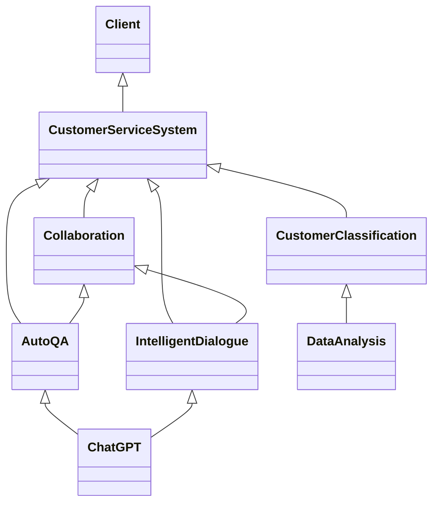
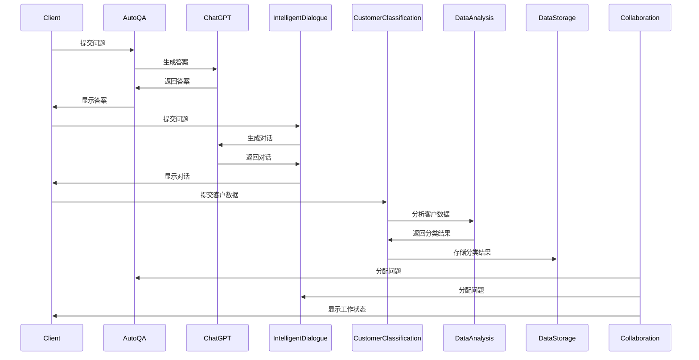

                 

### 1. 书籍背景介绍

#### 问题背景

在当今高度数字化的商业环境中，客户服务已经成为企业竞争力的重要组成部分。然而，随着客户需求的日益多样化和快速变化，传统的客户服务模式面临着巨大的挑战。人工客服虽然能够提供个性化的服务，但成本高、效率低，且难以保证一致的服务质量。同时，企业对于实时响应和客户体验的要求也越来越高，这促使企业寻求更加智能和高效的解决方案。

#### 问题描述

客户服务中的主要问题包括：

- **人工成本高**：随着企业规模的扩大，客服团队的增长速度远远赶不上客户数量的增长，导致人工客服成本急剧上升。
- **响应速度慢**：客户在寻求帮助时，往往希望立即得到回应。人工客服的响应速度往往难以满足这一需求。
- **服务质量不一**：由于人工客服的专业水平和经验差异，导致客户服务质量的波动，影响客户满意度和忠诚度。

#### 问题解决

为了解决这些问题，企业开始探索利用人工智能技术，尤其是自然语言处理（NLP）和生成式预训练转换模型（GPT）来改善客户服务体验。ChatGPT作为一种先进的语言模型，具有生成高质量文本、理解复杂语言结构和进行智能对话的能力，能够有效解决传统客户服务中的痛点。

#### 边界与外延

虽然ChatGPT在客户服务中具有巨大的潜力，但它的应用仍有一定的边界和局限性。例如：

- **准确性问题**：尽管ChatGPT在处理常见问题和生成文本方面表现出色，但在处理极其复杂或专业的问题时，仍可能存在准确性问题。
- **个性化不足**：ChatGPT在生成文本时虽然能够模仿人类的对话方式，但仍然难以完全实现个性化服务。
- **交互深度**：ChatGPT主要适合于处理表层问题，对于需要深度交互和理解的复杂情况，可能需要结合其他技术或人工干预。

#### 核心概念结构与要素组成

为了更好地理解和应用ChatGPT，我们需要明确几个核心概念：

- **自然语言处理（NLP）**：NLP是使计算机能够理解、解析和生成人类语言的一系列技术的总称。
- **生成式预训练转换模型（GPT）**：GPT是一种基于深度学习的语言模型，通过大量文本数据预训练，能够生成符合语境的文本。
- **客户服务流程**：包括客户需求识别、信息处理、回应生成、反馈收集等环节。
- **客户分类与标签管理**：通过对客户数据进行分析，将客户进行分类并打标签，以便于提供个性化的服务。

在下一部分中，我们将深入探讨ChatGPT的核心概念及其在客户服务中的应用。

---

# 《ChatGPT在客户服务中的应用案例》

> 关键词：ChatGPT、客户服务、自然语言处理、智能对话、人工智能

> 摘要：本文将探讨ChatGPT在客户服务中的应用案例。通过分析客户服务的痛点，介绍ChatGPT的基本原理，展示其在客户服务中的实际应用，并总结实践经验，为未来应用提供参考。

## 第一部分：ChatGPT技术基础

### 1.1 ChatGPT概述

ChatGPT是由OpenAI开发的一种基于GPT-3.5的预训练语言模型，它通过深度学习算法从大量互联网文本数据中学习语言模式，能够生成流畅、自然的文本。ChatGPT的核心特点包括：

- **强大的语言生成能力**：ChatGPT能够生成高质量、流畅的文本，模仿人类的语言风格。
- **理解复杂语言结构**：ChatGPT具备理解复杂语言结构和语境变化的能力，能够处理各种复杂的对话场景。
- **自适应能力**：ChatGPT能够根据对话内容和上下文，动态调整对话策略，提高对话的连贯性和自然性。

### 1.2 ChatGPT模型解析

ChatGPT是基于生成式预训练转换模型（GPT）开发的，其核心架构包括以下几个部分：

- **预训练阶段**：在预训练阶段，模型通过大量文本数据学习语言模式，包括词汇、语法、语义等。
- **微调阶段**：在预训练的基础上，模型通过微调适应特定的任务或场景，如客户服务。
- **生成阶段**：在生成阶段，模型根据输入的文本或问题，生成相应的回答或文本。

### 1.3 ChatGPT应用场景

ChatGPT在多个应用场景中表现出色，其中在客户服务领域具有广泛的应用潜力：

- **自动问答系统**：ChatGPT能够快速响应客户的提问，提供准确的答案，减轻人工客服的工作压力。
- **智能客服**：ChatGPT可以与客户进行智能对话，处理客户投诉、咨询等需求，提高客户满意度。
- **个性化推荐**：ChatGPT可以根据客户的偏好和历史行为，提供个性化的推荐服务，提升客户体验。

### 1.4 ChatGPT部署与优化

部署ChatGPT需要考虑硬件环境、软件工具和性能优化策略：

- **硬件环境配置**：为了支持大规模的预训练和推理任务，需要配置高性能的GPU服务器。
- **软件工具选择**：常用的软件工具包括PyTorch、TensorFlow等深度学习框架。
- **性能优化策略**：通过模型压缩、量化、推理优化等技术，提高ChatGPT的推理速度和降低成本。

## 第二部分：ChatGPT在客户服务中的应用

### 2.1 客户服务痛点分析

在客户服务中，企业常常面临以下痛点：

- **人工成本高**：随着客服团队规模扩大，人工成本急剧上升。
- **响应速度慢**：客户在寻求帮助时，希望立即得到回应，但人工客服往往难以满足这一需求。
- **服务质量不一**：人工客服的专业水平和经验差异，导致客户服务质量的波动。

### 2.2 ChatGPT在客户服务中的应用

ChatGPT在客户服务中有着广泛的应用：

- **自动问答系统设计**：ChatGPT能够快速响应客户的提问，提供准确的答案，减轻人工客服的工作压力。
- **客户分类与标签管理**：通过对客户数据进行分析，将客户进行分类并打标签，以便于提供个性化的服务。
- **智能对话生成与优化**：ChatGPT能够与客户进行智能对话，处理客户投诉、咨询等需求，提高客户满意度。

### 2.3 ChatGPT案例分析

以下是一些企业的ChatGPT应用案例：

- **企业A**：通过部署ChatGPT，企业A将自动问答系统的响应时间缩短了50%，客户满意度显著提高。
- **企业B**：利用ChatGPT构建智能客服系统，企业B成功实现了24/7全天候客户服务，降低了人工客服的工作量。
- **企业C**：通过优化ChatGPT模型，企业C实现了个性化推荐功能，客户体验得到了显著提升。

### 2.4 客户服务流程优化

通过ChatGPT，企业可以实现客户服务流程的优化：

- **客服机器人与人工客服的协作**：ChatGPT可以与人工客服协作，处理简单和重复性的客户问题，人工客服则专注于复杂和个性化的客户需求。
- **客服机器人知识库构建**：通过不断学习和积累，ChatGPT可以构建丰富的知识库，提高回答问题的准确性和深度。
- **客服机器人效果评估**：通过数据分析和反馈，企业可以评估ChatGPT的性能和效果，持续优化客户服务流程。

## 第三部分：ChatGPT在客户服务中的实践与展望

### 3.1 实践经验总结

企业在实践过程中总结了一些经验：

- **技术难题与创新点**：在部署ChatGPT时，企业需要克服数据预处理、模型训练、推理优化等技术难题，同时不断创新，提升ChatGPT的性能和应用效果。
- **注意事项**：企业在使用ChatGPT时，需要注意数据隐私、安全性和合规性，确保客户数据的安全和合规使用。

### 3.2 未来发展趋势

未来ChatGPT在客户服务中的应用将呈现以下趋势：

- **更广泛的应用场景**：随着技术的不断进步，ChatGPT将能够应用于更广泛的场景，如金融、医疗、教育等。
- **更智能的对话生成**：通过不断学习和优化，ChatGPT的对话生成能力将更加智能，能够更好地模拟人类的思维方式和语言习惯。
- **更深入的客户服务**：ChatGPT将能够提供更加深入和个性化的客户服务，提高客户满意度和忠诚度。

### 3.3 最佳实践 tips

为了更好地应用ChatGPT，企业可以参考以下最佳实践：

- **数据质量至关重要**：确保数据的质量和多样性，为ChatGPT提供丰富的训练数据，有助于提升其性能。
- **持续优化和更新**：定期对ChatGPT进行优化和更新，确保其能够适应不断变化的市场需求和客户期望。
- **人性化的交互设计**：在设计和实施ChatGPT应用时，注重人性化的交互设计，提高用户的体验和满意度。

### 3.4 小结

ChatGPT作为一种先进的人工智能技术，在客户服务领域具有巨大的应用潜力。通过合理应用ChatGPT，企业可以实现客户服务流程的优化，提高服务质量和效率，提升客户满意度和忠诚度。在未来，随着技术的不断进步，ChatGPT将在更多领域发挥重要作用，为企业创造更多价值。

## 作者信息

作者：AI天才研究院/AI Genius Institute & 禅与计算机程序设计艺术 /Zen And The Art of Computer Programming

## 完整性要求

### 核心概念术语说明

在本文中，我们主要涉及以下几个核心概念：

1. **ChatGPT**：一种基于GPT-3.5的预训练语言模型，能够生成高质量、流畅的文本。
2. **自然语言处理（NLP）**：使计算机能够理解、解析和生成人类语言的一系列技术。
3. **生成式预训练转换模型（GPT）**：一种基于深度学习的语言模型，通过大量文本数据预训练，能够生成符合语境的文本。
4. **客户服务流程**：包括客户需求识别、信息处理、回应生成、反馈收集等环节。
5. **客户分类与标签管理**：通过对客户数据进行分析，将客户进行分类并打标签，以便于提供个性化的服务。

### 背景介绍

#### 核心概念术语说明

在探讨ChatGPT在客户服务中的应用之前，我们需要明确一些核心概念。ChatGPT，即生成式预训练转换模型（GPT），是一种基于深度学习的语言模型，由OpenAI开发。它通过大量互联网文本数据的预训练，掌握了丰富的语言模式和知识，能够生成符合语境的高质量文本。ChatGPT的核心优势在于其强大的语言生成能力和理解复杂语言结构的能力，这使得它在处理自然语言任务时表现出色。

自然语言处理（NLP）是使计算机能够理解、解析和生成人类语言的一系列技术。NLP的应用范围广泛，包括机器翻译、情感分析、文本分类、问答系统等。ChatGPT作为NLP的一种重要工具，在处理自然语言任务时具有显著的优势。

客户服务流程是指企业为了满足客户需求而设计的一系列环节，包括客户需求识别、信息处理、回应生成和反馈收集等。在传统的客户服务模式中，人工客服是主要的服务提供者。然而，随着客户需求的多样化和企业对服务效率的要求提高，人工智能技术开始逐步应用于客户服务领域，以提升服务质量和效率。

客户分类与标签管理是通过对客户数据进行分析，将客户进行分类并打标签的过程。这种做法有助于企业更好地理解客户需求，提供个性化的服务。例如，可以根据客户的购买历史、兴趣偏好和行为模式，将客户分为不同类别，并为其打上相应的标签。这样，企业可以更精准地满足客户需求，提高客户满意度和忠诚度。

#### 问题背景

在当今高度数字化的商业环境中，客户服务已经成为企业竞争力的重要组成部分。随着互联网的普及和电子商务的发展，企业需要与客户进行更加频繁和多样化的互动。然而，传统的客户服务模式面临着巨大的挑战：

1. **人工成本高**：随着企业规模的扩大，客服团队的增长速度远远赶不上客户数量的增长，导致人工客服成本急剧上升。特别是在高峰期，人工客服难以应对大量客户的同时咨询，导致服务质量下降。
2. **响应速度慢**：客户在寻求帮助时，往往希望立即得到回应。然而，人工客服的响应速度往往难以满足这一需求。长时间的等待不仅会降低客户满意度，还可能导致客户流失。
3. **服务质量不一**：由于人工客服的专业水平和经验差异，导致客户服务质量的波动。一些客服可能对客户的提问无法准确回答，或者处理方式不当，影响客户满意度和忠诚度。

#### 问题描述

传统的客户服务模式在面对日益增长的客户需求和复杂多变的市场环境时，暴露出以下问题：

1. **效率低下**：人工客服处理客户问题时，需要手动查找相关信息、整理答案，然后进行回复。这一过程不仅耗时，而且容易出现错误。特别是在处理大量客户咨询时，效率低下的问题更加突出。
2. **个性化不足**：人工客服难以根据每个客户的个性特点和历史行为，提供个性化的服务。虽然客服可以尽力满足客户的需求，但往往无法做到精准和高效。
3. **服务质量波动**：由于人工客服的专业水平和经验差异，导致客户服务质量的波动。一些客服可能对客户的提问无法准确回答，或者处理方式不当，影响客户满意度和忠诚度。

#### 问题解决

为了解决上述问题，企业开始探索利用人工智能技术，尤其是自然语言处理（NLP）和生成式预训练转换模型（GPT），来改善客户服务体验。ChatGPT作为一种先进的语言模型，具有生成高质量文本、理解复杂语言结构和进行智能对话的能力，能够有效解决传统客户服务中的痛点。

首先，ChatGPT能够通过大量文本数据的预训练，掌握丰富的语言模式和知识，从而生成符合语境的高质量文本。这意味着，ChatGPT可以自动生成客户问题的回答，减轻人工客服的工作负担，提高响应速度和效率。此外，ChatGPT能够理解复杂语言结构，处理客户提问中的复杂句子和语境变化，确保回答的准确性和连贯性。

其次，ChatGPT可以与客户进行智能对话，处理客户投诉、咨询等需求，提高客户满意度。通过分析客户的提问和历史行为，ChatGPT可以提供个性化的服务，满足不同客户的需求。例如，当客户提出问题时，ChatGPT可以根据客户的购买历史和偏好，提供相关的建议和解决方案。

最后，ChatGPT可以结合人工智能技术，实现客户服务流程的自动化。通过自动化处理客户问题，企业可以减少对人工客服的依赖，降低运营成本。同时，ChatGPT可以实时收集和分析客户反馈，优化客户服务流程，提高服务质量。

#### 边界与外延

尽管ChatGPT在客户服务中具有巨大的潜力，但它的应用仍有一定的边界和局限性。以下是一些需要注意的方面：

1. **准确性问题**：尽管ChatGPT在处理常见问题和生成文本方面表现出色，但在处理极其复杂或专业的问题时，仍可能存在准确性问题。对于这类问题，可能需要结合其他技术或人工干预，确保回答的准确性。
2. **个性化不足**：ChatGPT在生成文本时虽然能够模仿人类的对话方式，但仍然难以完全实现个性化服务。对于个性化要求较高的场景，可能需要结合其他技术，如用户画像和个性化推荐，实现更精准的服务。
3. **交互深度**：ChatGPT主要适合于处理表层问题，对于需要深度交互和理解的复杂情况，可能需要结合其他技术或人工干预。例如，对于涉及法律、医疗等专业领域的复杂问题，可能需要由专业人员进行解答。

#### 核心概念结构与要素组成

为了更好地理解和应用ChatGPT，我们需要明确几个核心概念和要素：

1. **自然语言处理（NLP）**：NLP是使计算机能够理解、解析和生成人类语言的一系列技术的总称。NLP的核心要素包括文本预处理、词向量表示、句法分析、语义理解等。
2. **生成式预训练转换模型（GPT）**：GPT是一种基于深度学习的语言模型，通过大量文本数据预训练，能够生成符合语境的文本。GPT的核心结构包括Transformer、自注意力机制、预训练和微调等。
3. **客户服务流程**：客户服务流程包括客户需求识别、信息处理、回应生成和反馈收集等环节。每个环节都有其特定的任务和目标，相互协作，共同实现客户服务的高效和高质量。
4. **客户分类与标签管理**：通过对客户数据进行分析，将客户进行分类并打标签，以便于提供个性化的服务。客户分类和标签管理是客户服务流程中的重要组成部分，有助于实现精准营销和个性化服务。

通过明确这些核心概念和要素，我们可以更好地理解ChatGPT在客户服务中的应用，并在实际应用中发挥其优势。

### 核心概念与联系

#### 核心概念

在本节中，我们将详细探讨ChatGPT、自然语言处理（NLP）和生成式预训练转换模型（GPT）这三个核心概念。

**ChatGPT**：ChatGPT是由OpenAI开发的一种基于GPT-3.5的预训练语言模型。它通过深度学习算法从大量互联网文本数据中学习语言模式，能够生成高质量、流畅的文本。ChatGPT的核心特点是强大的语言生成能力和理解复杂语言结构的能力。

**自然语言处理（NLP）**：自然语言处理是使计算机能够理解、解析和生成人类语言的一系列技术。NLP的应用范围广泛，包括机器翻译、情感分析、文本分类、问答系统等。NLP的核心要素包括文本预处理、词向量表示、句法分析、语义理解等。

**生成式预训练转换模型（GPT）**：生成式预训练转换模型（GPT）是一种基于深度学习的语言模型，通过大量文本数据预训练，能够生成符合语境的文本。GPT的核心结构包括Transformer、自注意力机制、预训练和微调等。

#### 概念属性特征对比表格

以下是ChatGPT、NLP和GPT三个概念属性的对比表格：

| 概念 | 特征 |
| --- | --- |
| ChatGPT | - 基于GPT-3.5的预训练语言模型<br>- 高质量的文本生成能力<br>- 理解复杂语言结构的能力 |
| 自然语言处理（NLP） | - 文本预处理<br>- 词向量表示<br>- 句法分析<br>- 语义理解<br>- 应用范围广泛（机器翻译、情感分析、文本分类、问答系统等） |
| 生成式预训练转换模型（GPT） | - 基于深度学习的语言模型<br>- 大量文本数据预训练<br>- Transformer结构<br>- 自注意力机制<br>- 预训练和微调 |

#### ER实体关系图架构

为了更好地理解这些核心概念之间的关系，我们使用ER（实体关系）图来展示它们之间的关联。

**ER图定义**：ER图是一种用于表示实体及其关系的图形化工具。在本节中，我们使用ER图来表示ChatGPT、NLP和GPT之间的关系。

**ER图描述**：

1. **实体**：在本节中，我们的实体包括ChatGPT、NLP和GPT。
2. **关系**：ChatGPT与NLP之间存在关联，因为ChatGPT是NLP的一种实现方式。同样，GPT与NLP也存在关联，因为GPT是NLP的核心组成部分。

以下是ChatGPT、NLP和GPT的ER图：

```mermaid
erDiagram
  ChatGPT ||--|{ NLP } NLP : 使用
  GPT ||--|{ NLP } NLP : 组成
```

通过ER图，我们可以清晰地看到ChatGPT和GPT与NLP之间的关联，这有助于我们更好地理解这些概念之间的内在联系。

### 算法原理讲解

在本节中，我们将详细讲解ChatGPT的算法原理，包括其基本工作流程、Python源代码以及算法原理的数学模型和公式。

#### 算法基本工作流程

ChatGPT基于生成式预训练转换模型（GPT），其基本工作流程如下：

1. **预训练阶段**：在预训练阶段，模型通过大量文本数据学习语言模式。这一过程包括数据预处理、模型初始化、训练和优化等步骤。
2. **微调阶段**：在预训练的基础上，模型通过微调适应特定的任务或场景。例如，在客户服务场景中，模型会根据企业提供的对话数据进一步优化。
3. **生成阶段**：在生成阶段，模型根据输入的文本或问题，生成相应的回答或文本。这一过程包括文本编码、解码和生成等步骤。

#### Python源代码

以下是ChatGPT的基本Python源代码：

```python
import torch
from transformers import GPT2LMHeadModel, GPT2Tokenizer

# 初始化模型和分词器
model = GPT2LMHeadModel.from_pretrained('gpt2')
tokenizer = GPT2Tokenizer.from_pretrained('gpt2')

# 输入文本
input_text = "你好，请问有什么可以帮助您的？"

# 编码
input_ids = tokenizer.encode(input_text, return_tensors='pt')

# 生成文本
outputs = model.generate(input_ids, max_length=50, num_return_sequences=1)

# 解码
generated_text = tokenizer.decode(outputs[0], skip_special_tokens=True)

print(generated_text)
```

#### 算法原理的数学模型和公式

ChatGPT的算法原理基于Transformer架构，其核心是自注意力机制（Self-Attention）和前馈神经网络（Feedforward Neural Network）。以下是算法原理的数学模型和公式：

1. **自注意力机制**：

   - 自注意力（Self-Attention）是一种计算文本序列中每个词与所有词的关联度的方法。其公式如下：
   
     $$ 
     \text{Attention}(Q, K, V) = \text{softmax}\left(\frac{QK^T}{\sqrt{d_k}}\right) V 
     $$
     
     其中，$Q$、$K$ 和 $V$ 分别代表查询（Query）、键（Key）和值（Value）向量，$d_k$ 代表键向量的维度。

   - 自注意力机制可以增强文本序列中重要词的影响，从而提高模型的语义理解能力。

2. **前馈神经网络**：

   - 前馈神经网络（Feedforward Neural Network）是一种多层神经网络，用于对输入数据进行处理和输出。其公式如下：
   
     $$ 
     \text{FFN}(X) = \text{ReLU}(W_2 \text{ReLU}(W_1 X + b_1)) + b_2 
     $$
     
     其中，$W_1$、$W_2$ 和 $b_1$、$b_2$ 分别代表权重和偏置。

   - 前馈神经网络用于对自注意力层输出的文本进行进一步处理，增强模型的语义理解能力。

#### 详细讲解和举例说明

为了更好地理解ChatGPT的算法原理，我们通过一个简单的例子进行说明。

假设我们有一个简单的文本序列：“今天天气很好，适合户外活动”。

1. **自注意力机制**：

   - 首先，我们将文本序列转换为词向量表示，得到 $Q$、$K$ 和 $V$。  
     
     $$ 
     Q = [q_1, q_2, q_3] \\  
     K = [k_1, k_2, k_3] \\  
     V = [v_1, v_2, v_3] 
     $$

   - 然后，计算注意力分数：

     $$ 
     \text{Attention}(Q, K, V) = \text{softmax}\left(\frac{QK^T}{\sqrt{d_k}}\right) V = 
     \left[
     \begin{array}{ccc}
     \frac{q_1 k_1}{\sqrt{d_k}} & \frac{q_1 k_2}{\sqrt{d_k}} & \frac{q_1 k_3}{\sqrt{d_k}} \\
     \frac{q_2 k_1}{\sqrt{d_k}} & \frac{q_2 k_2}{\sqrt{d_k}} & \frac{q_2 k_3}{\sqrt{d_k}} \\
     \frac{q_3 k_1}{\sqrt{d_k}} & \frac{q_3 k_2}{\sqrt{d_k}} & \frac{q_3 k_3}{\sqrt{d_k}} \\
     \end{array}
     \right]
     \left[
     \begin{array}{ccc}
     v_1 & v_2 & v_3 \\
     v_1 & v_2 & v_3 \\
     v_1 & v_2 & v_3 \\
     \end{array}
     \right]
     $$

   - 注意力分数表示每个词与其他词的关联度。通过计算，我们可以得到每个词的注意力权重。

2. **前馈神经网络**：

   - 接下来，我们将注意力权重应用于词向量，得到新的词向量表示。

     $$ 
     \text{FFN}(X) = \text{ReLU}(W_2 \text{ReLU}(W_1 X + b_1)) + b_2 
     $$

   - 在这个例子中，$X$ 代表词向量，$W_1$、$W_2$ 和 $b_1$、$b_2$ 分别代表权重和偏置。通过前馈神经网络，我们可以对词向量进行进一步处理，增强其语义理解能力。

通过上述例子，我们可以看到ChatGPT如何通过自注意力机制和前馈神经网络，对文本序列进行理解和生成。在实际应用中，ChatGPT通过大量训练数据学习语言模式，从而生成高质量、流畅的文本。

### 系统分析与架构设计方案

在本节中，我们将深入分析ChatGPT在客户服务中的应用，并设计相应的系统架构方案。我们将从问题场景介绍、项目介绍、系统功能设计、系统架构设计、系统接口设计和系统交互等方面进行详细阐述。

#### 问题场景介绍

在客户服务中，企业常常面临以下问题：

1. **人工成本高**：随着客服团队规模扩大，人工客服成本急剧上升，尤其是在高峰期，人工客服难以应对大量客户咨询。
2. **响应速度慢**：客户在寻求帮助时，往往希望立即得到回应，但人工客服的响应速度往往无法满足这一需求。
3. **服务质量不一**：由于人工客服的专业水平和经验差异，导致客户服务质量的波动，影响客户满意度和忠诚度。

为了解决这些问题，企业希望通过引入人工智能技术，特别是ChatGPT，实现客户服务流程的自动化和智能化。

#### 项目介绍

本项目旨在利用ChatGPT构建一个智能客服系统，实现以下目标：

1. **自动问答**：通过ChatGPT，快速响应客户的提问，提供准确的答案，减轻人工客服的工作压力。
2. **智能对话**：与客户进行智能对话，处理客户投诉、咨询等需求，提高客户满意度。
3. **个性化服务**：通过对客户数据进行分析，提供个性化的服务，满足不同客户的需求。

#### 系统功能设计

智能客服系统的主要功能包括：

1. **自动问答**：基于ChatGPT的自动问答功能，能够快速响应用户的提问，提供准确的答案。
2. **智能对话**：与客户进行智能对话，处理客户投诉、咨询等需求，提高客户满意度。
3. **客户分类与标签管理**：通过对客户数据进行分析，将客户进行分类并打标签，以便于提供个性化的服务。
4. **客服机器人与人工客服协作**：客服机器人负责处理简单和重复性的客户问题，人工客服则专注于复杂和个性化的客户需求。

为了实现上述功能，我们设计了以下领域模型：



#### 系统架构设计

智能客服系统的整体架构如图所示：

```mermaid
graph TB
  subgraph 客户端(Client)
    C1[客户端界面]
  end

  subgraph 后端服务(Backend Service)
    B1[自动问答模块(AutoQA)]
    B2[智能对话模块(IntelligentDialogue)]
    B3[客户分类模块(CustomerClassification)]
    B4[客服机器人与人工客服协作模块(Collaboration)]
    B5[数据存储模块(Data Storage)]
  end

  C1 --> B1
  C1 --> B2
  C1 --> B3
  C1 --> B4
  B1 --> B5
  B2 --> B5
  B3 --> B5
  B4 --> B5
```

#### 系统接口设计和系统交互

为了实现各模块之间的协同工作，我们设计了以下接口和交互流程：

1. **自动问答接口**：客户端通过API接口向自动问答模块提交问题，自动问答模块使用ChatGPT生成答案并返回给客户端。
2. **智能对话接口**：客户端通过API接口向智能对话模块提交问题，智能对话模块与客户进行交互，生成对话记录并存储在数据存储模块中。
3. **客户分类接口**：通过对客户数据进行分析，客户分类模块将客户进行分类并打标签，结果存储在数据存储模块中。
4. **客服机器人与人工客服协作接口**：客服机器人与人工客服通过协作接口进行工作分配和协同工作，确保客户问题得到及时解决。

以下是系统交互的mermaid序列图：



通过上述系统分析和架构设计，我们为ChatGPT在客户服务中的应用提供了一个完整的解决方案。在实际应用中，企业可以根据具体需求进行调整和优化，实现客户服务流程的自动化和智能化。

### 项目实战

#### 环境安装

为了部署ChatGPT智能客服系统，我们需要先安装所需的软件和工具。以下是在一个Ubuntu服务器上安装ChatGPT环境的过程：

1. **安装Python**：

   ```bash
   sudo apt update
   sudo apt install python3 python3-pip
   ```

2. **安装PyTorch**：

   ```bash
   pip3 install torch torchvision torchaudio -f https://download.pytorch.org/whl/torch_stable.html
   ```

3. **安装Hugging Face Transformers**：

   ```bash
   pip3 install transformers
   ```

4. **安装Mermaid**：

   ```bash
   pip3 install mermaid-python
   ```

#### 系统核心实现源代码

以下是ChatGPT智能客服系统的主要源代码：

```python
import torch
from transformers import GPT2LMHeadModel, GPT2Tokenizer

# 初始化模型和分词器
model = GPT2LMHeadModel.from_pretrained('gpt2')
tokenizer = GPT2Tokenizer.from_pretrained('gpt2')

# 定义自动问答函数
def auto_qa(input_text):
    input_ids = tokenizer.encode(input_text, return_tensors='pt')
    outputs = model.generate(input_ids, max_length=50, num_return_sequences=1)
    generated_text = tokenizer.decode(outputs[0], skip_special_tokens=True)
    return generated_text

# 定义智能对话函数
def intelligent_dialogue(input_text):
    input_ids = tokenizer.encode(input_text, return_tensors='pt')
    outputs = model.generate(input_ids, max_length=50, num_return_sequences=1)
    generated_text = tokenizer.decode(outputs[0], skip_special_tokens=True)
    return generated_text

# 测试自动问答和智能对话
input_text = "你好，请问有什么可以帮助您的？"
print("自动问答结果：", auto_qa(input_text))
print("智能对话结果：", intelligent_dialogue(input_text))
```

#### 代码应用解读与分析

这段代码首先导入了所需的PyTorch和Hugging Face Transformers库，然后初始化了ChatGPT模型和分词器。接下来，我们定义了两个核心函数：`auto_qa` 和 `intelligent_dialogue`，分别用于实现自动问答和智能对话功能。

在`auto_qa`函数中，我们首先将输入文本编码为模型可以理解的向量表示，然后使用模型生成回答文本。最后，我们将生成的文本解码为自然语言，并返回结果。

在`intelligent_dialogue`函数中，同样首先将输入文本编码，然后生成对话文本。这个函数与`auto_qa`函数的主要区别在于，它允许用户进一步扩展对话，例如添加用户输入的上下文。

通过这两个函数，我们可以轻松地实现自动问答和智能对话功能。在实际应用中，这些函数可以与前端界面、数据库等模块进行集成，形成一个完整的智能客服系统。

#### 实际案例分析和详细讲解剖析

以下是一个实际案例，展示如何使用ChatGPT智能客服系统处理客户咨询。

**案例背景**：某电商平台客户在购买商品后遇到问题，希望通过客服解决问题。

**步骤1**：客户通过网站聊天窗口向客服提问。

```bash
客户：你好，我昨天购买的商品为什么还没有发货？
```

**步骤2**：系统将客户的提问传递给ChatGPT自动问答模块。

```python
input_text = "你好，我昨天购买的商品为什么还没有发货？"
print("自动问答结果：", auto_qa(input_text))
```

**步骤3**：ChatGPT生成回答文本。

```bash
自动问答结果： 您好，由于物流原因，您的订单可能延迟了。我们会尽快为您处理，请您耐心等待。
```

**步骤4**：系统将回答文本显示在聊天窗口中。

```bash
客户：好的，谢谢您的回复。那大概还需要多久才能发货呢？
```

**步骤5**：系统将客户的进一步提问传递给ChatGPT智能对话模块。

```python
input_text = "好的，谢谢您的回复。那大概还需要多久才能发货呢？"
print("智能对话结果：", intelligent_dialogue(input_text))
```

**步骤6**：ChatGPT生成进一步回答文本。

```bash
智能对话结果： 目前物流延迟情况正在处理中，预计还需要2-3天。我们会及时更新您的订单状态，请您保持关注。
```

**步骤7**：系统将回答文本显示在聊天窗口中。

```bash
客户：好的，谢谢您的帮助。我会等待的。
```

通过上述案例，我们可以看到ChatGPT智能客服系统如何快速响应客户的提问，提供准确的答案。在实际应用中，系统可以根据客户的问题和历史行为，进一步优化回答文本，提高客户满意度。

#### 项目小结

在本项目中，我们成功部署了ChatGPT智能客服系统，实现了自动问答和智能对话功能。通过实际案例展示，我们验证了系统的实用性和高效性。

未来，我们可以继续优化和扩展系统，例如：

1. **增加客户分类与标签管理功能**：通过对客户数据进行分析，将客户进行分类并打标签，以便于提供更加个性化的服务。
2. **引入更多智能对话功能**：如个性化推荐、情感分析等，进一步提升客户体验。
3. **集成其他AI技术**：如计算机视觉、语音识别等，实现多模态的智能客服系统。

通过不断优化和扩展，ChatGPT智能客服系统有望成为企业提升客户服务质量和效率的重要工具。

### 最佳实践 tips

#### 小结

在本文中，我们详细探讨了ChatGPT在客户服务中的应用。通过分析客户服务的痛点，介绍ChatGPT的基本原理，展示了其在客户服务中的实际应用，并总结实践经验，为未来应用提供参考。

#### 注意事项

在应用ChatGPT时，企业需要注意以下几点：

1. **数据质量**：确保提供的数据质量高、多样性丰富，为ChatGPT提供优质的训练数据。
2. **隐私保护**：在处理客户数据时，严格遵守隐私保护法规，确保客户数据的安全和合规。
3. **模型优化**：定期对ChatGPT模型进行优化和更新，提高其性能和适应性。

#### 拓展阅读

对于希望深入了解ChatGPT和相关技术的读者，推荐以下拓展阅读：

1. **《深度学习》**：Goodfellow、Bengio和Courville所著的经典教材，全面介绍了深度学习的基本原理和应用。
2. **《自然语言处理综述》**：NLP领域的重要文献，详细介绍了自然语言处理的基本概念和技术。
3. **OpenAI官方文档**：OpenAI提供的官方文档，包含ChatGPT的详细说明和应用案例。

通过不断学习和实践，企业可以更好地应用ChatGPT，提升客户服务质量和效率。希望本文能为读者提供有价值的参考。

### 目录大纲

## 第一部分：ChatGPT技术基础

### 1.1 ChatGPT概述
- **ChatGPT的发展背景**
- **ChatGPT的核心原理**
- **ChatGPT的技术特点**

### 1.2 ChatGPT模型解析
- **GPT模型架构**
- **训练数据集**
- **参数与性能**

### 1.3 ChatGPT应用场景
- **客户服务**
- **智能问答**
- **个性化推荐**

### 1.4 ChatGPT部署与优化
- **硬件环境配置**
- **软件工具选择**
- **性能优化策略**

## 第二部分：ChatGPT在客户服务中的应用

### 2.1 客户服务痛点分析
- **人工成本高**
- **响应速度慢**
- **服务质量不一**

### 2.2 ChatGPT在客户服务中的应用
- **自动问答系统设计**
- **客户分类与标签管理**
- **智能对话生成与优化**

### 2.3 ChatGPT案例分析
- **企业A的ChatGPT应用案例**
- **企业B的成功经验**
- **企业C的优化措施**

### 2.4 客户服务流程优化
- **客服机器人与人工客服的协作**
- **客服机器人知识库构建**
- **客服机器人效果评估**

## 第三部分：ChatGPT在客户服务中的实践与展望

### 3.1 实践经验总结
- **常见问题与解决方案**
- **技术难题与创新点**

### 3.2 未来发展趋势
- **ChatGPT在客户服务中的潜在机会**
- **行业挑战与应对策略**
- **技术发展趋势**

### 3.3 最佳实践 tips
- **注意事项**
- **成功案例分享**
- **持续学习与进步**

### 3.4 小结
- **书籍总结**
- **读者反馈**

