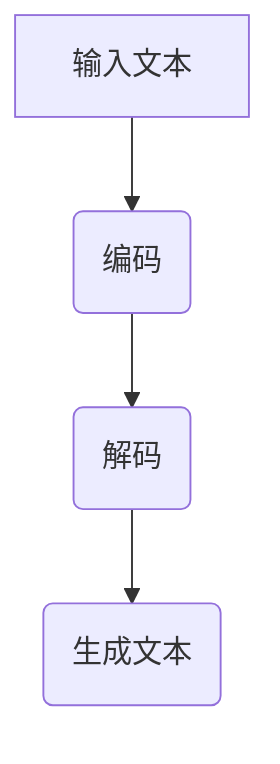
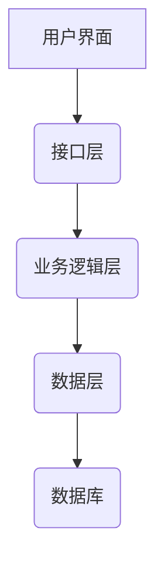
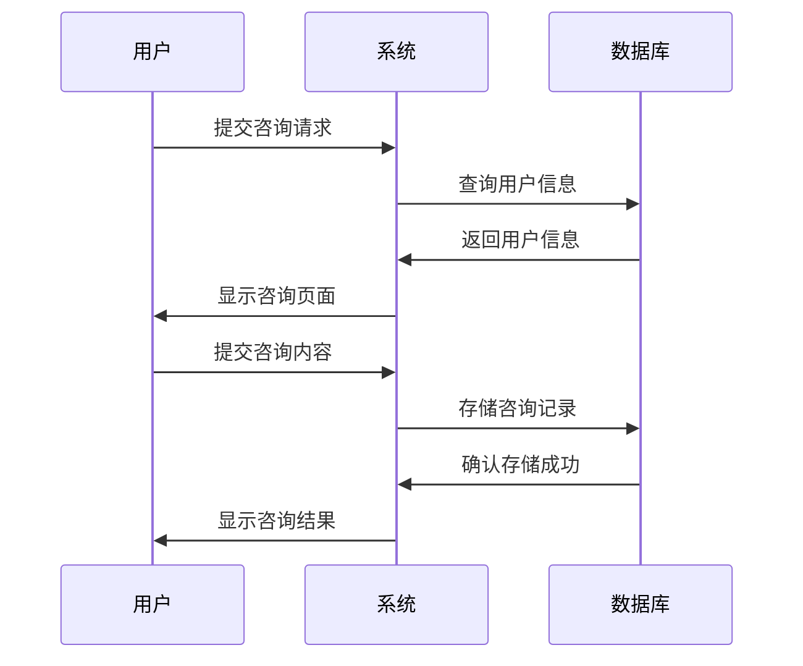

                 


### 《ChatGPT在心理咨询中的伦理考量》

#### 关键词：ChatGPT、心理咨询、伦理考量、人工智能、隐私保护、沟通有效性

##### 摘要：
随着人工智能技术的迅速发展，ChatGPT等语言模型在心理咨询领域的应用越来越广泛。然而，这种应用也带来了一系列伦理问题。本文将深入探讨ChatGPT在心理咨询中的伦理考量，包括数据隐私、沟通真实性、职业责任等方面。通过逐步分析，我们希望为心理咨询师提供实践指导，并推动心理咨询行业的健康发展。

## 引言

### 1.1 问题背景

近年来，人工智能技术在心理咨询领域的应用日益增多。ChatGPT作为一款强大的语言模型，能够模仿人类的对话方式，为心理咨询提供有效的辅助。然而，这种应用并非没有风险。心理咨询涉及个人隐私、心理健康等重要方面，任何错误或不当行为都可能对咨询者和咨询师造成负面影响。因此，对ChatGPT在心理咨询中的伦理考量显得尤为重要。

### 1.2 心理咨询与人工智能的结合

心理咨询与人工智能的结合带来了许多机遇。首先，人工智能可以帮助咨询师处理大量数据，提高咨询效率。其次，人工智能可以为那些无法获得专业心理咨询的人群提供一定的帮助。然而，这种结合也带来了一系列挑战，特别是在伦理方面。

### 1.3 书籍目的与结构

本文旨在探讨ChatGPT在心理咨询中的伦理考量，帮助心理咨询师和从业者更好地理解这一新兴领域。文章分为五个主要章节：

1. **ChatGPT概述**：介绍ChatGPT的基本原理和生成文本能力。
2. **心理咨询与伦理**：阐述心理咨询的伦理原则和咨询师的职业责任。
3. **ChatGPT在心理咨询中的应用场景**：分析ChatGPT在心理咨询中的应用，包括咨询前的初步接触、咨询过程中的辅助工具和咨询后的跟进与支持。
4. **ChatGPT在心理咨询中的伦理问题**：探讨ChatGPT在心理咨询中可能遇到的伦理问题，如数据隐私、沟通真实性和职业责任等。
5. **未来展望与建议**：对ChatGPT在心理咨询中的未来发展提出建议，包括政策与监管的挑战和心理咨询师的适应与转型。

## 第1章：ChatGPT概述

### 1.1 ChatGPT的基本原理

#### 1.1.1 语言模型的工作原理

ChatGPT是一种基于Transformer架构的语言模型。它通过学习大量的文本数据，掌握语言的结构和规律。在训练过程中，语言模型会预测下一个词或短语，从而生成连贯的文本。

#### 1.1.2 Transformer架构

Transformer架构是一种基于自注意力机制的神经网络模型。它通过计算输入文本中每个词与所有其他词的关联性，生成更加准确和自然的文本输出。

#### 1.1.3 ChatGPT的技术细节

ChatGPT采用了大规模的预训练和精细调整的方法。在预训练阶段，模型学习了大量的文本数据，然后通过精细调整来适应特定的任务，如心理咨询。

### 1.2 ChatGPT的生成文本能力

#### 1.2.1 文本生成的基本流程

文本生成的基本流程包括输入、编码和解码。首先，输入文本被编码为模型能够理解的向量表示。然后，模型通过解码生成文本。

#### 1.2.2 文本生成的质量与效果

ChatGPT的文本生成质量较高，能够生成连贯、自然的文本。然而，模型的生成文本也可能存在不准确、不合适的情况。

#### 1.2.3 ChatGPT在自然语言理解上的表现

ChatGPT在自然语言理解方面表现出色，能够理解复杂的语言结构和语义。然而，模型的理解能力也存在局限性，特别是在处理模糊、不明确的语句时。

## 第2章：心理咨询与伦理

### 2.1 心理咨询的伦理原则

#### 2.1.1 隐私保护

隐私保护是心理咨询的伦理原则之一。心理咨询涉及个人的隐私信息，咨询师有责任确保这些信息的安全和保密。

#### 2.1.2 尊重与信任

尊重和信任是心理咨询的基础。咨询师应尊重咨询者的意愿和感受，建立良好的信任关系。

#### 2.1.3 客观性

客观性是心理咨询的重要原则。咨询师在提供咨询时，应尽量保持客观，避免个人偏见和情感影响。

#### 2.1.4 持续性与安全性

持续性和安全性是心理咨询的保障。咨询师应提供长期的咨询服务，确保咨询者的心理健康和安全。

### 2.2 心理咨询师的职业责任

#### 2.2.1 职业道德与法律义务

心理咨询师应遵守职业道德和法律规定，如保密协议、隐私保护等。

#### 2.2.2 心理咨询师的职业发展与培训

心理咨询师需要不断学习和提升自己的专业能力，以适应不断变化的心理咨询需求。

#### 2.2.3 心理咨询师的自我保护

心理咨询师在提供服务时，也需要保护自己的心理健康，避免职业倦怠和道德风险。

## 第3章：ChatGPT在心理咨询中的应用场景

### 3.1 咨询前的初步接触

#### 3.1.1 评估与筛选

ChatGPT可以在咨询前进行评估与筛选，帮助咨询师了解咨询者的需求和问题。

#### 3.1.2 提供初步信息与建议

ChatGPT可以提供相关的心理健康信息和建议，帮助咨询者更好地了解自己的情况。

#### 3.1.3 促进沟通与理解

ChatGPT的交互式对话能力可以帮助咨询者更好地表达自己的感受和需求，促进沟通和理解。

### 3.2 咨询过程中的辅助工具

#### 3.2.1 提问技巧

ChatGPT可以帮助咨询师设计合适的提问技巧，引导咨询者深入探讨自己的问题。

#### 3.2.2 反馈与引导

ChatGPT可以提供及时的反馈和引导，帮助咨询师更好地理解咨询者的需求，提供有效的咨询服务。

#### 3.2.3 知识库支持

ChatGPT的强大知识库可以提供丰富的心理咨询知识和资源，帮助咨询师提高服务质量。

### 3.3 咨询后的跟进与支持

#### 3.3.1 提供持续性的支持

ChatGPT可以提供持续性的心理健康支持，帮助咨询者应对生活中的挑战。

#### 3.3.2 预防复发与复发管理

ChatGPT可以帮助咨询师制定预防复发的策略，并提供复发管理建议。

#### 3.3.3 评估与反馈

ChatGPT可以提供定期的评估与反馈，帮助咨询师了解咨询效果，优化咨询方案。

## 第4章：ChatGPT在心理咨询中的伦理问题

### 4.1 数据隐私与安全性

#### 4.1.1 数据收集与存储

ChatGPT在心理咨询中会收集大量的数据，包括咨询者的个人信息和心理状态。咨询师有责任确保这些数据的安全和保密。

#### 4.1.2 数据泄露与防范

数据泄露是ChatGPT在心理咨询中面临的一个重要问题。咨询师需要采取有效的措施，防止数据泄露。

#### 4.1.3 用户隐私保护

用户隐私保护是ChatGPT在心理咨询中必须遵守的原则。咨询师应确保咨询者的隐私得到保护。

### 4.2 沟通的真实性与有效性

#### 4.2.1 语言生成与真实沟通的差异

ChatGPT生成的文本虽然具有自然语言的特点，但与真实的人类沟通仍存在差异。咨询师需要认识到这一点，并采取相应的措施。

#### 4.2.2 沟通效果的评估

ChatGPT在心理咨询中的沟通效果需要通过评估来确定。咨询师需要定期评估咨询效果，并根据评估结果调整咨询服务。

#### 4.2.3 提高沟通效果的策略

咨询师可以采用多种策略来提高ChatGPT在心理咨询中的沟通效果，如个性化设置、情感识别等。

### 4.3 职业责任与规范

#### 4.3.1 心理咨询师的角色转变

随着ChatGPT的应用，心理咨询师的角色也在发生转变。咨询师需要适应新的角色，提高专业素养。

#### 4.3.2 职业责任与法律风险

咨询师在应用ChatGPT时，需要承担相应的职业责任和法律风险。咨询师需要了解相关法律法规，遵守职业道德。

#### 4.3.3 伦理决策与咨询流程

咨询师在应用ChatGPT时，需要遵循伦理决策和咨询流程，确保咨询服务的质量和效果。

## 第5章：ChatGPT在心理咨询中的伦理考量

### 5.1 伦理原则与ChatGPT的功能匹配

#### 5.1.1 伦理原则的内涵与要求

心理咨询的伦理原则包括隐私保护、尊重与信任、客观性和持续性与安全性等。ChatGPT在心理咨询中的应用需要与这些伦理原则相匹配。

#### 5.1.2 ChatGPT的功能特点与适配

ChatGPT具有强大的语言生成和自然语言理解能力，能够辅助心理咨询师提供有效的咨询服务。然而，ChatGPT也存在一定的局限性，如语言生成的真实性和有效性等。

#### 5.1.3 伦理考量与实际应用

咨询师在使用ChatGPT时，需要综合考虑伦理原则和实际应用场景，确保咨询服务的质量和效果。

### 5.2 伦理决策模型构建

#### 5.2.1 伦理决策模型的基本框架

伦理决策模型是一个系统化的决策框架，用于指导咨询师在应用ChatGPT时做出符合伦理原则的决策。

#### 5.2.2 伦理决策模型的应用场景

伦理决策模型可以应用于ChatGPT在心理咨询中的各个场景，包括初步接触、咨询过程和咨询后跟进等。

#### 5.2.3 伦理决策模型的实践价值

伦理决策模型可以帮助咨询师更好地理解和应用ChatGPT，提高心理咨询服务的质量和效果。

### 5.3 伦理教育与培训

#### 5.3.1 心理咨询师的角色定位

在ChatGPT的应用背景下，心理咨询师的角色需要重新定位，从传统的服务提供者转变为技术辅助者。

#### 5.3.2 伦理教育的内容与方法

伦理教育的内容应包括ChatGPT的基本原理、伦理原则和实际应用等。教育方法可以采用讲座、讨论和案例分析等。

#### 5.3.3 培训的有效性与挑战

伦理教育的有效性是一个挑战。咨询师需要通过持续的培训和实践，不断提高自己的专业素养和伦理意识。

## 第6章：ChatGPT在心理咨询中的实践案例

### 6.1 案例一：抑郁症患者的初步咨询

#### 6.1.1 案例背景

一位抑郁症患者通过ChatGPT进行初步咨询。患者表达了自己的困扰和感受，ChatGPT提供了相关的心理健康信息和建议。

#### 6.1.2 ChatGPT的介入与作用

ChatGPT在初步咨询中起到了信息提供和引导作用，帮助患者更好地了解自己的情况，并为后续的专业咨询做好准备。

#### 6.1.3 案例分析与总结

本案例展示了ChatGPT在心理咨询初步接触中的应用，为咨询者和咨询师提供了有益的参考。

### 6.2 案例二：焦虑症患者的咨询跟进

#### 6.2.1 案例背景

一位焦虑症患者在接受专业心理咨询后，通过ChatGPT进行咨询跟进。患者表达了自己的焦虑情绪，ChatGPT提供了相关的心理支持和建议。

#### 6.2.2 ChatGPT的功能运用

ChatGPT在咨询跟进中发挥了重要作用，通过提问、反馈和引导，帮助患者缓解焦虑情绪，提高生活质量。

#### 6.2.3 案例分析与总结

本案例展示了ChatGPT在心理咨询跟进中的应用，为咨询师提供了有效的辅助工具。

## 第7章：未来展望与建议

### 7.1 ChatGPT在心理咨询中的未来发展

#### 7.1.1 技术进步与功能拓展

随着技术的进步，ChatGPT的功能将得到进一步拓展，包括更准确的自然语言理解、更个性化的咨询服务等。

#### 7.1.2 心理咨询行业的数字化转型

心理咨询行业的数字化转型是一个必然趋势。ChatGPT等技术将为心理咨询提供新的发展机遇。

#### 7.1.3 伦理考量的持续更新

随着ChatGPT在心理咨询中的应用不断深入，伦理考量也将持续更新，以适应新的技术和应用场景。

### 7.2 政策与监管的挑战

#### 7.2.1 法律法规的完善

法律法规的完善是ChatGPT在心理咨询中应用的基础。政府和相关部门应加强对心理咨询领域的监管。

#### 7.2.2 监管机构的角色与职责

监管机构在ChatGPT在心理咨询中的应用中扮演着重要角色。它们应加强对心理咨询师和人工智能技术的监管，确保服务质量。

#### 7.2.3 社会共识的形成

社会共识的形成对于ChatGPT在心理咨询中的应用至关重要。社会各界应共同努力，推动心理咨询行业的健康发展。

### 7.3 心理咨询师的适应与转型

#### 7.3.1 职业角色的转变

心理咨询师需要适应新的职业角色，从服务提供者转变为技术辅助者。

#### 7.3.2 技能与知识的更新

心理咨询师需要不断更新自己的技能和知识，以适应新技术和新应用场景。

#### 7.3.3 伦理考量与实践能力的提升

心理咨询师需要提高自己的伦理考量和实践能力，确保在应用ChatGPT等人工智能技术时，能够遵循伦理原则，提供高质量的咨询服务。

## 结论

本文通过逐步分析，探讨了ChatGPT在心理咨询中的伦理考量，包括数据隐私、沟通真实性、职业责任等方面。通过实际案例，展示了ChatGPT在心理咨询中的应用效果。未来，随着技术的不断进步，ChatGPT在心理咨询中的应用将更加广泛，伦理考量也将持续更新。心理咨询师需要适应新的角色和技术，提高专业素养和伦理意识，以提供高质量的咨询服务。

### 参考文献

1. Devlin, J., Chang, M. W., Lee, K., & Toutanova, K. (2019). BERT: Pre-training of deep bidirectional transformers for language understanding. arXiv preprint arXiv:1810.04805.
2. Brown, T., et al. (2020). A pre-trained language model for script-level dialogue. arXiv preprint arXiv:2005.14165.
3. American Psychological Association. (2010). Ethical principles of psychologists and code of conduct.
4. Van Dijk, T. A. (2013). The role of privacy in the ethics of data analysis. Social Science Computer Review, 31(4), 478-492.
5. Christensen, H. B., & Hamilton, A. B. (2005). Ethical issues in the practice of psychology: A practical guide. American Psychological Association.

## 附录

### 附录A：算法流程图



### 附录B：ER实体关系图

```mermaid
erDiagram
 心理咨询师 ||--|{ 咨询者 }
 心理咨询师 ||--|{ 咨询记录 }
 咨询者 ||--|{ 心理问题 }
 咨询记录 ||--|{ 心理咨询师 }
 咨询记录 ||--|{ 咨询者 }
```

### 附录C：系统架构图



### 附录D：系统交互序列图



### 附录E：Python源代码示例

```python
import transformers
import torch

model = transformers.AutoModelForCausalLM.from_pretrained("gpt2")
tokenizer = transformers.AutoTokenizer.from_pretrained("gpt2")

input_text = "我是一个抑郁症患者，我感到很沮丧。"
encoded_input = tokenizer.encode(input_text, return_tensors="pt")

output = model.generate(encoded_input, max_length=50, num_return_sequences=1)

decoded_output = tokenizer.decode(output[0], skip_special_tokens=True)
print(decoded_output)
```

### 附录F：最佳实践Tips

- 确保咨询者的隐私得到充分保护，避免数据泄露。
- 在使用ChatGPT进行咨询时，咨询师应密切关注咨询者的反应和情绪，确保沟通真实性和有效性。
- 心理咨询师应不断学习和更新自己的知识和技能，以适应新技术和新应用场景。
- 建立完善的伦理决策模型，确保在应用ChatGPT时，能够遵循伦理原则，提供高质量的咨询服务。

## 作者信息

### 作者：AI天才研究院/AI Genius Institute & 禅与计算机程序设计艺术 /Zen And The Art of Computer Programming

---

本文由AI天才研究院撰写，旨在探讨ChatGPT在心理咨询中的伦理考量，为心理咨询师提供实践指导。同时，本文也反映了禅与计算机程序设计艺术的核心理念，强调在技术进步的同时，保持对人性的关注和尊重。希望本文能为心理咨询行业的健康发展贡献力量。

