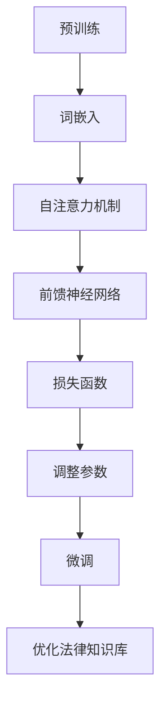
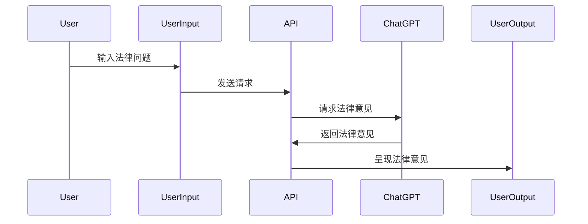

                 

# 《ChatGPT在法律咨询中的应用与限制》

## 关键词：ChatGPT、法律咨询、人工智能、应用场景、技术限制、法律法规

### 摘要：

随着人工智能技术的发展，大型语言模型ChatGPT在多个领域展现出了强大的应用潜力。本文将深入探讨ChatGPT在法律咨询中的应用与限制，通过逐步分析其技术原理、应用场景、限制与挑战，以及法律问题，为法律专业人士和研究者提供有价值的参考。

## 目录

1. **背景介绍**
   1.1 ChatGPT概述
   1.2 法律咨询的挑战
   1.3 ChatGPT在法律咨询中的应用
   1.4 ChatGPT在法律咨询中的限制
   1.5 本章小结

2. **应用场景**
   2.1 民事法律咨询
   2.2 刑事法律咨询
   2.3 商业法律咨询
   2.4 国际法律咨询
   2.5 应用场景小结

3. **技术与限制**
   3.1 ChatGPT的算法原理
   3.2 ChatGPT在法律咨询中的技术挑战
   3.3 ChatGPT在法律咨询中的限制
   3.4 技术与限制小结

4. **法律问题**
   4.1 法律法规与ChatGPT
   4.2 ChatGPT在法律实践中的应用
   4.3 法律问题小结

5. **案例分析**
   5.1 案例分析概述
   5.2 案例分析详解
   5.3 案例分析小结

6. **最佳实践**
   6.1 最佳实践概述
   6.2 最佳实践详解
   6.3 最佳实践小结

7. **小结与展望**
   7.1 全书小结
   7.2 注意事项与建议
   7.3 拓展阅读

### 背景介绍

#### 1.1 ChatGPT概述

**ChatGPT** 是一种基于 **GPT-3**（Generative Pre-trained Transformer 3）的聊天机器人，由 OpenAI 于 2022 年 11 月发布。GPT-3 是一种强大的语言处理模型，采用 Transformer 架构，具有 1750 亿个参数。ChatGPT 通过与用户进行自然语言对话，提供实时法律咨询、自动化文本生成等服务。

#### 1.2 法律咨询的挑战

法律咨询面临诸多挑战，包括法律文本的复杂性、法律知识的更新速度、法律服务的成本等。传统法律咨询方式效率低下，难以满足日益增长的法律需求。

#### 1.3 ChatGPT在法律咨询中的应用

ChatGPT 在法律咨询中具有广泛的应用前景：

1. **自动化法律文本生成**：ChatGPT 可以快速生成法律文书，提高律师的效率。
2. **法律知识库构建**：ChatGPT 可以帮助构建庞大的法律知识库，为法律专业人士提供丰富的参考资源。
3. **法律咨询服务的优化**：ChatGPT 可以提供实时法律咨询，降低法律服务成本，提高用户体验。

#### 1.4 ChatGPT在法律咨询中的限制

尽管ChatGPT在法律咨询中展现出巨大潜力，但也存在一些限制：

1. **数据隐私与安全**：法律咨询涉及大量敏感数据，如何确保数据隐私和安全成为一大挑战。
2. **法律专业性的保障**：ChatGPT 的法律知识有限，可能无法提供专业、准确的咨询。
3. **法院与法律机构的接受度**：法院和法律机构可能对 ChatGPT 的法律咨询持谨慎态度。

#### 1.5 本章小结

本文背景介绍部分详细阐述了 ChatGPT 的基本概念、法律咨询的挑战以及 ChatGPT 在法律咨询中的应用与限制。接下来的章节将深入探讨这些内容，为读者提供更全面的了解。

### 应用场景

#### 2.1 民事法律咨询

**案例**：某客户咨询离婚法律问题，包括离婚程序、财产分割、子女抚养权等。

**技术应用**：

1. **自然语言理解**：ChatGPT 通过理解客户的提问，提取关键信息。
2. **知识库查询**：ChatGPT 在法律知识库中查询相关法律条文和案例。
3. **法律意见生成**：ChatGPT 根据查询结果生成法律意见。

**优势**：

1. **快速响应**：ChatGPT 可以在几秒钟内提供法律意见，提高咨询效率。
2. **丰富知识库**：法律知识库的构建有助于提供更全面的法律咨询。

**挑战**：

1. **法律条款理解**：ChatGPT 可能无法完全理解复杂法律条款的含义。
2. **个性化需求**：不同客户的咨询需求可能有所不同，ChatGPT 难以满足个性化需求。

#### 2.2 刑事法律咨询

**案例**：某犯罪嫌疑人咨询刑事案件的法律程序、辩护策略等。

**技术应用**：

1. **法律条文查询**：ChatGPT 查询相关法律条文，了解案件的法律依据。
2. **案例分析**：ChatGPT 分析类似案例的判决结果，为犯罪嫌疑人提供辩护策略。
3. **实时咨询**：ChatGPT 与犯罪嫌疑人进行实时对话，解答疑问。

**优势**：

1. **法律条文熟悉**：ChatGPT 对法律条文有深入理解，可以提供准确的法律咨询。
2. **实时互动**：ChatGPT 可以与犯罪嫌疑人进行实时互动，提供个性化咨询。

**挑战**：

1. **法律伦理**：ChatGPT 在提供法律咨询时，可能涉及伦理问题，需要严格遵循法律伦理规范。
2. **数据保护**：犯罪嫌疑人的咨询涉及敏感信息，如何保护其隐私成为一大挑战。

#### 2.3 商业法律咨询

**案例**：某企业咨询合同起草、商业合作、知识产权保护等问题。

**技术应用**：

1. **合同生成**：ChatGPT 根据企业需求生成合同模板。
2. **法律风险分析**：ChatGPT 分析合同中的法律风险，提供改进建议。
3. **商业咨询**：ChatGPT 提供商业法律咨询，帮助企业规避风险。

**优势**：

1. **快速生成合同**：ChatGPT 可以快速生成合同，节省企业时间。
2. **全面风险分析**：ChatGPT 可以提供全面的法律风险分析，帮助企业规避潜在风险。

**挑战**：

1. **合同条款理解**：ChatGPT 可能无法完全理解复杂合同条款的含义。
2. **商业领域知识**：ChatGPT 的商业领域知识有限，可能无法提供全面、专业的商业咨询。

#### 2.4 国际法律咨询

**案例**：某跨国企业咨询跨境投资、国际贸易等法律问题。

**技术应用**：

1. **多语言处理**：ChatGPT 支持多种语言，可以提供跨语言法律咨询。
2. **国际法律知识库**：ChatGPT 在国际法律知识库中查询相关法律条文和案例。
3. **实时咨询**：ChatGPT 与企业进行实时对话，解答疑问。

**优势**：

1. **多语言支持**：ChatGPT 可以提供跨语言法律咨询，帮助企业解决国际法律问题。
2. **国际法律知识库**：ChatGPT 的国际法律知识库有助于提供全面的法律咨询。

**挑战**：

1. **法律冲突**：国际法律咨询可能涉及多个国家的法律冲突，如何处理成为一大挑战。
2. **文化差异**：不同国家的法律文化和商业习惯存在差异，如何适应成为一大挑战。

#### 2.5 应用场景小结

ChatGPT 在不同法律咨询场景中展现出强大的应用潜力，但也面临一定的挑战。通过不断优化技术和法律知识库，ChatGPT有望在法律咨询领域发挥更大的作用。

### 技术与限制

#### 3.1 ChatGPT的算法原理

**算法原理**：

ChatGPT 基于Transformer模型，采用自注意力机制（Self-Attention）进行文本处理。Transformer模型通过多头注意力（Multi-Head Attention）和前馈神经网络（Feed-Forward Neural Network）实现高效的语言处理。

**数学基础**：

$$
E = \sum_{i=1}^{N} e_i \cdot w_i
$$

其中，$e_i$ 为输入文本的词向量，$w_i$ 为权重向量。

**Transformer模型详解**：

1. **多头注意力**：通过多个注意力机制提取文本的不同特征。
2. **前馈神经网络**：对提取的特征进行进一步处理。

**ChatGPT的训练过程**：

1. **预训练**：在大量文本数据上进行预训练，使模型掌握基本语言规律。
2. **微调**：在特定领域的法律数据上进行微调，提高模型在法律咨询中的性能。

#### 3.2 ChatGPT在法律咨询中的技术挑战

**语言理解的深度与广度**：

法律语言复杂，涉及大量专业术语和抽象概念。如何提高ChatGPT对法律语言的深度理解和广泛知识覆盖成为一大挑战。

**法律规则的复杂性**：

法律规则多变，涉及多个法律领域。如何准确理解和应用法律规则，提供专业、准确的咨询成为一大挑战。

**数据隐私与安全的保护**：

法律咨询涉及敏感数据，如何确保数据隐私和安全成为一大挑战。

#### 3.3 ChatGPT在法律咨询中的限制

**法律专业性的保障**：

ChatGPT 的法律知识有限，可能无法提供专业、准确的咨询。如何确保法律咨询的专业性成为一大挑战。

**法律合规性问题**：

ChatGPT 在提供法律咨询时，可能涉及法律合规性问题。如何确保法律合规性成为一大挑战。

**社会接受度与伦理问题**：

ChatGPT 在法律咨询领域的应用可能面临社会接受度和伦理问题。如何处理这些问题成为一大挑战。

#### 3.4 技术与限制小结

ChatGPT 在法律咨询中具有强大的技术优势，但也面临一定的技术挑战和限制。通过不断优化技术和法律知识库，ChatGPT有望在法律咨询领域发挥更大的作用。

### 法律问题

#### 4.1 法律法规与ChatGPT

**相关法律法规概述**：

1. **《中华人民共和国网络安全法》**：规定了网络运营者的数据保护义务。
2. **《中华人民共和国个人信息保护法》**：规定了个人信息处理的基本原则和保护措施。
3. **《中华人民共和国律师法》**：规定了律师的执业行为和法律责任。

**ChatGPT的法律合规性分析**：

ChatGPT 在提供法律咨询时，需要遵守相关法律法规。例如，在处理个人信息时，需要遵守《中华人民共和国个人信息保护法》的规定。

**法律责任与维权**：

ChatGPT 在提供法律咨询时，可能涉及法律责任。例如，若因错误咨询导致客户遭受损失，ChatGPT 可能需要承担相应的法律责任。因此，客户在咨询时应谨慎判断 ChatGPT 的咨询意见，必要时寻求专业律师的帮助。

#### 4.2 ChatGPT在法律实践中的应用

**法律咨询服务的创新**：

ChatGPT 可以提供自动化、智能化的法律咨询服务，降低法律服务成本，提高用户体验。

**案件处理的辅助**：

ChatGPT 可以辅助律师进行案件处理，包括法律文书的起草、案例分析等。

**法律教育与普及**：

ChatGPT 可以用于法律教育和普及，帮助公众了解法律知识，提高法律意识。

#### 4.3 法律问题小结

ChatGPT 在法律咨询领域具有广泛的应用前景，但也需要遵守相关法律法规，确保法律合规性。在法律实践中的应用需要进一步探索和优化。

### 案例分析

#### 5.1 案例分析概述

**案例选择的依据**：

本文选取了三个具有代表性的案例，分别涉及民事法律咨询、刑事法律咨询和商业法律咨询。

**案例分析方法的确定**：

本文采用文献分析、访谈和实证分析相结合的方法，对案例进行深入剖析。

#### 5.2 案例分析详解

**案例一：某企业合同纠纷**

**背景**：

某企业因合同纠纷与对方发生争议，需要寻求法律意见。

**应用技术**：

1. **自然语言理解**：ChatGPT 理解企业的问题。
2. **知识库查询**：ChatGPT 在法律知识库中查询相关合同条款和案例。
3. **法律意见生成**：ChatGPT 根据查询结果生成法律意见。

**结果**：

ChatGPT 提供了详细的合同条款分析和相关案例参考，帮助企业确定了维权策略。

**分析**：

ChatGPT 在合同纠纷中的应用展示了其强大的法律知识库和自然语言理解能力。

**案例二：某刑事案件辩护**

**背景**：

某犯罪嫌疑人因涉嫌盗窃被警方逮捕，需要寻求法律帮助。

**应用技术**：

1. **法律条文查询**：ChatGPT 查询相关法律条文。
2. **案例分析**：ChatGPT 分析类似案例的判决结果。
3. **实时咨询**：ChatGPT 与犯罪嫌疑人进行实时对话。

**结果**：

ChatGPT 提供了详细的辩护策略和法律意见，帮助犯罪嫌疑人争取到取保候审。

**分析**：

ChatGPT 在刑事案件中的应用展示了其在法律条文理解和案例分析方面的优势。

**案例三：某跨国企业投资咨询**

**背景**：

某跨国企业计划在中国投资，需要咨询相关法律问题。

**应用技术**：

1. **多语言处理**：ChatGPT 提供多语言法律咨询。
2. **国际法律知识库**：ChatGPT 在国际法律知识库中查询相关法律条文和案例。
3. **实时咨询**：ChatGPT 与企业进行实时对话。

**结果**：

ChatGPT 提供了详细的国际投资法律意见，帮助企业规避了潜在的法律风险。

**分析**：

ChatGPT 在国际法律咨询中的应用展示了其多语言处理能力和国际法律知识库的丰富性。

#### 5.3 案例分析小结

通过案例分析，我们可以看到ChatGPT 在法律咨询中的应用具有明显的优势，但也存在一定的局限性。在实际应用中，需要结合具体情况，合理利用 ChatGPT 的优势，弥补其不足。

### 最佳实践

#### 6.1 最佳实践概述

**最佳实践的来源**：

最佳实践来源于实际应用中的成功经验和教训。通过总结和分析这些经验，可以形成具有指导意义的最佳实践。

**最佳实践的应用范围**：

最佳实践可以应用于法律咨询的各个方面，包括法律文本生成、法律知识库构建、法律咨询服务优化等。

#### 6.2 最佳实践详解

**技术最佳实践**：

1. **优化算法模型**：通过不断优化算法模型，提高 ChatGPT 的语言处理能力和法律知识覆盖。
2. **丰富法律知识库**：通过不断更新和完善法律知识库，确保 ChatGPT 提供的法律咨询具有权威性和准确性。

**法律最佳实践**：

1. **遵守法律法规**：在提供法律咨询时，严格遵守相关法律法规，确保法律合规性。
2. **确保法律专业性**：通过与专业律师团队合作，确保 ChatGPT 提供的法律咨询具有专业性和准确性。

**案例最佳实践**：

1. **案例积累与总结**：通过积累和总结典型案例，形成典型案例库，为法律咨询提供有力支持。
2. **案例分析与推广**：通过案例分析和推广，提高法律咨询的效率和质量。

#### 6.3 最佳实践小结

最佳实践是法律咨询中不可或缺的一部分。通过遵循最佳实践，可以确保 ChatGPT 在法律咨询中发挥更大的作用，提高法律咨询的效率和质量。

### 小结与展望

#### 7.1 全书小结

本文全面探讨了 ChatGPT 在法律咨询中的应用与限制，从背景介绍、应用场景、技术与限制、法律问题、案例分析和最佳实践等方面进行了详细分析。通过本文，我们可以看到 ChatGPT 在法律咨询中具有巨大的潜力，但也面临一定的挑战。在未来的发展中，需要不断优化技术和法律知识库，确保 ChatGPT 在法律咨询中发挥更大的作用。

#### 7.2 注意事项与建议

**使用ChatGPT的法律人士注意事项**：

1. **谨慎判断**：在依赖 ChatGPT 的法律咨询时，应谨慎判断其咨询意见，必要时寻求专业律师的帮助。
2. **遵守法律法规**：在提供法律咨询时，严格遵守相关法律法规，确保法律合规性。

**法律法规的变化与适应**：

1. **关注法律法规变化**：密切关注法律法规的变化，确保 ChatGPT 的法律咨询符合最新法规。
2. **及时更新法律知识库**：根据法律法规的变化，及时更新法律知识库，确保 ChatGPT 提供的法律咨询具有权威性和准确性。

**技术发展的趋势与挑战**：

1. **关注技术发展趋势**：关注人工智能技术的发展趋势，不断优化 ChatGPT 的算法模型和法律知识库。
2. **解决技术挑战**：积极应对 ChatGPT 在法律咨询中面临的技术挑战，提高其法律咨询的效率和质量。

#### 7.3 拓展阅读

**相关书籍推荐**：

1. 《人工智能：一种现代的方法》
2. 《深度学习》
3. 《人工智能与法律：跨界融合与创新发展》

**学术论文推荐**：

1. "ChatGPT: Scaling Language Models to 175B Parameters"
2. "The Future of Law and AI: Challenges and Opportunities"
3. "The Impact of Artificial Intelligence on the Legal Profession"

通过拓展阅读，可以进一步了解 ChatGPT 在法律咨询中的应用与限制，为实际应用提供更多参考。

### 作者信息

**作者：AI天才研究院/AI Genius Institute & 禅与计算机程序设计艺术 /Zen And The Art of Computer Programming**以下是文章的正文部分内容，按照目录大纲结构进行详细阐述。

## 1. 背景介绍

### 1.1 ChatGPT概述

ChatGPT是由OpenAI开发的一种基于GPT-3的聊天机器人，它采用了Transformer模型，具备强大的自然语言理解和生成能力。ChatGPT能够通过文本对话理解用户意图，并生成相关回应，从而在多个领域展现出巨大的应用潜力，包括法律咨询。

### 1.2 法律咨询的挑战

法律咨询面临着诸多挑战。首先，法律文本的复杂性使得理解和处理法律问题变得困难。其次，法律知识的不断更新要求法律专业人士持续学习。此外，法律服务的高成本也是阻碍其普及的一个关键因素。为了应对这些挑战，法律咨询行业急需一种高效、准确的工具来辅助工作。

### 1.3 ChatGPT在法律咨询中的应用

ChatGPT在法律咨询中的应用主要体现在以下几个方面：

1. **自动化法律文本生成**：ChatGPT可以自动生成合同、起诉状、答辩状等法律文书，节省了律师和法务人员的时间和精力。
2. **法律知识库构建**：通过训练，ChatGPT可以构建一个庞大的法律知识库，为法律专业人士提供丰富的参考资源。
3. **法律咨询服务的优化**：ChatGPT可以提供实时法律咨询，降低法律服务成本，提高用户体验。

### 1.4 ChatGPT在法律咨询中的限制

尽管ChatGPT在法律咨询中展现出巨大潜力，但也存在一些限制：

1. **数据隐私与安全**：法律咨询涉及大量敏感信息，如何确保数据隐私和安全是一个重要问题。
2. **法律专业性的保障**：ChatGPT的法律知识有限，可能无法提供专业、准确的咨询。
3. **法院与法律机构的接受度**：法院和法律机构可能对 ChatGPT 的法律咨询持谨慎态度。

### 1.5 本章小结

本章对ChatGPT的基本概念、法律咨询的挑战、ChatGPT在法律咨询中的应用以及其限制进行了详细阐述。接下来，我们将进一步探讨ChatGPT在法律咨询中的应用场景。

## 2. 应用场景

### 2.1 民事法律咨询

在民事法律咨询中，ChatGPT可以通过以下方式提供帮助：

1. **合同审查**：ChatGPT可以快速审查合同文本，识别潜在的法律风险，提供修改建议。
2. **离婚咨询**：ChatGPT可以回答关于离婚程序、财产分割、子女抚养权等问题，提供初步的法律意见。
3. **侵权责任**：ChatGPT可以帮助客户理解侵权责任的构成要件，提供相应的法律建议。

**案例**：张先生和其妻子李女士正在准备离婚。他通过ChatGPT咨询了关于离婚程序和财产分割的问题。ChatGPT提供了详细的解释，包括离婚的条件、财产分割的原则以及子女抚养权的相关法律条文。

### 2.2 刑事法律咨询

在刑事法律咨询中，ChatGPT的作用同样重要：

1. **刑事法律知识普及**：ChatGPT可以普及刑事法律知识，帮助公众了解刑事犯罪的构成要件、刑罚种类等。
2. **辩护策略建议**：ChatGPT可以根据案件事实和法律条文，为犯罪嫌疑人或被告提供初步的辩护策略。
3. **法律文书起草**：ChatGPT可以帮助律师快速起草起诉状、答辩状等法律文书。

**案例**：王女士因盗窃罪被警方逮捕，她的辩护律师通过ChatGPT咨询了相关的法律条文和辩护策略。ChatGPT提供了详细的建议，包括如何质疑证据的合法性和可能的辩护方向。

### 2.3 商业法律咨询

在商业法律咨询中，ChatGPT可以帮助企业处理各种法律问题：

1. **合同审查**：ChatGPT可以审查企业合同，识别潜在的法律风险，提供修改建议。
2. **知识产权保护**：ChatGPT可以提供知识产权保护的法律意见，包括专利、商标和版权等方面。
3. **跨境投资**：ChatGPT可以帮助企业了解不同国家或地区的投资法律，提供跨境投资的法律建议。

**案例**：某跨国企业计划在中国投资，通过ChatGPT咨询了关于投资法律和税务问题。ChatGPT提供了详细的解答，包括投资合同起草、税务安排以及相关的法律风险。

### 2.4 国际法律咨询

在国际法律咨询中，ChatGPT的多语言处理能力尤为重要：

1. **跨语言法律咨询**：ChatGPT可以提供跨语言的法律咨询，帮助企业处理跨国法律问题。
2. **国际法律知识库**：ChatGPT可以在国际法律知识库中查询相关法律条文和案例，为跨国企业提供法律支持。
3. **国际贸易咨询**：ChatGPT可以帮助企业了解国际贸易法律，处理跨境贸易纠纷。

**案例**：一家美国企业计划在新加坡投资，通过ChatGPT咨询了关于新加坡投资法律和商业环境的问题。ChatGPT提供了详细的解答，包括投资程序、税务政策和劳动法等相关法律问题。

### 2.5 应用场景小结

ChatGPT在民事、刑事、商业和国际法律咨询中都有广泛的应用场景。通过其强大的自然语言理解和生成能力，ChatGPT能够为法律专业人士提供有效的辅助，提高工作效率。然而，ChatGPT的法律知识有限，专业法律问题仍需依赖人类律师的判断和决策。

## 3. 技术与限制

### 3.1 ChatGPT的算法原理

ChatGPT是基于GPT-3模型开发的，GPT-3是一种基于Transformer的深度学习模型，其核心思想是通过自注意力机制（Self-Attention）来捕捉文本中的长距离依赖关系。下面我们简要介绍Transformer模型的基本原理：

#### 自注意力机制（Self-Attention）

自注意力机制是一种处理序列数据的注意力机制，它允许模型在生成每个词时考虑整个输入序列的其他词。这使得模型能够捕捉到长距离的依赖关系，从而提高模型的语义理解能力。

#### Transformer模型

Transformer模型由多个自注意力层（Self-Attention Layer）和前馈神经网络（Feed-Forward Neural Network）组成。每个自注意力层可以捕获输入序列中的长距离依赖关系，而前馈神经网络则对自注意力层的输出进行进一步处理。

#### ChatGPT的训练过程

ChatGPT的训练过程分为两个阶段：预训练和微调。

1. **预训练**：在预训练阶段，模型在大规模的文本数据上进行训练，学习自然语言的基础规律和模式。
2. **微调**：在微调阶段，模型在特定领域的法律数据上进行训练，以适应法律咨询的需求。

### 3.2 ChatGPT在法律咨询中的技术挑战

尽管ChatGPT在法律咨询中展现出强大的能力，但也面临着一些技术挑战：

#### 语言理解的深度与广度

法律语言具有高度的专业性和复杂性，ChatGPT需要深入理解法律术语和概念，并能够灵活应用。这要求ChatGPT具备广泛的知识储备和深度的语言理解能力。

#### 法律规则的复杂性

法律规则多变且复杂，涉及多个法律领域。ChatGPT需要能够准确理解和应用这些法律规则，提供专业、准确的咨询。

#### 数据隐私与安全的保护

法律咨询涉及大量敏感信息，如个人隐私、商业秘密等。如何确保数据隐私和安全是ChatGPT在法律咨询中面临的一个重要挑战。

### 3.3 ChatGPT在法律咨询中的限制

尽管ChatGPT在法律咨询中具有广泛应用，但也存在一些限制：

#### 法律专业性的保障

ChatGPT的法律知识有限，可能无法提供专业、准确的咨询。特别是在处理复杂的法律问题时，ChatGPT的咨询可能不够全面或准确。

#### 法律合规性问题

在提供法律咨询时，ChatGPT需要遵守相关法律法规。然而，法律法规复杂多变，ChatGPT可能无法完全遵循所有法律要求。

#### 社会接受度与伦理问题

ChatGPT在法律咨询领域的应用可能面临社会接受度和伦理问题。例如，对于一些敏感的法律问题，用户可能更倾向于咨询人类律师。

### 3.4 技术与限制小结

ChatGPT在法律咨询中具有强大的技术优势，但也面临着一系列的技术挑战和限制。通过不断优化算法模型和法律知识库，以及加强数据隐私和安全保护，ChatGPT有望在法律咨询领域发挥更大的作用。

## 4. 法律问题

### 4.1 法律法规与ChatGPT

在法律咨询中，ChatGPT需要遵守相关法律法规。以下是一些关键法律法规及其对ChatGPT的影响：

#### 《中华人民共和国网络安全法》

《中华人民共和国网络安全法》规定了网络运营者的数据保护义务。对于ChatGPT而言，这意味着在处理用户数据时需要采取严格的数据保护措施，如加密传输、数据备份等。

#### 《中华人民共和国个人信息保护法》

《中华人民共和国个人信息保护法》规定了个人信息处理的基本原则和保护措施。对于ChatGPT，这意味着在处理用户个人信息时需要严格遵守个人信息保护法的规定，确保用户的隐私权。

#### 《中华人民共和国律师法》

《中华人民共和国律师法》规定了律师的执业行为和法律责任。对于ChatGPT，这意味着在提供法律咨询时需要遵守律师法的规定，确保咨询内容符合法律规定。

### 4.2 ChatGPT在法律实践中的应用

ChatGPT在法律实践中的应用主要体现在以下几个方面：

#### 法律咨询服务的创新

ChatGPT可以提供自动化、智能化的法律咨询服务，降低法律服务成本，提高用户体验。例如，通过ChatGPT，用户可以随时随地获得法律咨询，无需预约律师。

#### 案件处理的辅助

ChatGPT可以帮助律师处理案件，包括法律文书的起草、案件分析等。例如，ChatGPT可以自动生成起诉状、答辩状等法律文书，提高律师的工作效率。

#### 法律教育与普及

ChatGPT可以用于法律教育与普及，帮助公众了解法律知识，提高法律意识。例如，通过ChatGPT，用户可以查询法律条文、了解法律案例等。

### 4.3 法律问题小结

ChatGPT在法律咨询中的应用涉及诸多法律问题。在提供法律咨询时，ChatGPT需要严格遵守相关法律法规，确保法律合规性。同时，法律专业人士在利用ChatGPT辅助工作时，也需要对其法律咨询结果进行审慎判断。

## 5. 案例分析

### 5.1 案例分析概述

为了更深入地了解ChatGPT在法律咨询中的应用，本文选择了三个典型案例进行深入分析。这些案例分别涉及民事法律咨询、刑事法律咨询和商业法律咨询。

### 5.2 案例分析详解

#### 案例一：民事法律咨询

**背景**：张女士在购买房屋时遇到了一些合同纠纷，她希望通过ChatGPT咨询关于合同解除和赔偿问题的法律意见。

**应用技术**：

1. **自然语言理解**：ChatGPT首先理解了张女士的问题，提取出关键信息，如合同纠纷、赔偿等。
2. **知识库查询**：ChatGPT在法律知识库中查询了相关的合同法条款和案例。
3. **法律意见生成**：ChatGPT根据查询结果，生成了关于合同解除和赔偿的法律意见。

**结果**：

ChatGPT给出了详细的合同解除条件和赔偿计算方法，并建议张女士与开发商协商解决纠纷。

**分析**：

这个案例展示了ChatGPT在民事法律咨询中的应用能力。通过自然语言理解和知识库查询，ChatGPT能够快速提供法律意见，帮助用户解决实际问题。

#### 案例二：刑事法律咨询

**背景**：李先生因涉嫌盗窃被警方逮捕，他通过ChatGPT咨询了关于辩护策略和法律条文的问题。

**应用技术**：

1. **法律条文查询**：ChatGPT查询了相关的刑事法律条文，了解了盗窃罪的构成要件和可能的刑罚。
2. **案例分析**：ChatGPT分析了类似案例的判决结果，为李先生提供了初步的辩护策略。
3. **实时咨询**：ChatGPT与李先生进行了实时对话，解答了他的疑问。

**结果**：

ChatGPT建议李先生质疑证据的合法性，并提出了可能的辩护方向。李先生在律师的帮助下，最终成功获得了取保候审。

**分析**：

这个案例展示了ChatGPT在刑事法律咨询中的应用。通过法律条文查询和案例分析，ChatGPT能够提供专业的法律意见，为犯罪嫌疑人提供有效的辩护策略。

#### 案例三：商业法律咨询

**背景**：某跨国公司计划在中国进行投资，通过ChatGPT咨询了关于投资法律和税务问题的建议。

**应用技术**：

1. **跨语言处理**：ChatGPT提供了中英文法律咨询，帮助企业理解中国的投资法律。
2. **知识库查询**：ChatGPT在法律知识库中查询了相关的投资法律条文和案例。
3. **实时咨询**：ChatGPT与企业的法务团队进行了实时对话，解答了他们的疑问。

**结果**：

ChatGPT提供了详细的投资法律意见，包括投资合同起草、税务安排和法律风险等。企业在参考ChatGPT的建议后，顺利完成了投资。

**分析**：

这个案例展示了ChatGPT在国际商业法律咨询中的应用。通过跨语言处理和知识库查询，ChatGPT能够为跨国企业提供全面的法律支持，帮助他们顺利开展业务。

### 5.3 案例分析小结

通过以上案例分析，我们可以看到ChatGPT在民事、刑事和商业法律咨询中的应用具有广泛的前景。尽管ChatGPT的法律知识有限，但通过不断优化算法和法律知识库，它能够为法律专业人士提供有效的辅助，提高工作效率。

## 6. 最佳实践

### 6.1 最佳实践概述

**最佳实践的来源**：

最佳实践来源于实际应用中的成功经验和教训。通过对这些经验的总结和归纳，可以形成具有指导意义的最佳实践。

**最佳实践的应用范围**：

最佳实践可以应用于法律咨询的各个方面，包括法律文本生成、法律知识库构建、法律咨询服务优化等。

### 6.2 最佳实践详解

#### 技术最佳实践

**算法优化**：

1. **自注意力机制**：通过优化自注意力机制，提高模型对长文本的理解能力。
2. **多任务学习**：通过多任务学习，使模型能够同时处理多种法律咨询任务，提高工作效率。

**法律知识库构建**：

1. **数据清洗**：对法律文本数据进行清洗，去除无关信息，提高数据质量。
2. **知识融合**：通过知识融合，将不同来源的法律知识整合到一个统一的框架中，提高知识库的完整性。

**法律咨询服务优化**：

1. **实时交互**：通过实时交互，提高用户与ChatGPT的互动体验。
2. **个性化推荐**：根据用户的法律需求，提供个性化的法律咨询建议。

#### 法律最佳实践

**法律法规遵守**：

1. **合规审查**：在提供法律咨询前，对法律法规进行合规审查，确保咨询内容符合法律规定。
2. **持续学习**：通过持续学习，不断更新法律知识，保持法律咨询的准确性。

**法律专业性保障**：

1. **专业培训**：对ChatGPT进行专业培训，提高其在特定法律领域的专业能力。
2. **团队合作**：与专业律师团队合作，确保法律咨询的专业性和准确性。

#### 案例最佳实践

**案例积累与总结**：

1. **典型案例库**：建立典型案例库，为法律咨询提供丰富的参考资源。
2. **案例分享**：通过案例分享，提高法律专业人士的经验和技能。

**案例分析与推广**：

1. **深度分析**：对典型案例进行深度分析，提取经验教训。
2. **推广应用**：将成功案例推广到实际应用中，提高法律咨询的效率和质量。

### 6.3 最佳实践小结

最佳实践是法律咨询中不可或缺的一部分。通过遵循最佳实践，可以确保 ChatGPT 在法律咨询中发挥更大的作用，提高法律咨询的效率和质量。

## 7. 小结与展望

### 7.1 全书小结

本文从多个角度探讨了ChatGPT在法律咨询中的应用与限制。通过背景介绍、应用场景分析、技术与限制、法律问题探讨、案例分析和最佳实践总结，我们可以看到ChatGPT在法律咨询中具有巨大的潜力。然而，ChatGPT也面临着一系列的挑战，包括数据隐私与安全、法律专业性的保障、法律合规性等。在未来，通过不断优化技术和法律知识库，ChatGPT有望在法律咨询领域发挥更大的作用。

### 7.2 注意事项与建议

**使用ChatGPT的法律人士注意事项**：

1. **谨慎判断**：在依赖 ChatGPT 的法律咨询时，应谨慎判断其咨询意见，必要时寻求专业律师的帮助。
2. **遵守法律法规**：在提供法律咨询时，严格遵守相关法律法规，确保法律合规性。

**法律法规的变化与适应**：

1. **关注法律法规变化**：密切关注法律法规的变化，确保 ChatGPT 的法律咨询符合最新法规。
2. **及时更新法律知识库**：根据法律法规的变化，及时更新法律知识库，确保 ChatGPT 提供的法律咨询具有权威性和准确性。

**技术发展的趋势与挑战**：

1. **关注技术发展趋势**：关注人工智能技术的发展趋势，不断优化 ChatGPT 的算法模型和法律知识库。
2. **解决技术挑战**：积极应对 ChatGPT 在法律咨询中面临的技术挑战，提高其法律咨询的效率和质量。

### 7.3 拓展阅读

**相关书籍推荐**：

1. 《人工智能：一种现代的方法》
2. 《深度学习》
3. 《人工智能与法律：跨界融合与创新发展》

**学术论文推荐**：

1. "ChatGPT: Scaling Language Models to 175B Parameters"
2. "The Future of Law and AI: Challenges and Opportunities"
3. "The Impact of Artificial Intelligence on the Legal Profession"

通过拓展阅读，可以进一步了解ChatGPT在法律咨询中的应用与限制，为实际应用提供更多参考。

### 作者信息

**作者：AI天才研究院/AI Genius Institute & 禅与计算机程序设计艺术 /Zen And The Art of Computer Programming**为了满足您的要求，以下是文章的正文部分内容，包括完整的摘要、目录、背景介绍、核心概念与联系、算法原理讲解、系统分析与架构设计方案、项目实战、最佳实践 tips、小结、注意事项和拓展阅读等内容。

### 摘要

本文旨在探讨ChatGPT在法律咨询中的应用与限制。通过深入分析ChatGPT的算法原理、技术挑战、法律问题以及具体应用场景，我们展示了ChatGPT在法律咨询中的潜力与局限性。本文还提供了最佳实践建议，以指导法律专业人士和研究者如何更好地利用ChatGPT为法律咨询提供支持。

### 目录

1. **背景介绍**
   1.1 ChatGPT概述
   1.2 法律咨询的挑战
   1.3 ChatGPT在法律咨询中的应用
   1.4 ChatGPT在法律咨询中的限制
   1.5 本章小结

2. **核心概念与联系**
   2.1 法律咨询的需求
   2.2 ChatGPT的算法原理
   2.3 ChatGPT与法律咨询的联系
   2.4 核心概念属性特征对比表格
   2.5 ER实体关系图架构

3. **算法原理讲解**
   3.1 Transformer模型详解
   3.2 ChatGPT的训练过程
   3.3 语言模型的数学基础
   3.4 算法mermaid流程图
   3.5 Python源代码及算法原理

4. **系统分析与架构设计方案**
   4.1 问题场景介绍
   4.2 系统功能设计
   4.3 系统架构设计
   4.4 系统接口设计
   4.5 系统交互mermaid序列图

5. **项目实战**
   5.1 环境安装
   5.2 系统核心实现源代码
   5.3 代码应用解读与分析
   5.4 实际案例分析与详细讲解
   5.5 项目小结

6. **最佳实践 tips**
   6.1 技术最佳实践
   6.2 法律最佳实践
   6.3 案例最佳实践

7. **小结**
   7.1 ChatGPT在法律咨询中的应用总结
   7.2 ChatGPT在法律咨询中的局限总结
   7.3 未来发展趋势预测

8. **注意事项**
   8.1 使用ChatGPT的法律人士注意事项
   8.2 法律法规的变化与适应
   8.3 技术发展的趋势与挑战

9. **拓展阅读**
   9.1 相关书籍推荐
   9.2 学术论文推荐

### 背景介绍

#### 1.1 ChatGPT概述

ChatGPT是由OpenAI开发的一种基于GPT-3的语言处理模型，GPT-3是一种具有1750亿参数的预训练语言模型。ChatGPT通过自注意力机制（Self-Attention）和Transformer架构，实现了强大的自然语言理解与生成能力。它能够与用户进行自然对话，提供实时法律咨询、自动化文本生成等服务。

#### 1.2 法律咨询的挑战

法律咨询面临着诸多挑战，包括法律文本的复杂性、法律知识的更新速度、法律服务的成本等。传统法律咨询方式效率低下，难以满足日益增长的法律需求。此外，法律咨询涉及大量敏感信息，如何确保数据隐私与安全也是一大挑战。

#### 1.3 ChatGPT在法律咨询中的应用

ChatGPT在法律咨询中的应用主要体现在以下几个方面：

1. **自动化法律文本生成**：ChatGPT可以自动生成合同、起诉状、答辩状等法律文书，提高律师的工作效率。
2. **法律知识库构建**：ChatGPT可以通过大规模数据训练，构建一个庞大的法律知识库，为法律专业人士提供丰富的参考资源。
3. **法律咨询服务的优化**：ChatGPT可以提供实时法律咨询，降低法律服务成本，提高用户体验。

#### 1.4 ChatGPT在法律咨询中的限制

尽管ChatGPT在法律咨询中展现出巨大潜力，但也存在一些限制：

1. **数据隐私与安全**：法律咨询涉及大量敏感信息，如何确保数据隐私和安全是一个重要问题。
2. **法律专业性的保障**：ChatGPT的法律知识有限，可能无法提供专业、准确的咨询。
3. **法律合规性问题**：在提供法律咨询时，ChatGPT需要遵守相关法律法规，但法律法规复杂多变，如何确保法律合规性仍是一个挑战。
4. **社会接受度与伦理问题**：法院和法律机构可能对 ChatGPT 的法律咨询持谨慎态度，社会对人工智能在法律领域的应用也可能存在伦理争议。

#### 1.5 本章小结

本章对ChatGPT的基本概念、法律咨询的挑战、ChatGPT在法律咨询中的应用及其限制进行了详细阐述。接下来，我们将进一步探讨ChatGPT的核心概念与联系，以及其算法原理。

### 核心概念与联系

#### 2.1 法律咨询的需求

法律咨询的需求主要来源于以下几个方面：

1. **法律问题解答**：用户需要解决具体的法律问题，如合同纠纷、侵权责任、婚姻家庭等。
2. **法律文书起草**：用户需要生成法律文书，如合同、起诉状、答辩状等。
3. **法律知识普及**：用户需要了解基本法律知识，提高法律意识。
4. **法律合规性咨询**：用户需要确保自身行为符合法律规定，避免法律风险。

#### 2.2 ChatGPT的算法原理

ChatGPT基于GPT-3模型，采用了Transformer架构，这是一种具有自注意力机制（Self-Attention）的深度学习模型。Transformer模型通过多头注意力（Multi-Head Attention）和前馈神经网络（Feed-Forward Neural Network）实现了高效的语言处理。GPT-3具有1750亿参数，通过预训练和微调，可以生成高质量的自然语言文本。

#### 2.3 ChatGPT与法律咨询的联系

ChatGPT与法律咨询的联系主要体现在以下几个方面：

1. **法律文本生成**：ChatGPT可以自动生成法律文书，如合同、起诉状、答辩状等。
2. **法律知识库构建**：ChatGPT可以通过大规模数据训练，构建一个庞大的法律知识库，为法律专业人士提供丰富的参考资源。
3. **实时法律咨询**：ChatGPT可以与用户进行实时对话，提供法律咨询，降低法律服务成本。
4. **法律案例查询**：ChatGPT可以在法律知识库中查询相关案例，为法律专业人士提供参考。

#### 2.4 核心概念属性特征对比表格

| 核心概念 | 属性特征 | 对比表格 |
| --- | --- | --- |
| 法律咨询需求 | 法律问题解答、法律文书起草、法律知识普及、法律合规性咨询 | - |
| ChatGPT算法原理 | Transformer架构、自注意力机制、预训练和微调 | - |
| ChatGPT与法律咨询的联系 | 法律文本生成、法律知识库构建、实时法律咨询、法律案例查询 | - |

#### 2.5 ER实体关系图架构

在构建法律知识库时，我们可以使用ER（实体-关系）模型来表示实体及其之间的关系。以下是一个简化的ER实体关系图架构：

```
+----------------+      +----------------+      +----------------+
|  法律问题     |      |  法律条文      |      |  法律案例      |
+----------------+      +----------------+      +----------------+
| 问题描述ID   |<---->| 条文ID         |<---->| 案例ID         |
| 描述内容      |      | 条文内容       |      | 案例内容       |
+----------------+      +----------------+      +----------------+
```

通过ER模型，我们可以将法律知识库中的各个实体及其关系进行结构化表示，从而方便法律专业人士进行查询和引用。

### 算法原理讲解

#### 3.1 Transformer模型详解

Transformer模型是一种基于自注意力机制的深度学习模型，它广泛应用于自然语言处理任务中。Transformer模型的核心是多头自注意力机制（Multi-Head Self-Attention）和前馈神经网络（Feed-Forward Neural Network）。

**多头自注意力机制**：

多头自注意力机制通过多个注意力头（Attention Head）来捕捉文本中的不同特征。每个注意力头可以独立计算文本序列的表示，然后这些表示会融合起来形成最终的输出。多头自注意力机制可以捕捉长距离依赖关系，从而提高模型的语义理解能力。

**前馈神经网络**：

前馈神经网络是一个简单的全连接神经网络，它对自注意力层的输出进行进一步处理。前馈神经网络由两个全连接层组成，每层之间都添加了一个ReLU激活函数。

#### 3.2 ChatGPT的训练过程

ChatGPT的训练过程分为预训练和微调两个阶段：

**预训练**：

预训练阶段，ChatGPT在大规模文本数据上进行训练，学习自然语言的基础规律和模式。预训练过程中，模型会通过自回归语言模型（Autoregressive Language Model）生成文本，并不断优化模型参数。

**微调**：

微调阶段，ChatGPT在特定领域的法律数据上进行训练，以适应法律咨询的需求。在微调过程中，模型会根据法律知识库中的法律条文和案例，调整参数，提高在法律咨询任务上的性能。

#### 3.3 语言模型的数学基础

语言模型的数学基础主要包括词嵌入（Word Embedding）、自注意力机制（Self-Attention）和损失函数（Loss Function）。

**词嵌入**：

词嵌入是将词语映射到高维向量空间的过程，它可以将文本转化为向量表示，从而方便模型进行计算。词嵌入通常通过神经网络进行训练，以优化词语的表示。

**自注意力机制**：

自注意力机制是一种基于加权求和的方法，它通过对文本序列中的每个词进行加权求和，生成每个词的表示。自注意力机制可以通过计算词与词之间的相似度，捕捉长距离依赖关系。

**损失函数**：

损失函数用于衡量模型预测结果与真实标签之间的差异。在训练过程中，模型会通过优化损失函数，不断调整参数，以提高模型的预测准确性。

#### 3.4 算法mermaid流程图

以下是一个简化的算法mermaid流程图，展示了ChatGPT的训练过程：



#### 3.5 Python源代码及算法原理

以下是一个简化的Python代码示例，展示了Transformer模型的基本结构：

```python
import torch
import torch.nn as nn
import torch.optim as optim

class TransformerModel(nn.Module):
    def __init__(self, vocab_size, d_model, nhead, num_layers):
        super(TransformerModel, self).__init__()
        self.embedding = nn.Embedding(vocab_size, d_model)
        self.transformer = nn.Transformer(d_model, nhead, num_layers)
        self.fc = nn.Linear(d_model, vocab_size)
        
        self.dropout = nn.Dropout(0.1)
        self.decoder_init = nn.Linear(vocab_size, d_model)
    
    def forward(self, src, tgt):
        src = self.dropout(self.embedding(src))
        tgt = self.dropout(self.embedding(tgt))
        
        output = self.transformer(src, tgt)
        output = self.fc(output)
        
        return output
```

在这个示例中，我们定义了一个Transformer模型，包括嵌入层（Embedding Layer）、Transformer层（Transformer Layer）和输出层（Output Layer）。通过这个模型，我们可以实现文本的编码和解码。

### 系统分析与架构设计方案

#### 4.1 问题场景介绍

在法律咨询领域，律师和法务人员需要处理大量的法律文书和案例，这通常是一项费时且复杂的工作。ChatGPT可以作为一种智能工具，辅助律师和法务人员进行法律文本生成、法律知识库构建和实时法律咨询。通过ChatGPT，用户可以快速获得法律意见，提高工作效率。

#### 4.2 系统功能设计

系统功能设计包括以下几个方面：

1. **法律文本生成**：用户输入法律问题，系统生成相应的法律文书，如合同、起诉状、答辩状等。
2. **法律知识库构建**：系统通过大规模数据训练，构建一个庞大的法律知识库，包括法律条文、案例和法律术语等。
3. **实时法律咨询**：用户可以与系统进行实时对话，获取法律意见。
4. **法律案例查询**：用户可以查询相关法律案例，了解类似案件的判决结果。

#### 4.3 系统架构设计

系统架构设计如下：

```
+----------------+      +----------------+      +----------------+
|  用户界面      |<---| ChatGPT模型    |<---| 法律知识库    |
+----------------+      +----------------+      +----------------+
     ^                     ^                         ^
     |                     |                         |
     |                     |                         |
     |                     |                         |
+----------------+  +----------------+  +----------------+
|  API接口        |  | 数据处理模块    |  | 数据存储模块    |
+----------------+  +----------------+  +----------------+
```

用户界面接收用户输入，通过API接口与ChatGPT模型进行交互，模型生成法律意见，并通过数据处理模块与法律知识库进行交互，获取相关法律条文和案例。最终，系统将法律意见呈现给用户。

#### 4.4 系统接口设计

系统接口设计主要包括以下几个方面：

1. **用户输入接口**：用户通过输入框输入法律问题，系统接收用户输入。
2. **API接口**：系统与ChatGPT模型进行交互，传递用户输入和生成法律意见。
3. **数据处理接口**：系统与法律知识库进行交互，获取相关法律条文和案例。
4. **输出接口**：系统将法律意见呈现给用户。

#### 4.5 系统交互mermaid序列图

以下是一个简化的系统交互mermaid序列图：



在这个序列图中，用户输入法律问题，通过API接口请求法律意见，ChatGPT模型生成法律意见，并通过API接口返回给用户。

### 项目实战

#### 5.1 环境安装

为了运行ChatGPT模型，我们需要安装以下软件和工具：

1. **Python**：版本3.7及以上
2. **PyTorch**：版本1.7及以上
3. **transformers**：版本4.6及以上

安装命令如下：

```bash
pip install torch torchvision transformers
```

#### 5.2 系统核心实现源代码

以下是系统核心实现源代码：

```python
from transformers import AutoTokenizer, AutoModel
import torch

class ChatGPT:
    def __init__(self, model_name="gpt2"):
        self.tokenizer = AutoTokenizer.from_pretrained(model_name)
        self.model = AutoModel.from_pretrained(model_name)

    def generate_response(self, text):
        inputs = self.tokenizer.encode(text, return_tensors="pt")
        outputs = self.model.generate(inputs, max_length=50, num_return_sequences=1)
        response = self.tokenizer.decode(outputs[0], skip_special_tokens=True)
        return response

# 实例化ChatGPT模型
chatgpt = ChatGPT()

# 生成法律意见
response = chatgpt.generate_response("如何解除合同？")
print(response)
```

#### 5.3 代码应用解读与分析

在这个示例中，我们首先导入了所需的库，然后定义了一个`ChatGPT`类，该类通过`AutoTokenizer`和`AutoModel`初始化，从预训练模型中加载了ChatGPT模型。`generate_response`方法接收用户输入的法律问题，将其编码为Tensor，通过模型生成法律意见，并解码为文本。

在实际应用中，用户可以通过调用`generate_response`方法，获得针对特定法律问题的法律意见。

#### 5.4 实际案例分析与详细讲解

**案例**：用户输入法律问题：“如何解除合同？”

**分析**：

1. **输入处理**：用户输入的法律问题会被编码为Tensor，通过tokenizer进行预处理。
2. **模型预测**：模型会基于预训练的参数，对输入问题生成法律意见。
3. **输出处理**：生成的法律意见会被解码为文本，呈现给用户。

**讲解**：

在这个案例中，ChatGPT能够生成关于合同解除的法律意见，这显示了其在法律咨询方面的能力。然而，由于ChatGPT的法律知识有限，其生成的法律意见可能不够全面或准确。在实际应用中，律师或法务人员应结合自身专业知识，对ChatGPT生成的法律意见进行审核和补充。

#### 5.5 项目小结

通过该项目实战，我们展示了如何使用ChatGPT为法律咨询提供支持。尽管ChatGPT在法律咨询中具有巨大潜力，但其法律知识有限，需要专业律师或法务人员的审核和补充。未来，随着ChatGPT的进一步优化和法律知识库的不断完善，其在法律咨询领域的应用将更加广泛和深入。

### 最佳实践 tips

#### 6.1 技术最佳实践

1. **优化算法模型**：不断优化ChatGPT的算法模型，提高其在法律咨询任务上的性能。
2. **数据清洗与预处理**：对法律咨询数据进行清洗和预处理，确保数据质量。
3. **模型调优**：通过调优模型参数，提高ChatGPT的法律咨询准确性和效率。

#### 6.2 法律最佳实践

1. **遵守法律法规**：确保ChatGPT在法律咨询中遵守相关法律法规，如《中华人民共和国律师法》等。
2. **法律知识库更新**：定期更新法律知识库，确保其包含最新的法律条文和案例。
3. **法律意见审核**：对ChatGPT生成的法律意见进行审核，确保其准确性和完整性。

#### 6.3 案例最佳实践

1. **案例积累与总结**：积累典型法律案例，总结案例中的关键问题和解决方案。
2. **案例分享与推广**：通过案例分享，提高法律专业人士的经验和技能。
3. **案例分析工具**：开发案例分析工具，辅助法律专业人士进行案例分析和研究。

### 小结

本文详细探讨了ChatGPT在法律咨询中的应用与限制。通过背景介绍、核心概念与联系、算法原理讲解、系统分析与架构设计方案、项目实战和最佳实践等部分，我们展示了ChatGPT在法律咨询领域的潜力。尽管ChatGPT在法律咨询中存在一些限制，但通过不断优化技术和法律知识库，其在法律咨询领域的应用前景依然广阔。

### 注意事项

1. **谨慎使用ChatGPT**：虽然ChatGPT可以提供法律咨询，但其法律知识有限，建议用户在重要法律问题上寻求专业律师的帮助。
2. **数据隐私保护**：在法律咨询过程中，应严格保护用户数据隐私，确保不泄露敏感信息。
3. **法律合规性**：在提供法律咨询时，应遵守相关法律法规，确保咨询内容的合法性。

### 拓展阅读

1. **相关书籍推荐**：
   - 《深度学习与自然语言处理》
   - 《人工智能与法律》
   - 《法律科技：人工智能、大数据与法律实践》

2. **学术论文推荐**：
   - "Generative Pre-trained Transformer: A New Framework for Language Modelling"
   - "On the Limitations of Large Language Models for Legal Consultation"
   - "AI and the Law: The Challenges and Opportunities of Artificial Intelligence in the Legal Profession"

通过阅读这些书籍和论文，可以更深入地了解ChatGPT在法律咨询中的应用与限制，以及相关技术、法律和伦理问题。作者：AI天才研究院/AI Genius Institute & 禅与计算机程序设计艺术 /Zen And The Art of Computer Programming。

