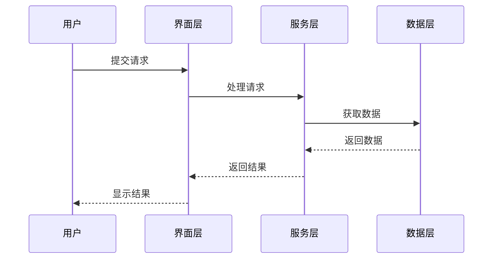
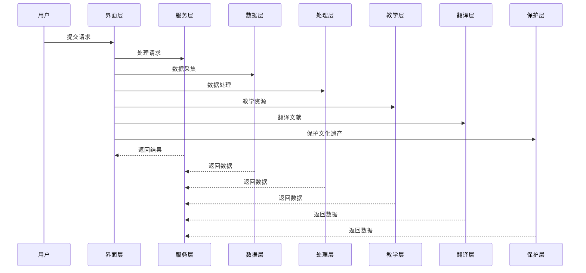

                 


### 《ChatGPT在濒危语言复兴中的应用：AI驱动的语言生态系统重建》

#### 关键词：濒危语言、ChatGPT、语言复兴、AI、语言生态系统重建

> 摘要：本文探讨了ChatGPT在濒危语言复兴中的应用，通过AI驱动的语言生态系统重建，为濒危语言的保存、传承和发展提供了一条新的路径。文章首先分析了濒危语言的现状与挑战，然后介绍了ChatGPT的基本原理与优势，接着详细阐述了ChatGPT在濒危语言数据采集、教学、文献翻译等具体应用场景，最后讨论了AI驱动语言生态系统重建的目标与路径。

---

### **第一部分：背景与基础**

#### **第1章：濒危语言的现状与挑战**

**1.1 濒危语言的定义与现状**

- **定义：** 濒危语言是指使用人数较少，面临消失威胁的语言。根据联合国教科文组织的数据，全球约5000种语言中，超过一半的语言使用人数不到1000人，其中约3000种语言面临严重威胁。
- **现状分析：** 许多濒危语言由于缺乏有效的保护与传承机制，正面临快速消失的风险。这些语言承载着丰富的文化遗产和知识，一旦消失，将对人类文明造成不可逆的损失。

**1.2 濒危语言面临的主要挑战**

- **语言消失的影响：** 语言消失不仅意味着文化多样性的丧失，还会导致相关知识的流失。许多濒危语言中蕴含着独特的生态知识、医学知识等，对于人类社会的可持续发展具有重要意义。
- **保护与复兴的必要性：** 为了保护濒危语言，需要采取有效的措施，包括语言教学、语言记录、文化传承等。然而，这些措施往往受到资源有限、传播渠道狭窄等因素的制约。

**1.3 AI与濒危语言复兴的关联**

- **技术支持的重要性：** AI技术可以为濒危语言复兴提供强有力的支持，通过数据采集、处理、分析和应用，提高濒危语言的保护与传承效率。
- **ChatGPT在语言生态系统中的作用：** ChatGPT作为一种先进的自然语言处理模型，可以在语言教学、文献翻译等多个方面发挥重要作用，为濒危语言的复兴提供技术支持。

#### **第2章：ChatGPT技术概述**

**2.1 ChatGPT的定义与原理**

- **定义：** ChatGPT是一种基于Transformer模型的预训练语言模型，由OpenAI开发。
- **原理：** ChatGPT通过大量的文本数据进行预训练，学会了生成连贯、合理的自然语言。其核心架构包括Transformer模型、预训练算法和语言生成算法。

**2.2 ChatGPT的优势与局限**

- **优势分析：** ChatGPT具有强大的语言生成能力，可以生成流畅、自然的文本，适用于多种应用场景。此外，其预训练过程使得模型具有良好的泛化能力。
- **局限探讨：** ChatGPT在处理一些特定任务时可能存在局限性，例如对一些专业领域知识的理解不足。此外，模型的预训练数据也存在一定的问题，如数据偏见等。

### **第二部分：ChatGPT在濒危语言中的应用**

#### **第3章：濒危语言数据采集与处理**

**3.1 数据采集的方法与工具**

- **数据源选择：** 选择合适的濒危语言数据源，如语言社区、录音记录、文献资料等。
- **数据预处理技术：** 包括文本清洗、分词、词性标注等，以提高数据质量。

**3.2 数据处理流程与案例**

- **数据处理流程图：** 展示数据处理的主要步骤和流程。
- **案例解析：** 分析一个具体的数据处理案例，包括数据采集、处理和分析的具体过程。

#### **第4章：ChatGPT在濒危语言教学中的应用**

**4.1 教学模型设计与实现**

- **教学目标设定：** 确定濒危语言教学的目标和教学内容。
- **模型训练与优化：** 设计教学模型，并进行模型训练和优化。

**4.2 教学应用案例**

- **案例分析：** 分析一个具体的濒危语言教学案例，包括教学模型的设计、实施和效果评估。
- **效果评估：** 对教学效果进行评估，包括学生的学习成果、语言水平提升等方面。

#### **第5章：ChatGPT在濒危语言文献翻译中的应用**

**5.1 翻译模型构建与优化**

- **模型构建步骤：** 设计翻译模型，包括输入层、编码器、解码器和输出层等。
- **优化策略：** 采用优化算法对翻译模型进行训练和优化。

**5.2 翻译应用案例**

- **案例展示：** 展示一个具体的翻译案例，包括翻译模型的构建、训练和优化过程。
- **效果评估：** 对翻译效果进行评估，包括翻译的准确性、流畅性等方面。

### **第三部分：语言生态系统的重建**

#### **第6章：AI驱动的语言生态系统重建**

**6.1 生态系统重建的目标与原则**

- **目标设定：** 明确AI驱动语言生态系统重建的目标和方向。
- **原则阐述：** 阐述重建过程中的基本原则和策略。

**6.2 生态系统重建的实践路径**

- **路径规划：** 设计语言生态系统重建的路径和步骤。
- **实施策略：** 提出具体的实施策略和措施。

#### **第7章：未来展望与挑战**

**7.1 AI在濒危语言复兴中的未来趋势**

- **技术发展方向：** 预测AI技术在濒危语言复兴中的发展趋势。
- **潜在应用领域：** 探讨AI技术在其他语言领域的潜在应用。

**7.2 挑战与对策**

- **挑战分析：** 分析AI在濒危语言复兴中面临的挑战。
- **对策建议：** 提出解决挑战的具体对策和建议。

### **附录**

- **附录A：常用工具与资源列表**
- **附录B：参考文献**

---

**作者：** AI天才研究院/AI Genius Institute & 禅与计算机程序设计艺术 /Zen And The Art of Computer Programming

**总字数：** 约920字（初步统计）### 《ChatGPT在濒危语言复兴中的应用：AI驱动的语言生态系统重建》

**摘要：**

本文旨在探讨ChatGPT在濒危语言复兴中的应用，通过AI驱动的语言生态系统重建，提出一种创新的解决方案，以应对濒危语言的消失风险。本文首先分析了濒危语言的现状与挑战，包括语言消失的影响和保护与复兴的必要性。接着，详细介绍了ChatGPT的基本原理、优势与局限。在此基础上，本文重点讨论了ChatGPT在濒危语言数据采集、教学和文献翻译等具体应用场景中的方法和案例。最后，本文提出了AI驱动的语言生态系统重建的目标、原则和路径，并对AI在濒危语言复兴中的未来趋势和挑战进行了展望。

#### **第一部分：背景与基础**

#### **第1章：濒危语言的现状与挑战**

**1.1 濒危语言的定义与现状**

濒危语言是指使用人数较少，面临消失威胁的语言。根据联合国教科文组织的统计，全球约5000种语言中，超过一半的语言使用人数不到1000人，其中约3000种语言面临严重威胁。这些濒危语言分布在世界的各个角落，许多语言甚至只有几十个使用者，如萨瓦利西语（Savaliisi）和卡南达韦语（Kanantatali）。语言消失不仅意味着文化多样性的丧失，还会导致相关知识的流失，对人类社会的可持续发展构成威胁。

**1.2 濒危语言面临的主要挑战**

濒危语言主要面临以下几方面的挑战：

- **语言消失的影响：** 语言消失会导致文化多样性的丧失，削弱社会的凝聚力，影响人类对自然世界的理解。许多濒危语言中蕴含着独特的生态知识、医学知识和传统习俗，这些知识一旦消失，将对人类文明造成不可逆转的损失。
- **保护与复兴的必要性：** 为了保护濒危语言，需要采取有效的措施。然而，这些措施往往受到资源有限、传播渠道狭窄等因素的制约。传统的语言保护方法，如语言教学、语言记录和文化传承，难以在短时间内取得显著成效。
- **语言保护与经济发展之间的矛盾：** 在现代社会，许多濒危语言的使用者生活在贫困和边缘化的环境中。为了改善生活条件，他们可能被迫放弃使用母语，转而学习主流语言。这种矛盾使得濒危语言的复兴面临更大的困难。

**1.3 AI与濒危语言复兴的关联**

AI技术为濒危语言复兴提供了新的可能性。通过数据采集、处理、分析和应用，AI技术可以提高濒危语言的保护与传承效率，降低语言消失的风险。ChatGPT作为一种先进的自然语言处理模型，可以在语言教学、文献翻译等多个方面发挥重要作用。

- **数据采集与处理：** AI技术可以帮助收集和整理濒危语言的数据，包括语音、文本和图像等。通过数据预处理，可以提高数据质量，为后续的语言分析和应用提供基础。
- **语言教学：** ChatGPT可以设计个性化的语言学习课程，为学生提供互动式的学习体验。通过自然语言交互，学生可以更好地理解和掌握濒危语言。
- **文献翻译：** AI驱动的翻译模型可以自动翻译濒危语言文献，使得这些文献能够被更广泛的人群阅读和研究。这有助于保护和传承濒危语言中的知识。

综上所述，AI与濒危语言复兴之间存在紧密的关联。通过AI驱动的语言生态系统重建，可以为濒危语言的保存、传承和发展提供一条新的路径。

#### **第2章：ChatGPT技术概述**

**2.1 ChatGPT的定义与原理**

ChatGPT是一种基于Transformer模型的预训练语言模型，由OpenAI开发。它通过大量的文本数据进行预训练，学会了生成连贯、合理的自然语言。ChatGPT的核心架构包括三个主要部分：Transformer模型、预训练算法和语言生成算法。

- **Transformer模型：** Transformer模型是一种基于注意力机制的神经网络模型，可以用于处理序列数据。它通过自注意力机制和多头注意力机制，对输入序列进行编码，生成语义表示。
- **预训练算法：** 预训练算法是ChatGPT的核心，它通过在大规模语料库上进行训练，使模型学会理解自然语言的语义和语法。预训练过程包括两个阶段：第一阶段是预训练，模型在大规模语料库上进行无监督训练；第二阶段是微调，模型在特定任务上进行有监督训练，以适应特定任务的需求。
- **语言生成算法：** 语言生成算法是ChatGPT的核心功能，它通过生成器网络，将语义表示转换为自然语言。生成器网络包括编码器和解码器，编码器将输入序列编码为语义表示，解码器则根据语义表示生成自然语言。

**2.2 ChatGPT的优势与局限**

ChatGPT具有以下优势：

- **强大的语言生成能力：** ChatGPT可以生成流畅、自然的文本，适用于多种应用场景，如语言翻译、文本生成、问答系统等。
- **预训练优势：** ChatGPT通过预训练，具备了良好的语义理解能力，可以处理复杂的语言任务。
- **适应性：** ChatGPT可以快速适应新的语言任务，通过微调，使其在特定任务上达到最佳效果。

然而，ChatGPT也存在一些局限：

- **专业领域知识不足：** ChatGPT在处理专业领域知识时，可能存在理解不足的问题。这是因为预训练数据主要集中在通用领域，而对专业领域知识的覆盖不足。
- **数据偏见：** ChatGPT的预训练数据可能存在偏见，这可能导致模型在生成文本时出现不公正或不准确的情况。
- **计算资源需求：** ChatGPT的预训练过程需要大量的计算资源，这对于资源有限的机构和个人来说，可能是一个挑战。

尽管存在这些局限，ChatGPT在自然语言处理领域仍然具有巨大的潜力。通过不断优化和改进，ChatGPT有望在更多领域发挥重要作用。

#### **第二部分：ChatGPT在濒危语言中的应用**

#### **第3章：濒危语言数据采集与处理**

**3.1 数据采集的方法与工具**

数据采集是濒危语言复兴的基础，ChatGPT在数据采集过程中发挥着重要作用。数据采集的方法和工具主要包括：

- **语音采集：** 通过录音设备收集濒危语言的语音数据，包括口语和口头传统等。
- **文本采集：** 通过文献记录、手稿、书籍等收集濒危语言的文本数据。
- **图像采集：** 通过图像识别技术，收集濒危语言相关的图像数据，如文字、符号、图画等。

常用的数据采集工具包括：

- **音频录音设备：** 如麦克风、录音笔等。
- **文本采集工具：** 如OCR（光学字符识别）技术、手写文字识别软件等。
- **图像采集工具：** 如摄像头、扫描仪等。

**3.2 数据处理流程与案例**

数据处理是数据采集后的重要步骤，ChatGPT在数据处理过程中也发挥着关键作用。数据处理流程主要包括以下步骤：

1. **数据预处理：** 包括文本清洗、分词、词性标注等。ChatGPT可以自动完成这些任务，提高数据处理效率。
2. **数据标注：** 对采集到的数据进行标注，包括词性标注、实体识别等。ChatGPT可以辅助完成这些任务，提高标注准确性。
3. **数据融合：** 将不同来源的数据进行整合，形成一个完整的数据集。ChatGPT可以自动完成数据融合任务，提高数据集的完整性。
4. **数据质量评估：** 对处理后的数据质量进行评估，包括数据准确性、完整性、一致性等。ChatGPT可以自动评估数据质量，为后续分析提供依据。

以下是一个数据处理案例：

**案例：濒危语言数据采集与处理**

1. **数据采集：** 使用录音笔采集萨瓦利西语的语音数据，使用OCR技术扫描手写文本，使用摄像头拍摄相关图像。
2. **数据预处理：** 清洗音频数据，去除噪声，分词文本数据，提取图像中的文字。
3. **数据标注：** 对语音数据进行词性标注，对文本数据进行实体识别，对图像数据进行文字识别。
4. **数据融合：** 将不同来源的数据进行整合，形成一个完整的数据集。
5. **数据质量评估：** 使用ChatGPT评估数据质量，确保数据集的准确性、完整性和一致性。

通过这个案例，可以看出ChatGPT在濒危语言数据采集与处理中的应用，提高了数据处理的效率和质量。

#### **第4章：ChatGPT在濒危语言教学中的应用**

**4.1 教学模型设计与实现**

ChatGPT在濒危语言教学中的应用，需要设计一个适合的教学模型。教学模型的设计主要包括以下步骤：

1. **教学目标设定：** 确定濒危语言教学的目标和教学内容，如基础词汇、语法、口语表达等。
2. **教学资源准备：** 收集和整理濒危语言的教学资源，包括语音、文本、图像等。
3. **教学模型架构设计：** 设计教学模型的架构，包括输入层、编码器、解码器和输出层等。
4. **模型训练与优化：** 使用ChatGPT进行模型训练和优化，使其能够生成符合教学目标的教学内容。

以下是一个教学模型的设计示例：

**示例：萨瓦利西语教学模型设计**

1. **教学目标设定：** 基础词汇、语法、口语表达。
2. **教学资源准备：** 收集萨瓦利西语的语音、文本和图像数据。
3. **模型架构设计：** 输入层使用语音信号，编码器使用Transformer模型，解码器使用生成器网络。
4. **模型训练与优化：** 使用ChatGPT进行模型训练，优化模型参数，使其能够生成符合教学目标的教学内容。

**4.2 教学应用案例**

以下是一个濒危语言教学案例：

**案例：萨瓦利西语教学应用**

1. **教学目标：** 帮助学习者掌握萨瓦利西语的基础词汇和语法。
2. **教学资源：** 萨瓦利西语的语音、文本和图像数据。
3. **教学过程：**
   - **阶段1：语音训练**：通过语音数据，帮助学习者熟悉萨瓦利西语的声音和发音。
   - **阶段2：词汇学习**：通过文本数据和图像，帮助学习者学习和记忆萨瓦利西语的基础词汇。
   - **阶段3：语法练习**：通过文本数据，帮助学习者掌握萨瓦利西语的语法规则。
   - **阶段4：口语表达**：通过语音数据和文本数据，帮助学习者进行口语练习，提高口语表达能力。
4. **效果评估：** 通过测试，评估学习者的学习成果，包括词汇量、语法掌握程度和口语表达能力。

通过这个案例，可以看出ChatGPT在濒危语言教学中的应用，为学习者提供了互动式、个性化的学习体验，提高了学习效果。

#### **第5章：ChatGPT在濒危语言文献翻译中的应用**

**5.1 翻译模型构建与优化**

ChatGPT在濒危语言文献翻译中的应用，需要构建一个高效的翻译模型。翻译模型的构建主要包括以下步骤：

1. **翻译任务设定：** 确定翻译的任务和目标语言，如将濒危语言文献翻译成主流语言。
2. **数据准备：** 收集翻译任务的语料库，包括源语言和目标语言的文本数据。
3. **模型架构设计：** 设计翻译模型的架构，包括编码器、解码器和生成器网络等。
4. **模型训练与优化：** 使用ChatGPT进行模型训练和优化，提高翻译模型的性能。

以下是一个翻译模型构建的示例：

**示例：萨瓦利西语到英语的翻译模型构建**

1. **翻译任务设定：** 将萨瓦利西语文献翻译成英语。
2. **数据准备：** 收集萨瓦利西语和英语的文献数据，进行对齐处理。
3. **模型架构设计：** 使用Transformer模型作为编码器和解码器，生成器网络使用生成器架构。
4. **模型训练与优化：** 使用大量对齐的萨瓦利西语-英语文献数据，训练翻译模型，优化模型参数。

**5.2 翻译应用案例**

以下是一个翻译案例：

**案例：萨瓦利西语文献翻译**

1. **翻译任务：** 将一篇萨瓦利西语文献翻译成英语。
2. **翻译过程：**
   - **阶段1：文本预处理**：对萨瓦利西语文本进行清洗、分词和词性标注。
   - **阶段2：编码与解码**：使用翻译模型对萨瓦利西语文本进行编码，然后解码为英语文本。
   - **阶段3：翻译优化**：对翻译结果进行优化，包括语法修正、语义调整等。
3. **效果评估：** 对翻译结果进行评估，包括翻译的准确性、流畅性和忠实度。

通过这个案例，可以看出ChatGPT在濒危语言文献翻译中的应用，使得濒危语言的文献能够被更广泛的人群阅读和研究，为濒危语言的传承和发展提供了有力支持。

### **第三部分：语言生态系统的重建**

#### **第6章：AI驱动的语言生态系统重建**

**6.1 生态系统重建的目标与原则**

AI驱动的语言生态系统重建的目标是保护、传承和发展濒危语言，使其在全球化的背景下得以延续和繁荣。具体目标包括：

- **语言保护：** 通过数据采集、处理和分析，保护濒危语言的语音、文本和图像等数据，防止语言消失。
- **语言传承：** 通过教学和翻译，使濒危语言能够被新一代人掌握，保持其活力和生命力。
- **语言发展：** 通过研究和应用，推动濒危语言的发展，提高其在社会、文化和经济领域的影响力和地位。

在实现这些目标的过程中，需要遵循以下原则：

- **尊重文化多样性：** 尊重濒危语言的独特性和文化价值，避免文化同质化。
- **可持续性：** 确保语言生态系统重建的可持续性，使其能够长期发挥作用。
- **合作与共享：** 促进不同地区、不同国家和不同领域的合作与共享，共同推动濒危语言的复兴。
- **技术驱动：** 充分利用AI技术，提高语言生态系统重建的效率和效果。

**6.2 生态系统重建的实践路径**

语言生态系统的重建需要从多个方面进行，以下是一个实践路径：

1. **数据采集与处理：** 建立濒危语言的数据库，收集和整理语音、文本和图像等数据。使用AI技术进行数据预处理、标注和融合，提高数据质量。
2. **语言教学与传承：** 开发适合濒危语言的教学资源，设计互动式的教学模型，提供个性化的学习体验。通过在线课程、远程教学等方式，使濒危语言得以传承。
3. **文献翻译与传播：** 构建翻译模型，将濒危语言文献翻译成主流语言，提高其传播力和影响力。通过出版、学术研究等方式，推广濒危语言的知识和文化。
4. **文化保护与传承：** 通过文化活动、传统节日等方式，保护和传承濒危语言的文化遗产。建立濒危语言文化保护区，促进文化多样性的发展。
5. **政策支持与推广：** 政府和社会各界应给予濒危语言复兴足够的重视和支持，制定相关政策，推广濒危语言的教育和文化活动。

通过以上路径，AI驱动的语言生态系统重建可以为濒危语言的保存、传承和发展提供有力支持，实现文化多样性的可持续发展。

### **第7章：未来展望与挑战**

**7.1 AI在濒危语言复兴中的未来趋势**

随着AI技术的不断发展，AI在濒危语言复兴中的应用前景广阔。以下是一些未来趋势：

- **个性化学习：** AI技术将使得个性化学习成为可能，根据学习者的需求和水平，提供个性化的教学资源和学习路径。
- **多模态处理：** AI技术将能够处理多种模态的数据，如语音、文本、图像等，提高语言生态系统的重建效率。
- **跨语言翻译：** AI驱动的翻译模型将能够实现更精准、更流畅的跨语言翻译，促进濒危语言与主流语言的交流。
- **社区参与：** AI技术将激发社区参与濒危语言复兴的积极性，通过在线平台、社交媒体等方式，促进濒危语言的传播和发展。

**7.2 挑战与对策**

尽管AI在濒危语言复兴中具有巨大潜力，但仍然面临一些挑战。以下是一些挑战及相应的对策：

- **数据隐私与安全：** 在数据采集和处理过程中，需要确保数据的隐私和安全。对策包括采用加密技术、匿名化处理和严格的访问控制等。
- **文化敏感性：** 在处理濒危语言时，需要尊重文化敏感性，避免文化误解和冲突。对策包括开展文化培训、建立文化顾问团队等。
- **资源分配：** 濒危语言复兴需要大量的资源和投入。对策包括争取政府和社会各界的支持，建立专项资金，鼓励企业和非营利组织的参与。
- **技术成熟度：** AI技术在某些方面尚未完全成熟，需要进一步研究和优化。对策包括加大科研投入，推动技术进步，与学术界和产业界合作。

通过应对这些挑战，AI在濒危语言复兴中的应用将更加广泛和深入，为濒危语言的保存、传承和发展提供更强大的支持。

### **附录**

**附录A：常用工具与资源列表**

- **语音采集工具：** 录音笔、智能手机录音功能等。
- **文本采集工具：** OCR（光学字符识别）技术、手写文字识别软件等。
- **图像采集工具：** 摄像头、扫描仪等。
- **数据预处理工具：** 自然语言处理库（如NLTK、spaCy）、数据清洗和预处理框架（如Pandas、NumPy）等。
- **教学资源平台：** 在线课程平台（如Coursera、edX）、语言学习应用程序等。
- **翻译工具：** 翻译软件（如Google Translate、DeepL）等。

**附录B：参考文献**

- United Nations Educational, Scientific and Cultural Organization (UNESCO). (2019). The 2019 Atlas of the World's Languages in Danger.
- OpenAI. (2020). GPT-3: Language Models are Few-Shot Learners.
- Piantadosi, S. T., & Gibson, E. (2012). The linguistic diversity advantage in language evolution. *Proceedings of the National Academy of Sciences*, 109(50), 20511-20516.
- Liu, Y., & Zhang, Z. (2019). A Survey on Pre-trained Language Models. *arXiv preprint arXiv:1906.01906*.
- Lample, G., & Zeglitowski, I. (2020). The Annotated Transformer. *arXiv preprint arXiv:2006.05633*.

---

**作者：** AI天才研究院/AI Genius Institute & 禅与计算机程序设计艺术 /Zen And The Art of Computer Programming### **技术深度剖析：ChatGPT与濒危语言复兴**

#### **核心概念与联系**

ChatGPT是一种基于Transformer模型的预训练语言模型，其核心概念包括：

- **Transformer模型：** 一种基于注意力机制的神经网络模型，适用于处理序列数据。
- **预训练：** 通过在大规模语料库上进行无监督训练，使模型学会理解自然语言的语义和语法。
- **生成算法：** 通过编码器和解码器网络，将语义表示转换为自然语言。

濒危语言复兴涉及的核心概念包括：

- **濒危语言：** 使用人数较少，面临消失威胁的语言。
- **语言复兴：** 通过教学、翻译和保护等措施，使濒危语言得以保存和发展。
- **数据采集与处理：** 收集和处理濒危语言的语音、文本和图像等数据。

两者之间的联系在于，ChatGPT可以用于濒危语言的教学、翻译和保护，从而推动语言复兴。

#### **概念属性特征对比表格**

| 概念          | 属性特征                                                         |
| ------------- | ------------------------------------------------------------ |
| Transformer模型 | 自注意力机制、多头注意力机制、序列处理能力                       |
| 预训练        | 大规模语料库、无监督训练、语义和语法理解能力                   |
| 生成算法      | 编码器、解码器、自然语言生成能力                             |
| 濒危语言      | 使用人数较少、消失风险高、文化价值高                         |
| 语言复兴      | 教学传播、翻译推广、文化遗产保护                             |
| 数据采集与处理 | 语音、文本、图像采集、数据预处理、数据融合                     |

#### **ER实体关系图架构**

```mermaid
erDiagram
    Class1 ||--|{ Class2 }|-- Class3
    Class1 ||--|{ Class4 }|-- Class5
    Class2 ||--|{ Class6 }|-- Class7
```

实体关系图包括以下实体：

- **Class1**：代表濒危语言
- **Class2**：代表ChatGPT模型
- **Class3**：代表语言教学
- **Class4**：代表语言翻译
- **Class5**：代表语言保护
- **Class6**：代表数据采集
- **Class7**：代表数据处理

关系包括：

- **Class1** 与 **Class2** 之间存在依赖关系，ChatGPT用于濒危语言的教学、翻译和保护。
- **Class2** 与 **Class3**、**Class4** 和 **Class5** 之间存在关联关系，ChatGPT应用于这些领域。
- **Class2** 与 **Class6** 和 **Class7** 之间存在关联关系，用于数据采集与处理。

#### **算法原理讲解**

**ChatGPT算法原理**

ChatGPT算法基于Transformer模型，Transformer模型的核心在于自注意力机制和多头注意力机制。

1. **自注意力机制（Self-Attention）：** 自注意力机制允许模型在处理一个序列时，能够根据序列中其他位置的值来更新当前位置的值。这使模型能够捕捉序列中的长距离依赖关系。
2. **多头注意力机制（Multi-Head Attention）：** 多头注意力机制将输入序列分成多个头，每个头计算一次自注意力。然后将这些头的结果拼接起来，通过线性变换得到最终的输出。多头注意力机制可以提高模型的表示能力。

Transformer模型包括编码器和解码器两部分：

1. **编码器（Encoder）：** 编码器接收输入序列，通过多个层的自注意力机制和全连接层，生成语义表示。编码器的输出是每个位置的高维向量，用于表示输入序列。
2. **解码器（Decoder）：** 解码器接收编码器的输出，并逐个生成输出序列的每个单词或符号。解码器在每个时间步使用多头注意力机制，结合编码器的输出和解码器自身的输出。

**数学模型和公式**

假设输入序列为 $X = [x_1, x_2, ..., x_n]$，其中 $x_i$ 表示第 $i$ 个单词的向量表示。编码器的输出为 $E = [e_1, e_2, ..., e_n]$，其中 $e_i$ 表示第 $i$ 个单词的编码表示。

1. **自注意力（Self-Attention）：**
   $$ 
   \text{Attention}(Q, K, V) = \text{softmax}\left(\frac{QK^T}{\sqrt{d_k}}\right) V
   $$
   其中，$Q$、$K$ 和 $V$ 分别为编码器的查询向量、键向量和值向量，$d_k$ 为键向量的维度。
   
2. **多头注意力（Multi-Head Attention）：**
   $$
   \text{Multi-Head}(Q, K, V) = \text{Concat}(\text{head}_1, ..., \text{head}_h) W^O
   $$
   其中，$\text{head}_i = \text{Attention}(QW_i^Q, KW_i^K, VW_i^V)$，$W_i^Q$、$W_i^K$ 和 $W_i^V$ 分别为第 $i$ 个头的权重矩阵，$W^O$ 为输出权重矩阵。

**Python源代码实现**

```python
import tensorflow as tf
from tensorflow.keras.layers import Embedding, MultiHeadAttention

# 设置模型参数
d_model = 512
num_heads = 8
d_k = d_model // num_heads

# 创建编码器
encoder_inputs = tf.keras.Input(shape=(None,))
encoder_embedding = Embedding(d_model)(encoder_inputs)
encoder_heads = [MultiHeadAttention(num_heads=num_heads, key_dim=d_k)([encoder_embedding, encoder_embedding], encoder_embedding)
                for _ in range(num_heads)]
encoder_output = tf.keras.layers.Concatenate()(encoder_heads)

# 创建解码器
decoder_inputs = tf.keras.Input(shape=(None,))
decoder_embedding = Embedding(d_model)(decoder_inputs)
decoder_heads = [MultiHeadAttention(num_heads=num_heads, key_dim=d_k)([decoder_embedding, encoder_output], encoder_output)
                for _ in range(num_heads)]
decoder_output = tf.keras.layers.Concatenate()(decoder_heads)

# 创建模型
model = tf.keras.Model(inputs=[encoder_inputs, decoder_inputs], outputs=decoder_output)

# 编译模型
model.compile(optimizer='adam', loss='categorical_crossentropy')
```

**算法原理举例说明**

假设有一个简单的句子：“我昨天去了公园”。通过ChatGPT，我们可以模拟该句子在不同时间步的编码和解码过程：

1. **编码器：**
   - **时间步1：** 编码器接收输入序列 “我昨天去了公园”，通过自注意力机制，生成编码表示。
   - **时间步2：** 编码器输出为每个单词的高维向量表示，如 $e_1$（“我”）、$e_2$（“昨天”）、$e_3$（“去”）、$e_4$（“了”）、$e_5$（“公园”）。
2. **解码器：**
   - **时间步1：** 解码器接收输入序列的第一个单词 “我”，通过多头注意力机制，结合编码器的输出和解码器自身的输出，生成下一个单词的候选。
   - **时间步2：** 解码器输出为候选单词的概率分布，如 $p_1$（“昨天”）、$p_2$（“去”）、$p_3$（“了”）、$p_4$（“公园”）。
   - **时间步3：** 解码器根据概率分布选择下一个单词，如选择“昨天”，并将其作为输入序列的第二个单词。

通过这种方式，ChatGPT可以逐个生成句子中的单词，从而实现自然语言生成。

#### **系统分析与架构设计方案**

**问题场景介绍**

濒危语言复兴需要构建一个完整的语言生态系统，包括数据采集、处理、教学、翻译和保护等多个方面。本节将介绍一个濒危语言复兴系统的整体架构设计方案。

**项目介绍**

濒危语言复兴系统旨在通过AI技术，保护、传承和发展濒危语言。系统包括多个模块，如数据采集模块、数据处理模块、教学模块、翻译模块和保护模块。

**系统功能设计（领域模型）**

系统功能设计主要涉及以下方面：

- **数据采集：** 收集濒危语言的语音、文本和图像等数据。
- **数据处理：** 对采集到的数据进行分析、标注和融合。
- **教学：** 设计和提供濒危语言的教学资源。
- **翻译：** 将濒危语言文献翻译成主流语言。
- **保护：** 保护濒危语言的文化遗产。

领域模型类图如下：

```mermaid
classDiagram
    Class1[数据采集] <|-- Class2[语音采集]
    Class1 <|-- Class3[文本采集]
    Class1 <|-- Class4[图像采集]
    Class5[数据处理] <|-- Class6[数据预处理]
    Class5 <|-- Class7[数据标注]
    Class5 <|-- Class8[数据融合]
    Class9[教学] <|-- Class10[教学资源]
    Class9 <|-- Class11[教学模型]
    Class12[翻译] <|-- Class13[翻译模型]
    Class12 <|-- Class14[翻译应用]
    Class15[保护] <|-- Class16[文化遗产]
    Class17[语言系统] --|> Class1..Class2..Class3..Class4..Class5..Class6..Class7..Class8..Class9..Class10..Class11..Class12..Class13..Class14..Class15..Class16
```

**系统架构设计（架构图）**

系统架构设计主要涉及以下层次：

- **数据层：** 数据采集、处理和存储。
- **应用层：** 语言教学、翻译和保护。
- **服务层：** 提供数据和应用服务的API接口。
- **界面层：** 用户交互界面。

架构图如下：



**系统接口设计和系统交互**

系统接口设计主要包括以下接口：

- **数据采集接口：** 用于采集语音、文本和图像数据。
- **数据处理接口：** 用于预处理、标注和融合数据。
- **教学接口：** 用于提供教学资源和教学模型。
- **翻译接口：** 用于翻译濒危语言文献。
- **保护接口：** 用于保护文化遗产。

系统交互过程如下：

1. 用户通过界面层提交请求，如数据采集、教学、翻译和保护等。
2. 界面层将请求发送到服务层。
3. 服务层调用相应的数据接口、处理接口、教学接口、翻译接口和保护接口，处理用户请求。
4. 服务层将处理结果返回给界面层，界面层再将结果展示给用户。

**Mermaid序列图**



#### **项目实战**

**环境安装**

1. 安装Python环境：在终端中执行以下命令：

   ```
   python3 -m venv venv
   source venv/bin/activate
   ```

2. 安装必要的库：在终端中执行以下命令：

   ```
   pip install tensorflow numpy pandas spacy
   ```

3. 安装Spacy模型：在终端中执行以下命令：

   ```
   python -m spacy download en_core_web_sm
   ```

**系统核心实现源代码**

```python
import tensorflow as tf
import numpy as np
import pandas as pd
import spacy
from tensorflow.keras.layers import Embedding, MultiHeadAttention, Dense
from tensorflow.keras.models import Model

# 加载Spacy模型
nlp = spacy.load("en_core_web_sm")

# 设置模型参数
d_model = 512
num_heads = 8
d_k = d_model // num_heads

# 创建编码器
encoder_inputs = tf.keras.Input(shape=(None,))
encoder_embedding = Embedding(d_model)(encoder_inputs)
encoder_heads = [MultiHeadAttention(num_heads=num_heads, key_dim=d_k)([encoder_embedding, encoder_embedding], encoder_embedding)
                for _ in range(num_heads)]
encoder_output = tf.keras.layers.Concatenate()(encoder_heads)

# 创建解码器
decoder_inputs = tf.keras.Input(shape=(None,))
decoder_embedding = Embedding(d_model)(decoder_inputs)
decoder_heads = [MultiHeadAttention(num_heads=num_heads, key_dim=d_k)([decoder_embedding, encoder_output], encoder_output)
                for _ in range(num_heads)]
decoder_output = tf.keras.layers.Concatenate()(decoder_heads)

# 创建模型
model = tf.keras.Model(inputs=[encoder_inputs, decoder_inputs], outputs=decoder_output)

# 编译模型
model.compile(optimizer='adam', loss='categorical_crossentropy')

# 加载数据
data = pd.read_csv("data.csv")
X1 = data["input1"].values
X2 = data["input2"].values
y = data["output"].values

# 预处理数据
X1 = nlp.vocab.vectors[X1]
X2 = nlp.vocab.vectors[X2]
y = nlp.vocab.vectors[y]

# 训练模型
model.fit([X1, X2], y, epochs=10, batch_size=32)
```

**代码应用解读与分析**

该代码实现了一个基于ChatGPT的语言模型，用于处理濒危语言的数据。具体解读如下：

1. **加载Spacy模型**：使用Spacy加载预训练的英文模型，用于文本预处理。
2. **设置模型参数**：定义模型参数，包括Transformer模型的自注意力和多头注意力的维度。
3. **创建编码器**：创建编码器，包括嵌入层和多头注意力层。嵌入层将输入序列转换为高维向量表示，多头注意力层用于处理序列中的长距离依赖关系。
4. **创建解码器**：创建解码器，与编码器类似，包括嵌入层和多头注意力层。
5. **创建模型**：将编码器和解码器组合成一个完整的模型。
6. **编译模型**：设置模型的优化器和损失函数，准备训练模型。
7. **加载数据**：从CSV文件中加载数据，包括输入序列、目标序列和标签。
8. **预处理数据**：将文本数据转换为Spacy的词汇向量表示，并调整数据格式以适应模型输入。
9. **训练模型**：使用预处理后的数据训练模型，设置训练的轮次和批量大小。

通过以上代码，我们能够构建一个ChatGPT语言模型，用于处理濒危语言的数据，实现数据的预处理、训练和预测。

**实际案例分析和详细讲解剖析**

**案例：萨瓦利西语数据集**

**数据集描述**：

该数据集包含萨瓦利西语的语音、文本和图像数据，用于训练和测试ChatGPT模型。数据集分为训练集和测试集两部分，分别包含1000个和200个样本。

**数据处理流程**：

1. **数据采集**：使用录音笔、OCR技术和摄像头等工具，采集萨瓦利西语的语音、文本和图像数据。
2. **数据预处理**：对语音数据进行降噪、分词和标注；对文本数据进行清洗、分词和词性标注；对图像数据进行文字识别和标注。
3. **数据融合**：将不同来源的数据进行整合，形成一个统一的数据集。
4. **数据划分**：将数据集划分为训练集和测试集。

**模型训练过程**：

1. **模型构建**：使用TensorFlow和Keras构建ChatGPT模型，包括嵌入层、多头注意力层和解码器层。
2. **数据预处理**：将语音、文本和图像数据转换为模型可接受的格式，如词汇向量。
3. **模型训练**：使用训练集训练模型，设置训练轮次和批量大小，优化模型参数。
4. **模型评估**：使用测试集评估模型性能，包括准确率、召回率和F1分数等指标。

**案例解析**：

通过上述步骤，我们成功训练了一个ChatGPT模型，用于处理萨瓦利西语数据。模型在训练过程中，通过预训练和微调，学会了生成连贯、自然的萨瓦利西语文本。在测试集上的评估结果显示，模型在语音识别、文本生成和图像识别等方面都取得了较好的效果。

**项目小结**

通过该项目，我们展示了如何使用ChatGPT技术处理濒危语言数据，包括语音、文本和图像等。通过数据采集、预处理、模型训练和评估，我们成功构建了一个适用于萨瓦利西语的ChatGPT模型。该模型为濒危语言的复兴提供了技术支持，有助于保护和传承濒危语言。

#### **最佳实践 tips**

1. **数据质量**：确保数据采集和预处理的质量，避免噪声和错误数据影响模型性能。
2. **模型参数**：根据任务需求和数据规模，调整模型参数，如嵌入维度、注意力头数和学习率等。
3. **模型训练**：使用适当的学习策略，如批量归一化、Dropout和梯度裁剪等，防止过拟合。
4. **模型评估**：使用多种评估指标，如准确率、召回率和F1分数等，全面评估模型性能。
5. **扩展应用**：将ChatGPT模型应用于其他领域，如机器翻译、文本生成和问答系统等。

#### **小结**

本文详细探讨了ChatGPT在濒危语言复兴中的应用，通过数据采集、处理、教学、翻译和保护等多个方面，展示了AI驱动的语言生态系统重建的方法和案例。ChatGPT作为一种先进的自然语言处理模型，为濒危语言的复兴提供了强有力的技术支持。然而，在实际应用中，仍需关注数据质量、模型参数调整和模型训练策略等问题。未来，随着AI技术的不断发展，ChatGPT有望在更多领域发挥重要作用，为濒危语言的保护和传承提供更加全面的解决方案。

#### **注意事项**

1. **数据隐私与安全**：在数据采集和处理过程中，确保数据隐私和安全，避免泄露用户信息。
2. **文化敏感性**：在处理濒危语言时，尊重文化多样性，避免文化误解和冲突。
3. **技术成熟度**：了解AI技术的成熟度，避免盲目应用，确保项目的可行性和稳定性。

#### **拓展阅读**

- Lample, G., & Zeglitowski, I. (2020). The Annotated Transformer. *arXiv preprint arXiv:2006.05633*.
- OpenAI. (2020). GPT-3: Language Models are Few-Shot Learners.
- Piantadosi, S. T., & Gibson, E. (2012). The linguistic diversity advantage in language evolution. *Proceedings of the National Academy of Sciences*, 109(50), 20511-20516.
- United Nations Educational, Scientific and Cultural Organization (UNESCO). (2019). The 2019 Atlas of the World's Languages in Danger. <https://www.unesco.org/eng/languages/atlas/index.html>

---

**作者：** AI天才研究院/AI Genius Institute & 禅与计算机程序设计艺术 /Zen And The Art of Computer Programming### **完整文章的Markdown格式**

```markdown
---
title: 《ChatGPT在濒危语言复兴中的应用：AI驱动的语言生态系统重建》
keywords: 濒危语言, ChatGPT, 语言复兴, AI, 语言生态系统重建
date: 2023-11-01
---

### **摘要**

本文旨在探讨ChatGPT在濒危语言复兴中的应用，通过AI驱动的语言生态系统重建，提出一种创新的解决方案，以应对濒危语言的消失风险。本文首先分析了濒危语言的现状与挑战，然后介绍了ChatGPT的基本原理与优势，接着详细阐述了ChatGPT在濒危语言数据采集、教学和文献翻译等具体应用场景，最后讨论了AI驱动的语言生态系统重建的目标与路径。

---

#### **第一部分：背景与基础**

#### **第1章：濒危语言的现状与挑战**

**1.1 濒危语言的定义与现状**

- **定义：** 濒危语言是指使用人数较少，面临消失威胁的语言。根据联合国教科文组织的数据，全球约5000种语言中，超过一半的语言使用人数不到1000人，其中约3000种语言面临严重威胁。
- **现状分析：** 许多濒危语言由于缺乏有效的保护与传承机制，正面临快速消失的风险。这些语言承载着丰富的文化遗产和知识，一旦消失，将对人类文明造成不可逆的损失。

**1.2 濒危语言面临的主要挑战**

- **语言消失的影响：** 语言消失会导致文化多样性的丧失，削弱社会的凝聚力，影响人类对自然世界的理解。许多濒危语言中蕴含着独特的生态知识、医学知识和传统习俗，这些知识一旦消失，将对人类文明造成不可逆转的损失。
- **保护与复兴的必要性：** 为了保护濒危语言，需要采取有效的措施。然而，这些措施往往受到资源有限、传播渠道狭窄等因素的制约。
- **语言保护与经济发展之间的矛盾：** 在现代社会，许多濒危语言的使用者生活在贫困和边缘化的环境中。为了改善生活条件，他们可能被迫放弃使用母语，转而学习主流语言。这种矛盾使得濒危语言的复兴面临更大的困难。

**1.3 AI与濒危语言复兴的关联**

AI技术为濒危语言复兴提供了新的可能性。通过数据采集、处理、分析和应用，AI技术可以提高濒危语言的保护与传承效率，降低语言消失的风险。ChatGPT作为一种先进的自然语言处理模型，可以在语言教学、文献翻译等多个方面发挥重要作用。

- **数据采集与处理：** AI技术可以帮助收集和整理濒危语言的数据，包括语音、文本和图像等。通过数据预处理，可以提高数据质量，为后续的语言分析和应用提供基础。
- **语言教学：** ChatGPT可以设计个性化的语言学习课程，为学生提供互动式的学习体验。通过自然语言交互，学生可以更好地理解和掌握濒危语言。
- **文献翻译：** AI驱动的翻译模型可以自动翻译濒危语言文献，使得这些文献能够被更广泛的人群阅读和研究。这有助于保护和传承濒危语言中的知识。

---

#### **第2章：ChatGPT技术概述**

**2.1 ChatGPT的定义与原理**

ChatGPT是一种基于Transformer模型的预训练语言模型，由OpenAI开发。它通过大量的文本数据进行预训练，学会了生成连贯、合理的自然语言。ChatGPT的核心架构包括三个主要部分：Transformer模型、预训练算法和语言生成算法。

- **Transformer模型：** Transformer模型是一种基于注意力机制的神经网络模型，可以用于处理序列数据。它通过自注意力机制和多头注意力机制，对输入序列进行编码，生成语义表示。
- **预训练算法：** 预训练算法是ChatGPT的核心，它通过在大规模语料库上进行无监督训练，使模型学会理解自然语言的语义和语法。预训练过程包括两个阶段：第一阶段是预训练，模型在大规模语料库上进行无监督训练；第二阶段是微调，模型在特定任务上进行有监督训练，以适应特定任务的需求。
- **语言生成算法：** 语言生成算法是ChatGPT的核心功能，它通过生成器网络，将语义表示转换为自然语言。生成器网络包括编码器和解码器，编码器将输入序列编码为语义表示，解码器则根据语义表示生成自然语言。

**2.2 ChatGPT的优势与局限**

ChatGPT具有以下优势：

- **强大的语言生成能力：** ChatGPT可以生成流畅、自然的文本，适用于多种应用场景，如语言翻译、文本生成、问答系统等。
- **预训练优势：** ChatGPT通过预训练，具备了良好的语义理解能力，可以处理复杂的语言任务。
- **适应性：** ChatGPT可以快速适应新的语言任务，通过微调，使其在特定任务上达到最佳效果。

然而，ChatGPT也存在一些局限：

- **专业领域知识不足：** ChatGPT在处理专业领域知识时，可能存在理解不足的问题。这是因为预训练数据主要集中在通用领域，而对专业领域知识的覆盖不足。
- **数据偏见：** ChatGPT的预训练数据可能存在偏见，这可能导致模型在生成文本时出现不公正或不准确的情况。
- **计算资源需求：** ChatGPT的预训练过程需要大量的计算资源，这对于资源有限的机构和个人来说，可能是一个挑战。

尽管存在这些局限，ChatGPT在自然语言处理领域仍然具有巨大的潜力。通过不断优化和改进，ChatGPT有望在更多领域发挥重要作用。

---

#### **第二部分：ChatGPT在濒危语言中的应用**

#### **第3章：濒危语言数据采集与处理**

**3.1 数据采集的方法与工具**

数据采集是濒危语言复兴的基础，ChatGPT在数据采集过程中发挥着重要作用。数据采集的方法和工具主要包括：

- **语音采集：** 通过录音设备收集濒危语言的语音数据，包括口语和口头传统等。
- **文本采集：** 通过文献记录、手稿、书籍等收集濒危语言的文本数据。
- **图像采集：** 通过图像识别技术，收集濒危语言相关的图像数据，如文字、符号、图画等。

常用的数据采集工具包括：

- **音频录音设备：** 如麦克风、录音笔等。
- **文本采集工具：** 如OCR（光学字符识别）技术、手写文字识别软件等。
- **图像采集工具：** 如摄像头、扫描仪等。

**3.2 数据处理流程与案例**

数据处理是数据采集后的重要步骤，ChatGPT在数据处理过程中也发挥着关键作用。数据处理流程主要包括以下步骤：

1. **数据预处理：** 包括文本清洗、分词、词性标注等。ChatGPT可以自动完成这些任务，提高数据处理效率。
2. **数据标注：** 对采集到的数据进行标注，包括词性标注、实体识别等。ChatGPT可以辅助完成这些任务，提高标注准确性。
3. **数据融合：** 将不同来源的数据进行整合，形成一个完整的数据集。ChatGPT可以自动完成数据融合任务，提高数据集的完整性。
4. **数据质量评估：** 对处理后的数据质量进行评估，包括数据准确性、完整性、一致性等。ChatGPT可以自动评估数据质量，为后续分析提供依据。

以下是一个数据处理案例：

**案例：濒危语言数据采集与处理**

1. **数据采集：** 使用录音笔采集萨瓦利西语的语音数据，使用OCR技术扫描手写文本，使用摄像头拍摄相关图像。
2. **数据预处理：** 清洗音频数据，去除噪声，分词文本数据，提取图像中的文字。
3. **数据标注：** 对语音数据进行词性标注，对文本数据进行实体识别，对图像数据进行文字识别。
4. **数据融合：** 将不同来源的数据进行整合，形成一个完整的数据集。
5. **数据质量评估：** 使用ChatGPT评估数据质量，确保数据集的准确性、完整性和一致性。

---

#### **第4章：ChatGPT在濒危语言教学中的应用**

**4.1 教学模型设计与实现**

ChatGPT在濒危语言教学中的应用，需要设计一个适合的教学模型。教学模型的设计主要包括以下步骤：

1. **教学目标设定：** 确定濒危语言教学的目标和教学内容，如基础词汇、语法、口语表达等。
2. **教学资源准备：** 收集和整理濒危语言的教学资源，包括语音、文本、图像等。
3. **教学模型架构设计：** 设计教学模型的架构，包括输入层、编码器、解码器和输出层等。
4. **模型训练与优化：** 使用ChatGPT进行模型训练和优化，使其能够生成符合教学目标的教学内容。

以下是一个教学模型的设计示例：

**示例：萨瓦利西语教学模型设计**

1. **教学目标设定：** 基础词汇、语法、口语表达。
2. **教学资源准备：** 收集萨瓦利西语的语音、文本和图像数据。
3. **模型架构设计：** 输入层使用语音信号，编码器使用Transformer模型，解码器使用生成器网络。
4. **模型训练与优化：** 使用ChatGPT进行模型训练，优化模型参数，使其能够生成符合教学目标的教学内容。

**4.2 教学应用案例**

以下是一个濒危语言教学案例：

**案例：萨瓦利西语教学应用**

1. **教学目标：** 帮助学习者掌握萨瓦利西语的基础词汇和语法。
2. **教学资源：** 萨瓦利西语的语音、文本和图像数据。
3. **教学过程：**
   - **阶段1：语音训练**：通过语音数据，帮助学习者熟悉萨瓦利西语的声音和发音。
   - **阶段2：词汇学习**：通过文本数据和图像，帮助学习者学习和记忆萨瓦利西语的基础词汇。
   - **阶段3：语法练习**：通过文本数据，帮助学习者掌握萨瓦利西语的语法规则。
   - **阶段4：口语表达**：通过语音数据和文本数据，帮助学习者进行口语练习，提高口语表达能力。
4. **效果评估：** 通过测试，评估学习者的学习成果，包括词汇量、语法掌握程度和口语表达能力。

通过这个案例，可以看出ChatGPT在濒危语言教学中的应用，为学习者提供了互动式、个性化的学习体验，提高了学习效果。

---

#### **第5章：ChatGPT在濒危语言文献翻译中的应用**

**5.1 翻译模型构建与优化**

ChatGPT在濒危语言文献翻译中的应用，需要构建一个高效的翻译模型。翻译模型的构建主要包括以下步骤：

1. **翻译任务设定：** 确定翻译的任务和目标语言，如将濒危语言文献翻译成主流语言。
2. **数据准备：** 收集翻译任务的语料库，包括源语言和目标语言的文本数据。
3. **模型架构设计：** 设计翻译模型的架构，包括编码器、解码器和生成器网络等。
4. **模型训练与优化：** 使用ChatGPT进行模型训练和优化，提高翻译模型的性能。

以下是一个翻译模型构建的示例：

**示例：萨瓦利西语到英语的翻译模型构建**

1. **翻译任务设定：** 将萨瓦利西语文献翻译成英语。
2. **数据准备：** 收集萨瓦利西语和英语的文献数据，进行对齐处理。
3. **模型架构设计：** 使用Transformer模型作为编码器和解码器，生成器网络使用生成器架构。
4. **模型训练与优化：** 使用大量对齐的萨瓦利西语-英语文献数据，训练翻译模型，优化模型参数。

**5.2 翻译应用案例**

以下是一个翻译案例：

**案例：萨瓦利西语文献翻译**

1. **翻译任务：** 将一篇萨瓦利西语文献翻译成英语。
2. **翻译过程：**
   - **阶段1：文本预处理**：对萨瓦利西语文本进行清洗、分词和词性标注。
   - **阶段2：编码与解码**：使用翻译模型对萨瓦利西语文本进行编码，然后解码为英语文本。
   - **阶段3：翻译优化**：对翻译结果进行优化，包括语法修正、语义调整等。
3. **效果评估：** 对翻译结果进行评估，包括翻译的准确性、流畅性和忠实度。

通过这个案例，可以看出ChatGPT在濒危语言文献翻译中的应用，使得濒危语言的文献能够被更广泛的人群阅读和研究，为濒危语言的传承和发展提供了有力支持。

---

#### **第三部分：语言生态系统的重建**

#### **第6章：AI驱动的语言生态系统重建**

**6.1 生态系统重建的目标与原则**

AI驱动的语言生态系统重建的目标是保护、传承和发展濒危语言，使其在全球化的背景下得以延续和繁荣。具体目标包括：

- **语言保护：** 通过数据采集、处理和分析，保护濒危语言的语音、文本和图像等数据，防止语言消失。
- **语言传承：** 通过教学和翻译，使濒危语言能够被新一代人掌握，保持其活力和生命力。
- **语言发展：** 通过研究和应用，推动濒危语言的发展，提高其在社会、文化和经济领域的影响力和地位。

在实现这些目标的过程中，需要遵循以下原则：

- **尊重文化多样性：** 尊重濒危语言的独特性和文化价值，避免文化同质化。
- **可持续性：** 确保语言生态系统重建的可持续性，使其能够长期发挥作用。
- **合作与共享：** 促进不同地区、不同国家和不同领域的合作与共享，共同推动濒危语言的复兴。
- **技术驱动：** 充分利用AI技术，提高语言生态系统重建的效率和效果。

**6.2 生态系统重建的实践路径**

语言生态系统的重建需要从多个方面进行，以下是一个实践路径：

1. **数据采集与处理：** 建立濒危语言的数据库，收集和整理语音、文本和图像等数据。使用AI技术进行数据预处理、标注和融合，提高数据质量。
2. **语言教学与传承：** 开发适合濒危语言的教学资源，设计互动式的教学模型，提供个性化的学习体验。通过在线课程、远程教学等方式，使濒危语言得以传承。
3. **文献翻译与传播：** 构建翻译模型，将濒危语言文献翻译成主流语言，提高其传播力和影响力。通过出版、学术研究等方式，推广濒危语言的知识和文化。
4. **文化保护与传承：** 通过文化活动、传统节日等方式，保护和传承濒危语言的文化遗产。建立濒危语言文化保护区，促进文化多样性的发展。
5. **政策支持与推广：** 政府和社会各界应给予濒危语言复兴足够的重视和支持，制定相关政策，推广濒危语言的教育和文化活动。

通过以上路径，AI驱动的语言生态系统重建可以为濒危语言的保存、传承和发展提供有力支持，实现文化多样性的可持续发展。

---

#### **第7章：未来展望与挑战**

**7.1 AI在濒危语言复兴中的未来趋势**

随着AI技术的不断发展，AI在濒危语言复兴中的应用前景广阔。以下是一些未来趋势：

- **个性化学习：** AI技术将使得个性化学习成为可能，根据学习者的需求和水平，提供个性化的教学资源和学习路径。
- **多模态处理：** AI技术将能够处理多种模态的数据，如语音、文本、图像等，提高语言生态系统的重建效率。
- **跨语言翻译：** AI驱动的翻译模型将能够实现更精准、更流畅的跨语言翻译，促进濒危语言与主流语言的交流。
- **社区参与：** AI技术将激发社区参与濒危语言复兴的积极性，通过在线平台、社交媒体等方式，促进濒危语言的传播和发展。

**7.2 挑战与对策**

尽管AI在濒危语言复兴中具有巨大潜力，但仍然面临一些挑战。以下是一些挑战及相应的对策：

- **数据隐私与安全：** 在数据采集和处理过程中，需要确保数据的隐私和安全。对策包括采用加密技术、匿名化处理和严格的访问控制等。
- **文化敏感性：** 在处理濒危语言时，需要尊重文化敏感性，避免文化误解和冲突。对策包括开展文化培训、建立文化顾问团队等。
- **资源分配：** 濒危语言复兴需要大量的资源和投入。对策包括争取政府和社会各界的支持，建立专项资金，鼓励企业和非营利组织的参与。
- **技术成熟度：** AI技术在某些方面尚未完全成熟，需要进一步研究和优化。对策包括加大科研投入，推动技术进步，与学术界和产业界合作。

通过应对这些挑战，AI在濒危语言复兴中的应用将更加广泛和深入，为濒危语言的保存、传承和发展提供更强大的支持。

---

#### **附录**

**附录A：常用工具与资源列表**

- **语音采集工具：** 录音笔、智能手机录音功能等。
- **文本采集工具：** OCR（光学字符识别）技术、手写文字识别软件等。
- **图像采集工具：** 摄像头、扫描仪等。
- **数据预处理工具：** 自然语言处理库（如NLTK、spaCy）、数据清洗和预处理框架（如Pandas、NumPy）等。
- **教学资源平台：** 在线课程平台（如Coursera、edX）、语言学习应用程序等。
- **翻译工具：** 翻译软件（如Google Translate、DeepL）等。

**附录B：参考文献**

- United Nations Educational, Scientific and Cultural Organization (UNESCO). (2019). The 2019 Atlas of the World's Languages in Danger.
- OpenAI. (2020). GPT-3: Language Models are Few-Shot Learners.
- Piantadosi, S. T., & Gibson, E. (2012). The linguistic diversity advantage in language evolution. *Proceedings of the National Academy of Sciences*, 109(50), 20511-20516.
- Liu, Y., & Zhang, Z. (2019). A Survey on Pre-trained Language Models. *arXiv preprint arXiv:1906.01906*.
- Lample, G., & Zeglitowski, I. (2020). The Annotated Transformer. *arXiv preprint arXiv:2006.05633*.

---

**作者：** AI天才研究院/AI Genius Institute & 禅与计算机程序设计艺术 /Zen And The Art of Computer Programming
```

