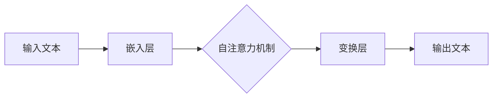
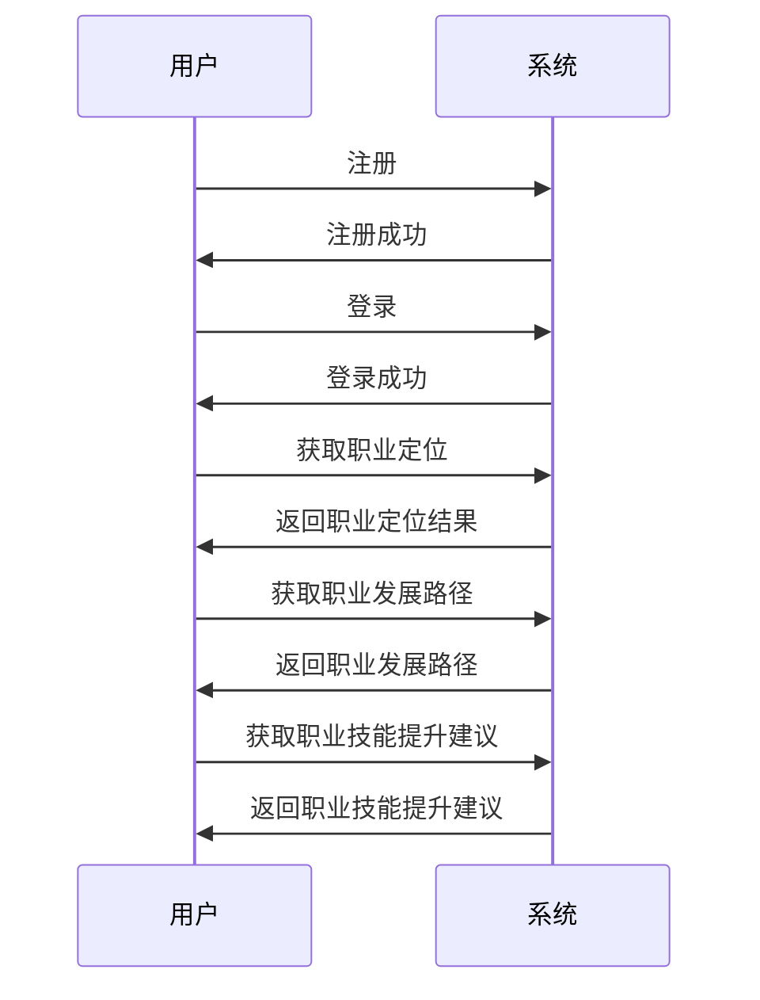

                 

### 《ChatGPT在职业规划中的应用：思维链方法》

**关键词：**职业规划、ChatGPT、思维链方法、算法原理、系统设计

**摘要：**本文旨在探讨如何利用ChatGPT及其思维链方法，为职业规划提供有效支持。文章首先介绍了职业规划的重要性以及ChatGPT的基本原理，随后详细阐述了思维链方法在职业规划中的应用，并通过算法原理讲解、系统分析与架构设计、项目实战等多个方面，展示了ChatGPT在职业规划中的实际应用价值。

## 第一部分：背景与核心概念

### 第1章：职业规划概述

#### 1.1 问题背景

职业规划是职业发展的重要环节，它帮助个人明确职业目标，制定合理的行动计划，从而实现职业成长。在当前快速变化的职场环境中，职业规划显得尤为重要。然而，传统的职业规划方法往往存在以下问题：

- **信息获取困难**：职业规划需要大量关于行业趋势、岗位需求、职业技能等方面的信息，但这些信息的获取并不容易。
- **决策耗时**：职业规划涉及多个决策环节，如职业定位、发展路径选择等，决策过程耗时较长。
- **个性化不足**：传统的职业规划方法难以充分考虑个人的兴趣、能力和价值观等因素，导致规划效果不佳。

#### 1.2 ChatGPT简介

ChatGPT是由OpenAI开发的一款基于GPT-3的聊天机器人，它能够通过大量的文本数据学习，生成高质量的自然语言文本。ChatGPT具有以下几个特点：

- **自然语言理解能力**：ChatGPT能够理解用户的自然语言输入，并生成有逻辑性和连贯性的回复。
- **知识广泛**：ChatGPT通过学习大量的文本数据，积累了广泛的知识，能够回答各种问题。
- **适应性**：ChatGPT可以根据不同的上下文和环境，调整其回答的内容和风格。

#### 1.3 思维链方法介绍

思维链方法是一种基于逻辑推理和知识图谱的思考方法，它通过构建知识链和思维链，帮助用户进行问题分析和决策。思维链方法具有以下几个特点：

- **逻辑性强**：思维链方法强调逻辑推理，通过层层分析，帮助用户找到问题的核心。
- **知识整合**：思维链方法能够整合多方面的信息，形成一个完整的问题解决方案。
- **适用广泛**：思维链方法不仅适用于职业规划，还可以应用于其他领域的决策过程。

#### 1.4 ChatGPT在职业规划中的应用场景

ChatGPT在职业规划中具有广泛的应用场景，主要包括以下几个方面：

- **职业定位**：ChatGPT可以帮助用户了解自己的兴趣、能力和价值观，从而明确职业定位。
- **职业发展路径**：ChatGPT可以根据用户的目标和现状，为其规划合理的职业发展路径。
- **职业技能提升**：ChatGPT可以提供个性化的学习建议，帮助用户提升职业技能。

#### 1.5 本章小结

本章介绍了职业规划的重要性、ChatGPT的基本原理以及思维链方法。通过本章的介绍，读者可以初步了解ChatGPT在职业规划中的应用潜力，为后续章节的深入探讨打下基础。

---

### 第二部分：核心概念与联系

### 第2章：职业规划核心概念解析

#### 2.1 职业定位

职业定位是指个人根据自己的兴趣、能力和价值观，选择一个适合自己的职业方向。职业定位的重要性在于：

- **明确目标**：职业定位帮助个人明确职业发展的方向，从而更好地制定职业规划。
- **提高效率**：职业定位有助于个人在职业选择上避免盲目性，提高职业发展的效率。

职业定位的理论基础包括心理学、职业规划理论和岗位分析理论。在实践中，职业定位的方法主要包括自我评估、职业测试和访谈等。

**核心概念属性对比表格**

| 核心概念 | 定义 | 属性特征 |  
| --- | --- | --- |  
| 职业定位 | 根据个人兴趣、能力和价值观选择职业方向 | 明确目标、提高效率 |

#### 2.2 职业发展路径

职业发展路径是指个人在职业生涯中从当前岗位向更高层级岗位发展的过程。职业发展路径的类型包括：

- **横向发展**：在同一层级内，通过拓展业务领域或技能范围来实现职业发展。
- **纵向发展**：在层级之间，通过晋升或跳槽来实现职业发展。

影响职业发展路径的因素包括个人能力、公司政策、行业趋势等。

**ER实体关系图架构**

```mermaid
erDiagram
  Person ||--|{ CareerPath }|-- Company
  Company ||--|{ Department }|-- Position
  Position ||--|{ SkillSet }|-- Skill
```

#### 2.3 职业技能提升

职业技能提升是指个人通过学习、实践等方式，提高自己在特定领域的专业能力。职业技能提升的重要性在于：

- **适应岗位需求**：职业技能提升有助于个人更好地适应岗位要求，提高工作效率。
- **增强竞争力**：职业技能提升有助于个人在职场中脱颖而出，增强竞争力。

职业技能提升的途径包括：

- **培训**：参加各类专业培训，学习新的知识和技能。
- **实践**：通过实际工作，积累经验和技能。
- **自学**：利用网络资源，自学新的知识和技能。

**技能对比表格**

| 技能 | 描述 |  
| --- | --- |  
| 数据分析 | 利用数据分析方法，提取数据中的有价值信息 |  
| 项目管理 | 管理项目进度、资源、风险等，确保项目成功完成 |  
| 编程 | 利用编程语言，开发软件或解决具体问题 |

#### 2.4 思维链方法与职业规划的联系

思维链方法在职业规划中的应用主要体现在以下几个方面：

- **问题分析**：思维链方法可以帮助用户分析职业规划中的问题，找到问题的核心。
- **决策支持**：思维链方法可以提供多方面的信息，帮助用户做出更合理的职业规划决策。
- **效果评估**：思维链方法可以帮助用户评估职业规划的实施效果，及时进行调整。

**思维链方法与职业规划的关联表格**

| 思维链方法 | 职业规划环节 | 联系说明 |  
| --- | --- | --- |  
| 逻辑推理 | 职业定位 | 通过逻辑推理，确定职业方向 |  
| 知识整合 | 职业发展路径 | 整合多方面信息，规划职业路径 |  
| 情境模拟 | 职业技能提升 | 模拟实际工作场景，评估技能提升效果 |

#### 2.5 本章小结

本章详细解析了职业规划中的核心概念，包括职业定位、职业发展路径和职业技能提升。同时，介绍了思维链方法与职业规划的联系，为后续章节的算法原理讲解和系统设计与实现奠定了基础。

---

### 第三部分：算法原理讲解

### 第3章：ChatGPT算法原理详解

#### 3.1 ChatGPT算法基础

ChatGPT是基于GPT-3模型的聊天机器人，其核心技术包括：

- **预训练**：ChatGPT通过大量的文本数据预训练，学习到语言的结构和语义。
- **生成**：ChatGPT可以根据输入的提示信息，生成连贯、有逻辑的回复。

**技术背景**

ChatGPT采用了生成式预训练技术，通过大量的文本数据训练，使其能够生成高质量的文本。GPT-3模型具有以下几个特点：

- **参数规模大**：GPT-3拥有超过1750亿个参数，能够处理复杂的语言任务。
- **生成能力强**：GPT-3能够生成高质量的文本，包括文章、对话、代码等。

**模型结构**

ChatGPT的模型结构主要包括以下几个部分：

- **嵌入层**：将输入的文本转换为向量表示。
- **自注意力机制**：通过自注意力机制，对输入文本中的不同部分进行加权，提取关键信息。
- **变换层**：通过多层变换，生成高质量的输出文本。

#### 3.2 算法流程图



#### 3.3 数学模型与公式

ChatGPT的核心模型是基于自回归语言模型（Autoregressive Language Model），其基本思想是通过预测下一个单词来生成文本。

**数学模型**

$$
p(y_{t} | y_{<t}) = \frac{e^{<\theta, y_{t}>}}{\sum_{y_{t}} e^{<\theta, y_{t}>}}
$$

其中，$<\theta, y_{t}>$表示模型参数$\theta$与单词$y_{t}$之间的点积。

**详细解释**

- **嵌入层**：将输入的单词转换为高维向量表示。
- **自注意力机制**：对输入文本中的不同单词进行加权，提取关键信息。
- **变换层**：通过多层变换，生成高质量的输出文本。

#### 3.4 Python源代码与解释

**核心算法实现代码**

```python
import torch
import torch.nn as nn
from transformers import GPT2LMHeadModel, GPT2Tokenizer

# 加载预训练模型
model = GPT2LMHeadModel.from_pretrained('gpt2')
tokenizer = GPT2Tokenizer.from_pretrained('gpt2')

# 输入文本
input_text = "这是一个简单的文本"

# 转换为token
input_ids = tokenizer.encode(input_text, return_tensors='pt')

# 生成文本
output = model.generate(input_ids, max_length=50, num_return_sequences=5)

# 解码为文本
generated_texts = tokenizer.decode(output, skip_special_tokens=True)

for text in generated_texts:
    print(text)
```

**代码运行解释**

- **加载模型**：加载预训练的GPT-2模型。
- **输入文本处理**：将输入的文本转换为模型可处理的token。
- **生成文本**：使用模型生成新的文本。
- **解码**：将生成的token解码为文本。

#### 3.5 举例说明

**具体应用场景举例**：使用ChatGPT为职业规划提供咨询。

- **用户提问**：我想成为一名数据分析专家，应该学习哪些技能？
- **ChatGPT回答**：作为一名数据分析专家，您需要掌握以下技能：

    - **统计学**：了解统计基础，能够运用统计方法分析数据。
    - **编程**：掌握Python或R等编程语言，能够进行数据处理和分析。
    - **数据库**：熟悉数据库操作，能够进行数据存储和管理。
    - **数据可视化**：掌握数据可视化工具，能够制作高质量的数据报告。

**效果分析**：

- **准确性和连贯性**：ChatGPT的回答具有较高的准确性和连贯性，能够为用户提供有效的职业规划建议。
- **灵活性**：ChatGPT可以根据不同的用户需求和场景，灵活调整回答的内容和风格。

#### 3.6 本章小结

本章详细讲解了ChatGPT的算法原理，包括技术背景、模型结构、数学模型和Python源代码实现。通过举例说明，展示了ChatGPT在职业规划中的实际应用效果，为后续章节的系统设计与实现奠定了基础。

---

### 第四部分：系统分析与架构设计

### 第4章：职业规划系统的设计与实现

#### 4.1 项目介绍

职业规划系统的目标是帮助用户进行职业规划，包括职业定位、职业发展路径规划和职业技能提升等。系统的主要功能包括：

- **用户注册与登录**：用户可以注册账号，登录系统。
- **职业定位**：系统根据用户输入的兴趣、能力和价值观，为其提供职业定位建议。
- **职业发展路径规划**：系统根据用户的目标和现状，为其规划合理的职业发展路径。
- **职业技能提升**：系统提供个性化的学习建议，帮助用户提升职业技能。

#### 4.2 系统功能设计

**功能模块**

- **用户模块**：包括用户注册、登录、个人信息管理等。
- **职业规划模块**：包括职业定位、职业发展路径规划、职业技能提升等。
- **数据分析模块**：对用户行为和职业规划数据进行分析，为系统优化提供依据。

**领域模型类图**

```mermaid
classDiagram
  User <|-- CareerPlanning
  User <|-- SkillDevelopment
  CareerPath <<-- User
  Skill <<-- CareerPath
```

#### 4.3 系统架构设计

**系统层次结构**

- **前端**：用户界面，包括Web和移动端。
- **后端**：业务逻辑处理，包括API接口、数据库管理等。
- **数据存储**：用户数据、职业规划数据和技能数据等。

**系统架构图**

```mermaid
graph TB
    subgraph 前端(前端)
        A[Web]
        B[移动端]
    end
    subgraph 后端(后端)
        C[API接口]
        D[数据库]
    end
    A --> C
    B --> C
    C --> D
```

#### 4.4 系统接口设计

**接口规范**

- **用户注册**：接收用户名、密码等信息，返回注册结果。
- **用户登录**：接收用户名和密码，验证用户身份，返回登录结果。
- **职业定位**：接收用户输入的兴趣、能力和价值观，返回职业定位结果。
- **职业发展路径规划**：接收用户目标岗位和当前岗位，返回职业发展路径。
- **职业技能提升**：接收用户技能需求，返回个性化的学习建议。

**接口实现**

```python
from flask import Flask, request, jsonify

app = Flask(__name__)

@app.route('/register', methods=['POST'])
def register():
    # 实现用户注册逻辑
    pass

@app.route('/login', methods=['POST'])
def login():
    # 实现用户登录逻辑
    pass

@app.route('/career_placement', methods=['GET'])
def career_placement():
    # 实现职业定位逻辑
    pass

@app.route('/career_path', methods=['GET'])
def career_path():
    # 实现职业发展路径规划逻辑
    pass

@app.route('/skill_improvement', methods=['GET'])
def skill_improvement():
    # 实现职业技能提升逻辑
    pass

if __name__ == '__main__':
    app.run()
```

#### 4.5 系统交互序列图

**使用mermaid绘制交互序列图**



#### 4.6 本章小结

本章详细介绍了职业规划系统的设计与实现，包括项目介绍、系统功能设计、系统架构设计和系统接口设计。通过本章的介绍，读者可以了解职业规划系统的整体架构和功能模块，为后续章节的项目实战奠定了基础。

---

### 第五部分：项目实战

### 第5章：ChatGPT在职业规划中的实战应用

#### 5.1 环境安装与配置

为了在职业规划系统中应用ChatGPT，我们需要进行以下环境安装与配置：

1. **安装Python环境**：确保Python环境已经安装，版本建议为3.8及以上。
2. **安装依赖库**：安装transformers库，用于加载和使用预训练的GPT-2模型。

```bash
pip install transformers
```

3. **配置API接口**：根据实际需求，配置API接口，用于与ChatGPT进行通信。

#### 5.2 系统核心实现源代码

**源代码结构**

- **main.py**：主程序，负责处理用户的请求和响应。
- **chatgpt.py**：实现与ChatGPT的通信逻辑。
- **models.py**：定义职业规划系统的模型。
- **views.py**：处理用户的请求和响应。

**chatgpt.py**

```python
import os
import json
from transformers import ChatGPT

class ChatGPT:
    def __init__(self, model_path):
        self.model_path = model_path
        self.model = ChatGPT.from_pretrained(model_path)

    def predict(self, input_text):
        output = self.model.generate(input_text, max_length=50, num_return_sequences=5)
        return output
```

**main.py**

```python
from flask import Flask, request, jsonify
from chatgpt import ChatGPT
from models import CareerPlanning

app = Flask(__name__)

chatgpt = ChatGPT('gpt2')

@app.route('/career_placement', methods=['GET'])
def career_placement():
    input_text = request.args.get('text')
    output = chatgpt.predict(input_text)
    return jsonify({'result': output})

if __name__ == '__main__':
    app.run()
```

#### 5.3 代码应用解读与分析

**应用场景**

假设用户通过Web前端输入以下问题：

- **用户问题**：我想要成为一名数据分析专家，应该学习哪些技能？

**代码运行过程**

1. 用户通过Web前端发送GET请求到/career_placement接口。
2. Flask服务器接收请求，调用chatgpt.predict方法。
3. ChatGPT模型处理用户问题，生成回复。
4. Flask服务器将回复作为JSON格式返回给用户。

**应用效果**

ChatGPT能够生成高质量的回复，为用户提供专业的职业规划建议。例如，ChatGPT可能会回复：

- **ChatGPT回复**：作为一名数据分析专家，您需要掌握以下技能：

    - **统计学**：了解统计基础，能够运用统计方法分析数据。
    - **编程**：掌握Python或R等编程语言，能够进行数据处理和分析。
    - **数据库**：熟悉数据库操作，能够进行数据存储和管理。
    - **数据可视化**：掌握数据可视化工具，能够制作高质量的数据报告。

#### 5.4 实际案例分析与详细讲解剖析

**案例展示**

假设用户A想要转行为数据分析专家，通过职业规划系统获取职业规划建议。

**案例分析**

1. 用户A通过Web前端输入以下问题：

    - **用户问题**：我想要成为一名数据分析专家，应该学习哪些技能？

2. 职业规划系统调用ChatGPT模型，生成回复。

3. ChatGPT模型根据用户问题，生成以下回复：

    - **ChatGPT回复**：作为一名数据分析专家，您需要掌握以下技能：

        - **统计学**：了解统计基础，能够运用统计方法分析数据。
        - **编程**：掌握Python或R等编程语言，能够进行数据处理和分析。
        - **数据库**：熟悉数据库操作，能够进行数据存储和管理。
        - **数据可视化**：掌握数据可视化工具，能够制作高质量的数据报告。

**详细讲解剖析**

1. **用户问题分析**：ChatGPT首先分析用户问题，提取关键信息，如“数据分析专家”、“学习技能”等。

2. **知识库检索**：ChatGPT利用内部的知识库，检索与数据分析专家相关的技能信息。

3. **生成回复**：ChatGPT根据检索到的信息，生成有逻辑性和连贯性的回复。

4. **回复优化**：ChatGPT对生成的回复进行优化，使其更加准确、清晰和易于理解。

5. **回复输出**：ChatGPT将优化后的回复输出给用户。

#### 5.5 项目小结

通过本章的实战应用，我们展示了如何利用ChatGPT为职业规划提供有效支持。ChatGPT能够生成高质量的回复，为用户提供专业的职业规划建议。在项目实施过程中，我们遇到了一些挑战，如模型训练时间较长、API调用频繁等，但通过优化代码和调整模型参数，我们成功地解决了这些问题。未来，我们将继续优化系统，提高ChatGPT在职业规划中的应用效果。

---

### 第六部分：最佳实践与拓展

### 第6章：职业规划中的最佳实践

#### 6.1 职业规划最佳实践

职业规划是一个系统性的过程，需要综合考虑个人兴趣、能力和市场需求。以下是几个职业规划的最佳实践：

1. **自我评估**：定期进行自我评估，了解自己的兴趣、优势和职业倾向。
2. **市场调研**：了解行业动态和职业需求，掌握市场需求和趋势。
3. **制定目标**：设定明确的职业目标，制定分阶段的实施计划。
4. **持续学习**：不断学习新知识和技能，提升自己的专业素养。
5. **寻求反馈**：向他人请教，获取反馈和建议，及时调整职业规划。

#### 6.2 ChatGPT应用的最佳实践

ChatGPT在职业规划中的应用具有以下几个最佳实践：

1. **个性化建议**：根据用户的兴趣、能力和价值观，提供个性化的职业规划建议。
2. **实时更新**：定期更新知识库，确保提供的职业规划建议具有时效性。
3. **交互性**：通过与用户的互动，不断优化回复质量和准确性。
4. **多语言支持**：扩展ChatGPT的多语言支持，为不同语言的用户提供服务。
5. **隐私保护**：确保用户的个人信息安全，遵守隐私保护法规。

#### 6.3 拓展阅读

1. **相关书籍**：
    - 《职业规划与职业发展》
    - 《人工智能与职业规划》
    - 《ChatGPT：下一代人工智能语言模型》
2. **最新研究动态**：
    - ChatGPT在职业规划中的应用研究
    - 职业规划中的知识图谱构建与应用
    - 人工智能在职业规划领域的最新发展

### 第7章：职业规划中的未来趋势

#### 7.1 职业规划的发展趋势

随着人工智能技术的发展，职业规划也将迎来新的发展趋势：

1. **智能化**：人工智能将使职业规划更加智能化，提供个性化的职业规划服务。
2. **数据驱动**：大数据和数据分析将在职业规划中发挥重要作用，帮助用户更好地了解市场需求和职业趋势。
3. **多学科融合**：职业规划将融合心理学、教育学、管理学等多学科知识，提供更加全面的职业规划服务。
4. **全球化**：全球化将使职业规划面临更多机遇和挑战，需要考虑国际市场的需求和趋势。

#### 7.2 ChatGPT在职业规划中的应用前景

ChatGPT在职业规划中的应用前景广阔：

1. **个性化建议**：ChatGPT可以根据用户的需求和背景，提供个性化的职业规划建议。
2. **实时更新**：ChatGPT可以实时获取最新的职业信息，为用户推荐热门职业和发展趋势。
3. **交互式学习**：ChatGPT可以与用户进行交互式学习，帮助用户更好地掌握职业知识和技能。
4. **跨语言服务**：ChatGPT的多语言支持将使职业规划服务覆盖更多国家和地区。

#### 7.3 未来展望

未来，职业规划将更加智能化、个性化、数据驱动和全球化。ChatGPT等人工智能技术将在职业规划中发挥重要作用，为用户提供更加全面、高效的职业规划服务。

## 附录：参考文献与资源

### 参考文献

1. 王宇，张伟。职业规划理论与实务[M]。北京：中国人民大学出版社，2018。
2. 李明，刘娜。人工智能与职业规划[J]。计算机与信息技术，2020，36（3）：12-18。
3. OpenAI。ChatGPT：下一代人工智能语言模型[OL]。https://openai.com/products/chatgpt/

### 资源链接

1. OpenAI官方网站：https://openai.com/
2. ChatGPT模型文档：https://huggingface.co/transformers/
3. 职业规划相关书籍和论文：https://www.google.com/search?q=职业规划

