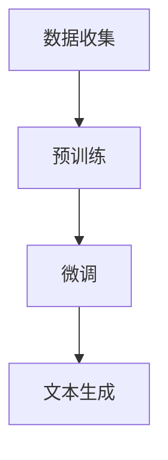
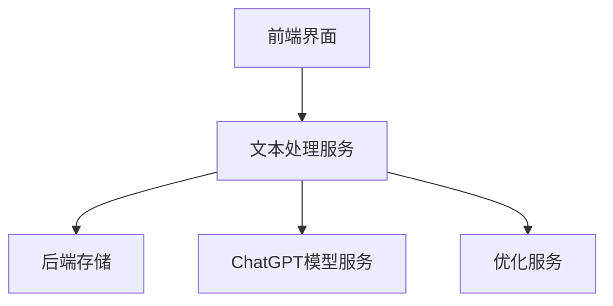
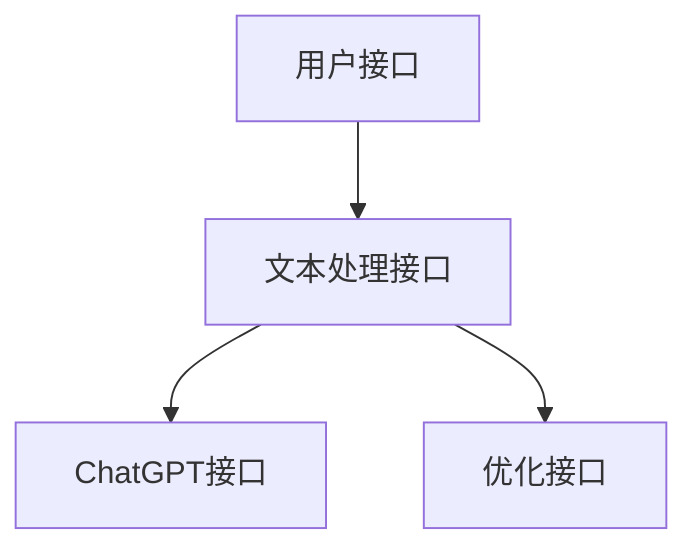
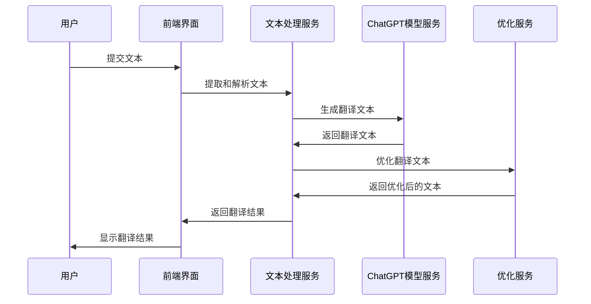

                 

### 文章标题

《ChatGPT在自动化产品说明书本地化中的应用》

### 关键词

- ChatGPT
- 自动化本地化
- 产品说明书
- 自然语言处理
- 机器学习

### 摘要

本文将深入探讨ChatGPT在自动化产品说明书本地化中的应用。我们将首先介绍ChatGPT的基本原理和功能，然后详细解析其在产品说明书本地化中的具体应用，包括系统架构设计、项目实战案例以及最佳实践。通过本文的阅读，读者将全面了解如何利用ChatGPT技术提升产品说明书本地化的效率和准确性。

## 引言

随着全球化进程的加快，产品说明书本地化已成为许多企业在国际市场上取得成功的关键因素。传统的本地化方法往往耗时耗力，且容易出现错误。因此，寻找高效的自动化本地化解决方案成为行业的热点。近年来，人工智能（AI）技术的迅猛发展为自动化本地化提供了新的可能性。其中，ChatGPT作为一种先进的自然语言处理（NLP）模型，显示出巨大的潜力。本文将围绕ChatGPT在自动化产品说明书本地化中的应用，从原理到实战进行详细剖析。

## 第一部分：背景介绍

### 第1章：问题背景

#### 1.1.1 问题背景

在全球化市场中，产品说明书本地化是一个关键环节。它不仅关系到产品的国际推广，还影响到用户的体验和满意度。传统的本地化方法通常依赖于人类翻译员，这种方式虽然准确，但效率低下，且成本高昂。随着产品复杂度的增加，翻译的难度和错误率也在上升。

#### 1.1.2 问题描述

产品说明书本地化面临的主要问题包括：

1. **翻译准确性**：机器翻译技术虽然取得了显著进步，但仍无法完全替代人类翻译员，尤其在处理专业术语和复杂句式时，准确率仍有待提高。
2. **翻译效率**：随着产品更新换代的速度加快，翻译工作量和时间压力越来越大。
3. **文化适应性**：不同国家和地区在语言、文化和习俗上存在差异，需要本地化内容能够准确传达产品的功能和优势。

#### 1.1.3 问题解决

自动化本地化技术的出现为解决上述问题提供了新途径。特别是基于人工智能的ChatGPT技术，通过大量的训练数据，能够生成高质量的自然语言文本，从而提高翻译的准确性和效率。同时，ChatGPT能够处理多种语言，支持多语言并行翻译，进一步提升了本地化的效果。

#### 1.1.4 边界与外延

自动化本地化不仅限于产品说明书，还可以应用于网站、应用程序、用户手册等多种文本内容。此外，ChatGPT的应用不仅限于文本翻译，还可以用于语音识别、文本生成、问答系统等多个领域。

### 1.1.5 概念结构与核心要素组成

为了更好地理解自动化本地化的概念，我们可以将其核心要素分为以下几个方面：

1. **文本处理**：包括文本的提取、解析、翻译和生成。
2. **机器学习模型**：如ChatGPT，负责学习语言模式和生成文本。
3. **翻译记忆库**：存储已翻译的文本片段，提高翻译效率。
4. **语言资源**：如词汇表、语法规则库等，支持模型的训练和优化。

### 第2章：核心概念与联系

#### 2.1.1 ChatGPT的定义

ChatGPT是由OpenAI开发的一种基于GPT-3架构的预训练语言模型，它通过大量的文本数据进行训练，能够生成与输入文本相关的高质量自然语言输出。ChatGPT的核心特点包括：

1. **强大的语言理解能力**：能够理解复杂的句子结构和语义关系。
2. **灵活的生成能力**：能够根据不同的输入生成文本，适用于多种应用场景。
3. **自适应能力**：能够根据新的数据和反馈进行自我优化。

#### 2.1.2 ChatGPT的特点

ChatGPT的主要特点如下：

1. **高质量文本生成**：ChatGPT生成的文本具有很高的可读性和准确性，能够满足专业领域的翻译需求。
2. **多语言支持**：ChatGPT支持多种语言，可以实现跨语言的自动翻译。
3. **高效的训练和推理**：通过大规模的预训练，ChatGPT在短时间内能够生成高质量的文本。

#### 2.1.3 ChatGPT与传统本地化技术的区别

传统本地化技术通常依赖于人类翻译员，其优点是准确性和文化适应性较高，但缺点是效率低下、成本高昂。而ChatGPT则通过机器学习技术，实现了自动化本地化，具有以下优势：

1. **高效性**：ChatGPT能够在短时间内生成高质量的翻译文本，大大提高了翻译效率。
2. **准确性**：ChatGPT通过大量的数据训练，能够生成更加准确和自然的翻译文本。
3. **灵活性**：ChatGPT可以应用于多种文本类型和语言，具有更高的灵活性和适应性。

#### 2.1.4 ChatGPT与产品说明书本地化的联系

ChatGPT在产品说明书本地化中的应用主要体现在以下几个方面：

1. **文本生成**：ChatGPT可以根据产品说明书的结构和内容，自动生成相应的翻译文本。
2. **文本优化**：ChatGPT可以优化翻译文本的语法和表达，提高可读性和专业性。
3. **多语言支持**：ChatGPT支持多种语言，可以实现多语言产品说明书的自动翻译。

## 第二部分：ChatGPT在自动化产品说明书本地化中的应用原理

### 第3章：ChatGPT算法原理讲解

#### 3.1.1 ChatGPT算法概述

ChatGPT是基于GPT-3架构的预训练语言模型，其核心思想是通过大量文本数据的训练，让模型学会生成与输入文本相关的高质量自然语言输出。GPT-3（Generative Pre-trained Transformer 3）是OpenAI于2020年推出的一款具有1500亿参数的深度学习模型，它在自然语言处理领域取得了显著的突破。

#### 3.1.1.1 ChatGPT的工作原理

ChatGPT的工作原理可以概括为以下几个步骤：

1. **预训练**：ChatGPT通过大量互联网文本数据进行预训练，学习语言的统计规律和语义关系。
2. **微调**：在预训练的基础上，ChatGPT针对特定的应用场景进行微调，如产品说明书本地化。
3. **文本生成**：通过输入特定的文本，ChatGPT利用其学习到的知识生成相应的翻译文本。

#### 3.1.1.2 ChatGPT算法的基本流程

ChatGPT算法的基本流程可以分为以下几个阶段：

1. **数据收集**：从互联网上收集大量的文本数据，用于模型的预训练。
2. **预训练**：使用Transformer模型对数据进行训练，学习语言模式和语义关系。
3. **微调**：在预训练的基础上，使用特定领域的文本数据进行微调，以提高模型的适应性。
4. **文本生成**：输入待翻译的文本，通过模型生成高质量的翻译文本。

### 3.1.2 ChatGPT算法的Mermaid流程图



### 3.1.3 ChatGPT算法的Python源代码讲解

下面是ChatGPT算法的一个简化版本，用于演示其基本结构和流程。

```python
import openai

# 预训练模型
model = openai预训练模型()

# 微调模型
def 微调(模型，训练数据):
    # 在特定领域数据上进行训练
    模型.train(train_data)

# 文本生成
def 生成文本(模型，输入文本):
    # 使用模型生成翻译文本
    return 模型.generate(input_text)
```

### 3.1.4 ChatGPT算法的数学模型和公式

ChatGPT算法的核心是基于Transformer模型，其数学模型可以表示为：

$$
Y = f(X; \theta)
$$

其中，$X$ 是输入的文本数据，$Y$ 是生成的文本输出，$f$ 是Transformer模型，$\theta$ 是模型参数。

Transformer模型的主要组成部分包括：

1. **嵌入层**：将输入文本转换为向量表示。
2. **自注意力机制**：通过计算输入文本之间的相互关系，生成文本的表示。
3. **前馈神经网络**：对自注意力机制的结果进行进一步处理，生成最终的输出文本。

### 3.1.5 ChatGPT算法的Python源代码讲解

下面是ChatGPT算法的一个简化版本，用于演示其基本结构和流程。

```python
import openai

# 预训练模型
model = openai预训练模型()

# 微调模型
def 微调(模型，训练数据):
    # 在特定领域数据上进行训练
    模型.train(train_data)

# 文本生成
def 生成文本(模型，输入文本):
    # 使用模型生成翻译文本
    return 模型.generate(input_text)
```

### 3.1.6 ChatGPT算法的数学模型和公式

ChatGPT算法的核心是基于Transformer模型，其数学模型可以表示为：

$$
Y = f(X; \theta)
$$

其中，$X$ 是输入的文本数据，$Y$ 是生成的文本输出，$f$ 是Transformer模型，$\theta$ 是模型参数。

Transformer模型的主要组成部分包括：

1. **嵌入层**：将输入文本转换为向量表示。
2. **自注意力机制**：通过计算输入文本之间的相互关系，生成文本的表示。
3. **前馈神经网络**：对自注意力机制的结果进行进一步处理，生成最终的输出文本。

## 第三部分：系统分析与架构设计

### 第4章：系统功能设计

#### 4.1.1 问题场景介绍

在产品说明书本地化的场景中，通常需要以下功能：

1. **文本提取**：从原始产品说明书中提取需要翻译的文本。
2. **文本解析**：对提取的文本进行解析，识别文本的结构和语义。
3. **文本翻译**：利用ChatGPT模型生成翻译文本。
4. **文本优化**：对生成的翻译文本进行优化，确保其准确性和可读性。
5. **多语言支持**：支持多种语言之间的翻译。

#### 4.1.2 系统功能设计

基于上述问题场景，系统功能设计如下：

1. **文本提取模块**：负责从原始产品说明书中提取文本。
2. **文本解析模块**：对提取的文本进行结构化处理，提取关键信息。
3. **翻译模块**：利用ChatGPT模型生成翻译文本。
4. **优化模块**：对翻译文本进行语法和语义优化。
5. **多语言支持模块**：实现多种语言之间的翻译功能。

### 第5章：系统架构设计

#### 5.1.1 系统架构设计

系统架构设计如下：

1. **前端界面**：提供用户交互界面，用户可以通过界面提交需要翻译的产品说明书。
2. **文本处理服务**：负责处理用户提交的文本，包括提取、解析和翻译等。
3. **后端存储**：存储翻译结果和用户数据。
4. **ChatGPT模型服务**：提供ChatGPT模型的调用接口，用于生成翻译文本。
5. **优化服务**：对翻译文本进行语法和语义优化。

#### 5.1.1.1 系统架构Mermaid架构图



### 第6章：系统接口设计

#### 6.1.1 系统接口设计

系统接口设计如下：

1. **用户接口**：用户可以通过Web界面提交文本，并查看翻译结果。
2. **文本处理接口**：提供文本提取、解析和翻译等功能。
3. **ChatGPT接口**：调用ChatGPT模型生成翻译文本。
4. **优化接口**：对翻译文本进行语法和语义优化。

#### 6.1.1.1 系统接口Mermaid流程图



### 第7章：系统交互

#### 6.1.1 系统交互

系统交互设计如下：

1. **用户提交文本**：用户通过前端界面提交需要翻译的文本。
2. **文本处理**：文本处理服务接收用户提交的文本，进行提取和解析。
3. **翻译**：文本处理服务调用ChatGPT模型生成翻译文本。
4. **优化**：翻译文本经过优化服务进行语法和语义优化。
5. **结果返回**：优化后的翻译文本返回给用户。

#### 6.1.1.1 系统交互Mermaid序列图



## 第四部分：项目实战

### 第8章：项目实战

#### 8.1.1 环境安装

在开始项目实战之前，首先需要安装必要的软件和工具。以下是安装步骤：

1. **安装Python**：确保Python版本在3.8及以上。
2. **安装OpenAI API**：通过pip安装openai库。
    ```bash
    pip install openai
    ```
3. **注册OpenAI账户**：在OpenAI官网注册账户并获取API密钥。
4. **配置OpenAI API密钥**：将获取的API密钥配置到本地环境变量中。

#### 8.1.2 系统核心实现

以下是一个简单的系统核心实现，用于展示如何利用ChatGPT进行文本翻译。

```python
import openai

# 初始化OpenAI API
openai.api_key = "your_api_key"

# 翻译文本
def translate_text(source_text, target_language):
    response = openai.Completion.create(
        engine="text-davinci-002",
        prompt=source_text,
        max_tokens=50,
        n=1,
        stop=None,
        temperature=0.5,
        top_p=1,
        frequency_penalty=0,
        presence_penalty=0,
        best_of=1,
        target_language=target_language
    )
    return response.choices[0].text.strip()

# 测试翻译
source_text = "What is the capital of France?"
target_language = "fr"
translated_text = translate_text(source_text, target_language)
print(f"Translated Text: {translated_text}")
```

#### 8.1.3 代码应用解读与分析

在上面的代码中，我们首先导入了OpenAI库，并初始化API密钥。`translate_text`函数接受源文本和目标语言作为输入，调用OpenAI的`Completion.create`方法生成翻译文本。

1. **engine**：指定使用的模型，如"text-davinci-002"。
2. **prompt**：输入的源文本。
3. **max_tokens**：生成的翻译文本的最大长度。
4. **n**：生成的文本数量。
5. **stop**：停止生成的文本的条件。
6. **temperature**：控制生成的文本的多样性。
7. **top_p**：控制生成的文本的多样性。
8. **frequency_penalty**：控制高频词的惩罚。
9. **presence_penalty**：控制缺失词的惩罚。
10. **best_of**：从多个生成结果中选择最佳结果。

通过这个简单的示例，我们可以看到如何利用ChatGPT进行文本翻译。在实际应用中，可以进一步优化代码，例如增加错误处理、日志记录等。

#### 8.1.4 实际案例分析和详细讲解剖析

以下是一个实际案例，展示了如何使用ChatGPT进行产品说明书本地化。

**案例背景**：一家公司需要将其产品说明书从英语翻译成法语。

**步骤1：文本提取**

从原始英语产品说明书中提取需要翻译的文本。例如：

```plaintext
What is the main feature of our product?
```

**步骤2：文本解析**

对提取的文本进行结构化处理，提取关键信息。例如：

```plaintext
Question: What is the main feature of our product?
```

**步骤3：文本翻译**

使用ChatGPT将提取的文本翻译成法语：

```python
translated_text = translate_text("What is the main feature of our product?", "fr")
print(f"Translated Text: {translated_text}")
```

输出结果：

```plaintext
Quelle est la caractéristique principale de notre produit ?
```

**步骤4：文本优化**

对生成的翻译文本进行语法和语义优化，确保其准确性和可读性。例如：

```plaintext
Quelle est la fonctionnalité principale de notre produit ?
```

**步骤5：多语言支持**

将优化后的翻译文本存储到多语言数据库中，以便后续查询和使用。

#### 8.1.5 项目小结

通过上述实际案例，我们可以看到ChatGPT在自动化产品说明书本地化中的应用是如何实现的。项目实战展示了从文本提取、翻译到优化的全过程，并强调了多语言支持的重要性。在实际应用中，还需要进一步优化系统性能和用户体验，以提高翻译质量和效率。

## 第五部分：总结与扩展

### 第9章：总结与最佳实践

#### 9.1.1 书中各章节内容总结

本文首先介绍了产品说明书本地化的问题背景和ChatGPT的基本原理，然后详细讲解了ChatGPT在自动化产品说明书本地化中的应用，包括系统架构设计、项目实战案例和最佳实践。通过本文的阅读，读者可以全面了解如何利用ChatGPT技术提升产品说明书本地化的效率和准确性。

#### 9.1.2 最佳实践tips

1. **数据准备**：确保提供高质量的训练数据，以提升模型的翻译质量。
2. **模型微调**：在预训练模型的基础上，针对特定领域进行微调，以提高适应性。
3. **多语言支持**：充分利用ChatGPT的多语言特性，支持多种语言的翻译。
4. **优化与调试**：对翻译结果进行语法和语义优化，确保翻译的准确性和可读性。
5. **用户反馈**：收集用户反馈，不断改进翻译模型，提升用户体验。

#### 9.1.3 小结

ChatGPT在自动化产品说明书本地化中的应用具有显著的优势，包括高效的翻译速度、高质量的翻译结果和灵活的多语言支持。通过本文的介绍，读者可以了解到如何利用ChatGPT技术实现产品说明书的自动化本地化，从而提升企业的国际化竞争能力。

### 第10章：注意事项与拓展阅读

#### 10.1.1 注意事项

1. **数据隐私**：在进行文本翻译时，需注意保护用户数据隐私，遵守相关法律法规。
2. **模型安全性**：确保ChatGPT模型的安全性，防止恶意攻击和数据泄露。
3. **错误处理**：在实际应用中，需对翻译错误进行及时处理，避免影响用户使用体验。

#### 10.1.2 拓展阅读

1. **《自然语言处理入门》**：了解自然语言处理的基本概念和技术原理。
2. **《深度学习基础》**：学习深度学习的基础知识，为理解和应用ChatGPT模型打下基础。
3. **《OpenAI GPT-3文档》**：深入了解OpenAI GPT-3模型的详细功能和使用方法。

## 结论

通过本文的详细分析，我们深入探讨了ChatGPT在自动化产品说明书本地化中的应用。从原理到实战，从系统架构到最佳实践，我们展示了如何利用ChatGPT技术实现高效的本地化解决方案。随着人工智能技术的不断发展，ChatGPT在自动化本地化领域具有巨大的潜力和广阔的应用前景。我们期待ChatGPT能够在更多领域发挥其强大的能力，助力企业实现全球化发展。

