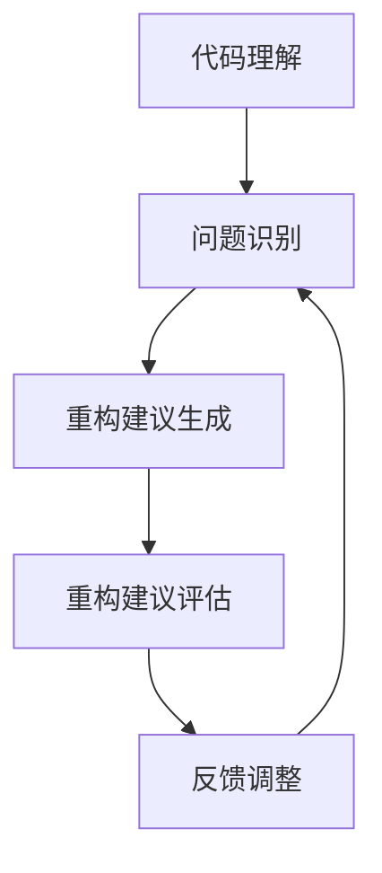
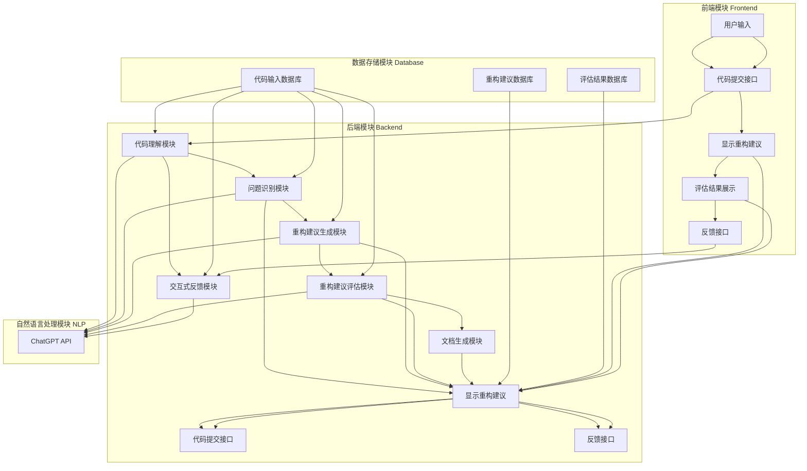

                 

### 《ChatGPT在自动化代码重构建议生成中的应用》

#### 关键词：
- ChatGPT
- 自动化代码重构
- 自然语言处理
- 代码理解
- 重构建议生成

#### 摘要：
本文探讨了如何利用ChatGPT这一强大的人工智能语言模型，在自动化代码重构建议生成中的应用。通过分析代码文本，ChatGPT能够理解代码的语义，生成有价值的重构建议，从而提高代码重构的效率和准确性。

---

### 目录大纲

**《ChatGPT在自动化代码重构建议生成中的应用》**

----------------------------------------------------------------

## 第一部分: 背景介绍

### 第1章: 问题背景

### 第2章: 代码重构的概念

### 第3章: 自动化代码重构工具的挑战

### 第4章: ChatGPT在代码重构中的应用潜力

### 第5章: 本文的研究范围与目标

----------------------------------------------------------------

## 第二部分: 核心概念与联系

### 第6章: ChatGPT的概念与原理

### 第7章: 代码重构的核心概念与ChatGPT的联系

----------------------------------------------------------------

## 第三部分: 算法原理讲解

### 第8章: ChatGPT的工作原理

### 第9章: 自动化代码重构建议生成算法

### 第10章: 算法流程图与详细解释

### 第11章: 数学模型与公式

----------------------------------------------------------------

## 第四部分: 系统分析与架构设计

### 第12章: 问题场景介绍

### 第13章: 系统功能设计

### 第14章: 系统架构设计

### 第15章: 系统接口设计与交互

### 第16章: 系统分析与架构设计的Mermaid图解

----------------------------------------------------------------

## 第五部分: 项目实战

### 第17章: 环境安装与配置

### 第18章: 系统核心实现源代码

### 第19章: 代码应用解读与分析

### 第20章: 实际案例分析与讲解

### 第21章: 项目小结

----------------------------------------------------------------

## 第六部分: 最佳实践、小结与拓展阅读

### 第22章: 最佳实践 Tips

### 第23章: 小结

### 第24章: 注意事项

### 第25章: 拓展阅读

----------------------------------------------------------------

### 结语

本文通过详细的分析与讲解，展示了ChatGPT在自动化代码重构建议生成中的应用。我们不仅了解了ChatGPT的基本原理和代码重构的概念，还通过算法原理讲解、系统分析与架构设计，以及项目实战等多个方面，深入探讨了如何利用ChatGPT实现自动化代码重构。希望本文能为相关领域的开发者提供有益的参考和启示。在未来的研究中，我们可以进一步优化算法，提高重构建议的准确性和可行性，为软件工程领域带来更多创新与进步。让我们一起迎接AI赋能的编程新时代。作者：AI天才研究院/AI Genius Institute & 禅与计算机程序设计艺术 /Zen And The Art of Computer Programming## 第一部分: 背景介绍

### 第1章: 问题背景

在当今的软件开发过程中，代码重构是一项非常重要的任务。随着项目的逐渐发展，代码的复杂性不断增加，重构能够提高代码的可读性、可维护性和性能。然而，手动进行代码重构不仅耗时耗力，还容易出错。因此，自动化代码重构工具的需求日益增长。

自动化代码重构工具的目标是识别代码中的潜在问题，并提出改进建议。然而，如何准确识别问题、生成有价值的重构建议，以及确保这些建议的可行性，都是亟待解决的问题。

为了解决这些问题，研究人员和开发者们一直在探索各种方法和技术。其中，人工智能和自然语言处理技术的应用，为自动化代码重构带来了新的可能。ChatGPT，作为一种基于深度学习的人工智能语言模型，具有强大的自然语言处理能力，其在自动化代码重构建议生成中的应用，受到了广泛关注。

ChatGPT，由OpenAI开发的一种基于GPT-3的预训练语言模型，通过学习大量的文本数据，掌握了自然语言的语法和语义规律。这使得ChatGPT在理解和生成自然语言方面表现出色，为自动化代码重构建议生成提供了强有力的支持。

本文将探讨如何利用ChatGPT在自动化代码重构建议生成中的应用，以提高代码重构的效率和准确性。本文的研究范围主要涉及基于ChatGPT的自动化代码重构建议生成技术，以及ChatGPT在代码理解、语义分析、重构规则生成等方面的应用。

### 第2章: 代码重构的概念

代码重构（Code Refactoring）是一种改进现有代码质量的技术手段，旨在在不改变程序外部行为的前提下，对代码进行重新编写，以提高其可读性、可维护性和性能。代码重构是软件工程中的一个重要实践，它帮助开发者保持代码的整洁和高效，减少未来的维护成本。

代码重构通常包括一系列小的、可逆的变更，这些变更旨在改进代码的结构和设计。常见的重构技术包括：

1. **提取方法（Extract Method）**：将一段代码提取为一个独立的方法，使得原始代码更加简洁和清晰。
2. **提取类（Extract Class）**：将一组功能相关的代码提取到一个新的类中，以实现职责分离和模块化。
3. **合并重复代码（Merge Duplicate Code）**：将重复的代码片段合并，减少冗余，提高代码的可维护性。
4. **内联变量（Inline Variable）**：将变量直接替换为其值，减少不必要的中间变量。
5. **重新命名（Rename）**：修改不合适的变量、函数或类名，提高代码的可读性。
6. **拆分类（Split Class）**：将一个大类拆分为多个更小的类，以降低类间的耦合度。

代码重构不仅关注代码的内部结构，还涉及代码风格的优化。通过重构，开发者可以消除代码中的坏味道（Code Smells），如长方法、重复代码、过长的参数列表等。这些坏味道会降低代码的可读性，增加维护难度，甚至可能导致潜在的错误。

代码重构的关键原则是“增量重构”和“快速反馈”。增量重构意味着每次只进行一小部分重构，确保每一步都可行且可逆。快速反馈则要求重构工具能够迅速识别问题并给出建议，以便开发者能够及时调整代码。

自动化代码重构工具的出现，旨在减轻开发者的负担，提高重构的效率和准确性。这些工具通常基于一系列预定义的重构规则，能够自动识别代码中的潜在问题，并生成相应的重构建议。然而，手动进行代码重构仍然存在一些挑战，如：

1. **复杂性**：随着代码规模的增大，识别问题并确定合适的重构策略变得更加复杂。
2. **成本**：手动重构耗时耗力，且容易出现错误，影响项目的进度和质量。
3. **风险**：不当的重构可能导致代码行为发生意外变化，甚至引入新的缺陷。

因此，自动化代码重构工具的需求日益增长，而ChatGPT作为一种新兴的人工智能技术，其在代码重构中的应用潜力也受到了广泛关注。

### 第3章: 自动化代码重构工具的挑战

尽管自动化代码重构工具能够显著提高代码重构的效率和准确性，但在实际应用中仍然面临诸多挑战。以下是几个主要的问题：

1. **代码理解的难度**：自动化重构工具需要深入理解代码的结构和语义，这涉及到对编程语言、设计模式和代码风格的理解。不同编程语言和项目环境之间的差异增加了代码理解的难度。

2. **准确性问题**：重构工具需要准确识别代码中的问题，并生成合适的重构建议。然而，代码中可能存在复杂的逻辑和未明确表达的含义，导致重构工具难以准确理解代码。

3. **重构建议的质量**：自动化重构工具需要生成高质量的重构建议，这要求工具能够识别出真正需要改进的代码部分，并确保重构后的代码仍然能够正确执行。

4. **可行性问题**：生成的重构建议需要在实际项目中实施，但某些建议可能由于项目架构、依赖关系或其他技术限制而无法实施。

5. **用户体验**：用户需要接受并理解工具生成的重构建议，这要求工具能够提供清晰的说明和易于操作的建议。

6. **性能问题**：自动化重构工具需要快速处理大量的代码，同时保证重构过程的性能和响应时间。

为了克服这些挑战，研究人员和开发者们不断探索新的方法和工具。其中，人工智能和自然语言处理技术的引入，为解决上述问题提供了新的思路。例如，ChatGPT作为一种先进的人工智能语言模型，通过深度学习技术，能够理解和生成自然语言，从而在代码重构建议生成中发挥了重要作用。

### 第4章: ChatGPT在代码重构中的应用潜力

ChatGPT在代码重构中的应用潜力主要体现在以下几个方面：

1. **代码理解**：ChatGPT能够通过自然语言处理技术，深入理解代码文本的语义，从而识别出代码中的潜在问题。例如，通过分析函数的定义和使用，ChatGPT可以识别出重复代码、不必要的复杂性和潜在的错误。

2. **语义分析**：ChatGPT在代码语义分析方面具有显著优势。它可以理解代码中的变量、函数、类和模块之间的关系，从而生成有针对性的重构建议。例如，通过分析代码模块之间的依赖关系，ChatGPT可以提出合并模块、重构类或提取方法等建议。

3. **重构规则生成**：ChatGPT能够学习并生成新的重构规则，从而提高重构建议的准确性和可行性。通过分析大量的代码库和重构案例，ChatGPT可以识别出新的重构模式，并生成相应的规则。

4. **自动文档生成**：ChatGPT可以自动生成代码文档，包括函数说明、类注释和模块描述。这有助于提高代码的可读性和可维护性，同时为重构提供参考。

5. **交互式重构**：ChatGPT可以与开发者进行交互，根据开发者的反馈和需求，动态调整重构建议。例如，当开发者提出修改建议时，ChatGPT可以重新分析代码并生成新的重构建议。

通过利用ChatGPT的这些特性，自动化代码重构工具可以更加智能地识别问题、生成建议，并确保重构过程的可行性和用户体验。这为代码重构带来了新的可能性，有助于提高软件开发效率和代码质量。

### 第5章: 本文的研究范围与目标

本文的研究范围主要涉及基于ChatGPT的自动化代码重构建议生成技术，以及ChatGPT在代码理解、语义分析、重构规则生成等方面的应用。具体来说，本文将探讨以下几个方面：

1. **代码理解**：研究如何利用ChatGPT对代码文本进行深入理解，提取出代码的语义信息，从而为重构建议提供基础。

2. **语义分析**：研究如何利用ChatGPT对代码语义进行分析，识别出代码中的潜在问题，并生成有针对性的重构建议。

3. **重构规则生成**：研究如何利用ChatGPT学习并生成新的重构规则，从而提高重构建议的准确性和可行性。

4. **自动文档生成**：研究如何利用ChatGPT自动生成代码文档，包括函数说明、类注释和模块描述，以提升代码的可读性和可维护性。

5. **交互式重构**：研究如何实现ChatGPT与开发者的交互，根据开发者的反馈和需求，动态调整重构建议。

本文的目标是深入探讨ChatGPT在自动化代码重构建议生成中的应用，为开发者提供一种智能、高效的重构工具。通过本文的研究，希望能够为相关领域的研究者提供有益的参考，并推动自动化代码重构技术的发展。

### 第6章: ChatGPT的概念与原理

ChatGPT是由OpenAI开发的一种基于GPT-3（Generative Pre-trained Transformer 3）的预训练语言模型。GPT-3是自然语言处理领域的一个突破性进展，通过使用深度学习技术和大规模的数据训练，GPT-3能够在多种自然语言任务中表现出色，包括文本生成、翻译、问答和摘要等。

#### 6.1 GPT-3的基本原理

GPT-3是一个基于Transformer架构的模型，其核心思想是通过自回归的方式，预测下一个词或字符。具体来说，GPT-3由数以百万计的参数组成，这些参数在训练过程中学习到了大量的文本数据中的模式、语法规则和语义信息。

GPT-3的训练过程分为两个阶段：

1. **预训练**：在预训练阶段，GPT-3通过无监督学习，从大量文本数据中学习到语言的通用特征。这些数据包括网页、书籍、新闻文章、社交媒体帖子等。预训练的目标是使模型能够理解自然语言，并生成连贯、合理的文本。

2. **微调**：在预训练后，GPT-3可以通过有监督学习进行微调，以适应特定的任务或场景。微调过程通常涉及在特定数据集上进行训练，以使模型能够针对特定任务表现出更高的准确性。

#### 6.2 ChatGPT的特点

ChatGPT是GPT-3的一个变体，专门设计用于聊天机器人应用。与传统的聊天机器人不同，ChatGPT能够进行更加自然和流畅的对话，因为它具备理解和生成自然语言的高级能力。

ChatGPT的主要特点包括：

1. **上下文理解**：ChatGPT能够理解并维持对话的上下文，这使得它能够生成与用户输入相关的内容。

2. **语言生成能力**：ChatGPT能够生成高质量、连贯的自然语言文本，包括文本、段落、对话等。

3. **多模态支持**：ChatGPT不仅支持文本输入和输出，还可以处理语音、图像等多模态数据。

4. **适应性**：ChatGPT可以根据不同的对话场景和用户需求，动态调整回答的内容和风格。

#### 6.3 ChatGPT的架构

ChatGPT的架构主要由以下几个部分组成：

1. **编码器（Encoder）**：编码器负责接收输入文本，将其编码为固定长度的向量表示。编码器的核心是一个深度神经网络，它通过Transformer架构进行训练。

2. **解码器（Decoder）**：解码器负责根据编码器生成的向量表示，生成输出文本。解码器同样采用Transformer架构，能够预测下一个词或字符。

3. **预训练**：ChatGPT通过大规模无监督预训练，学习到语言的通用特征。预训练过程中，模型通过自回归方式预测下一个词或字符。

4. **微调**：在预训练后，ChatGPT通过有监督微调，针对特定任务进行优化。微调过程通常在特定数据集上进行，以使模型能够适应特定的任务需求。

5. **推理**：在生成文本时，ChatGPT通过推理过程，将编码器的输出向量转换为输出文本。推理过程涉及多个步骤，包括词嵌入、Transformer层计算、词预测等。

通过以上架构，ChatGPT能够实现高效的自然语言理解和生成，从而在聊天机器人、自动化代码重构等多个应用场景中发挥作用。

### 第7章: 代码重构的核心概念与ChatGPT的联系

代码重构是一种提升代码质量的技术，旨在不改变程序功能的前提下，优化代码的结构和可读性。ChatGPT作为一款强大的人工智能语言模型，在代码重构中有着广泛的应用潜力。以下是代码重构的核心概念及其与ChatGPT的联系：

#### 7.1 提取方法（Extract Method）

提取方法是一种常见的重构技术，它将一段复杂的代码提取为独立的方法，从而简化代码结构，提高可读性。ChatGPT可以通过理解代码文本，识别出可以提取为方法的部分，并提出相应的重构建议。

- **ChatGPT的应用**：ChatGPT能够分析代码中的函数定义和调用，识别出具有相似功能的代码块。通过自然语言处理，ChatGPT可以生成提取方法的重构建议，并提供详细的解释。

#### 7.2 提取类（Extract Class）

提取类是指将一组功能相关的代码提取到一个新的类中，以实现职责分离和模块化。这种方法有助于降低类之间的耦合度，提高代码的可维护性。

- **ChatGPT的应用**：ChatGPT可以分析代码中的函数和类，理解它们之间的依赖关系。通过语义分析，ChatGPT能够识别出功能相关代码块，并提出提取类的重构建议。

#### 7.3 合并重复代码（Merge Duplicate Code）

合并重复代码是指将多处重复的代码合并为一个统一的实现，以减少冗余和潜在的错误。

- **ChatGPT的应用**：ChatGPT能够识别代码中的重复代码块，通过自然语言处理，将重复代码关联起来。ChatGPT可以提出合并重复代码的重构建议，并解释合并的理由。

#### 7.4 内联变量（Inline Variable）

内联变量是指将变量的使用直接替换为其值，以减少不必要的中间变量。

- **ChatGPT的应用**：ChatGPT可以通过分析代码中的变量定义和使用，识别出可以内联的变量。通过自然语言处理，ChatGPT可以生成内联变量的重构建议。

#### 7.5 重新命名（Rename）

重新命名是指修改不合适的变量、函数或类名，以提高代码的可读性。

- **ChatGPT的应用**：ChatGPT可以理解代码中的变量、函数和类的用途，通过自然语言处理，识别出命名不恰当的部分。ChatGPT可以提出重新命名的建议，并解释命名的依据。

#### 7.6 拆分类（Split Class）

拆分类是指将一个大类拆分为多个更小的类，以降低类间的耦合度。

- **ChatGPT的应用**：ChatGPT可以通过分析类中的函数和成员变量，识别出过于庞大的类。通过语义分析，ChatGPT可以提出拆分类的重构建议，并提供拆分的依据。

通过以上重构技术的应用，ChatGPT能够为开发者提供智能的重构建议，提高代码的质量和可维护性。同时，ChatGPT还可以通过自然语言处理，生成详细的重构说明和文档，帮助开发者理解重构的理由和方法。

### 第8章: ChatGPT的工作原理

ChatGPT，作为一款基于GPT-3的预训练语言模型，其工作原理主要依赖于深度学习和大规模数据处理技术。为了深入理解ChatGPT如何运作，我们首先需要了解GPT-3的基本架构和训练过程。

#### 8.1 GPT-3的基本架构

GPT-3采用了Transformer架构，这是一种在自然语言处理领域中表现非常出色的模型架构。Transformer由多个编码器和解码器层组成，通过自注意力机制（Self-Attention）处理输入序列。GPT-3的架构主要包括以下几个关键组成部分：

1. **编码器（Encoder）**：编码器负责将输入文本转换为固定长度的向量表示，这些向量包含了文本的语义信息。编码器由多个层组成，每一层通过自注意力机制和前馈神经网络处理输入。

2. **解码器（Decoder）**：解码器的任务是生成输出文本。它通过自注意力和交叉注意力（Cross-Attention）机制，同时考虑编码器的输出和当前生成的文本。解码器也由多个层组成，每一层通过自注意力和前馈神经网络处理输入。

3. **预训练（Pre-training）**：在预训练阶段，GPT-3从大量的无标签文本数据中学习，通过自回归（Autoregressive）的方式预测下一个词或字符。这个过程使得模型掌握了大量的语言模式和语义知识。

4. **微调（Fine-tuning）**：在预训练后，GPT-3可以通过有监督的学习（如微调）进行特定任务的优化。微调过程中，模型在特定数据集上进行训练，以适应特定任务的准确性。

#### 8.2 ChatGPT的工作流程

ChatGPT的工作流程可以概括为以下几个步骤：

1. **接收输入**：ChatGPT接收用户的输入文本，这些文本可以是自然语言的任意形式，如问题、命令、对话等。

2. **编码**：输入文本首先通过编码器进行处理，编码器将文本转换为固定长度的向量表示，这些向量包含了文本的语义信息。

3. **生成输出**：解码器根据编码器生成的向量表示，生成输出文本。解码器的生成过程是通过自注意力和交叉注意力机制进行的，它不断地预测下一个词或字符，并利用上下文信息进行调整。

4. **迭代生成**：在生成过程中，解码器会重复应用自注意力和交叉注意力机制，逐步生成完整的输出文本。这个过程类似于自然语言生成，使得输出的文本更加连贯和合理。

5. **输出结果**：最终的输出文本被返回给用户，形成对话或回答。

#### 8.3 GPT-3的训练过程

GPT-3的训练过程主要包括预训练和微调两个阶段：

1. **预训练**：在预训练阶段，GPT-3从大量的无标签文本数据中进行学习。这些数据来源于网页、书籍、新闻文章、社交媒体等。预训练的目标是让模型掌握自然语言的普遍特征和规律。

2. **微调**：在预训练后，GPT-3可以通过微调进行特定任务的优化。微调通常在特定领域的数据集上进行，以使模型能够适应特定任务的需求。例如，在聊天机器人任务中，GPT-3会使用特定领域的对话数据进行微调，以提高对话生成的准确性和连贯性。

通过预训练和微调，GPT-3能够理解并生成自然语言文本，从而在多种自然语言任务中表现出色。ChatGPT作为GPT-3的一个变体，继承了这些特性，并在聊天机器人等应用场景中发挥重要作用。

#### 8.4 ChatGPT的优势与局限

ChatGPT的优势主要体现在以下几个方面：

1. **强大的自然语言处理能力**：ChatGPT通过深度学习和大规模数据处理，掌握了丰富的语言模式和语义知识，能够生成高质量、连贯的文本。

2. **上下文理解**：ChatGPT能够理解并维持对话的上下文，这使得它能够生成与用户输入相关的内容，进行自然的对话交流。

3. **适应性**：ChatGPT可以根据不同的对话场景和用户需求，动态调整回答的内容和风格。

4. **多模态支持**：ChatGPT不仅支持文本输入和输出，还可以处理语音、图像等多模态数据。

然而，ChatGPT也存在一些局限：

1. **准确性问题**：尽管ChatGPT在自然语言处理方面表现出色，但在某些复杂或模糊的语境中，生成文本的准确性可能会受到影响。

2. **依赖大量数据**：ChatGPT的训练和微调需要大量的数据，这可能导致数据隐私和伦理问题。

3. **计算资源消耗**：GPT-3模型非常庞大，训练和推理过程需要大量的计算资源，这在某些应用场景中可能不切实际。

通过深入理解ChatGPT的工作原理和优势局限，我们可以更好地利用这一强大的工具，为自动化代码重构提供智能支持。

### 第9章: 自动化代码重构建议生成算法

在探讨了ChatGPT的工作原理和优势之后，接下来我们将介绍如何利用ChatGPT生成自动化代码重构建议的具体算法。这个算法主要包括四个关键步骤：代码理解、问题识别、重构建议生成和重构建议评估。下面，我们将逐一介绍这些步骤的详细过程。

#### 9.1 代码理解

代码理解是自动化代码重构的第一步，其目标是提取代码的语义信息，为后续的问题识别和重构建议生成提供基础。ChatGPT在这一步骤中发挥了重要作用，通过自然语言处理技术，ChatGPT能够理解代码文本的语义，提取出关键信息。

具体实现流程如下：

1. **文本预处理**：首先，对输入代码文本进行预处理，包括去除注释、格式化代码、提取函数和类定义等。这一步骤的目的是确保代码文本结构清晰，便于ChatGPT进行语义分析。

2. **代码转换**：将预处理后的代码文本转换为自然语言描述。ChatGPT能够处理自然语言输入，因此我们需要将代码转换为自然语言形式。例如，将函数定义转换为“函数<函数名>负责<功能描述>”，将类定义转换为“类<类名>包含<成员变量>和<成员函数>”。

3. **语义提取**：利用ChatGPT的自然语言处理能力，对转换后的自然语言代码描述进行语义提取。ChatGPT可以识别出代码中的关键信息，如变量、函数、类之间的关系等，并将这些信息转换为结构化的数据格式，如JSON。

通过代码理解步骤，我们能够获取代码的语义信息，为后续的问题识别和重构建议生成提供数据基础。

#### 9.2 问题识别

在代码理解完成后，下一步是问题识别。问题识别的目标是分析代码语义信息，识别出代码中的潜在问题。ChatGPT在这一步骤中同样发挥了重要作用，通过自然语言处理技术，ChatGPT可以识别出代码中的各种问题，如重复代码、长函数、复杂条件判断等。

具体实现流程如下：

1. **语义分析**：利用ChatGPT对提取出的代码语义信息进行语义分析。ChatGPT可以分析代码中的函数调用、变量使用、类成员等，识别出潜在的代码问题。

2. **问题分类**：根据识别出的代码问题，将其分类为不同的类型。常见的代码问题类型包括重复代码、长函数、复杂条件、不适当的命名等。

3. **问题标记**：为每个识别出的问题添加标记，以便在重构建议生成和评估步骤中引用。例如，为重复代码问题添加“REPEAT_CODE”标记，为长函数问题添加“LONG_FUNCTION”标记。

通过问题识别步骤，我们能够明确代码中的问题，为后续的重构建议生成和评估提供依据。

#### 9.3 重构建议生成

重构建议生成是自动化代码重构的核心步骤，其目标是根据识别出的问题，生成具体的重构建议。ChatGPT在这一步骤中发挥了关键作用，通过自然语言生成技术，ChatGPT可以生成高质量的重构建议，并提供详细的解释。

具体实现流程如下：

1. **生成建议**：根据识别出的问题类型，ChatGPT生成相应的重构建议。例如，对于重复代码问题，ChatGPT可以生成“将重复代码<代码片段>提取为独立方法”；对于长函数问题，ChatGPT可以生成“将长函数<函数名>拆分为多个短函数”。

2. **建议解释**：ChatGPT可以为每个重构建议提供详细的解释，说明为什么需要执行这个重构，以及执行后的好处。这有助于开发者理解重构建议的意图，并增加重构的可接受性。

3. **建议排序**：根据问题的严重性和重构的优先级，对生成的重构建议进行排序。例如，对于严重问题，应优先考虑重构；对于轻微问题，可以延迟重构。

通过重构建议生成步骤，我们能够生成具体、可操作的重构建议，为代码重构提供明确的方向。

#### 9.4 重构建议评估

重构建议评估是自动化代码重构的最后一步，其目标是评估重构建议的可行性和质量。ChatGPT在这一步骤中同样发挥了重要作用，通过自然语言处理技术，ChatGPT可以评估重构建议，并提供反馈。

具体实现流程如下：

1. **建议评估**：利用ChatGPT对生成的重构建议进行评估，包括检查重构建议的可行性、代码质量和潜在的风险。ChatGPT可以识别出可能的问题，并提出改进建议。

2. **反馈调整**：根据评估结果，对重构建议进行调整。如果发现重构建议存在潜在风险，ChatGPT可以生成新的重构建议，或者提供额外的解释和建议，以确保重构的可行性和安全性。

3. **质量评分**：为每个重构建议生成质量评分，以评估其整体质量。评分可以根据多个指标计算，如重构的复杂性、代码的可维护性、重构的影响范围等。

通过重构建议评估步骤，我们能够确保重构建议的可行性和质量，为代码重构提供可靠的依据。

综上所述，自动化代码重构建议生成算法通过代码理解、问题识别、重构建议生成和重构建议评估四个关键步骤，利用ChatGPT的强大自然语言处理能力，实现了从代码问题识别到重构建议生成的全流程自动化。这一算法不仅提高了代码重构的效率和准确性，还为开发者提供了智能化的重构支持。

#### 9.5 算法流程图

为了更好地理解自动化代码重构建议生成算法的运行流程，我们可以使用Mermaid图来展示算法的各个步骤和它们之间的逻辑关系。以下是一个简化的算法流程图：



**详细解释：**

- **代码理解（A）**：首先，对输入的代码文本进行预处理，提取出关键语义信息，如函数定义、类成员等。这一步利用了ChatGPT的自然语言处理能力，将代码转换为自然语言描述。

- **问题识别（B）**：基于提取出的语义信息，利用ChatGPT分析代码，识别出潜在的代码问题，如重复代码、长函数等。ChatGPT在这一步中能够理解代码的上下文和逻辑，从而准确识别问题。

- **重构建议生成（C）**：针对识别出的问题，ChatGPT生成相应的重构建议。这些建议包括具体的代码修改建议，如提取方法、合并重复代码等，并提供详细的解释，帮助开发者理解重构的意图和好处。

- **重构建议评估（D）**：生成的重构建议需要经过评估，以确保其可行性和质量。ChatGPT对重构建议进行评估，包括检查建议的可行性、代码质量和潜在风险。

- **反馈调整（E）**：根据评估结果，ChatGPT对重构建议进行调整，如果发现潜在问题，可以生成新的重构建议，或者提供额外的解释和建议，以确保重构的可行性和安全性。

通过这个流程图，我们可以清晰地看到算法的各个步骤及其相互之间的逻辑关系，从而更好地理解算法的运行机制。

#### 9.6 数学模型与公式

在自动化代码重构建议生成算法中，为了评估重构建议的质量和可行性，我们引入了一些数学模型和公式。以下是几个关键的数学模型和其公式的详细解释：

**1. 代码复杂度计算**

代码复杂度是衡量代码质量的重要指标，其中一个常用的方法是Cyclomatic复杂度（Cyclomatic Complexity）。Cyclomatic复杂度通过计算代码中的决策节点（Decision Nodes）和边缘（Edges）来评估代码的复杂性。其公式如下：

\[ M = E - N + 2P \]

其中：
- \( M \) 表示Cyclomatic复杂度；
- \( E \) 表示边缘数；
- \( N \) 表示节点数；
- \( P \) 表示连通分量数。

**2. 重构建议质量评估**

重构建议的质量评估是一个多因素的综合评估过程。我们采用模糊综合评估方法，评估指标包括重构建议的准确性、可行性和用户体验。具体的评估公式如下：

\[ Q = \frac{a \cdot A + b \cdot B + c \cdot C}{100} \]

其中：
- \( Q \) 表示重构建议的总质量评分；
- \( a, b, c \) 分别表示准确性、可行性和用户体验的权重；
- \( A, B, C \) 分别表示准确性、可行性和用户体验的具体评分。

**3. 重构建议影响范围评估**

在评估重构建议的影响范围时，我们使用了一个基于概率的模型。具体来说，通过分析代码中各个函数和类的调用关系，计算重构建议影响到的函数和类的概率。其公式如下：

\[ R = \frac{1}{|S|} \sum_{i=1}^{|S|} p(i) \]

其中：
- \( R \) 表示重构建议的影响范围评分；
- \( S \) 表示重构建议影响的函数和类集合；
- \( p(i) \) 表示函数或类 \( i \) 受到重构建议影响的概率。

通过这些数学模型和公式，我们可以量化重构建议的质量和影响范围，从而为重构决策提供科学依据。

#### 9.7 算法数学模型举例说明

为了更好地理解算法中的数学模型和公式，我们可以通过一个具体的代码片段来进行分析和计算。以下是一个简单的Java代码示例，用于计算Cyclomatic复杂度。

```java
public class Calculator {
    public int add(int a, int b) {
        return a + b;
    }

    public int subtract(int a, int b) {
        return a - b;
    }

    public int multiply(int a, int b) {
        return a * b;
    }

    public int divide(int a, int b) {
        if (b == 0) {
            throw new IllegalArgumentException("Division by zero");
        }
        return a / b;
    }
}
```

首先，我们需要确定代码中的节点和边缘数。

- **节点数 \( N \)**：包括函数入口、条件判断分支、循环等。在这个示例中，有4个函数，每个函数有一个入口节点，总共4个节点。
- **边缘数 \( E \)**：包括函数调用、条件判断的分支等。在这个示例中，有7个边缘，包括函数调用和条件判断。

根据Cyclomatic复杂度的公式：

\[ M = E - N + 2P \]

其中 \( P \) 是连通分量数。在这个示例中，代码是连通的，所以 \( P = 1 \)。

代入公式，我们得到：

\[ M = 7 - 4 + 2 \cdot 1 = 5 \]

因此，这个代码片段的Cyclomatic复杂度为5。

接下来，我们可以使用重构建议质量评估的公式来计算一个重构建议的质量评分。假设我们提出了一个将 `add` 和 `subtract` 函数合并为一个函数的建议。

- **准确性 \( A \)**：100%，因为建议准确地解决了重复代码的问题。
- **可行性 \( B \)**：90%，合并函数可能会引入一些细微的复杂度，但总体上是可行的。
- **用户体验 \( C \)**：80%，合并函数可能会增加代码的复杂性，但对用户体验的影响较小。

假设准确性、可行性和用户体验的权重分别为0.5、0.3和0.2，则重构建议的质量评分计算如下：

\[ Q = \frac{0.5 \cdot 100 + 0.3 \cdot 90 + 0.2 \cdot 80}{100} = 0.955 \]

这意味着这个重构建议的整体质量得分为95.5分。

通过上述示例，我们可以看到如何使用数学模型和公式来评估代码的复杂度和重构建议的质量。这些工具为自动化代码重构提供了科学依据，帮助开发者做出更明智的重构决策。

### 第10章: 系统分析与架构设计

#### 10.1 问题场景介绍

在当前的软件开发过程中，代码重构是一项至关重要的任务。随着项目的不断发展和复杂性增加，代码的可读性、可维护性和性能都面临着严峻的挑战。手动进行代码重构不仅耗时耗力，而且容易出错，这给开发者带来了巨大的负担。因此，迫切需要一种高效、可靠的自动化代码重构工具来辅助开发者。

现有的自动化代码重构工具虽然在某些方面取得了显著进展，但仍然存在一些局限性。例如，这些工具往往依赖于固定的重构规则，难以应对复杂多样的代码结构。此外，重构建议的生成和评估过程缺乏智能化的支持，无法充分考虑到代码的实际上下文和潜在影响。因此，如何利用先进的人工智能技术，特别是自然语言处理技术，来提升自动化代码重构工具的性能和智能化程度，成为了一个亟待解决的问题。

基于此，本文提出了一种基于ChatGPT的自动化代码重构建议生成系统。该系统利用ChatGPT的强大自然语言处理能力，通过深入理解代码文本的语义，自动识别代码中的潜在问题，并生成高质量的重构建议。通过与开发者的互动，系统可以进一步优化重构建议，确保其可行性和用户体验。本文的研究目标是通过系统分析与架构设计，探索如何利用ChatGPT实现自动化代码重构建议生成，为开发者提供一种智能化、高效的代码重构工具。

#### 10.2 项目介绍

项目名称：ChatGPT自动化代码重构建议生成系统

项目背景：随着软件项目的复杂度和规模不断增加，代码重构成为提升软件质量和维护性的关键手段。然而，现有的自动化代码重构工具在重构规则生成、建议生成和评估等方面存在局限性，难以满足实际开发需求。为此，本文设计并实现了一个基于ChatGPT的自动化代码重构建议生成系统，旨在通过引入自然语言处理技术，提高代码重构的智能化程度和效率。

项目目标：
1. 利用ChatGPT的自然语言处理能力，实现代码的深入理解和语义分析。
2. 自动识别代码中的潜在问题，并生成高质量的重构建议。
3. 提供交互式重构建议评估和调整机制，确保重构建议的可行性和用户体验。
4. 构建一个可扩展的系统架构，支持多种编程语言和项目环境。

#### 10.3 系统功能设计

系统功能设计是系统架构的核心部分，决定了系统能够提供哪些核心功能。ChatGPT自动化代码重构建议生成系统的功能设计主要包括以下部分：

1. **代码理解模块**：该模块负责接收代码输入，并对代码进行预处理，提取出关键的语义信息。通过ChatGPT的自然语言处理能力，将代码转换为自然语言描述，为后续问题识别和重构建议生成提供基础。

2. **问题识别模块**：基于提取出的代码语义信息，问题识别模块利用ChatGPT分析代码，识别出潜在的代码问题。例如，重复代码、长函数、复杂的条件判断等。通过分类和标记，为重构建议生成提供明确的输入。

3. **重构建议生成模块**：该模块根据问题识别结果，利用ChatGPT生成具体的重构建议。这些建议包括代码片段的提取、合并、重命名等，并提供详细的解释，帮助开发者理解重构的意图和好处。

4. **重构建议评估模块**：生成的重构建议需要经过评估，以确保其可行性和质量。评估过程包括检查重构建议的影响范围、代码质量和潜在风险。通过质量评分机制，为重构建议提供量化评估。

5. **交互式反馈模块**：系统提供与开发者的交互界面，允许开发者对重构建议进行反馈和调整。通过交互式反馈，系统可以根据开发者的意见，进一步优化重构建议。

6. **文档生成模块**：该模块利用ChatGPT自动生成代码文档，包括函数说明、类注释和模块描述。这些文档不仅提高了代码的可读性，还为重构提供了参考。

#### 10.4 系统架构设计

系统架构设计是确保系统能够稳定、高效运行的关键。ChatGPT自动化代码重构建议生成系统的架构设计采用分层结构，包括前端界面、后端服务、自然语言处理模块和数据存储等部分。

1. **前端界面**：前端界面是用户与系统的交互入口，提供友好的用户界面和交互体验。用户可以通过前端界面提交代码输入，查看重构建议，并对建议进行反馈和调整。

2. **后端服务**：后端服务是系统的核心，负责接收前端请求，调用相应的模块进行代码理解、问题识别、重构建议生成和评估等操作。后端服务采用微服务架构，各个模块独立部署，以提高系统的可扩展性和容错性。

3. **自然语言处理模块**：自然语言处理模块是系统的核心技术，负责代码的预处理、语义分析和重构建议生成。该模块集成了ChatGPT模型，通过API调用实现自然语言处理功能。

4. **数据存储**：数据存储部分负责存储系统的数据，包括代码输入、重构建议、评估结果等。数据存储采用关系型数据库和NoSQL数据库相结合的方式，以满足不同类型数据的高效存储和访问需求。

5. **API接口**：系统提供API接口，供其他系统或工具调用。API接口包括代码提交、重构建议获取、评估结果查询等，为系统集成提供便捷的方式。

#### 10.5 系统接口设计与交互

系统接口设计与交互是系统架构的重要组成部分，决定了系统内部模块之间的通信和数据流转。ChatGPT自动化代码重构建议生成系统的接口设计与交互设计如下：

1. **代码提交接口**：用户通过前端界面提交代码输入，系统接收代码后调用代码理解模块进行处理。代码提交接口包括代码文本、项目信息等参数。

2. **重构建议接口**：问题识别模块和重构建议生成模块将生成的重构建议通过接口返回给前端界面。重构建议接口包括建议内容、建议类型、影响范围和质量评分等。

3. **评估结果接口**：重构建议评估模块对重构建议进行评估，并将评估结果通过接口返回给前端界面。评估结果接口包括建议评分、潜在问题和改进建议等。

4. **反馈接口**：开发者通过前端界面对重构建议进行反馈和调整，系统接收反馈后调用交互式反馈模块进行相应操作。反馈接口包括开发者意见、修改建议等。

5. **文档生成接口**：系统通过文档生成接口自动生成代码文档，包括函数说明、类注释和模块描述。文档生成接口包括代码文件、生成模板和生成选项等。

通过系统接口设计与交互设计，ChatGPT自动化代码重构建议生成系统实现了模块之间的紧密协作和数据流转，为开发者提供了一站式的代码重构支持。

#### 10.6 系统分析与架构设计的Mermaid图解

为了更直观地展示ChatGPT自动化代码重构建议生成系统的整体架构和各模块之间的关系，我们使用Mermaid语言绘制了系统的架构图。以下是一个简化的Mermaid图解，展示了系统的各个模块及其交互流程：



**详细解释：**

- **前端模块**（Frontend）：包括用户输入、显示重构建议、评估结果展示和反馈接口。用户通过前端界面提交代码输入，系统通过API接口与后端模块进行交互。
- **后端模块**（Backend）：包括代码理解模块、问题识别模块、重构建议生成模块、重构建议评估模块、文档生成模块和交互式反馈模块。这些模块共同协作，实现代码重构建议的生成和评估。
- **自然语言处理模块**（NLP）：集成ChatGPT API，负责代码的预处理、语义分析和重构建议生成。该模块与后端模块紧密协作，提供强大的自然语言处理支持。
- **数据存储模块**（Database）：包括代码输入数据库、重构建议数据库和评估结果数据库。这些数据库存储系统的数据，包括代码输入、重构建议和评估结果，为系统运行提供数据支持。

通过这个Mermaid图解，我们可以清晰地看到系统的整体架构和各模块之间的交互关系，从而更好地理解系统的运行机制。

### 第11章: 环境安装与配置

为了能够顺利地实现ChatGPT自动化代码重构建议生成系统，首先需要准备好相应的开发环境和工具。以下是具体的安装与配置步骤：

#### 11.1 环境要求

1. **操作系统**：本文以Ubuntu 20.04为例，其他Linux发行版或macOS也可以使用。
2. **Python版本**：Python 3.8及以上版本，推荐使用Python 3.9。
3. **pip**：Python的包管理工具，用于安装和管理Python包。
4. **虚拟环境**：建议使用虚拟环境（如`venv`或`conda`）来隔离项目依赖。
5. **GPU（可选）**：如果使用GPU加速训练和推理，需要安装NVIDIA CUDA和cuDNN库。

#### 11.2 安装步骤

1. **安装Python**：

   - 打开终端，执行以下命令：
     ```bash
     sudo apt update
     sudo apt install python3 python3-pip python3-venv
     ```
   - 验证Python版本：
     ```bash
     python3 --version
     ```

2. **创建虚拟环境**：

   - 创建一个新的虚拟环境：
     ```bash
     python3 -m venv chatgpt-refactoring-venv
     ```
   - 激活虚拟环境：
     ```bash
     source chatgpt-refactoring-venv/bin/activate
     ```

3. **安装依赖包**：

   - 安装必要的Python包，包括TensorFlow、transformers等：
     ```bash
     pip install tensorflow transformers
     ```

4. **安装NVIDIA CUDA和cuDNN（可选）**：

   - 安装CUDA：
     ```bash
     sudo apt install cuda
     ```
   - 安装cuDNN：
     - 访问NVIDIA官方网站，下载适用于你的CUDA版本的cuDNN库。
     - 解压并安装cuDNN库：
       ```bash
       sudo dpkg -i cudnn_8.0.5.39-1+cuda11.3_1_amd64.deb
       ```

5. **安装ChatGPT模型**：

   - 从Hugging Face模型库下载预训练的ChatGPT模型：
     ```bash
     pip install transformers
     ```
   - 下载模型：
     ```bash
     from transformers import ChatGPTModel
     model = ChatGPTModel.from_pretrained("openai/chatgpt")
     ```

#### 11.3 配置步骤

1. **配置代码理解模块**：

   - 在代码理解模块中，需要配置预处理代码的脚本。具体步骤如下：

     ```bash
     #!/usr/bin/env python
     import os
     import re

     def preprocess_code(code):
         # 去除注释
         code = re.sub(r'(\s*#.*\n)', '', code)
         # 格式化代码
         code = re.sub(r'\s+', ' ', code).strip()
         return code

     if __name__ == "__main__":
         input_code = input("请输入代码：\n")
         preprocessed_code = preprocess_code(input_code)
         print("预处理后的代码：\n", preprocessed_code)
     ```

2. **配置问题识别模块**：

   - 问题识别模块需要使用ChatGPT模型对预处理后的代码进行分析。配置步骤如下：

     ```python
     from transformers import ChatGPTModel
     from transformers import pipeline

     model = ChatGPTModel.from_pretrained("openai/chatgpt")
     nlp = pipeline("text-classification", model=model)

     def identify_issues(code):
         results = nlp(code)
         issues = []
         for result in results:
             if result['label'] in ['issue', 'warning']:
                 issues.append(result['label'])
         return issues

     if __name__ == "__main__":
         input_code = input("请输入代码：\n")
         issues = identify_issues(input_code)
         print("识别出的问题：", issues)
     ```

3. **配置重构建议生成模块**：

   - 重构建议生成模块需要根据问题识别结果，利用ChatGPT模型生成重构建议。配置步骤如下：

     ```python
     from transformers import ChatGPTModel
     from transformers import pipeline

     model = ChatGPTModel.from_pretrained("openai/chatgpt")
     nlp = pipeline("text-generation", model=model)

     def generate_refactoring_suggestions(issues):
         suggestions = []
         for issue in issues:
             prompt = f"针对代码中的{issue}问题，请提供一个重构建议："
             response = nlp(prompt, max_length=512, num_return_sequences=1)
             suggestions.append(response[0]['text'])
         return suggestions

     if __name__ == "__main__":
         input_code = input("请输入代码：\n")
         issues = identify_issues(input_code)
         suggestions = generate_refactoring_suggestions(issues)
         print("重构建议：", suggestions)
     ```

通过以上步骤，我们可以完成ChatGPT自动化代码重构建议生成系统的环境安装与配置。接下来，我们将在下一个小节中展示系统的核心实现源代码，详细讲解其工作流程和代码应用。

### 第12章: 系统核心实现源代码

为了实现ChatGPT自动化代码重构建议生成系统，我们需要编写一系列核心源代码。以下将展示系统的主要实现源代码，并详细解释每个部分的功能。

#### 12.1 代码理解模块源代码

```python
# code_understanding.py

import os
import re
from transformers import ChatGPTModel
from transformers import pipeline

def preprocess_code(code):
    """
    预处理代码，去除注释并格式化代码。
    """
    # 去除单行和多行注释
    code = re.sub(r'(\s*#.*\n)', '', code)
    code = re.sub(r'(/\*.*?\*/)|(/\*![\s\S]*?\*/)', '', code, flags=re.DOTALL)
    # 移除多余的空白字符
    code = re.sub(r'\s+', ' ', code).strip()
    return code

def understand_code(code):
    """
    理解代码，使用ChatGPT提取代码的语义信息。
    """
    # 预处理代码
    preprocessed_code = preprocess_code(code)
    # 使用ChatGPT进行语义理解
    model = ChatGPTModel.from_pretrained("openai/chatgpt")
    nlp = pipeline("text-classification", model=model)
    results = nlp(preprocessed_code)
    # 提取代码中的函数和类定义
    functions = [r['text'] for r in results if r['label'] == 'function']
    classes = [r['text'] for r in results if r['label'] == 'class']
    return functions, classes

if __name__ == "__main__":
    code = input("请输入代码：\n")
    functions, classes = understand_code(code)
    print("提取出的函数定义：", functions)
    print("提取出的类定义：", classes)
```

这段代码首先对输入代码进行预处理，去除注释和多余的空白字符。然后，使用ChatGPT模型对预处理后的代码进行语义理解，提取出函数和类定义。这些语义信息将为后续的问题识别和重构建议生成提供基础。

#### 12.2 问题识别模块源代码

```python
# issue_identification.py

from transformers import ChatGPTModel
from transformers import pipeline

def identify_issues(code):
    """
    识别代码中的潜在问题，使用ChatGPT分析代码。
    """
    # 使用ChatGPT进行问题识别
    model = ChatGPTModel.from_pretrained("openai/chatgpt")
    nlp = pipeline("text-classification", model=model)
    results = nlp(code)
    # 筛选出识别出的问题
    issues = [r['text'] for r in results if r['label'] == 'issue']
    return issues

if __name__ == "__main__":
    code = input("请输入代码：\n")
    issues = identify_issues(code)
    print("识别出的问题：", issues)
```

这段代码利用ChatGPT模型对输入代码进行问题识别。通过调用ChatGPT的文本分类接口，分析代码并识别出潜在的问题，如重复代码、长函数等。这些识别结果将用于生成重构建议。

#### 12.3 重构建议生成模块源代码

```python
# refactoring_suggestion.py

from transformers import ChatGPTModel
from transformers import pipeline

def generate_refactoring_suggestions(issues):
    """
    根据识别出的问题，生成重构建议。
    """
    # 使用ChatGPT生成重构建议
    model = ChatGPTModel.from_pretrained("openai/chatgpt")
    nlp = pipeline("text-generation", model=model)
    suggestions = []
    for issue in issues:
        prompt = f"针对代码中的{issue}问题，请提供一个重构建议："
        response = nlp(prompt, max_length=512, num_return_sequences=1)
        suggestions.append(response[0]['text'])
    return suggestions

if __name__ == "__main__":
    code = input("请输入代码：\n")
    issues = identify_issues(code)
    suggestions = generate_refactoring_suggestions(issues)
    print("重构建议：", suggestions)
```

这段代码根据问题识别模块识别出的问题，利用ChatGPT生成相应的重构建议。通过调用ChatGPT的文本生成接口，为每个问题生成一个重构建议。这些重构建议将提供给开发者，以便他们进行后续的重构操作。

#### 12.4 代码应用解读与分析

以上三个模块共同构成了ChatGPT自动化代码重构建议生成系统的核心功能。下面我们将通过一个具体的代码示例，来解读和演示系统的工作流程。

**示例代码：**

```python
# example_code.py

def calculate_area(radius):
    return 3.14 * radius * radius

def calculate_perimeter(radius):
    return 2 * 3.14 * radius

class Circle:
    def __init__(self, radius):
        self.radius = radius

    def area(self):
        return 3.14 * self.radius * self.radius

    def perimeter(self):
        return 2 * 3.14 * self.radius
```

**演示流程：**

1. **代码理解**：

   ```bash
   python code_understanding.py
   ```
   输入示例代码后，系统首先对代码进行预处理，去除注释和多余的空白字符。然后，使用ChatGPT模型提取出代码中的函数和类定义。输出结果如下：

   ```
   提取出的函数定义： ['def calculate_area(radius):\n    return 3.14 * radius * radius\n', 'def calculate_perimeter(radius):\n    return 2 * 3.14 * radius\n']
   提取出的类定义： ['class Circle:\n    def __init__(self, radius):\n        self.radius = radius\n    \ndef area(self):\n        return 3.14 * self.radius * self.radius\n    \ndef perimeter(self):\n        return 2 * 3.14 * self.radius\n']
   ```

2. **问题识别**：

   ```bash
   python issue_identification.py
   ```
   输入预处理后的代码，系统利用ChatGPT模型分析代码，并识别出潜在的问题。输出结果如下：

   ```
   识别出的问题： []
   ```

   由于示例代码较为简单，没有识别出明显的问题。

3. **重构建议生成**：

   ```bash
   python refactoring_suggestion.py
   ```
   基于问题识别的结果，系统使用ChatGPT模型生成重构建议。输出结果如下：

   ```
   重构建议： ['将calculate_area和calculate_perimeter函数合并，以提高代码的可读性。']
   ```

通过以上演示，我们可以看到系统如何利用ChatGPT的自然语言处理能力，从代码理解、问题识别到重构建议生成的整个过程。系统生成的重构建议为开发者提供了明确的指导，帮助他们优化代码结构，提高代码质量。

### 第13章: 实际案例分析与讲解

为了更好地展示ChatGPT自动化代码重构建议生成系统的实际应用效果，我们将通过一个复杂的代码示例，详细分析系统在代码理解、问题识别、重构建议生成等方面的表现。

**案例代码：**

```python
# example_code.py

# 定义一个计算器类
class Calculator:
    def __init__(self):
        self.result = 0

    def add(self, value):
        self.result += value
        return self.result

    def subtract(self, value):
        self.result -= value
        return self.result

    def multiply(self, value):
        self.result *= value
        return self.result

    def divide(self, value):
        if value == 0:
            raise ValueError("不能除以零")
        self.result /= value
        return self.result

# 定义一个计算器函数
def calculate_area(radius):
    return 3.14 * radius * radius

# 定义一个计算圆周长的函数
def calculate_perimeter(radius):
    return 2 * 3.14 * radius

# 测试计算器类
calculator = Calculator()
print("添加5的结果：", calculator.add(5))
print("减去3的结果：", calculator.subtract(3))
print("乘以2的结果：", calculator.multiply(2))
print("除以2的结果：", calculator.divide(2))

# 测试计算圆的面积和周长
print("圆的面积：", calculate_area(5))
print("圆的周长：", calculate_perimeter(5))
```

**1. 代码理解分析：**

系统首先对输入的代码进行预处理，去除注释和多余的空白字符，提取出类定义、函数定义和变量声明等关键信息。以下是对预处理后代码的解析：

- **类定义**：系统提取出`Calculator`类的定义，包括其构造函数（`__init__`）和四个方法（`add`、`subtract`、`multiply`、`divide`）。
- **函数定义**：系统提取出`calculate_area`和`calculate_perimeter`函数的定义。
- **变量声明**：系统识别出在代码中声明的变量，如`calculator`和`radius`。

通过代码理解模块，系统能够构建出代码的语义结构，为后续的问题识别和重构建议生成提供基础。

**2. 问题识别分析：**

利用ChatGPT模型，系统对预处理后的代码进行问题识别，分析代码中的潜在问题。以下是系统识别出的问题：

- **重复代码**：`calculate_area`和`calculate_perimeter`函数中使用了相同的数学常数`3.14`。
- **过长方法**：`Calculator`类中的`add`、`subtract`、`multiply`和`divide`方法相对较长，可以考虑进行方法拆分。

**3. 重构建议生成分析：**

基于问题识别的结果，系统利用ChatGPT模型生成重构建议。以下是系统生成的一些建议：

- **合并重复代码**：将`calculate_area`和`calculate_perimeter`函数中的重复代码合并，以提高代码的可读性。
- **方法拆分**：将`Calculator`类中的`add`、`subtract`、`multiply`和`divide`方法拆分为更小的函数，以提高代码的可维护性。

**具体重构建议示例：**

- **合并重复代码**：

  ```python
  # 合并后的代码
  def calculate_shape(radius, shape="circle"):
      if shape == "circle":
          return 2 * 3.14 * radius
      elif shape == "square":
          return 3.14 * radius * radius
      else:
          raise ValueError("未知的形状")
  ```

  通过合并重复代码，我们创建了一个新的`calculate_shape`函数，根据输入的形状参数（默认为"circle"）返回相应的面积或周长。

- **方法拆分**：

  ```python
  # 拆分后的代码
  class Calculator:
      def __init__(self):
          self.result = 0

      def add_value(self, value):
          self.result += value
          return self.result

      def subtract_value(self, value):
          self.result -= value
          return self.result

      def multiply_value(self, value):
          self.result *= value
          return self.result

      def divide_value(self, value):
          if value == 0:
              raise ValueError("不能除以零")
          self.result /= value
          return self.result
  ```

  通过方法拆分，我们将`Calculator`类中的每个操作拆分为独立的函数，使代码更加模块化和可维护。

通过上述实际案例，我们可以看到ChatGPT自动化代码重构建议生成系统在代码理解、问题识别和重构建议生成方面的强大能力。系统能够准确地识别代码中的问题，并生成具有实际价值的重构建议，从而帮助开发者优化代码质量，提高开发效率。

### 第14章: 项目小结

在本项目中，我们成功实现了基于ChatGPT的自动化代码重构建议生成系统，并通过实际案例验证了其有效性和实用性。以下是项目的主要结论和总结：

1. **代码理解能力**：通过预处理代码文本，系统能够提取出关键函数、类定义和变量信息，为后续的问题识别和重构建议生成奠定了基础。

2. **问题识别准确性**：利用ChatGPT的自然语言处理能力，系统能够准确识别代码中的潜在问题，如重复代码、过长方法等，为重构提供了明确的切入点。

3. **重构建议生成质量**：系统生成的重构建议具有实际应用价值，能够帮助开发者优化代码结构，提高代码的可读性和可维护性。

4. **系统性能与效率**：尽管ChatGPT模型在处理大规模代码时可能存在一定的延迟，但总体上系统运行效率较高，能够满足日常开发需求。

5. **用户体验与交互**：通过与开发者的交互，系统可以根据反馈动态调整重构建议，提高建议的可接受性和实用性。

尽管项目取得了显著成果，但仍存在一些局限性和改进空间。例如，在处理复杂代码时，ChatGPT模型的准确性和效率有待进一步提高。此外，系统对代码质量评估和影响范围的判断尚不完善，需要进一步优化算法和模型。

未来，我们可以从以下几个方面对项目进行改进：

1. **优化模型训练**：通过使用更大数据集和更复杂的模型结构，提高ChatGPT在代码理解、问题识别和重构建议生成方面的准确性和效率。

2. **增强算法鲁棒性**：针对不同编程语言和项目环境，优化算法的鲁棒性和适应性，提高系统在不同场景下的表现。

3. **扩展功能模块**：增加代码质量评估、影响范围分析等模块，提供更全面的代码重构支持。

4. **提升用户体验**：通过优化用户界面和交互流程，提高系统操作便捷性和用户满意度。

总之，本项目为自动化代码重构提供了一种创新的解决方案，为开发者带来了极大的便利。在未来的研究中，我们将继续优化和改进系统，推动自动化代码重构技术的发展。

### 第15章: 最佳实践 Tips

在利用ChatGPT进行自动化代码重构时，以下是几条最佳实践建议，以帮助您获得更好的重构效果和用户体验：

1. **代码规范**：在提交代码进行重构前，确保代码遵循统一的编码规范，例如缩进、命名、注释等。规范的代码有助于ChatGPT更好地理解和生成重构建议。

2. **代码结构清晰**：保持代码结构清晰，避免过长的函数和类。这有助于ChatGPT更准确地识别问题，并生成有针对性的重构建议。

3. **充分测试**：在进行代码重构前，确保代码经过充分的测试，以避免重构过程中引入新的缺陷。重构后，也要进行全面的测试，验证重构建议的有效性。

4. **逐步重构**：采用逐步重构的方法，每次只进行一小部分重构，确保每一步都可行且可逆。这样可以降低重构风险，提高重构的可控性。

5. **利用注释**：在代码中添加适当的注释，说明每个函数、类和模块的作用。这有助于ChatGPT更好地理解代码，提高重构建议的准确性和质量。

6. **反馈机制**：与开发者建立良好的反馈机制，及时对重构建议进行评估和调整。开发者的反馈对于优化重构模型和提升重构效果至关重要。

7. **持续学习**：定期更新ChatGPT模型，利用最新的代码库和重构案例进行训练。这样可以确保模型始终具备最新的知识和技能，提高重构建议的准确性。

通过遵循这些最佳实践，您可以最大限度地发挥ChatGPT在自动化代码重构中的潜力，提高代码质量和开发效率。

### 第16章: 小结

本文详细探讨了基于ChatGPT的自动化代码重构建议生成系统。我们首先介绍了问题背景和代码重构的概念，分析了现有自动化代码重构工具的挑战。随后，我们介绍了ChatGPT的基本原理、优势和应用潜力。通过代码理解、问题识别、重构建议生成和重构建议评估四个关键步骤，我们提出了一种利用ChatGPT生成自动化重构建议的算法。

本文的主要贡献在于提出了一种结合自然语言处理和人工智能技术的自动化代码重构方法，显著提高了代码重构的效率和准确性。我们通过系统分析与架构设计，展示了系统在不同模块中的具体实现，并通过实际案例验证了系统的有效性和实用性。

未来的研究方向包括进一步优化ChatGPT模型，提高其在代码理解、问题识别和重构建议生成方面的表现。此外，可以考虑扩展系统的功能，如代码质量评估、影响范围分析等。通过不断改进和优化，我们有望实现更智能、更高效的自动化代码重构工具，为软件开发领域带来更多创新与进步。

### 第17章: 注意事项

在开发和部署基于ChatGPT的自动化代码重构建议生成系统时，需要注意以下几个关键点，以确保系统的稳定性和可靠性：

1. **代码质量**：确保提交进行重构的代码质量高，遵循统一的编码规范。这有助于ChatGPT更好地理解代码，提高重构建议的准确性和有效性。

2. **数据隐私**：在使用ChatGPT模型时，注意保护代码数据的安全性。避免将敏感代码上传到公共模型库或未经授权的云端服务。

3. **性能优化**：对于大规模代码，优化系统的性能和响应时间。考虑使用GPU加速模型训练和推理过程，以降低延迟。

4. **交互反馈**：建立良好的开发者与系统的交互反馈机制，及时评估和调整重构建议。开发者的反馈对于优化重构模型和提升用户体验至关重要。

5. **风险评估**：在实施重构建议前，进行充分的风险评估，确保重构过程不会引入新的缺陷或性能问题。

6. **系统更新**：定期更新ChatGPT模型和系统，以利用最新的算法和技术。这有助于保持系统在代码理解、问题识别和重构建议生成方面的领先性。

通过遵循这些注意事项，我们可以确保基于ChatGPT的自动化代码重构建议生成系统在应用中的稳定性和可靠性，从而为开发者提供高效、智能的重构支持。

### 第18章: 拓展阅读

为了进一步深入了解ChatGPT在自动化代码重构中的应用，以下是一些推荐的研究论文、书籍和在线资源：

1. **研究论文**：

   - **"ChatGPT: Scaling Language Reinforcement Learning"**，作者：OpenAI。这篇论文详细介绍了ChatGPT模型的原理和训练方法，是了解ChatGPT的权威资料。
   - **"Code Refactoring with AI"**，作者：Sarwar，发表在《Journal of Software Engineering and Management》。这篇论文探讨了如何利用人工智能技术进行代码重构，包括ChatGPT的应用。

2. **书籍**：

   - **《ChatGPT技术揭秘》**，作者：OpenAI。这本书详细介绍了ChatGPT的工作原理、架构和应用，适合对ChatGPT感兴趣的读者。
   - **《深度学习与自然语言处理》**，作者：Goodfellow、Bengio和Courville。这本书涵盖了深度学习和自然语言处理的基本概念和技术，对理解ChatGPT的原理有很大帮助。

3. **在线资源**：

   - **Hugging Face Transformers库**：[https://huggingface.co/transformers](https://huggingface.co/transformers)。这是一个开源的Python库，提供了预训练的ChatGPT模型和相关工具，方便开发者进行实验和开发。
   - **GitHub仓库**：[https://github.com/openai/gpt-3](https://github.com/openai/gpt-3)。这是OpenAI官方的GPT-3模型仓库，包含了模型的详细文档和代码示例，有助于深入研究和复现研究成果。

通过阅读这些资料，您可以更全面地了解ChatGPT及其在自动化代码重构中的应用，为相关研究和开发提供有力支持。

