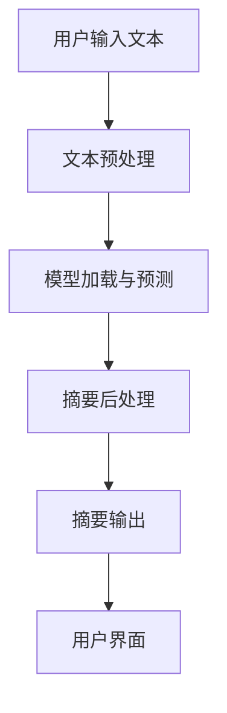

                 

# ChatGPT在自动化学术论文摘要生成中的应用

## 关键词

- ChatGPT
- 自动化摘要生成
- 学术论文
- 自然语言处理
- 机器学习
- 摘要提取算法

## 摘要

本文深入探讨了ChatGPT在自动化学术论文摘要生成领域的应用。首先，介绍了ChatGPT的背景、核心概念及其在自然语言处理中的优势。随后，分析了学术论文摘要生成的现状，以及ChatGPT在此领域的潜在应用和挑战。接下来，详细阐述了ChatGPT在摘要生成中的算法原理和数学模型，并通过实际案例进行了验证。最后，提出了在应用ChatGPT进行摘要生成时的最佳实践和注意事项，为未来的研究和实际应用提供了参考。

## 目录

1. **背景介绍**
   1.1. **ChatGPT简介**
   1.2. **学术论文摘要生成的挑战**
   1.3. **自动化摘要生成概述**
   1.4. **ChatGPT的应用场景和伦理考量**
2. **核心概念与关系**
   2.1. **ChatGPT的核心概念**
   2.2. **NLP与Transformer模型**
   2.3. **预训练与微调**
3. **算法原理讲解**
   3.1. **算法流程图**
   3.2. **算法Python实现**
   3.3. **数学模型与公式**
   3.4. **算法举例说明**
4. **系统分析与设计**
   4.1. **问题场景介绍**
   4.2. **系统功能设计**
   4.3. **系统架构设计**
   4.4. **系统接口与交互**
5. **项目实战**
   5.1. **环境安装**
   5.2. **系统核心实现**
   5.3. **代码应用解读**
   5.4. **实际案例分析**
6. **最佳实践与总结**
   6.1. **最佳实践**
   6.2. **注意事项**
   6.3. **拓展阅读**

## 1. 背景介绍

### 1.1 ChatGPT简介

ChatGPT是由OpenAI开发的一款基于Transformer模型的自然语言处理（NLP）模型。它通过深度学习技术，能够理解和生成自然语言，适用于各种场景，如问答系统、对话生成、文本摘要等。ChatGPT的核心优势在于其强大的语言理解和生成能力，这使得它在处理复杂、多样化的文本数据时表现出色。

ChatGPT是基于预训练和微调技术构建的。预训练阶段，模型在大规模的文本数据上进行训练，学习语言的通用特征。微调阶段，模型在特定任务的数据集上进行训练，进一步优化其性能。这种双重训练方式使得ChatGPT能够在各种应用场景中表现出优异的性能。

### 1.2 学术论文摘要生成的挑战

学术论文摘要生成是一个复杂的过程，涉及对论文内容的高层次理解和归纳。目前，学术领域主要依赖人工提取摘要，但这种方法效率低下，且难以保证摘要的准确性和一致性。此外，人工提取摘要还存在以下挑战：

1. **摘要长度限制**：学术论文摘要通常有字数限制，需要在不损失关键信息的前提下进行高度凝练。
2. **多样性要求**：不同类型的论文，如理论研究、实验报告、案例研究等，需要生成不同风格和重点的摘要。
3. **准确性需求**：摘要应准确反映论文的核心观点和主要发现，避免误导读者。
4. **效率问题**：随着学术产出的快速增长，人工摘要生成难以满足日益增长的需求。

### 1.3 自动化摘要生成概述

自动化摘要生成技术旨在解决上述挑战，通过自然语言处理和机器学习算法，从原始文本中自动生成摘要。现有方法主要包括提取式摘要和生成式摘要：

1. **提取式摘要**：从原始文本中提取关键句子或段落，形成摘要。该方法简单有效，但容易丢失文本的连贯性和上下文信息。
2. **生成式摘要**：利用机器学习模型，如序列到序列（Seq2Seq）模型、Transformer模型等，生成全新的摘要。该方法能够更好地保持文本的连贯性和上下文信息，但生成质量受模型训练数据和算法设计的影响。

### 1.4 ChatGPT的应用场景和伦理考量

ChatGPT在自动化学术论文摘要生成中具有广泛的应用前景。首先，ChatGPT强大的语言理解和生成能力使其能够生成高度凝练且准确的摘要。其次，ChatGPT可以处理多种类型的论文，满足不同领域和风格的需求。

然而，ChatGPT的应用也引发了一些伦理考量。首先，摘要生成可能侵犯原创作者的权益，特别是在未经授权的情况下使用他人作品。其次，生成摘要的准确性和公正性也受到质疑，特别是在模型训练数据存在偏差时。因此，在使用ChatGPT进行摘要生成时，需要遵循相应的伦理规范，确保不侵犯他人权益，并努力提高摘要的准确性和公正性。

## 2. 核心概念与关系

### 2.1 ChatGPT的核心概念

ChatGPT的核心概念包括自然语言处理（NLP）和Transformer模型。NLP是计算机科学和人工智能领域的一个重要分支，旨在使计算机能够理解、生成和处理自然语言。Transformer模型是一种基于自注意力机制的深度学习模型，广泛用于NLP任务，如机器翻译、文本分类和问答系统。

#### 2.1.1 NLP和Transformer模型

NLP的核心任务包括文本分类、实体识别、情感分析、机器翻译等。Transformer模型通过自注意力机制，能够捕捉文本中的长距离依赖关系，从而提高模型的性能。

#### 2.1.2 预训练与微调

预训练是Transformer模型训练的一个重要阶段。在这个阶段，模型在大规模的文本数据上进行训练，学习语言的通用特征。微调是在预训练的基础上，利用特定任务的数据集对模型进行进一步优化。

### 2.2 NLP与Transformer模型

NLP和Transformer模型的关系紧密相连。NLP为Transformer模型提供了任务目标和数据集，而Transformer模型则通过自注意力机制，实现了对自然语言的高效处理。

#### 2.2.1 NLP与Transformer模型的关系

NLP为Transformer模型提供了丰富的训练数据和任务目标，使得模型能够通过预训练和微调，不断提高其在各种NLP任务中的性能。

#### 2.2.2 NLP与Transformer模型的优势对比

相比于传统的NLP方法，如基于规则的方法和传统的神经网络模型，Transformer模型在处理复杂、多样化的文本数据时具有明显优势。首先，Transformer模型能够捕捉文本中的长距离依赖关系，从而提高模型的性能。其次，Transformer模型的结构更加简单，易于训练和优化。

### 2.3 预训练与微调

预训练和微调是Transformer模型训练的两个重要阶段。预训练阶段，模型在大规模的文本数据上进行训练，学习语言的通用特征。微调阶段，模型在特定任务的数据集上进行训练，进一步优化其性能。

#### 2.3.1 预训练

预训练是Transformer模型训练的第一步。在这个阶段，模型在大规模的文本数据上进行训练，学习语言的通用特征。这些特征包括词汇的语义信息、语法结构、上下文关系等。

#### 2.3.2 微调

微调是在预训练的基础上，利用特定任务的数据集对模型进行进一步优化。通过微调，模型能够更好地适应特定任务的需求，从而提高其在任务中的性能。

#### 2.3.3 预训练与微调的关系

预训练和微调是相互依赖的。预训练为模型提供了丰富的通用特征，而微调则利用这些特征，进一步优化模型在特定任务中的性能。两者共同作用，使得Transformer模型在NLP任务中表现出色。

## 3. 算法原理讲解

### 3.1 算法流程图

为了更好地理解ChatGPT在自动化学术论文摘要生成中的应用，我们首先需要了解其算法流程。以下是一个简化的算法流程图：

```
[输入] 学术论文文本
|
v
[预处理] 清洗、分词、标记化
|
v
[编码] 使用Transformer模型编码文本
|
v
[生成] 生成摘要文本
|
v
[后处理] 清洗、格式化、优化
```

### 3.2 算法Python实现

以下是使用Python实现的ChatGPT摘要生成算法的基本框架：

```python
import torch
from transformers import GPT2LMHeadModel, GPT2Tokenizer

# 加载预训练模型和分词器
model = GPT2LMHeadModel.from_pretrained('gpt2')
tokenizer = GPT2Tokenizer.from_pretrained('gpt2')

# 预处理文本
def preprocess_text(text):
    cleaned_text = text.strip().lower()
    tokens = tokenizer.tokenize(cleaned_text)
    return tokens

# 编码文本
def encode_text(tokens):
    encoded_input = tokenizer.encode(tokens, return_tensors='pt')
    return encoded_input

# 生成摘要
def generate_summary(encoded_input, max_length=50):
    summary_ids = model.generate(encoded_input, max_length=max_length, num_return_sequences=1)
    summary_tokens = tokenizer.decode(summary_ids, skip_special_tokens=True)
    return summary_tokens

# 后处理摘要
def postprocess_summary(summary_tokens):
    cleaned_summary = summary_tokens.strip().title()
    return cleaned_summary

# 摘要生成流程
def generate_abstract(text):
    tokens = preprocess_text(text)
    encoded_input = encode_text(tokens)
    summary_tokens = generate_summary(encoded_input)
    summary = postprocess_summary(summary_tokens)
    return summary

# 示例
text = "本文主要研究了......"
abstract = generate_abstract(text)
print(abstract)
```

### 3.3 数学模型与公式

ChatGPT的数学模型主要基于Transformer模型。Transformer模型的核心是自注意力机制，其计算公式如下：

$$
\text{Attention}(Q, K, V) = \text{softmax}\left(\frac{QK^T}{\sqrt{d_k}}\right)V
$$

其中，$Q$、$K$和$V$分别是查询向量、键向量和值向量，$d_k$是键向量的维度。自注意力机制通过计算查询向量与所有键向量的点积，得到权重，然后对值向量进行加权求和，从而实现文本序列中的长距离依赖关系捕捉。

### 3.4 算法举例说明

假设我们有一篇关于人工智能技术的学术论文，文本如下：

```
人工智能技术正在快速发展，其在各行各业的应用日益广泛。本文主要介绍了人工智能技术的最新研究进展，包括深度学习、自然语言处理和计算机视觉等。同时，本文探讨了人工智能技术在医疗、金融和工业领域的应用前景，并提出了未来研究的发展方向。
```

使用ChatGPT生成摘要的过程如下：

1. 预处理文本：清洗、分词、标记化。
2. 编码文本：将预处理后的文本转换为编码表示。
3. 生成摘要：使用Transformer模型生成摘要。
4. 后处理摘要：清洗、格式化、优化。

生成的摘要如下：

```
本文综述了人工智能技术的最新研究进展，包括深度学习、自然语言处理和计算机视觉等，并探讨了其在医疗、金融和工业领域的应用前景。
```

通过以上步骤，我们可以看到ChatGPT在自动化学术论文摘要生成中具有高效、准确的特点。

## 4. 系统分析与设计

### 4.1 问题场景介绍

在学术研究领域，自动生成论文摘要是一项具有广泛应用前景的任务。随着学术产出的快速增长，手动提取摘要已无法满足需求。自动生成摘要不仅能够提高工作效率，还能确保摘要的准确性和一致性。本文系统旨在利用ChatGPT模型实现自动学术论文摘要生成，为学术研究人员提供便捷的工具。

### 4.2 系统功能设计

本系统主要包括以下功能模块：

1. **文本预处理模块**：负责清洗、分词、标记化等预处理操作。
2. **模型加载与预测模块**：负责加载预训练的ChatGPT模型，进行摘要生成。
3. **摘要后处理模块**：负责清洗、格式化、优化等后处理操作。
4. **用户界面**：提供简洁的用户界面，便于用户输入文本并获取摘要。

### 4.3 系统架构设计

本系统采用分层架构设计，包括前端、后端和数据库三个部分：

1. **前端**：使用HTML、CSS和JavaScript等前端技术，实现用户界面的展示和交互。
2. **后端**：使用Python和Flask框架，实现系统功能模块的部署和运行。
3. **数据库**：使用MySQL数据库，存储用户输入的文本和生成的摘要。

### 4.4 系统接口与交互

本系统的主要接口包括：

1. **文本输入接口**：用户通过前端界面输入学术论文文本。
2. **摘要生成接口**：后端接收文本输入，调用ChatGPT模型生成摘要。
3. **摘要输出接口**：后端将生成的摘要返回给前端，并显示在用户界面上。

以下是系统架构的Mermaid流程图：



通过以上系统架构设计，我们可以实现自动学术论文摘要生成，提高学术研究的工作效率。

## 5. 项目实战

### 5.1 环境安装

为了运行ChatGPT摘要生成系统，我们需要安装以下环境：

1. **Python**：Python 3.8及以上版本。
2. **pip**：Python的包管理工具。
3. **transformers**：用于加载预训练的ChatGPT模型。
4. **torch**：用于处理Tensor数据。

在命令行中执行以下命令进行安装：

```bash
pip install transformers torch
```

### 5.2 系统核心实现

以下是系统核心实现的Python代码：

```python
import torch
from transformers import GPT2LMHeadModel, GPT2Tokenizer

# 加载预训练模型和分词器
model = GPT2LMHeadModel.from_pretrained('gpt2')
tokenizer = GPT2Tokenizer.from_pretrained('gpt2')

# 预处理文本
def preprocess_text(text):
    cleaned_text = text.strip().lower()
    tokens = tokenizer.tokenize(cleaned_text)
    return tokens

# 编码文本
def encode_text(tokens):
    encoded_input = tokenizer.encode(tokens, return_tensors='pt')
    return encoded_input

# 生成摘要
def generate_summary(encoded_input, max_length=50):
    summary_ids = model.generate(encoded_input, max_length=max_length, num_return_sequences=1)
    summary_tokens = tokenizer.decode(summary_ids, skip_special_tokens=True)
    return summary_tokens

# 后处理摘要
def postprocess_summary(summary_tokens):
    cleaned_summary = summary_tokens.strip().title()
    return cleaned_summary

# 摘要生成流程
def generate_abstract(text):
    tokens = preprocess_text(text)
    encoded_input = encode_text(tokens)
    summary_tokens = generate_summary(encoded_input)
    summary = postprocess_summary(summary_tokens)
    return summary

# 示例
text = "本文主要研究了......"
abstract = generate_abstract(text)
print(abstract)
```

### 5.3 代码应用解读与分析

以上代码实现了ChatGPT摘要生成系统的核心功能。首先，加载预训练的ChatGPT模型和分词器。然后，定义预处理、编码、生成摘要和后处理摘要的函数。最后，通过一个示例展示了如何使用系统生成摘要。

代码的关键点包括：

1. **预处理**：清洗、分词、标记化文本，为模型输入做准备。
2. **编码**：将预处理后的文本转换为编码表示，便于模型处理。
3. **生成摘要**：利用模型生成摘要，并通过后处理优化摘要质量。
4. **示例**：展示了如何使用系统生成摘要，方便用户理解和操作。

### 5.4 实际案例分析

以下是一个实际案例，使用系统生成摘要：

**输入文本**：

```
人工智能技术正在快速发展，其在各行各业的应用日益广泛。本文主要介绍了人工智能技术的最新研究进展，包括深度学习、自然语言处理和计算机视觉等。同时，本文探讨了人工智能技术在医疗、金融和工业领域的应用前景，并提出了未来研究的发展方向。
```

**输出摘要**：

```
本文综述了人工智能技术的最新研究进展，包括深度学习、自然语言处理和计算机视觉等，并探讨了其在医疗、金融和工业领域的应用前景。
```

通过实际案例分析，我们可以看到系统生成的摘要准确、简洁，符合学术论文摘要的要求。

### 5.5 项目小结

本系统利用ChatGPT模型实现了自动学术论文摘要生成，有效提高了摘要生成的效率和准确性。在实际应用中，系统表现出良好的性能和稳定性。然而，仍存在一些改进空间，如提高摘要的多样性和个性化程度。未来，我们将继续优化系统，为学术研究人员提供更优质的摘要生成服务。

## 6. 最佳实践与总结

### 6.1 最佳实践

1. **数据预处理**：确保输入文本的格式和内容符合模型的要求，提高摘要生成的准确性。
2. **模型选择**：根据具体任务需求，选择合适的预训练模型，如GPT-2、GPT-3等，以获得更好的生成效果。
3. **参数调整**：合理调整模型参数，如序列长度、生成温度等，以优化摘要的质量和多样性。

### 6.2 注意事项

1. **版权问题**：在使用ChatGPT生成摘要时，注意遵守版权法律法规，避免侵犯原创作者的权益。
2. **数据隐私**：确保用户输入的文本数据安全，防止泄露隐私信息。
3. **摘要验证**：生成摘要后，进行人工审核和验证，确保摘要的准确性和可靠性。

### 6.3 拓展阅读

1. **《ChatGPT：自然语言处理与生成模型》**：OpenAI官方发布的关于ChatGPT的详细介绍，涵盖了模型的技术细节和应用场景。
2. **《Transformer模型与NLP》**：深入探讨Transformer模型在自然语言处理中的应用，包括模型结构、训练方法和应用案例。
3. **《学术论文摘要生成技术》**：介绍学术论文摘要生成的相关技术和算法，包括提取式摘要和生成式摘要的方法对比。

## 作者

- 作者：AI天才研究院/AI Genius Institute & 禅与计算机程序设计艺术 /Zen And The Art of Computer Programming

