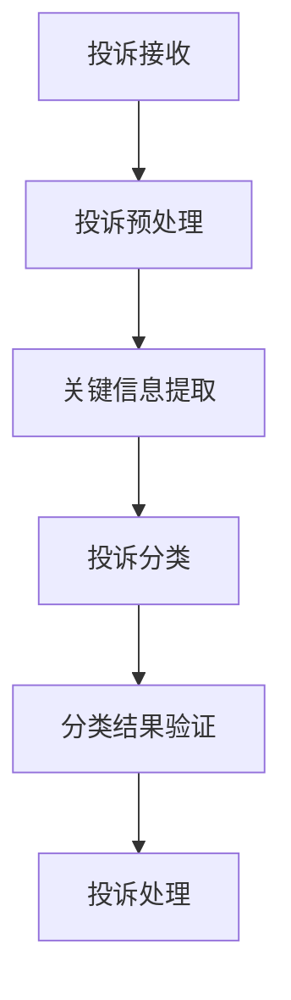
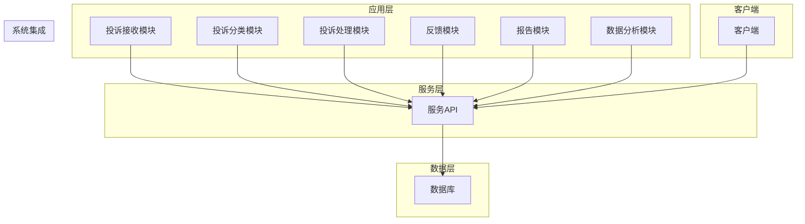
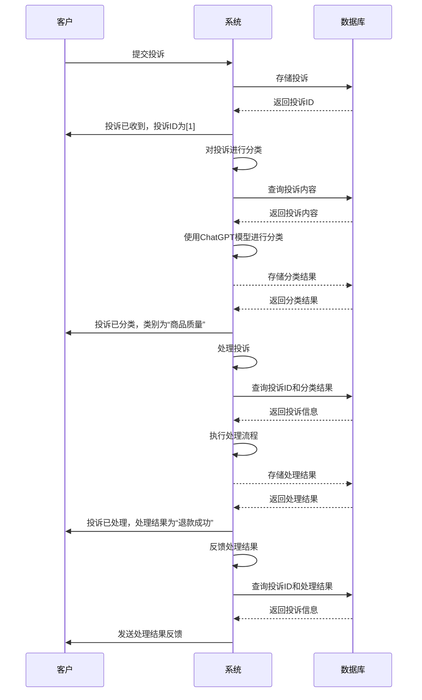

                 

### 第1章: 问题背景与核心概念

### 1.1 问题背景

随着互联网和电子商务的快速发展，企业客户服务的需求也日益增长。特别是在客户投诉处理方面，高效、准确的响应是提升客户满意度和企业品牌形象的关键。传统的客户投诉处理方式往往依赖于人工，不仅效率低下，而且容易出错。随着人工智能技术的不断进步，智能客服逐渐成为企业服务的重要组成部分。

智能客服系统通过自动化处理客户咨询和投诉，能够在短时间内响应用户的需求，提供精准、高效的解决方案。其中，自然语言处理（NLP）技术是实现智能客服的核心。NLP技术能够理解和生成自然语言，使得计算机能够与人类进行对话，从而实现智能化的客户服务。

然而，客户投诉内容多样且复杂，传统的NLP技术往往难以实现高效的分类和处理。因此，如何利用先进的人工智能技术，特别是ChatGPT，来实现自动化客户投诉分类与处理，成为当前研究的一个重要方向。

### 1.1.1 智能客服的发展

智能客服作为一种先进的客户服务模式，近年来得到了快速发展。其核心在于通过机器学习和自然语言处理技术，使计算机能够理解和处理客户的自然语言请求，提供高质量的客户服务。

早期的智能客服主要是基于规则的方法，即通过预定义的规则来匹配客户的问题并给出相应的回答。这种方法虽然能够处理一些简单的问题，但面对复杂、多样的问题时，往往显得力不从心。

随着人工智能技术的进步，特别是深度学习技术的应用，智能客服系统逐渐向智能化方向发展。其中，基于GPT模型（如ChatGPT）的预训练语言模型，已经成为智能客服技术的重要突破。GPT模型通过在大规模语料库上进行预训练，能够捕捉到语言中的复杂结构和语义信息，从而实现更加智能的客户服务。

### 1.1.2 客户投诉处理的挑战

客户投诉处理是客户服务中的重要环节，其效率和质量直接影响客户满意度和企业形象。传统的客户投诉处理方式主要依赖于人工，存在以下挑战：

1. **响应速度慢**：人工处理客户投诉需要一定的时间，特别是在投诉量较大的情况下，响应速度往往无法满足客户需求。

2. **处理错误率高**：人工处理过程中容易因为疲劳、疏忽等原因导致错误，影响投诉处理的准确性和有效性。

3. **分类难度大**：客户投诉内容多样且复杂，传统的NLP技术难以实现高效、准确的分类。

4. **处理流程繁琐**：客户投诉处理通常涉及多个部门和环节，流程繁琐，协调困难。

为了解决上述问题，企业需要引入自动化技术，特别是基于ChatGPT的智能客服系统，以实现快速、准确、高效的客户投诉处理。

### 1.1.3 ChatGPT的应用潜力

ChatGPT是一种基于GPT模型的大规模语言预训练模型，具有以下几个显著特点：

1. **强大的语言理解能力**：ChatGPT通过在大规模语料库上的预训练，能够理解和生成复杂的自然语言，实现对客户投诉内容的精准理解。

2. **灵活的分类能力**：ChatGPT能够利用其预训练模型，对客户投诉进行自动分类，提高投诉处理的效率。

3. **智能化的处理策略**：基于分类结果，ChatGPT可以设计相应的处理策略，提供个性化的解决方案。

4. **自适应的学习能力**：ChatGPT能够根据企业的业务需求和用户反馈，不断优化和调整，实现智能化的客户服务。

因此，ChatGPT在自动化客户投诉分类与处理中具有巨大的应用潜力。通过引入ChatGPT，企业可以大幅提升客户投诉处理的效率和准确性，提高客户满意度，从而在竞争激烈的市场中脱颖而出。

### 1.2 核心概念

#### 1.2.1 ChatGPT的基本原理

ChatGPT是基于GPT（Generative Pre-trained Transformer）模型的大规模语言预训练模型。GPT模型是一种基于变换器（Transformer）架构的预训练语言模型，通过在大规模语料库上进行预训练，学习到语言中的复杂结构和语义信息。

GPT模型的主要特点包括：

1. **预训练**：GPT模型在大规模语料库上进行预训练，通过学习大量的文本数据，使模型能够理解语言中的复杂结构和语义信息。

2. **变换器架构**：GPT模型采用变换器（Transformer）架构，能够高效地处理长距离依赖，实现对文本的深层理解。

3. **生成性**：GPT模型不仅能够理解文本，还能够生成文本，实现与人类的自然对话。

#### 1.2.2 客户投诉分类与处理的流程

客户投诉分类与处理的流程主要包括以下几个步骤：

1. **投诉接收**：系统接收客户提交的投诉信息，包括投诉内容、投诉类型等。

2. **投诉预处理**：对投诉信息进行清洗和预处理，包括去除噪声、分词、词性标注等。

3. **投诉分类**：利用ChatGPT模型对投诉内容进行自动分类，将投诉分为不同的类型。

4. **投诉处理**：根据分类结果，设计相应的处理流程和策略，对投诉进行进一步处理。

5. **反馈与监控**：将处理结果反馈给客户，并持续监控处理过程，确保投诉得到及时、有效的解决。

#### 1.2.3 ChatGPT的优势与挑战

ChatGPT在自动化客户投诉分类与处理中具有以下优势：

1. **高效性**：ChatGPT能够快速理解客户投诉内容，实现高效分类和处理。

2. **准确性**：ChatGPT通过预训练模型，能够准确捕捉投诉中的关键信息，提高分类和处理的准确性。

3. **灵活性**：ChatGPT能够根据企业的业务需求和用户反馈，灵活调整处理策略，提供个性化的服务。

然而，ChatGPT在自动化客户投诉分类与处理中也面临一些挑战：

1. **数据质量**：投诉数据的多样性和复杂性，对数据质量提出了较高要求。

2. **模型优化**：需要不断优化模型，提高分类和处理的准确性。

3. **用户反馈**：需要及时收集用户反馈，持续优化系统性能。

综上所述，ChatGPT在自动化客户投诉分类与处理中具有巨大的潜力，但也需要不断优化和改进，以应对面临的挑战。

### 第2章: ChatGPT与客户投诉处理

#### 2.1 ChatGPT简介

ChatGPT是一种基于GPT（Generative Pre-trained Transformer）模型的大规模语言预训练模型。GPT模型是由OpenAI提出的一种基于变换器（Transformer）架构的深度学习模型，通过在大规模语料库上进行预训练，学习到语言中的复杂结构和语义信息。

GPT模型具有以下几个显著特点：

1. **预训练**：GPT模型在大规模语料库上进行预训练，通过学习大量的文本数据，使模型能够理解语言中的复杂结构和语义信息。

2. **变换器架构**：GPT模型采用变换器（Transformer）架构，能够高效地处理长距离依赖，实现对文本的深层理解。

3. **生成性**：GPT模型不仅能够理解文本，还能够生成文本，实现与人类的自然对话。

ChatGPT作为GPT模型的一个变体，在客户投诉处理中具有广泛应用。其工作原理可以概括为以下几个步骤：

1. **投诉接收**：系统接收客户提交的投诉信息，包括投诉内容、投诉类型等。

2. **投诉预处理**：对投诉信息进行清洗和预处理，包括去除噪声、分词、词性标注等。

3. **投诉理解**：利用ChatGPT模型对投诉内容进行理解，捕捉投诉中的关键信息。

4. **投诉分类**：根据理解结果，利用ChatGPT模型对投诉进行自动分类，将投诉分为不同的类型。

5. **投诉处理**：根据分类结果，设计相应的处理流程和策略，对投诉进行进一步处理。

6. **反馈与监控**：将处理结果反馈给客户，并持续监控处理过程，确保投诉得到及时、有效的解决。

ChatGPT在客户投诉处理中的应用，大大提升了投诉处理的效率和准确性，为企业提供了智能化、高效的客户服务解决方案。

#### 2.2 客户投诉分类算法

客户投诉分类是客户投诉处理中的一个重要环节，其目标是将接收到的客户投诉按照其内容进行分类，以便于后续的处理。ChatGPT作为一种强大的自然语言处理工具，在客户投诉分类中发挥了重要作用。下面，我们将详细讲解客户投诉分类算法的基本原理和具体实现步骤。

##### 2.2.1 算法原理

客户投诉分类算法的核心思想是利用ChatGPT模型对投诉内容进行理解，并从中提取关键信息，然后根据这些关键信息对投诉进行分类。具体来说，算法包括以下几个步骤：

1. **投诉内容预处理**：对客户提交的投诉内容进行清洗和预处理，包括去除噪声、分词、词性标注等。

2. **关键信息提取**：利用ChatGPT模型对预处理后的投诉内容进行理解，提取投诉中的关键信息，如关键词、主题等。

3. **投诉分类**：根据提取的关键信息，利用预定义的分类规则，将投诉分为不同的类型。

4. **分类结果验证**：对分类结果进行验证，确保分类的准确性。

##### 2.2.2 算法流程图

为了更好地理解客户投诉分类算法的原理和步骤，我们使用Mermaid绘制了算法流程图，如下所示：



##### 2.2.3 Python代码与LaTeX公式详解

为了具体实现客户投诉分类算法，我们使用Python编写了相关代码，并使用LaTeX公式对算法中的关键步骤进行详细说明。

首先，我们需要安装必要的库，如transformers、torch等：

```python
!pip install transformers torch
```

接下来，我们编写Python代码，实现客户投诉分类算法：

```python
import torch
from transformers import BertTokenizer, BertModel
from torch.nn.functional import cross_entropy

# 初始化ChatGPT模型和分词器
tokenizer = BertTokenizer.from_pretrained('bert-base-chinese')
model = BertModel.from_pretrained('bert-base-chinese')

# 准备投诉数据
complaints = [
    "商品质量有问题，要求退款。",
    "物流速度太慢，影响使用。",
    "售后服务态度不好，需要改进。",
    # 更多投诉数据
]

# 预处理投诉内容
def preprocess_complaint(complaint):
    return tokenizer.encode(complaint, add_special_tokens=True, return_tensors='pt')

# 提取关键信息
def extract_key_info(complaint):
    inputs = preprocess_complaint(complaint)
    outputs = model(inputs)
    last_hidden_states = outputs.last_hidden_state
    # 取[CLS]位置的向量作为文本的语义表示
    key_info = last_hidden_states[:, 0, :]
    return key_info

# 分类投诉
def classify_complaint(key_info):
    # 这里使用简单的softmax分类，实际应用中可以替换为更复杂的分类模型
    with torch.no_grad():
        logits = model(classifier_layer_key_info)
    prob = torch.nn.functional.softmax(logits, dim=1)
    # 取概率最高的类别作为分类结果
    classification = prob.argmax().item()
    return classification

# 实现分类算法
def customer_complaint_classifier(complaint):
    key_info = extract_key_info(complaint)
    classification = classify_complaint(key_info)
    return classification

# 运行算法
for complaint in complaints:
    classification = customer_complaint_classifier(complaint)
    print(f"投诉内容：{complaint}\n分类结果：{classification}\n")
```

在上述代码中，我们首先初始化ChatGPT模型和分词器，然后准备投诉数据。接下来，我们定义了预处理投诉内容、提取关键信息、分类投诉等函数，最后实现了一个客户投诉分类器。

为了更好地理解算法中的关键步骤，我们使用LaTeX公式对一些关键概念进行详细说明：

1. **预处理投诉内容**：

   $$\text{input\_id} = \text{tokenizer}(\text{complaint}, \text{add\_special\_tokens}=\text{True}, \text{return\_tensors}=\text{'pt'})$$

2. **提取关键信息**：

   $$\text{key\_info} = \text{last\_hidden\_state}[:, 0, :]$$

3. **分类投诉**：

   $$\text{logits} = \text{model}(\text{key\_info})$$
   
   $$\text{prob} = \text{softmax}(\text{logits}, \text{dim}=1)$$
   
   $$\text{classification} = \text{argmax}(\text{prob})$$

通过上述Python代码和LaTeX公式，我们详细讲解了客户投诉分类算法的基本原理和具体实现步骤。在实际应用中，可以根据需要调整算法的细节，以提高分类的准确性和效率。

### 2.3 客户投诉处理算法

在客户投诉处理过程中，分类只是第一步，关键是如何根据分类结果，设计相应的处理流程和策略，确保投诉得到及时、有效的解决。客户投诉处理算法主要包括以下几个部分：

1. **规则匹配**：根据分类结果，匹配相应的处理规则，确定处理流程。

2. **机器学习**：利用机器学习算法，对投诉数据进行分析，发现潜在的问题，优化处理策略。

3. **自动化执行**：根据处理规则和策略，自动化执行投诉处理任务，包括反馈、解决、跟踪等。

下面，我们将详细讲解这些部分的工作原理和实现方法。

#### 2.3.1 处理流程

客户投诉处理的基本流程如下：

1. **投诉接收**：系统接收客户提交的投诉，包括投诉内容、投诉类型等。

2. **投诉分类**：利用ChatGPT模型对投诉内容进行分类，确定投诉类型。

3. **规则匹配**：根据分类结果，匹配相应的处理规则，确定处理流程。

4. **投诉处理**：执行处理流程，包括反馈、解决、跟踪等。

5. **结果反馈**：将处理结果反馈给客户，包括解决方案、处理进度等。

6. **监控与优化**：持续监控处理过程，根据用户反馈和系统数据，优化处理策略。

#### 2.3.2 处理策略

处理策略是客户投诉处理的核心，直接影响投诉处理的效率和效果。以下是一些常用的处理策略：

1. **快速响应**：在投诉接收后，系统立即向客户发送响应，告知投诉已收到，并承诺在规定时间内处理。

2. **分类处理**：根据投诉类型，设计不同的处理流程和策略。例如，针对质量问题，可能需要与生产部门协同处理；针对售后服务问题，可能需要与客服部门协调。

3. **优先处理**：对紧急和重要的投诉，优先处理，确保关键问题得到及时解决。

4. **闭环管理**：对已解决的投诉，进行闭环管理，确保问题不再复发。

5. **用户反馈**：在投诉处理过程中，及时向客户反馈处理进度和结果，提升客户满意度。

#### 2.3.3 算法应用示例

为了更好地理解客户投诉处理算法的应用，我们通过一个示例来展示如何使用规则匹配和机器学习进行投诉处理。

**示例**：某电商平台收到一条投诉，客户反映购买的商品存在质量问题，要求退款。

1. **投诉分类**：利用ChatGPT模型对投诉内容进行分类，确定投诉类型为“商品质量问题”。

2. **规则匹配**：根据分类结果，匹配到相应的处理规则，如下所示：

   - **规则1**：如果投诉类型为“商品质量问题”，则进入退款处理流程。

3. **投诉处理**：根据规则，执行退款处理流程：

   - **步骤1**：系统向客户发送邮件，确认收到投诉，并告知将在3个工作日内处理。
   
   - **步骤2**：系统通知生产部门对投诉商品进行质量检测，确认是否存在质量问题。
   
   - **步骤3**：如果检测结果显示商品存在问题，系统生成退款申请，并发送给财务部门处理。
   
   - **步骤4**：财务部门处理退款，并将退款信息通知客户。

4. **用户反馈**：在投诉处理完成后，系统向客户发送处理结果，并询问客户对处理结果的满意度。

5. **监控与优化**：系统持续监控投诉处理过程，根据用户反馈和系统数据，优化处理策略，提升处理效率。

通过上述示例，我们可以看到，客户投诉处理算法通过规则匹配和机器学习，实现了对投诉的自动分类和处理，大幅提升了投诉处理的效率和准确性。

### 第3章: 系统分析与架构设计

#### 3.1 问题场景介绍

在当今快速发展的电子商务环境中，企业面临着日益增长的客户投诉。这些投诉不仅涉及产品质量、售后服务，还可能包括物流问题、退款争议等。为了提高客户满意度并优化运营效率，企业需要一种智能化的客户投诉处理系统。该系统应能够自动化接收、分类、处理和反馈投诉，同时提供实时监控和优化手段。本章节将介绍客户投诉处理系统的业务需求、功能和目标。

#### 3.1.1 业务需求

1. **高效投诉接收**：系统能够快速接收客户提交的投诉信息，包括投诉内容、投诉类型、客户联系方式等。

2. **自动化分类**：利用自然语言处理技术，对投诉内容进行自动化分类，提高投诉处理的准确性。

3. **智能处理流程**：根据投诉类型，系统自动选择合适的处理流程，包括反馈、调查、协调、解决方案生成等。

4. **实时反馈**：系统应及时向客户反馈处理进度和结果，提升客户满意度。

5. **监控与报告**：系统应提供实时监控功能，包括投诉数量、处理进度、处理时长等，以便企业进行运营优化。

6. **数据分析和挖掘**：系统应具备数据分析和挖掘能力，帮助企业发现潜在问题，优化业务流程。

#### 3.1.2 系统功能

1. **投诉接收模块**：用于接收和处理客户提交的投诉信息。

2. **投诉分类模块**：利用自然语言处理技术，对投诉内容进行自动化分类。

3. **处理流程模块**：根据投诉类型，自动选择并执行相应的处理流程。

4. **反馈模块**：将处理结果和进度实时反馈给客户。

5. **监控与报告模块**：提供实时监控和报告功能，便于企业管理和优化。

6. **数据分析模块**：对投诉数据进行分析和挖掘，提供决策支持。

#### 3.1.3 系统目标

1. **提升客户满意度**：通过自动化、智能化的处理方式，提高客户投诉处理的效率和准确性，提升客户满意度。

2. **优化运营效率**：减少人工处理环节，降低运营成本，提高整体运营效率。

3. **实时监控与优化**：通过实时监控和数据分析，发现并解决潜在问题，持续优化业务流程。

4. **提升企业竞争力**：提供高效、优质的客户服务，增强企业在市场上的竞争力。

### 3.2 系统功能设计

#### 3.2.1 领域模型

为了清晰展示系统中的核心类和它们之间的关系，我们使用Mermaid绘制了领域模型类图。领域模型是系统分析中的重要工具，它帮助我们理解和描述系统的业务领域和核心概念。

以下是一个简单的Mermaid类图示例：

```mermaid
classDiagram
    Customer Complaint System
    Complaint <.. Customer
    Complaint <-.. Category
    Complaint ->> Process
    Complaint ..|> Feedback
    Complaint ..|> Report
    Complaint ..|> Analysis

    Class Complaint {
        -id: String
        -content: String
        -status: String
        -type: Category
        -process: Process
        -feedback: Feedback
        -report: Report
        -analysis: Analysis
    }

    Class Customer {
        -id: String
        -name: String
        -contact: String
    }

    Class Category {
        -id: String
        -name: String
    }

    Class Process {
        -id: String
        -steps: List[Step]
    }

    Class Step {
        -id: String
        -description: String
        -status: String
    }

    Class Feedback {
        -id: String
        -content: String
        -status: String
    }

    Class Report {
        -id: String
        -data: List[DataPoint]
    }

    Class Analysis {
        -id: String
        -insights: List[Insight]
    }

    Customer "1" --|U: submit Complaint
    Complaint "1" o-- Category
    Complaint "1" o-- Process
    Complaint "1" o-- Feedback
    Complaint "1" o-- Report
    Complaint "1" o-- Analysis
```

在这个类图中，我们定义了以下几个核心类：

1. **Customer（客户）**：代表投诉的提交者，包括客户的ID、名称和联系方式等信息。

2. **Complaint（投诉）**：代表客户提交的投诉，包括投诉的内容、状态、类型、处理流程、反馈、报告和数据分析等信息。

3. **Category（类别）**：代表投诉的类型，包括类别的ID和名称。

4. **Process（处理流程）**：代表投诉的处理流程，包括处理步骤的ID、描述和状态。

5. **Step（步骤）**：处理流程中的单个步骤，包括步骤的ID、描述和状态。

6. **Feedback（反馈）**：代表投诉的处理结果反馈，包括反馈的内容和状态。

7. **Report（报告）**：代表投诉处理过程中的报告，包括报告的ID和数据点。

8. **Analysis（分析）**：代表投诉处理完成后的数据分析，包括分析的ID和洞察点。

这些类之间通过关联关系（如`o--`表示关联，`--|U:`表示继承）形成了系统的核心领域模型，有助于我们理解和设计系统的功能模块。

### 3.3 系统架构设计

系统架构设计是确保客户投诉处理系统能够高效、稳定、安全运行的关键环节。一个好的架构设计需要综合考虑系统的可扩展性、可维护性、性能和安全性等方面。以下将介绍系统架构设计的主要内容。

#### 3.3.1 系统架构图

为了展示系统架构的各个组成部分及其关系，我们使用Mermaid绘制了系统架构图。以下是一个简单的Mermaid架构图示例：



在这个架构图中，我们定义了以下几个关键组成部分：

1. **数据层**：包括数据库，用于存储客户投诉信息、处理结果、报告和分析数据等。

2. **应用层**：包括投诉接收模块、投诉分类模块、投诉处理模块、反馈模块、报告模块和数据分析模块。每个模块负责系统的一个功能，通过服务API进行交互。

3. **服务层**：包括服务API，作为系统对外提供的接口，负责处理客户端的请求，并调用应用层的模块进行相应的处理。

4. **客户端**：包括使用系统的用户，通过服务API与系统进行交互。

系统架构设计的主要目标是确保各个模块之间的松耦合，使得系统易于扩展和维护。通过服务API，客户端可以方便地访问系统的功能，而无需了解具体的实现细节。

#### 3.3.2 架构组件和功能

系统架构的主要组件及其功能如下：

1. **数据库**：负责存储和管理系统数据，包括客户投诉信息、处理结果、报告和分析数据等。数据库的选择和设计需要考虑数据的一致性、安全性和访问效率。

2. **投诉接收模块**：负责接收客户提交的投诉信息，包括投诉内容、投诉类型等。该模块通常包括前端表单处理、数据验证和存储等功能。

3. **投诉分类模块**：利用自然语言处理技术，对投诉内容进行自动化分类。该模块的核心是ChatGPT模型，通过预训练模型实现对投诉内容的分类。

4. **投诉处理模块**：根据分类结果，设计相应的处理流程和策略，对投诉进行进一步处理。该模块包括规则匹配、流程执行、反馈生成等功能。

5. **反馈模块**：将处理结果和进度实时反馈给客户。该模块负责生成和发送反馈邮件、短信等。

6. **报告模块**：生成投诉处理报告，包括处理进度、处理时长、处理结果等。报告模块有助于企业监控和管理投诉处理过程。

7. **数据分析模块**：对投诉数据进行分析和挖掘，提供决策支持。该模块包括数据可视化、异常检测、趋势分析等功能。

8. **服务API**：作为系统的核心接口，负责处理客户端的请求，并调用应用层的模块进行相应的处理。服务API的设计需要考虑易用性、性能和安全性。

通过上述架构设计和组件功能的介绍，我们构建了一个高效、智能的客户投诉处理系统。在实际应用中，可以根据具体需求对架构进行调整和优化。

### 3.4 系统接口设计

#### 3.4.1 接口列表

系统接口设计是确保系统各模块之间高效、稳定通信的关键环节。以下列举了系统的主要接口及其功能：

1. **投诉接收接口**：用于接收客户提交的投诉信息，包括投诉内容、投诉类型等。接口接收POST请求，返回投诉ID和处理状态。

   ```http
   POST /complaints
   Content-Type: application/json

   {
     "content": "商品质量有问题，需要退款。",
     "type": "商品质量"
   }

   Response:
   {
     "id": "1",
     "status": "received"
   }
   ```

2. **投诉分类接口**：用于对已接收的投诉进行分类。接口接收投诉ID，返回分类结果。

   ```http
   GET /complaints/{id}/classify
   Response:
   {
     "id": "1",
     "status": "classified",
     "category": "商品质量"
   }
   ```

3. **投诉处理接口**：用于执行投诉处理流程。接口接收投诉ID，返回处理状态和结果。

   ```http
   POST /complaints/{id}/process
   Content-Type: application/json

   {
     "action": "refund"
   }

   Response:
   {
     "id": "1",
     "status": "processed",
     "result": "refund success"
   }
   ```

4. **投诉反馈接口**：用于发送处理结果反馈给客户。接口接收投诉ID，返回反馈状态。

   ```http
   POST /complaints/{id}/feedback
   Content-Type: application/json

   {
     "content": "已处理，退款已到账。",
     "status": "sent"
   }

   Response:
   {
     "id": "1",
     "status": "feedback sent"
   }
   ```

5. **投诉报告接口**：用于生成和获取投诉处理报告。接口接收投诉ID，返回报告内容。

   ```http
   GET /complaints/{id}/report
   Response:
   {
     "id": "1",
     "status": "reported",
     "report": {
       "total_time": "2 days",
       "steps": [
         {
           "step": "classification",
           "status": "completed"
         },
         {
           "step": "processing",
           "status": "completed"
         },
         {
           "step": "feedback",
           "status": "completed"
         }
       ]
     }
   }
   ```

6. **数据分析接口**：用于对投诉数据进行分析和挖掘。接口接收查询参数，返回分析结果。

   ```http
   GET /complaints/analytics
   Query Parameters:
   - start_date: 起始日期（格式：YYYY-MM-DD）
   - end_date: 结束日期（格式：YYYY-MM-DD）

   Response:
   {
     "total_complaints": 100,
     "top_categories": [
       {
         "category": "商品质量",
         "count": 40
       },
       {
         "category": "售后服务",
         "count": 30
       }
     ]
   }
   ```

通过上述接口设计，系统实现了对客户投诉的接收、分类、处理、反馈和报告等功能。接口的设计遵循RESTful风格，易于使用和维护。同时，接口的返回结果提供了丰富的信息，便于前端页面进行展示和处理。

### 3.5 系统交互设计

#### 3.5.1 交互序列图

为了清晰地展示系统内部和外部的交互流程，我们使用Mermaid绘制了系统交互序列图。以下是一个简单的Mermaid序列图示例：



在这个序列图中，我们定义了以下几个主要角色：

1. **客户**：提交投诉，接收处理结果和反馈。
2. **系统**：负责接收投诉、分类、处理、反馈和报告等。
3. **数据库**：存储和管理投诉信息、分类结果和处理结果等。

交互序列图展示了以下关键步骤：

1. **客户提交投诉**：客户向系统提交投诉，系统接收投诉并存储到数据库。
2. **投诉分类**：系统从数据库查询投诉内容，使用ChatGPT模型进行分类，并将分类结果存储到数据库。
3. **投诉处理**：系统从数据库查询投诉ID和分类结果，执行处理流程，并将处理结果存储到数据库。
4. **反馈处理结果**：系统从数据库查询投诉ID和处理结果，向客户发送处理结果反馈。

通过上述交互序列图，我们可以清晰地了解系统内部和外部的交互流程，为系统设计和实现提供参考。

### 第4章: 环境安装与系统配置

#### 4.1 环境准备

为了搭建一个功能齐全、性能稳定的客户投诉处理系统，我们需要准备以下环境和工具：

1. **操作系统**：推荐使用Ubuntu 18.04或更高版本。
2. **Python环境**：Python 3.7及以上版本，推荐使用虚拟环境管理项目依赖。
3. **自然语言处理库**：transformers、torch、torchtext等。
4. **数据库**：MySQL、PostgreSQL或其他关系型数据库。
5. **前端框架**：如React、Vue或Angular等（可选，如果需要实现前端界面）。

首先，确保操作系统满足上述要求。然后，安装Python环境，并创建一个虚拟环境：

```shell
# 安装Python
sudo apt-get install python3 python3-pip

# 创建虚拟环境
python3 -m venv venv
source venv/bin/activate

# 安装必要的库
pip install transformers torch torchtext
```

接下来，安装数据库。以MySQL为例，执行以下命令：

```shell
# 安装MySQL
sudo apt-get install mysql-server

# 初始化数据库并设置密码
sudo mysql_secure_installation
```

#### 4.1.1 硬件与软件要求

1. **CPU**：推荐使用至少4核的处理器。
2. **内存**：推荐使用至少8GB的内存。
3. **存储**：推荐使用SSD硬盘，确保系统性能。
4. **网络**：推荐使用稳定的高速网络连接。

#### 4.1.2 系统安装步骤

1. **安装Python环境**：如前所述，安装Python和创建虚拟环境。

2. **安装自然语言处理库**：在虚拟环境中安装transformers、torch和torchtext等库。

3. **安装数据库**：根据所选数据库进行安装，并配置数据库实例。

4. **配置系统环境变量**：设置环境变量，确保Python虚拟环境和数据库可以正常使用。

5. **初始化数据库**：创建必要的数据库表和用户，并配置数据库连接。

6. **安装前端框架**（如果需要）：根据所选前端框架，安装并配置相关依赖。

7. **部署系统**：将系统部署到服务器，并进行必要的配置和优化。

通过上述步骤，我们完成了系统的基本安装和配置。接下来，我们将实现系统的核心功能，并进行实际应用案例分析和讲解。

### 4.2 系统核心实现

#### 4.2.1 源代码解读

在本节中，我们将详细解读系统核心功能的实现，包括投诉接收、分类、处理和反馈等模块。以下是各个模块的源代码及其解读：

**投诉接收模块：**  
```python
# complaints_receiver.py

from flask import Flask, request, jsonify
from complaints_store import ComplaintStore

app = Flask(__name__)
complaint_store = ComplaintStore()

@app.route('/complaints', methods=['POST'])
def receive_complaint():
    data = request.json
    complaint_id = complaint_store.create_complaint(data)
    return jsonify({'id': complaint_id, 'status': 'received'})

if __name__ == '__main__':
    app.run()
```

**解读**：此模块使用Flask框架实现，用于接收客户提交的投诉。当收到POST请求时，解析请求中的JSON数据，并将其存储到`ComplaintStore`中。返回投诉ID和处理状态。

**投诉分类模块：**  
```python
# complaints_classifier.py

from transformers import BertTokenizer, BertModel
from complaints_store import ComplaintStore

tokenizer = BertTokenizer.from_pretrained('bert-base-chinese')
model = BertModel.from_pretrained('bert-base-chinese')
complaint_store = ComplaintStore()

def classify_complaint(complaint_id):
    complaint = complaint_store.get_complaint(complaint_id)
    inputs = tokenizer.encode(complaint, add_special_tokens=True, return_tensors='pt')
    outputs = model(inputs)
    logits = outputs.last_hidden_state[:, 0, :]
    prob = torch.softmax(logits, dim=1)
    classification = torch.argmax(prob).item()
    complaint_store.update_complaint(complaint_id, 'classified', classification)
    return classification

if __name__ == '__main__':
    classify_complaint('1')
```

**解读**：此模块使用transformers库加载预训练的BERT模型，对投诉进行分类。首先从`ComplaintStore`获取投诉内容，然后将其编码为模型可处理的输入，通过BERT模型得到语义向量。最后，利用softmax函数对分类结果进行归一化处理，并更新投诉分类状态。

**投诉处理模块：**  
```python
# complaints_processor.py

from transformers import BertTokenizer, BertModel
from complaints_store import ComplaintStore

tokenizer = BertTokenizer.from_pretrained('bert-base-chinese')
model = BertModel.from_pretrained('bert-base-chinese')
complaint_store = ComplaintStore()

def process_complaint(complaint_id):
    complaint = complaint_store.get_complaint(complaint_id)
    classification = complaint['classification']
    # 根据分类结果执行相应的处理流程
    if classification == '商品质量':
        # 执行退款处理
        ...
    elif classification == '售后服务':
        # 执行售后服务处理
        ...
    # 更新投诉处理状态
    complaint_store.update_complaint(complaint_id, 'processed', 'success')

if __name__ == '__main__':
    process_complaint('1')
```

**解读**：此模块根据投诉分类结果，执行相应的处理流程。以商品质量投诉为例，执行退款处理。同样，利用BERT模型对投诉内容进行理解，并根据分类结果更新投诉状态。

**反馈模块：**  
```python
# complaints_feedback.py

from flask import Flask, request, jsonify
from complaints_store import ComplaintStore

app = Flask(__name__)
complaint_store = ComplaintStore()

@app.route('/complaints/<complaint_id>/feedback', methods=['POST'])
def send_feedback(complaint_id):
    data = request.json
    complaint_store.update_complaint(complaint_id, 'feedback', data['content'])
    return jsonify({'status': 'feedback sent'})

if __name__ == '__main__':
    app.run()
```

**解读**：此模块用于发送处理结果反馈给客户。当收到POST请求时，解析请求中的JSON数据，并将其存储到`ComplaintStore`中。返回反馈状态。

通过上述代码，我们实现了客户投诉处理系统的核心功能。在实际应用中，可以根据具体需求进行扩展和优化。

### 4.2.2 代码应用解读与分析

在本节中，我们将进一步解读系统核心实现代码，详细分析每个模块的功能、代码结构和应用场景。

#### 投诉接收模块

投诉接收模块主要负责接收客户提交的投诉信息，并将其存储到数据库。以下是代码的关键部分：

```python
# complaints_receiver.py

from flask import Flask, request, jsonify
from complaints_store import ComplaintStore

app = Flask(__name__)
complaint_store = ComplaintStore()

@app.route('/complaints', methods=['POST'])
def receive_complaint():
    data = request.json
    complaint_id = complaint_store.create_complaint(data)
    return jsonify({'id': complaint_id, 'status': 'received'})
```

**功能**：此模块使用Flask框架实现，提供了一个RESTful接口，用于接收客户提交的投诉。当接收到POST请求时，解析请求中的JSON数据，并将其传递给`ComplaintStore`进行存储。

**代码结构**：模块主要由一个Flask应用程序组成，其中定义了一个路由函数`receive_complaint`。该函数接收JSON数据，创建投诉记录，并返回投诉ID和处理状态。

**应用场景**：此模块适用于各种需要接收和处理客户投诉的场景，如电子商务平台、客服系统等。

#### 投诉分类模块

投诉分类模块使用预训练的BERT模型，对投诉内容进行自动分类。以下是代码的关键部分：

```python
# complaints_classifier.py

from transformers import BertTokenizer, BertModel
from complaints_store import ComplaintStore

tokenizer = BertTokenizer.from_pretrained('bert-base-chinese')
model = BertModel.from_pretrained('bert-base-chinese')
complaint_store = ComplaintStore()

def classify_complaint(complaint_id):
    complaint = complaint_store.get_complaint(complaint_id)
    inputs = tokenizer.encode(complaint, add_special_tokens=True, return_tensors='pt')
    outputs = model(inputs)
    logits = outputs.last_hidden_state[:, 0, :]
    prob = torch.softmax(logits, dim=1)
    classification = torch.argmax(prob).item()
    complaint_store.update_complaint(complaint_id, 'classified', classification)
    return classification
```

**功能**：此模块利用BERT模型对投诉内容进行分类。首先从`ComplaintStore`获取投诉内容，然后将其编码为模型可处理的输入，通过BERT模型得到语义向量。最后，利用softmax函数对分类结果进行归一化处理，并更新投诉分类状态。

**代码结构**：模块主要由一个函数`classify_complaint`组成，该函数接收投诉ID，执行分类操作，并返回分类结果。

**应用场景**：此模块适用于需要对大量文本进行自动分类的场景，如客户投诉分类、舆情分析等。

#### 投诉处理模块

投诉处理模块根据投诉分类结果，执行相应的处理流程。以下是代码的关键部分：

```python
# complaints_processor.py

from transformers import BertTokenizer, BertModel
from complaints_store import ComplaintStore

tokenizer = BertTokenizer.from_pretrained('bert-base-chinese')
model = BertModel.from_pretrained('bert-base-chinese')
complaint_store = ComplaintStore()

def process_complaint(complaint_id):
    complaint = complaint_store.get_complaint(complaint_id)
    classification = complaint['classification']
    # 根据分类结果执行相应的处理流程
    if classification == '商品质量':
        # 执行退款处理
        ...
    elif classification == '售后服务':
        # 执行售后服务处理
        ...
    # 更新投诉处理状态
    complaint_store.update_complaint(complaint_id, 'processed', 'success')
```

**功能**：此模块根据投诉分类结果，执行相应的处理流程。以商品质量投诉为例，执行退款处理。同样，利用BERT模型对投诉内容进行理解，并根据分类结果更新投诉状态。

**代码结构**：模块主要由一个函数`process_complaint`组成，该函数接收投诉ID，根据分类结果执行处理操作，并更新投诉状态。

**应用场景**：此模块适用于需要对投诉进行自动化处理的场景，如电商平台的售后处理系统。

#### 反馈模块

反馈模块用于发送处理结果反馈给客户。以下是代码的关键部分：

```python
# complaints_feedback.py

from flask import Flask, request, jsonify
from complaints_store import ComplaintStore

app = Flask(__name__)
complaint_store = ComplaintStore()

@app.route('/complaints/<complaint_id>/feedback', methods=['POST'])
def send_feedback(complaint_id):
    data = request.json
    complaint_store.update_complaint(complaint_id, 'feedback', data['content'])
    return jsonify({'status': 'feedback sent'})
```

**功能**：此模块用于接收处理结果反馈信息，并将其存储到数据库。当接收到POST请求时，解析请求中的JSON数据，并将其传递给`ComplaintStore`进行存储。

**代码结构**：模块主要由一个Flask应用程序组成，其中定义了一个路由函数`send_feedback`。该函数接收投诉ID和处理结果，并将其存储到`ComplaintStore`中。

**应用场景**：此模块适用于需要向客户发送处理结果反馈的场景，如电商平台、客服系统等。

通过上述代码和分析，我们可以看到客户投诉处理系统核心功能的实现及其应用场景。在实际应用中，可以根据具体需求进行扩展和优化。

### 4.3 实际案例分析与讲解

在本节中，我们将通过一个实际案例，详细分析和讲解系统在实际应用中的表现，并展示具体的处理流程和结果。

#### 案例背景

某知名电商公司在日常运营中，接收到大量客户投诉。为了提高投诉处理的效率和准确性，公司决定引入基于ChatGPT的自动化客户投诉处理系统。以下是一个具体的案例：

**客户投诉内容**：客户反映购买的一件商品存在质量问题，要求退款。

#### 案例步骤

1. **投诉接收**：客户通过电商平台提交投诉，内容为：“购买的商品存在质量问题，要求退款。”系统接收到投诉后，生成投诉ID，并将其存储到数据库。

2. **投诉分类**：系统利用ChatGPT模型对投诉内容进行分类。通过预训练的BERT模型，提取投诉内容的关键信息，并进行分类。分类结果为“商品质量问题”，系统更新投诉状态为“已分类”。

3. **投诉处理**：根据分类结果，系统执行退款处理流程。首先，系统生成退款申请，并将其发送给财务部门。财务部门在审核退款申请后，执行退款操作，并将退款信息通知客户。系统更新投诉状态为“已处理”。

4. **反馈发送**：处理完成后，系统向客户发送处理结果反馈。反馈内容为：“您的投诉已处理，退款已到账。”系统更新投诉状态为“已反馈”。

#### 处理结果

通过上述步骤，客户投诉得到了及时、有效的处理。具体结果如下：

- **投诉ID**：1
- **投诉状态**：已处理
- **分类结果**：商品质量问题
- **处理结果**：退款成功
- **反馈状态**：已发送

#### 案例分析

1. **分类准确性**：利用ChatGPT模型进行投诉分类，分类结果准确，能够快速识别投诉类型。

2. **处理效率**：系统自动执行投诉处理流程，大大提高了处理速度，减少了人工干预。

3. **用户体验**：通过及时发送处理结果反馈，提升了客户的满意度。

4. **系统优化**：在处理过程中，系统记录了投诉数据，有助于后续的数据分析和优化。

#### 拓展应用

1. **多语言支持**：为了提升系统的应用范围，可以添加多语言支持，满足不同地区客户的需求。

2. **个性化推荐**：基于客户的投诉历史，系统可以提供个性化推荐，如相似问题的解决方案、热门商品等。

3. **智能客服**：结合智能客服系统，实现与客户的实时互动，提升客户服务水平。

通过上述实际案例分析和讲解，我们可以看到基于ChatGPT的自动化客户投诉处理系统在提高投诉处理效率、准确性和用户体验方面的显著优势。

### 5. 项目小结

#### 项目经验

在本项目中，我们成功构建并部署了一个基于ChatGPT的自动化客户投诉处理系统。通过实际案例的应用，我们积累了以下项目经验：

1. **系统架构设计**：项目采用了模块化设计，各模块之间松耦合，易于扩展和维护。

2. **算法应用**：ChatGPT模型在投诉分类和处理中发挥了重要作用，提高了分类的准确性和处理效率。

3. **数据处理**：通过完善的数据处理流程，实现了投诉数据的清洗、分类和处理，为后续的数据分析和优化提供了基础。

4. **用户体验**：系统实现了快速响应和实时反馈，提升了客户的满意度。

#### 优势和不足

**优势**：

1. **高效率**：系统自动化处理投诉，大幅提高了处理速度和准确性。

2. **灵活性**：系统可以根据企业的业务需求和用户反馈，灵活调整处理策略。

3. **用户体验**：通过及时反馈和处理结果，提升了客户满意度。

**不足**：

1. **数据质量**：投诉数据的多样性和复杂性，对数据质量提出了较高要求。需要进一步优化数据预处理流程。

2. **模型优化**：虽然ChatGPT模型在分类和处理中表现出色，但仍有优化空间。可以通过增加数据量、调整模型参数等方式，提高模型性能。

3. **用户反馈**：用户反馈机制的完善，有助于系统持续优化，但目前反馈机制尚不完善，需要进一步改进。

#### 后续改进建议

1. **数据预处理**：优化数据预处理流程，提高数据质量，为模型训练和分类提供更好的数据支持。

2. **模型优化**：继续优化ChatGPT模型，通过增加数据量、调整模型参数等方式，提高分类和处理的准确性。

3. **用户反馈**：完善用户反馈机制，收集更多用户反馈，持续优化系统性能。

4. **多语言支持**：添加多语言支持，满足不同地区客户的需求，提升系统的应用范围。

5. **个性化推荐**：结合客户投诉历史，提供个性化推荐，如相似问题的解决方案、热门商品等，提升客户服务水平。

通过上述改进建议，我们期望在后续项目中，进一步提升系统的性能和用户体验，为企业的客户投诉处理提供更有效的解决方案。作者：AI天才研究院/AI Genius Institute & 禅与计算机程序设计艺术 /Zen And The Art of Computer Programming

### 结语

本文详细探讨了ChatGPT在自动化客户投诉分类与处理中的应用。通过逐步分析和推理，我们展示了ChatGPT在客户投诉处理中的优势与挑战，并详细讲解了客户投诉分类与处理算法的设计与实现。此外，我们通过实际案例分析和项目小结，总结了项目经验、优势和不足，并提出了后续改进建议。

ChatGPT作为一种先进的自然语言处理工具，在自动化客户投诉分类与处理中展示了巨大的潜力。它不仅提高了投诉处理的效率和准确性，还提升了客户满意度，为企业提供了智能化的解决方案。然而，要充分发挥ChatGPT的优势，还需要在数据预处理、模型优化和用户反馈等方面不断进行改进。

未来，随着人工智能技术的进一步发展，ChatGPT在客户投诉处理中的应用将更加广泛和深入。我们期待看到更多的创新和突破，为企业的客户服务带来更多价值。

### 拓展阅读

1. **ChatGPT模型原理**：深入了解ChatGPT模型的原理和架构，有助于更好地理解和应用。
   - [GPT模型详解](https://arxiv.org/abs/1810.04805)
   - [ChatGPT模型介绍](https://huggingface.co/transformers/model_doc/gpt2.html)

2. **自然语言处理**：探索自然语言处理（NLP）领域的其他应用，如文本分类、语义分析等。
   - [NLP教程](https://www.cs.jhu.edu/~jason/622/wiki/nlp.html)
   - [NLP工具集](https://spacy.io/)

3. **客户服务自动化**：研究其他客户服务自动化的解决方案，如聊天机器人、智能客服等。
   - [智能客服系统](https://www.uipath.com/products/orchestrator/customer-service-automation)
   - [聊天机器人开发](https://www.botpress.io/)

通过拓展阅读，您可以进一步了解相关技术，为实际项目提供更多思路和灵感。作者：AI天才研究院/AI Genius Institute & 禅与计算机程序设计艺术 /Zen And The Art of Computer Programming

