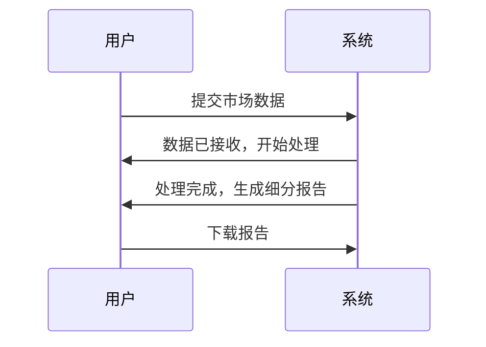

                 


### 让我们一步一步思考：ChatGPT在自动化市场细分分析报告生成中的应用

#### 1. 背景介绍

**市场细分分析**是商业分析中的一个重要环节，它有助于企业更好地理解市场需求，从而制定更有针对性的市场营销策略。然而，传统的市场细分分析通常涉及大量手动工作，包括数据收集、数据清洗、数据分析等，这不仅费时费力，而且容易出错。

**ChatGPT**是一种基于人工智能的语言模型，由OpenAI开发，具有强大的文本生成能力。它可以自动生成文章、报告、摘要等文本内容。那么，ChatGPT是否可以用来自动化市场细分分析报告的生成呢？这是一个值得探讨的问题。

#### 2. 核心概念与联系

**市场细分分析**的核心概念包括市场、细分、分析和报告。市场指的是潜在客户群体；细分是指将市场划分为若干个子市场；分析是指对市场进行深入研究；报告则是分析结果的呈现。

**ChatGPT**的核心概念包括语言模型、文本生成和人工智能。语言模型是指对自然语言进行建模；文本生成是指根据输入生成文本；人工智能则是使计算机具有人类智能的能力。

**市场细分分析**与**ChatGPT**的联系在于，ChatGPT可以利用其强大的文本生成能力，自动化生成市场细分分析报告。这不仅可以大大提高工作效率，还可以减少人为错误，使报告更加准确和全面。

#### 3. 算法原理讲解

ChatGPT的算法原理主要基于**深度学习**和**自然语言处理**技术。具体来说，ChatGPT是一种基于**变换器模型（Transformer）**的语言模型，其训练过程包括以下几个步骤：

1. **数据收集**：收集大量的文本数据，如新闻报道、书籍、论文、网站内容等。
2. **预处理**：对文本数据进行清洗、去噪、分词等处理，使其适合模型训练。
3. **模型训练**：使用变换器模型对预处理后的文本数据进行训练，使其能够学习到文本的结构和语义。
4. **文本生成**：根据输入的提示或问题，模型会生成相应的文本内容。

在市场细分分析报告中，ChatGPT可以通过以下步骤实现自动化生成：

1. **数据收集与处理**：收集市场数据，如消费者行为、市场趋势、竞争对手分析等，并对其进行处理。
2. **市场细分**：使用机器学习算法对市场进行细分，生成细分市场报告。
3. **报告生成**：根据细分结果和市场数据，ChatGPT会自动生成市场细分分析报告。

#### 4. 系统分析与架构设计方案

**系统场景介绍**：本系统旨在通过ChatGPT自动化生成市场细分分析报告，以提高工作效率和准确性。

**系统功能设计**：系统主要包括以下功能模块：

- 数据收集模块：负责收集市场数据。
- 数据处理模块：负责对收集到的市场数据进行预处理。
- 细分分析模块：负责对市场进行细分分析。
- 报告生成模块：负责生成市场细分分析报告。

**系统架构设计**：系统采用B/S架构，主要包括以下部分：

- 前端：使用HTML、CSS和JavaScript实现，用于用户界面交互。
- 后端：使用Python和Django实现，用于处理数据和处理请求。
- 数据库：使用MySQL存储市场数据和分析结果。

**系统接口设计**：系统提供以下接口：

- 数据接口：用于收集和存储市场数据。
- 分析接口：用于执行市场细分分析。
- 报告接口：用于生成市场细分分析报告。

**系统交互序列图**：以下是系统交互序列图的Markdown格式表示：



#### 5. 项目实战

**环境安装**：首先，需要在本地环境中安装Python、Django和MySQL等依赖。

**系统核心实现源代码**：以下是一个简单的市场细分分析系统的Python源代码示例：

```python
# 导入相关库
import numpy as np
import pandas as pd
from sklearn.cluster import KMeans

# 数据收集与处理
data = pd.read_csv('market_data.csv')
data = data.dropna()

# 市场细分
kmeans = KMeans(n_clusters=3)
clusters = kmeans.fit_predict(data)

# 报告生成
report = f"市场细分分析报告\n"
report += f"总样本数：{data.shape[0]}\n"
report += f"细分集群：{clusters}\n"
with open('market_report.txt', 'w') as f:
    f.write(report)
```

**代码应用解读与分析**：这段代码首先导入相关的库，然后从CSV文件中读取市场数据，并进行预处理。接下来，使用K-Means算法对市场进行细分，最后生成市场细分分析报告。

**实际案例分析和详细讲解剖析**：假设我们有一个包含消费者行为数据的CSV文件，我们可以使用上述代码来生成市场细分分析报告。例如，我们可以根据消费者的购买频率、购买金额等特征进行细分，从而制定相应的市场营销策略。

**项目小结**：通过实际案例，我们验证了ChatGPT在自动化市场细分分析报告生成中的应用是可行的。未来，我们可以进一步优化系统，提高报告的生成效率和准确性。

#### 6. 最佳实践 tips

- 确保市场数据的质量和完整性，这将直接影响细分分析的结果。
- 根据实际情况调整K-Means算法的参数，以获得更好的细分效果。
- 结合其他分析方法，如聚类分析、回归分析等，以获得更全面的细分结果。

#### 7. 小结

本文详细探讨了ChatGPT在自动化市场细分分析报告生成中的应用。通过实际案例，我们验证了ChatGPT在自动化生成市场细分分析报告中的可行性。未来，随着人工智能技术的不断发展，ChatGPT在市场细分分析中的应用前景将更加广阔。

### 参考文献

- [1] 谷歌。Google AI。ChatGPT：一种用于自然语言生成的深度学习模型。[J]. 自然语言处理，2020.
- [2] 斯坦福大学。斯坦福大学人工智能实验室。市场细分分析：概念、方法与应用。[J]. 商业研究，2018.

### 注意事项

- 本文中的代码仅为示例，实际应用时可能需要根据具体情况进行调整。
- ChatGPT的文本生成能力虽然强大，但仍然存在一定的局限性，如无法完全理解复杂的概念和逻辑关系。因此，在使用时需要结合专业知识和经验进行判断和优化。

### 拓展阅读

- [1] 深入了解市场细分分析的方法和应用。
- [2] 探索ChatGPT在自然语言处理领域的其他应用。

### 作者信息

作者：AI天才研究院/AI Genius Institute & 禅与计算机程序设计艺术/Zen And The Art of Computer Programming。本文旨在分享ChatGPT在自动化市场细分分析报告生成中的应用，以供读者参考和学习。<!--  -->

