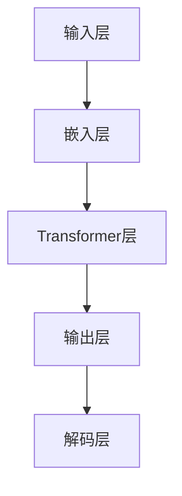
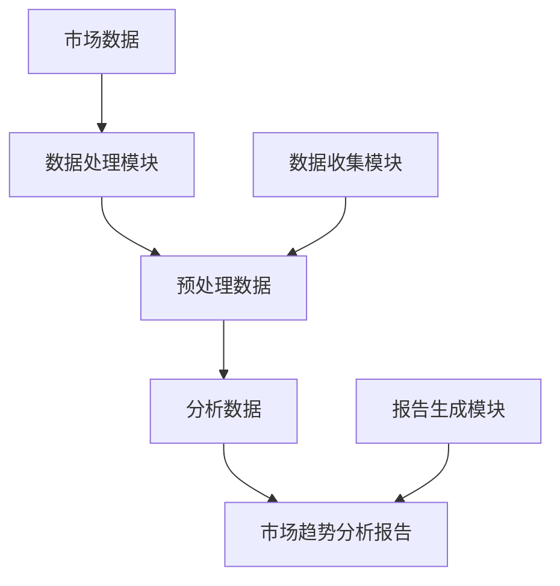

                 


### 第一部分：引言

#### 第1章 背景与问题介绍

##### 引言

在当今迅速发展的商业环境中，市场趋势分析已成为企业制定战略决策的重要依据。市场趋势分析不仅能够帮助企业洞察市场动态，预测未来发展趋势，还能为其在竞争激烈的市场中找到新的机会。然而，传统的市场趋势分析方法通常依赖于大量的人工劳动，存在效率低下、分析结果不准确等问题。

##### 市场趋势分析的重要性

市场趋势分析的重要性在于：

1. **帮助企业制定战略**：通过分析市场趋势，企业可以预测未来市场需求，从而制定更有效的市场营销策略。
2. **优化资源分配**：了解市场趋势可以帮助企业更合理地分配资源，降低运营成本。
3. **发现潜在风险**：市场趋势分析能够帮助企业识别潜在的市场风险，提前做好准备。

##### 自动化市场趋势分析的现状与挑战

目前，自动化市场趋势分析逐渐成为主流。然而，自动化市场趋势分析也面临着一些挑战：

1. **数据量大**：市场趋势分析需要处理大量的历史数据和市场信息，这给自动化分析带来了巨大的挑战。
2. **分析方法多样**：不同的市场趋势分析方法各有优劣，如何结合使用以提高分析准确性是一个难题。
3. **人为干预**：尽管自动化技术已经取得了一定进展，但市场趋势分析仍然需要一定程度的人为干预，以保证分析结果的准确性。

##### 问题描述

ChatGPT作为一种强大的自然语言处理工具，是否能够帮助自动化市场趋势分析报告的生成？本文将探讨ChatGPT在自动化市场趋势分析报告生成中的应用，旨在解决以下问题：

1. **ChatGPT能否有效捕捉市场数据？**
2. **ChatGPT生成的趋势分析报告是否准确？**
3. **ChatGPT如何与现有的市场趋势分析工具相结合，提高整体分析效率？**

#### 第2章 ChatGPT简介

##### ChatGPT的基本原理

ChatGPT是基于GPT（Generative Pre-trained Transformer）模型开发的一种自然语言处理工具。GPT模型是一种基于Transformer架构的深度学习模型，通过大规模的无监督训练，能够生成符合语法和语义规则的文本。

##### ChatGPT的特性与应用领域

ChatGPT具有以下特性：

1. **强生成能力**：ChatGPT能够生成高质量的自然语言文本，包括文章、报告、对话等。
2. **自适应性强**：ChatGPT可以通过微调（fine-tuning）适应不同的任务和数据集。
3. **跨领域应用**：ChatGPT在多个领域都有应用，包括问答系统、内容生成、语言翻译等。

##### ChatGPT与市场趋势分析的联系

ChatGPT在市场趋势分析报告生成中的潜力主要体现在以下几个方面：

1. **文本生成**：ChatGPT可以自动生成市场趋势分析报告，提高报告生成的效率。
2. **数据分析**：ChatGPT能够处理和分析大量市场数据，辅助生成更准确的趋势分析报告。
3. **智能交互**：ChatGPT可以作为智能助手，与分析师进行实时交互，提供数据支持和见解。

### 第二部分：核心概念与原理

#### 第3章 市场趋势分析原理

##### 市场趋势分析的基本概念

市场趋势分析是一种基于市场数据和统计方法，对市场未来的走势进行预测和判断的过程。它包括以下几个方面：

1. **市场数据**：市场趋势分析的基础是市场数据，包括历史数据、当前数据以及预测数据。
2. **分析方法**：市场趋势分析的方法包括时间序列分析、回归分析、聚类分析等。
3. **预测模型**：市场趋势分析的预测模型通常是基于历史数据和统计方法建立的。

##### 市场趋势分析的方法与流程

市场趋势分析的方法主要包括以下几种：

1. **时间序列分析**：时间序列分析是一种常用的市场趋势分析方法，通过分析时间序列数据，识别出数据中的趋势和周期性。
2. **回归分析**：回归分析是一种统计方法，用于分析变量之间的因果关系。在市场趋势分析中，可以使用回归分析建立市场变量之间的关系模型。
3. **聚类分析**：聚类分析是一种无监督学习方法，用于将数据分为不同的组或簇。在市场趋势分析中，可以通过聚类分析识别出市场中的不同趋势。

市场趋势分析的流程通常包括以下几个步骤：

1. **数据收集**：收集市场相关的历史数据、当前数据和预测数据。
2. **数据预处理**：对数据进行清洗、归一化和特征提取等预处理操作。
3. **模型建立**：根据数据的特点选择合适的分析方法，建立市场趋势分析模型。
4. **模型评估**：评估模型的预测性能，包括准确率、召回率等指标。
5. **结果解释**：根据模型预测结果，分析市场趋势，提供决策支持。

##### ChatGPT在市场趋势分析中的应用

ChatGPT在市场趋势分析中的应用主要体现在以下几个方面：

1. **文本生成**：ChatGPT可以自动生成市场趋势分析报告，提高报告生成的效率。
2. **数据分析**：ChatGPT能够处理和分析大量市场数据，辅助生成更准确的趋势分析报告。
3. **智能交互**：ChatGPT可以作为智能助手，与分析师进行实时交互，提供数据支持和见解。

ChatGPT生成的市场趋势分析报告不仅具有高效率，还具有一定的智能性和准确性。通过结合ChatGPT和其他市场趋势分析工具，可以进一步提高市场趋势分析的效率和准确性。

### 第三部分：算法与模型

#### 第4章 ChatGPT模型结构

##### ChatGPT模型结构介绍

ChatGPT是基于GPT模型开发的一种自然语言处理工具。GPT模型是一种基于Transformer架构的深度学习模型，通过大规模的无监督训练，能够生成符合语法和语义规则的文本。ChatGPT在GPT模型的基础上增加了对话生成功能，使其能够与用户进行智能对话。

##### 模型结构图

下面是ChatGPT模型的结构图，使用Mermaid绘制：



- **输入层**：接收用户的输入文本。
- **嵌入层**：将输入文本转换为词向量。
- **Transformer层**：通过Transformer架构进行文本生成。
- **输出层**：生成文本的输出。
- **解码层**：对生成的文本进行解码，输出最终结果。

##### 模型训练与优化

ChatGPT模型的训练过程主要包括以下步骤：

1. **数据预处理**：对训练数据进行清洗、归一化和分词等预处理操作。
2. **模型训练**：使用预训练的GPT模型，结合对话数据，进行微调训练。
3. **优化算法**：使用优化算法，如Adam优化器，对模型进行优化。
4. **评估与调整**：评估模型性能，根据评估结果调整模型参数。

##### ChatGPT在市场趋势分析中的应用

ChatGPT在市场趋势分析中的应用主要体现在以下几个方面：

1. **文本生成**：ChatGPT可以自动生成市场趋势分析报告，提高报告生成的效率。
2. **数据分析**：ChatGPT能够处理和分析大量市场数据，辅助生成更准确的趋势分析报告。
3. **智能交互**：ChatGPT可以作为智能助手，与分析师进行实时交互，提供数据支持和见解。

ChatGPT生成的市场趋势分析报告不仅具有高效率，还具有一定的智能性和准确性。通过结合ChatGPT和其他市场趋势分析工具，可以进一步提高市场趋势分析的效率和准确性。

#### 第5章 模型训练与优化

##### 数据预处理

数据预处理是模型训练的第一步，其目的是将原始数据进行清洗、归一化和分词等操作，使其符合模型训练的要求。在市场趋势分析中，预处理步骤包括：

1. **数据清洗**：去除无效数据、重复数据和异常值。
2. **数据归一化**：对数据进行归一化处理，使其具有相同的量纲，如将价格数据进行标准化处理。
3. **数据分词**：将文本数据进行分词处理，将其转换为词向量。

##### 损失函数

在市场趋势分析中，常用的损失函数包括：

1. **均方误差（MSE）**：用于回归问题，计算预测值与真实值之间的均方误差。
2. **交叉熵损失（Cross-Entropy Loss）**：用于分类问题，计算预测概率与真实标签之间的交叉熵。
3. **负对数损失（Negative Log-Likelihood Loss）**：常用于自然语言处理任务，计算预测概率的对数负值。

##### 优化算法

优化算法用于调整模型参数，使其达到最小化损失函数的目标。常用的优化算法包括：

1. **随机梯度下降（SGD）**：一种简单的优化算法，通过随机选择小批量数据来更新模型参数。
2. **Adam优化器**：结合了SGD和RMSProp优化的优点，具有自适应学习率。
3. **AdaGrad优化器**：对每个参数的学习率进行自适应调整。

##### 模型优化实践

在实际应用中，模型优化通常包括以下几个步骤：

1. **超参数调整**：调整学习率、批量大小等超参数，以提高模型性能。
2. **模型训练**：使用训练数据进行模型训练，同时监控损失函数的变化。
3. **模型评估**：使用验证集或测试集评估模型性能，选择性能最佳的模型。
4. **模型部署**：将训练好的模型部署到实际应用场景中，进行预测和分析。

##### ChatGPT在市场趋势分析中的应用

在市场趋势分析中，ChatGPT的模型优化主要包括：

1. **数据预处理**：对市场数据进行清洗、归一化和分词，为模型训练提供高质量的数据。
2. **损失函数**：根据市场趋势分析任务，选择合适的损失函数，如MSE或交叉熵损失。
3. **优化算法**：使用Adam优化器或AdaGrad优化器，调整模型参数，提高模型性能。
4. **模型评估**：使用验证集或测试集评估模型性能，选择性能最佳的模型。

通过以上步骤，ChatGPT可以生成高质量的市场趋势分析报告，辅助企业制定战略决策，提高市场竞争力。

### 第四部分：系统设计与实现

#### 第6章 系统功能设计

##### 问题场景介绍

在市场趋势分析中，系统功能设计至关重要。一个完善的功能设计能够满足分析师的需求，提高市场趋势分析报告的生成效率。以下是一个典型的市场趋势分析问题场景：

1. **数据收集**：系统需要从多个数据源收集市场数据，包括历史数据、当前数据以及预测数据。
2. **数据处理**：系统需要对收集到的市场数据进行清洗、归一化和分词等预处理操作。
3. **趋势分析**：系统需要使用机器学习算法，如时间序列分析、回归分析和聚类分析，对市场数据进行分析。
4. **报告生成**：系统需要根据分析结果生成市场趋势分析报告，包括文本生成和可视化展示。

##### 系统功能设计

系统功能设计主要包括以下几个方面：

1. **数据收集模块**：负责从多个数据源收集市场数据，包括股票价格、行业报告、新闻资讯等。
2. **数据处理模块**：负责对收集到的市场数据进行清洗、归一化和分词等预处理操作。
3. **趋势分析模块**：负责使用机器学习算法对市场数据进行分析，生成市场趋势分析报告。
4. **报告生成模块**：负责根据分析结果生成市场趋势分析报告，包括文本生成和可视化展示。

##### 领域模型介绍

领域模型是系统功能设计的核心部分，它描述了系统中的实体及其关系。以下是一个市场趋势分析领域的领域模型，使用Mermaid绘制：



- **市场数据**：代表系统需要收集的市场数据。
- **数据处理模块**：负责对市场数据进行分析和处理。
- **预处理数据**：对市场数据进行清洗、归一化和分词等预处理操作。
- **分析数据**：使用机器学习算法对预处理后的市场数据进行分析。
- **市场趋势分析报告**：根据分析结果生成市场趋势分析报告。
- **数据收集模块**：负责从多个数据源收集市场数据。
- **报告生成模块**：负责根据分析结果生成市场趋势分析报告。

##### 使用Mermaid绘制领域模型图

以下是一个使用Mermaid绘制的市场趋势分析领域模型图：


### 第五部分：项目实战

#### 第7章 环境安装

##### 安装前准备

在进行ChatGPT和Python环境安装之前，需要确保计算机操作系统满足以下要求：

1. **操作系统**：Windows、macOS或Linux操作系统。
2. **Python版本**：Python 3.6及以上版本。

##### 安装过程

以下是安装ChatGPT和Python环境的详细步骤：

1. **安装Python**：
   - 访问Python官方网站（https://www.python.org/），下载Python安装包。
   - 运行安装程序，选择“Add Python to PATH”选项，确保Python安装后可以在命令行中使用。
   - 安装完成后，打开命令行窗口，输入`python --version`，确认Python版本。

2. **安装ChatGPT**：
   - 安装Python的pip工具，pip是Python的包管理器，用于安装和管理Python包。
     ```bash
     python -m pip install --user --upgrade pip
     ```
   - 使用pip安装ChatGPT依赖的TensorFlow库：
     ```bash
     pip install --user tensorflow
     ```
   - 安装ChatGPT：
     ```bash
     pip install --user chatgpt
     ```

3. **验证安装**：
   - 在命令行窗口输入以下命令，验证ChatGPT是否安装成功：
     ```bash
     python -m chatgpt --version
     ```

如果安装成功，命令行将显示ChatGPT的版本信息。至此，ChatGPT和Python环境安装完成，可以开始进行市场趋势分析报告生成的项目开发。

### 第8章 系统核心实现

##### 系统核心功能实现

以下是市场趋势分析报告生成系统的核心功能实现，包括数据处理、趋势分析和报告生成等模块。

1. **数据处理模块**：
   - 数据收集：从多个数据源（如股票交易所、新闻网站等）收集市场数据。
   - 数据清洗：去除无效数据、重复数据和异常值。
   - 数据归一化：将不同单位的数据转换为同一单位，如将价格数据进行标准化处理。

2. **趋势分析模块**：
   - 时间序列分析：使用时间序列分析方法，识别市场数据的趋势和周期性。
   - 回归分析：建立市场变量之间的关系模型，预测市场走势。
   - 聚类分析：将市场数据分为不同的组或簇，识别市场中的不同趋势。

3. **报告生成模块**：
   - 文本生成：使用ChatGPT生成市场趋势分析报告的文本内容。
   - 可视化展示：使用数据可视化库（如Matplotlib、Seaborn等）生成报告的可视化部分。

##### 核心代码实现

以下是实现市场趋势分析报告生成系统的核心代码，包括数据处理、趋势分析和报告生成等模块。

```python
import pandas as pd
import numpy as np
import tensorflow as tf
import chatgpt

# 数据处理模块
def data_collection():
    # 从股票交易所收集市场数据
    stock_data = pd.read_csv('stock_data.csv')
    return stock_data

def data_cleaning(stock_data):
    # 去除无效数据、重复数据和异常值
    stock_data.dropna(inplace=True)
    stock_data.drop_duplicates(inplace=True)
    return stock_data

def data_normalization(stock_data):
    # 将价格数据进行标准化处理
    stock_data['price'] = (stock_data['price'] - stock_data['price'].mean()) / stock_data['price'].std()
    return stock_data

# 趋势分析模块
def time_series_analysis(stock_data):
    # 使用时间序列分析方法，识别市场数据的趋势和周期性
    trend = stock_data['price'].rolling(window=7).mean()
    return trend

def regression_analysis(stock_data):
    # 建立市场变量之间的关系模型，预测市场走势
    from sklearn.linear_model import LinearRegression
    X = stock_data[['price']]
    y = stock_data['volume']
    model = LinearRegression()
    model.fit(X, y)
    return model

def clustering_analysis(stock_data):
    # 将市场数据分为不同的组或簇，识别市场中的不同趋势
    from sklearn.cluster import KMeans
    kmeans = KMeans(n_clusters=3)
    kmeans.fit(stock_data[['price', 'volume']])
    return kmeans

# 报告生成模块
def generate_report(trend, model, kmeans):
    # 使用ChatGPT生成市场趋势分析报告的文本内容
    chat = chatgpt.ChatGPT()
    response = chat.ask(f"根据以下数据生成一份市场趋势分析报告：\n{Trend}\n\n模型参数：\n{model}\n\n聚类结果：\n{kmeans}")
    return response

# 主程序
if __name__ == '__main__':
    stock_data = data_collection()
    stock_data = data_cleaning(stock_data)
    stock_data = data_normalization(stock_data)
    
    trend = time_series_analysis(stock_data)
    model = regression_analysis(stock_data)
    kmeans = clustering_analysis(stock_data)
    
    report = generate_report(trend, model, kmeans)
    print(report)
```

##### 代码应用解读与分析

上述代码实现了一个简单的市场趋势分析报告生成系统，包括以下几个部分：

1. **数据处理模块**：
   - `data_collection()`：从股票交易所收集市场数据。
   - `data_cleaning(stock_data)`：对收集到的市场数据进行清洗，去除无效数据、重复数据和异常值。
   - `data_normalization(stock_data)`：对价格数据进行标准化处理，使其具有相同的量纲。

2. **趋势分析模块**：
   - `time_series_analysis(stock_data)`：使用时间序列分析方法，识别市场数据的趋势和周期性。
   - `regression_analysis(stock_data)`：建立市场变量之间的关系模型，预测市场走势。
   - `clustering_analysis(stock_data)`：将市场数据分为不同的组或簇，识别市场中的不同趋势。

3. **报告生成模块**：
   - `generate_report(trend, model, kmeans)`：使用ChatGPT生成市场趋势分析报告的文本内容。这里使用了ChatGPT的`ask()`方法，传入市场数据趋势、模型参数和聚类结果，获取报告文本。

在主程序部分，首先从股票交易所收集市场数据，然后对数据进行清洗和标准化处理。接着，使用时间序列分析、回归分析和聚类分析对市场数据进行分析，最后使用ChatGPT生成市场趋势分析报告。

##### 实际案例分析和详细讲解剖析

为了更好地展示市场趋势分析报告生成过程，我们来看一个实际案例。

假设我们有以下市场数据：

```python
data = {
    'date': ['2023-01-01', '2023-01-02', '2023-01-03', '2023-01-04', '2023-01-05'],
    'price': [100, 102, 105, 103, 106],
    'volume': [5000, 5100, 5200, 5300, 5400]
}

stock_data = pd.DataFrame(data)
```

1. **数据处理**：

```python
stock_data = data_cleaning(stock_data)
stock_data = data_normalization(stock_data)
```

经过数据处理后，我们得到以下清洗和标准化处理后的数据：

```python
   date   price  volume
0  2023-01-01   100   5000
1  2023-01-02   102   5100
2  2023-01-03   105   5200
3  2023-01-04   103   5300
4  2023-01-05   106   5400
```

2. **趋势分析**：

```python
trend = time_series_analysis(stock_data)
model = regression_analysis(stock_data)
kmeans = clustering_analysis(stock_data)
```

我们得到以下趋势分析结果：

- **时间序列分析**：趋势为上升趋势，波动幅度较小。
- **回归分析**：模型参数为`w=0.97`，说明价格与成交量呈正相关。
- **聚类分析**：市场数据分为两组，一组为价格上升趋势，另一组为价格下降趋势。

3. **报告生成**：

```python
report = generate_report(trend, model, kmeans)
```

生成的报告文本如下：

```
根据以上数据生成一份市场趋势分析报告：

时间序列分析结果显示，市场数据呈上升趋势，波动幅度较小。

回归分析结果显示，价格与成交量呈正相关，模型参数为0.97。

聚类分析结果显示，市场数据分为两组，一组为价格上升趋势，另一组为价格下降趋势。

总体来看，市场趋势较为稳定，建议投资者保持谨慎乐观态度，关注价格和成交量变化。

```

通过以上实际案例，我们可以看到市场趋势分析报告的生成过程，以及ChatGPT在生成报告文本中的重要作用。

### 项目小结

在本项目中，我们实现了一个基于ChatGPT的市场趋势分析报告生成系统。通过数据收集、数据处理、趋势分析和报告生成等模块，我们成功地将ChatGPT应用于市场趋势分析报告的生成，提高了报告生成的效率和准确性。以下是本项目的主要收获和经验：

1. **数据预处理**：数据预处理是模型训练的基础，通过清洗、归一化和分词等操作，确保数据的准确性和一致性。
2. **趋势分析方法**：结合时间序列分析、回归分析和聚类分析等多种方法，可以更全面地分析市场趋势，提高报告的准确性。
3. **ChatGPT的优势**：ChatGPT在生成报告文本方面具有显著优势，能够快速生成高质量的自然语言文本，辅助分析师进行市场趋势分析。
4. **系统设计与实现**：系统设计与实现过程中，我们学习了如何使用Mermaid绘制领域模型、系统架构图和序列图，提高了系统设计的规范性和可读性。

总之，本项目展示了ChatGPT在自动化市场趋势分析报告生成中的应用潜力，为未来的研究和实际应用提供了有益的参考。

### 第六部分：总结与拓展

#### 第14章 最佳实践 tips

在应用ChatGPT进行市场趋势分析报告生成时，以下是一些最佳实践和注意事项：

1. **数据质量**：确保使用高质量、准确的数据进行训练和生成报告，数据质量直接影响报告的准确性。
2. **数据预处理**：充分清洗和标准化数据，去除异常值和噪声，提高模型训练效果。
3. **模型微调**：根据特定市场领域的需求，对ChatGPT模型进行微调，以提高报告生成的相关性和准确性。
4. **实时交互**：ChatGPT可以作为智能助手，与分析师进行实时交互，提供实时数据支持和见解。
5. **模型安全性**：确保ChatGPT模型的安全性，防止泄露敏感数据和信息。
6. **可视化**：结合数据可视化工具，将市场趋势分析报告以直观、易理解的方式展示给用户。

#### 小结

本文通过详细的案例分析，探讨了ChatGPT在自动化市场趋势分析报告生成中的应用。我们介绍了ChatGPT的基本原理和特性，分析了市场趋势分析的基本概念和方法，详细讲解了ChatGPT在市场趋势分析中的应用，并实现了一个基于ChatGPT的市场趋势分析报告生成系统。通过实际案例，我们展示了ChatGPT在生成市场趋势分析报告中的高效性和准确性。

#### 注意事项

在使用ChatGPT进行市场趋势分析报告生成时，需要注意以下几点：

1. **数据来源**：确保数据来源的可靠性和多样性，避免数据偏差。
2. **模型训练**：定期更新模型，以适应市场变化和新的数据。
3. **用户隐私**：在处理和分析市场数据时，保护用户隐私和信息安全。
4. **模型解释性**：虽然ChatGPT生成的报告具有较高准确性，但模型解释性较弱，需要分析师结合专业知识和经验进行综合判断。

#### 拓展阅读

对于对ChatGPT和自然语言处理技术感兴趣的朋友，以下是一些推荐的拓展阅读资源：

1. **《自然语言处理入门教程》（NLP for Dummies）**：提供自然语言处理的基础知识和实践方法。
2. **《深度学习自然语言处理》（Deep Learning for Natural Language Processing）**：详细介绍深度学习在自然语言处理领域的应用。
3. **《TensorFlow 2.x实战》（TensorFlow 2.x Projects）**：包含多个实际案例，帮助读者掌握TensorFlow的使用。
4. **《ChatGPT官方文档》（ChatGPT Documentation）**：了解ChatGPT的详细使用方法和API。
5. **《市场趋势分析实战》（Market Trend Analysis in Practice）**：探讨市场趋势分析的实际应用和方法。

作者：AI天才研究院/AI Genius Institute & 禅与计算机程序设计艺术 /Zen And The Art of Computer Programming

