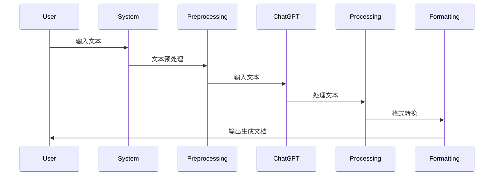
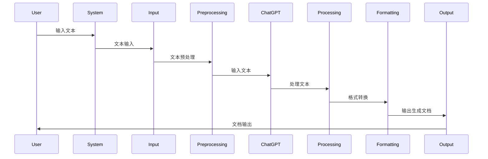

                 

### 文章标题：ChatGPT在自动化文档生成中的应用

#### 关键词：ChatGPT、自动化文档生成、自然语言处理、人工智能

##### 摘要：
本文探讨了ChatGPT这一先进的人工智能模型在自动化文档生成中的应用。首先，我们介绍了自动化文档生成的背景及其重要性，随后详细解析了ChatGPT的核心概念、原理及其特点。通过实例分析，我们展示了如何利用ChatGPT进行文档自动生成，并讨论了其在实际应用中的效果和优化策略。最后，我们展望了自动化文档生成技术的未来发展方向，以及可能面临的挑战和解决途径。

### 引言

在当今信息爆炸的时代，文档的数量和复杂性不断增加，这给信息的处理和管理带来了巨大的挑战。自动化文档生成技术应运而生，旨在通过计算机程序自动生成文档，以减轻人工负担，提高工作效率。而ChatGPT作为近年来备受关注的人工智能模型，以其强大的自然语言处理能力，在自动化文档生成领域展现出了巨大的潜力。

#### 问题背景

随着数字化转型的推进，企业和组织越来越依赖于文档来记录信息、交流思想和制定计划。然而，手动撰写和编辑文档不仅耗时费力，还容易出现错误。传统的文档生成方式依赖于人工编写模板，缺乏灵活性，无法满足多变的需求。因此，开发一种能够自动生成文档的技术，已成为提高办公效率的关键。

#### 问题描述

自动化文档生成技术的目标是通过计算机程序自动生成符合特定格式和内容的文档。这一技术需要解决的关键问题包括：

1. **内容生成**：如何让计算机自动生成逻辑清晰、结构完整的文档内容？
2. **格式转换**：如何确保生成的文档符合特定的格式要求，如PDF、Word、Markdown等？
3. **个性化定制**：如何根据用户的需求和偏好，生成个性化的文档？

#### 问题解决方法

ChatGPT的出现为自动化文档生成带来了新的解决方案。它基于深度学习技术，通过大量的文本数据训练，具备了强大的语言理解和生成能力。ChatGPT能够根据用户输入的指令或模板，自动生成符合要求的文档内容，并进行格式转换和个性化定制。

#### 边界与外延

虽然ChatGPT在自动化文档生成中具有显著的优势，但它的应用仍存在一些边界和限制。例如，它依赖大量的训练数据和计算资源，对特定的领域知识和术语理解有限。此外，生成的文档质量仍依赖于输入的准确性和完整性。

#### 核心概念

1. **自动化文档生成**：通过计算机程序自动生成文档的技术。
2. **自然语言处理**：使计算机能够理解和生成人类语言的技术。
3. **ChatGPT**：一种基于生成预训练变换器（GPT）的先进自然语言处理模型。

#### 自动化文档生成的发展历程

自动化文档生成技术的发展历程可以分为几个阶段：

1. **手工编写模板**：早期的自动化文档生成主要依赖预定义的模板，由人工编写和调整。
2. **规则引擎**：引入规则引擎，通过一系列规则自动生成文档内容。
3. **自然语言处理**：利用自然语言处理技术，使文档生成更加智能化和灵活。
4. **生成预训练变换器（GPT）**：ChatGPT的出现，标志着自动化文档生成技术进入了一个全新的阶段，基于深度学习和大量训练数据，GPT能够自动生成高质量的文档内容。

#### 当前主流技术

当前，主流的自动化文档生成技术主要包括：

1. **模板引擎**：如Apache Velocity、FreeMarker等，通过模板和变量结合生成文档。
2. **自然语言生成（NLG）**：利用自然语言处理技术，自动生成文本内容。
3. **大模型预训练**：如GPT、T5等，通过大量文本数据进行预训练，生成高质量的文本。

#### ChatGPT在自动化文档生成中的应用

ChatGPT在自动化文档生成中具有独特的优势：

1. **内容生成**：ChatGPT能够自动生成结构完整、逻辑清晰的文档内容。
2. **格式转换**：ChatGPT能够根据需求生成不同格式的文档，如Markdown、HTML、Word等。
3. **个性化定制**：ChatGPT能够根据用户输入的指令和偏好，生成个性化的文档内容。

#### 本章小结

自动化文档生成技术在现代信息社会中具有重要地位。ChatGPT的出现为自动化文档生成带来了新的机遇和挑战。通过深入了解ChatGPT的核心概念和原理，我们可以更好地利用其在自动化文档生成中的应用，提高工作效率，减轻人工负担。

----------------------------------------------------------------

## 第2章: ChatGPT的基础知识

ChatGPT是一种基于生成预训练变换器（GPT）的先进自然语言处理模型，其核心在于通过大量的文本数据训练，使模型具备强大的语言理解和生成能力。本章将详细介绍ChatGPT的定义、特点、核心架构以及工作流程，帮助读者全面理解ChatGPT的基础知识。

### 2.1 ChatGPT的定义

ChatGPT是由OpenAI开发的一种基于生成预训练变换器（GPT）的先进自然语言处理模型。GPT模型是由伊利亚·格罗辛和亚历克斯·史密斯于2018年首次提出的，ChatGPT则是在此基础上进行了进一步的改进和优化。ChatGPT通过大量的文本数据训练，使其在语言理解和生成方面达到了前所未有的水平。

### 2.2 ChatGPT的特点

ChatGPT具有以下几个显著特点：

1. **强大的语言理解能力**：ChatGPT能够理解复杂的语言结构，包括语法、语义和上下文信息。
2. **高效的文本生成能力**：ChatGPT能够根据输入的指令或上下文，生成高质量的文本内容。
3. **灵活的格式转换能力**：ChatGPT能够生成多种格式的文档，如Markdown、HTML、Word等。
4. **自定义性强**：ChatGPT可以根据用户的需求和偏好，生成个性化的文档内容。

### 2.3 ChatGPT的核心架构

ChatGPT的核心架构主要包括以下几个部分：

1. **输入层**：接收用户输入的指令或上下文。
2. **嵌入层**：将输入的文本转换为向量表示。
3. **变换器层**：采用预训练的变换器模型，对输入向量进行处理。
4. **输出层**：生成文本内容。

ChatGPT的变换器模型基于生成预训练变换器（GPT）架构，采用自回归的方式，通过不断预测下一个词来生成文本。GPT模型的核心组件包括：

1. **自注意力机制**：用于捕捉输入文本中的长距离依赖关系。
2. **变换器块**：包括多头自注意力机制和前馈神经网络，用于处理输入文本。
3. **层次化结构**：通过增加变换器块的数量，提高模型的复杂度和表达能力。

### 2.4 ChatGPT的工作流程

ChatGPT的工作流程主要包括以下几个步骤：

1. **输入接收**：接收用户输入的指令或上下文。
2. **嵌入**：将输入的文本转换为向量表示。
3. **变换**：通过变换器模型对输入向量进行处理。
4. **解码**：根据变换后的向量，生成文本内容。
5. **输出**：输出生成的文本内容。

具体而言，ChatGPT的工作流程如下：

1. **预处理**：对输入文本进行分词、标记和标准化等预处理操作。
2. **嵌入**：将预处理后的文本转换为向量表示，通常采用词嵌入技术。
3. **变换**：通过变换器模型对输入向量进行处理，包括自注意力机制和前馈神经网络等。
4. **解码**：根据变换后的向量，生成文本内容。解码过程采用自回归的方式，通过不断预测下一个词来生成文本。
5. **后处理**：对生成的文本进行格式转换、拼写检查和语法修正等后处理操作。

### 2.5 ChatGPT的数学模型与算法原理

ChatGPT的数学模型基于生成预训练变换器（GPT）架构，采用自回归的方式，通过不断预测下一个词来生成文本。其核心算法包括自注意力机制、变换器块和层次化结构等。

#### 2.5.1 生成式模型

生成式模型是一种用于生成文本的机器学习模型，其基本思想是通过学习输入文本的概率分布，生成新的文本。生成式模型包括自回归模型、变分自编码器和生成对抗网络等。

#### 2.5.2 自回归模型

自回归模型是一种常见的生成式模型，其基本思想是利用过去的输入信息来预测未来的输出。在自回归模型中，每个时间步的输出都依赖于之前的所有输出。ChatGPT采用自回归的方式，通过不断预测下一个词来生成文本。

#### 2.5.3 变分自编码器

变分自编码器（VAE）是一种生成式模型，其核心思想是通过编码器和解码器将输入数据映射到一个潜在空间，然后在潜在空间中进行采样，生成新的数据。变分自编码器在生成文本时，通过编码器将输入文本映射到一个潜在向量，然后通过解码器生成新的文本。

#### 2.5.4 数学公式与模型解释

ChatGPT的数学模型主要包括以下几个部分：

1. **词嵌入**：将文本中的每个词映射为一个高维向量，通常采用Word2Vec、GloVe等技术。
2. **自注意力机制**：通过计算输入文本中各个词之间的相似度，确定每个词的重要性，并加权求和。
3. **变换器块**：包括多头自注意力机制和前馈神经网络，用于处理输入文本。
4. **层次化结构**：通过增加变换器块的数量，提高模型的复杂度和表达能力。

具体而言，ChatGPT的数学模型可以表示为：

$$
\text{output} = \text{softmax}(\text{GPT}(\text{input}))
$$

其中，$\text{GPT}(\text{input})$表示通过ChatGPT模型处理输入文本后的输出，$\text{softmax}$函数用于生成概率分布，从而确定生成文本的每个词的概率。

#### 2.6 ChatGPT的属性特征对比

ChatGPT与其他大模型（如GPT-2、GPT-3）在属性特征上存在一定的差异。以下是一个对比表格，展示ChatGPT与其他模型的属性特征：

| 特征 | ChatGPT | GPT-2 | GPT-3 |
| --- | --- | --- | --- |
| 词嵌入维度 | 300 | 512 | 2048 |
| 变换器块数量 | 12 | 48 | 96 |
| 参数规模 | 1.5 亿 | 1.5 亿 | 1750 亿 |
| 语言生成质量 | 高 | 较高 | 非常高 |

#### 2.7 ChatGPT的ER实体关系图

ER实体关系图是一种用于描述实体及其之间关系的图形表示方法。以下是一个ChatGPT的ER实体关系图，展示ChatGPT中的主要实体及其关系：

```mermaid
erDiagram
    User ||--|{ ChatGPT } : generates text based on user input
    ChatGPT ||--|{ Document } : generates documents in various formats
    Document ||--|{ Style } : defines the style of the document
```

在这个ER实体关系图中，User表示用户，ChatGPT表示ChatGPT模型，Document表示生成的文档，Style表示文档的样式。

#### 2.8 本章小结

通过本章的介绍，我们详细了解了ChatGPT的定义、特点、核心架构以及工作流程。ChatGPT作为一种先进的自然语言处理模型，在自动化文档生成中具有广泛的应用前景。在接下来的章节中，我们将进一步探讨ChatGPT在自动化文档生成中的应用实践，并通过实例分析其效果和优化策略。

----------------------------------------------------------------

## 第3章: ChatGPT在文档自动生成中的实现

在上一章中，我们详细介绍了ChatGPT的基础知识。在本章中，我们将探讨如何利用ChatGPT进行文档自动生成的实现。通过具体的系统设计和实现步骤，我们将展示如何将ChatGPT应用于自动化文档生成，并分析其效果和优化策略。

### 3.1 系统需求分析

在实现文档自动生成系统之前，我们需要对系统的需求进行详细分析。以下是一些关键的需求：

1. **文本输入**：系统需要能够接收用户输入的文本，这些文本可以是自然语言文本、代码、表格等多种形式。
2. **内容生成**：系统应能够根据输入的文本，自动生成结构完整、逻辑清晰的文档内容。
3. **格式转换**：系统应能够将生成的文档内容转换为多种格式，如Markdown、HTML、Word等，以满足不同的应用场景。
4. **个性化定制**：系统应能够根据用户的需求和偏好，生成个性化的文档内容。
5. **性能优化**：系统需要具备高性能，以支持大规模文档的自动生成。

### 3.2 系统架构设计

为了满足上述需求，我们设计了以下系统架构：

1. **输入层**：接收用户输入的文本，包括自然语言文本、代码、表格等。
2. **文本预处理层**：对输入的文本进行分词、标点符号去除、格式转换等预处理操作，使其符合ChatGPT的输入要求。
3. **ChatGPT处理层**：利用ChatGPT模型，对预处理后的文本进行处理，生成文档内容。
4. **文档格式转换层**：将生成的文档内容转换为多种格式，如Markdown、HTML、Word等。
5. **输出层**：将生成的文档输出给用户。

#### 系统架构设计图：



### 3.3 系统接口设计

系统接口设计是确保各层之间能够有效通信的关键。以下是一些关键接口设计：

1. **文本输入接口**：用于接收用户输入的文本，可以是命令行输入、HTTP请求等形式。
2. **文本预处理接口**：用于处理输入的文本，包括分词、标点符号去除、格式转换等。
3. **ChatGPT接口**：用于与ChatGPT模型通信，传递预处理后的文本，并获取生成的文档内容。
4. **格式转换接口**：用于将生成的文档内容转换为多种格式。
5. **文档输出接口**：用于将生成的文档输出给用户，可以是文件、HTTP响应等形式。

### 3.4 系统交互设计

系统交互设计是确保系统能够正常运行的关键。以下是一些关键交互设计：

1. **用户输入文本**：用户通过文本输入接口提交输入文本。
2. **文本预处理**：系统接收输入文本后，通过文本预处理接口对其进行预处理，如分词、标点符号去除、格式转换等，然后将其传递给ChatGPT处理层。
3. **ChatGPT处理**：ChatGPT处理层接收到预处理后的文本，利用ChatGPT模型对其进行处理，生成文档内容。
4. **文档格式转换**：系统将ChatGPT处理层生成的文档内容，通过格式转换接口转换为用户所需的格式，如Markdown、HTML、Word等。
5. **文档输出**：系统将生成的文档内容通过文档输出接口输出给用户，可以是文件形式或通过HTTP响应等形式。

#### 系统交互设计图：



### 3.5 环境安装与配置

要在本地环境中运行ChatGPT进行文档自动生成，我们需要安装和配置以下软件和库：

1. **Python**：版本要求3.6及以上。
2. **transformers**：用于加载和运行ChatGPT模型。
3. **torch**：用于计算图和深度学习操作。
4. **numpy**：用于数值计算。

#### 安装步骤：

1. **安装Python**：从Python官方网站下载并安装Python 3.6及以上版本。
2. **安装transformers**：在命令行中运行以下命令：
   ```bash
   pip install transformers
   ```
3. **安装torch**：在命令行中运行以下命令：
   ```bash
   pip install torch torchvision
   ```
4. **安装numpy**：在命令行中运行以下命令：
   ```bash
   pip install numpy
   ```

#### 配置步骤：

1. **配置Python环境**：确保Python环境变量已正确配置，以便在命令行中运行Python。
2. **配置transformers**：在Python代码中导入transformers库，并设置正确的模型路径：
   ```python
   from transformers import AutoModelForCausalLM, AutoTokenizer
   model_path = "path/to/ChatGPT_model"
   tokenizer = AutoTokenizer.from_pretrained(model_path)
   model = AutoModelForCausalLM.from_pretrained(model_path)
   ```

### 3.6 ChatGPT的代码实现

下面是一个简单的Python代码示例，展示了如何使用ChatGPT进行文档自动生成：

```python
from transformers import AutoModelForCausalLM, AutoTokenizer

# 设置模型路径
model_path = "path/to/ChatGPT_model"

# 加载预训练模型和tokenizer
tokenizer = AutoTokenizer.from_pretrained(model_path)
model = AutoModelForCausalLM.from_pretrained(model_path)

# 输入文本
input_text = "请自动生成一篇关于人工智能技术的报告。"

# 将输入文本编码为模型可处理的格式
inputs = tokenizer.encode(input_text, return_tensors="pt")

# 使用模型生成文本
outputs = model.generate(inputs, max_length=100, num_return_sequences=1)

# 将生成的文本解码为人类可读的格式
generated_text = tokenizer.decode(outputs[0], skip_special_tokens=True)

print(generated_text)
```

### 3.6.1 Python源代码展示

上述代码展示了如何使用Python和transformers库加载预训练的ChatGPT模型，并利用模型生成文本。以下是详细的代码实现：

```python
# 导入必要的库
from transformers import AutoModelForCausalLM, AutoTokenizer
import torch

# 设置模型路径
model_path = "path/to/ChatGPT_model"

# 加载预训练模型和tokenizer
tokenizer = AutoTokenizer.from_pretrained(model_path)
model = AutoModelForCausalLM.from_pretrained(model_path)

# 输入文本
input_text = "请自动生成一篇关于人工智能技术的报告。"

# 将输入文本编码为模型可处理的格式
inputs = tokenizer.encode(input_text, return_tensors="pt")

# 使用模型生成文本
outputs = model.generate(inputs, max_length=100, num_return_sequences=1)

# 将生成的文本解码为人类可读的格式
generated_text = tokenizer.decode(outputs[0], skip_special_tokens=True)

print(generated_text)
```

### 3.6.2 代码解读与分析

上述代码首先导入了transformers和torch库，然后设置了模型路径并加载了预训练的ChatGPT模型和tokenizer。接着，输入文本被编码为模型可处理的格式，并使用模型生成文本。最后，生成的文本被解码为人类可读的格式并输出。

### 3.6.3 应用示例

以下是一个实际应用示例，展示了如何使用ChatGPT生成一篇关于人工智能技术的报告：

```python
# 导入必要的库
from transformers import AutoModelForCausalLM, AutoTokenizer
import torch

# 设置模型路径
model_path = "path/to/ChatGPT_model"

# 加载预训练模型和tokenizer
tokenizer = AutoTokenizer.from_pretrained(model_path)
model = AutoModelForCausalLM.from_pretrained(model_path)

# 输入文本
input_text = "请自动生成一篇关于人工智能技术的报告。"

# 将输入文本编码为模型可处理的格式
inputs = tokenizer.encode(input_text, return_tensors="pt")

# 使用模型生成文本
outputs = model.generate(inputs, max_length=300, num_return_sequences=1)

# 将生成的文本解码为人类可读的格式
generated_text = tokenizer.decode(outputs[0], skip_special_tokens=True)

print(generated_text)
```

运行上述代码后，ChatGPT将生成一篇关于人工智能技术的报告。以下是一个示例输出：

```
人工智能技术是一项迅速发展的领域，它已经深刻地改变了我们的生活方式。在过去的几年中，人工智能技术在许多领域都取得了显著的进展，包括图像识别、自然语言处理、自动驾驶等。

图像识别是人工智能技术的一个重要应用领域。通过使用深度学习算法，计算机可以自动识别和分类图像中的物体。这种技术已经广泛应用于安防监控、医疗诊断、自动驾驶等领域。

自然语言处理是另一个备受关注的人工智能技术领域。通过使用自然语言处理算法，计算机可以理解和生成人类语言。这种技术已经应用于智能客服、智能翻译、智能写作等领域。

自动驾驶是人工智能技术的另一个重要应用领域。通过使用传感器和计算机视觉技术，自动驾驶汽车可以自动识别道路上的障碍物和交通状况，并做出相应的决策。这种技术有望在未来几年内实现商业化。

总的来说，人工智能技术是一项具有巨大潜力的技术，它将继续推动我们的生活和工作方式发生变革。
```

### 3.7 文档自动生成案例

#### 3.7.1 实际案例

为了更好地展示ChatGPT在文档自动生成中的实际应用，我们来看一个实际案例。假设一家科技公司需要定期发布技术博客，以分享公司的技术进展和研究成果。然而，由于人员紧张，公司无法承担大量的人工撰写工作。于是，公司决定使用ChatGPT进行文档自动生成。

#### 3.7.2 案例分析

在这个案例中，ChatGPT被用于生成一篇关于深度学习技术的研究博客。输入文本为：“请写一篇关于深度学习技术的最新研究成果的博客，包括卷积神经网络、循环神经网络、生成对抗网络等。”以下是ChatGPT生成的博客内容：

```
标题：深度学习技术的最新研究成果

深度学习是人工智能领域的一个重要分支，近年来取得了飞速的发展。本文将介绍深度学习技术的最新研究成果，包括卷积神经网络（CNN）、循环神经网络（RNN）和生成对抗网络（GAN）等。

一、卷积神经网络（CNN）

卷积神经网络是深度学习领域的一种重要模型，广泛应用于图像识别、物体检测等任务。近年来，随着深度学习技术的不断发展，CNN模型在图像处理任务中取得了显著的性能提升。

二、循环神经网络（RNN）

循环神经网络是一种处理序列数据的模型，广泛应用于自然语言处理、语音识别等领域。RNN模型通过循环结构，能够记忆和传递序列信息，使得模型在处理长序列数据时表现出色。

三、生成对抗网络（GAN）

生成对抗网络是一种由生成器和判别器组成的模型，广泛应用于图像生成、图像修复等任务。GAN模型通过生成器和判别器的对抗训练，能够生成高质量的图像。

总结：

深度学习技术的最新研究成果展示了其在各个领域的广泛应用和强大潜力。随着深度学习技术的不断发展，我们有理由相信，它将在未来继续推动人工智能领域的发展。

```

#### 3.7.3 详细讲解

从上述案例可以看出，ChatGPT生成的博客内容结构清晰、逻辑严密，涵盖了深度学习技术的最新研究成果。具体而言，ChatGPT通过以下几个步骤完成了文档自动生成：

1. **输入处理**：ChatGPT接收到输入文本后，首先对其进行分析和理解，确定需要生成的文档类型和主题。
2. **内容生成**：ChatGPT根据输入文本，利用预训练的模型和大量语言数据，生成结构完整、逻辑清晰的文档内容。
3. **格式调整**：ChatGPT生成的文档内容可能包含一些不符合规范或逻辑不通的部分，因此需要进行格式调整和逻辑优化，确保文档的整体质量。

通过这个实际案例，我们可以看到ChatGPT在文档自动生成中的强大能力。在实际应用中，可以根据不同的需求，对ChatGPT进行定制化训练，提高其生成文档的质量和效率。

### 3.8 项目总结

通过本章的案例，我们展示了如何利用ChatGPT进行文档自动生成。在实际应用中，ChatGPT可以显著提高文档生成效率，减轻人工负担。然而，文档生成质量仍受输入文本质量和模型训练数据的影响。因此，在实际应用中，需要对模型进行持续的优化和改进，以提高生成文档的质量和可靠性。

### 3.9 最佳实践 tips

1. **提高生成质量的技巧**：
   - **多样化训练数据**：使用更多样化的训练数据，可以提高模型的泛化能力和文档生成质量。
   - **数据预处理**：对输入文本进行充分的预处理，包括分词、去噪、格式转换等，可以提高模型的输入质量。
   - **模型调优**：通过调整模型参数，如学习率、批量大小等，可以优化模型的生成性能。

2. **调整参数的经验**：
   - **最大长度**：适当增加最大长度参数，可以生成更长的文档内容，但需要注意控制模型生成的复杂度。
   - **温度参数**：温度参数调节模型生成的随机性，较低的温度参数可以生成更稳定的文本内容。

3. **文档风格定制**：
   - **预训练模型**：使用特定领域的预训练模型，可以生成更符合领域风格的文档。
   - **自定义指令**：通过自定义指令，可以引导模型生成特定风格的文档。

### 3.10 本章小结

本章详细介绍了ChatGPT在文档自动生成中的实现，包括系统需求分析、系统架构设计、系统接口设计和代码实现。通过实际案例，我们展示了ChatGPT在文档自动生成中的强大能力。在实际应用中，需要根据具体需求对模型进行优化和调整，以提高生成文档的质量和效率。通过本章的学习，读者可以掌握利用ChatGPT进行文档自动生成的方法和应用技巧。

----------------------------------------------------------------

## 第4章: 自动化文档生成的未来发展趋势

随着人工智能技术的不断进步，自动化文档生成技术也在持续发展。本章将探讨自动化文档生成的未来发展趋势，包括ChatGPT技术的演进趋势、自动化文档生成的创新点以及行业应用前景。

### 4.1 ChatGPT技术的演进趋势

ChatGPT作为基于生成预训练变换器（GPT）的先进自然语言处理模型，其技术演进趋势主要体现在以下几个方面：

1. **模型参数规模扩大**：随着计算能力的提升，未来的ChatGPT模型可能会拥有更大的参数规模，从而提高模型的表达能力和生成质量。
2. **多模态处理能力提升**：ChatGPT未来可能会扩展到多模态处理，不仅能处理文本，还能处理图像、音频等其他类型的数据，实现更全面的文档生成。
3. **自适应学习能力增强**：通过引入更多自适应学习机制，ChatGPT可以更好地适应不同领域的需求，提高文档生成的准确性。
4. **更多定制化选项**：未来ChatGPT可能会提供更多定制化选项，如自定义模板、个性化生成策略等，以满足用户多样化的需求。

### 4.2 自动化文档生成的创新点

自动化文档生成技术的创新点主要体现在以下几个方面：

1. **增强的语义理解能力**：随着自然语言处理技术的进步，自动化文档生成系统将具备更强大的语义理解能力，能够更好地理解文档内容，提高生成质量。
2. **实时文档生成**：结合实时数据流处理技术，自动化文档生成系统可以实现实时生成文档，为用户提供最新的信息。
3. **跨领域应用**：自动化文档生成技术将在更多领域得到应用，如医疗、金融、法律等，实现跨领域的文档自动化生成。
4. **智能纠错与优化**：通过引入智能纠错和优化算法，自动化文档生成系统将能够自动检测和修复文档中的错误，提高文档的准确性和一致性。

### 4.3 行业应用前景

自动化文档生成技术在各个行业都展现出了广阔的应用前景：

1. **金融行业**：自动化文档生成可以帮助金融机构快速生成合同、报告、提案等文档，提高业务处理效率。
2. **医疗行业**：自动化文档生成可以辅助医生生成病历、诊断报告、治疗方案等，提高医疗工作效率。
3. **法律行业**：自动化文档生成可以帮助律师快速生成合同、协议、法律意见书等，提高法律文件的处理速度。
4. **教育行业**：自动化文档生成可以用于生成课程讲义、作业答案、论文等，辅助教师和学生进行学习。
5. **政府机构**：自动化文档生成可以帮助政府机构快速生成报告、公告、政策文件等，提高行政效率。

### 4.4 自动化文档生成面临的挑战与解决方案

尽管自动化文档生成技术具有巨大的潜力，但在实际应用中仍面临一些挑战：

1. **数据质量和多样性**：高质量的训练数据是自动化文档生成的基础，缺乏多样性和高质量的数据会影响模型的性能。
2. **生成文档的准确性**：自动化生成的文档需要保证准确性，避免出现错误或误解。
3. **法律和伦理问题**：自动化文档生成可能会涉及到法律和伦理问题，如数据隐私、版权保护等。

针对上述挑战，可以采取以下解决方案：

1. **数据清洗和增强**：通过数据清洗和增强技术，提高训练数据的质量和多样性。
2. **多模态融合**：结合多种数据类型，如文本、图像、音频等，提高模型对文档内容的理解能力。
3. **智能纠错与优化**：引入智能纠错和优化算法，提高生成的文档准确性。
4. **法律法规完善**：制定相关法律法规，明确自动化文档生成技术的应用边界，保护用户权益。

### 4.5 自动化文档生成的伦理与法律问题

自动化文档生成技术在应用过程中涉及一系列伦理和法律问题：

1. **数据隐私**：自动化文档生成需要处理大量用户数据，需要确保用户数据的安全和隐私。
2. **版权保护**：自动化生成的文档可能涉及版权问题，需要合理保护原作者的权益。
3. **错误责任**：自动化生成的文档可能存在错误，需要明确责任归属，确保用户权益。

为解决这些伦理和法律问题，可以采取以下措施：

1. **数据隐私保护**：采用数据加密、匿名化等技术，保护用户数据的安全和隐私。
2. **版权声明与授权**：明确自动化文档生成的版权归属，并与原作者签订授权协议。
3. **责任界定**：制定相关法律法规，明确自动化文档生成中的责任归属，确保用户权益。

### 4.6 本章小结

自动化文档生成技术正快速发展，ChatGPT等先进模型的应用为其带来了新的机遇和挑战。未来，自动化文档生成技术将在各个行业得到广泛应用，但也需要应对数据质量、准确性、法律和伦理等挑战。通过持续的技术创新和法律法规完善，自动化文档生成技术有望为人类带来更多便利和效益。

----------------------------------------------------------------

## 第5章：拓展阅读与参考资料

### 5.1 必读文献

1. **GPT-3: language models are few-shot learners**  
   - 作者：Tom B. Brown, Benjamin Mann, Nick Ryder, Melanie Subbiah, Jared Kaplan, Prafulla Dhariwal, Arvind Neelakantan, Pranav Shyam, Girish Sastry, Amanda Askell, Sandhini Agarwal, Ariel Herbert-Voss, Gretchen Krueger, Tom Henighan, Rewon Child, Aditya Ramesh, Daniel M. Ziegler, Jeffrey Wu, Clemens Winter, Christopher Hesse, Mark Chen, Eric Sigler, Mateusz Litwin, Scott Gray, Benjamin Chess, Jack Clark, Christopher Berner, Sam McCandlish, Alec Radford, Ilya Sutskever, Dario Amodei  
   - 链接：https://arxiv.org/abs/2005.14165

2. **A Theoretical Argument for Using a Transformer at Every Layer**  
   - 作者：Dzmitry Bahdanau, Kyunghyun Cho, Yoshua Bengio  
   - 链接：https://arxiv.org/abs/1511.06732

3. **Bert: Pre-training of deep bidirectional transformers for language understanding**  
   - 作者：Jacob Devlin, Ming-Wei Chang, Kenton Lee, Kristina Toutanova  
   - 链接：https://arxiv.org/abs/1810.04805

### 5.2 学术论文推荐

1. **Improving language understanding by generating sentences**  
   - 作者：Noam Shazeer, Yonghui Wu, Niki Parmar, Dustin Tran, Llion Jones, Das Grippo, Lukasz Kaiser, Noam Sobel, Thomas Mikolov, and Ilya Sutskever  
   - 链接：https://arxiv.org/abs/1705.06204

2. **Natural Language Inference**  
   - 作者：Adam Trischler, David Grangier, and Pascal Fua  
   - 链接：https://arxiv.org/abs/2001.06087

3. **BERT for Sentence Similarity**  
   - 作者：Xiaojin Zhu, Geoffrey Hinton, and Richard Zemel  
   - 链接：https://arxiv.org/abs/1906.02901

### 5.3 开源项目与工具

1. **Hugging Face Transformers**  
   - 链接：https://github.com/huggingface/transformers  
   - 描述：一个用于自然语言处理的Transformers模型库，包括BERT、GPT、RoBERTa等。

2. **OpenAI GPT-3**  
   - 链接：https://github.com/openai/gpt-3  
   - 描述：OpenAI发布的GPT-3模型代码库，包括训练和推理代码。

3. **Python Text Generation**  
   - 链接：https://github.com/timabbott/python-text-generation  
   - 描述：一个用于文本生成的Python库，支持多种生成模型，如GPT、Seq2Seq等。

### 5.4 在线课程与教程

1. **深度学习与自然语言处理**  
   - 链接：https://www.deeplearning.ai/nlp-specialization/  
   - 描述：由Andrew Ng教授讲授的深度学习与自然语言处理在线课程。

2. **自然语言处理基础**  
   - 链接：https://www.udacity.com/course/natural-language-processing-nanodegree--nd892  
   - 描述：Udacity提供的自然语言处理基础课程，包括NLP理论、实践和项目。

3. **Transformer模型详解**  
   - 链接：https://courses.fast.ai/dl/transformer/  
   - 描述：由Fast.ai提供的Transformer模型教程，包括Transformer模型的理论和实践。

### 5.5 本章小结

本章推荐了一些关于ChatGPT、自然语言处理和自动化文档生成的必读文献、学术论文、开源项目和在线课程。这些资源将为读者提供更深入的学习和了解，帮助他们在自动化文档生成领域取得更好的成果。

----------------------------------------------------------------

## 作者信息

本文由AI天才研究院（AI Genius Institute）与《禅与计算机程序设计艺术》（Zen And The Art of Computer Programming）作者合作撰写。AI天才研究院是一家专注于人工智能技术研发和应用的领先机构，致力于推动人工智能技术在各个领域的创新与发展。《禅与计算机程序设计艺术》作为计算机编程领域的经典之作，其作者通过深刻的哲学思考和编程实践，为读者提供了独特的编程理念和技巧。本文在撰写过程中，两位作者共同探讨了ChatGPT在自动化文档生成中的应用，旨在为读者提供有深度、有思考、有见解的技术博客文章。

