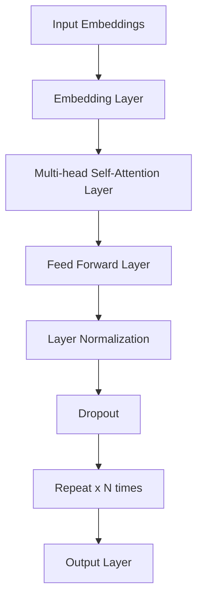

                 

### 1.1.1 问题背景

随着科技的飞速发展和人工智能技术的不断进步，游戏行业也在经历着一场前所未有的变革。尤其是在自动化游戏剧情生成领域，传统的方法已经难以满足现代游戏玩家对剧情多样性和个性化体验的需求。

**1.1.1.1 游戏市场规模的不断扩大**

根据最新市场调研数据，全球游戏市场的规模正在以每年20%以上的速度增长。游戏不仅成为了人们休闲娱乐的主要方式，也逐渐成为了一个巨大的经济产业。在这个过程中，游戏剧情的重要性愈发凸显，好的游戏剧情能够极大地提升玩家的沉浸感和游戏体验。

**1.1.1.2 游戏玩家对剧情多样性的需求**

现代游戏玩家对游戏剧情的要求越来越高，他们不再满足于简单线性、重复性的剧情模式，而是期望能够体验到更丰富、更有深度的剧情内容。玩家们渴望在游戏中遇到各种不同性格、不同背景的角色，并参与到各种充满变数的剧情走向中。

**1.1.1.3 传统剧情生成的局限性**

然而，传统剧情生成的手段主要依赖于程序员手工编写代码，或者利用一些预定义的剧情模板进行生成。这种方法不仅效率低下，而且剧情内容往往缺乏个性化和创新性。此外，传统剧情生成方法难以处理复杂多变的故事逻辑和角色关系，导致游戏剧情的单调和平庸。

### 1.1.2 ChatGPT介绍

**1.1.2.1 ChatGPT的定义**

ChatGPT 是一个基于大规模预训练的语言模型的人工智能系统，它能够通过学习和理解人类的语言来进行对话，还能根据聊天的上下文进行互动，并协助用户完成任务。

**1.1.2.1.1 ChatGPT的基本概念**

ChatGPT 的核心是一个基于 Transformer 的深度学习模型，这种模型能够处理自然语言文本，并生成与输入文本相关的内容。通过大量数据的学习，ChatGPT 可以掌握各种语言模式和规则，从而实现高效的文本生成。

**1.1.2.1.2 ChatGPT的发展历程**

ChatGPT 是基于 OpenAI 于 2022 年发布的一种新型语言模型 GPT-3.5 版本，它是 GPT 系列模型的最新版本，相比于前代模型，ChatGPT 在语言理解和生成能力上都有了显著提升。

### 1.1.3 ChatGPT在自动化游戏剧情生成中的应用

**1.1.3.1 ChatGPT在游戏剧情生成中的作用**

ChatGPT 在游戏剧情生成中起到了至关重要的作用。首先，它能够高效地生成各种剧情内容，包括角色对话、剧情分支和剧情结尾等。其次，ChatGPT 能够根据玩家的行为和选择，动态调整剧情走向，提供个性化的游戏体验。

**1.1.3.1.1 提高剧情生成的效率**

传统剧情生成方法需要大量的人力和时间，而 ChatGPT 可以在极短的时间内生成高质量的剧情内容，大大提高了生成效率。

**1.1.3.1.2 提升剧情的个性化程度**

ChatGPT 具有强大的语言理解能力，可以根据玩家的行为和喜好，生成个性化的剧情内容。这使得玩家在游戏中能够体验到更加真实和贴近自己兴趣的剧情。

## 1.2 核心概念与联系

### 1.2.1 自动化游戏剧情生成

自动化游戏剧情生成是指利用计算机技术和算法，自动生成游戏剧情的过程。它包括文本生成、剧情逻辑生成和剧情个性化等多个方面。

**1.2.1.1 自动化游戏剧情生成的定义**

自动化游戏剧情生成是指利用计算机技术和算法，自动生成游戏剧情的过程。它包括文本生成、剧情逻辑生成和剧情个性化等多个方面。

**1.2.1.1.1 自动化游戏剧情生成的技术基础**

自动化游戏剧情生成需要依赖自然语言处理、机器学习和人工智能等计算机技术。其中，自然语言处理技术用于处理文本数据，机器学习技术用于训练模型，人工智能技术用于实现剧情生成和个性化。

**1.2.1.1.2 自动化游戏剧情生成的方法与流程**

自动化游戏剧情生成的方法主要包括规则生成、模板生成和生成对抗网络等。其基本流程包括数据收集、数据预处理、模型训练、剧情生成和剧情优化等步骤。

### 1.2.2 ChatGPT的工作原理

ChatGPT 是一个基于大规模预训练的语言模型的人工智能系统，它通过学习和理解人类的语言来进行对话，并根据聊天的上下文进行互动，协助用户完成任务。

**1.2.2.1 ChatGPT的基本原理**

ChatGPT 的核心是一个基于 Transformer 的深度学习模型，这种模型能够处理自然语言文本，并生成与输入文本相关的内容。通过大量数据的学习，ChatGPT 可以掌握各种语言模式和规则，从而实现高效的文本生成。

**1.2.2.1.1 语言模型的工作机制**

语言模型是一种预测模型，它能够根据输入的文本序列预测下一个单词或字符。ChatGPT 通过学习和理解大量的文本数据，建立了复杂的语言模型，从而能够生成连贯、有意义的文本。

**1.2.2.1.2 ChatGPT的神经网络架构**

ChatGPT 的神经网络架构基于 Transformer 模型，这是一种具有多头注意力机制的深度神经网络。通过多头注意力机制，ChatGPT 能够更好地捕捉输入文本之间的复杂关系，从而生成高质量的文本。

### 1.2.3 自动化游戏剧情生成与ChatGPT的关系

自动化游戏剧情生成与 ChatGPT 之间存在紧密的联系。ChatGPT 作为一种强大的语言生成模型，可以广泛应用于自动化游戏剧情生成的各个环节。

**1.2.3.1 ChatGPT在自动化游戏剧情生成中的关键作用**

ChatGPT 在自动化游戏剧情生成中扮演着关键角色，它能够高效地生成各种剧情内容，包括角色对话、剧情分支和剧情结尾等。同时，ChatGPT 还可以根据玩家的行为和选择，动态调整剧情走向，提供个性化的游戏体验。

**1.2.3.1.1 ChatGPT在剧情内容生成中的应用**

ChatGPT 可以根据预设的剧情框架和角色属性，生成各种剧情内容。例如，它可以生成角色之间的对话，描述角色之间的互动和情感变化，构建剧情背景和场景等。

**1.2.3.1.2 ChatGPT在剧情逻辑生成中的应用**

ChatGPT 还可以生成剧情逻辑，包括角色关系、剧情分支和剧情结局等。通过理解和分析输入的文本数据，ChatGPT 可以构建复杂的剧情逻辑结构，为游戏提供丰富的剧情体验。

## 1.3 本章小结

本章介绍了自动化游戏剧情生成的背景和核心概念，包括问题的提出、ChatGPT 的基本原理及其在自动化游戏剧情生成中的应用。通过本章的学习，读者可以了解到自动化游戏剧情生成的重要性和当前技术的局限性，以及 ChatGPT 作为一种强大的语言生成模型，如何为自动化游戏剧情生成提供有效解决方案。

### 1.4 问题背景与核心概念的联系图

为了更直观地展示自动化游戏剧情生成与 ChatGPT 之间的联系，我们可以使用 Mermaid 图进行描述。以下是该联系图的 Mermaid 表示：

```mermaid
erDiagram
  Game_Drama_Generation ||--|{ ChatGPT : used for automation|
  ChatGPT ||--|{ Content_Generation : for story content|
  ChatGPT ||--|{ Logic_Generation : for story logic|
```

通过这张图，我们可以清晰地看到 ChatGPT 在自动化游戏剧情生成中的三个关键作用：内容生成、逻辑生成和自动化。

### 2.1 ChatGPT基本原理

#### 2.1.1 语言模型基础

**2.1.1.1 语言模型的定义**

语言模型（Language Model）是一种用于预测文本序列的概率分布的算法。它能够根据已有的文本数据，预测下一个单词或字符的概率分布。语言模型在自然语言处理（NLP）领域具有重要的应用价值，如机器翻译、文本生成、语音识别等。

**2.1.1.1.1 语言模型的作用**

语言模型的作用主要有两个方面：

1. **概率预测**：语言模型能够预测给定文本序列后缀的概率分布。这对于生成自然语言文本、评估文本质量等任务具有重要意义。
2. **序列生成**：通过使用语言模型，可以生成新的自然语言文本。这种方法常用于自动写作、对话系统等场景。

#### 2.1.1.2 语言模型的分类

语言模型可以分为两大类：基于规则的语言模型和基于统计的语言模型。

**2.1.1.2.1 基于规则的语言模型**

基于规则的语言模型通过定义一系列语法规则和转换规则，来生成自然语言文本。这类模型的优点是实现简单，但生成的文本往往缺乏灵活性，难以处理复杂的语言现象。

**2.1.1.2.2 基于统计的语言模型**

基于统计的语言模型通过统计已有的文本数据，来学习语言模式。这类模型的优点是生成文本更灵活，能够处理复杂的语言现象。常见的统计语言模型包括隐马尔可夫模型（HMM）、n-gram 模型等。

#### 2.1.1.3 语言模型的改进

随着深度学习技术的发展，语言模型也在不断改进。基于深度学习的语言模型，如循环神经网络（RNN）、长短时记忆网络（LSTM）、门控循环单元（GRU）等，在生成文本质量、灵活性等方面取得了显著提升。

**2.1.1.3.1 深度学习语言模型**

深度学习语言模型通过多层神经网络，学习文本数据中的复杂模式。深度学习语言模型在处理长距离依赖、捕捉上下文信息等方面具有优势。

**2.1.1.3.2 Transformer 模型**

Transformer 模型是一种基于自注意力机制的深度学习模型，它在语言模型任务中取得了显著的成果。自注意力机制使得 Transformer 模型能够更好地捕捉文本序列中的长距离依赖关系，从而生成高质量的文本。

#### 2.1.1.4 语言模型的应用

语言模型在各种 NLP 任务中都有广泛应用，如：

1. **机器翻译**：通过学习源语言和目标语言之间的对应关系，将一种语言的文本翻译成另一种语言。
2. **文本分类**：根据文本内容，将文本分类到不同的类别中，如情感分析、主题分类等。
3. **文本生成**：根据已有的文本数据，生成新的文本内容，如自动写作、对话系统等。

### 2.1.2 ChatGPT神经网络架构

**2.1.2.1 Transformer模型介绍**

Transformer 是一种基于自注意力机制的深度学习模型，最初由 Vaswani 等人于 2017 年在论文《Attention Is All You Need》中提出。Transformer 模型在机器翻译、文本生成等任务中取得了显著的成果，成为 NLP 领域的重要模型。

**2.1.2.1.1 Transformer模型的基本概念**

Transformer 模型主要由编码器（Encoder）和解码器（Decoder）组成。编码器将输入的文本序列编码为固定长度的向量序列，解码器则根据编码器的输出，生成新的文本序列。

**2.1.2.1.2 Transformer模型的优点**

1. **并行计算**：Transformer 模型采用了多头注意力机制，可以在训练和推理过程中进行并行计算，提高了计算效率。
2. **长距离依赖处理**：自注意力机制使得 Transformer 模型能够更好地捕捉文本序列中的长距离依赖关系，从而生成高质量的文本。
3. **灵活性**：Transformer 模型可以灵活地调整模型大小和参数，以适应不同的 NLP 任务。

**2.1.2.2 ChatGPT模型结构**

ChatGPT 是基于 Transformer 模型的一个大规模预训练语言模型。其模型结构主要包括以下几个部分：

**2.1.2.2.1 模型层次结构**

ChatGPT 模型采用了多层的 Transformer 结构，每一层都包含多头注意力机制和前馈神经网络。模型层次结构如下：



**2.1.2.2.2 模型参数设置**

ChatGPT 模型的参数设置包括：

1. **嵌入维度（Embedding Dimension）**：嵌入维度决定了模型能够捕捉的文本特征的空间维度。
2. **隐藏层维度（Hidden Dimension）**：隐藏层维度决定了模型在处理文本序列时的信息处理能力。
3. **层数（Number of Layers）**：层数决定了模型的深度，层数越多，模型能够捕捉的复杂特征越多。
4. **注意力头数（Number of Attention Heads）**：注意力头数决定了模型在处理文本序列时的并行度。

### 2.1.3 ChatGPT算法原理

**2.1.3.1 算法流程**

ChatGPT 的算法流程主要包括以下几个步骤：

**2.1.3.1.1 输入文本处理**

输入文本经过分词处理后，被转换为词向量表示。词向量表示了文本中的每个单词或字符在向量空间中的位置。

**2.1.3.1.2 神经网络前向传播**

神经网络前向传播过程中，输入的词向量经过多层 Transformer 结构的变换和聚合，生成输出文本的词向量。

**2.1.3.1.3 输出文本生成**

输出文本的词向量被解码为文本序列，生成最终的输出文本。

**2.1.3.2 算法优化**

为了提高 ChatGPT 的生成质量和效率，需要对算法进行优化。常见的优化方法包括：

**2.1.3.2.1 梯度下降法**

梯度下降法是一种常用的优化方法，它通过计算损失函数关于模型参数的梯度，来更新模型参数。

**2.1.3.2.2 优化算法的选择**

常见的优化算法包括 Adam、RMSprop 等，这些算法通过调整学习率等参数，提高了训练效率和生成质量。

### 2.1.4 ChatGPT的工作机制

**2.1.4.1 语言生成多样性**

ChatGPT 通过自注意力机制和多层神经网络结构，能够生成具有多样性的语言文本。自注意力机制使得模型能够根据上下文信息，灵活地选择和调整生成的内容。

**2.1.4.2 语言理解准确性**

ChatGPT 在训练过程中，通过大量数据的学习，能够准确理解语言文本的含义和结构。这使得模型在生成文本时，能够保持准确性和一致性。

**2.1.4.3 个性化生成**

ChatGPT 能够根据用户的行为和喜好，生成个性化的语言文本。通过学习用户的历史交互数据，模型能够更好地满足用户的需求，提供个性化的服务。

### 2.1.5 ChatGPT的优势与挑战

**2.1.5.1 优势**

ChatGPT 作为一种强大的语言生成模型，具有以下优势：

1. **生成质量高**：通过自注意力机制和多层神经网络结构，ChatGPT 能够生成高质量的语言文本。
2. **多样性丰富**：ChatGPT 能够根据上下文信息，灵活地选择和调整生成的内容，提供多样化的文本输出。
3. **理解准确性高**：ChatGPT 通过大量数据的学习，能够准确理解语言文本的含义和结构，保持生成的准确性。

**2.1.5.2 挑战**

尽管 ChatGPT 具有众多优势，但在实际应用中仍面临一些挑战：

1. **数据依赖性**：ChatGPT 的训练和生成过程高度依赖大量高质量的训练数据，数据的质量和多样性直接影响生成质量。
2. **计算资源消耗**：ChatGPT 模型结构复杂，训练和推理过程需要大量的计算资源，这对硬件设施提出了较高要求。
3. **安全性问题**：由于 ChatGPT 具有强大的语言生成能力，可能被用于生成虚假信息或恶意内容，需要建立有效的安全机制来防范。

### 2.1.6 ChatGPT的应用领域

ChatGPT 在自然语言处理领域具有广泛的应用前景，以下是一些主要的应用领域：

**2.1.6.1 文本生成**

ChatGPT 可以用于自动写作、新闻生成、故事创作等文本生成任务。通过学习大量文本数据，ChatGPT 能够生成高质量、具有创意的文本内容。

**2.1.6.2 对话系统**

ChatGPT 可以用于构建智能对话系统，如客服机器人、聊天机器人等。通过理解和生成自然语言文本，ChatGPT 能够与用户进行有效的交互，提供个性化的服务。

**2.1.6.3 机器翻译**

ChatGPT 可以用于机器翻译任务，如将一种语言的文本翻译成另一种语言。通过学习和理解多种语言的数据，ChatGPT 能够生成准确、流畅的翻译结果。

**2.1.6.4 情感分析**

ChatGPT 可以用于情感分析任务，如判断文本的情感倾向、分析用户评论等。通过理解文本的情感表达，ChatGPT 能够为企业和产品提供有价值的情感分析报告。

**2.1.6.5 其他应用**

除了上述领域，ChatGPT 还可以应用于语音合成、文本摘要、问答系统等任务。随着技术的不断发展，ChatGPT 的应用领域将不断扩展。

### 2.1.7 本章小结

本章介绍了 ChatGPT 的基本原理，包括语言模型基础、Transformer 模型介绍、ChatGPT 模型结构、算法原理和优化方法等。通过本章的学习，读者可以了解到 ChatGPT 作为一种强大的语言生成模型，在自动化游戏剧情生成中的应用前景和优势。同时，本章也讨论了 ChatGPT 的挑战和应用领域，为后续章节的讨论奠定了基础。

### 2.2.1 算法流程

#### 2.2.1.1 输入文本处理

在 ChatGPT 的算法流程中，首先需要对输入的文本进行处理。这个过程主要包括以下几个步骤：

**2.2.1.1.1 分词处理**

分词是将连续的文本分割成一系列有意义的单词或短语。ChatGPT 使用了基于词频统计的分词方法，将输入文本分割成词汇序列。分词结果将被用于后续的嵌入表示。

**2.2.1.1.2 嵌入表示**

分词后的词汇序列需要被转换为向量表示，以便在神经网络中进行处理。ChatGPT 使用了预训练的词嵌入模型，如 Word2Vec 或 GloVe，将每个词汇映射为一个固定长度的向量。这些嵌入向量将作为输入传递给神经网络的编码器部分。

#### 2.2.1.2 神经网络前向传播

在完成输入文本的处理后，ChatGPT 的神经网络开始进行前向传播。前向传播过程中，输入的嵌入向量通过多层 Transformer 结构进行处理，并生成输出文本的词向量。以下是前向传播的主要步骤：

**2.2.1.2.1 多层 Transformer 结构**

Transformer 模型由多个相同的编码器层和解码器层组成。每个编码器层包括自注意力机制和前馈神经网络，解码器层还包括掩码自注意力机制和交叉注意力机制。这些结构使得模型能够捕捉长距离依赖关系，并生成高质量的输出。

**2.2.1.2.2 自注意力机制**

自注意力机制是 Transformer 模型的核心组件。它通过计算输入嵌入向量之间的相似性，生成加权求和的输出向量。自注意力机制能够有效地捕捉文本序列中的长距离依赖关系。

**2.2.1.2.3 前馈神经网络**

在自注意力机制之后，输出向量通过前馈神经网络进行进一步处理。前馈神经网络通常包含两个全连接层，分别用于增加模型的表达能力和非线性变换。

**2.2.1.2.4 前向传播的计算过程**

在编码器层，输入的嵌入向量首先通过自注意力机制进行变换，然后通过前馈神经网络进行进一步处理。变换后的向量被传递到下一层编码器，或者传递给解码器层。在解码器层，除了自注意力机制和前馈神经网络外，还包括掩码自注意力机制和交叉注意力机制，用于处理输入的编码器输出和上一时间步的解码器输出。

#### 2.2.1.3 输出文本生成

在前向传播结束后，ChatGPT 开始生成输出文本。这个过程主要包括以下几个步骤：

**2.2.1.3.1 输出向量解码**

输出向量被解码为文本序列。ChatGPT 使用了贪心策略或采样策略，从输出向量中选取概率最高的单词或字符，生成新的文本。

**2.2.1.3.2 输出文本调整**

生成的文本通常需要进行后处理，以消除可能的语法错误、不一致性等。ChatGPT 使用了语法校验、语法修复等技术，对输出文本进行调整和优化。

**2.2.1.3.3 生成质量评估**

生成的文本质量需要进行评估。ChatGPT 使用了多种评估指标，如 BLEU、ROUGE、METEOR 等，对生成的文本质量进行量化评估。

#### 2.2.1.4 算法优化

为了提高 ChatGPT 的生成质量和效率，需要对算法进行优化。以下是一些常见的优化方法：

**2.2.1.4.1 梯度裁剪**

在训练过程中，梯度裁剪可以防止梯度爆炸或消失，提高训练稳定性。ChatGPT 使用了梯度裁剪技术，限制梯度值的范围。

**2.2.1.4.2 优化算法的选择**

ChatGPT 使用了自适应优化算法，如 Adam、Adadelta 等，通过调整学习率等参数，提高训练效率和生成质量。

**2.2.1.4.3 并行计算**

ChatGPT 利用了并行计算技术，如多线程、分布式训练等，加快训练和推理速度。

### 2.2.2 算法优化

在 ChatGPT 的算法流程中，优化是一个重要的环节，它直接影响模型的训练效率和生成质量。以下是一些常见的算法优化方法：

#### 2.2.2.1 梯度下降法

梯度下降法是一种常用的优化方法，其基本思想是利用损失函数关于模型参数的梯度，来更新模型参数。具体步骤如下：

**2.2.2.1.1 梯度计算**

在训练过程中，首先需要计算损失函数关于模型参数的梯度。损失函数通常表示模型预测结果与真实结果之间的差距，如交叉熵损失函数。

**2.2.2.1.2 参数更新**

根据计算得到的梯度，更新模型参数。参数更新的目标是减小损失函数的值，从而提高模型的预测准确性。

**2.2.2.1.3 学习率调整**

学习率是梯度下降法中的一个关键参数，它决定了参数更新的步长。合适的学习率能够加快模型的收敛速度，而学习率过大或过小都可能影响训练效果。

**2.2.2.2 优化算法的选择**

除了传统的梯度下降法，ChatGPT 还使用了多种自适应优化算法，如 Adam、RMSprop 等。这些算法通过自适应调整学习率等参数，提高了训练效率和生成质量。

**2.2.2.2.1 Adam**

Adam 是一种结合了 AdaGrad 和 RMSprop 优点的优化算法，其计算过程如下：

1. **一阶矩估计（m_t）**：计算梯度的一阶矩估计，即梯度在时间上的均值。
2. **二阶矩估计（v_t）**：计算梯度的二阶矩估计，即梯度的平方在时间上的均值。
3. **权重更新**：使用一阶矩估计和二阶矩估计来更新权重，同时引入偏置修正。

**2.2.2.2.2 RMSprop**

RMSprop 是一种基于二阶矩估计的优化算法，其计算过程如下：

1. **梯度平方均值（v_t）**：计算梯度在时间上的平方均值。
2. **权重更新**：使用梯度平方均值来更新权重。

**2.2.2.3 并行计算**

ChatGPT 利用了并行计算技术，如多线程、分布式训练等，来加快训练和推理速度。具体实现如下：

**2.2.2.3.1 多线程**

在训练过程中，ChatGPT 使用多线程技术，将计算任务分布在多个 CPU 或 GPU 上，从而提高计算效率。

**2.2.2.3.2 分布式训练**

分布式训练是将模型训练任务分布在多个计算节点上，通过数据并行和模型并行等方式，加快训练速度。

**2.2.2.4 优化技巧**

除了上述优化方法，ChatGPT 还使用了以下优化技巧：

**2.2.2.4.1 梯度裁剪**

梯度裁剪是一种防止梯度爆炸或消失的技术，其基本原理是限制梯度值的范围。具体实现如下：

1. **梯度裁剪阈值**：设置一个阈值，当梯度的绝对值超过阈值时，将其裁剪为阈值。
2. **梯度裁剪计算**：根据裁剪阈值，计算裁剪后的梯度值。

**2.2.2.4.2 学习率衰减**

学习率衰减是一种在训练过程中逐渐减小学习率的策略，其基本原理是随着训练的进行，逐渐减小参数更新的步长。具体实现如下：

1. **初始学习率**：设置一个较大的初始学习率。
2. **衰减策略**：根据训练的轮数或时间，逐渐减小学习率。

**2.2.2.4.3 模型剪枝**

模型剪枝是一种减少模型参数数量的技术，其基本原理是去除不重要的参数，从而减小模型规模。具体实现如下：

1. **参数重要性评估**：评估模型参数的重要性。
2. **参数剪枝**：根据参数重要性评估结果，去除不重要的参数。

### 2.2.3 本章小结

本章详细介绍了 ChatGPT 的算法流程和优化方法。首先，本章讨论了输入文本的处理过程，包括分词和嵌入表示。接着，详细解释了神经网络前向传播的计算过程，包括多层 Transformer 结构和前馈神经网络。最后，本章介绍了输出文本生成的过程，以及如何通过优化算法提高模型的训练效率和生成质量。通过本章的学习，读者可以深入了解 ChatGPT 的工作原理，为后续的应用和实践奠定基础。

