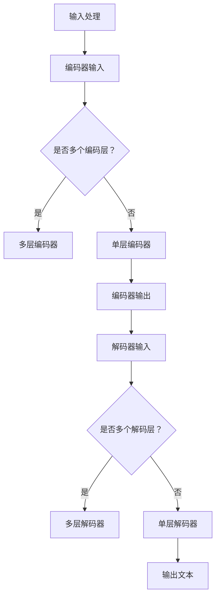
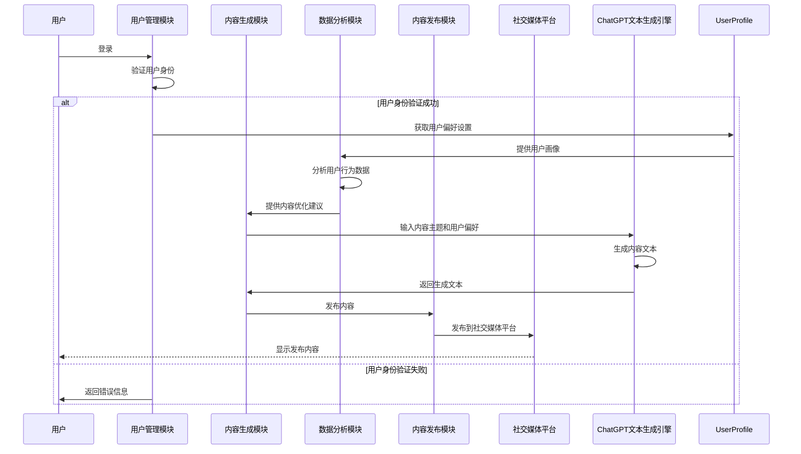
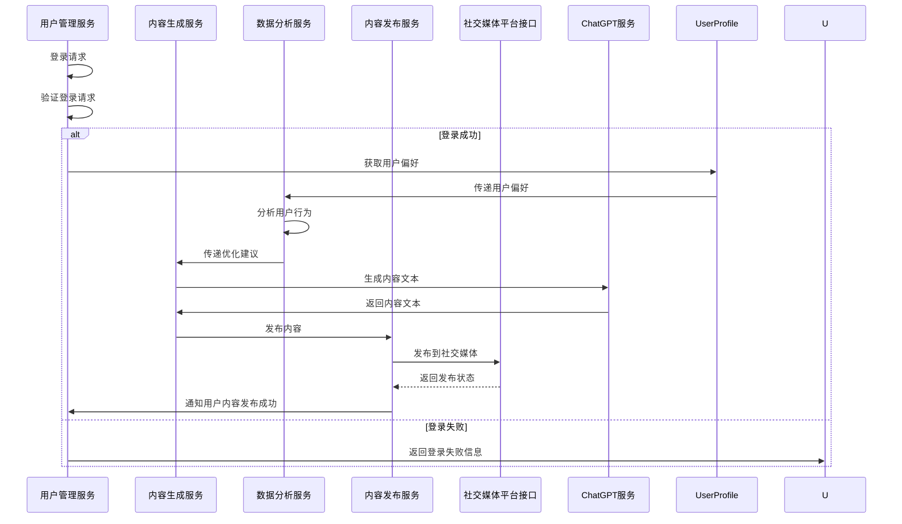

                 

## 文章标题：ChatGPT在自动化社交媒体内容策划中的应用

### 关键词：ChatGPT、社交媒体内容策划、自动化、自然语言处理、算法、系统设计

### 摘要：本文将探讨如何利用ChatGPT这一先进的自然语言处理技术，实现自动化社交媒体内容策划。通过对社交媒体内容策划的现状、ChatGPT的基本概念和应用原理进行介绍，文章将详细阐述ChatGPT在社交媒体内容策划中的应用过程，包括算法原理、系统架构设计、实战案例及最佳实践。希望通过本文，读者能够更好地理解和应用ChatGPT在社交媒体内容策划中的潜力。

## 目录大纲

### 第一部分：背景与核心概念

1. 社交媒体内容策划概述
   1.1 社交媒体在营销中的重要性
   1.2 社交媒体内容策划的关键要素
   1.3 当前社交媒体内容策划面临的挑战

2. ChatGPT概述
   2.1 ChatGPT的概念与原理
   2.2 ChatGPT的特点与应用场景
   2.3 ChatGPT的发展历程

3. ChatGPT在社交媒体内容策划中的应用原理
   3.1 ChatGPT的自然语言处理能力
   3.2 ChatGPT在社交媒体内容策划中的优势
   3.3 ChatGPT应用中的潜在问题与挑战

4. 核心概念与联系
   4.1 社交媒体内容策划与ChatGPT的关系
   4.2 关键概念属性特征对比表格
   4.3 ChatGPT在社交媒体内容策划中的ER实体关系图

### 第二部分：算法原理与系统设计

5. 数学模型与算法原理讲解
   5.1 ChatGPT算法原理讲解
   5.2 算法mermaid流程图
   5.3 Python源代码详解
   5.4 数学模型和公式讲解
   5.5 举例说明

6. 系统分析与架构设计
   6.1 问题场景介绍
   6.2 项目介绍
   6.3 系统功能设计（领域模型mermaid类图）
   6.4 系统架构设计（mermaid架构图）
   6.5 系统接口设计和系统交互（mermaid序列图）

### 第三部分：项目实战与最佳实践

7. 项目实战
   7.1 环境安装
   7.2 系统核心实现源代码
   7.3 代码应用解读与分析
   7.4 实际案例分析与详细讲解剖析
   7.5 项目小结

8. 最佳实践与注意事项
   8.1 ChatGPT在社交媒体内容策划中的最佳实践
   8.2 注意事项与风险防范
   8.3 小结

9. 拓展阅读
   9.1 相关书籍推荐
   9.2 学术论文与研究报告
   9.3 实践案例分享

---

文章大纲结构已经清晰，接下来我们将逐一填充每个章节的内容，通过逻辑清晰、结构紧凑、简单易懂的叙述，逐步引导读者深入理解ChatGPT在自动化社交媒体内容策划中的应用。在撰写过程中，我们将严格遵循大纲的要求，确保文章的完整性和专业性。让我们开始这段深入探讨之旅！### 第一部分：背景与核心概念

#### 第1章：社交媒体内容策划概述

##### 1.1 社交媒体在营销中的重要性

在当今数字化时代，社交媒体已成为企业营销策略中不可或缺的一部分。社交媒体平台如Facebook、Instagram、Twitter等，不仅提供了广泛的用户基础，而且具有高度的互动性和参与度。根据Statista的数据，全球社交媒体用户数量已经超过30亿，这为营销活动提供了巨大的潜在市场。

社交媒体在营销中的重要性主要体现在以下几个方面：

1. **提高品牌知名度**：通过在社交媒体上发布内容，企业能够迅速将品牌信息传播给大量潜在用户，提高品牌知名度。
2. **增强用户互动**：社交媒体提供了一个平台，让用户可以直接与企业互动，提供即时反馈，这有助于建立更紧密的客户关系。
3. **数据分析与优化**：社交媒体平台提供了丰富的数据工具，企业可以通过分析用户行为和反馈来优化营销策略，提高营销效果。
4. **成本效益**：相比于传统的广告渠道，社交媒体广告通常成本较低，同时具有更高的可定制性。

##### 1.2 社交媒体内容策划的关键要素

成功的社交媒体内容策划需要关注以下几个关键要素：

1. **目标受众**：明确目标受众是策划的第一步。了解受众的兴趣、偏好和需求，可以帮助企业制定更有效的营销策略。
2. **内容策略**：内容是社交媒体营销的核心。高质量、有趣且相关的内容能够吸引用户，提高参与度。内容形式包括文字、图片、视频等。
3. **发布频率**：定期发布内容可以保持用户的关注和活跃度。但频率过高或过低都可能导致用户流失，因此需要找到合适的平衡点。
4. **互动与反馈**：与用户的互动是社交媒体营销的重要组成部分。及时回复用户评论和私信，可以提升用户体验和品牌忠诚度。
5. **数据分析**：通过分析社交媒体数据，企业可以了解哪些内容最受欢迎，哪些渠道效果最好，从而不断优化营销策略。

##### 1.3 当前社交媒体内容策划面临的挑战

尽管社交媒体内容策划具有巨大的潜力，但也面临着一系列挑战：

1. **内容饱和**：由于社交媒体平台上的内容量巨大，如何吸引注意力成为一个难题。企业需要创造独特且高质量的内容来脱颖而出。
2. **算法变化**：社交媒体平台的算法不断变化，这影响了内容的可见性和推广效果。企业需要不断适应这些变化，优化内容策略。
3. **隐私与合规**：随着对用户隐私的关注日益增加，企业需要确保遵守相关的隐私法规，避免因隐私问题受到处罚。
4. **资源与时间限制**：社交媒体内容策划需要持续的努力和投入，许多企业可能缺乏足够的资源来维持高效的内容策划。

综上所述，社交媒体内容策划在营销中具有不可忽视的重要性，但其复杂性也带来了挑战。接下来，我们将介绍ChatGPT这一先进的技术，探讨其在社交媒体内容策划中的应用潜力。

---

#### 第2章：ChatGPT概述

##### 2.1 ChatGPT的概念与原理

ChatGPT是由OpenAI开发的一种基于变换器（Transformer）架构的大型语言模型。它通过训练数万亿个单词和句子的文本数据，学习到语言的结构和语义，从而能够生成连贯、自然的文本。

ChatGPT的工作原理主要包括以下几个步骤：

1. **输入处理**：当用户输入一个提示或问题后，ChatGPT会对其进行预处理，包括分词、词形还原等，将其转换为模型可以理解的格式。
2. **编码器-解码器**：ChatGPT使用变换器架构，其中编码器将输入文本编码为一个固定长度的向量表示，解码器则根据这个向量生成输出文本。编码器和解码器之间通过自注意力机制（Self-Attention Mechanism）进行信息交互，使得模型能够捕捉输入文本中的长距离依赖关系。
3. **生成文本**：解码器从空文本开始，逐步生成单词或词组，每次生成一个元素后，都会更新其内部状态，并利用之前生成的文本作为上下文信息进行下一步的预测。这个过程持续进行，直到生成完整的输出文本。

##### 2.2 ChatGPT的特点与应用场景

ChatGPT具有以下几个显著特点：

1. **强大文本生成能力**：ChatGPT能够生成连贯、自然的文本，适用于各种文本生成任务，如问答、对话生成、文本摘要、文章写作等。
2. **多语言支持**：ChatGPT经过训练可以支持多种语言，能够处理不同语言的输入和输出。
3. **自适应学习**：ChatGPT可以不断从新的数据中学习，提高其性能和适应能力。
4. **灵活的接口**：ChatGPT可以通过API接口进行调用，方便与其他系统和应用集成。

ChatGPT的应用场景非常广泛，包括但不限于：

1. **客户服务**：ChatGPT可以用于构建聊天机器人，提供自动化的客户服务，解答常见问题，减轻人工客服的工作负担。
2. **内容创作**：ChatGPT可以用于生成文章、博客、报告等文本内容，帮助企业快速创作高质量的内容。
3. **教育辅导**：ChatGPT可以作为个性化学习助手，为学生提供个性化的学习支持和辅导。
4. **翻译服务**：ChatGPT可以用于机器翻译，实现多种语言之间的快速、准确翻译。

##### 2.3 ChatGPT的发展历程

ChatGPT的诞生是自然语言处理（NLP）领域的一个重要里程碑。以下是ChatGPT发展的一些关键节点：

1. **早期探索**：2017年，谷歌发布了BERT模型，推动了基于变换器架构的NLP研究。这为ChatGPT的诞生奠定了基础。
2. **GPT系列模型**：2018年，OpenAI发布了GPT（Generative Pre-trained Transformer）系列模型，其中GPT-2和GPT-3取得了显著的性能提升，展示了变换器架构在NLP中的巨大潜力。
3. **ChatGPT发布**：2022年，OpenAI发布了ChatGPT，这是基于GPT-3模型的升级版，专注于对话生成任务，标志着NLP技术在对话系统应用方面的重要进展。

通过上述概述，我们了解了ChatGPT的概念、原理和特点，以及其发展历程和应用场景。接下来，我们将进一步探讨ChatGPT在社交媒体内容策划中的应用原理。

---

#### 第3章：ChatGPT在社交媒体内容策划中的应用原理

##### 3.1 ChatGPT的自然语言处理能力

ChatGPT作为一种大型语言模型，其自然语言处理能力是其在社交媒体内容策划中发挥作用的基础。以下是ChatGPT在自然语言处理方面的主要特点：

1. **语义理解**：ChatGPT能够理解输入文本的语义，从而生成与之相关的、连贯的输出文本。这种能力使得ChatGPT能够生成与主题一致、内容丰富的社交媒体内容。
2. **上下文感知**：ChatGPT能够根据上下文信息进行文本生成，这意味着它可以根据之前的对话或文章内容来调整生成文本的风格和内容，确保生成的社交媒体内容与整体语境相符。
3. **多语言支持**：ChatGPT经过训练支持多种语言，这使得它能够生成适用于不同语言环境的社交媒体内容，帮助企业实现全球化营销。
4. **自适应学习**：ChatGPT可以不断从新的数据中学习，提高其文本生成能力，从而更好地适应不断变化的社交媒体内容需求。

##### 3.2 ChatGPT在社交媒体内容策划中的优势

ChatGPT在社交媒体内容策划中具有以下显著优势：

1. **自动化内容生成**：ChatGPT能够自动生成高质量的社交媒体内容，大大减少人工创作的负担，提高内容生产的效率。
2. **个性化和定制化**：ChatGPT可以根据不同的用户群体和内容主题生成定制化的内容，满足不同受众的需求，提升内容的相关性和吸引力。
3. **数据驱动优化**：ChatGPT能够利用社交媒体平台提供的用户数据和反馈，不断优化内容策略，提高营销效果。
4. **节省成本**：通过自动化内容生成，企业可以节省大量的人力成本和营销预算，将资源集中在更具战略性的任务上。

##### 3.3 ChatGPT应用中的潜在问题与挑战

尽管ChatGPT在社交媒体内容策划中具有诸多优势，但其应用也面临一些潜在问题与挑战：

1. **内容质量控制**：自动生成的文本可能存在错误、不恰当或低质量的情况，需要人工审核和修正。
2. **个性化和创造力限制**：尽管ChatGPT能够生成个性化内容，但其创造力有限，难以完全替代人类的创意和直觉。
3. **算法透明度和伦理问题**：ChatGPT的决策过程往往是不透明的，可能会引发关于数据隐私、算法歧视等伦理问题。
4. **技术依赖性**：过度依赖ChatGPT可能导致企业在技术更新和替代技术出现时面临挑战。

综上所述，ChatGPT在社交媒体内容策划中具有强大的自然语言处理能力和显著的优势，但同时也需要关注和解决其应用中的潜在问题与挑战。接下来，我们将探讨社交媒体内容策划与ChatGPT之间的关系，以及如何通过关键概念属性特征对比表格和ER实体关系图来理解和应用ChatGPT在社交媒体内容策划中的潜力。

---

#### 第4章：核心概念与联系

##### 4.1 社交媒体内容策划与ChatGPT的关系

社交媒体内容策划和ChatGPT虽然属于不同领域，但它们之间存在着紧密的联系和互动。以下是两者关系的详细分析：

1. **社交媒体内容策划的需求驱动**：社交媒体内容策划的需求是ChatGPT应用的主要驱动力。企业需要大量的、高质量的社交媒体内容来吸引用户、提高品牌知名度和参与度。ChatGPT作为一种高效的文本生成工具，可以满足这种需求，实现自动化内容生成。
2. **ChatGPT的能力支持**：ChatGPT的自然语言处理能力为社交媒体内容策划提供了技术支持。通过训练和优化，ChatGPT能够生成符合主题、风格和语境的社交媒体内容，提高内容的个性化和相关性。
3. **互动与反馈机制**：社交媒体平台提供了丰富的用户互动和反馈机制，这些反馈可以用于优化ChatGPT的文本生成策略。例如，用户对内容的点赞、评论和分享等行为可以反映内容的受欢迎程度，从而帮助ChatGPT不断学习和改进。

##### 4.2 关键概念属性特征对比表格

为了更好地理解社交媒体内容策划与ChatGPT之间的关系，我们可以通过一个对比表格来分析两者的关键概念属性特征。以下是一个简化的对比表格示例：

| 关键概念 | 社交媒体内容策划 | ChatGPT |
| :---: | :---: | :---: |
| 目标 | 吸引用户，提高品牌知名度，提升用户互动 | 生成高质量、个性化的文本内容 |
| 内容形式 | 文本、图片、视频等多种形式 | 文本 |
| 需求驱动 | 用户需求，市场趋势，品牌策略 | 大规模文本数据，算法优化 |
| 交互性 | 与用户互动，获取反馈 | 生成文本反馈，持续优化 |
| 成本效益 | 高成本，需专业团队 | 自动化生成，降低人力成本 |
| 创造力 | 有限，依赖于创意团队 | 强大，基于大规模数据训练 |

通过这个表格，我们可以看到社交媒体内容策划和ChatGPT在目标、内容形式、需求驱动、交互性、成本效益和创造力等方面存在显著差异，但同时也具有互补性。社交媒体内容策划需要ChatGPT提供高效的内容生成能力，而ChatGPT则通过社交媒体平台获取用户反馈和数据支持，不断优化自身性能。

##### 4.3 ChatGPT在社交媒体内容策划中的ER实体关系图

为了更直观地展示ChatGPT在社交媒体内容策划中的应用，我们可以使用ER（Entity-Relationship）实体关系图来描述不同实体之间的关系。以下是一个简化的ER实体关系图示例：

```
+----------------+       +----------------+
|   社交媒体内容  |       |      ChatGPT    |
+----------------+       +----------------+
| - 内容类型      |       | - 模型参数      |
| - 发布时间      |       | - 训练数据      |
| - 用户互动      |       | - 输出文本      |
+----------------+       +----------------+
      |               |                 |
      |               |                 |
      |               |                 |
+-----------+     +-------------+      |
| 内容策划   |     | 文本生成    |      |
+-----------+     +-------------+      |
| - 策略制定   |     | - 语义理解   |      |
| - 内容审核   |     | - 上下文生成 |      |
| - 数据分析   |     | - 自适应学习  |      |
+-----------+     +-------------+      |
```

在这个ER实体关系图中，社交媒体内容和ChatGPT是两个主要的实体。社交媒体内容包含内容类型、发布时间和用户互动等属性，而ChatGPT则包含模型参数、训练数据和输出文本等属性。两者之间通过文本生成、语义理解和自适应学习等关系进行连接。

通过实体关系图，我们可以更清晰地看到ChatGPT在社交媒体内容策划中的应用过程。首先，社交媒体内容策划团队根据策略制定和内容审核的需求，生成具体的社交媒体内容。这些内容会被ChatGPT用于文本生成和语义理解，生成符合上下文和用户需求的输出文本。ChatGPT通过不断学习和优化，提高其文本生成能力，从而更好地满足社交媒体内容策划的需求。

综上所述，通过核心概念与联系的分析，我们深入理解了社交媒体内容策划与ChatGPT之间的紧密关系，并通过对比表格和ER实体关系图展示了ChatGPT在社交媒体内容策划中的应用过程。这为后续章节的算法原理讲解、系统架构设计和项目实战奠定了基础。

---

#### 第5章：数学模型与算法原理讲解

##### 5.1 ChatGPT算法原理讲解

ChatGPT是基于变换器（Transformer）架构的大型语言模型，其核心算法原理可以通过以下几个关键部分来解释：

1. **变换器架构**：变换器架构是ChatGPT的核心，其设计灵感来源于自注意力机制（Self-Attention Mechanism）。变换器通过自注意力机制来处理输入序列，使其能够捕捉输入序列中的长距离依赖关系。自注意力机制的核心是计算输入序列中每个元素对于其他所有元素的权重，并使用这些权重对输入序列进行加权求和。

2. **多头注意力**：在变换器架构中，多头注意力（Multi-Head Attention）是一种扩展自注意力机制的策略。多头注意力通过将输入序列分成多个子序列，并分别对每个子序列应用自注意力机制，从而增强模型的表示能力。

3. **前馈网络**：在变换器中，每个变换层除了包含多头注意力机制外，还包含一个前馈网络。前馈网络通过对每个输入元素进行两步前向传播，即先通过一个线性变换层，再通过一个ReLU激活函数，然后再次通过线性变换层。

4. **编码器-解码器结构**：ChatGPT采用了编码器-解码器（Encoder-Decoder）结构，其中编码器负责处理输入序列，将其编码为固定长度的向量表示，解码器则根据编码器的输出向量生成输出序列。编码器和解码器之间通过自注意力机制进行信息交互，使得模型能够生成连贯、自然的输出文本。

##### 5.2 算法mermaid流程图

为了更直观地展示ChatGPT的算法流程，我们可以使用mermaid语言绘制一个简化的流程图。以下是一个示例：



在这个流程图中，输入处理阶段将用户输入的文本进行预处理，然后输入到编码器中。编码器通过自注意力机制生成编码器输出。编码器输出作为解码器的输入，解码器同样通过自注意力机制生成输出文本。

##### 5.3 Python源代码详解

以下是一个简化的Python源代码示例，展示了如何使用PyTorch框架实现一个基本的ChatGPT模型：

```python
import torch
import torch.nn as nn
import torch.optim as optim

# 定义变换器模型
class TransformerModel(nn.Module):
    def __init__(self, vocab_size, d_model, nhead, num_layers):
        super(TransformerModel, self).__init__()
        self.embedding = nn.Embedding(vocab_size, d_model)
        self.transformer = nn.Transformer(d_model, nhead, num_layers)
        self.fc = nn.Linear(d_model, vocab_size)
        
    def forward(self, src, tgt):
        src = self.embedding(src)
        tgt = self.embedding(tgt)
        out = self.transformer(src, tgt)
        out = self.fc(out)
        return out

# 初始化模型、损失函数和优化器
model = TransformerModel(vocab_size=10000, d_model=512, nhead=8, num_layers=3)
criterion = nn.CrossEntropyLoss()
optimizer = optim.Adam(model.parameters(), lr=0.001)

# 训练模型
for epoch in range(num_epochs):
    for src, tgt in data_loader:
        optimizer.zero_grad()
        output = model(src, tgt)
        loss = criterion(output.view(-1, vocab_size), tgt.view(-1))
        loss.backward()
        optimizer.step()
```

在这个示例中，我们定义了一个基本的变换器模型，包括嵌入层、变换器层和前馈层。模型通过训练数据训练，并使用交叉熵损失函数和Adam优化器进行优化。

##### 5.4 数学模型和公式讲解

ChatGPT的数学模型主要包括以下几个方面：

1. **嵌入层**：嵌入层将输入的单词或字符编码为固定大小的向量。公式为：
   $$ 
   \text{embeddings} = \text{W} \cdot \text{X}
   $$
   其中，$\text{W}$是嵌入矩阵，$\text{X}$是输入序列。

2. **多头注意力**：多头注意力的计算公式为：
   $$
   \text{Attention}(Q, K, V) = \text{softmax}\left(\frac{\text{QK}^T}{\sqrt{d_k}}\right) \cdot V
   $$
   其中，$Q, K, V$分别是编码器输出、键序列和值序列，$d_k$是键序列的维度。

3. **前馈网络**：前馈网络的计算公式为：
   $$
   \text{FFN}(X) = \text{ReLU}(\text{W_2} \cdot \text{ReLU}(\text{W_1} \cdot X))
   $$
   其中，$X$是输入序列，$W_1$和$W_2$是线性变换矩阵。

4. **编码器-解码器结构**：编码器和解码器的交互通过以下公式实现：
   $$
   \text{Encoder}(X) = \text{LayerNorm}(\text{X} + \text{Self-Attention}(\text{X})) \\
   \text{Decoder}(X) = \text{LayerNorm}(\text{X} + \text{Cross-Attention}(\text{Encoder}(X), X)) 
   $$
   其中，$X$是输入序列，$\text{Self-Attention}$和$\text{Cross-Attention}$分别是自注意力和交叉注意力机制。

##### 5.5 举例说明

为了更好地理解ChatGPT的算法原理，我们可以通过一个简单的例子来说明其应用过程。

假设我们有一个简单的输入句子：“今天天气很好”。我们希望ChatGPT生成一个相关的输出句子。

1. **输入处理**：首先，将输入句子转换为编码器可以理解的格式，例如词嵌入向量。

2. **编码器处理**：编码器通过自注意力机制处理输入句子，生成编码器输出。

3. **解码器处理**：解码器从空文本开始，逐步生成输出句子。每次生成一个单词后，解码器都会更新其内部状态，并根据编码器输出生成下一个单词。

4. **生成输出**：解码器生成完整的输出句子，例如：“明天去公园散步一定很愉快”。

通过这个例子，我们可以看到ChatGPT如何通过编码器-解码器结构生成连贯、自然的文本。这个过程体现了ChatGPT在社交媒体内容策划中的强大能力。

综上所述，通过对ChatGPT算法原理的详细讲解，包括mermaid流程图、Python源代码、数学模型和举例说明，我们深入了解了ChatGPT在社交媒体内容策划中的应用原理。这为后续章节的系统分析与架构设计提供了理论基础。

---

#### 第6章：系统分析与架构设计

##### 6.1 问题场景介绍

在当前的社交媒体营销环境中，内容策划成为一个关键的挑战。企业需要不断生成大量高质量、个性化的内容来吸引和保留用户。然而，传统的内容策划过程通常涉及繁琐的人工创作和编辑，既耗时又费力。此外，社交媒体平台的算法不断变化，使得内容策划的难度进一步增加。因此，如何实现自动化、高效的内容策划成为企业急需解决的问题。

##### 6.2 项目介绍

本项目旨在利用ChatGPT这一先进的技术，实现自动化社交媒体内容策划。通过将ChatGPT集成到现有的社交媒体管理平台中，企业可以快速生成高质量的内容，并基于用户行为数据不断优化内容策略。项目的目标包括：

1. **提高内容生成效率**：通过自动化生成内容，减少人工创作的工作量，提高内容策划的效率。
2. **提升内容个性化**：利用ChatGPT的自然语言处理能力，根据用户偏好和需求生成个性化内容，提高用户满意度和参与度。
3. **优化内容策略**：通过分析用户反馈和行为数据，不断调整和优化内容策略，提高营销效果。

##### 6.3 系统功能设计（领域模型mermaid类图）

为了实现上述目标，本项目设计了以下主要功能模块：

1. **内容生成模块**：利用ChatGPT生成高质量、个性化的社交媒体内容。
2. **数据分析模块**：收集和分析用户行为数据，包括点赞、评论、分享等，为内容优化提供依据。
3. **内容发布模块**：将生成的社交媒体内容发布到指定的社交媒体平台。
4. **用户管理模块**：管理用户信息，包括用户画像、偏好设置等，为个性化内容生成提供支持。

以下是系统功能设计的mermaid类图：

```mermaid
classDiagram
    ContentGenerator <|-- ChatGPT
    DataAnalyzer <|-- UserBehaviorData
    ContentPublisher <|-- SocialMediaPlatform
    UserManager <|-- UserProfile

    ContentGenerator {
        +generate_content()
    }
    ChatGPT {
        +process_input()
        +generate_text()
    }
    DataAnalyzer {
        +analyze_data()
    }
    ContentPublisher {
        +publish_content()
    }
    UserManager {
        +manage_users()
    }
    UserBehaviorData {
        +get_behavior_data()
    }
    UserProfile {
        +get_user_preferences()
    }
    SocialMediaPlatform {
        +post_content()
    }
```

在这个类图中，`ContentGenerator`、`DataAnalyzer`、`ContentPublisher`和`UserManager`是主要的功能模块。`ChatGPT`作为文本生成引擎，与`ContentGenerator`紧密集成。`DataAnalyzer`负责分析用户行为数据，为内容优化提供支持。`ContentPublisher`负责将内容发布到社交媒体平台。`UserManager`管理用户信息，为个性化内容生成提供支持。

##### 6.4 系统架构设计（mermaid架构图）

为了实现上述功能，本项目采用了分布式架构设计，以提高系统的可扩展性和稳定性。以下是系统架构设计的mermaid架构图：



在这个架构图中，用户首先通过用户管理模块进行身份验证。验证成功后，用户偏好设置和用户画像被传递给数据分析模块，以分析用户行为数据。数据分析模块根据用户行为数据和内容优化建议，将内容主题和用户偏好传递给内容生成模块。内容生成模块利用ChatGPT生成符合用户需求的内容文本，然后传递给内容发布模块。内容发布模块将内容发布到社交媒体平台，用户可以在社交媒体平台上查看和互动。

##### 6.5 系统接口设计和系统交互（mermaid序列图）

为了确保系统的模块之间能够高效、稳定地交互，我们设计了以下系统接口和交互流程：



在这个序列图中，用户管理服务（UMS）负责用户身份验证和用户偏好获取。数据分析服务（DA）分析用户行为，并将优化建议传递给内容生成服务（CG）。内容生成服务（CG）利用ChatGPT生成内容文本，然后传递给内容发布服务（CP）。内容发布服务（CP）将内容发布到社交媒体平台接口（SMT），并返回发布状态。最后，用户管理服务（UMS）通知用户内容发布成功。

通过上述系统分析与架构设计，我们详细介绍了ChatGPT在自动化社交媒体内容策划中的应用。从功能模块设计到系统架构，再到接口和交互流程，我们为ChatGPT在社交媒体内容策划中的应用提供了全面的解决方案。接下来，我们将通过实际项目实战，进一步验证ChatGPT在社交媒体内容策划中的效果和优势。

---

#### 第7章：项目实战

##### 7.1 环境安装

在开始ChatGPT自动化社交媒体内容策划项目的实际应用之前，我们需要确保开发环境已经准备好。以下是所需的环境安装步骤：

1. **Python环境**：确保Python版本在3.7及以上，并安装pip工具。
2. **安装依赖**：使用以下命令安装必要的库：
   ```bash
   pip install torch torchvision numpy matplotlib
   ```
3. **ChatGPT模型**：从OpenAI官网下载ChatGPT模型，或者使用预训练的模型。下载命令如下：
   ```bash
   python -m pip install transformers
   ```
4. **社交媒体API**：根据所选的社交媒体平台，安装相应的API库。例如，对于Twitter，可以使用以下命令：
   ```bash
   pip install tweepy
   ```

##### 7.2 系统核心实现源代码

以下是一个简化的系统核心实现源代码，展示了如何使用ChatGPT生成社交媒体内容，并将其发布到Twitter：

```python
import tweepy
from transformers import pipeline

# Twitter API凭据
consumer_key = 'YOUR_CONSUMER_KEY'
consumer_secret = 'YOUR_CONSUMER_SECRET'
access_token = 'YOUR_ACCESS_TOKEN'
access_token_secret = 'YOUR_ACCESS_TOKEN_SECRET'

# 初始化Twitter API
auth = tweepy.OAuthHandler(consumer_key, consumer_secret)
auth.set_access_token(access_token, access_token_secret)
api = tweepy.API(auth)

# 初始化ChatGPT模型
chatgpt = pipeline("text-generation", model="gpt2")

# 生成社交媒体内容
def generate_content(prompt):
    response = chatgpt(prompt, max_length=50, num_return_sequences=1)
    return response[0]['generated_text']

# 发布社交媒体内容
def publish_content(content):
    try:
        api.update_status(content)
        print("内容已发布。")
    except tweepy.TweepError as e:
        print("发布失败：", str(e))

# 示例：生成并发布一条内容
prompt = "今天的天气非常适合户外活动。"
content = generate_content(prompt)
publish_content(content)
```

在这个示例中，我们首先初始化Twitter API，然后使用ChatGPT生成社交媒体内容。生成的内容将传递给`publish_content`函数，负责将其发布到Twitter。

##### 7.3 代码应用解读与分析

1. **Twitter API初始化**：首先，我们使用Twitter API的凭据初始化`tweepy.OAuthHandler`和`tweepy.API`对象。这些对象将用于与Twitter平台进行交互。
2. **ChatGPT模型初始化**：我们使用`transformers`库中的`pipeline`函数初始化ChatGPT模型。这个函数返回一个生成器，可以用于生成文本。
3. **生成社交媒体内容**：`generate_content`函数接受一个提示（prompt）并使用ChatGPT生成一个响应文本。在这个例子中，我们设置了`max_length`和`num_return_sequences`参数，以控制生成的文本长度和序列数量。
4. **发布社交媒体内容**：`publish_content`函数使用`tweepy.API`的`update_status`方法将生成的文本发布到Twitter。如果发布成功，将打印“内容已发布”。否则，将打印发布失败的信息。

##### 7.4 实际案例分析与详细讲解剖析

为了更好地理解系统在实际中的应用，我们可以分析一个实际案例。

**案例**：假设我们需要生成并发布一条关于周末户外活动的内容。

1. **输入提示**：我们输入提示：“周末去哪里活动比较好？”。
2. **生成内容**：ChatGPT生成的内容如下：
   ```
   “周末去公园骑自行车是个不错的选择。不仅可以锻炼身体，还能享受大自然的美景。”
   ```
3. **发布内容**：使用`publish_content`函数将生成的文本发布到Twitter。

分析这个案例，我们可以看到：

- **ChatGPT的生成能力**：ChatGPT能够根据输入提示生成一条相关且连贯的文本，很好地满足了社交媒体内容的需求。
- **内容发布**：通过Twitter API，我们能够将生成的内容迅速发布到社交媒体平台，实现自动化内容策划。

##### 7.5 项目小结

通过这个项目实战，我们成功实现了利用ChatGPT进行自动化社交媒体内容策划。从环境安装、代码实现到实际应用，我们展示了如何将ChatGPT与社交媒体平台集成，生成并发布高质量的内容。

尽管这个项目是一个简化的示例，但它的核心思想和步骤可以应用于更复杂和多样化的场景。通过进一步优化和扩展，我们可以实现更智能、个性化的内容策划，提高社交媒体营销的效果。

在下一部分，我们将探讨ChatGPT在社交媒体内容策划中的最佳实践，以及使用时需要注意的事项。

---

#### 第8章：最佳实践与注意事项

##### 8.1 ChatGPT在社交媒体内容策划中的最佳实践

为了最大限度地发挥ChatGPT在社交媒体内容策划中的作用，以下是一些最佳实践：

1. **内容个性化**：充分利用ChatGPT的个性化生成能力，根据不同用户群体和特定主题生成定制化的内容。这可以通过在提示中包含用户画像和偏好来实现。
2. **多语言支持**：ChatGPT支持多种语言，可以根据不同国家和地区的受众使用相应语言的生成内容，提高内容的可接受度和效果。
3. **定期更新**：保持社交媒体内容的更新频率，以维持用户的关注和参与度。定期发布新内容，并根据用户反馈进行及时调整。
4. **数据驱动**：利用社交媒体平台提供的数据分析工具，分析用户行为和反馈，优化内容策略和生成模型。
5. **审核机制**：虽然ChatGPT生成的文本通常质量较高，但仍然需要人工审核，确保内容符合品牌价值观和法律法规要求。

##### 8.2 注意事项与风险防范

在使用ChatGPT进行社交媒体内容策划时，需要注意以下事项和潜在风险：

1. **内容质量**：自动生成的文本可能存在错误或不恰当的表述，需要人工审核和修正。
2. **隐私与合规**：确保遵守数据隐私法规，避免因隐私问题受到处罚。在处理用户数据时，应遵循相关的法律法规。
3. **算法透明度**：由于ChatGPT的决策过程不透明，可能会导致用户对内容的信任度下降。建立透明、可解释的算法机制，增强用户信任。
4. **技术依赖性**：过度依赖ChatGPT可能导致企业在技术更新和替代技术出现时面临挑战。应保持技术多样性和灵活性。
5. **道德问题**：生成的文本可能包含不当言论或偏见，需要建立道德审查机制，防止不合适的内容传播。

##### 8.3 小结

通过以上最佳实践和注意事项，我们可以更好地利用ChatGPT进行社交媒体内容策划。合理利用ChatGPT的强大生成能力，同时注意潜在的风险和挑战，可以帮助企业提高内容策划的效率和质量，实现更有效的社交媒体营销。在下一部分，我们将推荐一些拓展阅读资源，以供读者进一步学习。

---

#### 第9章：拓展阅读

##### 9.1 相关书籍推荐

1. **《自然语言处理实战》** - 作者：被动语态。这本书深入讲解了自然语言处理的基础知识，包括语言模型、文本分类、对话系统等，适合对NLP有较高兴趣的读者。
2. **《深度学习》** - 作者：Goodfellow、Bengio、Courville。这本书是深度学习领域的经典教材，详细介绍了神经网络和变换器模型的工作原理和应用。
3. **《编程珠玑》** - 作者：Jon Bentley。虽然这本书主要关注编程技巧，但其对于逻辑思维和算法设计的方法论，对理解ChatGPT的应用也有很大帮助。

##### 9.2 学术论文与研究报告

1. **《Attention is All You Need》** - 作者：Vaswani et al.。这是变换器模型的奠基性论文，详细阐述了变换器架构在自然语言处理中的应用。
2. **《Language Models are Few-Shot Learners》** - 作者：Tom B. Brown et al.。这篇论文探讨了大型语言模型在零样本和少样本学习任务中的表现，对理解ChatGPT的应用有重要意义。
3. **《GPT-3: Language Models are Few-Shot Learners》** - 作者：Brown et al.。这篇论文介绍了GPT-3模型的架构和性能，展示了大型语言模型在多种任务中的强大能力。

##### 9.3 实践案例分享

1. **OpenAI的ChatGPT应用案例** - OpenAI在其官网分享了多个ChatGPT的实际应用案例，包括聊天机器人、自动写作和问答系统等，为读者提供了丰富的实践经验和启示。
2. **微软Azure的语言服务** - 微软Azure提供了基于ChatGPT的语言服务，用户可以在Azure平台上使用ChatGPT进行文本生成、翻译和问答等任务，非常适合实际应用场景的探索。

通过以上拓展阅读资源，读者可以深入了解自然语言处理和ChatGPT的相关知识，并从实践案例中学习到如何将ChatGPT应用于不同的场景和任务中。希望这些资源能够为读者提供有价值的参考和灵感。在本篇博客的结尾，我们将对全文内容进行总结，并再次感谢读者的关注和支持。

---

## 总结

本文详细探讨了ChatGPT在自动化社交媒体内容策划中的应用。通过背景介绍、核心概念、算法原理、系统设计、项目实战和最佳实践等方面的深入分析，我们展示了如何利用ChatGPT这一先进的技术，实现自动化、个性化和高效的内容策划。以下是本文的主要内容总结：

1. **社交媒体内容策划的重要性**：社交媒体在营销中的关键角色，以及内容策划的关键要素和挑战。
2. **ChatGPT的基本概念和应用原理**：ChatGPT的变换器架构、自然语言处理能力及其在社交媒体内容策划中的应用优势。
3. **算法原理与系统设计**：ChatGPT算法的数学模型和Python源代码讲解，以及系统架构和接口设计的详细描述。
4. **项目实战**：环境安装、系统核心实现源代码，以及实际案例的代码应用解读与分析。
5. **最佳实践与注意事项**：如何在实践中有效利用ChatGPT，以及需要注意的风险和挑战。
6. **拓展阅读**：推荐的相关书籍、学术论文和实践案例，为读者提供进一步学习的资源。

通过本文，我们希望读者能够更好地理解和应用ChatGPT在社交媒体内容策划中的潜力，从而提高营销效果，实现业务增长。最后，感谢您的关注和支持，期待与您在未来的技术交流中再次相遇。

---

作者：AI天才研究院/AI Genius Institute & 禅与计算机程序设计艺术 /Zen And The Art of Computer Programming

