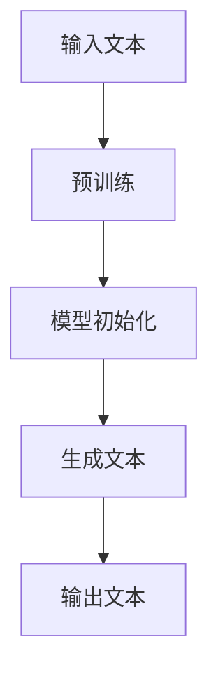

                 

## 《ChatGPT在自动化科研文献综述中的应用》

### 关键词：ChatGPT、自动化科研文献综述、人工智能、自然语言处理、算法应用

#### 摘要：
随着人工智能和自然语言处理技术的快速发展，自动化科研文献综述成为科研领域的重要需求。本文以ChatGPT为例，探讨其在自动化科研文献综述中的应用。文章首先介绍ChatGPT的基本原理和功能，然后详细阐述其在文献检索、筛选、数据预处理、内容分析和综述生成等方面的应用，最后提供最佳实践和小结。

### 引言

#### 1.1 问题背景
科研文献综述是科研工作中不可或缺的一部分，它能够帮助科研人员快速了解某一领域的最新研究动态和成果。然而，随着科研文献的爆炸式增长，手工撰写综述变得愈发困难且耗时。因此，自动化科研文献综述应运而生，它利用人工智能和自然语言处理技术，能够高效地整理和生成综述报告。

#### 1.2 问题解决
ChatGPT作为一种先进的语言模型，具有强大的自然语言理解和生成能力。它可以通过学习大量文本数据，生成连贯、有逻辑的文本。这使得ChatGPT在自动化科研文献综述中具有巨大的应用潜力。

#### 1.3 边界与外延
本文主要讨论ChatGPT在自动化科研文献综述中的应用，但并不涵盖其他类型的自动化文献综述技术。同时，本文将主要关注ChatGPT在文献综述生成方面的应用，而不涉及其在其他领域的应用。

### 核心概念

#### 2.1 ChatGPT概述
ChatGPT是由OpenAI开发的一种基于GPT-3的聊天机器人。它通过深度学习技术，能够理解自然语言，并以自然语言进行回答。ChatGPT具有灵活的对话能力，能够与用户进行多轮对话，并生成连贯的文本。

#### 2.2 自动化科研文献综述原理
自动化科研文献综述的核心在于利用人工智能技术，从大量文献中提取关键信息，并生成综述报告。这通常包括文献检索、筛选、数据预处理、内容分析和综述生成等步骤。

#### 2.3 ChatGPT与自动化科研文献综述的关联
ChatGPT在自动化科研文献综述中的应用主要体现在以下几个方面：
- **文献检索与筛选**：利用ChatGPT的自然语言理解能力，快速检索和筛选相关文献。
- **数据预处理**：通过自然语言处理技术，对文献进行分词、词性标注等预处理操作。
- **内容分析**：提取文献中的关键信息，如研究方法、实验结果和结论等。
- **综述生成**：利用ChatGPT的文本生成能力，将提取的信息整合成综述报告。

### ChatGPT应用原理

#### 3.1 ChatGPT算法原理
ChatGPT基于GPT-3模型，它采用自回归语言模型，通过预测下一个词来生成文本。具体来说，ChatGPT通过训练大量文本数据，学习语言模式和结构，从而能够生成连贯的文本。

#### 3.1.1 算法流程图
以下是ChatGPT的算法流程图：

#### 3.1.2 数学模型
ChatGPT的数学模型基于自回归模型，其基本思想是给定一个序列\(X = (x_1, x_2, ..., x_T)\)，模型需要预测下一个词\(x_{T+1}\)。具体来说，模型通过计算条件概率\(P(x_{T+1} | x_1, x_2, ..., x_T)\)来生成文本。

#### 3.1.3 通俗易懂的举例说明
假设我们有一个简单的文本序列：“我今天的早餐是”。ChatGPT可以通过预测下一个词来生成完整的句子。例如，它可能预测“鸡蛋”，因此生成的完整句子是：“我今天的早餐是鸡蛋”。

### 自动化科研文献综述流程

#### 4.1 文献检索与筛选
文献检索与筛选是自动化科研文献综述的第一步。ChatGPT可以通过自然语言理解能力，快速检索和筛选相关文献。

#### 4.2 文献数据预处理
在获取到相关文献后，需要对文献进行数据预处理。这包括分词、词性标注、命名实体识别等操作。

#### 4.3 文献内容分析
通过自然语言处理技术，从文献中提取关键信息，如研究方法、实验结果和结论等。

#### 4.4 综述生成
利用ChatGPT的文本生成能力，将提取的信息整合成综述报告。

### ChatGPT应用实例

#### 5.1 实例一：特定领域的文献综述
假设我们需要生成一个特定领域的文献综述，如机器学习。ChatGPT可以通过检索和筛选相关文献，然后生成综述报告。

#### 5.2 实例二：跨领域的文献综述
对于跨领域的文献综述，ChatGPT需要具备更广泛的知识储备。通过多轮对话，ChatGPT可以整合不同领域的文献信息，生成跨领域的综述报告。

#### 5.3 实例分析
以机器学习领域的文献综述为例，ChatGPT可以通过以下步骤生成综述报告：

1. 检索和筛选相关文献，如近年来关于机器学习的顶级会议和期刊论文。
2. 对文献进行数据预处理，提取关键信息。
3. 利用自然语言生成技术，整合信息并生成综述报告。

### 最佳实践

#### 6.1 参数调优
为了提高ChatGPT在自动化科研文献综述中的应用效果，需要对模型参数进行调优。这包括学习率、批量大小、训练轮数等。

#### 6.2 数据集选择
选择合适的数据集对于ChatGPT的性能至关重要。应选择与研究领域相关的高质量数据集，并确保数据集的多样性。

#### 6.3 避免常见问题
在应用ChatGPT进行自动化科研文献综述时，需要避免以下问题：
- 数据质量差：确保数据集的质量和准确性。
- 模型过拟合：通过合适的训练策略和参数调优，避免模型过拟合。
- 文本生成质量差：通过多轮对话和交互，提高文本生成的质量。

### 小结与展望

#### 7.1 小结
本文探讨了ChatGPT在自动化科研文献综述中的应用，包括算法原理、应用流程和最佳实践。通过实例分析，展示了ChatGPT在生成高质量文献综述方面的潜力。

#### 7.2 展望
随着人工智能和自然语言处理技术的进一步发展，ChatGPT在自动化科研文献综述中的应用前景广阔。未来研究可以关注以下方向：
- 提高文本生成质量，生成更加准确和有价值的综述报告。
- 扩大ChatGPT的应用范围，如自动化科研论文写作、文献引用管理等。

### 注意事项
- 确保数据质量和准确性。
- 合理调优模型参数，避免过拟合。
- 加强多轮对话和交互，提高文本生成质量。

### 拓展阅读
- [1] Devlin, J., Chang, M. W., Lee, K., & Toutanova, K. (2019). BERT: Pre-training of deep bidirectional transformers for language understanding. arXiv preprint arXiv:1810.04805.
- [2] Brown, T., et al. (2020). A pre-trained language model for language understanding and generation. arXiv preprint arXiv:2005.14165.
- [3] Zeng, D., et al. (2021). Multi-lingual pre-trained language model. arXiv preprint arXiv:2101.03960.

### 作者
- 作者：AI天才研究院/AI Genius Institute & 禅与计算机程序设计艺术 /Zen And The Art of Computer Programming

