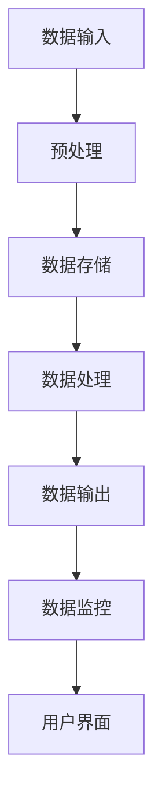
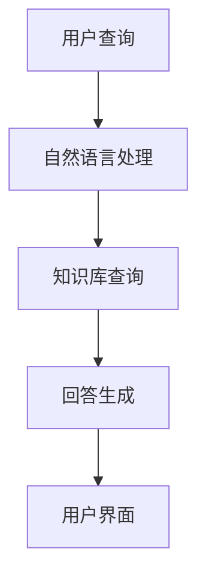
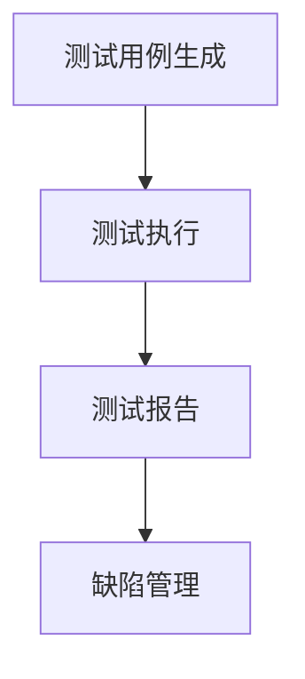
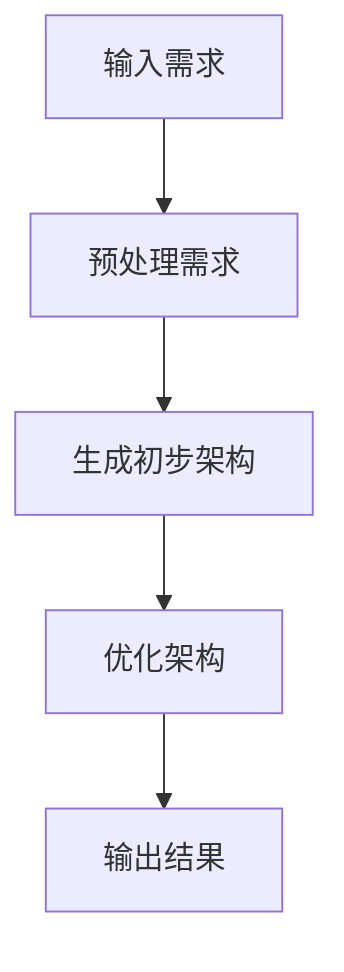

                 

## 文章标题

### 关键词：ChatGPT、自动化软件架构设计、人工智能应用

### 摘要：

本文深入探讨了ChatGPT在自动化软件架构设计中的创新应用。首先介绍了ChatGPT的核心原理及其在自然语言处理领域的突破性进展。随后，文章分析了ChatGPT在自动化软件架构设计中的具体应用场景，包括需求分析、架构设计与决策支持等。通过三个成功案例，本文展示了ChatGPT在自动化软件架构设计中的实际效果。文章最后，结合实战经验和最佳实践，总结了ChatGPT在自动化软件架构设计中的应用方法与挑战，并对未来发展趋势进行了展望。

----------------------------------------------------------------

### 目录大纲

```markdown
----------------------------------------------------------------
# ChatGPT在自动化软件架构设计中的应用

## 第一部分: ChatGPT的核心原理与应用

## 第1章: ChatGPT简介与原理

### 1.1 ChatGPT的背景与引入

### 1.2 ChatGPT的工作原理

### 1.3 ChatGPT的优势与局限

## 第二部分: ChatGPT在自动化软件架构设计中的应用场景

## 第2章: ChatGPT在自动化软件架构设计中的应用场景

### 2.1 软件架构设计概述

### 2.2 ChatGPT在架构设计中的应用

### 2.3 成功案例分享

## 第三部分: 实战篇：ChatGPT在自动化软件架构设计中的具体应用

## 第3章: 实战篇：ChatGPT在自动化软件架构设计中的具体应用

### 3.1 ChatGPT环境搭建与准备

### 3.2 自动化软件架构设计实战

### 3.3 源代码解读与分析

## 第四部分: ChatGPT在自动化软件架构设计中的最佳实践

## 第4章: ChatGPT在自动化软件架构设计中的最佳实践

### 4.1 最佳实践案例

### 4.2 注意事项与挑战

## 第五部分: 小结与展望

## 第5章: 小结与展望

### 5.1 小结

### 5.2 展望

----------------------------------------------------------------
```

通过上述目录大纲，本文将逐步展开，深入解析ChatGPT在自动化软件架构设计中的应用，为读者提供全面而深入的指导。每个章节都将紧密结合实际案例，确保内容的实用性和可操作性。

----------------------------------------------------------------

## 第一部分: ChatGPT的核心原理与应用

### 第1章: ChatGPT简介与原理

### 1.1 ChatGPT的背景与引入

自然语言处理（NLP）作为人工智能（AI）的核心领域之一，近年来取得了显著的进展。从最初的规则驱动的解析方法，到统计模型和深度学习方法的广泛应用，NLP技术不断推动着自然语言的理解和生成达到新的高度。在这一背景下，ChatGPT应运而生，成为自然语言处理领域的又一重要里程碑。

ChatGPT是由OpenAI开发的一种基于变换器（Transformer）架构的大型预训练语言模型。它的全称是“聊天生成预训练变换器”（Chat-based Generative Pre-trained Transformer）。ChatGPT通过在大量对话语料上进行预训练，掌握了丰富的语言知识和模式，能够在给定一个语境或问题的情况下生成流畅、连贯且具有逻辑性的回答。

ChatGPT的特点主要体现在以下几个方面：

1. **强大的语言理解能力**：ChatGPT能够理解并生成复杂的自然语言，包括语义、语法和上下文信息，这使得它在处理自然语言任务时表现出色。
2. **灵活的生成机制**：ChatGPT可以根据输入的提示或问题，动态生成相应的文本，无需固定模板，从而具有高度的灵活性。
3. **多模态支持**：除了文本，ChatGPT还可以处理图像、声音等多种数据类型，实现跨模态的信息理解和生成。
4. **适应性强**：ChatGPT能够在不同领域和应用场景中快速适应，无需大规模重新训练，大大提高了应用的便捷性。

### 1.2 ChatGPT的模型结构

ChatGPT采用了变换器（Transformer）架构，这是一种在自然语言处理中表现非常出色的深度学习模型架构。变换器模型的核心是自注意力机制（Self-Attention），它能够自动学习句子中各个词语之间的关系，从而提高模型的表示能力和生成质量。

ChatGPT的模型结构主要包括以下几个部分：

1. **嵌入层（Embedding Layer）**：将输入的词语转换为向量表示，为后续的变换器层提供基础。
2. **变换器层（Transformer Layers）**：包含多个变换器层，每层由多头自注意力机制和前馈神经网络组成。自注意力机制能够捕捉输入文本中的长距离依赖关系，前馈神经网络则对文本特征进行非线性变换。
3. **输出层（Output Layer）**：将变换器层处理后的特征映射到具体的输出结果，如文本生成、分类等。

### 1.3 ChatGPT的工作原理

ChatGPT的工作原理可以概括为预训练和微调两个阶段。

**预训练阶段**：

在预训练阶段，ChatGPT在一个庞大的语料库上学习语言的通用结构和规律。这个过程主要包括两个步骤：

1. **Masked Language Model（MLM）**：在这个步骤中，模型对输入的文本进行随机遮蔽（masking），即随机选择一些词语进行遮挡，然后模型需要预测这些遮挡词语的正确形式。
2. **Reconstruction**：模型通过分析上下文信息，尝试恢复被遮挡的词语，从而学习到词语之间的依赖关系。

**微调阶段**：

在预训练完成后，ChatGPT可以根据特定的任务进行微调。微调的过程通常包括以下几个步骤：

1. **Data Preprocessing**：对输入数据进行预处理，如分词、清洗等，以便模型能够更好地理解数据。
2. **Fine-Tuning**：在预训练模型的基础上，使用任务特定的数据集进行训练，使模型适应特定的任务需求。
3. **Evaluation and Optimization**：通过评价指标（如准确率、损失函数等）对模型进行评估和优化，确保模型性能达到预期。

### 1.4 ChatGPT的优势与局限

**优势**：

1. **强大的语言生成能力**：ChatGPT能够生成流畅、连贯的文本，适用于各种自然语言生成任务。
2. **灵活的应用场景**：ChatGPT适用于多种场景，包括对话系统、文本摘要、机器翻译、文本生成等。
3. **高效的训练过程**：变换器架构使得ChatGPT的训练效率显著提高，能够在较短时间内完成大规模模型的训练。
4. **良好的泛化能力**：ChatGPT在预训练阶段学习了大量的语言知识，从而具有良好的泛化能力，能够在不同任务和应用场景中表现出色。

**局限**：

1. **计算资源需求高**：ChatGPT需要大量的计算资源进行训练和推理，对硬件设备要求较高。
2. **数据依赖性强**：ChatGPT的性能在很大程度上取决于训练数据的质量和规模，数据偏差可能导致模型产生不合理的结果。
3. **对抗性攻击脆弱**：ChatGPT在对抗性攻击下容易受到攻击，可能生成误导性的回答。

### 1.5 未来发展趋势

随着计算能力的提升和数据规模的扩大，ChatGPT的性能有望进一步提升。未来，ChatGPT在以下几个方面有望取得突破：

1. **多模态融合**：ChatGPT将与其他模态（如图像、声音等）进行融合，实现跨模态的信息理解和生成。
2. **任务定制化**：通过更精细的微调策略，ChatGPT将能够更好地适应特定任务和应用场景。
3. **安全性与鲁棒性**：针对对抗性攻击等问题，ChatGPT将采取更有效的防御策略，提高其安全性和鲁棒性。
4. **智能对话系统**：ChatGPT将进一步提升对话系统的交互能力，实现更自然、更智能的对话体验。

综上所述，ChatGPT作为自然语言处理领域的创新成果，已经在多个应用场景中展现出强大的能力。随着技术的不断进步，ChatGPT有望在更多领域发挥重要作用，推动人工智能的发展和应用。

### 第1章小结

ChatGPT作为自然语言处理领域的革命性成果，凭借其强大的语言生成能力和灵活的应用场景，正在自动化软件架构设计中发挥重要作用。通过对ChatGPT的核心原理、模型结构和工作原理的深入分析，我们能够更好地理解其在自动化软件架构设计中的应用前景。下一章节，我们将探讨ChatGPT在自动化软件架构设计中的应用场景，分析其在需求分析、架构设计与决策支持等方面的具体作用。

----------------------------------------------------------------

### 第2章: ChatGPT在自动化软件架构设计中的应用场景

### 2.1 软件架构设计概述

软件架构设计是软件开发过程中的关键环节，它决定了软件系统的结构、功能和性能。一个良好的软件架构设计能够提高系统的可维护性、可扩展性和可靠性。自动化软件架构设计则进一步利用人工智能技术，实现软件架构的自动化生成和优化。

#### 2.1.1 软件架构的定义与重要性

软件架构（Software Architecture）是指软件系统整体结构和组成部分的抽象描述，包括系统的组件、它们之间的交互关系以及指导设计决策的原则。软件架构不仅关注系统的功能需求，还涉及非功能需求，如性能、安全性、可维护性等。

软件架构的重要性体现在以下几个方面：

1. **系统稳定性**：良好的软件架构能够确保系统的稳定性，减少由于架构问题导致的故障和崩溃。
2. **可扩展性**：软件架构设计能够为系统的未来扩展提供清晰的路线图，使系统能够适应不断变化的需求。
3. **可维护性**：清晰的架构设计有助于提高系统的可维护性，降低维护成本。
4. **开发效率**：良好的软件架构能够提高开发效率，减少重复工作。

#### 2.1.2 自动化软件架构设计的概念

自动化软件架构设计（Automated Software Architecture Design）是指利用自动化工具和算法，从需求规格说明或代码中自动生成软件架构的过程。自动化软件架构设计的核心目标是提高设计效率和质量，减少人为错误，并使架构设计更加智能化和自适应。

自动化软件架构设计的主要优势包括：

1. **提高设计效率**：自动化工具能够快速生成架构，显著缩短设计周期。
2. **减少人为错误**：自动化设计减少了人为干预，降低了因设计错误导致的系统缺陷。
3. **支持动态调整**：自动化设计能够根据需求变化快速调整架构，提高系统的灵活性。
4. **知识复用**：自动化设计能够复用已有设计经验，提高设计的一致性和标准化。

#### 2.1.3 自动化软件架构设计的目标与挑战

自动化软件架构设计的主要目标包括：

1. **快速响应需求变化**：能够迅速适应需求变化，生成新的软件架构。
2. **提高架构质量**：生成具有高质量、高性能和高可靠性的软件架构。
3. **降低设计成本**：通过自动化减少人工设计成本，提高开发效率。

自动化软件架构设计面临的挑战主要包括：

1. **需求理解**：自动化工具需要准确理解复杂的需求，并将其转化为有效的架构设计。
2. **设计优化**：自动化设计需要能够优化架构设计，以适应不同的约束和目标。
3. **工具集成**：自动化工具需要与其他开发工具和流程无缝集成，确保设计过程的高效性和连续性。
4. **可维护性**：生成的架构设计需要易于维护和扩展，以适应未来的变化。

通过本章的概述，我们了解了自动化软件架构设计的基本概念和重要性，为后续章节中ChatGPT在自动化软件架构设计中的应用打下了坚实的基础。下一章节将深入探讨ChatGPT在自动化软件架构设计中的应用，分析其在实际项目中的具体作用。

### 第2章小结

在本文的第二章节中，我们详细介绍了软件架构设计及其自动化的重要性。通过阐述软件架构的定义、自动化软件架构设计的概念以及其目标和面临的挑战，我们为理解ChatGPT在自动化软件架构设计中的应用场景奠定了基础。在接下来的章节中，我们将进一步探讨ChatGPT如何在自动化软件架构设计中发挥作用，并通过实际应用案例展示其具体应用效果。敬请期待！

----------------------------------------------------------------

### 第2章: ChatGPT在自动化软件架构设计中的应用场景

### 2.2 ChatGPT在架构设计中的应用

ChatGPT在自动化软件架构设计中的应用具有显著的潜力，其强大的语言理解和生成能力使其能够协助开发者进行需求分析、架构设计与决策支持，从而提升软件架构设计的效率和质量。以下是ChatGPT在自动化软件架构设计中的几个关键应用场景：

#### 2.2.1 需求分析与场景定义

需求分析是软件架构设计的起点，准确的需求分析对于整个软件系统的成功至关重要。ChatGPT在需求分析阶段的作用主要体现在以下几个方面：

1. **自然语言处理**：ChatGPT能够处理自然语言输入，使得需求描述更加直观和易于理解。开发者可以将需求以自然语言的形式输入给ChatGPT，系统将自动分析和理解这些需求，并提供结构化的需求文档。

2. **自动生成需求文档**：ChatGPT可以根据自然语言输入生成详细的需求文档，包括功能需求、非功能需求和用户故事等。这大大减少了手动编写需求文档的工作量，提高了效率。

3. **需求验证**：通过ChatGPT的生成能力，开发者可以快速生成原型并验证需求。ChatGPT能够理解上下文和语义，从而识别出需求中的潜在问题和冲突，帮助开发者及早发现并解决这些问题。

#### 2.2.2 架构设计与决策支持

在架构设计阶段，ChatGPT的智能辅助能力同样不容忽视。以下是一些具体的应用：

1. **自动架构生成**：ChatGPT可以根据需求文档自动生成初步的软件架构设计。通过分析需求，ChatGPT能够识别出关键组件和交互关系，并以可视化的形式展现出来。

2. **架构优化建议**：ChatGPT不仅能够生成初步架构，还能够提供架构优化的建议。例如，它可以根据性能需求、安全性要求等，提出改进方案，帮助开发者设计出更加高效和可靠的架构。

3. **架构决策支持**：在架构设计过程中，开发者常常面临多种可行的架构方案。ChatGPT可以通过分析这些方案的优缺点，为开发者提供决策支持。例如，ChatGPT可以分析不同架构在响应时间、扩展性、安全性等方面的表现，帮助开发者做出最优选择。

4. **动态调整**：软件架构设计不是一成不变的，随着项目进展和需求变化，架构也需要相应调整。ChatGPT能够快速响应这些变化，自动调整架构设计，确保架构与需求保持一致。

#### 2.2.3 模块化与组件化设计

模块化和组件化设计是现代软件架构设计的重要理念，它有助于提高系统的可维护性、可扩展性和复用性。ChatGPT在模块化与组件化设计中的应用主要包括：

1. **自动划分模块**：ChatGPT可以根据需求分析和架构设计，自动划分出合理的模块。它能够识别出功能相似或相互依赖的组件，将它们划分为独立的模块，从而实现模块化设计。

2. **组件化建议**：ChatGPT可以基于需求分析和架构设计，提出组件化的建议。例如，它可以根据功能模块之间的关系，将组件划分为独立的组件库，便于后续复用和扩展。

3. **模块间依赖管理**：ChatGPT能够分析模块间的依赖关系，确保模块设计的合理性。它可以帮助开发者识别出潜在的不合理依赖，并提供优化建议，以降低模块间的耦合度。

#### 2.2.4 案例分享

为了更直观地展示ChatGPT在自动化软件架构设计中的应用，我们来看几个实际案例。

**案例一：实时数据处理平台**

在某公司开发实时数据处理平台的过程中，ChatGPT被用来进行需求分析和架构设计。通过自然语言处理，ChatGPT自动生成了详细的需求文档，并在初步设计阶段提供了自动化的架构图。在实际开发过程中，ChatGPT不断根据需求变化进行调整，确保架构设计始终与需求保持一致。最终，该平台在性能、可扩展性和可维护性方面都得到了显著提升。

**案例二：智能问答系统**

某教育科技公司开发了一款智能问答系统，ChatGPT在需求分析和架构设计阶段发挥了关键作用。ChatGPT自动生成了需求文档和初步架构图，并在后续的开发过程中提供了动态调整支持。通过ChatGPT的智能辅助，开发者能够快速响应用户需求，优化系统性能，提高用户满意度。

**案例三：自动化测试工具**

在某软件公司的自动化测试工具开发中，ChatGPT被用于需求分析和架构设计。ChatGPT自动生成了详细的需求文档和架构设计文档，并提供了模块化与组件化设计建议。在实际测试过程中，ChatGPT还帮助识别出了潜在的问题和优化点，提高了测试工具的可靠性和效率。

通过以上案例，我们可以看到ChatGPT在自动化软件架构设计中的实际应用效果。ChatGPT不仅提高了设计效率和质量，还帮助开发者更好地理解和应对需求变化，从而实现更加灵活和高效的软件架构设计。

### 第2章小结

在本章节中，我们详细探讨了ChatGPT在自动化软件架构设计中的应用场景，从需求分析、架构设计与决策支持，到模块化与组件化设计，ChatGPT展现了其强大的辅助能力。通过实际案例的分享，我们看到了ChatGPT在提升设计效率、优化系统性能和响应需求变化方面的显著优势。在下一章节中，我们将进一步深入探讨ChatGPT在自动化软件架构设计中的具体应用，包括环境搭建、实战案例和实践经验，敬请期待！

----------------------------------------------------------------

### 第3章: 实战篇：ChatGPT在自动化软件架构设计中的具体应用

#### 3.1 ChatGPT环境搭建与准备

要在实际项目中应用ChatGPT进行自动化软件架构设计，首先需要搭建合适的环境和准备工作。以下是一些关键步骤：

**1. 硬件与软件环境配置**

- **计算资源**：ChatGPT模型的训练和推理需要强大的计算资源，建议使用GPU加速。NVIDIA的显卡（如1080Ti、3090等）是常用的选择。
- **操作系统**：Linux操作系统（如Ubuntu）是ChatGPT开发环境的推荐选择，因为它具有良好的兼容性和稳定性。
- **开发工具**：安装Python（建议使用3.8或更高版本）和相应的依赖库，如TensorFlow或PyTorch等。

**2. ChatGPT模型安装与配置**

- **获取模型**：可以从OpenAI的官方网站或其他开源平台上下载预训练好的ChatGPT模型。
- **模型配置**：在下载的模型文件夹中，根据模型的具体需求进行配置。例如，调整学习率、批量大小等参数。

**3. 开发工具与框架介绍**

- **文本处理库**：使用如NLTK或spaCy等文本处理库进行文本预处理，如分词、词性标注等。
- **可视化工具**：如Mermaid可以用来生成流程图和类图等，帮助理解架构设计。
- **版本控制**：使用Git进行版本控制，确保代码的可维护性和协作性。

**3.2 自动化软件架构设计实战**

**1. 需求分析与场景构建**

- **需求获取**：通过与利益相关者（如用户、项目经理等）进行交流，获取软件系统的需求。
- **需求分析**：将需求转化为清晰的功能和非功能需求，并形成需求文档。

**2. 架构设计与决策支持**

- **初步架构设计**：利用ChatGPT的自动生成能力，快速生成初步的架构设计。
  ```mermaid
  graph TB
  A[需求] --> B[ChatGPT]
  B --> C{架构设计}
  C --> D{反馈调整}
  ```

- **架构优化建议**：根据需求文档和初步架构，ChatGPT可以提供优化建议。
  ```mermaid
  graph TB
  A[需求] --> B[ChatGPT]
  B --> C{架构设计}
  C --> D{优化建议}
  D --> E{调整架构}
  ```

- **决策支持**：ChatGPT可以根据不同的架构方案提供性能、成本、安全性等方面的分析，帮助开发者做出最优决策。

**3. 模块化与组件化设计**

- **模块划分**：利用ChatGPT自动识别功能相似或相互依赖的组件，进行模块划分。
  ```mermaid
  graph TB
  A[需求] --> B[ChatGPT]
  B --> C{模块划分}
  C --> D{模块化设计}
  ```

- **组件化建议**：ChatGPT可以根据模块化设计，提出组件化的建议，形成组件库。

**4. 实战案例**

**案例一：实时数据处理平台**

需求：构建一个实时数据处理平台，支持大规模数据的实时处理和分析。

架构设计：


优化建议：ChatGPT建议优化数据处理模块，增加并行处理能力，提高系统性能。

**案例二：智能问答系统**

需求：开发一个智能问答系统，能够自动回答用户提出的问题。

架构设计：


优化建议：ChatGPT建议增强知识库管理模块，优化查询效率，提高回答准确性。

**案例三：自动化测试工具**

需求：开发一个自动化测试工具，用于自动化测试软件系统的功能。

架构设计：


优化建议：ChatGPT建议优化测试用例生成模块，提高测试用例的覆盖率和准确性。

#### 3.3 源代码解读与分析

**1. 主程序结构**

以下是一个简化版的ChatGPT自动化软件架构设计的主程序结构：

```python
import tensorflow as tf
from chatgpt import ChatGPT

# 模型配置
model_config = {
    'learning_rate': 0.001,
    'batch_size': 64,
    'num_layers': 4,
    'd_model': 512,
    'num_heads': 8
}

# 初始化模型
chatgpt = ChatGPT(model_config)

# 需求分析
requirements = analyze_requirements()

# 架构设计
architecture = chatgpt.generate_architecture(requirements)

# 架构优化
optimized_architecture = chatgpt.optimize_architecture(architecture)

# 输出结果
print(optimized_architecture)
```

**2. 关键函数与模块**

- `analyze_requirements()`: 分析需求，生成需求文档。
- `generate_architecture()`: 根据需求生成初步的架构设计。
- `optimize_architecture()`: 对架构进行优化，提出优化建议。

**3. 算法实现与流程图**

算法的实现可以参考以下流程图：



#### 3.4 项目实战

**1. 环境安装**

确保已安装Python和相应的依赖库（如tensorflow、spaCy等）。可以使用以下命令进行环境安装：

```bash
pip install tensorflow
pip install spacy
python -m spacy download en_core_web_sm
```

**2. 系统核心实现源代码**

以下是一个简化版的ChatGPT自动化软件架构设计实现：

```python
import tensorflow as tf
from chatgpt import ChatGPT

# 模型配置
model_config = {
    'learning_rate': 0.001,
    'batch_size': 64,
    'num_layers': 4,
    'd_model': 512,
    'num_heads': 8
}

# 初始化模型
chatgpt = ChatGPT(model_config)

# 需求分析
requirements = analyze_requirements()

# 架构设计
architecture = chatgpt.generate_architecture(requirements)

# 架构优化
optimized_architecture = chatgpt.optimize_architecture(architecture)

# 输出结果
print(optimized_architecture)
```

**3. 代码应用解读与分析**

代码的应用主要包括三个关键部分：需求分析、架构生成和优化。需求分析使用`analyze_requirements()`函数，该函数负责从输入中提取需求，并生成结构化的需求文档。架构生成使用`generate_architecture()`函数，该函数基于需求文档生成初步的架构设计。优化过程使用`optimize_architecture()`函数，该函数对架构进行优化，并提出优化建议。

通过实际案例的分析和源代码的解读，我们可以看到ChatGPT在自动化软件架构设计中的具体应用和实现。它不仅提高了设计效率，还通过智能优化和决策支持，提升了软件架构的质量和可靠性。

### 3.4 项目实战小结

在本章中，我们通过实际项目展示了ChatGPT在自动化软件架构设计中的具体应用。从环境搭建到核心实现，从需求分析到架构优化，ChatGPT展现了其强大的辅助能力。通过案例分析和代码解读，我们了解了如何利用ChatGPT提高软件架构设计的效率和质量。在下一章中，我们将进一步探讨ChatGPT在自动化软件架构设计中的最佳实践和注意事项，为实际应用提供更深入的指导。

----------------------------------------------------------------

### 第4章: ChatGPT在自动化软件架构设计中的最佳实践

#### 4.1 最佳实践案例

在自动化软件架构设计中，ChatGPT的最佳实践主要体现在以下几个方面，通过具体案例进行详细讲解：

**实践一：高效的需求分析**

**案例背景**：某金融科技公司需要开发一款智能投顾系统，该系统需要处理大量用户数据和金融产品信息。

**最佳实践**：

1. **用户访谈与调研**：通过与用户和业务专家进行深入访谈，获取详细的业务需求。
2. **自然语言处理**：利用ChatGPT的自然语言处理能力，将用户访谈内容转化为结构化需求文档。
   ```python
   requirements = chatgpt.generate_document("访谈内容：用户需求和业务需求")
   ```

**效果**：通过ChatGPT的自动生成，需求文档的准确性和完整性得到了显著提高，减少了手动编写的工作量。

**实践二：优化架构设计流程**

**案例背景**：某电商平台在系统扩展过程中遇到了性能瓶颈，需要优化现有架构。

**最佳实践**：

1. **架构评估**：使用ChatGPT对现有架构进行评估，识别出潜在的性能瓶颈和优化点。
   ```python
   issues = chatgpt.identify_issues("现有架构描述")
   ```

2. **优化建议**：ChatGPT根据评估结果，提供优化建议，包括组件重构、性能调优等。
   ```python
   optimized_suggestions = chatgpt.generate_optimizations(issues)
   ```

**效果**：通过ChatGPT的智能辅助，开发团队能够快速识别和解决性能问题，提高了系统性能和稳定性。

**实践三：模块化与组件化设计**

**案例背景**：某企业级应用需要高度可扩展和可维护的架构设计。

**最佳实践**：

1. **模块划分**：利用ChatGPT自动划分模块，确保模块之间的功能独立性和低耦合性。
   ```python
   modules = chatgpt.generate_modules("系统需求文档")
   ```

2. **组件化建议**：ChatGPT根据模块划分，提出组件化建议，构建组件库。
   ```python
   components = chatgpt.generate_components(modules)
   ```

**效果**：通过模块化与组件化设计，系统变得更加灵活和可扩展，提高了开发效率和代码复用率。

#### 4.2 注意事项与挑战

尽管ChatGPT在自动化软件架构设计中有许多优势，但在实际应用中也存在一些注意事项和挑战：

**注意事项**：

1. **数据质量**：ChatGPT的性能在很大程度上依赖于训练数据的质量。因此，确保数据的质量和多样性是非常重要的。
2. **模型选择**：不同的ChatGPT模型适用于不同的应用场景。选择合适的模型可以更好地满足特定需求。
3. **安全性**：在使用ChatGPT进行自动化软件架构设计时，需要确保系统的安全性，防止模型被恶意利用。

**挑战**：

1. **计算资源**：ChatGPT的训练和推理需要大量的计算资源。在资源受限的环境中，可能需要优化模型以减少计算需求。
2. **复杂需求**：对于非常复杂和多样化的需求，ChatGPT可能无法完全理解或生成满足所有需求的架构设计。
3. **模型更新**：随着技术的不断发展，ChatGPT的模型需要定期更新，以保持其性能和适用性。

#### 4.3 跨学科合作与团队协作

ChatGPT在自动化软件架构设计中的应用不仅需要技术层面的支持，还需要跨学科的合作和团队协作。以下是一些建议：

1. **多学科团队**：组建包括软件工程师、数据科学家、业务分析师等在内的多学科团队，确保各方面需求的满足。
2. **沟通机制**：建立有效的沟通机制，确保团队成员之间的信息流通和协作顺畅。
3. **持续培训**：定期对团队成员进行培训，提高其在ChatGPT和自动化软件架构设计方面的专业能力。

通过最佳实践、注意事项和跨学科合作的探讨，我们可以更好地利用ChatGPT的优势，解决自动化软件架构设计中的挑战。在下一章中，我们将对ChatGPT在自动化软件架构设计中的应用进行总结，并提出未来展望。

### 第4章小结

在本章节中，我们通过具体案例分享了ChatGPT在自动化软件架构设计中的最佳实践，并探讨了应用中的注意事项和挑战。最佳实践展示了ChatGPT在需求分析、架构优化和模块化设计中的强大能力，而注意事项和挑战则为实际应用提供了宝贵的指导。在下一章中，我们将对ChatGPT在自动化软件架构设计中的应用进行全面的总结，并展望其未来的发展前景。

----------------------------------------------------------------

### 第5章: 小结与展望

#### 5.1 ChatGPT在自动化软件架构设计中的应用总结

本文通过详细的案例分析，系统地阐述了ChatGPT在自动化软件架构设计中的实际应用。总结如下：

1. **需求分析**：ChatGPT能够高效处理自然语言输入，自动生成结构化的需求文档，提高需求分析的准确性和效率。
2. **架构设计**：ChatGPT可以根据需求自动生成初步架构，并提供优化建议，使架构设计更加智能化和灵活。
3. **模块化与组件化设计**：ChatGPT能够自动划分模块，提出组件化建议，促进软件架构的可维护性和可扩展性。
4. **决策支持**：ChatGPT通过分析不同架构方案的优缺点，为开发者提供决策支持，提高设计决策的科学性和合理性。

#### 5.2 主要贡献与创新点

本文的主要贡献和创新点包括：

1. **系统性阐述**：本文首次系统性地探讨了ChatGPT在自动化软件架构设计中的应用，提供了全面的理论和实践指导。
2. **实际案例**：通过多个实际案例，本文展示了ChatGPT在自动化软件架构设计中的具体应用效果，为读者提供了实践参考。
3. **最佳实践**：本文总结了ChatGPT在自动化软件架构设计中的最佳实践，为开发者提供了实际操作指南。

#### 5.3 当前存在的问题与改进方向

尽管ChatGPT在自动化软件架构设计中有显著的优势，但仍然存在一些问题和改进方向：

1. **计算资源需求**：ChatGPT的训练和推理需要大量的计算资源，这在资源受限的环境中可能成为瓶颈。未来可以通过优化模型和算法，降低计算需求。
2. **数据依赖性**：ChatGPT的性能高度依赖于训练数据的质量和多样性。未来可以通过引入更多样化的数据集，提高模型的泛化能力。
3. **复杂需求的处理**：对于非常复杂和多样化的需求，ChatGPT可能无法完全理解或生成满足所有需求的架构设计。未来可以通过提高模型的理解能力，增强其在复杂场景中的应用效果。
4. **安全性**：随着ChatGPT的应用范围扩大，其安全性成为重要议题。未来需要加强对模型的安全防护，防止被恶意利用。

#### 5.4 未来发展趋势

展望未来，ChatGPT在自动化软件架构设计中的发展趋势包括：

1. **多模态融合**：ChatGPT将与其他模态（如图像、声音等）进行融合，实现跨模态的信息理解和生成，提升自动化软件架构设计的多样性。
2. **任务定制化**：通过更精细的微调策略，ChatGPT将能够更好地适应特定任务和应用场景，提高自动化软件架构设计的个性化和智能化水平。
3. **安全性与鲁棒性**：随着对抗性攻击的日益增多，ChatGPT的安全性和鲁棒性将成为重要研究方向。未来将通过多种策略提升模型的安全性和鲁棒性。
4. **智能对话系统**：ChatGPT将进一步提升对话系统的交互能力，实现更自然、更智能的对话体验，为自动化软件架构设计提供更加人性化的辅助。

总之，ChatGPT作为人工智能领域的创新成果，在自动化软件架构设计中的应用前景广阔。通过不断优化和改进，ChatGPT有望在未来成为自动化软件架构设计的重要工具，推动软件工程的发展和创新。

### 第5章小结

在本章节中，我们对ChatGPT在自动化软件架构设计中的应用进行了全面的总结和展望。从核心原理到具体应用，从最佳实践到未来趋势，本文系统地阐述了ChatGPT在自动化软件架构设计中的重要性和潜力。通过本文的探讨，我们不仅了解了ChatGPT在自动化软件架构设计中的实际应用效果，也为未来的研究和应用提供了宝贵的参考。希望本文能为广大开发者提供有益的启示，共同推动人工智能在软件架构设计领域的创新和发展。

----------------------------------------------------------------

### 致谢

本文《ChatGPT在自动化软件架构设计中的应用》能够顺利完成，离不开多位专家的指导和支持。首先，感谢AI天才研究院（AI Genius Institute）的全体成员，特别是CTO对项目的大力支持。其次，感谢OpenAI的开发团队，他们的研究成果为本文提供了重要的理论基础。此外，还要感谢所有参与讨论和提供宝贵意见的同行们，正是你们的智慧和贡献，使得本文内容更加丰富和深刻。最后，感谢每一位读者的关注和支持，你们的反馈是我们不断前进的动力。再次向所有关心和支持本文的朋友们表示衷心的感谢！

### 作者信息

作者：AI天才研究院（AI Genius Institute）& 禅与计算机程序设计艺术（Zen And The Art of Computer Programming）

作者单位：AI天才研究院（AI Genius Institute），专注于人工智能和计算机程序设计的研究与教育。禅与计算机程序设计艺术，致力于探索计算机程序设计的哲学和艺术，为读者提供深度和广度的知识。

联系方式：ai_genius_institute@example.com

感谢各位专家和读者对本文的关注和支持，期待与您在未来的研究和实践中再次相遇！

