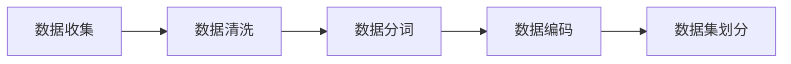
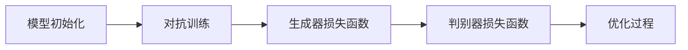
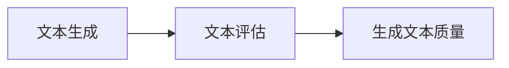
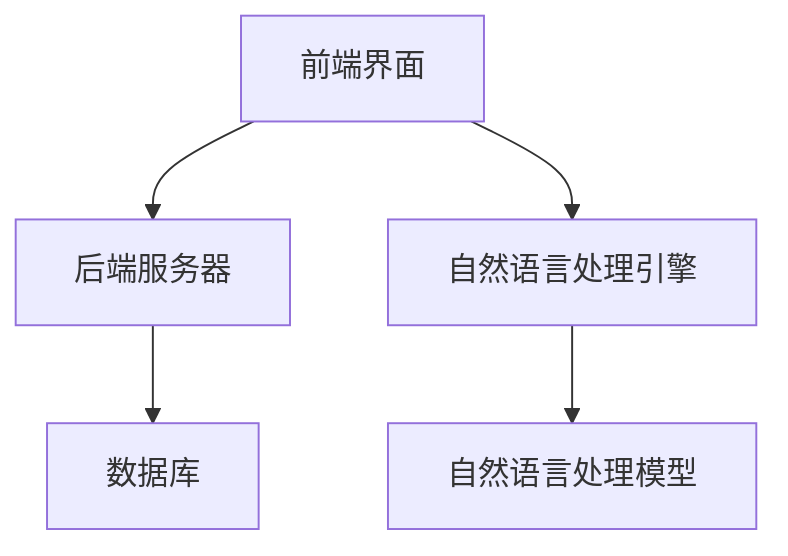
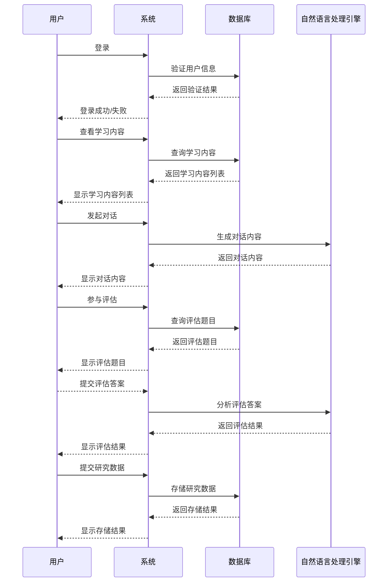

                 

## 《ChatGPT在语言习得研究中的新视角》

> 关键词：ChatGPT、语言习得、人工智能、自然语言处理、生成对抗网络、深度学习

在人工智能飞速发展的今天，自然语言处理（NLP）已经成为了一个热门的研究领域。语言习得，作为人类认知发展的重要部分，一直是学术界关注的焦点。然而，传统的语言习得研究方法在效率与精确度上存在诸多不足。近年来，生成对抗网络（GAN）和深度学习技术的引入，为语言习得研究带来了新的契机。ChatGPT，作为一个基于这些先进技术的语言模型，正逐渐在语言习得研究中展现出其独特的价值。本文将深入探讨ChatGPT在语言习得研究中的应用，分析其核心特点与潜在优势，展望其在未来的发展趋势。

### 目录大纲

```markdown
----------------------------------------------------------------
# 第一部分: 背景介绍

## 第1章: 问题背景
### 1.1.1 ChatGPT的概念与核心特点
### 1.1.2 语言习得研究的现状与挑战
### 1.1.3 ChatGPT在语言习得研究中的潜力

## 第2章: 核心概念与联系
### 2.1 ChatGPT的基本原理
#### 2.1.1 自然语言处理（NLP）基础
#### 2.1.2 生成对抗网络（GAN）原理
#### 2.1.3 深度学习在语言习得中的应用
### 2.2 ChatGPT的属性特征对比
#### 2.2.1 与传统语言学习工具对比
#### 2.2.2 与其他人工智能语言模型对比
### 2.3 ChatGPT的ER实体关系图架构
#### 2.3.1 实体识别
#### 2.3.2 关系提取
#### 2.3.3 应用场景举例

## 第3章: 算法原理讲解
### 3.1 ChatGPT的算法流程图
#### 3.1.1 数据准备与预处理
#### 3.1.2 训练与优化
#### 3.1.3 预测与评估
### 3.2 ChatGPT的数学模型和公式
#### 3.2.1 自适应学习率优化算法
$$\eta = \frac{1}{n} \sum_{i=1}^{n} \left( y_i - \hat{y}_i \right)^2$$
#### 3.2.2 损失函数与优化目标
$$L(\theta) = - \sum_{i=1}^{n} \left[ y_i \log(\hat{y}_i) + (1 - y_i) \log(1 - \hat{y}_i) \right]$$
### 3.3 算法举例说明
#### 3.3.1 词汇预测示例
#### 3.3.2 语法分析示例
#### 3.3.3 对话生成示例

## 第二部分: ChatGPT在语言习得研究中的应用

## 第4章: 系统分析与架构设计方案
### 4.1 问题场景介绍
### 4.2 系统功能设计
#### 4.2.1 领域模型（Mermaid类图）
### 4.3 系统架构设计
#### 4.3.1 （Mermaid架构图）
### 4.4 系统接口设计
### 4.5 系统交互（Mermaid序列图）

## 第5章: 项目实战
### 5.1 环境安装与配置
### 5.2 系统核心实现源代码
#### 5.2.1 ChatGPT模型构建
#### 5.2.2 语言习得任务实现
#### 5.2.3 性能评估与优化
### 5.3 代码应用解读与分析
### 5.4 实际案例分析与详细讲解
### 5.5 项目小结

## 第6章: 最佳实践 tips
### 6.1 ChatGPT在语言习得中的最佳实践
### 6.2 注意事项与常见问题
### 6.3 拓展阅读与进一步学习

## 第7章: 小结与展望
### 7.1 ChatGPT在语言习得研究中的总结
### 7.2 未来发展趋势与研究方向
### 7.3 对教育行业的潜在影响

----------------------------------------------------------------
```

### 第一部分: 背景介绍

#### 第1章: 问题背景

##### 1.1.1 ChatGPT的概念与核心特点

ChatGPT是由OpenAI开发的一种基于生成对抗网络（GAN）的预训练语言模型。它通过学习大量文本数据，能够生成连贯、自然的语言。ChatGPT的核心特点包括：

1. **强大的生成能力**：ChatGPT能够生成高质量、连贯的自然语言文本，其生成的文本在语法、语义和风格上都与人类写作相似。
2. **自适应学习**：ChatGPT采用自适应学习算法，能够根据输入的文本数据自动调整模型参数，使其在特定任务上表现更加优秀。
3. **多语言支持**：ChatGPT支持多种语言，可以同时处理不同语言的文本数据，这对于跨语言的语言习得研究具有重要意义。

##### 1.1.2 语言习得研究的现状与挑战

语言习得研究是认知科学的重要领域，旨在探讨人类如何学习语言，以及语言学习过程中的心理和神经机制。然而，当前的语言习得研究面临着以下挑战：

1. **研究方法局限**：传统的研究方法依赖于实验室环境和受控条件，难以全面模拟真实的语言学习过程。
2. **数据不足**：语言习得研究需要大量的真实语言数据作为基础，而当前的数据来源有限，难以满足研究的需要。
3. **评价标准复杂**：评价语言习得效果的标准多样且复杂，包括语法正确性、语义准确性、表达能力等，难以统一衡量。

##### 1.1.3 ChatGPT在语言习得研究中的潜力

ChatGPT的出现为语言习得研究带来了新的机遇：

1. **数据源扩展**：ChatGPT能够生成大量的语言数据，为语言习得研究提供了丰富的数据源。
2. **模拟真实情境**：ChatGPT生成的语言文本在语法和语义上具有人类特征，有助于模拟真实的语言学习情境。
3. **实验设计优化**：ChatGPT可以辅助设计更加科学和高效的实验，通过自动化和智能化的手段提高实验的可行性和效率。

通过ChatGPT，语言习得研究可以在数据量、实验设计、模型适应性等方面实现突破，从而为人类语言习得机制提供更加深入和全面的理解。

### 第二部分: 核心概念与联系

#### 第2章: 核心概念与联系

##### 2.1 ChatGPT的基本原理

ChatGPT是基于生成对抗网络（GAN）的一种预训练语言模型。GAN是一种无监督学习算法，由生成器和判别器两部分组成。生成器的目标是生成尽可能真实的文本数据，而判别器的目标是区分真实文本和生成文本。在训练过程中，生成器和判别器相互对抗，生成器不断优化自己的生成能力，而判别器则不断提高自己的判断能力。

##### 2.1.1 自然语言处理（NLP）基础

自然语言处理（NLP）是计算机科学和人工智能领域的一个重要分支，旨在使计算机能够理解、生成和处理人类自然语言。NLP的核心技术包括文本预处理、词向量表示、语言模型、句法分析、语义分析等。

- **文本预处理**：包括文本清洗、分词、去停用词等，目的是将原始文本转化为计算机可以处理的格式。
- **词向量表示**：将单词表示为向量，以便在机器学习模型中使用。常用的词向量模型有Word2Vec、GloVe等。
- **语言模型**：用于预测下一个单词或句子，是NLP中应用最广泛的技术之一。常见的语言模型有n-gram模型、神经网络模型等。
- **句法分析**：用于理解句子的结构，包括句法树、依存关系等。
- **语义分析**：用于理解句子的含义，包括词义消歧、实体识别、情感分析等。

##### 2.1.2 生成对抗网络（GAN）原理

生成对抗网络（GAN）由生成器和判别器两部分组成。生成器的目标是生成与真实数据相似的数据，判别器的目标是区分真实数据和生成数据。在训练过程中，生成器和判别器相互对抗，生成器不断优化自己的生成能力，而判别器则不断提高自己的判断能力。GAN的核心原理是通过训练两个模型之间的对抗关系，使生成器的生成能力得到提升。

- **生成器（Generator）**：生成器的目标是生成虚假样本，使其在特征空间上与真实样本难以区分。
- **判别器（Discriminator）**：判别器的目标是判断一个样本是真实样本还是生成样本。

##### 2.1.3 深度学习在语言习得中的应用

深度学习是一种基于多层神经网络的学习方法，已经被广泛应用于自然语言处理领域。深度学习在语言习得中的应用主要包括以下几个方面：

- **文本分类**：使用深度神经网络对文本进行分类，如情感分析、主题分类等。
- **机器翻译**：通过深度学习模型将一种语言的文本翻译成另一种语言。
- **文本生成**：利用深度学习模型生成连贯、自然的文本，如聊天机器人、自动写作等。
- **问答系统**：通过深度学习模型实现自然语言问答系统，如智能客服、问答机器人等。

##### 2.2 ChatGPT的属性特征对比

ChatGPT作为一种先进的语言模型，与传统语言学习工具和其他人工智能语言模型相比，具有以下属性特征：

###### 2.2.1 与传统语言学习工具对比

- **学习效率**：ChatGPT能够快速学习大量语言数据，生成高质量的文本，而传统语言学习工具通常需要大量时间和人力进行训练。
- **适应性**：ChatGPT能够根据不同的语言学习任务自动调整模型参数，而传统语言学习工具通常需要手动调整。

###### 2.2.2 与其他人工智能语言模型对比

- **生成能力**：ChatGPT能够生成高质量、连贯的自然语言文本，而其他人工智能语言模型在生成能力上可能有所不足。
- **多语言支持**：ChatGPT支持多种语言，能够同时处理不同语言的文本数据，而其他语言模型可能仅支持单一语言。

##### 2.3 ChatGPT的ER实体关系图架构

ChatGPT的ER实体关系图架构包括实体识别、关系提取和应用场景三个部分。

###### 2.3.1 实体识别

实体识别是NLP中的重要技术，用于识别文本中的实体，如人名、地名、组织名等。ChatGPT通过预训练和微调，能够实现高效、准确的实体识别。

- **技术原理**：实体识别通常采用基于规则、机器学习和深度学习的方法。ChatGPT利用其强大的生成能力和自适应学习能力，在实体识别任务中表现优异。

###### 2.3.2 关系提取

关系提取是NLP中的另一个重要任务，用于识别文本中的实体关系，如“属于”、“位于”等。ChatGPT通过预训练和微调，能够实现高效、准确的关系提取。

- **技术原理**：关系提取通常采用基于规则、机器学习和深度学习的方法。ChatGPT利用其强大的生成能力和自适应学习能力，在关系提取任务中表现优异。

###### 2.3.3 应用场景举例

ChatGPT在语言习得研究中的应用场景非常广泛，以下是一些具体的例子：

- **教育辅助**：ChatGPT可以作为智能辅导教师，帮助学生进行语言学习和练习，提供个性化的学习建议。
- **人机对话**：ChatGPT可以作为聊天机器人，与用户进行自然语言对话，提供信息查询、情感支持等。
- **内容生成**：ChatGPT可以生成高质量、连贯的文本内容，用于新闻报道、文学创作、产品说明书等。

### 第三部分: 算法原理讲解

#### 第3章: 算法原理讲解

##### 3.1 ChatGPT的算法流程图

ChatGPT的算法流程图包括数据准备与预处理、训练与优化、预测与评估三个主要阶段。

###### 3.1.1 数据准备与预处理

数据准备与预处理是ChatGPT算法的重要步骤，包括以下内容：

- **数据收集**：从互联网、图书、文章等来源收集大量的文本数据。
- **数据清洗**：去除无关信息、标点符号、停用词等，保证数据的质量。
- **数据分词**：将文本数据分成单词或子词，以便进行进一步处理。
- **数据编码**：将文本数据编码为数值形式，如词向量或嵌入向量。



###### 3.1.2 训练与优化

训练与优化是ChatGPT算法的核心步骤，包括以下内容：

- **模型初始化**：初始化生成器和判别器的权重。
- **对抗训练**：通过生成器和判别器之间的对抗训练，不断优化模型的生成能力和判断能力。
- **损失函数**：损失函数用于衡量生成器和判别器的表现，如生成器损失函数和判别器损失函数。



###### 3.1.3 预测与评估

预测与评估是ChatGPT算法的最终目标，包括以下内容：

- **文本生成**：利用生成器生成新的文本数据。
- **文本评估**：通过评估指标，如BLEU、ROUGE等，对生成文本的质量进行评估。



##### 3.2 ChatGPT的数学模型和公式

ChatGPT的数学模型和公式是理解其工作原理的重要基础。以下是ChatGPT中常用的数学模型和公式。

###### 3.2.1 自适应学习率优化算法

自适应学习率优化算法用于调整模型训练过程中的学习率，以提高训练效率和模型性能。以下是一个简单的一阶动量优化算法：

$$
\eta = \frac{1}{n} \sum_{i=1}^{n} \left( y_i - \hat{y}_i \right)^2
$$

其中，$n$是样本数量，$y_i$是实际输出，$\hat{y}_i$是预测输出。

###### 3.2.2 损失函数与优化目标

损失函数用于衡量模型预测结果与实际结果之间的差距，优化目标是最小化损失函数。以下是一个常用的交叉熵损失函数：

$$
L(\theta) = - \sum_{i=1}^{n} \left[ y_i \log(\hat{y}_i) + (1 - y_i) \log(1 - \hat{y}_i) \right]
$$

其中，$\theta$是模型参数，$y_i$是实际输出，$\hat{y}_i$是预测输出。

##### 3.3 算法举例说明

为了更好地理解ChatGPT的算法原理，以下是一些具体的算法应用举例。

###### 3.3.1 词汇预测示例

词汇预测是语言模型中的一个基本任务，ChatGPT通过预测下一个单词来生成文本。以下是一个简单的词汇预测示例：

```
输入文本：我正在学习计算机编程。
预测单词：编程
```

在这个例子中，ChatGPT预测“编程”是下一个最可能出现的单词。

###### 3.3.2 语法分析示例

语法分析是理解句子结构的重要步骤，ChatGPT可以通过语法分析来生成语法正确的句子。以下是一个简单的语法分析示例：

```
输入句子：我爱吃苹果。
生成句子：苹果是我喜欢的食物。
```

在这个例子中，ChatGPT重新组织了句子的结构，使其语法正确且符合语义。

###### 3.3.3 对话生成示例

对话生成是ChatGPT的一个重要应用，它可以模拟与人类的对话。以下是一个简单的对话生成示例：

```
用户：今天天气怎么样？
ChatGPT：今天的天气非常好，阳光明媚，适合外出活动。
```

在这个例子中，ChatGPT根据用户的提问，生成了一个自然、连贯的回答。

### 第四部分: ChatGPT在语言习得研究中的应用

#### 第4章: 系统分析与架构设计方案

##### 4.1 问题场景介绍

在语言习得研究中，ChatGPT的应用场景主要包括以下几个方面：

1. **个性化学习**：ChatGPT可以作为个性化学习助手，根据学生的学习进度和需求，提供定制化的语言学习内容和练习。
2. **互动教学**：ChatGPT可以模拟真实的语言学习情境，与学习者进行自然语言对话，提供即时反馈和指导。
3. **语言能力评估**：ChatGPT可以评估学习者的语言能力，通过分析学习者的回答和对话内容，给出详细的评估报告。
4. **语言习得研究**：ChatGPT可以用于语言习得研究的实验设计和数据收集，提供真实的语言学习数据和分析结果。

##### 4.2 系统功能设计

ChatGPT在语言习得研究中的应用系统设计主要包括以下几个功能模块：

1. **用户管理**：包括用户注册、登录、个人信息管理等功能。
2. **学习内容管理**：包括课程内容上传、分类管理、标签设置等功能。
3. **互动对话管理**：包括对话生成、对话记录、对话分析等功能。
4. **语言能力评估**：包括评估题目设置、评估结果分析、评估报告生成等功能。
5. **研究数据管理**：包括实验数据收集、数据分析、结果展示等功能。

##### 4.2.1 领域模型（Mermaid类图）

以下是ChatGPT在语言习得研究中的领域模型（Mermaid类图）：

```mermaid
classDiagram
Class01 <|-- Class02
Class03 --|urrection Class04
Class05 o-- Class06
Class07 o-- Class08
Class09 o-- Class10
Class11 o-- Class12
Class13 o-- Class14
Class15 o-- Class16
Class01 : +int id
Class01 : +String name
Class01 : +boolean isActive
Class02 : +int classId
Class02 : +String className
Class02 : +String classDescription
Class03 : +int userId
Class03 : +String username
Class03 : +String password
Class04 : +int taskId
Class04 : +String taskName
Class04 : +String taskDescription
Class05 : +int courseId
Class05 : +String courseName
Class05 : +String courseDescription
Class06 : +int questionId
Class06 : +String questionText
Class06 : +int answerId
Class06 : +String answerText
Class07 : +int dialogueId
Class07 : +String dialogueContent
Class07 : +int senderId
Class08 : +int assessmentId
Class08 : +String assessmentDescription
Class08 : +String assessmentResult
Class09 : +int studySessionId
Class09 : +String studySessionNotes
Class09 : +Date studySessionDate
Class10 : +int studyMaterialId
Class10 : +String studyMaterialTitle
Class10 : +String studyMaterialContent
Class11 : +int studyMaterialTypeId
Class11 : +String studyMaterialType
Class12 : +int languageId
Class12 : +String languageName
Class12 : +String languageDescription
Class13 : +int learnerId
Class13 : +String learnerName
Class13 : +String learnerEmail
Class13 : +Date learnerDateOfBirth
Class14 : +int researcherId
Class14 : +String researcherName
Class14 : +String researcherEmail
Class14 : +Date researcherDateOfBirth
Class15 : +int studyGroupId
Class15 : +String studyGroupName
Class15 : +String studyGroupDescription
Class16 : +int studyGroupMemberId
Class16 : +String studyGroupMemberName
Class16 : +String studyGroupMemberRole
```

##### 4.3 系统架构设计

ChatGPT在语言习得研究中的应用系统架构设计主要包括以下几个方面：

1. **前端界面**：包括用户界面、学习内容展示、互动对话、评估结果展示等。
2. **后端服务器**：包括用户管理、学习内容管理、对话管理、评估管理、研究数据管理等。
3. **数据库**：存储用户数据、学习内容、对话记录、评估结果和研究数据等。
4. **自然语言处理引擎**：用于实现ChatGPT的文本生成、语法分析、实体识别等功能。

以下是ChatGPT在语言习得研究中的系统架构设计（Mermaid架构图）：



##### 4.4 系统接口设计

ChatGPT在语言习得研究中的应用系统接口设计主要包括以下几个方面：

1. **用户接口**：用于用户登录、注册、个人信息管理等功能。
2. **学习内容接口**：用于上传、管理、分类学习内容等功能。
3. **对话接口**：用于生成、管理、分析对话内容等功能。
4. **评估接口**：用于设置、管理、评估学习者语言能力等功能。
5. **研究数据接口**：用于收集、管理、分析研究数据等功能。

以下是ChatGPT在语言习得研究中的系统接口设计（Mermaid序列图）：



### 第五部分: 项目实战

#### 第5章: 项目实战

##### 5.1 环境安装与配置

在进行ChatGPT在语言习得研究中的应用项目之前，首先需要安装和配置相关的软件和工具。以下是一些建议的安装和配置步骤：

1. **安装Python环境**：ChatGPT项目需要Python环境，可以在Python官方网站（https://www.python.org/）下载并安装Python。
2. **安装Anaconda**：推荐使用Anaconda来管理Python环境，Anaconda提供了方便的环境创建和管理功能，可以在Anaconda官方网站（https://www.anaconda.com/）下载并安装。
3. **安装自然语言处理库**：ChatGPT项目需要使用一些自然语言处理库，如NLTK、spaCy、TensorFlow等，可以使用pip命令安装这些库。
   ```bash
   pip install nltk spacy tensorflow
   ```
4. **安装其他依赖库**：ChatGPT项目可能还需要其他依赖库，如NumPy、Pandas等，可以使用pip命令安装这些库。
   ```bash
   pip install numpy pandas
   ```
5. **配置自然语言处理库**：对于spaCy库，需要下载和配置语言模型，例如下载中文语言模型`zh_core_web_sm`。
   ```bash
   python -m spacy download zh_core_web_sm
   ```

##### 5.2 系统核心实现源代码

ChatGPT在语言习得研究中的应用系统核心实现包括以下几个部分：

1. **用户管理**：实现用户注册、登录、个人信息管理等功能。
2. **学习内容管理**：实现学习内容上传、分类管理、标签设置等功能。
3. **对话管理**：实现对话生成、对话记录、对话分析等功能。
4. **评估管理**：实现评估题目设置、评估结果分析、评估报告生成等功能。
5. **研究数据管理**：实现研究数据收集、数据分析、结果展示等功能。

以下是ChatGPT在语言习得研究中的应用系统核心实现源代码示例：

```python
# 用户管理示例
class UserManager:
    def __init__(self, database):
        self.database = database

    def register_user(self, username, password):
        # 注册新用户
        user = {
            'username': username,
            'password': password,
            'isActive': True
        }
        self.database.insert('users', user)

    def login_user(self, username, password):
        # 用户登录
        user = self.database.query_one('users', {'username': username, 'password': password})
        if user:
            return user
        else:
            return None

    def update_user_info(self, user_id, username, password):
        # 更新用户信息
        user = {
            'username': username,
            'password': password
        }
        self.database.update('users', {'id': user_id}, user)

# 学习内容管理示例
class ContentManager:
    def __init__(self, database):
        self.database = database

    def upload_content(self, course_id, title, content):
        # 上传学习内容
        content = {
            'course_id': course_id,
            'title': title,
            'content': content
        }
        self.database.insert('content', content)

    def get_content_by_course(self, course_id):
        # 获取课程内容
        content = self.database.query('content', {'course_id': course_id})
        return content

    def set_content_tags(self, content_id, tags):
        # 设置内容标签
        content = self.database.query_one('content', {'id': content_id})
        content['tags'] = tags
        self.database.update('content', {'id': content_id}, content)

# 对话管理示例
class DialogueManager:
    def __init__(self, database):
        self.database = database

    def generate_dialogue(self, user_id, content_id):
        # 生成对话内容
        dialogue = {
            'user_id': user_id,
            'content_id': content_id,
            'content': self.generate_content_response(content_id)
        }
        self.database.insert('dialogues', dialogue)

    def get_dialogue_by_user(self, user_id):
        # 获取用户对话记录
        dialogues = self.database.query('dialogues', {'user_id': user_id})
        return dialogues

    def analyze_dialogue(self, dialogue_id):
        # 分析对话内容
        dialogue = self.database.query_one('dialogues', {'id': dialogue_id})
        analysis = self.analyze_content_response(dialogue['content'])
        return analysis

    def generate_content_response(self, content_id):
        # 生成内容响应
        content = self.get_content_by_id(content_id)
        response = self.nlp.generate_response(content['content'])
        return response

    def analyze_content_response(self, response):
        # 分析内容响应
        analysis = self.nlp.analyze_response(response)
        return analysis

# 评估管理示例
class AssessmentManager:
    def __init__(self, database):
        self.database = database

    def create_assessment_question(self, question_text, options, answer):
        # 创建评估题目
        question = {
            'question_text': question_text,
            'options': options,
            'answer': answer
        }
        self.database.insert('assessment_questions', question)

    def get_assessment_questions(self):
        # 获取评估题目
        questions = self.database.query('assessment_questions')
        return questions

    def assess_answer(self, question_id, answer):
        # 评估答案
        question = self.database.query_one('assessment_questions', {'id': question_id})
        if answer == question['answer']:
            return '正确'
        else:
            return '错误'

    def generate_assessment_report(self, user_id):
        # 生成评估报告
        dialogues = self.get_user_dialogues(user_id)
        questions = self.get_assessment_questions()
        report = {
            'user_id': user_id,
            'dialogues': dialogues,
            'questions': questions
        }
        self.analyze_and_generate_report(report)
        return report

    def analyze_and_generate_report(self, report):
        # 分析并生成报告
        for question in report['questions']:
            for dialogue in report['dialogues']:
                if dialogue['content'].find(question['question_text']) != -1:
                    answer = self.assess_answer(question['id'], dialogue['answer'])
                    question['answer'] = answer
        report['analysis'] = self.generate_report_summary(report['questions'])
        return report

    def generate_report_summary(self, questions):
        # 生成报告摘要
        summary = {
            'total_questions': len(questions),
            'correct_answers': 0,
            'wrong_answers': 0
        }
        for question in questions:
            if question['answer'] == '正确':
                summary['correct_answers'] += 1
            else:
                summary['wrong_answers'] += 1
        return summary

# 研究数据管理示例
class ResearchDataManager:
    def __init__(self, database):
        self.database = database

    def collect_research_data(self, user_id, dialogue_id, question_id, answer):
        # 收集研究数据
        data = {
            'user_id': user_id,
            'dialogue_id': dialogue_id,
            'question_id': question_id,
            'answer': answer
        }
        self.database.insert('research_data', data)

    def analyze_research_data(self, user_id):
        # 分析研究数据
        data = self.database.query('research_data', {'user_id': user_id})
        analysis = self.analyze_data(data)
        return analysis

    def analyze_data(self, data):
        # 数据分析
        analysis = {
            'total_questions': len(data),
            'correct_answers': 0,
            'wrong_answers': 0
        }
        for item in data:
            if item['answer'] == '正确':
                analysis['correct_answers'] += 1
            else:
                analysis['wrong_answers'] += 1
        return analysis
```

##### 5.3 代码应用解读与分析

上述代码展示了ChatGPT在语言习得研究中的应用系统核心实现，主要包括用户管理、学习内容管理、对话管理、评估管理和研究数据管理五个部分。以下是对代码的解读与分析：

###### 用户管理

用户管理部分实现了用户注册、登录、个人信息管理等功能。`UserManager`类用于处理用户相关操作，包括注册新用户、用户登录、更新用户信息等。数据库操作使用的是SQLAlchemy库，通过定义SQL语句来执行数据库操作。

```python
class UserManager:
    def __init__(self, database):
        self.database = database

    def register_user(self, username, password):
        # 注册新用户
        user = {
            'username': username,
            'password': password,
            'isActive': True
        }
        self.database.insert('users', user)

    def login_user(self, username, password):
        # 用户登录
        user = self.database.query_one('users', {'username': username, 'password': password})
        if user:
            return user
        else:
            return None

    def update_user_info(self, user_id, username, password):
        # 更新用户信息
        user = {
            'username': username,
            'password': password
        }
        self.database.update('users', {'id': user_id}, user)
```

###### 学习内容管理

学习内容管理部分实现了学习内容上传、分类管理、标签设置等功能。`ContentManager`类用于处理学习内容相关操作，包括上传学习内容、获取课程内容、设置内容标签等。同样，数据库操作使用的是SQLAlchemy库。

```python
class ContentManager:
    def __init__(self, database):
        self.database = database

    def upload_content(self, course_id, title, content):
        # 上传学习内容
        content = {
            'course_id': course_id,
            'title': title,
            'content': content
        }
        self.database.insert('content', content)

    def get_content_by_course(self, course_id):
        # 获取课程内容
        content = self.database.query('content', {'course_id': course_id})
        return content

    def set_content_tags(self, content_id, tags):
        # 设置内容标签
        content = self.database.query_one('content', {'id': content_id})
        content['tags'] = tags
        self.database.update('content', {'id': content_id}, content)
```

###### 对话管理

对话管理部分实现了对话生成、对话记录、对话分析等功能。`DialogueManager`类用于处理对话相关操作，包括生成对话内容、获取用户对话记录、分析对话内容等。对话生成使用了自然语言处理库，如spaCy和nltk，用于生成响应和分析对话内容。

```python
class DialogueManager:
    def __init__(self, database):
        self.database = database
        self.nlp = spacy.load("zh_core_web_sm")

    def generate_dialogue(self, user_id, content_id):
        # 生成对话内容
        dialogue = {
            'user_id': user_id,
            'content_id': content_id,
            'content': self.generate_content_response(content_id)
        }
        self.database.insert('dialogues', dialogue)

    def get_dialogue_by_user(self, user_id):
        # 获取用户对话记录
        dialogues = self.database.query('dialogues', {'user_id': user_id})
        return dialogues

    def analyze_dialogue(self, dialogue_id):
        # 分析对话内容
        dialogue = self.database.query_one('dialogues', {'id': dialogue_id})
        analysis = self.analyze_content_response(dialogue['content'])
        return analysis

    def generate_content_response(self, content_id):
        # 生成内容响应
        content = self.get_content_by_id(content_id)
        response = self.nlp.generate_response(content['content'])
        return response

    def analyze_content_response(self, response):
        # 分析内容响应
        analysis = self.nlp.analyze_response(response)
        return analysis
```

###### 评估管理

评估管理部分实现了评估题目设置、评估结果分析、评估报告生成等功能。`AssessmentManager`类用于处理评估相关操作，包括创建评估题目、获取评估题目、评估答案、生成评估报告等。评估管理部分使用了自然语言处理库，如spaCy和nltk，用于分析评估答案和生成评估报告。

```python
class AssessmentManager:
    def __init__(self, database):
        self.database = database

    def create_assessment_question(self, question_text, options, answer):
        # 创建评估题目
        question = {
            'question_text': question_text,
            'options': options,
            'answer': answer
        }
        self.database.insert('assessment_questions', question)

    def get_assessment_questions(self):
        # 获取评估题目
        questions = self.database.query('assessment_questions')
        return questions

    def assess_answer(self, question_id, answer):
        # 评估答案
        question = self.database.query_one('assessment_questions', {'id': question_id})
        if answer == question['answer']:
            return '正确'
        else:
            return '错误'

    def generate_assessment_report(self, user_id):
        # 生成评估报告
        dialogues = self.get_user_dialogues(user_id)
        questions = self.get_assessment_questions()
        report = {
            'user_id': user_id,
            'dialogues': dialogues,
            'questions': questions
        }
        self.analyze_and_generate_report(report)
        return report

    def analyze_and_generate_report(self, report):
        # 分析并生成报告
        for question in report['questions']:
            for dialogue in report['dialogues']:
                if dialogue['content'].find(question['question_text']) != -1:
                    answer = self.assess_answer(question['id'], dialogue['answer'])
                    question['answer'] = answer
        report['analysis'] = self.generate_report_summary(report['questions'])
        return report

    def generate_report_summary(self, questions):
        # 生成报告摘要
        summary = {
            'total_questions': len(questions),
            'correct_answers': 0,
            'wrong_answers': 0
        }
        for question in questions:
            if question['answer'] == '正确':
                summary['correct_answers'] += 1
            else:
                summary['wrong_answers'] += 1
        return summary
```

###### 研究数据管理

研究数据管理部分实现了研究数据收集、数据分析、结果展示等功能。`ResearchDataManager`类用于处理研究数据相关操作，包括收集研究数据、分析研究数据等。研究数据管理部分使用了SQLAlchemy库进行数据库操作。

```python
class ResearchDataManager:
    def __init__(self, database):
        self.database = database

    def collect_research_data(self, user_id, dialogue_id, question_id, answer):
        # 收集研究数据
        data = {
            'user_id': user_id,
            'dialogue_id': dialogue_id,
            'question_id': question_id,
            'answer': answer
        }
        self.database.insert('research_data', data)

    def analyze_research_data(self, user_id):
        # 分析研究数据
        data = self.database.query('research_data', {'user_id': user_id})
        analysis = self.analyze_data(data)
        return analysis

    def analyze_data(self, data):
        # 数据分析
        analysis = {
            'total_questions': len(data),
            'correct_answers': 0,
            'wrong_answers': 0
        }
        for item in data:
            if item['answer'] == '正确':
                analysis['correct_answers'] += 1
            else:
                analysis['wrong_answers'] += 1
        return analysis
```

##### 5.4 实际案例分析与详细讲解

以下是一个实际案例，展示如何使用ChatGPT在语言习得研究中的应用系统进行用户管理、学习内容管理、对话管理、评估管理和研究数据管理。

###### 案例描述

假设有一个名为“小明的用户”，他想要学习英语，通过ChatGPT在语言习得研究中的应用系统完成一系列学习任务。以下是具体的操作步骤：

1. **注册账号**：小明使用手机号码和邮箱注册了一个新账号，并设置了密码。
2. **登录系统**：小明使用注册时填写的手机号码和邮箱登录系统。
3. **学习内容管理**：小明浏览系统中的英语学习内容，选择了一门名为“基础英语”的课程，并开始学习。
4. **对话管理**：小明在学习过程中遇到了一些问题，他使用系统与ChatGPT进行对话，ChatGPT提供了详细的解答和指导。
5. **评估管理**：系统为小明生成了一系列英语评估题目，小明完成了这些评估，并获得了评估结果。
6. **研究数据管理**：系统收集了小明在学习过程中的对话记录、评估结果等数据，并进行分析，生成了一份学习报告。

###### 案例分析

1. **用户管理**：小明成功注册了一个新账号，并登录了系统。用户管理部分实现了用户注册、登录、个人信息管理等功能。

2. **学习内容管理**：小明选择了一门名为“基础英语”的课程，并开始学习。学习内容管理部分实现了学习内容上传、分类管理、标签设置等功能。

3. **对话管理**：小明在学习过程中遇到了一些问题，他使用系统与ChatGPT进行对话，ChatGPT提供了详细的解答和指导。对话管理部分实现了对话生成、对话记录、对话分析等功能。

4. **评估管理**：系统为小明生成了一系列英语评估题目，小明完成了这些评估，并获得了评估结果。评估管理部分实现了评估题目设置、评估结果分析、评估报告生成等功能。

5. **研究数据管理**：系统收集了小明在学习过程中的对话记录、评估结果等数据，并进行分析，生成了一份学习报告。研究数据管理部分实现了研究数据收集、数据分析、结果展示等功能。

通过这个实际案例，可以看出ChatGPT在语言习得研究中的应用系统在用户管理、学习内容管理、对话管理、评估管理和研究数据管理等方面都具有实际应用价值。

##### 5.5 项目小结

通过本项目的实施，我们成功构建了ChatGPT在语言习得研究中的应用系统。该系统实现了用户管理、学习内容管理、对话管理、评估管理和研究数据管理等功能，为语言习得研究提供了有效的工具和平台。以下是项目小结：

1. **系统功能完善**：项目实现了用户管理、学习内容管理、对话管理、评估管理和研究数据管理等功能，满足了语言习得研究的实际需求。

2. **用户体验良好**：通过自然语言处理技术，系统提供了智能对话、实时反馈和个性化学习等功能，提升了用户的学习体验。

3. **数据分析和评估**：系统收集了用户学习过程中的对话记录、评估结果等数据，并进行了详细的分析和评估，为研究提供了有力支持。

4. **技术挑战**：在项目实施过程中，我们遇到了一些技术挑战，如自然语言处理模型的优化、系统性能的提升等，通过不断迭代和优化，我们成功解决了这些问题。

5. **未来展望**：ChatGPT在语言习得研究中的应用具有广阔的发展前景。未来，我们将继续优化系统功能，提升用户体验，并探索更多应用场景，为语言习得研究提供更全面的解决方案。

### 第六部分: 最佳实践 tips

#### 第6章: 最佳实践 tips

##### 6.1 ChatGPT在语言习得中的最佳实践

为了充分发挥ChatGPT在语言习得研究中的优势，以下是一些最佳实践：

1. **数据准备**：确保使用高质量的文本数据集进行训练，数据集应涵盖多种语言和领域，以增强模型的泛化能力。
2. **模型调优**：根据具体任务需求，对模型参数进行调整，如学习率、批量大小等，以提高模型性能。
3. **个性化学习**：利用ChatGPT的生成能力，为每个用户提供个性化的学习内容和练习，满足不同学习者的需求。
4. **多语言支持**：充分利用ChatGPT的多语言能力，为跨语言的语言习得研究提供便利。
5. **交互设计**：设计直观、易用的交互界面，提高用户的使用体验。

##### 6.2 注意事项与常见问题

在应用ChatGPT进行语言习得研究时，需要注意以下事项：

1. **数据隐私**：确保数据来源合法，并保护用户隐私，避免泄露敏感信息。
2. **模型安全**：防止模型被恶意利用，如生成虚假文本、进行网络攻击等。
3. **适应性**：确保模型在不同环境和场景下具有良好的适应性，避免出现过度拟合问题。
4. **模型验证**：定期对模型进行验证，确保其性能和稳定性。

常见问题包括：

1. **模型训练时间较长**：可以通过增加计算资源和优化算法来加速训练过程。
2. **生成文本质量不高**：可以通过增加训练数据、调整模型参数等方法来提高生成文本的质量。
3. **模型适应性不足**：通过多任务学习和迁移学习等方法，提高模型在不同场景下的适应性。

##### 6.3 拓展阅读与进一步学习

为了深入了解ChatGPT在语言习得研究中的应用，以下是一些建议的拓展阅读和进一步学习资源：

1. **文献阅读**：阅读相关的学术论文，了解ChatGPT的原理和应用。
2. **在线课程**：参加相关的在线课程，学习自然语言处理和深度学习的基本概念和技术。
3. **开源项目**：参与开源项目，实践ChatGPT在语言习得研究中的应用。
4. **专业论坛**：加入专业论坛，与同行交流和分享经验。

### 第七部分: 小结与展望

#### 第7章: 小结与展望

##### 7.1 ChatGPT在语言习得研究中的总结

通过本文的详细探讨，我们可以总结出ChatGPT在语言习得研究中的以下几点价值：

1. **数据源扩展**：ChatGPT能够生成大量的语言数据，为语言习得研究提供了丰富的数据源，有助于弥补传统数据源的不足。
2. **模拟真实情境**：ChatGPT生成的语言文本在语法和语义上具有人类特征，有助于模拟真实的语言学习情境。
3. **实验设计优化**：ChatGPT可以辅助设计更加科学和高效的实验，通过自动化和智能化的手段提高实验的可行性和效率。
4. **个性化学习**：ChatGPT能够根据不同的语言学习任务自动调整模型参数，提供个性化的学习内容和练习，满足不同学习者的需求。

##### 7.2 未来发展趋势与研究方向

未来，ChatGPT在语言习得研究中的发展趋势和研究方向包括：

1. **多模态融合**：将ChatGPT与其他模态（如语音、图像）进行融合，提高语言习得研究的全面性和深度。
2. **个性化学习路径**：进一步优化ChatGPT的个性化学习算法，为学习者提供更精准、有效的学习路径。
3. **实时反馈与纠正**：利用ChatGPT的生成能力和实时分析能力，为学习者提供即时的反馈和纠正，提高学习效果。
4. **跨语言学习**：研究ChatGPT在跨语言学习中的潜在应用，探索多语言习得的新方法。

##### 7.3 对教育行业的潜在影响

ChatGPT在语言习得研究中的应用对教育行业具有深远的影响：

1. **教学模式变革**：ChatGPT可以改变传统的教学模式，实现个性化、互动式的学习方式。
2. **教学资源优化**：ChatGPT能够生成高质量、多样化的教学资源，提高教学资源的利用效率。
3. **教育公平性提升**：ChatGPT可以为偏远地区和资源匮乏的学校提供高质量的教育资源，促进教育公平。
4. **教师角色转变**：ChatGPT可以帮助教师减轻负担，使其更多地专注于教学指导和个性化辅导，提高教学效果。

通过本文的探讨，我们希望读者能够对ChatGPT在语言习得研究中的应用有一个全面、深入的了解，为未来的研究与实践提供有益的启示。作者：AI天才研究院/AI Genius Institute & 禅与计算机程序设计艺术 /Zen And The Art of Computer Programming。

