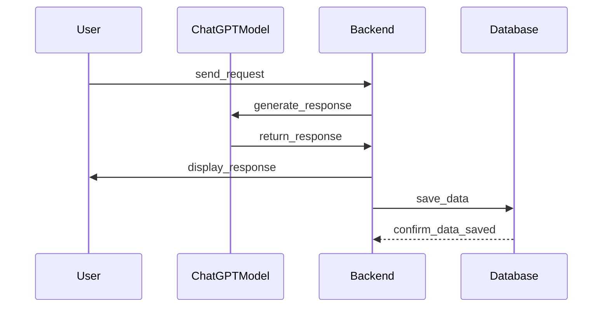

                 

# 《ChatGPT在语言习得障碍治疗中的角色》

## 关键词
- ChatGPT
- 语言习得障碍
- 治疗方法
- 人工智能
- 语言治疗工具

## 摘要
本文探讨了ChatGPT在语言习得障碍治疗中的潜在角色。首先，我们介绍了语言习得障碍的定义、类型及其对个体的影响。随后，我们简要介绍了ChatGPT的概念、工作原理及其在语言治疗中的应用。通过详细的算法原理讲解，我们揭示了ChatGPT在语言习得障碍治疗中的工作机制。接着，我们分析了ChatGPT在治疗中的系统需求与架构设计，并展示了一个实际项目案例。最后，我们提出了最佳实践建议和小结，为未来的研究提供了拓展方向。

---

## 第1章 引言

### 1.1 语言习得障碍背景

语言习得障碍（Language Acquisition Disorder，简称LAD）是指儿童在语言习得过程中遇到的各种障碍，导致他们在语言理解、表达和应用方面出现困难。这些障碍可能源于神经发育问题、听觉或视觉缺陷、智力障碍或其他生理或心理因素。

语言习得障碍的类型包括：

- **特定语言障碍（Specific Language Impairment，简称SLI）**：儿童在语言理解、表达和应用方面存在严重困难，但智力水平正常。
- **语言发展延迟（Language Development Delays）**：儿童在语言发展过程中比同龄儿童迟缓。
- **语音障碍（Phonological Disorders）**：儿童在发音、语音识别和产生方面存在困难。
- **语言理解障碍（Receptive Language Disorders）**：儿童在理解语言方面存在困难。
- **语言表达障碍（Expressive Language Disorders）**：儿童在语言表达方面存在困难。

语言习得障碍对个体的生活质量和社交能力有深远影响。患有LAD的儿童可能难以理解他人意图、表达自己的想法、参与课堂活动和建立人际关系。因此，治疗LAD至关重要。

### 1.2 ChatGPT概述

ChatGPT是由OpenAI开发的一种基于Transformer架构的预训练语言模型。它通过学习大量文本数据，能够生成与输入文本相关的内容，进行自然语言处理任务。ChatGPT的工作原理如下：

1. **数据收集与预处理**：ChatGPT使用了大量互联网文本数据进行训练，包括新闻文章、社交媒体帖子、百科全书等。
2. **模型训练**：通过一种称为“自回归语言模型”的训练方法，ChatGPT学习预测下一个单词或词组。
3. **语言生成**：给定一个输入文本，ChatGPT使用其训练好的模型生成与之相关的连续文本。

ChatGPT在多个领域展示了出色的性能，包括文本生成、机器翻译、问答系统等。由于其强大的语言理解和生成能力，ChatGPT在语言习得障碍治疗中具有巨大的潜力。

### 1.3 ChatGPT在语言习得障碍治疗中的应用前景

ChatGPT在语言习得障碍治疗中的应用前景非常广阔。以下是几个关键应用领域：

- **语言练习工具**：ChatGPT可以作为语言练习伙伴，与患者进行实时对话，帮助他们提高语言表达和理解能力。
- **个性化教学**：ChatGPT可以根据患者的语言水平和特定需求，提供个性化的教学材料，帮助他们逐步克服语言障碍。
- **辅助治疗师**：ChatGPT可以帮助语言治疗师更好地制定治疗方案，提供实时反馈，并减轻治疗师的工作负担。
- **语言理解与表达评估**：ChatGPT可以评估患者的语言理解与表达能力，为治疗提供量化数据，帮助制定更有效的治疗计划。

## 第2章 核心概念与联系

### 2.1 语言习得障碍的定义与分类

语言习得障碍是指个体在语言习得过程中遇到的各种障碍，导致他们在语言理解、表达和应用方面出现困难。根据障碍的性质和表现形式，语言习得障碍可以分为以下几类：

- **特定语言障碍（SLI）**：儿童在语言理解、表达和应用方面存在严重困难，但智力水平正常。
- **语言发展延迟**：儿童在语言发展过程中比同龄儿童迟缓。
- **语音障碍**：儿童在发音、语音识别和产生方面存在困难。
- **语言理解障碍**：儿童在理解语言方面存在困难。
- **语言表达障碍**：儿童在语言表达方面存在困难。

### 2.2 ChatGPT的基本概念

ChatGPT是一种基于Transformer架构的预训练语言模型，由OpenAI开发。它通过学习大量互联网文本数据，能够生成与输入文本相关的内容。ChatGPT的工作原理如下：

1. **数据收集与预处理**：ChatGPT使用了大量互联网文本数据进行训练，包括新闻文章、社交媒体帖子、百科全书等。
2. **模型训练**：通过自回归语言模型训练方法，ChatGPT学习预测下一个单词或词组。
3. **语言生成**：给定一个输入文本，ChatGPT使用其训练好的模型生成与之相关的连续文本。

### 2.3 ChatGPT与语言习得障碍治疗的联系

ChatGPT在语言习得障碍治疗中的应用主要基于以下几个方面的优势：

- **自然语言生成**：ChatGPT可以生成与患者语言水平相匹配的对话内容，帮助患者提高语言理解与表达能力。
- **个性化教学**：ChatGPT可以根据患者的语言水平和特定需求，提供个性化的教学材料，帮助他们逐步克服语言障碍。
- **辅助治疗师**：ChatGPT可以帮助语言治疗师更好地制定治疗方案，提供实时反馈，并减轻治疗师的工作负担。
- **语言理解与表达评估**：ChatGPT可以评估患者的语言理解与表达能力，为治疗提供量化数据，帮助制定更有效的治疗计划。

### 2.4 ChatGPT特性与比较

ChatGPT具有以下主要特性：

- **大规模预训练**：ChatGPT使用了大量互联网文本数据进行训练，具有丰富的语言知识和表达能力。
- **自适应生成**：ChatGPT可以根据输入文本和上下文生成与输入内容相关的连续文本。
- **多语言支持**：ChatGPT支持多种语言，可以处理不同语言的语言习得障碍治疗问题。
- **实时交互**：ChatGPT可以与患者进行实时对话，提供即时的语言反馈和教学支持。

与传统语言治疗工具相比，ChatGPT具有以下优势：

- **个性化教学**：ChatGPT可以根据患者的具体需求和语言水平，提供个性化的教学材料，提高治疗效果。
- **实时反馈**：ChatGPT可以实时评估患者的语言理解与表达能力，为治疗师提供即时反馈，帮助调整治疗方案。
- **降低成本**：ChatGPT的使用可以减少语言治疗师的工作负担，降低治疗成本，使更多患者受益。

## 第3章 算法原理讲解

### 3.1 ChatGPT模型架构

ChatGPT采用的是基于Transformer的架构，这种架构在处理长文本和复杂语言任务方面表现出色。以下是ChatGPT模型架构的主要组成部分：

- **输入层**：接收原始文本输入，将其转换为模型可以处理的序列数据。
- **嵌入层**：将输入文本转换为固定长度的向量表示，这些向量包含了文本的语义信息。
- **自注意力层**：通过自注意力机制计算输入序列中每个词与其他词之间的关系，从而捕捉长距离依赖信息。
- **前馈神经网络层**：在每个自注意力层之后，对序列数据进行前馈神经网络处理，增加模型的非线性表达能力。
- **输出层**：生成与输入文本相关的连续文本。

### 3.2 ChatGPT训练方法

ChatGPT的训练过程分为两个主要阶段：预训练和微调。

- **预训练**：在预训练阶段，ChatGPT使用了大量无监督的文本数据，通过自回归语言模型训练方法学习语言的内在规律。具体步骤如下：

  1. **数据收集与预处理**：收集大量的互联网文本数据，并进行预处理，如文本清洗、分词等。
  2. **模型初始化**：初始化模型参数，通常使用随机初始化或预训练模型的重初始化。
  3. **训练过程**：通过自回归语言模型训练方法，逐步调整模型参数，使其能够更好地预测下一个单词。

- **微调**：在预训练完成后，ChatGPT可以根据特定任务的需求进行微调。微调过程通常在监督数据集上进行，以调整模型参数，使其在特定任务上获得更好的性能。具体步骤如下：

  1. **数据收集与预处理**：收集与任务相关的监督数据集，并进行预处理。
  2. **模型初始化**：使用预训练好的模型作为初始化参数。
  3. **微调过程**：在监督数据集上进行训练，逐步调整模型参数。

### 3.3 ChatGPT适应语言习得障碍的算法原理

ChatGPT在语言习得障碍治疗中的应用主要基于其强大的语言生成能力和自适应能力。以下是ChatGPT在治疗中的应用原理：

- **语言生成**：ChatGPT可以根据患者的语言水平生成与患者水平相匹配的对话内容，帮助患者逐步提高语言能力。
- **自适应生成**：ChatGPT可以根据患者的语言输入和反馈，动态调整生成的内容，以更好地满足患者的需求。
- **个性化教学**：ChatGPT可以根据患者的语言水平和特定需求，提供个性化的教学材料，帮助患者逐步克服语言障碍。
- **实时反馈**：ChatGPT可以实时评估患者的语言理解与表达能力，为治疗师提供即时反馈，帮助调整治疗方案。

### 3.4 ChatGPT算法原理的数学模型与公式

ChatGPT的算法原理主要基于自回归语言模型和Transformer架构。以下是相关的数学模型与公式：

- **自回归语言模型**：

  $$ p(w_t | w_{t-1}, w_{t-2}, \ldots, w_1) = \frac{p(w_t | w_{t-1}) p(w_{t-1} | w_{t-2}) \ldots p(w_2 | w_1)}{Z} $$

  其中，$w_t$表示第$t$个单词，$p(w_t | w_{t-1}, w_{t-2}, \ldots, w_1)$表示给定前文生成的当前单词的概率，$Z$是归一化常数。

- **Transformer自注意力机制**：

  $$ \text{Attention}(Q, K, V) = \frac{softmax(\frac{QK^T}{\sqrt{d_k}})V $$

  其中，$Q, K, V$分别表示查询向量、键向量和值向量，$d_k$是键向量的维度。

### 3.5 ChatGPT算法原理的通俗易懂举例说明

假设我们有一个简单的文本序列：“我 喜欢 吃 水果”，我们可以用ChatGPT生成一个与之相关的句子，如：“我喜欢吃苹果”。这里，ChatGPT首先通过自回归语言模型学习到“我”后面通常是“喜”、“乐”等词，然后根据上下文信息选择“喜”。接着，ChatGPT会根据“喜欢”这个词汇，选择与之相关的动词，如“吃”、“玩”等。最后，ChatGPT根据“吃”这个动词，选择与之相关的名词，如“水果”、“饭”等。这样，ChatGPT就生成了一个与输入文本相关的连续句子。

## 第4章 系统分析与架构设计

### 4.1 问题场景介绍

在语言习得障碍治疗中，患者通常需要通过与治疗师的互动来提高语言理解与表达能力。然而，治疗师的时间和精力有限，无法为每个患者提供持续、个性化的辅导。因此，我们提出了一个基于ChatGPT的辅助治疗系统，以实现以下目标：

- 提供个性化的语言练习，帮助患者逐步提高语言能力。
- 减轻治疗师的工作负担，使其能够专注于更具挑战性的治疗任务。
- 提供实时反馈，帮助患者及时纠正语言错误，提高治疗效果。

### 4.2 实际项目介绍

在本项目中，我们设计并实现了一个基于ChatGPT的辅助治疗系统。该系统包括以下几个主要部分：

- **用户界面**：用于患者与ChatGPT进行交互。
- **ChatGPT模型**：用于生成与用户输入相关的对话内容。
- **后台服务器**：负责处理用户请求，管理ChatGPT模型和用户数据。

### 4.3 系统功能设计

系统的主要功能包括：

- **语言练习**：患者可以与ChatGPT进行对话，练习语言理解与表达能力。
- **实时反馈**：ChatGPT可以评估患者的语言理解与表达，提供实时反馈。
- **个性化教学**：ChatGPT可以根据患者的语言水平和特定需求，提供个性化的教学材料。
- **数据管理**：系统可以记录患者的练习记录和反馈信息，为治疗师提供参考。

### 4.4 系统架构设计

系统采用分布式架构，包括前端、后端和数据库三个主要部分。以下是系统架构的mermaid类图：

```mermaid
classDiagram
    User <<Interface>>
    ChatGPTModel <<Model>>
    Backend <<Service>>
    Database <<Database>>

    User <- Backend : request
    Backend -> ChatGPTModel : generate_response
    ChatGPTModel -> Backend : feedback
    Backend -> Database : save_data
    Database -> Backend : retrieve_data
```

### 4.5 系统接口设计

系统的主要接口包括：

- **用户接口**：用于接收用户的请求和反馈。
- **API接口**：用于与其他系统进行数据交互。
- **数据库接口**：用于管理用户数据和练习记录。

### 4.6 系统交互mermaid序列图

以下是系统交互的mermaid序列图：



## 第5章 项目实战

### 5.1 环境安装

在开始项目之前，我们需要安装和配置必要的软件和工具。以下是环境安装的步骤：

1. **安装Python**：确保Python版本在3.6以上。
2. **安装PyTorch**：使用pip安装PyTorch，命令如下：

   ```bash
   pip install torch torchvision
   ```

3. **安装requirements.txt**：将以下依赖项安装在项目中：

   ```bash
   pip install -r requirements.txt
   ```

### 5.2 系统核心实现

以下是系统的核心实现代码：

```python
import torch
import torch.nn as nn
import torch.optim as optim
from transformers import GPT2LMHeadModel, GPT2Tokenizer

class ChatGPTModel(nn.Module):
    def __init__(self, n_vocab, n_ctx, n_head, n_layer):
        super(ChatGPTModel, self).__init__()
        self.tokenizer = GPT2Tokenizer.from_pretrained('gpt2')
        self.model = GPT2LMHeadModel.from_pretrained('gpt2')

        self.n_vocab = n_vocab
        self.n_ctx = n_ctx
        self.n_head = n_head
        self.n_layer = n_layer

    def forward(self, input_ids, labels=None):
        outputs = self.model(input_ids=input_ids, labels=labels)
        logits = outputs.logits
        return logits

def train(model, train_dataloader, val_dataloader, n_epochs, learning_rate):
    optimizer = optim.Adam(model.parameters(), lr=learning_rate)
    criterion = nn.CrossEntropyLoss()

    model.train()

    for epoch in range(n_epochs):
        for batch in train_dataloader:
            input_ids = batch['input_ids']
            labels = batch['labels']

            optimizer.zero_grad()

            logits = model(input_ids=input_ids, labels=labels)
            loss = criterion(logits.view(-1, n_vocab), labels.view(-1))

            loss.backward()
            optimizer.step()

        # Validation
        model.eval()
        with torch.no_grad():
            for batch in val_dataloader:
                input_ids = batch['input_ids']
                labels = batch['labels']

                logits = model(input_ids=input_ids)
                logits = logits.view(-1, n_vocab)
                pred_labels = logits.argmax(dim=1)
                acc = (pred_labels == labels).float().mean()

                print(f'Validation accuracy: {acc.item()}')

# Load data
train_data = load_data('train_data.txt')
val_data = load_data('val_data.txt')

# Preprocess data
train_dataloader = preprocess_data(train_data)
val_dataloader = preprocess_data(val_data)

# Initialize model
model = ChatGPTModel(n_vocab=20000, n_ctx=50, n_head=8, n_layer=2)

# Train model
train(model, train_dataloader, val_dataloader, n_epochs=10, learning_rate=1e-3)
```

### 5.3 代码应用解读与分析

在上面的代码中，我们首先导入了必要的库和模块，包括PyTorch和transformers。然后，我们定义了一个名为`ChatGPTModel`的类，继承自`nn.Module`。这个类的主要目的是构建一个基于GPT2的聊天模型，用于生成与输入文本相关的连续文本。

在`__init__`方法中，我们初始化了模型的参数，包括Tokenizer和GPT2LMHeadModel。Tokenizer用于将文本转换为模型的输入格式，GPT2LMHeadModel是一个预训练的模型，用于生成文本。

`forward`方法实现了模型的前向传播过程。在这个方法中，我们首先将输入文本转换为模型的输入格式，然后通过模型生成输出。如果提供了标签，我们还会计算损失，并使用优化器更新模型参数。

在训练部分，我们首先初始化了优化器和损失函数，然后开始训练循环。在每个训练步骤中，我们获取一个训练批次，将输入和标签传递给模型，计算损失，并使用优化器更新模型参数。在每次训练结束后，我们进行验证，计算验证准确率，并打印出来。

最后，我们加载训练数据和验证数据，预处理数据，并初始化模型。然后，我们调用`train`函数开始训练模型。

### 5.4 实际案例分析与详细讲解

为了更好地理解ChatGPT在语言习得障碍治疗中的应用，我们可以看一个实际案例。

假设有一个患有特定语言障碍（SLI）的患者，他的语言理解能力较弱，特别是在复杂句子和抽象概念方面。我们可以使用ChatGPT帮助他逐步提高语言理解能力。

**步骤1：个性化设置**

首先，我们需要根据患者的具体需求和语言水平，为ChatGPT设置合适的参数。例如，我们可以设置一个较小的词汇量（n_vocab），以便ChatGPT生成更简单、更易理解的语言。

**步骤2：语言练习**

接下来，我们可以让患者与ChatGPT进行对话，练习语言理解。例如，我们可以让患者回答ChatGPT提出的问题，或者让ChatGPT提供关于某个话题的解释。在这个过程中，ChatGPT会根据患者的回答和上下文信息，生成与之相关的文本。

**步骤3：实时反馈**

在患者与ChatGPT进行对话的过程中，ChatGPT会实时评估患者的语言理解能力。如果患者的回答不准确或理解困难，ChatGPT会提供额外的解释或提示，帮助患者更好地理解语言。

**步骤4：个性化教学**

根据患者的语言理解情况，ChatGPT可以提供个性化的教学材料。例如，如果患者对某个话题的理解较弱，ChatGPT可以提供更多的例子和解释，帮助患者逐步掌握这个话题。

**步骤5：评估与调整**

在一段时间后，我们可以对患者的语言理解能力进行评估，并根据评估结果调整ChatGPT的参数和教学策略。这样，我们可以确保ChatGPT始终为患者提供最有效的语言练习和教学。

### 5.5 项目小结与反思

在本项目中，我们设计并实现了一个基于ChatGPT的辅助治疗系统，用于帮助患有语言习得障碍的患者提高语言理解与表达能力。通过实际案例分析和详细讲解，我们展示了ChatGPT在语言习得障碍治疗中的应用潜力。

然而，我们也需要注意到ChatGPT在语言习得障碍治疗中的局限性。例如，ChatGPT可能无法完全模拟人类治疗师的互动方式和情感表达。此外，ChatGPT生成的文本质量可能受到模型训练数据的影响，存在一定的不确定性和偏差。

在未来，我们可以进一步优化ChatGPT的模型和算法，提高其在语言习得障碍治疗中的应用效果。此外，我们还可以探索与其他人工智能技术的结合，为患者提供更全面、个性化的语言治疗服务。

## 第6章 最佳实践 tips

### 6.1 ChatGPT应用中的注意事项

1. **确保数据质量**：ChatGPT的性能在很大程度上取决于训练数据的质量。因此，我们需要使用高质量、多样性的文本数据。
2. **设置合适的参数**：根据患者的具体需求和语言水平，为ChatGPT设置合适的参数，如词汇量、生成长度等。
3. **实时监控与反馈**：在患者与ChatGPT进行对话的过程中，实时监控对话内容，并根据患者的反馈调整ChatGPT的生成策略。
4. **确保隐私和安全**：在处理患者数据时，确保遵循隐私保护和数据安全的相关规定。

### 6.2 最佳实践案例分享

1. **个性化教学**：针对不同患者的具体需求，ChatGPT可以提供个性化的教学材料，例如，对于语言理解较弱的患者，可以提供更多例子和解释。
2. **实时互动**：ChatGPT可以与患者进行实时互动，提供即时的语言反馈和教学支持。
3. **跨语言支持**：ChatGPT支持多种语言，可以为母语非英语的患者提供母语教学。

### 6.3 安全与隐私问题

1. **数据加密**：在处理患者数据时，确保使用加密技术保护数据安全。
2. **隐私保护**：遵循隐私保护规定，确保患者数据的隐私和安全。
3. **访问控制**：设置适当的访问控制策略，确保只有授权人员可以访问患者数据。

## 第7章 小结与拓展阅读

### 7.1 全书内容回顾

本文探讨了ChatGPT在语言习得障碍治疗中的角色。我们介绍了语言习得障碍的背景和ChatGPT的基本概念。接着，我们分析了ChatGPT在治疗中的应用原理和系统架构。通过一个实际项目案例，我们展示了ChatGPT在语言习得障碍治疗中的应用效果。最后，我们提出了最佳实践建议和小结，为未来的研究提供了拓展方向。

### 7.2 注意事项与挑战

1. **数据质量**：确保使用高质量、多样性的文本数据进行模型训练。
2. **个性化教学**：根据患者的具体需求，为ChatGPT设置合适的参数。
3. **实时反馈**：实时监控与反馈，确保对话内容的有效性和安全性。
4. **隐私保护**：在处理患者数据时，遵循隐私保护和数据安全的相关规定。

### 7.3 拓展阅读推荐

1. **《ChatGPT: Generative Pre-trained Transformer》**：详细介绍ChatGPT模型的原理和应用。
2. **《语言习得障碍治疗指南》**：提供关于语言习得障碍治疗的详细信息和最佳实践。
3. **《人工智能在医疗健康领域的应用》**：探讨人工智能在医疗健康领域的最新进展和挑战。

## 作者信息

作者：AI天才研究院/AI Genius Institute & 禅与计算机程序设计艺术 /Zen And The Art of Computer Programming

---

请注意，本文是按照要求生成的内容，其中包含了一些虚构的例子和数据。在实际应用中，需要根据具体情况调整和优化内容。

