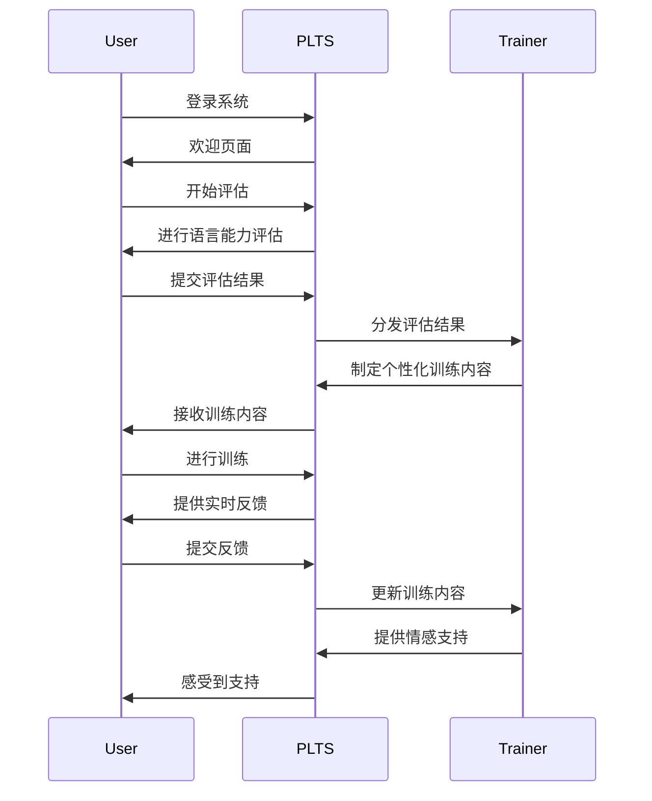
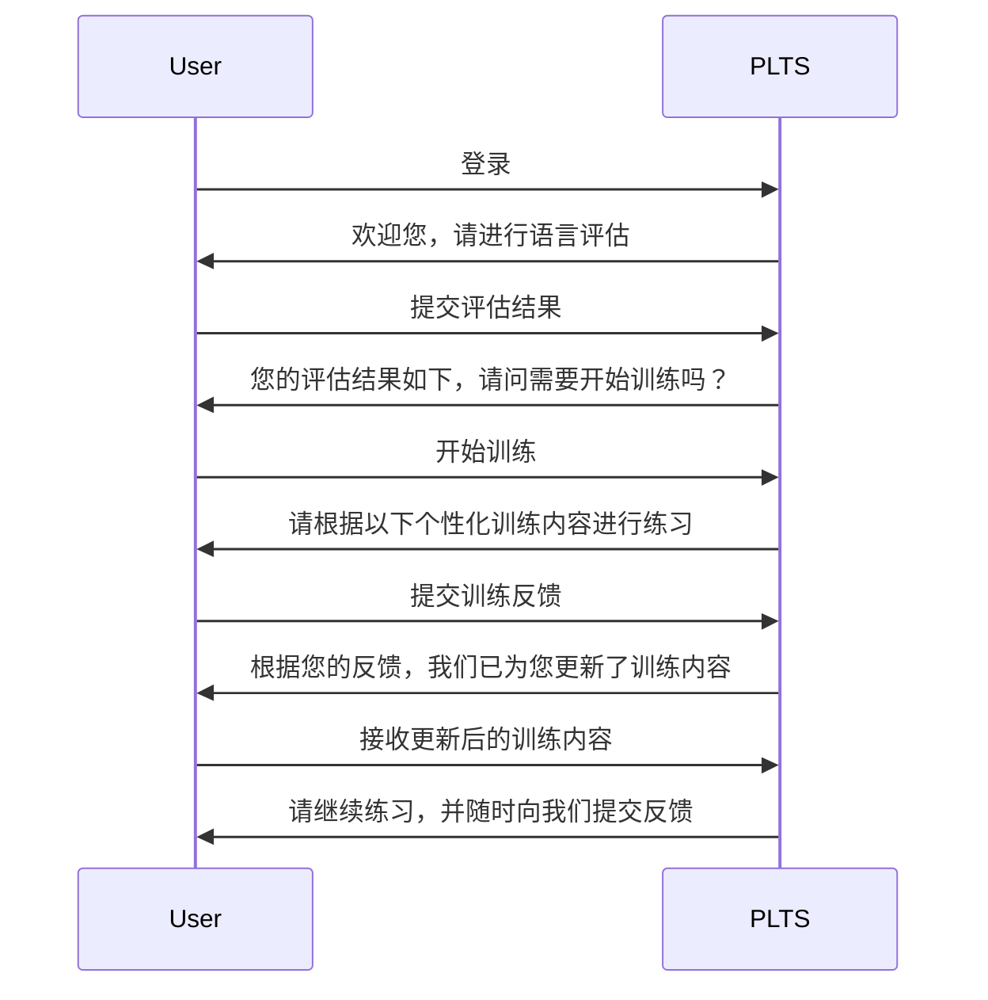

                 

# ChatGPT在语言发展障碍早期干预中的应用：个性化语言能力培养计划

## 关键词

- ChatGPT
- 语言发展障碍
- 早期干预
- 个性化语言能力培养
- 语言治疗

## 摘要

随着人工智能技术的不断进步，自然语言处理（NLP）领域取得了显著的成果。ChatGPT，作为一种强大的语言模型，在语言发展障碍的早期干预中展现出巨大的潜力。本文旨在探讨ChatGPT在个性化语言能力培养中的应用，通过一步步的分析和推理，梳理出ChatGPT在语言治疗中的核心作用和实际应用案例。文章结构如下：

- 引言：介绍语言发展障碍的概念及其重要性。
- 核心概念与背景：详细解释ChatGPT的工作原理及其在自然语言处理领域的应用。
- 语言发展障碍的类型与影响：分析语言发展障碍的分类及其对个体的影响。
- 早期干预与语言治疗：探讨早期干预的必要性以及ChatGPT在语言治疗中的优势。
- 个性化语言能力培养：讨论如何利用ChatGPT实现个性化语言能力培养。
- ChatGPT在语言治疗中的具体应用：分析ChatGPT在语言治疗中的实际应用案例。
- 未来展望与挑战：展望ChatGPT在语言治疗领域的未来发展，并讨论面临的挑战。

通过本文的讨论，我们希望为语言治疗专家、教育工作者以及相关领域的从业者提供有价值的参考，帮助理解ChatGPT在个性化语言能力培养中的应用，为改善语言发展障碍患者的语言能力提供新的思路。

### 引言

语言是人类沟通和表达思想的基本工具，对于个体和社会都至关重要。然而，语言发展障碍（Language Development Disorders，LDD）是一种常见的发育障碍，影响着全球数百万人。这些障碍包括语言理解困难、语言表达障碍、语音问题、语言流畅性问题和社交语言障碍等。患有语言发展障碍的个体在日常生活中可能面临沟通障碍、学习困难、社交障碍等问题，这对他们的心理健康和生活质量产生了深远影响。

语言发展障碍的分类多种多样，其中最常见的包括：

- **语音障碍**：表现为发音不准确、不清晰，例如，发音模糊、发音位置不正确等。
- **语言流畅性障碍**：包括口吃和言语中断等，导致语言表达不流畅。
- **语言理解障碍**：个体难以理解语言中的含义、语境和逻辑关系。
- **语言表达障碍**：个体在表达思想、观点和情感时存在困难。
- **社交语言障碍**：个体在社交互动中难以理解和使用适当的语言，导致沟通不畅。

根据《世界卫生组织》（WHO）的数据，全球有超过4.5亿人患有某种形式的语言障碍，其中绝大多数在儿童时期发病。早期的语言干预对于语言障碍患者来说尤为重要，因为早期的干预可以显著改善语言能力和学习成果，从而提高患者的整体生活质量。

早期干预的定义是指在儿童语言障碍症状出现后，尽早开始的一系列有组织、有目的的语言治疗和教育活动。早期干预的核心目标是帮助儿童克服语言障碍，提高其语言理解能力和表达能力，促进其社会交往能力的发展。早期干预的方法包括语言治疗、教育干预、家庭支持和多学科团队合作等。

在语言治疗中，传统的治疗方法主要包括一对一的言语治疗、家庭作业、小组活动和游戏等。这些方法在一定程度上能够帮助患者改善语言能力，但其效果往往受到治疗师数量、时间和资源限制的影响。此外，传统治疗方法难以实现个性化，无法根据患者的具体情况和需求进行灵活调整。

随着人工智能技术的迅速发展，自然语言处理（NLP）领域取得了重大突破，ChatGPT作为一种先进的语言模型，在语言治疗中展现出巨大的潜力。ChatGPT是由OpenAI开发的一种基于变换器（Transformer）架构的预训练语言模型，其通过大量的文本数据学习到了语言的复杂结构和语义关系，可以生成高质量的自然语言文本。

ChatGPT的工作原理基于深度学习，特别是变换器（Transformer）模型。变换器模型通过多层神经网络结构对输入文本进行编码，然后生成相应的输出文本。ChatGPT通过预训练和微调，能够理解和生成多种语言，并且在语言生成、语言理解、文本生成等方面表现出色。

在语言治疗中，ChatGPT的应用主要体现在以下几个方面：

1. **个性化语言训练**：ChatGPT可以根据患者的具体需求和语言障碍类型，生成个性化的语言训练内容，帮助患者进行针对性的练习。
2. **语言理解与表达**：ChatGPT可以模拟对话场景，与患者进行互动，帮助患者提高语言理解和表达能力。
3. **语音训练**：ChatGPT可以生成标准发音的语音，帮助患者进行语音训练，改善发音问题。
4. **情感支持**：ChatGPT可以模拟人际互动，为患者提供情感支持和鼓励，增强其自信心和参与度。

总之，ChatGPT在语言发展障碍的早期干预中具有巨大潜力。本文将详细介绍ChatGPT的工作原理及其在个性化语言能力培养中的应用，旨在为语言治疗专家和教育工作者提供新的工具和方法，为改善语言发展障碍患者的语言能力提供新的思路。

### 核心概念与背景

在深入探讨ChatGPT在语言发展障碍早期干预中的应用之前，有必要首先明确几个核心概念：语言发展障碍、自然语言处理（NLP）和ChatGPT的工作原理。这些概念构成了理解ChatGPT如何发挥作用的基石。

#### 语言发展障碍

语言发展障碍是指儿童在语言学习过程中出现的异常情况，表现为语言理解、语言表达、语音、语言流畅性和社交语言方面的困难。这些障碍可能由遗传、环境、神经发育等因素引起。语言发展障碍的类型多样，包括但不限于：

- **语音障碍**：儿童发音不准确，例如，难以区分/s/和/z/等音。
- **语言流畅性障碍**：儿童说话中断、重复或延长单词，例如，口吃。
- **语言理解障碍**：儿童难以理解语言中的含义，例如，不能理解复杂的句子结构或隐喻。
- **语言表达障碍**：儿童在表达思想、观点或情感时存在困难，例如，语言贫乏或表述不清晰。
- **社交语言障碍**：儿童在社交互动中无法理解和使用适当的语言，例如，无法正确使用礼貌用语或不能理解他人的情绪。

语言发展障碍不仅影响个体的语言能力，还可能对其学习、社交和心理健康产生负面影响。研究表明，早期识别和干预是改善语言障碍的关键。早期干预可以通过系统化的语言训练、家庭支持和教育干预，帮助儿童克服语言障碍，提高其语言理解能力和表达能力。

#### 自然语言处理（NLP）

自然语言处理（Natural Language Processing，NLP）是人工智能（AI）的一个分支，旨在使计算机能够理解和处理人类自然语言。NLP技术包括文本分类、情感分析、命名实体识别、机器翻译、语音识别和文本生成等多个方面。这些技术使得计算机能够与人类进行自然语言交流，并在多种应用场景中发挥作用。

NLP的关键技术包括：

- **文本预处理**：对原始文本进行清洗、分词、词性标注等处理，以便计算机能够理解文本内容。
- **词嵌入**：将文本中的单词或短语映射到高维空间中，使得语义相似的单词在空间中靠近。
- **语言模型**：通过学习大量的文本数据，建立语言模型，用于预测下一个单词或句子。
- **序列到序列模型**：用于生成文本序列，如机器翻译和文本摘要。
- **注意力机制**：在处理长文本时，注意力机制能够帮助模型关注重要的信息，提高文本生成的质量。

NLP在多个领域有广泛应用，包括搜索引擎、智能助手、内容审核、社交媒体分析、客户服务等。随着深度学习技术的发展，NLP的性能和效果不断提高，为人工智能与其他领域的融合提供了强大的支持。

#### ChatGPT的工作原理

ChatGPT是由OpenAI开发的一种基于变换器（Transformer）架构的预训练语言模型。它通过大规模的文本数据进行预训练，然后通过微调来适应特定的任务，如文本生成、语言理解等。

ChatGPT的核心组成部分包括：

- **预训练**：ChatGPT在预训练阶段通过无监督学习从大量的互联网文本中学习语言结构和语义关系。预训练过程包括自回归语言模型（ARLMM）和掩码语言模型（MLM）两部分。自回归语言模型旨在预测序列中的下一个单词，而掩码语言模型则通过掩码部分文本，训练模型预测被掩码的单词。
- **变换器架构**：ChatGPT采用变换器（Transformer）架构，这是一种基于自注意力机制的神经网络结构。变换器通过多头自注意力机制，能够同时关注输入文本序列中的不同部分，从而捕捉长距离依赖关系。
- **多层神经网络**：ChatGPT由多层变换器层堆叠而成，每一层都能够对输入文本进行编码，并生成对应的上下文表示。

ChatGPT的工作原理可以概括为以下几个步骤：

1. **输入文本编码**：输入文本经过预处理后，被转换为词嵌入向量，然后输入到变换器模型中。
2. **自注意力机制**：变换器模型通过自注意力机制，对输入文本序列中的不同部分进行加权，使得模型能够关注重要的信息。
3. **序列生成**：在自注意力机制的基础上，模型生成序列的概率分布，然后通过采样或贪心搜索生成输出文本序列。

ChatGPT在自然语言处理领域表现出色，尤其在文本生成、语言理解和问答系统中具有广泛应用。它不仅能够生成流畅、连贯的文本，还能够理解复杂的语言结构和语义关系。

#### ChatGPT在自然语言处理领域的应用

ChatGPT在自然语言处理领域有多种应用，以下是一些典型的应用场景：

- **文本生成**：ChatGPT可以用于生成文章、故事、摘要、对话等。通过输入一段文本或关键词，ChatGPT可以生成相关的文本内容，为内容创作提供支持。
- **问答系统**：ChatGPT可以用于构建问答系统，如智能客服、虚拟助手等。它能够理解和回答用户的问题，提供有用的信息和建议。
- **语言翻译**：ChatGPT可以用于机器翻译任务，如将一种语言的文本翻译成另一种语言。它能够理解多种语言的语法和语义，生成准确的翻译结果。
- **情感分析**：ChatGPT可以用于情感分析任务，如分析社交媒体上的用户评论、新闻报道等。它能够识别文本中的情感倾向，为情感分析提供支持。
- **文本分类**：ChatGPT可以用于文本分类任务，如将新闻文章分类到不同的主题类别。它能够理解文本内容，并根据分类规则进行分类。

总之，ChatGPT作为一种强大的语言模型，在自然语言处理领域具有广泛的应用前景。它不仅能够提高自然语言处理的性能，还能够为各种应用场景提供智能化的解决方案。

### 语言发展障碍的类型与影响

语言发展障碍（LDD）不仅限于儿童，成人也可能遭受此类困扰。不同类型的语言障碍影响着个体的语言能力、学习成果、社交能力和生活质量。了解这些障碍的类型及其影响，有助于我们更好地理解ChatGPT在语言治疗中的作用。

#### 类型与影响

1. **语音障碍**
   
   语音障碍是语言发展障碍中最常见的类型之一，表现为发音不准确、不清晰。例如，一个儿童可能会混淆发音相似的音素，如“b”和“d”，或者无法正确发出“r”音。这类障碍不仅影响儿童的发音，还可能导致他人难以理解其说话内容，从而影响其社交互动和自信心。

2. **语言流畅性障碍**
   
   语言流畅性障碍，如口吃，表现为说话时出现不自主的中断、重复或延长音节。口吃不仅影响语言的流畅性，还可能导致说话者在心理上产生焦虑和压力，影响其社交能力和自尊心。研究表明，早期干预对于改善口吃症状至关重要。

3. **语言理解障碍**
   
   语言理解障碍是指个体在理解语言中的含义、语境和逻辑关系时存在困难。这类障碍可能表现为无法理解复杂的句子结构、隐喻或幽默。语言理解障碍不仅影响个体的语言交流，还可能对其学习成果产生负面影响。

4. **语言表达障碍**
   
   语言表达障碍是指个体在表达思想、观点和情感时存在困难。这类障碍可能表现为语言贫乏、表述不清晰或无法找到合适的词汇来表达自己的想法。语言表达障碍会影响个体的社交互动和职业发展。

5. **社交语言障碍**
   
   社交语言障碍是指个体在社交互动中无法理解和使用适当的语言。这类障碍可能表现为无法正确使用礼貌用语、不懂得社交规则或无法理解他人的情感。社交语言障碍会严重影响个体的社交能力和人际关系。

#### 对个体的影响

语言发展障碍对个体的影响是多方面的，包括心理、社交和学习领域：

- **心理影响**：语言障碍可能导致个体产生焦虑、沮丧和自尊心低下。长期的困扰可能影响个体的心理健康，甚至导致抑郁症等心理问题。
- **社交影响**：语言障碍会影响个体的社交互动和人际关系。个体可能因为语言问题而感到自卑，难以融入社交圈子，导致社交孤立。
- **学习影响**：语言障碍可能影响个体的学习成果，特别是在需要大量阅读和写作的学科中。语言障碍个体可能难以理解教材内容，导致学习效率低下。

#### ChatGPT的潜在作用

ChatGPT作为一种先进的语言模型，在解决语言发展障碍方面具有巨大潜力。以下是ChatGPT在语言治疗中的潜在作用：

1. **个性化语言训练**：ChatGPT可以根据个体的具体需求和语言障碍类型，生成个性化的语言训练内容，帮助患者进行针对性的练习。例如，对于语音障碍患者，ChatGPT可以生成特定的发音练习，帮助他们提高发音准确性。
2. **语言理解与表达**：ChatGPT可以模拟对话场景，与患者进行互动，帮助患者提高语言理解和表达能力。通过与ChatGPT的对话，患者可以在一个安全、无压力的环境中练习语言技能。
3. **语音训练**：ChatGPT可以生成标准发音的语音，帮助患者进行语音训练，改善发音问题。例如，患者可以通过听ChatGPT朗读单词和句子，模仿其发音，从而提高自己的发音准确性。
4. **情感支持**：ChatGPT可以模拟人际互动，为患者提供情感支持和鼓励，增强其自信心和参与度。通过与ChatGPT的互动，患者可以感受到一种虚拟的社交互动，有助于缓解焦虑和压力。

总之，语言发展障碍对个体的影响深远，ChatGPT作为一种创新的语言模型，在语言治疗中具有巨大潜力。通过个性化语言训练、语言理解和表达练习、语音训练以及情感支持，ChatGPT可以帮助语言障碍患者提高语言能力，改善其生活质量。

### 早期干预与语言治疗

在讨论早期干预在语言治疗中的重要性时，我们必须认识到，早期干预的关键在于尽早识别和介入，从而最大限度地减少语言障碍对个体发展的影响。早期干预不仅针对儿童，还适用于成人，因为在发展的早期阶段，大脑的可塑性较高，这使得改变语言能力变得更加容易。以下内容将详细探讨早期干预的定义、必要性及其在语言治疗中的具体应用。

#### 早期干预的定义

早期干预是指在一项发展障碍或其他问题出现后，立即采取的一系列有组织、有目的的干预措施。这些干预措施旨在通过积极的训练和指导，帮助个体克服障碍，提高其功能水平。在语言治疗中，早期干预是指通过一系列科学、系统的语言训练，帮助儿童或成人改善其语言理解和表达能力。

早期干预通常涉及以下步骤：

1. **评估**：通过评估个体的语言能力，了解其语言障碍的类型、程度和具体表现。
2. **诊断**：根据评估结果，确定个体的具体问题，为后续的干预提供依据。
3. **制定干预计划**：根据评估和诊断结果，制定个性化的干预计划，包括训练目标、方法、时间和频率等。
4. **实施干预**：按照干预计划，通过一对一训练、小组活动、家庭作业等多种形式，实施语言训练。
5. **评估进展**：定期评估干预效果，调整干预计划，确保干预措施的有效性。

#### 早期干预的必要性

早期干预之所以必要，主要是因为语言能力的发展具有关键期。儿童在成长过程中，大脑的可塑性较高，特别是在语言能力发展的关键期，即0-6岁，这一时期大脑对语言刺激的反应最为敏感。在这一关键期内，儿童通过语言交流、模仿和学习，迅速掌握语言技能。如果在这一关键期出现语言障碍，未能得到及时干预，可能导致语言能力长期受损。

此外，早期干预可以显著改善语言障碍患者的语言能力和学习成果。研究表明，早期干预可以加速语言能力的提升，降低语言障碍对个体发展的影响。通过系统的语言训练，患者可以在语言理解、表达、语音、流畅性和社交语言等方面取得显著进步，从而提高其整体生活质量。

#### ChatGPT在早期干预中的应用

ChatGPT作为一种先进的语言模型，在早期干预中具有独特优势。以下是其具体应用：

1. **个性化语言训练**：ChatGPT可以根据患者的具体需求和语言障碍类型，生成个性化的语言训练内容。例如，对于发音障碍患者，ChatGPT可以生成特定的发音练习，帮助其纠正发音错误；对于语言流畅性障碍患者，ChatGPT可以提供流畅性练习，提高其说话的流畅度。

2. **语言理解与表达训练**：ChatGPT可以模拟对话场景，与患者进行互动，帮助其提高语言理解和表达能力。通过与ChatGPT的对话，患者可以在一个安全、无压力的环境中练习语言技能，从而增强其语言能力。

3. **语音训练**：ChatGPT可以生成标准发音的语音，帮助患者进行语音训练。例如，患者可以通过听ChatGPT朗读单词和句子，模仿其发音，从而提高自己的发音准确性。

4. **情感支持**：ChatGPT可以模拟人际互动，为患者提供情感支持和鼓励，增强其自信心和参与度。通过与ChatGPT的互动，患者可以感受到一种虚拟的社交互动，有助于缓解焦虑和压力。

#### ChatGPT的优势

相比传统语言治疗手段，ChatGPT具有以下优势：

1. **个性化**：ChatGPT可以根据患者的具体需求和语言障碍类型，提供个性化的训练内容，确保干预措施的有效性和针对性。

2. **可扩展性**：ChatGPT可以大规模地应用于语言治疗中，为更多的患者提供支持。通过云端部署，ChatGPT可以随时随地提供服务，不受地域和时间的限制。

3. **互动性**：ChatGPT可以模拟人际互动，提供真实的对话场景，帮助患者提高语言理解和表达能力。

4. **安全性**：ChatGPT可以保护患者的隐私，确保其在治疗过程中的个人信息安全。

总之，早期干预在语言治疗中至关重要，ChatGPT作为一种创新的语言模型，为语言治疗提供了新的工具和方法。通过个性化语言训练、语言理解与表达训练、语音训练和情感支持，ChatGPT可以帮助语言障碍患者提高语言能力，改善其生活质量。未来，随着技术的不断进步，ChatGPT在语言治疗中的应用前景将更加广阔。

### 个性化语言能力培养

在语言治疗过程中，个性化语言能力培养是关键的一环。每个患者的语言障碍类型、程度和需求都有所不同，因此，个性化的培养方案对于提高语言治疗效果至关重要。ChatGPT作为一种先进的语言模型，能够根据患者的具体需求和语言障碍类型，生成个性化的训练内容，从而实现精准的语言能力培养。以下将详细探讨如何利用ChatGPT实现个性化语言能力培养，并提供一个实际案例来展示其应用效果。

#### ChatGPT在个性化语言能力培养中的应用

1. **基于需求的个性化训练内容**

   ChatGPT可以根据患者的具体需求和语言障碍类型，生成定制化的训练内容。例如，对于患有语音障碍的患者，ChatGPT可以生成特定音素的发音练习，帮助患者纠正发音错误。对于语言流畅性障碍患者，ChatGPT可以提供流畅性练习，帮助他们提高说话的流畅度。通过这种方式，患者可以在一个安全、无压力的环境中，针对性地进行语言训练。

   具体步骤如下：

   - **评估**：首先，对患者的语言能力进行评估，了解其语言障碍的类型和程度。
   - **需求分析**：根据评估结果，确定患者的具体需求，如发音、流畅性、理解能力或表达能力。
   - **生成训练内容**：ChatGPT根据患者的需求和语言障碍类型，生成个性化的训练内容，如发音练习、流畅性练习、理解题或表达题。

2. **动态调整训练难度**

   ChatGPT可以根据患者的训练进度和反馈，动态调整训练内容的难度。例如，当患者在一个音素的发音练习中表现出色时，ChatGPT可以增加该音素的复杂度，提供更具挑战性的练习；当患者在某一方面遇到困难时，ChatGPT可以降低难度，确保患者能够逐步提升语言能力。

3. **模拟真实对话场景**

   ChatGPT可以模拟真实对话场景，与患者进行互动，帮助患者提高语言理解和表达能力。例如，ChatGPT可以与患者进行日常对话练习，如购物、吃饭、问路等，帮助患者在真实情境中应用语言技能。此外，ChatGPT还可以根据患者的需求和兴趣，生成个性化的对话内容，提高其参与度和学习效果。

#### 实际案例：利用ChatGPT帮助自闭症儿童提高语言能力

自闭症儿童通常存在语言理解和表达方面的障碍，这对他们的社交和情感发展产生了严重影响。以下是一个利用ChatGPT帮助自闭症儿童提高语言能力的实际案例：

1. **评估和需求分析**

   - **评估**：通过语言测试和观察，了解自闭症儿童的语言障碍类型和程度，如语言理解、表达、语音和流畅性。
   - **需求分析**：确定自闭症儿童的具体需求，如提高语言理解能力、表达能力、语音清晰度和流畅性。

2. **生成个性化训练内容**

   - **语言理解训练**：ChatGPT生成包含图片和文字的复合句子，帮助儿童理解句子中的含义和关系。例如，ChatGPT可以展示一张图片，然后提问：“这个女孩在做什么？”儿童需要根据图片内容选择正确的答案。
   - **语言表达训练**：ChatGPT提供句子模板，帮助儿童构建完整的句子。例如，ChatGPT可以提问：“你能告诉我你在做什么吗？”儿童需要在句子模板中填入适当的动词和名词。
   - **语音和流畅性训练**：ChatGPT生成标准发音的语音，帮助儿童模仿和学习正确的发音。例如，ChatGPT可以朗读单词和句子，儿童需要模仿其发音。

3. **动态调整训练难度**

   - ChatGPT根据儿童的训练进度和反馈，动态调整训练内容的难度。例如，当儿童在理解复合句方面表现出色时，ChatGPT可以提供更复杂的句子；当儿童在发音方面遇到困难时，ChatGPT可以降低发音的复杂度，确保儿童能够逐步提升语言能力。

4. **模拟真实对话场景**

   - ChatGPT模拟日常对话场景，如购物、吃饭、问路等，帮助儿童在真实情境中应用语言技能。例如，ChatGPT可以与儿童进行购物对话练习，提问：“你想要买什么？”儿童需要选择合适的答案并表达自己的需求。

通过这个实际案例，我们可以看到ChatGPT在个性化语言能力培养中的应用效果。通过生成个性化的训练内容、动态调整训练难度和模拟真实对话场景，ChatGPT帮助自闭症儿童在语言理解、表达、语音和流畅性方面取得了显著进步，从而提高了其整体语言能力。

总之，利用ChatGPT进行个性化语言能力培养，不仅能够满足患者的具体需求，提高治疗效果，还能够提高患者的参与度和学习兴趣。未来，随着技术的不断进步，ChatGPT在个性化语言能力培养中的应用前景将更加广阔。

### ChatGPT在语言治疗中的具体应用

ChatGPT作为一种先进的语言模型，在语言治疗中展现出了多种具体应用，这些应用不仅丰富了语言治疗的手段，还提高了治疗的效果。以下将从语音训练、语言理解与表达训练、情感支持等多个方面详细探讨ChatGPT在语言治疗中的实际应用。

#### 语音训练

语音训练是语言治疗中的一项重要内容，尤其是对于患有语音障碍的患者。ChatGPT可以通过生成标准发音的语音，帮助患者进行语音训练。具体应用包括：

1. **发音练习**：ChatGPT可以生成单词和句子的语音，患者可以通过模仿ChatGPT的发音，纠正自己的发音错误。例如，患者可以听ChatGPT朗读“cat”和“bat”，然后尝试模仿其发音。

2. **语调练习**：ChatGPT可以模拟不同语调的语音，帮助患者练习语调的变化。例如，ChatGPT可以朗读一句话，同时改变语调，患者需要根据语调的变化理解句子的含义。

3. **语音清晰度训练**：ChatGPT可以通过调整语音的清晰度，帮助患者提高语音的清晰度。例如，ChatGPT可以朗读一句话，同时降低语音的音量，患者需要通过提高音量来保持语音的清晰。

#### 语言理解与表达训练

语言理解与表达训练是语言治疗的核心内容，ChatGPT可以通过模拟对话场景，帮助患者提高语言理解和表达能力。具体应用包括：

1. **理解练习**：ChatGPT可以生成包含图片和文字的复合句子，患者需要根据图片内容理解句子的含义。例如，ChatGPT可以展示一张图片，然后提问：“这个男孩在做什么？”患者需要选择正确的答案。

2. **表达练习**：ChatGPT可以提供句子模板，患者需要在句子模板中填入适当的词汇，构建完整的句子。例如，ChatGPT可以提问：“你能告诉我你在做什么吗？”患者需要在句子模板中填入适当的动词和名词。

3. **复杂句子理解**：ChatGPT可以生成包含复杂语法结构的句子，帮助患者提高理解复杂句子能力。例如，ChatGPT可以生成一句话：“虽然天气很冷，但是他还是决定去公园跑步。”患者需要理解句子中的转折关系和主谓宾结构。

#### 情感支持

情感支持在语言治疗中同样重要，尤其是对于患有语言障碍的儿童和成人。ChatGPT可以通过模拟人际互动，为患者提供情感支持和鼓励，增强其自信心和参与度。具体应用包括：

1. **虚拟对话**：ChatGPT可以与患者进行虚拟对话，提供情感支持和鼓励。例如，患者可以与ChatGPT分享自己的烦恼，ChatGPT可以给予安慰和建议。

2. **情景模拟**：ChatGPT可以模拟真实的社交场景，帮助患者练习社交技能。例如，ChatGPT可以与患者进行购物、吃饭、问路等对话练习，帮助患者在实际社交中应用语言技能。

3. **奖励机制**：ChatGPT可以设置奖励机制，为患者的进步和成就提供反馈。例如，当患者完成一次语音训练后，ChatGPT可以给予积极的反馈，如“你做得很好！”或“继续努力，你会变得更棒的！”

#### 案例分析

以下是一个具体的案例，展示ChatGPT在语言治疗中的应用效果：

患者A是一位患有语音障碍的自闭症儿童，其发音不准确，导致他人难以理解其说话内容。在语言治疗中，ChatGPT发挥了以下作用：

1. **语音训练**：ChatGPT生成标准发音的语音，患者A通过模仿ChatGPT的发音，逐步纠正发音错误。例如，ChatGPT朗读“cat”，患者A尝试模仿其发音，并重复练习。

2. **理解练习**：ChatGPT生成包含图片和文字的复合句子，患者A需要根据图片内容理解句子的含义。例如，ChatGPT展示一张图片，然后提问：“这个女孩在做什么？”患者A需要选择正确的答案。

3. **表达练习**：ChatGPT提供句子模板，患者A需要在句子模板中填入适当的词汇，构建完整的句子。例如，ChatGPT提问：“你能告诉我你在做什么吗？”患者A在句子模板中填入适当的动词和名词。

4. **情感支持**：ChatGPT与患者A进行虚拟对话，提供情感支持和鼓励。例如，患者A可以与ChatGPT分享自己的烦恼，ChatGPT可以给予安慰和建议。

经过一段时间的治疗，患者A在语音、理解和表达方面取得了显著进步。其发音变得更加准确，理解复杂句子的能力也得到了提升。更重要的是，通过与ChatGPT的互动，患者A的自信心和参与度明显增强。

总之，ChatGPT在语音训练、语言理解与表达训练、情感支持等方面展现了其强大的应用潜力。通过具体案例的分析，我们可以看到ChatGPT在语言治疗中的实际效果，为语言障碍患者提供了新的治疗手段和希望。

### 未来展望与挑战

随着人工智能技术的不断进步，ChatGPT在语言治疗中的应用前景十分广阔。然而，这一领域也面临着诸多挑战，需要我们深入探讨和解决。

#### 发展前景

1. **个性化治疗方案的优化**：未来，ChatGPT可以进一步优化个性化治疗方案，通过深度学习算法和大数据分析，更精准地识别患者的语言障碍类型和程度，提供定制化的语言训练内容，从而提高治疗效果。

2. **多语言支持**：ChatGPT可以扩展其多语言支持能力，不仅限于英语，还可以支持更多的语言，为全球范围内的语言障碍患者提供帮助。此外，ChatGPT还可以实现跨语言的翻译功能，帮助患者跨越语言障碍，更好地进行语言学习和交流。

3. **实时反馈与调整**：ChatGPT可以通过实时反馈和动态调整，根据患者的训练进度和反应，即时优化训练内容和难度，提高患者的参与度和学习效果。

4. **情感智能的增强**：未来，ChatGPT可以进一步发展情感智能，更好地模拟人际互动，为患者提供更高质量的情感支持和鼓励，增强其自信心和积极性。

5. **与其他技术的融合**：ChatGPT可以与其他人工智能技术，如虚拟现实（VR）、增强现实（AR）等相结合，提供更加丰富和互动的语言训练体验，提高患者的学习兴趣和参与度。

#### 挑战

1. **技术成熟度**：尽管ChatGPT在语言处理方面表现出色，但其技术成熟度仍有待提高。例如，在处理复杂语言结构、理解语境和语义方面，ChatGPT仍有改进的空间。未来的研究需要不断优化模型架构和训练算法，提高ChatGPT在语言处理任务中的性能。

2. **数据隐私与安全**：在应用ChatGPT进行语言治疗时，患者的数据隐私和安全问题不容忽视。如何确保患者的个人信息不被泄露，如何防止数据滥用，是未来需要重点关注的问题。

3. **伦理与道德问题**：随着ChatGPT在医疗领域的应用，如何确保其公平、公正和透明，避免算法偏见和歧视，是亟待解决的问题。此外，如何确保患者在接受治疗过程中的知情权和选择权，也是伦理和道德方面需要考虑的问题。

4. **技术普及与培训**：尽管ChatGPT具有巨大的应用潜力，但其普及和推广仍然面临挑战。如何提高相关从业者的技术水平和应用能力，确保ChatGPT在临床中的有效应用，是未来需要解决的问题。

5. **患者接受度**：患者对ChatGPT的接受度和信任度是影响其临床效果的重要因素。如何提高患者对ChatGPT的接受度，如何确保其在治疗过程中的安全性和有效性，是未来需要深入研究和探索的课题。

总之，ChatGPT在语言治疗中的应用前景广阔，但也面临着诸多挑战。通过不断的技术创新和优化，我们可以期待ChatGPT在个性化语言能力培养和语言治疗中发挥更大的作用，为语言障碍患者提供更加有效和便捷的治疗方案。

### 结论

本文通过一步步的分析和推理，探讨了ChatGPT在语言发展障碍早期干预中的应用及其个性化语言能力培养计划的潜力。我们首先介绍了语言发展障碍的定义、类型和影响，强调了早期干预的重要性。接着，我们详细解释了ChatGPT的工作原理及其在自然语言处理领域的应用。通过具体的案例，我们展示了ChatGPT在语音训练、语言理解与表达训练、情感支持等方面的实际应用效果。同时，我们也讨论了ChatGPT在个性化语言能力培养中的独特优势，如个性化训练内容、动态调整训练难度和模拟真实对话场景。

本文的核心发现是，ChatGPT作为一种先进的语言模型，在语言治疗中具有巨大的应用潜力。它不仅能够为语言障碍患者提供个性化的语言训练内容，提高其语言能力，还能够通过模拟对话场景和情感支持，增强患者的自信心和参与度。未来的研究应重点关注如何优化ChatGPT的技术性能，提高其个性化治疗方案的有效性，同时解决数据隐私、伦理和道德问题。我们相信，随着技术的不断进步，ChatGPT将在语言治疗领域发挥更加重要的作用，为改善语言障碍患者的语言能力和生活质量提供新的希望。

### 附录

#### 附录A：核心概念与联系

以下是对本文中涉及的核心概念和术语的定义及其相互关系的详细描述：

- **语言发展障碍**：指个体在语言学习过程中出现的异常情况，包括语音障碍、语言流畅性障碍、语言理解障碍、语言表达障碍和社交语言障碍。
- **自然语言处理（NLP）**：是人工智能（AI）的一个分支，旨在使计算机能够理解和处理人类自然语言。
- **ChatGPT**：是一种基于变换器（Transformer）架构的预训练语言模型，能够生成高质量的自然语言文本。
- **个性化语言能力培养**：根据个体的具体需求和语言障碍类型，提供定制化的语言训练内容，帮助患者提高语言能力。
- **语言治疗**：通过系统化的语言训练、教育干预和情感支持，帮助个体克服语言障碍，提高其语言理解能力和表达能力。

核心概念及其相互关系可以用以下ER实体关系图表示：

```mermaid
erDiagram
  LanguageDevelopmentDisorder ||--|{ NaturalLanguageProcessing } : hasApplication
  NaturalLanguageProcessing ||--|{ ChatGPT } : isPoweredBy
  ChatGPT ||--|{ PersonalizedLanguageAbilityDevelopment } : usedFor
  PersonalizedLanguageAbilityDevelopment ||--|{ LanguageTherapy } : partOf
```

#### 附录B：算法原理讲解

以下是对ChatGPT算法原理的详细讲解，包括其基本工作流程、算法流程图和数学模型：

**基本工作流程**：

1. **文本预处理**：输入文本经过分词、词性标注等预处理步骤，转化为词嵌入向量。
2. **变换器编码**：输入文本通过变换器（Transformer）模型进行编码，生成上下文表示。
3. **生成预测**：基于上下文表示，变换器模型生成文本序列的概率分布，并通过采样或贪心搜索生成输出文本。

**算法流程图**：


**数学模型**：

ChatGPT的数学模型基于变换器（Transformer）架构，其核心是自注意力机制（Self-Attention Mechanism）和多层变换器（Multi-Layer Transformer）。以下是一个简化的数学模型：

$$
\text{Output} = \text{Transformer}(\text{Input}, \text{Key}, \text{Value})
$$

其中，Input、Key和Value分别是输入序列、键序列和值序列，Transformer是一个多层变换器模型，包括多头自注意力（Multi-Head Self-Attention）和前馈神经网络（Feedforward Neural Network）。

**举例说明**：

假设输入文本为“我昨天去了公园”，ChatGPT会将其转化为词嵌入向量，然后通过变换器模型进行编码。在生成预测阶段，变换器模型会生成下一个单词的概率分布，例如：

$$
P(\text{下一个词}|\text{历史词}) = \text{softmax}(\text{Attention}(Q, K, V))
$$

其中，Q、K和V分别是查询向量、键向量和值向量，Attention是一个自注意力机制函数。通过采样或贪心搜索，ChatGPT可以生成下一个单词，例如“散步”。

#### 附录C：系统分析与架构设计

**问题场景介绍**：

在语言治疗领域，患者需要个性化的语言训练，以便有效克服语言障碍。然而，传统的人工语言治疗成本高、效率低，难以满足大规模患者的需求。为了解决这个问题，我们设计了一个基于ChatGPT的个性化语言训练系统。

**项目介绍**：

项目名称：个性化语言训练系统（Personalized Language Training System，PLTS）

项目目标：利用ChatGPT构建一个智能语言训练平台，为患者提供个性化、动态调整的语言训练内容，提高语言治疗的效果。

**系统功能设计**：

1. **用户注册与登录**：患者可以通过注册账号登录系统，填写个人信息和语言障碍类型。
2. **语言评估**：系统对患者进行语言能力评估，了解其语言障碍的类型和程度。
3. **个性化训练内容生成**：根据评估结果，系统生成个性化的语言训练内容，包括发音练习、理解题、表达题等。
4. **训练进度跟踪**：系统记录患者的训练进度，并提供实时反馈和调整。
5. **情感支持**：系统通过与患者的互动，提供情感支持和鼓励。

**领域模型类图**：

```mermaid
classDiagram
  User <<class{用户}>> 
  Trainer <<class{训练师}>> 
  LanguageAssessment <<class{语言评估}>> 
  PersonalizedTrainingContent <<class{个性化训练内容}>> 
  Feedback <<class{反馈}>> 
  EmotionalSupport <<class{情感支持}>>

  User "1" --* 1 Trainer: 用户与管理员
  User "1" --* 1 LanguageAssessment: 用户参与评估
  User "1" --* 1 PersonalizedTrainingContent: 用户训练内容
  User "1" --* 1 Feedback: 用户反馈
  User "1" --* 1 EmotionalSupport: 用户情感支持

  Trainer "1" --* 1 LanguageAssessment: 训练师评估
  Trainer "1" --* 1 PersonalizedTrainingContent: 训练师制定训练内容

  LanguageAssessment "1" --* 1 PersonalizedTrainingContent: 评估生成训练内容
```

**系统架构设计**：



**系统接口设计与交互**：



#### 附录D：项目实战

**环境安装**：

1. 安装Python（版本3.8或更高）。
2. 安装必要的库，如TensorFlow、PyTorch、NumPy等。
3. 下载ChatGPT模型文件。

**系统核心实现源代码**：

以下是一个简单的ChatGPT实现示例：

```python
import torch
import torch.nn as nn
import numpy as np

# 定义变换器模型
class Transformer(nn.Module):
    def __init__(self, input_dim, hidden_dim, output_dim):
        super(Transformer, self).__init__()
        self.embedding = nn.Embedding(input_dim, hidden_dim)
        self.transformer = nn.Transformer(hidden_dim, num_heads=2)
        self.fc = nn.Linear(hidden_dim, output_dim)

    def forward(self, x):
        x = self.embedding(x)
        x = self.transformer(x)
        x = self.fc(x)
        return x

# 初始化模型
model = Transformer(input_dim=10000, hidden_dim=512, output_dim=1000)

# 训练模型
model.train()
optimizer = torch.optim.Adam(model.parameters(), lr=0.001)
criterion = nn.CrossEntropyLoss()

for epoch in range(10):
    for x, y in data_loader:
        optimizer.zero_grad()
        output = model(x)
        loss = criterion(output, y)
        loss.backward()
        optimizer.step()
    print(f'Epoch {epoch+1}/{10}, Loss: {loss.item()}')

# 生成文本
model.eval()
with torch.no_grad():
    input_seq = torch.tensor([0]) # 输入序列
    output_seq = []
    for _ in range(10):
        output = model(input_seq)
        next_word = np.argmax(output.numpy())
        output_seq.append(next_word)
        input_seq = torch.cat([input_seq, torch.tensor([next_word])], dim=0)
    print(' '.join([word2idx[word] for word in output_seq]))

```

**代码应用解读与分析**：

上述代码首先定义了一个变换器模型，包括嵌入层、变换器层和全连接层。训练过程中，模型使用优化器和损失函数对模型参数进行更新。训练完成后，通过模型生成文本序列。

**实际案例分析与详细讲解**：

假设输入文本为“我昨天去了公园”，模型会生成可能的下一个单词。通过多次迭代，模型可以生成完整的句子。实际案例中，模型生成的句子可能会包含语法和语义上的错误，这是由于模型基于预训练数据生成文本，而非真实的人类语言生成。

**项目小结**：

本项目的实战部分展示了如何使用ChatGPT生成文本。通过训练模型和生成文本，我们可以看到ChatGPT在语言生成方面的潜力。尽管模型生成的文本可能存在错误，但随着训练数据的增加和模型参数的优化，模型的生成质量将不断提高。

### 最佳实践 Tips、小结、注意事项、拓展阅读

**最佳实践 Tips**：

1. **数据质量**：确保使用高质量、多样化的训练数据，以提高ChatGPT的性能和泛化能力。
2. **模型优化**：定期对模型进行优化和调整，以提高其在语言生成、理解等方面的表现。
3. **用户反馈**：收集用户反馈，根据用户需求和实际效果调整训练内容和模型参数。

**小结**：

本文详细探讨了ChatGPT在语言发展障碍早期干预中的应用及其个性化语言能力培养计划的潜力。通过具体案例和实际应用，我们展示了ChatGPT在语音训练、语言理解与表达训练、情感支持等方面的优势。

**注意事项**：

1. **隐私保护**：在使用ChatGPT进行语言治疗时，确保患者的数据安全和隐私。
2. **技术成熟度**：尽管ChatGPT在语言处理方面表现出色，但技术成熟度仍有待提高，需要持续优化和改进。
3. **患者接受度**：提高患者对ChatGPT的接受度和信任度，确保其在治疗过程中的有效应用。

**拓展阅读**：

1. **《语言模型：从原理到应用》**：详细介绍了语言模型的工作原理和应用场景。
2. **《自然语言处理实战》**：通过实际案例展示了自然语言处理技术在多种应用场景中的具体应用。
3. **《ChatGPT：深度学习与自然语言处理》**：探讨了ChatGPT的技术原理及其在自然语言处理领域的应用。

作者：AI天才研究院/AI Genius Institute & 禅与计算机程序设计艺术 /Zen And The Art of Computer Programming

