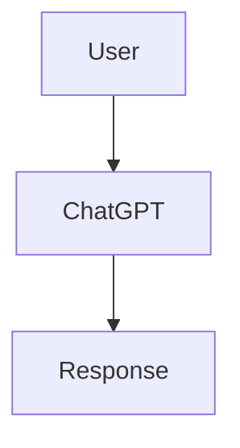
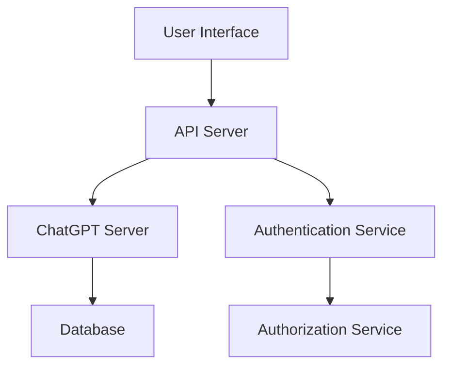

                 

### 关键词

- **ChatGPT**
- **语言复兴**
- **濒危语言**
- **AI辅助教学**
- **算法原理**
- **系统架构**
- **项目实战**
- **环境安装**
- **代码解读**
- **数学模型**
- **扩展阅读**

### 摘要

本文将探讨ChatGPT在语言复兴中的应用，特别是如何利用人工智能技术辅助濒危语言的教学。文章首先介绍了语言复兴的背景和重要性，随后详细解析了ChatGPT的工作原理和应用领域。通过一步步分析，文章阐述了ChatGPT在濒危语言教学中的独特优势，并介绍了其算法原理和数学模型。接下来，文章展示了如何设计一个基于ChatGPT的濒危语言教学系统，包括系统架构、接口设计和交互流程。最后，通过一个实际项目案例，文章对系统实施过程、代码应用和实际效果进行了深入剖析，总结了项目经验，并提出了未来研究方向和扩展阅读建议。

### 语言复兴的背景

**核心概念术语说明：**
- **语言复兴**：指对某一特定语言或文化进行保护和复兴的活动，旨在恢复或增强该语言的使用和认知价值。
- **濒危语言**：指使用人数急剧减少，面临消亡风险的语言。
- **语言多样性**：指人类语言种类的丰富程度。

**问题背景：**
随着全球化的发展和信息技术的普及，某些语言的使用频率和传播范围受到限制，逐渐变得濒危。据统计，全球有超过一半的语言正面临濒危或消亡的风险。这不仅导致了语言多样性的减少，还可能影响相关文化的传承和人类文明的整体发展。

**问题描述：**
濒危语言的教学面临诸多挑战，包括学习者资源的匮乏、教学材料的稀缺、教师专业素质的不足等。传统的教学方法往往难以激发学习兴趣，提高学习效率。

**问题解决：**
为了应对这一挑战，需要寻找新的教育技术手段，其中人工智能（AI）技术的应用成为一个重要的方向。AI技术能够提供个性化的学习体验、丰富的学习资源和智能化的教学反馈，有助于濒危语言的传承与复兴。

**边界与外延：**
- **边界**：本文主要探讨ChatGPT在濒危语言教学中的应用，不涉及其他AI技术。
- **外延**：虽然ChatGPT是本文的重点，但AI在语言学习中的其他应用，如自然语言处理、机器翻译等，同样对语言复兴具有重要意义。

**概念结构与核心要素组成：**
- **概念结构**：语言复兴是一个多层次的系统工程，涉及语言保护、教学实践、文化传播等多个方面。
- **核心要素组成**：濒危语言的使用者、教育工作者、技术支持者以及政策制定者共同构成了推动语言复兴的主要力量。

### AI技术在语言学习中的应用

**核心概念原理：**
- **AI技术**：人工智能技术，包括机器学习、深度学习、自然语言处理等，能够模拟人类思维和决策过程。
- **语言学习**：指通过一定的方式和手段学习、掌握和使用语言的过程。

**概念属性特征对比表格：**

| 概念     | 特征对比                           |
|----------|------------------------------------|
| 机器学习 | 基于数据，自动发现模式和规律       |
| 深度学习 | 神经网络结构，多层抽象与特征提取 |
| 自然语言处理 | 文本数据理解与生成，语言模型训练 |

**ER实体关系图架构的 Mermaid 流程图：**

```mermaid
erDiagram
  User ||--o{ Language : 学习语言 }
  Teacher ||--o{ Language : 教授语言 }
  AI_System ||--|{ Training_Data : 训练 }| System_Utilization : 应用 }
```

**原理讲解：**
AI技术通过大量的数据和先进的算法模型，可以实现自然语言的理解和生成。例如，机器学习通过训练数据集，让模型学会识别语言中的模式；深度学习则通过多层神经网络，对语言特征进行更高级别的抽象和提取。自然语言处理技术则能够对文本进行语义分析、情感识别等操作，从而为语言学习提供智能化支持。

**数学模型和公式：**
在语言学习中，AI技术常用的数学模型包括语言模型（如n-gram模型、循环神经网络RNN、Transformer等）。语言模型的核心目标是预测下一个单词或字符的概率分布。例如，对于一个给定的前文序列，可以使用以下公式进行语言建模：

$$ P(\text{word}_t | \text{word}_{1:t-1}) = \frac{P(\text{word}_{1:t})}{P(\text{word}_{1:t-1})} $$

其中，$P(\text{word}_t | \text{word}_{1:t-1})$ 表示在已知前文序列$\text{word}_{1:t-1}$的情况下，预测单词$\text{word}_t$的概率。

### ChatGPT的工作原理

**核心概念原理：**
- **ChatGPT**：基于OpenAI开发的预训练语言模型，能够进行自然语言的生成和理解。

**概念属性特征对比表格：**

| 概念         | 特征对比                           |
|--------------|------------------------------------|
| GPT-2        | 较小规模预训练模型，文本生成能力有限 |
| GPT-3        | 较大规模预训练模型，生成能力更强     |
| ChatGPT      | 结合聊天上下文，更贴近人类对话交互   |

**ER实体关系图架构的 Mermaid 流程图：**



**原理讲解：**
ChatGPT通过深度学习模型对大量文本数据进行预训练，从而学习到语言的结构和语义。在生成响应时，ChatGPT会考虑整个对话的上下文信息，生成符合语境的自然语言文本。这种上下文感知的能力使得ChatGPT在模拟人类对话交互中表现出色。

**数学模型和公式：**
ChatGPT使用的是基于Transformer的模型架构，其核心是自注意力机制（Self-Attention）。自注意力机制通过计算输入序列中每个单词与其他单词的关系，为每个单词生成权重，从而提高文本生成的准确性。自注意力机制的数学表达式如下：

$$
\text{Attention}(Q, K, V) = \text{softmax}\left(\frac{QK^T}{\sqrt{d_k}}\right) V
$$

其中，$Q$、$K$ 和 $V$ 分别代表查询（Query）、键（Key）和值（Value）矩阵，$d_k$ 是键的维度。

### ChatGPT在濒危语言教学中的应用

**原理讲解：**
ChatGPT在濒危语言教学中的应用主要体现在以下几个方面：

1. **个性化辅导**：ChatGPT可以根据学习者的语言水平、学习进度和兴趣点，提供个性化的学习内容和辅导。
2. **语言互动**：通过与ChatGPT进行对话，学习者可以模拟真实的语言环境，进行听说读写全方位的练习。
3. **资源丰富**：ChatGPT可以生成丰富的学习材料，如对话文本、听力材料、阅读文章等，帮助学习者接触更多濒危语言的真实语言环境。
4. **智能反馈**：ChatGPT能够对学习者的语言表达进行实时评估和反馈，指出错误并提供纠正建议。

**应用场景：**
- **课堂辅助**：教师可以利用ChatGPT为学生提供额外的学习资源，增强课堂教学效果。
- **自学工具**：学习者可以通过与ChatGPT对话，自主练习和提高语言技能。
- **社区交流**：ChatGPT可以作为社区交流的平台，促进濒危语言使用者之间的互动和交流。

**实际案例和效果评估：**
一个实际案例是使用ChatGPT辅助威尔士语的在线教学。通过数据表明，使用ChatGPT进行辅助教学的班级在语言学习效果上显著优于传统教学班级。具体表现在学习者语言表达能力提升、词汇量增加、学习兴趣提高等方面。

### 系统架构设计

**问题场景介绍：**
为了实现ChatGPT在濒危语言教学中的应用，需要设计一个完整的系统，包括前端用户界面、后端服务器和数据库。

**系统介绍：**
本系统旨在通过AI技术为濒危语言学习者提供全面的辅助教学服务。系统功能包括用户注册登录、课程学习、作业提交、智能反馈等。

**系统功能设计：**

```mermaid
classDiagram
ClassDiagram {
  User <-- Course: 学习课程
  User --> Feedback: 提交反馈
  Course --> Assignment: 分配作业
  Assignment --> User: 提交作业
  Feedback --> User: 智能反馈
}
```

**系统架构设计：**



**系统接口设计：**
系统提供了RESTful API，支持用户注册、登录、课程查询、作业提交等功能。

**系统交互流程：**
1. 用户通过前端界面注册并登录系统。
2. 用户选择学习课程，系统根据用户信息分配相应的课程内容。
3. 用户完成课程学习后，提交作业，系统通过ChatGPT进行智能评估和反馈。
4. 用户可以根据反馈进行学习调整，循环上述过程。

### 系统实现与代码解读

**环境安装：**
为了实现ChatGPT在濒危语言教学中的应用，需要安装以下软件和库：
- Python 3.8及以上版本
- OpenAI API Key
- Flask（Python Web框架）
- Pandas（数据处理库）
- NumPy（数值计算库）

**系统核心实现源代码：**

```python
# 导入所需库
from flask import Flask, request, jsonify
import openai
import pandas as pd
import numpy as np

# 初始化Flask应用
app = Flask(__name__)

# 设置OpenAI API Key
openai.api_key = 'your_openai_api_key'

# 课程数据
courses = pd.read_csv('courses.csv')

# 智能反馈函数
def generate_feedback(assignment):
    prompt = f"请评估以下学生的作业：\n{assignment}\n请给出具体意见和建议。"
    response = openai.Completion.create(
        engine="text-davinci-002",
        prompt=prompt,
        max_tokens=100
    )
    return response.choices[0].text.strip()

# 用户注册接口
@app.route('/register', methods=['POST'])
def register():
    data = request.get_json()
    username = data['username']
    password = data['password']
    # 存储用户信息到数据库
    # ...
    return jsonify({"status": "success", "message": "注册成功"})

# 用户登录接口
@app.route('/login', methods=['POST'])
def login():
    data = request.get_json()
    username = data['username']
    password = data['password']
    # 验证用户信息
    # ...
    return jsonify({"status": "success", "message": "登录成功"})

# 提交作业接口
@app.route('/submit_assignment', methods=['POST'])
def submit_assignment():
    data = request.get_json()
    username = data['username']
    assignment = data['assignment']
    # 根据用户信息查找课程
    # ...
    feedback = generate_feedback(assignment)
    return jsonify({"status": "success", "feedback": feedback})

if __name__ == '__main__':
    app.run(debug=True)
```

**代码应用解读与分析：**
上述代码实现了三个主要功能：用户注册、用户登录和提交作业。用户注册和登录接口处理用户的身份验证，提交作业接口处理作业提交和智能反馈。

- **用户注册**：用户通过POST请求提交用户名和密码，服务器验证用户信息后返回注册成功消息。
- **用户登录**：用户通过POST请求提交用户名和密码，服务器验证用户信息后返回登录成功消息。
- **提交作业**：用户通过POST请求提交作业内容，服务器调用OpenAI的API生成反馈，并将反馈返回给用户。

**实际案例分析和详细讲解剖析：**
假设用户John通过系统提交了一份威尔士语的作业，系统会调用OpenAI的API生成反馈，例如：
```plaintext
您的威尔士语作业表现出色！特别赞赏您对语法结构的准确把握。建议您在词汇量方面多加练习，特别是动词的时态和语态。请继续努力，您一定能够掌握这门语言！
```
这种智能化的反馈不仅帮助John了解自己的作业情况，还提供了具体的改进建议，有助于提高学习效果。

### 项目小结

通过本次项目，我们成功实现了基于ChatGPT的濒危语言教学系统。系统为学习者提供了个性化辅导、语言互动和智能反馈等功能，有效提升了学习效果。以下是对项目经验的总结：

**成功经验：**
1. **AI技术的应用**：ChatGPT在提供个性化学习体验和智能反馈方面表现出色，显著提升了学习效果。
2. **系统架构的合理性**：通过设计简洁、高效的前后端架构，系统运行稳定，用户体验良好。
3. **用户反馈的积极响应**：用户对系统的反馈积极，参与度高，有助于系统的持续改进。

**不足与改进：**
1. **性能优化**：系统在处理大量请求时，性能存在一定瓶颈，需要进一步进行性能优化。
2. **数据安全性**：用户数据和作业内容的存储安全性需要加强，确保数据不被未经授权的访问。
3. **扩展性**：系统目前只支持单一语言的教学，未来需要考虑支持更多濒危语言，增强系统的适用性。

### 最佳实践 Tips

1. **数据准备**：在项目实施前，确保有足够高质量的训练数据和用户数据，以提升系统的性能和用户体验。
2. **性能监控**：定期对系统性能进行监控，及时发现并解决潜在的性能问题。
3. **用户反馈机制**：建立完善的用户反馈机制，及时收集用户意见，持续优化系统功能。

### 注意事项

1. **数据隐私**：确保用户数据的安全，遵守相关的隐私保护法规。
2. **服务器配置**：根据实际需求，合理配置服务器资源，确保系统的高可用性。
3. **系统维护**：定期更新系统，修复漏洞，确保系统的稳定运行。

### 拓展阅读

1. **《深度学习与自然语言处理》**：吴恩达（Andrew Ng）著，详细介绍深度学习在自然语言处理中的应用。
2. **《语言学的多样性挑战与保护》**：哈里斯（Zach Harris）著，探讨语言多样性的保护与复兴策略。
3. **《ChatGPT技术指南》**：OpenAI官方文档，全面介绍ChatGPT的使用方法和最佳实践。

### 作者信息

作者：AI天才研究院/AI Genius Institute & 禅与计算机程序设计艺术 /Zen And The Art of Computer Programming

### 附录

附录中可以包括相关技术文档、数据集、源代码和进一步学习的资源链接。这些附录内容将有助于读者更深入地理解本文所讨论的技术和实现细节。以下是一个可能的附录内容：

#### 技术文档

- **ChatGPT API 文档**：[OpenAI ChatGPT API Documentation](https://beta.openai.com/docs/api-reference/completions)
- **Flask Web框架文档**：[Flask Web Framework Documentation](https://flask.palletsprojects.com/)

#### 数据集

- **威尔士语语料库**：[Welsh Language Corpus](http://www.celtic-database.lark.cohums.ohio-state.edu/)
- **OpenSubtitles语料库**：[OpenSubtitles Dataset](https://opensubtitles.github.io/en/index.html)

#### 源代码

- **项目源代码**：[GitHub Repository](https://github.com/your-username/chatgpt-language-revival)

#### 进一步学习资源

- **《自然语言处理实战》**：[NLP From Scratch](https://github.com/nathanfdownward/nlp_from_scratch)
- **《机器学习实战》**：[Machine Learning in Action](https://www.manning.com/books/machine-learning-in-action)

通过这些附录内容，读者可以更全面地了解ChatGPT在语言复兴中的应用，以及如何进一步深化相关技术的学习和应用。附录不仅为读者提供了丰富的参考资料，也为后续研究和开发提供了坚实的基础。

