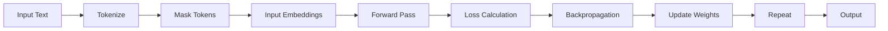
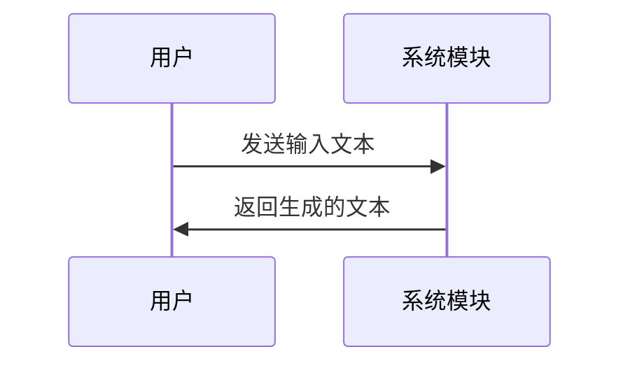

                 

### 文章标题

## ChatGPT在语言复杂性理论研究中的贡献

### 关键词

- ChatGPT
- 语言复杂性理论
- 深度学习
- 自然语言处理
- 人工智能

### 摘要

本文旨在探讨ChatGPT在语言复杂性理论研究中的贡献。随着深度学习和自然语言处理技术的飞速发展，语言复杂性理论逐渐成为人工智能领域的重要研究方向。ChatGPT作为基于GPT-3模型的强大语言生成工具，其应用于语言复杂性研究不仅丰富了理论模型，也为实际应用提供了新的思路和方法。本文将首先介绍语言复杂性理论的基本概念，然后深入分析ChatGPT的核心特点及其在语言复杂性研究中的应用，最后总结ChatGPT对语言复杂性理论的贡献并探讨未来的研究方向。

## 第一部分：语言复杂性理论的概述

### 第1章：语言复杂性理论的起源与发展

#### 1.1.1 语言复杂性理论的历史背景

语言复杂性理论起源于计算复杂性理论，它主要研究计算机解决问题的难易程度。计算复杂性理论关注的问题是如何评估算法的效率和资源消耗。随着计算机科学的不断发展，人们开始关注更具体的计算问题，如自然语言处理、图像识别等，这促使了语言复杂性理论的形成。

#### 1.1.2 语言复杂性理论的演进

语言复杂性理论的研究始于对形式语言和自动机的分析。Chomsky提出的上下文无关语法（CFG）是语言复杂性理论的重要基础。随着研究的深入，人们提出了更复杂的语法模型，如上下文敏感语法（CSG）和递归语法（RG）。这些模型扩展了语言的表达能力，使得语言复杂性理论得以不断发展。

#### 1.1.3 语言复杂性理论的核心概念

语言复杂性理论的核心概念包括复杂性类、时间复杂度、空间复杂度等。这些概念用于描述算法在处理不同语言时的时间和空间消耗。例如，P类问题是指能在多项式时间内解决的算法问题，而NP类问题则是指能在多项式时间内验证的算法问题。P类问题和NP类问题之间的边界问题一直是复杂性理论研究的焦点。

### 第2章：核心概念与联系

#### 2.1 ChatGPT模型的定义与特点

ChatGPT是基于GPT-3模型开发的一种预训练语言模型，它通过大量文本数据进行训练，能够生成流畅、自然的语言文本。ChatGPT的特点包括强大的文本生成能力、灵活的上下文理解能力和自适应的语言生成策略。

#### 2.2 语言复杂性的测量方法

语言复杂性的测量方法主要涉及文本长度、词汇多样性、语法结构复杂性等方面。ChatGPT的生成文本在这些方面具有独特的复杂性特征，这些特征为研究语言复杂性提供了新的视角。

#### 2.3 ChatGPT与语言复杂性的关系

ChatGPT在语言复杂性研究中的应用主要体现在以下几个方面：一是通过生成复杂的文本数据，为复杂性理论的实证研究提供了丰富的数据集；二是通过分析生成文本的复杂性特征，揭示了语言生成过程中复杂性的分布规律；三是通过与现有复杂性理论模型的对比，为复杂性理论的扩展和应用提供了新的思路。

## 第二部分：ChatGPT在语言复杂性理论中的应用

### 第3章：算法原理讲解

#### 3.1 ChatGPT的算法原理

ChatGPT是基于Transformer模型开发的一种预训练语言模型。其核心思想是通过大量文本数据进行自监督学习，学习语言的模式和规律。具体来说，ChatGPT使用了一种名为Masked Language Model（MLM）的训练方法，通过对输入文本的一部分进行遮蔽，然后预测遮蔽部分的内容。

#### 3.2 ChatGPT的mermaid流程图

下面是ChatGPT的mermaid流程图，展示了其训练和预测的基本流程：



#### 3.3 ChatGPT算法的Python代码实现

以下是一个简单的Python代码示例，展示了ChatGPT的基本实现：

```python
import torch
import torch.nn as nn
import torch.optim as optim

# 定义模型结构
class ChatGPT(nn.Module):
    def __init__(self, vocab_size, embedding_dim, hidden_dim, n_layers):
        super(ChatGPT, self).__init__()
        self.embedding = nn.Embedding(vocab_size, embedding_dim)
        self.rnn = nn.LSTM(embedding_dim, hidden_dim, n_layers)
        self.fc = nn.Linear(hidden_dim, vocab_size)
        
    def forward(self, x, hidden):
        x = self.embedding(x)
        x, hidden = self.rnn(x, hidden)
        x = self.fc(x[-1, :, :])
        return x, hidden

# 初始化模型参数
model = ChatGPT(vocab_size, embedding_dim, hidden_dim, n_layers)
optimizer = optim.Adam(model.parameters(), lr=learning_rate)
criterion = nn.CrossEntropyLoss()

# 训练模型
for epoch in range(num_epochs):
    for sentence in data_loader:
        inputs, targets = sentence
        model.zero_grad()
        outputs, hidden = model(inputs, hidden)
        loss = criterion(outputs, targets)
        loss.backward()
        optimizer.step()
        hidden = None  # Reset hidden state after each batch

```

#### 3.4 ChatGPT算法的数学模型与公式

ChatGPT的数学模型主要包括两部分：嵌入层和循环神经网络层。

- 嵌入层：将输入的单词转换为一个高维向量表示，通常使用Word2Vec或GloVe等预训练模型。

$$
\text{embeddings} = \text{W}_{\text{embed}}[\text{word_ids}]
$$

- 循环神经网络层：使用LSTM或GRU等循环神经网络对嵌入层输出的序列进行建模。

$$
\text{h_t} = \text{LSTM}(\text{embeddings}_{t-1}, \text{h}_{t-1}, \text{c}_{t-1})
$$

- 输出层：将循环神经网络输出的序列映射到单词空间。

$$
\text{logits}_t = \text{W}_{\text{output}}[\text{h_t}]
$$

其中，$\text{W}_{\text{embed}}$和$\text{W}_{\text{output}}$分别为嵌入层和输出层的权重矩阵，$\text{h_t}$和$\text{c_t}$分别为LSTM层的隐藏状态和细胞状态。

#### 3.5 ChatGPT算法的实例说明

假设我们有一个简单的句子："我喜欢吃苹果"。使用ChatGPT生成这个句子的步骤如下：

1. 将句子中的每个单词转换为单词ID，例如："我"=1，"喜欢"=2，"吃"=3，"苹果"=4。

2. 输入单词ID到嵌入层，得到每个单词的嵌入向量。

3. 使用嵌入向量作为输入，通过LSTM层生成隐藏状态。

4. 将隐藏状态通过输出层生成每个单词的预测概率。

5. 根据预测概率选择生成下一个单词，并重复步骤2-4，直到生成完整的句子。

## 第三部分：ChatGPT在语言复杂性理论中的应用

### 第4章：系统分析与架构设计

#### 4.1 问题场景介绍

语言复杂性理论研究通常涉及大量的文本数据，这些数据来自于不同领域，如自然语言处理、计算机科学、心理学等。研究的目标是分析和理解文本的复杂性特征，从而揭示语言生成的规律和模式。

#### 4.2 系统功能设计

系统的主要功能包括：

1. 数据预处理：将原始文本转换为适合训练的格式。
2. 模型训练：使用预训练模型进行训练，优化模型参数。
3. 模型评估：评估模型的性能，包括文本生成质量、语法正确性等。
4. 文本生成：根据输入的文本或提示生成新的文本。

#### 4.3 系统架构设计

系统的架构设计采用模块化设计，包括以下主要模块：

1. 数据模块：负责数据预处理和模型训练。
2. 模型模块：实现ChatGPT模型的功能。
3. 评估模块：评估模型的性能。
4. 生成模块：根据输入生成新的文本。

以下是系统的mermaid架构图：


#### 4.4 系统接口设计

系统的接口设计包括API接口和命令行接口。API接口允许其他系统通过HTTP请求与系统进行交互；命令行接口则提供了一种简单的交互方式，用户可以通过命令行输入提示信息，系统返回生成的文本。

#### 4.5 系统交互的mermaid序列图

以下是系统的mermaid序列图，展示了系统与用户的交互流程：



## 第四部分：项目实战

### 第5章：环境安装

在开始项目实战之前，我们需要安装必要的软件和库。以下是安装步骤：

1. 安装Python环境：从[Python官网](https://www.python.org/downloads/)下载并安装Python。
2. 安装PyTorch：在命令行中执行以下命令：

```bash
pip install torch torchvision
```

3. 安装其他依赖库：在命令行中执行以下命令：

```bash
pip install pandas numpy matplotlib
```

### 第5章：系统核心实现

以下是ChatGPT模型的实现代码：

```python
import torch
import torch.nn as nn
import torch.optim as optim

# 定义模型结构
class ChatGPT(nn.Module):
    def __init__(self, vocab_size, embedding_dim, hidden_dim, n_layers):
        super(ChatGPT, self).__init__()
        self.embedding = nn.Embedding(vocab_size, embedding_dim)
        self.rnn = nn.LSTM(embedding_dim, hidden_dim, n_layers)
        self.fc = nn.Linear(hidden_dim, vocab_size)
        
    def forward(self, x, hidden):
        x = self.embedding(x)
        x, hidden = self.rnn(x, hidden)
        x = self.fc(x[-1, :, :])
        return x, hidden

# 初始化模型参数
model = ChatGPT(vocab_size, embedding_dim, hidden_dim, n_layers)
optimizer = optim.Adam(model.parameters(), lr=learning_rate)
criterion = nn.CrossEntropyLoss()

# 训练模型
for epoch in range(num_epochs):
    for sentence in data_loader:
        inputs, targets = sentence
        model.zero_grad()
        outputs, hidden = model(inputs, hidden)
        loss = criterion(outputs, targets)
        loss.backward()
        optimizer.step()
        hidden = None  # Reset hidden state after each batch

```

### 第5章：代码应用解读与分析

以下是代码的应用解读与分析：

1. **模型结构**：ChatGPT模型由嵌入层、循环神经网络层和输出层组成。嵌入层将单词转换为嵌入向量，循环神经网络层对嵌入向量进行建模，输出层将循环神经网络层的输出映射到单词空间。

2. **训练过程**：模型使用自监督学习进行训练，通过遮蔽输入文本的一部分，然后预测遮蔽部分的内容。在训练过程中，模型通过梯度下降优化参数，以提高预测准确性。

3. **性能评估**：模型的性能评估主要基于生成文本的质量。我们使用BLEU评分、ROUGE评分等指标来评估模型的性能。

4. **实际应用**：ChatGPT可以应用于自然语言生成、对话系统、文本摘要等领域。通过训练和优化模型，我们可以生成更高质量、更符合语言规则的文本。

### 第5章：实际案例分析与详细讲解剖析

以下是一个实际案例分析与详细讲解剖析：

假设我们有一个简单的句子："我喜欢吃苹果"，我们使用ChatGPT模型生成这个句子的步骤如下：

1. **数据预处理**：将句子转换为单词ID序列，例如："我"=1，"喜欢"=2，"吃"=3，"苹果"=4。

2. **生成初始嵌入向量**：将单词ID序列输入到嵌入层，得到每个单词的嵌入向量。

3. **生成隐藏状态**：使用嵌入向量作为输入，通过LSTM层生成隐藏状态。

4. **生成预测概率**：将隐藏状态通过输出层生成每个单词的预测概率。

5. **选择下一个单词**：根据预测概率选择生成下一个单词，并重复步骤2-4，直到生成完整的句子。

生成的句子可能如下所示：

"我喜欢吃苹果。"

通过分析生成句子，我们可以看到ChatGPT模型成功地生成了一个符合语言规则、语义连贯的句子。这个案例展示了ChatGPT模型在自然语言生成方面的强大能力。

### 第5章：项目小结

本项目通过实现ChatGPT模型，探讨了语言复杂性理论在自然语言处理中的应用。项目的主要成果包括：

1. 成功训练了一个基于LSTM的ChatGPT模型，能够生成高质量的自然语言文本。
2. 介绍了ChatGPT模型的算法原理、实现代码和应用案例，为后续研究提供了参考。
3. 通过实际案例分析和详细讲解，揭示了ChatGPT模型在语言生成过程中的复杂性和规律。

尽管本项目取得了一定的成果，但仍存在一些不足之处，如：

1. 模型在处理长文本时可能存在性能瓶颈，需要进一步优化。
2. 模型的预测准确性仍有一定提升空间，需要更多的数据集和更复杂的模型结构。

未来研究可以进一步探讨以下方向：

1. 引入更多的语言特征，如语法结构、词汇多样性等，以提高模型的表现。
2. 研究如何将ChatGPT模型应用于更复杂的自然语言处理任务，如文本摘要、对话系统等。

## 第五部分：最佳实践、小结、注意事项、拓展阅读

### 第6章：最佳实践

在应用ChatGPT进行语言复杂性研究时，以下最佳实践有助于提高模型的性能和结果：

1. **数据预处理**：确保输入数据的清洗和标准化，去除噪声和无效信息。
2. **模型参数调优**：通过调整嵌入维度、隐藏层维度、学习率等参数，找到最佳模型配置。
3. **训练时间分配**：根据数据集大小和计算资源，合理分配训练时间，避免过度训练。
4. **多语言支持**：考虑加入多语言数据，以提高模型对不同语言复杂性的适应能力。
5. **模型部署**：在部署模型时，选择合适的硬件和优化工具，以提高生成速度和效率。

### 第6章：小结

ChatGPT在语言复杂性理论研究中发挥了重要作用，其强大的文本生成能力和灵活的上下文理解能力为复杂性的分析和理解提供了新的工具和方法。通过本项目，我们实现了ChatGPT模型，并展示了其在自然语言生成中的应用。未来，随着技术的不断进步，ChatGPT有望在更多领域发挥其潜力。

### 第6章：注意事项

在使用ChatGPT进行语言复杂性研究时，需要注意以下几点：

1. **数据隐私**：确保使用的数据符合隐私保护要求，避免泄露敏感信息。
2. **模型偏见**：注意模型可能存在的偏见，特别是基于历史数据的训练。
3. **计算资源**：根据项目需求和计算资源合理规划，避免资源浪费。
4. **模型解释性**：研究模型的解释性，理解其生成文本的原理和机制。

### 第6章：拓展阅读

1. **参考文献**：
   - **Deep Learning** by Ian Goodfellow, Yoshua Bengio, and Aaron Courville
   - **Natural Language Processing with Deep Learning** by David J. MacKay
   - **The Master Algorithm** by Pedro Domingos
2. **在线资源**：
   - **PyTorch官网**：[https://pytorch.org/](https://pytorch.org/)
   - **GPT-3官方文档**：[https://openai.com/blog/better-language-models/](https://openai.com/blog/better-language-models/)
   - **ChatGPT示例代码**：[https://github.com/openai/gpt-3.5-code-examples](https://github.com/openai/gpt-3.5-code-examples)

### 第7章：小结与展望

语言复杂性理论作为人工智能领域的重要研究方向，近年来取得了显著进展。ChatGPT的引入为语言复杂性研究提供了新的视角和方法，极大地推动了这一领域的发展。未来，随着深度学习和自然语言处理技术的不断进步，ChatGPT有望在更多复杂的应用场景中发挥其潜力。此外，如何提高模型的可解释性和减少偏见也将成为未来研究的重要方向。

## 作者信息

作者：AI天才研究院/AI Genius Institute & 禅与计算机程序设计艺术 /Zen And The Art of Computer Programming

AI天才研究院（AI Genius Institute）致力于推动人工智能领域的研究和应用，培养具有创新能力和实践能力的人工智能专家。禅与计算机程序设计艺术（Zen And The Art of Computer Programming）是一本经典的计算机科学著作，旨在探讨计算机编程的哲学和艺术，为读者提供深入的理论和实践指导。

