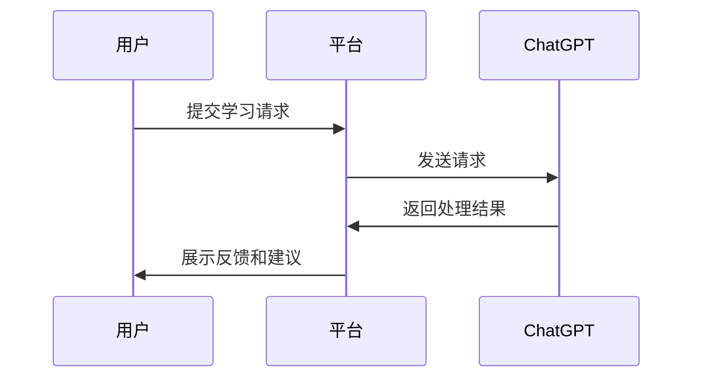

                 

### 第1章: 问题背景与核心概念

### 1.1 问题背景

#### 1.1.1 传统语言学习的局限性

传统语言学习通常依赖于课本、教师讲授、课后练习和考试等模式。尽管这种方法在一定程度上能够帮助学生掌握语言知识，但仍然存在一些显著的局限性：

1. **单一的教学方式**：传统教学方式主要依赖于教师的口头讲授和学生的被动接受，缺乏互动和个性化。
2. **学习进度不一致**：不同学生的学习能力和进度存在差异，但传统教学往往难以做到因材施教。
3. **语言环境缺失**：很多学生在课堂之外缺乏使用目标语言的机会，难以进行实际应用。
4. **个性化辅导资源有限**：优质教师的资源有限，难以满足大量学生的个性化辅导需求。

#### 1.1.2 个性化学习的需求与挑战

个性化学习旨在根据每个学生的特点和能力，为其提供最适合的学习路径和资源。在语言学习中，个性化学习的需求尤为突出：

1. **差异化教学**：学生之间在语言学习上的差异很大，个性化学习可以满足不同学生的需求。
2. **实时反馈与调整**：通过实时监测学生的学习情况，个性化学习可以迅速调整教学策略。
3. **增强学习动力**：个性化学习可以让学生感到自己正在接受最适合自己的教育，从而增强学习动力。

然而，实现个性化学习也面临一些挑战：

1. **资源与成本**：个性化学习需要大量的教师资源和个性化的教学材料，这可能导致成本增加。
2. **技术门槛**：实现个性化学习需要依赖先进的人工智能技术和数据分析能力，这对于许多教育机构和教师来说是一个挑战。
3. **数据隐私**：个性化学习依赖于对大量学生数据进行分析，如何保护学生的隐私成为了一个重要问题。

#### 1.1.3 ChatGPT的发展与应用

ChatGPT是由OpenAI开发的一种基于Transformer模型的预训练语言模型，它通过大规模的数据预训练和特定领域的微调，能够生成高质量的自然语言文本。ChatGPT在多个领域展现了其强大的能力，包括问答系统、文本生成、机器翻译等。

在语言学习中，ChatGPT可以作为一种智能辅导工具，为不同学习需求的学生提供个性化的学习体验。例如：

1. **口语训练**：ChatGPT可以模拟真实的对话场景，为学生提供即时的口语反馈。
2. **写作辅导**：ChatGPT可以帮助学生构思文章结构、修改语法错误，提供写作建议。
3. **词汇学习**：ChatGPT可以解释词汇用法、提供例句，帮助学生记忆和理解新词汇。

ChatGPT的发展为语言学习个性化提供了新的解决方案，使得个性化学习变得更加可行和高效。

#### 1.2 核心概念

##### 1.2.1 ChatGPT的概念与原理

ChatGPT是基于Transformer模型的一种预训练语言模型，其核心思想是通过在大量文本上进行预训练，使其具备理解和使用自然语言的能力。具体来说，ChatGPT的原理包括以下几个关键步骤：

1. **数据预训练**：ChatGPT在预训练阶段会使用大量互联网文本数据进行训练，学习文本的分布和语言规律。
2. **Transformer模型**：ChatGPT采用了Transformer模型，这是一种基于自注意力机制的深度神经网络结构，能够有效地处理序列数据。
3. **生成文本**：通过输入一个种子文本，ChatGPT可以使用其学到的语言模型生成连贯、自然的文本。

##### 1.2.2 个性化学习与智能辅导

个性化学习是一种以学生为中心的教育理念，通过分析学生的学习数据，为其提供最适合的学习路径和资源。在语言学习中，智能辅导系统可以利用ChatGPT的能力，实现以下功能：

1. **学习路径规划**：根据学生的学习数据和目标，智能辅导系统可以自动生成个性化的学习路径。
2. **实时反馈与调整**：智能辅导系统可以实时监测学生的学习进度，并提供个性化的反馈和调整建议。
3. **智能互动**：通过ChatGPT，智能辅导系统可以模拟真实的语言环境，与学生学习互动，提高学习效果。

##### 1.2.3 语言学习中的问题与机会

在语言学习中，存在以下一些关键问题：

1. **口语表达**：学生常常缺乏实际对话的机会，难以提高口语能力。
2. **写作技巧**：学生需要大量的练习和反馈来提高写作技巧。
3. **词汇记忆**：词汇学习是一个长期且重复的过程，学生往往容易忘记新学的词汇。

然而，这些问题也为ChatGPT提供了广阔的应用机会：

1. **口语训练**：ChatGPT可以模拟真实的对话场景，提供即时的口语反馈，帮助学生提高口语表达能力。
2. **写作辅导**：ChatGPT可以分析学生的写作，提供语法和结构上的建议，帮助学生提高写作技巧。
3. **词汇学习**：ChatGPT可以通过生成例句和解释词汇用法，帮助学生记忆和理解新词汇。

通过ChatGPT的应用，语言学习个性化成为可能，这不仅提高了学习效果，也为教育行业带来了新的变革。

#### 1.3 本章小结

本章介绍了语言学习个性化的问题背景、核心概念以及ChatGPT的发展与应用。传统语言学习存在一些显著的局限性，而个性化学习旨在根据学生的特点和能力，提供最适合的学习路径和资源。ChatGPT作为一种先进的语言模型，通过其强大的文本生成能力，为语言学习个性化提供了新的解决方案。接下来，我们将进一步探讨ChatGPT的基本原理，以及其在语言学习中的应用。

### 第2章: ChatGPT的基本原理

#### 2.1 ChatGPT的架构与技术基础

##### 2.1.1 Transformer模型详解

Transformer模型是由Google提出的一种基于自注意力机制的深度神经网络结构，其核心思想是利用自注意力机制来处理序列数据。相比传统的循环神经网络（RNN），Transformer模型能够更有效地并行处理输入序列，并且不需要像RNN那样进行序列的递归处理。

**自注意力机制**：自注意力机制允许模型在生成每个输出时，自动考虑输入序列中的所有位置，并为其分配不同的权重。这意味着模型可以在生成文本时，动态地调整对各个输入词的关注程度。

**多头注意力**：Transformer模型通过多头注意力机制，将输入序列分成多个头，每个头独立地学习不同类型的注意力权重。这种方法可以增强模型的表示能力和泛化能力。

**编码器和解码器**：Transformer模型由编码器和解码器组成。编码器负责将输入序列编码成固定长度的向量，解码器则将这些编码后的向量解码成输出序列。

##### 2.1.2 预训练与微调

**预训练**：预训练是指在大规模语料库上进行模型训练，使模型掌握通用的语言规律和知识。对于ChatGPT来说，预训练阶段使用了大量的互联网文本数据，包括新闻文章、社交媒体帖子、书籍等，通过这种方式，模型可以学习到丰富的语言表达和知识。

**微调**：微调是在预训练的基础上，针对特定任务对模型进行进一步的训练。例如，在语言学习应用中，可以对ChatGPT进行微调，使其能够更好地适应口语训练、写作辅导和词汇学习等任务。

##### 2.1.3 语言模型的应用场景

**问答系统**：ChatGPT可以用于构建问答系统，通过理解和回答用户的问题，提供信息查询和知识获取服务。

**文本生成**：ChatGPT可以生成高质量的自然语言文本，包括文章、故事、邮件等。这种能力使得ChatGPT在内容创作、自动摘要和文案生成等领域具有广泛的应用。

**机器翻译**：ChatGPT在机器翻译中也展现出了强大的能力，通过预训练和微调，可以实现高精度的文本翻译。

**自然语言处理**：ChatGPT在自然语言处理（NLP）领域的应用非常广泛，包括情感分析、文本分类、信息抽取等。

#### 2.2 ChatGPT的工作机制

##### 2.2.1 模型训练过程

ChatGPT的训练过程分为两个阶段：预训练和微调。

**预训练**：在预训练阶段，ChatGPT通过使用大量文本数据进行训练，学习文本的分布和语言规律。这一过程使用了Transformer模型的自注意力机制，使模型能够生成连贯、自然的文本。

**微调**：在微调阶段，ChatGPT根据特定任务的需求进行进一步训练。例如，对于语言学习应用，可以通过微调来优化模型在口语训练、写作辅导和词汇学习等任务上的性能。

**数据增强**：为了提高模型的泛化能力，训练过程中通常使用数据增强技术，如随机插入、删除和替换文本中的词，从而增加模型的训练数据多样性。

##### 2.2.2 输出生成机制

ChatGPT的输出生成机制是其核心功能之一。通过输入一个种子文本，ChatGPT可以生成连贯、自然的文本。具体来说，生成过程包括以下几个关键步骤：

1. **输入编码**：将输入文本编码成模型可以处理的格式。
2. **解码与生成**：模型在生成每个输出词时，首先对当前已生成的文本进行编码，然后利用自注意力机制生成下一个词的预测概率分布，最后从分布中采样得到下一个输出词。
3. **迭代生成**：重复上述过程，直到生成完整的文本或达到设定的生成长度。

##### 2.2.3 实时交互与个性化辅导

ChatGPT可以与用户进行实时交互，提供个性化的辅导服务。具体实现机制包括：

1. **用户输入处理**：接收用户的输入文本，并对其进行预处理，如分词、去除标点等。
2. **模型预测**：使用训练好的ChatGPT模型对用户输入进行预测，生成回复文本。
3. **反馈与调整**：根据用户反馈调整模型输出，以提高交互质量和用户满意度。

通过实时交互和个性化辅导，ChatGPT能够为用户提供个性化的学习体验，满足不同学习需求。

#### 2.3 ChatGPT的优化与调参

##### 2.3.1 参数调整策略

ChatGPT的性能受到多种参数的影响，包括模型规模、学习率、批量大小等。为了优化模型性能，通常采用以下参数调整策略：

1. **模型规模**：通过增加模型参数数量，可以提高模型的表示能力。然而，这也可能导致计算资源和训练时间的增加。
2. **学习率**：学习率是模型训练中的一个重要参数，影响模型收敛速度。合适的初始学习率可以帮助模型更快地收敛，但过大会导致模型振荡，过小则收敛速度慢。
3. **批量大小**：批量大小影响模型训练的稳定性。较大的批量大小可以减少方差，提高模型稳定性，但可能导致梯度消失或爆炸。

##### 2.3.2 模型优化技巧

为了进一步提高ChatGPT的性能，可以采用以下优化技巧：

1. **动态学习率调整**：通过在训练过程中动态调整学习率，可以加速模型收敛。常用的动态学习率调整方法包括指数衰减、余弦退火等。
2. **正则化**：正则化方法可以减少模型过拟合现象，提高泛化能力。常见的正则化方法包括Dropout、权重衰减等。
3. **迁移学习**：迁移学习是指将预训练模型在特定任务上进行微调，利用预训练模型已有的知识和能力，提高新任务的性能。

##### 2.3.3 实际应用中的调参案例

在实际应用中，参数调整和模型优化是一个复杂的过程，需要根据具体任务和数据集进行调参。以下是一个简单的调参案例：

1. **模型规模**：选择一个中等规模的Transformer模型，如Bert-base。
2. **学习率**：初始学习率设置为5e-5，使用指数衰减策略，每5000步降低学习率10倍。
3. **批量大小**：批量大小设置为32。
4. **正则化**：使用Dropout正则化，Dropout率设置为0.1。

通过这些参数设置，模型在训练过程中表现出良好的收敛速度和泛化能力。

#### 2.4 本章小结

本章详细介绍了ChatGPT的基本原理，包括Transformer模型的架构、预训练与微调过程、生成机制以及实时交互与个性化辅导的实现。通过深入理解ChatGPT的工作机制，我们可以更好地把握其在语言学习个性化中的应用潜力。接下来，我们将探讨ChatGPT在语言学习中的应用，分析其在口语训练、写作辅导和词汇学习等领域的优势和应用案例。

### 第3章: ChatGPT在语言学习中的应用

#### 3.1 ChatGPT与语言学习的结合点

ChatGPT在语言学习中的应用主要体现在以下几个方面：

##### 3.1.1 交互式学习体验

交互式学习体验是ChatGPT在语言学习中的一个重要优势。通过与ChatGPT进行对话，学生可以模拟真实的语言环境，进行互动式学习。这种交互式学习体验不仅可以提高学生的口语能力，还可以增强其语言运用能力。以下是交互式学习体验的具体实现：

1. **实时对话**：ChatGPT可以即时回答学生的提问，提供即时的语言反馈。
2. **情境模拟**：ChatGPT可以根据学生的需求和目标，模拟不同的语言使用场景，如购物、旅行、社交等，帮助学生更好地理解语言的实际应用。
3. **个性化辅导**：ChatGPT可以根据学生的学习数据，提供个性化的学习建议和辅导，帮助其克服语言学习中的难点。

##### 3.1.2 智能化辅导系统

智能化辅导系统是ChatGPT在语言学习中的另一个重要应用。通过结合人工智能技术和数据分析，ChatGPT可以为学生提供全面的辅导服务，包括口语训练、写作辅导和词汇学习等。以下是智能化辅导系统的具体实现：

1. **口语训练**：ChatGPT可以模拟真实的对话场景，提供即时的口语反馈，帮助学生提高口语表达能力。
2. **写作辅导**：ChatGPT可以分析学生的写作，提供语法和结构上的建议，帮助学生提高写作技巧。
3. **词汇学习**：ChatGPT可以解释词汇用法、提供例句，帮助学生记忆和理解新词汇。

##### 3.1.3 个性化学习路径设计

个性化学习路径设计是ChatGPT在语言学习中的核心应用之一。通过分析学生的学习数据和行为，ChatGPT可以为学生设计最适合其学习需求的学习路径，从而提高学习效果。以下是个性化学习路径设计的关键步骤：

1. **数据采集**：收集学生的学习行为数据，如学习时间、学习内容、提问频率等。
2. **数据分析**：分析学生学习数据，确定其学习习惯、兴趣点和薄弱环节。
3. **路径设计**：根据分析结果，设计个性化的学习路径，包括学习内容、学习进度和学习目标。
4. **实时调整**：根据学生的学习反馈和学习效果，实时调整学习路径，确保其持续适应学生的需求。

#### 3.2 ChatGPT在口语训练中的应用

##### 3.2.1 口语训练的方法与挑战

口语训练是语言学习中的一个重要环节，其方法主要包括以下几种：

1. **模仿练习**：通过模仿语音、语调和发音，帮助学生提高口语表达能力。
2. **对话练习**：通过与他人进行对话练习，提高学生的语言运用能力和沟通能力。
3. **情景模拟**：通过模拟真实的生活、工作或学习场景，让学生在特定情境下进行口语表达。

然而，口语训练也面临一些挑战：

1. **缺乏交流对象**：很多学生由于周围缺乏母语交流对象，难以进行有效的口语训练。
2. **即时反馈不足**：学生往往难以获得即时的口语反馈，难以及时纠正发音和语法错误。
3. **学习资源有限**：优质的口语训练资源和材料较为有限，难以满足不同学生的需求。

##### 3.2.2 ChatGPT在口语训练中的优势

ChatGPT在口语训练中具有显著的优势：

1. **实时对话**：ChatGPT可以即时回答学生的提问，提供即时的口语反馈，帮助学生及时纠正错误。
2. **模拟真实场景**：ChatGPT可以根据学生的学习需求和目标，模拟不同的语言使用场景，如购物、旅行、社交等，提高学生的实际应用能力。
3. **个性化辅导**：ChatGPT可以根据学生的学习数据，提供个性化的口语训练建议和辅导，帮助学生克服口语学习中的难点。

##### 3.2.3 实际应用案例

以下是一个实际的ChatGPT口语训练应用案例：

某外语培训机构采用ChatGPT作为口语训练工具，为学生提供个性化的口语辅导。具体应用流程如下：

1. **学生注册与登录**：学生通过平台注册并登录，填写个人信息和学习目标。
2. **口语训练**：学生在平台上与ChatGPT进行实时对话，提出问题或进行口语练习。
3. **即时反馈**：ChatGPT为学生提供即时的口语反馈，包括发音、语法和表达方式的建议。
4. **数据记录与分析**：平台记录学生的口语训练数据，分析其学习习惯和弱点，为后续辅导提供依据。
5. **个性化辅导**：根据学生的反馈和学习数据，ChatGPT提供个性化的口语训练建议，如调整训练频率、内容难度等。

通过这个案例，可以看出ChatGPT在口语训练中的应用不仅提高了学习效果，还为口语训练提供了一种新的解决方案。

#### 3.3 ChatGPT在写作辅导中的应用

##### 3.3.1 写作辅导的需求与难点

写作辅导是语言学习中的重要环节，其需求主要包括：

1. **语法和结构指导**：学生需要系统的语法和结构指导，以提高写作质量。
2. **创意和思路启发**：学生需要写作灵感和思路，以便更好地表达自己的想法。
3. **反馈和修改**：学生需要得到教师或同伴的反馈，以便进行写作修改和改进。

然而，写作辅导也面临一些难点：

1. **反馈延迟**：传统的写作反馈机制通常存在反馈延迟，学生难以在短时间内获得改进建议。
2. **个性化指导不足**：教师资源有限，难以对每个学生提供个性化的写作指导。
3. **学习资源缺乏**：优质的写作资源和辅导材料较为有限，难以满足不同层次学生的需求。

##### 3.3.2 ChatGPT在写作辅导中的作用

ChatGPT在写作辅导中具有显著的作用：

1. **实时反馈**：ChatGPT可以实时分析学生的写作，提供语法、结构和表达方式的反馈，帮助学生及时纠正错误。
2. **创意启发**：ChatGPT可以生成不同的写作思路和创意，启发学生的写作灵感。
3. **个性化辅导**：ChatGPT可以根据学生的写作数据和学习习惯，提供个性化的写作辅导建议，帮助学生克服写作中的难点。

##### 3.3.3 写作辅导的实际案例

以下是一个实际的ChatGPT写作辅导应用案例：

某在线教育平台采用ChatGPT作为写作辅导工具，为学生提供个性化的写作辅导服务。具体应用流程如下：

1. **学生注册与登录**：学生通过平台注册并登录，上传自己的写作作品。
2. **写作分析**：ChatGPT对学生的写作作品进行分析，提供语法、结构和表达方式的反馈。
3. **实时修改**：学生根据ChatGPT的反馈进行实时修改，ChatGPT可以提供进一步的修改建议。
4. **数据记录与分析**：平台记录学生的写作数据，分析其写作习惯和弱点，为后续辅导提供依据。
5. **个性化辅导**：根据学生的反馈和学习数据，ChatGPT提供个性化的写作辅导建议，如调整写作频率、内容难度等。

通过这个案例，可以看出ChatGPT在写作辅导中的应用不仅提高了学习效果，还为写作辅导提供了一种新的解决方案。

#### 3.4 ChatGPT在词汇学习中的应用

##### 3.4.1 词汇学习的策略与挑战

词汇学习是语言学习的基础，其策略主要包括：

1. **记忆策略**：通过重复、联想和归类等方法，帮助学生记忆新词汇。
2. **运用策略**：通过使用新词汇进行口语表达和书面写作，帮助学生将词汇融入实际应用中。
3. **复习策略**：通过定期复习，巩固学生对词汇的记忆和应用。

然而，词汇学习也面临一些挑战：

1. **记忆困难**：词汇量庞大，学生难以记住所有新词汇。
2. **应用不足**：学生缺乏实际使用词汇的机会，导致词汇遗忘速度加快。
3. **资源限制**：优质的词汇学习资源和材料较为有限，难以满足不同层次学生的需求。

##### 3.4.2 ChatGPT在词汇学习中的优势

ChatGPT在词汇学习中具有显著的优势：

1. **解释词汇用法**：ChatGPT可以解释新词汇的用法，提供例句，帮助学生理解词汇含义。
2. **提供例句**：ChatGPT可以生成与词汇相关的例句，帮助学生记忆和应用新词汇。
3. **实时反馈**：ChatGPT可以实时分析学生的词汇使用情况，提供反馈，帮助学生及时纠正错误。

##### 3.4.3 词汇学习的实际案例

以下是一个实际的ChatGPT词汇学习应用案例：

某在线学习平台采用ChatGPT作为词汇学习工具，为学生提供个性化的词汇辅导服务。具体应用流程如下：

1. **学生注册与登录**：学生通过平台注册并登录，上传自己的词汇学习问题。
2. **词汇分析**：ChatGPT对学生提出的词汇问题进行分析，提供详细的解释和例句。
3. **词汇练习**：学生根据ChatGPT的反馈进行词汇练习，ChatGPT可以提供进一步的练习建议。
4. **数据记录与分析**：平台记录学生的词汇学习数据，分析其学习习惯和弱点，为后续辅导提供依据。
5. **个性化辅导**：根据学生的反馈和学习数据，ChatGPT提供个性化的词汇学习建议，如调整学习频率、内容难度等。

通过这个案例，可以看出ChatGPT在词汇学习中的应用不仅提高了学习效果，还为词汇学习提供了一种新的解决方案。

#### 3.5 本章小结

本章详细探讨了ChatGPT在语言学习中的应用，包括交互式学习体验、智能化辅导系统和个性化学习路径设计。通过ChatGPT的应用，口语训练、写作辅导和词汇学习等语言学习环节得到了显著优化，提高了学习效果。接下来，我们将进一步探讨个性化学习路径的设计与实现，分析如何通过数据驱动的个性化学习路径，实现更加高效和精准的语言学习。

### 第4章: 个性化学习路径的设计与实现

#### 4.1 个性化学习路径的设计原则

个性化学习路径的设计旨在根据每个学生的学习特点和需求，为其提供最适合的学习内容和学习节奏。设计原则包括以下几点：

##### 4.1.1 用户需求分析

用户需求分析是个性化学习路径设计的基础。通过收集和分析用户的学习数据，如学习时间、学习内容、学习效果等，可以了解用户的学习偏好和需求。具体步骤如下：

1. **数据收集**：收集用户的学习数据，包括学习时长、学习频率、学习内容等。
2. **数据分析**：分析学习数据，识别用户的学习习惯、兴趣点和薄弱环节。
3. **用户画像**：根据数据分析结果，建立用户画像，了解用户的学习需求和偏好。

##### 4.1.2 学习目标设定

学习目标设定是设计个性化学习路径的重要环节。根据用户需求分析结果，设定具体、明确的学习目标。学习目标应包括以下内容：

1. **知识目标**：明确学生需要掌握的知识点和技能。
2. **能力目标**：设定学生需要培养的语言能力，如口语、写作、阅读等。
3. **兴趣目标**：根据学生的兴趣和需求，设定与兴趣相关的学习目标。

##### 4.1.3 学习内容组织

学习内容组织是设计个性化学习路径的关键。根据学习目标和用户需求，选择合适的学习内容，并对其进行合理组织。具体步骤如下：

1. **内容选择**：根据学习目标和用户需求，选择适合的学习内容，如词汇、语法、阅读材料等。
2. **内容排序**：将学习内容按照逻辑顺序进行排序，确保学习内容之间具有连贯性和递进性。
3. **内容适配**：根据不同学生的学习特点和需求，对学习内容进行调整和适配。

#### 4.2 数据驱动的个性化学习路径

数据驱动的个性化学习路径是指通过收集、分析和利用学生的学习数据，动态生成和调整个性化学习路径。以下是数据驱动的个性化学习路径的实现步骤：

##### 4.2.1 数据采集与处理

数据采集与处理是数据驱动的个性化学习路径的第一步。通过多种途径收集学生的学习数据，如学习日志、测试成绩、用户反馈等，并进行数据预处理，确保数据的质量和一致性。具体步骤如下：

1. **数据收集**：收集学生的学习数据，包括学习行为数据、学习成果数据和用户反馈数据。
2. **数据清洗**：对收集到的数据进行清洗，去除重复、错误和无效数据，确保数据质量。
3. **数据整合**：将不同来源的数据进行整合，建立统一的数据模型。

##### 4.2.2 学习行为分析

学习行为分析是数据驱动的个性化学习路径的核心环节。通过分析学生的学习行为数据，了解学生的学习习惯、兴趣点和学习效果，为个性化学习路径的生成和调整提供依据。具体步骤如下：

1. **行为数据收集**：收集学生的学习行为数据，如学习时长、学习频率、学习内容选择等。
2. **行为数据分析**：分析学习行为数据，识别学生的学习习惯、兴趣点和学习效果。
3. **行为模式识别**：根据分析结果，识别学生的学习行为模式，为个性化学习路径的生成提供依据。

##### 4.2.3 个性化路径生成

个性化路径生成是根据学习行为分析和学习目标设定，动态生成个性化学习路径。通过算法和模型，根据学生的特点和学习需求，生成适合其学习目标的个性化学习路径。具体步骤如下：

1. **路径生成算法**：设计适合个性化学习路径生成的算法和模型，如决策树、神经网络等。
2. **路径生成过程**：根据学习行为分析和学习目标设定，动态生成个性化学习路径。
3. **路径评估与调整**：对生成的个性化学习路径进行评估，根据评估结果进行调整和优化。

##### 4.2.4 个性化路径实施与调整

个性化路径实施与调整是在学生实际学习过程中，根据学习反馈和学习效果，动态调整个性化学习路径。具体步骤如下：

1. **路径实施**：根据生成的个性化学习路径，为学生提供学习内容和学习资源。
2. **学习反馈**：收集学生的学习反馈，包括学习进度、学习效果和学习满意度等。
3. **路径调整**：根据学习反馈和学习效果，动态调整个性化学习路径，确保其持续适应学生的学习需求。

#### 4.3 ChatGPT在个性化路径实现中的应用

ChatGPT在个性化学习路径的实现中发挥着重要作用，主要体现在以下几个方面：

##### 4.3.1 ChatGPT与个性化路径的结合点

ChatGPT作为一款强大的预训练语言模型，可以与个性化学习路径实现有机结合，为个性化学习提供以下支持：

1. **口语训练**：ChatGPT可以模拟真实的对话场景，为学生提供口语训练，帮助其提高口语表达能力。
2. **写作辅导**：ChatGPT可以分析学生的写作，提供语法、结构和表达方式的建议，帮助其提高写作技巧。
3. **词汇学习**：ChatGPT可以解释词汇用法、提供例句，帮助学生记忆和理解新词汇。

##### 4.3.2 个性化路径的实现流程

通过ChatGPT，个性化路径的实现流程可以分为以下几个步骤：

1. **用户注册与登录**：学生通过平台注册并登录，填写个人信息和学习目标。
2. **需求分析**：系统通过收集和分析学生的学习数据，进行用户需求分析，建立用户画像。
3. **路径生成**：系统根据用户画像和学习目标，利用ChatGPT生成个性化学习路径。
4. **路径实施**：学生按照个性化学习路径进行学习，ChatGPT提供相应的口语训练、写作辅导和词汇学习支持。
5. **反馈与调整**：学生根据学习反馈和学习效果，系统根据反馈动态调整个性化学习路径。

##### 4.3.3 实际应用案例

以下是一个实际的ChatGPT个性化路径应用案例：

某在线教育平台采用ChatGPT实现个性化学习路径，为学生提供个性化语言学习服务。具体应用流程如下：

1. **学生注册与登录**：学生通过平台注册并登录，填写个人信息和学习目标。
2. **需求分析**：系统通过收集和分析学生的学习数据，进行用户需求分析，建立用户画像。
3. **路径生成**：系统利用ChatGPT生成个性化学习路径，包括口语训练、写作辅导和词汇学习等模块。
4. **路径实施**：学生按照个性化学习路径进行学习，ChatGPT提供相应的口语训练、写作辅导和词汇学习支持。
5. **反馈与调整**：学生根据学习反馈和学习效果，系统根据反馈动态调整个性化学习路径，确保其持续适应学生的学习需求。

通过这个案例，可以看出ChatGPT在个性化学习路径实现中的应用，不仅提高了学习效果，还为个性化学习提供了新的解决方案。

#### 4.4 本章小结

本章详细探讨了个性化学习路径的设计与实现，包括设计原则、数据驱动的个性化路径生成和ChatGPT在其中的应用。通过个性化学习路径，可以更好地满足学生的个性化学习需求，提高学习效果。接下来，我们将进一步探讨ChatGPT在个性化语言学习平台中的实现，分析如何将ChatGPT集成到平台中，并提供全面的语言学习服务。

### 第5章: ChatGPT在个性化语言学习平台中的实现

#### 5.1 平台架构设计

个性化语言学习平台的架构设计是确保系统稳定、高效运行的基础。一个典型的个性化语言学习平台架构应包括以下几部分：

##### 5.1.1 系统架构设计原则

1. **模块化设计**：系统应采用模块化设计，将不同的功能模块分离，以便于系统的扩展和维护。
2. **高可用性**：系统应具备高可用性，确保在出现故障时能够快速恢复，不影响用户的使用。
3. **易扩展性**：系统应具备良好的扩展性，能够根据需求的变化快速进行功能扩展。
4. **安全性**：系统应具备完善的安全措施，确保用户数据的安全和隐私。

##### 5.1.2 功能模块划分

个性化语言学习平台的主要功能模块包括：

1. **用户管理模块**：负责用户的注册、登录、个人信息管理等功能。
2. **学习路径模块**：负责生成和调整个性化学习路径，包括口语训练、写作辅导、词汇学习等。
3. **课程内容模块**：负责存储和管理课程内容，包括文本、音频、视频等。
4. **互动交流模块**：负责提供用户之间的互动交流功能，如讨论区、即时消息等。
5. **数据统计与分析模块**：负责收集和分析用户的学习数据，为个性化推荐提供依据。

##### 5.1.3 系统接口设计

系统接口设计是确保平台各功能模块之间有效通信的关键。以下是几个重要的接口设计：

1. **用户接口**：用户与平台交互的接口，包括Web界面、移动应用等。
2. **API接口**：与其他系统或服务进行数据交互的接口，如课程内容管理系统、用户行为分析系统等。
3. **内部接口**：平台内部各功能模块之间的通信接口，确保数据的一致性和系统的协调运行。

#### 5.2 系统功能实现

个性化语言学习平台的功能实现是确保系统满足用户需求的核心。以下是平台的主要功能实现：

##### 5.2.1 用户注册与登录

用户注册与登录是用户与平台互动的入口。用户注册时，需要填写基本信息，如用户名、密码、邮箱等。平台应验证用户输入信息的合法性，并确保用户信息的存储安全。用户登录时，需要输入用户名和密码，系统应验证用户身份，并生成会话标识。

```python
class UserController:
    def register(self, username, password, email):
        # 验证用户输入信息的合法性
        if not validate(username, password, email):
            return "注册信息不合法"
        # 存储用户信息
        store_user_info(username, password, email)
        return "注册成功"

    def login(self, username, password):
        # 验证用户身份
        if not validate_user(username, password):
            return "登录失败"
        # 生成会话标识
        session_id = generate_session_id()
        store_session_info(session_id, username)
        return session_id
```

##### 5.2.2 用户信息管理

用户信息管理包括用户个人信息的查看、修改和删除。平台应提供接口，允许用户查看和管理自己的个人信息。用户可以修改邮箱、密码等敏感信息，但必须经过身份验证。用户有权删除自己的账户，平台应确保在删除账户时，同时删除与账户相关的所有数据。

```python
class UserController:
    def update_info(self, session_id, new_email=None, new_password=None):
        # 验证用户身份
        if not validate_session_id(session_id):
            return "用户未登录"
        # 更新用户信息
        user = get_user_by_session_id(session_id)
        if new_email:
            user.email = new_email
        if new_password:
            user.password = new_password
        update_user_info(user)
        return "用户信息更新成功"

    def delete_account(self, session_id):
        # 验证用户身份
        if not validate_session_id(session_id):
            return "用户未登录"
        # 删除用户账户及关联数据
        delete_user_account(get_user_by_session_id(session_id))
        return "账户删除成功"
```

##### 5.2.3 语言学习功能模块

语言学习功能模块是平台的核心功能，包括口语训练、写作辅导和词汇学习等。以下是这些功能的具体实现：

1. **口语训练**：平台应提供实时语音识别和语音合成功能，通过与用户进行对话，提供即时的口语反馈和纠正。

```python
class SpeechTrainingModule:
    def train_speech(self, user_id, speech_input):
        # 语音识别
        recognized_text = recognize_speech(speech_input)
        # 生成反馈
        feedback = generate_speech_feedback(recognized_text)
        return feedback
```

2. **写作辅导**：平台应提供文本分析功能，对用户的写作内容进行语法和结构分析，提供修改建议和反馈。

```python
class WritingAssistantModule:
    def assist_writing(self, user_id, writing_content):
        # 文本分析
        analysis_results = analyze_writing(writing_content)
        # 生成反馈
        feedback = generate_writing_feedback(analysis_results)
        return feedback
```

3. **词汇学习**：平台应提供词汇记忆和复习功能，通过与用户互动，提供词汇用法解释和例句。

```python
class VocabularyModule:
    def learn_vocabulary(self, user_id, word_list):
        # 记忆新词汇
        learn_new_words(word_list)
        # 提供词汇用法解释
        word_explanations = get_word_explanations(word_list)
        return word_explanations
```

#### 5.3 ChatGPT与平台集成的实现

ChatGPT在个性化语言学习平台中的集成是平台提供智能辅导的核心。以下是ChatGPT与平台集成的具体实现：

##### 5.3.1 ChatGPT集成接口设计

平台需要设计一套接口，用于与ChatGPT进行通信。接口应包括以下功能：

1. **发送请求**：平台通过接口向ChatGPT发送请求，包括用户输入、学习内容等。
2. **接收响应**：ChatGPT通过接口向平台返回响应，包括反馈、建议等。

```python
class ChatGPTIntegration:
    def send_request(self, user_id, input_text):
        # 发送请求到ChatGPT
        response = chatgpt_request(input_text)
        return response

    def receive_response(self):
        # 接收ChatGPT的响应
        response = chatgpt_response()
        return response
```

##### 5.3.2 ChatGPT在平台中的运行机制

ChatGPT在平台中的运行机制包括以下几个步骤：

1. **请求接收**：平台接收到用户请求后，将其发送给ChatGPT。
2. **文本处理**：ChatGPT接收请求，对文本进行处理，生成反馈和建议。
3. **响应返回**：ChatGPT将处理后的响应返回给平台。
4. **结果展示**：平台根据ChatGPT的响应，生成用户界面，展示反馈和建议。

```python
class ChatGPTIntegration:
    def integrate_chatgpt(self, user_id, input_text):
        # 接收用户请求
        request = get_user_request(user_id, input_text)
        # 发送请求到ChatGPT
        chatgpt_response = self.send_request(request)
        # 处理响应
        processed_response = process_chatgpt_response(chatgpt_response)
        # 返回处理后的响应
        return processed_response
```

##### 5.3.3 平台与ChatGPT的交互流程

平台与ChatGPT的交互流程如下：

1. **用户请求**：用户通过平台提交学习请求，如口语练习、写作辅导等。
2. **请求发送**：平台将用户请求发送给ChatGPT。
3. **处理与响应**：ChatGPT处理用户请求，生成反馈和建议，返回给平台。
4. **结果展示**：平台将ChatGPT的反馈和建议展示给用户。



#### 5.4 本章小结

本章详细介绍了ChatGPT在个性化语言学习平台中的实现，包括平台架构设计、系统功能实现以及ChatGPT的集成与运行机制。通过ChatGPT的应用，平台能够提供更加智能化和个性化的语言学习服务。接下来，我们将进一步探讨ChatGPT在语言学习个性化中的挑战与未来发展方向。

### 第6章: ChatGPT在语言学习个性化中的挑战与未来

#### 6.1 ChatGPT在语言学习个性化中的挑战

尽管ChatGPT在语言学习个性化中展现了巨大的潜力，但其实际应用仍面临一些挑战：

##### 6.1.1 数据隐私

个性化学习依赖于对大量学生数据的收集和分析，如何确保这些数据的安全和隐私成为了一个重要问题。数据泄露或滥用可能导致严重后果，包括个人隐私侵犯、学习效果降低等。

##### 6.1.2 模型偏差

ChatGPT作为一个基于大规模数据的预训练模型，其表现可能受到训练数据偏差的影响。这种偏差可能导致模型无法公平、公正地对待所有学生，进而影响个性化学习的准确性。

##### 6.1.3 学习效果评估

评估ChatGPT在个性化学习中的实际效果是一个复杂的过程。如何科学、客观地评估ChatGPT提供的个性化辅导对学习效果的提升，仍需要进一步的研究和实践。

##### 6.1.4 技术门槛

尽管ChatGPT的技术基础已经非常成熟，但其部署和集成仍需要一定的技术门槛。教育机构和教师可能需要投入大量时间和资源来学习和适应这种新技术。

#### 6.2 ChatGPT在语言学习个性化中的未来发展方向

##### 6.2.1 数据隐私保护技术

随着人工智能和大数据技术的发展，隐私保护技术也在不断进步。未来，通过引入联邦学习、差分隐私等先进技术，可以在保护学生隐私的同时，实现个性化学习。

##### 6.2.2 多模态交互

ChatGPT目前主要基于文本进行交互，但未来可以通过引入多模态交互（如语音、视频、图像等），提供更加丰富和自然的用户交互体验。

##### 6.2.3 模型公平与透明

通过持续优化模型训练数据和算法，减少模型偏差，提高模型的公平性和透明性，使ChatGPT能够更好地服务于所有学生。

##### 6.2.4 教育个性化理论的深入研究

结合教育心理学、认知科学等领域的理论，深入研究教育个性化机制，为ChatGPT在语言学习中的应用提供更加科学和有效的指导。

##### 6.2.5 生态系统的构建

构建一个包含教育机构、技术提供商、教师和学生的生态系统，共同推动ChatGPT在语言学习个性化中的发展，实现教育技术的可持续发展。

### 6.3 本章小结

ChatGPT在语言学习个性化中展现了巨大的潜力，但也面临一些挑战。通过不断的技术创新和应用实践，可以克服这些挑战，实现更加高效、个性化的语言学习。未来，ChatGPT将在语言学习个性化中发挥更加重要的作用，推动教育行业的变革。

### 《ChatGPT在语言学习个性化中的突破性应用》

关键词：ChatGPT、语言学习、个性化辅导、Transformer模型、交互式学习

摘要：本文深入探讨了ChatGPT在语言学习个性化中的应用。通过分析ChatGPT的基本原理，我们了解了其如何通过交互式学习体验、智能化辅导系统和个性化学习路径设计，为语言学习提供突破性解决方案。文章详细介绍了ChatGPT在口语训练、写作辅导和词汇学习等领域的应用实践，并探讨了个性化学习路径的设计与实现方法。同时，文章也分析了ChatGPT在语言学习个性化中的挑战和未来发展方向，为教育行业的技术创新提供了新的思路。

### 作者信息

作者：AI天才研究院/AI Genius Institute & 禅与计算机程序设计艺术 /Zen And The Art of Computer Programming

### 目录大纲

```markdown
# 《ChatGPT在语言学习个性化中的突破性应用》目录大纲

----------------------------------------------------------------

## 第一部分: ChatGPT与语言学习个性化

### 第1章: 问题背景与核心概念

## 1.1 问题背景

### 1.1.1 传统语言学习的局限性

### 1.1.2 个性化学习的需求与挑战

### 1.1.3 ChatGPT的发展与应用

## 1.2 核心概念

### 1.2.1 ChatGPT的概念与原理

### 1.2.2 个性化学习与智能辅导

### 1.2.3 语言学习中的问题与机会

## 1.3 本章小结

----------------------------------------------------------------

### 第2章: ChatGPT的基本原理

## 2.1 ChatGPT的架构与技术基础

### 2.1.1 Transformer模型详解

### 2.1.2 预训练与微调

### 2.1.3 语言模型的应用场景

## 2.2 ChatGPT的工作机制

### 2.2.1 模型训练过程

### 2.2.2 输出生成机制

### 2.2.3 实时交互与个性化辅导

## 2.3 ChatGPT的优化与调参

### 2.3.1 参数调整策略

### 2.3.2 模型优化技巧

### 2.3.3 实际应用中的调参案例

## 2.4 本章小结

----------------------------------------------------------------

### 第3章: ChatGPT在语言学习中的应用

## 3.1 ChatGPT与语言学习的结合点

### 3.1.1 交互式学习体验

### 3.1.2 智能化辅导系统

### 3.1.3 个性化学习路径设计

## 3.2 ChatGPT在口语训练中的应用

### 3.2.1 口语训练的方法与挑战

### 3.2.2 ChatGPT在口语训练中的优势

### 3.2.3 实际应用案例

## 3.3 ChatGPT在写作辅导中的应用

### 3.3.1 写作辅导的需求与难点

### 3.3.2 ChatGPT在写作辅导中的作用

### 3.3.3 写作辅导的实际案例

## 3.4 ChatGPT在词汇学习中的应用

### 3.4.1 词汇学习的策略与挑战

### 3.4.2 ChatGPT在词汇学习中的优势

### 3.4.3 词汇学习的实际案例

## 3.5 本章小结

----------------------------------------------------------------

### 第4章: 个性化学习路径的设计与实现

## 4.1 个性化学习路径的设计原则

### 4.1.1 用户需求分析

### 4.1.2 学习目标设定

### 4.1.3 学习内容组织

## 4.2 数据驱动的个性化学习路径

### 4.2.1 数据采集与处理

### 4.2.2 学习行为分析

### 4.2.3 个性化路径生成

## 4.3 ChatGPT在个性化路径实现中的应用

### 4.3.1 ChatGPT与个性化路径的结合点

### 4.3.2 个性化路径的实现流程

### 4.3.3 实际应用案例

## 4.4 本章小结

----------------------------------------------------------------

### 第5章: ChatGPT在个性化语言学习平台中的实现

## 5.1 平台架构设计

### 5.1.1 系统架构设计原则

### 5.1.2 功能模块划分

### 5.1.3 系统接口设计

## 5.2 系统功能实现

### 5.2.1 用户注册与登录

### 5.2.2 用户信息管理

### 5.2.3 语言学习功能模块

## 5.3 ChatGPT与平台集成的实现

### 5.3.1 ChatGPT集成接口设计

### 5.3.2 ChatGPT在平台中的运行机制

### 5.3.3 平台与ChatGPT的交互流程

## 5.4 本章小结

----------------------------------------------------------------

### 第6章: ChatGPT在语言学习个性化中的挑战与未来

## 6.1 ChatGPT在语言学习个性化中的挑战

### 6.1.1 数据隐私

### 6.1.2 模型偏差

### 6.1.3 学习效果评估

### 6.1.4 技术门槛

## 6.2 ChatGPT在语言学习个性化中的未来发展方向

### 6.2.1 数据隐私保护技术

### 6.2.2 多模态交互

### 6.2.3 模型公平与透明

### 6.2.4 教育个性化理论的深入研究

### 6.2.5 生态系统的构建

## 6.3 本章小结

----------------------------------------------------------------
```markdown
# 《ChatGPT在语言学习个性化中的突破性应用》

关键词：ChatGPT、语言学习、个性化辅导、Transformer模型、交互式学习

摘要：本文深入探讨了ChatGPT在语言学习个性化中的应用。通过分析ChatGPT的基本原理，我们了解了其如何通过交互式学习体验、智能化辅导系统和个性化学习路径设计，为语言学习提供突破性解决方案。文章详细介绍了ChatGPT在口语训练、写作辅导和词汇学习等领域的应用实践，并探讨了个性化学习路径的设计与实现方法。同时，文章也分析了ChatGPT在语言学习个性化中的挑战和未来发展方向，为教育行业的技术创新提供了新的思路。

---

## 第1章 问题背景与核心概念

### 1.1 问题背景

在传统语言学习模式中，学生通常依赖于教材、教师讲授和课后练习。然而，这种模式存在一些显著的局限性，如教学方式的单一性、学习进度的不一致性和语言环境的缺失等。为了克服这些问题，个性化学习成为了一种重要的教育趋势。个性化学习旨在根据学生的特点和需求，提供量身定制的学习内容和路径，从而提高学习效果。

然而，实现个性化学习也面临一些挑战，包括资源与成本的增加、技术门槛的提高以及数据隐私的保护等。为了应对这些挑战，人工智能技术的应用逐渐成为焦点。特别是基于Transformer模型的ChatGPT，作为一种先进的语言模型，其在语言学习个性化中的应用展现出巨大的潜力。

### 1.2 核心概念

#### 1.2.1 ChatGPT的概念与原理

ChatGPT是由OpenAI开发的一种基于Transformer模型的预训练语言模型。它通过在大量文本上进行预训练，学会了理解和生成自然语言文本的能力。ChatGPT的核心原理包括Transformer模型的自注意力机制、预训练与微调过程以及生成文本的机制。

#### 1.2.2 个性化学习与智能辅导

个性化学习是一种以学生为中心的教育理念，通过分析学生的学习数据和行为，为其提供最适合的学习内容和路径。智能辅导系统是个性化学习的重要组成部分，它利用人工智能技术，为学生提供实时反馈、个性化建议和互动体验。

#### 1.2.3 语言学习中的问题与机会

在语言学习中，学生面临口语表达、写作技巧和词汇记忆等方面的挑战。ChatGPT的应用为这些问题提供了新的解决方案，例如通过交互式对话提高口语能力、通过写作辅导提升写作技巧以及通过词汇学习增强词汇记忆。

### 1.3 本章小结

本章介绍了语言学习个性化的问题背景、核心概念以及ChatGPT的发展与应用。传统语言学习存在显著的局限性，而个性化学习旨在克服这些问题。ChatGPT作为一种先进的语言模型，为语言学习个性化提供了新的解决方案。接下来，我们将进一步探讨ChatGPT的基本原理，以及其在语言学习中的应用。

---

## 第2章 ChatGPT的基本原理

### 2.1 ChatGPT的架构与技术基础

#### 2.1.1 Transformer模型详解

Transformer模型是由Google提出的一种基于自注意力机制的深度神经网络结构，用于处理序列数据。与传统的循环神经网络（RNN）相比，Transformer模型能够更有效地并行处理输入序列，并避免了RNN中的梯度消失问题。Transformer模型的核心组件包括编码器和解码器，每个组件都由多个相同的层组成。

#### 2.1.2 预训练与微调

预训练是指在大规模语料库上进行模型训练，使其掌握通用的语言规律和知识。预训练后，模型可以通过微调适应特定任务的需求。微调是在预训练模型的基础上，针对特定领域或任务进行进一步的训练，以优化模型在具体任务上的性能。

#### 2.1.3 语言模型的应用场景

ChatGPT在多个领域展现了其强大的能力，包括问答系统、文本生成、机器翻译等。在语言学习中，ChatGPT可以作为一种智能辅导工具，为不同学习需求的学生提供个性化的学习体验。

### 2.2 ChatGPT的工作机制

#### 2.2.1 模型训练过程

ChatGPT的训练过程分为预训练和微调两个阶段。在预训练阶段，模型通过在大量文本上进行训练，学习文本的分布和语言规律。在微调阶段，模型根据特定任务的需求进行进一步的训练，以优化模型在具体任务上的性能。

#### 2.2.2 输出生成机制

ChatGPT的输出生成机制是通过输入一个种子文本，模型生成连贯、自然的文本。生成过程包括输入编码、解码与生成以及迭代生成等步骤。

#### 2.2.3 实时交互与个性化辅导

ChatGPT可以与用户进行实时交互，提供个性化的辅导服务。实时交互机制包括用户输入处理、模型预测和反馈与调整等步骤。

### 2.3 ChatGPT的优化与调参

#### 2.3.1 参数调整策略

优化ChatGPT的性能涉及多种参数调整策略，包括模型规模、学习率、批量大小等。合理的参数设置可以提高模型的收敛速度和泛化能力。

#### 2.3.2 模型优化技巧

模型优化技巧包括动态学习率调整、正则化以及迁移学习等。这些技巧可以帮助模型更好地适应特定任务，提高性能。

#### 2.3.3 实际应用中的调参案例

在实际应用中，参数调整和模型优化是一个复杂的过程。合理的参数设置可以显著提高模型在特定任务上的性能。

### 2.4 本章小结

本章详细介绍了ChatGPT的基本原理，包括Transformer模型的架构、预训练与微调过程、生成机制以及实时交互与个性化辅导的实现。通过深入理解ChatGPT的工作机制，我们可以更好地把握其在语言学习个性化中的应用潜力。接下来，我们将探讨ChatGPT在语言学习中的应用，分析其在口语训练、写作辅导和词汇学习等领域的优势和应用案例。

---

## 第3章 ChatGPT在语言学习中的应用

### 3.1 ChatGPT与语言学习的结合点

ChatGPT在语言学习中的应用主要体现在交互式学习体验、智能化辅导系统和个性化学习路径设计等方面。通过模拟真实的语言环境、提供即时反馈和个性化辅导，ChatGPT为语言学习带来了新的可能性。

#### 3.1.1 交互式学习体验

交互式学习体验是ChatGPT在语言学习中的一个重要应用。通过与ChatGPT进行对话，学生可以模拟真实的语言环境，进行互动式学习。这种交互式学习体验不仅可以提高学生的口语能力，还可以增强其语言运用能力。

#### 3.1.2 智能化辅导系统

智能化辅导系统是ChatGPT在语言学习中的另一个重要应用。通过结合人工智能技术和数据分析，ChatGPT可以为学生提供全面的辅导服务，包括口语训练、写作辅导和词汇学习等。这种智能化辅导系统能够实时监测学生的学习进度，并提供个性化的反馈和建议。

#### 3.1.3 个性化学习路径设计

个性化学习路径设计是ChatGPT在语言学习中的核心应用之一。通过分析学生的学习数据和需求，ChatGPT可以为学生设计个性化的学习路径，从而提高学习效果。这种个性化学习路径能够根据学生的学习习惯和目标，动态调整学习内容和节奏。

### 3.2 ChatGPT在口语训练中的应用

#### 3.2.1 口语训练的方法与挑战

口语训练是语言学习中的一个关键环节。传统的口语训练方法包括模仿练习、对话练习和情景模拟等。然而，这些方法往往存在一些挑战，如缺乏交流对象、即时反馈不足和学习资源有限等。

#### 3.2.2 ChatGPT在口语训练中的优势

ChatGPT在口语训练中具有显著的优势。首先，ChatGPT可以提供即时的口语反馈，帮助学生及时纠正错误。其次，ChatGPT可以模拟真实的对话场景，提供个性化的语言环境。最后，ChatGPT可以根据学生的学习数据，提供个性化的口语训练建议。

#### 3.2.3 实际应用案例

以下是一个实际应用案例：某在线教育平台采用了ChatGPT作为口语训练工具。学生在平台上与ChatGPT进行实时对话，提出问题或进行口语练习。ChatGPT为学生提供即时的口语反馈，并根据学生的回答调整训练内容。通过这种交互式学习体验，学生的口语表达能力得到了显著提升。

### 3.3 ChatGPT在写作辅导中的应用

#### 3.3.1 写作辅导的需求与难点

写作辅导是语言学习中的重要环节，其需求包括语法和结构指导、创意和思路启发以及反馈和修改等。然而，写作辅导也面临一些难点，如反馈延迟、个性化指导不足和学习资源有限等。

#### 3.3.2 ChatGPT在写作辅导中的作用

ChatGPT在写作辅导中发挥着重要作用。首先，ChatGPT可以实时分析学生的写作内容，提供语法和结构的反馈。其次，ChatGPT可以生成不同的写作思路和创意，启发学生的写作灵感。最后，ChatGPT可以根据学生的学习数据，提供个性化的写作辅导建议。

#### 3.3.3 实际应用案例

以下是一个实际应用案例：某在线学习平台采用了ChatGPT作为写作辅导工具。学生将写作作品上传至平台，ChatGPT对其进行实时分析，并提供语法、结构和表达方式的反馈。学生可以根据ChatGPT的建议进行修改，并再次提交作品。通过这种智能化辅导系统，学生的写作技巧得到了显著提升。

### 3.4 ChatGPT在词汇学习中的应用

#### 3.4.1 词汇学习的策略与挑战

词汇学习是语言学习的基础，其策略包括记忆策略、运用策略和复习策略等。然而，词汇学习也面临一些挑战，如记忆困难、应用不足和学习资源有限等。

#### 3.4.2 ChatGPT在词汇学习中的优势

ChatGPT在词汇学习中的优势体现在以下几个方面：首先，ChatGPT可以解释词汇的用法，提供例句，帮助学生理解词汇的含义。其次，ChatGPT可以提供与词汇相关的例句，帮助学生记忆和应用新词汇。最后，ChatGPT可以根据学生的学习数据，提供个性化的词汇学习建议。

#### 3.4.3 实际应用案例

以下是一个实际应用案例：某在线学习平台采用了ChatGPT作为词汇学习工具。学生遇到新词汇时，可以通过平台向ChatGPT提问，ChatGPT会提供详细的解释和例句。学生还可以通过ChatGPT提供的练习题来巩固新学的词汇。通过这种互动式学习体验，学生的词汇量得到了显著提升。

### 3.5 本章小结

本章详细探讨了ChatGPT在语言学习中的应用，包括交互式学习体验、智能化辅导系统和个性化学习路径设计。通过ChatGPT的应用，口语训练、写作辅导和词汇学习等语言学习环节得到了显著优化，提高了学习效果。接下来，我们将进一步探讨个性化学习路径的设计与实现，分析如何通过数据驱动的个性化学习路径，实现更加高效和精准的语言学习。

---

## 第4章 个性化学习路径的设计与实现

### 4.1 个性化学习路径的设计原则

个性化学习路径的设计原则包括用户需求分析、学习目标设定和学习内容组织。通过分析用户需求，设定明确的学习目标，并合理组织学习内容，可以设计出符合学生个性化需求的学习路径。

#### 4.1.1 用户需求分析

用户需求分析是设计个性化学习路径的基础。通过收集和分析学生的学习数据，如学习时间、学习内容和学习效果等，可以了解学生的学习习惯、兴趣点和学习需求。

#### 4.1.2 学习目标设定

学习目标设定是设计个性化学习路径的关键环节。根据用户需求分析结果，设定具体、明确的学习目标，包括知识目标、能力目标和兴趣目标等。

#### 4.1.3 学习内容组织

学习内容组织是根据学习目标，选择和安排适合的学习内容。通过逻辑顺序和递进性，确保学习内容之间的连贯性和关联性。

### 4.2 数据驱动的个性化学习路径

数据驱动的个性化学习路径是通过收集、分析和利用学生的学习数据，动态生成和调整个性化学习路径。数据驱动的个性化学习路径包括数据采集与处理、学习行为分析和个性化路径生成等步骤。

#### 4.2.1 数据采集与处理

数据采集与处理是数据驱动个性化学习路径的第一步。通过多种途径收集学生的学习数据，如学习行为数据、测试成绩数据和用户反馈数据等，并进行数据预处理，确保数据的质量和一致性。

#### 4.2.2 学习行为分析

学习行为分析是数据驱动个性化学习路径的核心。通过分析学生的学习行为数据，如学习时长、学习频率和学习内容选择等，可以识别学生的学习习惯、兴趣点和学习效果。

#### 4.2.3 个性化路径生成

个性化路径生成是根据学习行为分析和学习目标设定，动态生成个性化学习路径。通过算法和模型，根据学生的特点和学习需求，生成适合其学习目标的个性化学习路径。

### 4.3 ChatGPT在个性化路径实现中的应用

ChatGPT在个性化学习路径的实现中发挥着重要作用。通过结合ChatGPT的交互式学习和智能辅导能力，可以为学生提供更加个性化和高效的学习体验。

#### 4.3.1 ChatGPT与个性化路径的结合点

ChatGPT与个性化路径的结合点主要体现在交互式学习体验和智能辅导系统。通过与ChatGPT的交互，学生可以获得个性化的学习反馈和建议，从而更好地实现学习目标。

#### 4.3.2 个性化路径的实现流程

个性化路径的实现流程包括用户注册与登录、需求分析、路径生成、路径实施和反馈与调整等步骤。通过这些步骤，可以确保个性化学习路径的动态生成和实时调整。

#### 4.3.3 实际应用案例

以下是一个实际应用案例：某在线教育平台采用了ChatGPT作为个性化学习路径的实现工具。学生在注册后，通过平台进行学习。平台利用ChatGPT分析学生的学习数据，生成个性化的学习路径。学生按照路径进行学习，ChatGPT提供实时的学习反馈和建议。通过这种个性化学习路径，学生的学习效果得到了显著提升。

### 4.4 本章小结

本章详细介绍了个性化学习路径的设计与实现方法，包括设计原则、数据驱动的个性化路径生成和ChatGPT在其中的应用。通过个性化学习路径，可以更好地满足学生的个性化学习需求，提高学习效果。接下来，我们将进一步探讨ChatGPT在个性化语言学习平台中的实现，分析如何将ChatGPT集成到平台中，并提供全面的语言学习服务。

---

## 第5章 ChatGPT在个性化语言学习平台中的实现

### 5.1 平台架构设计

个性化语言学习平台的架构设计是确保系统稳定、高效运行的基础。一个典型的个性化语言学习平台架构应包括用户管理模块、学习路径模块、课程内容模块、互动交流模块和数据统计与分析模块。

#### 5.1.1 系统架构设计原则

个性化语言学习平台的系统架构设计应遵循以下原则：

1. **模块化设计**：系统应采用模块化设计，便于功能扩展和维护。
2. **高可用性**：系统应具备高可用性，确保在故障时能够快速恢复。
3. **安全性**：系统应具备完善的安全措施，确保用户数据的安全。
4. **扩展性**：系统应具备良好的扩展性，以适应未来的需求变化。

#### 5.1.2 功能模块划分

个性化语言学习平台的主要功能模块包括：

1. **用户管理模块**：负责用户的注册、登录、个人信息管理等。
2. **学习路径模块**：负责生成和调整个性化学习路径，包括口语训练、写作辅导、词汇学习等。
3. **课程内容模块**：负责存储和管理课程内容，包括文本、音频、视频等。
4. **互动交流模块**：负责提供用户之间的互动交流功能，如讨论区、即时消息等。
5. **数据统计与分析模块**：负责收集和分析用户的学习数据，为个性化推荐提供依据。

#### 5.1.3 系统接口设计

个性化语言学习平台应设计一套完整的系统接口，用于不同模块之间的通信和数据交换。以下是几个重要的接口设计：

1. **用户接口**：用户与平台交互的接口，包括Web界面、移动应用等。
2. **API接口**：与其他系统或服务进行数据交互的接口，如课程内容管理系统、用户行为分析系统等。
3. **内部接口**：平台内部各功能模块之间的通信接口，确保数据的一致性和系统的协调运行。

### 5.2 系统功能实现

个性化语言学习平台的功能实现是确保系统满足用户需求的核心。以下是平台的主要功能实现：

#### 5.2.1 用户注册与登录

用户注册与登录是用户与平台互动的入口。用户注册时，需要填写基本信息，如用户名、密码、邮箱等。平台应验证用户输入信息的合法性，并确保用户信息的存储安全。用户登录时，需要输入用户名和密码，系统应验证用户身份，并生成会话标识。

```python
class UserController:
    def register(self, username, password, email):
        # 验证用户输入信息的合法性
        if not validate(username, password, email):
            return "注册信息不合法"
        # 存储用户信息
        store_user_info(username, password, email)
        return "注册成功"

    def login(self, username, password):
        # 验证用户身份
        if not validate_user(username, password):
            return "登录失败"
        # 生成会话标识
        session_id = generate_session_id()
        store_session_info(session_id, username)
        return session_id
```

#### 5.2.2 用户信息管理

用户信息管理包括用户个人信息的查看、修改和删除。平台应提供接口，允许用户查看和管理自己的个人信息。用户可以修改邮箱、密码等敏感信息，但必须经过身份验证。用户有权删除自己的账户，平台应确保在删除账户时，同时删除与账户相关的所有数据。

```python
class UserController:
    def update_info(self, session_id, new_email=None, new_password=None):
        # 验证用户身份
        if not validate_session_id(session_id):
            return "用户未登录"
        # 更新用户信息
        user = get_user_by_session_id(session_id)
        if new_email:
            user.email = new_email
        if new_password:
            user.password = new_password
        update_user_info(user)
        return "用户信息更新成功"

    def delete_account(self, session_id):
        # 验证用户身份
        if not validate_session_id(session_id):
            return "用户未登录"
        # 删除用户账户及关联数据
        delete_user_account(get_user_by_session_id(session_id))
        return "账户删除成功"
```

#### 5.2.3 语言学习功能模块

语言学习功能模块是平台的核心功能，包括口语训练、写作辅导和词汇学习等。以下是这些功能的具体实现：

1. **口语训练**：平台应提供实时语音识别和语音合成功能，通过与用户进行对话，提供即时的口语反馈和纠正。

```python
class SpeechTrainingModule:
    def train_speech(self, user_id, speech_input):
        # 语音识别
        recognized_text = recognize_speech(speech_input)
        # 生成反馈
        feedback = generate_speech_feedback(recognized_text)
        return feedback
```

2. **写作辅导**：平台应提供文本分析功能，对用户的写作内容进行语法和结构分析，提供修改建议和反馈。

```python
class WritingAssistantModule:
    def assist_writing(self, user_id, writing_content):
        # 文本分析
        analysis_results = analyze_writing(writing_content)
        # 生成反馈
        feedback = generate_writing_feedback(analysis_results)
        return feedback
```

3. **词汇学习**：平台应提供词汇记忆和复习功能，通过与用户互动，提供词汇用法解释和例句。

```python
class VocabularyModule:
    def learn_vocabulary(self, user_id, word_list):
        # 记忆新词汇
        learn_new_words(word_list)
        # 提供词汇用法解释
        word_explanations = get_word_explanations(word_list)
        return word_explanations
```

### 5.3 ChatGPT与平台集成的实现

ChatGPT在个性化语言学习平台中的集成是平台提供智能辅导的核心。以下是ChatGPT与平台集成的具体实现：

#### 5.3.1 ChatGPT集成接口设计

平台需要设计一套接口，用于与ChatGPT进行通信。接口应包括以下功能：

1. **发送请求**：平台通过接口向ChatGPT发送请求，包括用户输入、学习内容等。
2. **接收响应**：ChatGPT通过接口向平台返回响应，包括反馈、建议等。

```python
class ChatGPTIntegration:
    def send_request(self, user_id, input_text):
        # 发送请求到ChatGPT
        response = chatgpt_request(input_text)
        return response

    def receive_response(self):
        # 接收ChatGPT的响应
        response = chatgpt_response()
        return response
```

#### 5.3.2 ChatGPT在平台中的运行机制

ChatGPT在平台中的运行机制包括以下几个步骤：

1. **请求接收**：平台接收到用户请求后，将其发送给ChatGPT。
2. **文本处理**：ChatGPT接收请求，对文本进行处理，生成反馈和建议。
3. **响应返回**：ChatGPT将处理后的响应返回给平台。
4. **结果展示**：平台根据ChatGPT的响应，生成用户界面，展示反馈和建议。

```python
class ChatGPTIntegration:
    def integrate_chatgpt(self, user_id, input_text):
        # 接收用户请求
        request = get_user_request(user_id, input_text)
        # 发送请求到ChatGPT
        chatgpt_response = self.send_request(request)
        # 处理响应
        processed_response = process_chatgpt_response(chatgpt_response)
        # 返回处理后的响应
        return processed_response
```

#### 5.3.3 平台与ChatGPT的交互流程

平台与ChatGPT的交互流程如下：

1. **用户请求**：用户通过平台提交学习请求，如口语练习、写作辅导等。
2. **请求发送**：平台将用户请求发送给ChatGPT。
3. **处理与响应**：ChatGPT处理用户请求，生成反馈和建议，返回给平台。
4. **结果展示**：平台将ChatGPT的反馈和建议展示给用户。


### 5.4 本章小结

本章详细介绍了ChatGPT在个性化语言学习平台中的实现，包括平台架构设计、系统功能实现以及ChatGPT的集成与运行机制。通过ChatGPT的应用，平台能够提供更加智能化和个性化的语言学习服务。接下来，我们将进一步探讨ChatGPT在语言学习个性化中的挑战与未来发展方向。

---

## 第6章 ChatGPT在语言学习个性化中的挑战与未来

### 6.1 ChatGPT在语言学习个性化中的挑战

尽管ChatGPT在语言学习个性化中展现了巨大的潜力，但其实际应用仍面临一些挑战：

#### 6.1.1 数据隐私

个性化学习依赖于对大量学生数据的收集和分析，如何确保这些数据的安全和隐私成为了一个重要问题。数据泄露或滥用可能导致严重后果，包括个人隐私侵犯、学习效果降低等。

#### 6.1.2 模型偏差

ChatGPT作为一个基于大规模数据的预训练模型，其表现可能受到训练数据偏差的影响。这种偏差可能导致模型无法公平、公正地对待所有学生，进而影响个性化学习的准确性。

#### 6.1.3 学习效果评估

评估ChatGPT在个性化学习中的实际效果是一个复杂的过程。如何科学、客观地评估ChatGPT提供的个性化辅导对学习效果的提升，仍需要进一步的研究和实践。

#### 6.1.4 技术门槛

尽管ChatGPT的技术基础已经非常成熟，但其部署和集成仍需要一定的技术门槛。教育机构和教师可能需要投入大量时间和资源来学习和适应这种新技术。

### 6.2 ChatGPT在语言学习个性化中的未来发展方向

#### 6.2.1 数据隐私保护技术

随着人工智能和大数据技术的发展，隐私保护技术也在不断进步。未来，通过引入联邦学习、差分隐私等先进技术，可以在保护学生隐私的同时，实现个性化学习。

#### 6.2.2 多模态交互

ChatGPT目前主要基于文本进行交互，但未来可以通过引入多模态交互（如语音、视频、图像等），提供更加丰富和自然的用户交互体验。

#### 6.2.3 模型公平与透明

通过持续优化模型训练数据和算法，减少模型偏差，提高模型的公平性和透明性，使ChatGPT能够更好地服务于所有学生。

#### 6.2.4 教育个性化理论的深入研究

结合教育心理学、认知科学等领域的理论，深入研究教育个性化机制，为ChatGPT在语言学习中的应用提供更加科学和有效的指导。

#### 6.2.5 生态系统的构建

构建一个包含教育机构、技术提供商、教师和学生的生态系统，共同推动ChatGPT在语言学习个性化中的发展，实现教育技术的可持续发展。

### 6.3 本章小结

ChatGPT在语言学习个性化中展现了巨大的潜力，但也面临一些挑战。通过不断的技术创新和应用实践，可以克服这些挑战，实现更加高效、个性化的语言学习。未来，ChatGPT将在语言学习个性化中发挥更加重要的作用，推动教育行业的变革。

