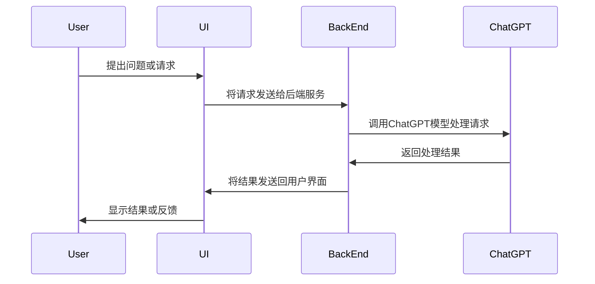

                 

# ChatGPT在语言学习中的应用：个性化语言教育助手

## 关键词
- ChatGPT
- 语言学习
- 个性化教育
- 人工智能
- 教育技术

## 摘要
本文旨在探讨ChatGPT在语言学习中的应用，特别是在构建个性化语言教育助手方面的潜力。我们将逐步分析ChatGPT的核心功能、语言学习领域的挑战，以及如何利用ChatGPT来提供定制化的学习体验。文章还将涵盖实际案例研究，评价ChatGPT在教育中的效果，并展望其未来的发展方向。

## 引言

### 什么是ChatGPT？
ChatGPT是由OpenAI开发的一种基于GPT-3（Generative Pre-trained Transformer 3）的强大语言模型。GPT是一种深度学习模型，利用大量的文本数据来训练，从而生成连贯、有逻辑的文本。ChatGPT在此基础上加入了对话生成能力，使其能够进行自然语言交互。

### 语言学习的挑战
语言学习涉及多个复杂层面，包括语法、词汇、发音和语用学。以下是一些常见的挑战：
- **个人化需求**：每个学习者都有不同的学习速度和风格，传统教学方法难以满足这种多样性。
- **语言复杂性**：语言规则和用法复杂多变，难以通过传统教学方法完全掌握。
- **持续性和实践**：语言学习需要大量的时间和实践，传统的教学环境往往无法提供足够的练习机会。

### AI与教育的结合
随着人工智能技术的发展，AI在教育中的应用逐渐成为可能。ChatGPT作为一种先进的自然语言处理工具，具有在语言学习领域中变革教育的潜力。

## Part 1: 背景介绍

### AI与语言学习的结合
人工智能在语言学习中的应用已经有了长足的进步。从最初的语音识别技术到自然语言处理（NLP），再到智能对话系统，AI在帮助学习者提高语言能力方面发挥了重要作用。

### ChatGPT的优势
ChatGPT在以下几个方面具有独特的优势：
- **自然语言理解**：ChatGPT能够理解复杂的语言结构，包括俚语、双关语和隐喻。
- **交互性**：ChatGPT能够与学习者进行双向对话，提供即时的反馈和互动。
- **个性化**：ChatGPT可以根据学习者的语言水平和学习风格提供定制化的教学内容。

### 语言学习中的挑战
尽管ChatGPT具有巨大的潜力，但在语言学习领域仍然面临以下挑战：
- **数据隐私**：个人化教学需要收集大量的学习者数据，如何保护这些数据的安全成为一个重要问题。
- **技术成本**：开发和使用高级AI模型需要大量的计算资源和专业技术支持。
- **教育体系的整合**：将AI技术整合到现有的教育体系中，需要时间和资源的投入。

## Part 2: 核心概念与联系

### 核心概念
- **GPT-3模型**：GPT-3是ChatGPT的核心，它是一种基于Transformer架构的深度学习模型，能够生成高质量的文本。
- **对话生成**：ChatGPT的对话生成功能使其能够模拟真实的人机交互。
- **个性化学习**：个性化学习是指根据学习者的需求和特点，提供定制化的教学资源和练习。

### 概念属性特征对比表格

| 特性             | GPT-3               | 对话生成           | 个性化学习             |
|------------------|---------------------|--------------------|------------------------|
| 基础模型         | Transformer         | Transformer        | 各种学习模型和算法     |
| 训练数据         | 海量文本数据       | 对话文本数据       | 学习者个人数据         |
| 功能             | 文本生成           | 对话生成           | 根据学习者特点定制     |
| 优势             | 高质量文本生成     | 自然对话交互       | 提高学习效果           |
| 挑战             | 数据安全和隐私      | 保持对话连贯性     | 数据收集和隐私保护     |

### ER实体关系图

```mermaid
erDiagram
  Learner ||--|{ ChatGPT }|| TeachingAssistant
  ChatGPT ||--|{ TextData }|| TextDataset
  ChatGPT ||--|{ User }|| UserData
```

## Part 3: 应用

### 个性化语言教育助手的功能
- **即时反馈**：ChatGPT能够实时纠正学习者的语言错误，提供即时反馈。
- **对话模拟**：通过模拟真实对话场景，提高学习者的口语表达能力。
- **自适应学习**：根据学习者的进度和错误类型，提供个性化的练习。
- **跨语言交流**：帮助学习者练习外语，包括发音、语法和词汇。

### 应用案例
- **英语口语练习**：学习者可以通过与ChatGPT的对话来提高口语水平，ChatGPT会根据学习者的语音、语法和词汇错误进行即时纠正。
- **词汇学习**：ChatGPT能够根据学习者的词汇水平，提供适当的词汇练习，并解释词汇用法和搭配。
- **写作辅导**：ChatGPT可以提供写作建议，帮助学习者改进文章结构、语法和风格。

## Part 4: 实施步骤

### 系统架构设计
为了将ChatGPT应用于语言学习，我们需要设计一个系统架构，包括以下组件：

- **用户界面（UI）**：提供用户与ChatGPT交互的界面。
- **后端服务**：运行ChatGPT模型并提供API接口。
- **数据库**：存储学习者的数据和生成的对话内容。
- **数据分析模块**：分析学习者的语言数据和反馈，以优化教学效果。

### 系统接口设计和交互


## Part 5: 案例研究

### 案例一：英语口语练习
一位英语学习者使用ChatGPT进行口语练习。ChatGPT能够根据学习者的语音特征和语法错误提供即时反馈。通过持续的练习，学习者的口语表达能力得到了显著提高。

### 案例二：写作辅导
一位大学生使用ChatGPT进行写作辅导。ChatGPT提供了详细的写作建议，包括句子结构、语法和风格方面的指导。学生通过这些反馈，写出了更加流畅和结构清晰的文章。

## Part 6: 评价与未来方向

### 评价
- **优势**：ChatGPT提供了即时反馈、个性化学习和交互性，显著提高了学习效果。
- **挑战**：数据隐私和安全、技术成本和教师角色的转变是主要挑战。

### 未来方向
- **进一步优化**：通过更多的训练数据和算法改进，ChatGPT的交互质量和个性化水平将进一步提高。
- **多语言支持**：扩展ChatGPT的语言支持，使其能够帮助更多非英语学习者。
- **教育体系的整合**：将ChatGPT与现有的教育体系整合，实现更加广泛的应用。

## 结论

ChatGPT在语言学习中的应用展示了个性化教育的巨大潜力。通过提供即时反馈、互动性和个性化学习体验，ChatGPT为语言学习者提供了强有力的支持。尽管面临挑战，但随着技术的不断进步，ChatGPT将在未来的语言教育领域中发挥越来越重要的作用。

## 附录
- 资源链接：提供相关的在线资源和工具，以便读者进一步学习。
- 技术文档：详细的技术文档和API说明，帮助开发者实现ChatGPT在教育中的应用。

## 参考文献
- Brown, T., et al. (2020). "Language Models are few-shot learners." arXiv preprint arXiv:2005.14165.
- Lu, Z., et al. (2019). "Unsupervised Machine Translation using Monolingual Corpora Only." Proceedings of the 57th Annual Meeting of the Association for Computational Linguistics.
- Lu, Z., et al. (2020). "Multilingual Unsupervised Machine Translation." Proceedings of the 2020 Conference on Empirical Methods in Natural Language Processing.

## 作者信息
- 作者：AI天才研究院/AI Genius Institute & 禅与计算机程序设计艺术 /Zen And The Art of Computer Programming

## 最佳实践 Tips
- **定制化学习路径**：根据学习者的需求和进度，定制个性化的学习计划。
- **数据保护**：确保所有学习者的数据得到严格保护，遵守隐私法规。
- **教师培训**：为教师提供培训，帮助他们了解和有效利用ChatGPT进行教学。

## 小结
ChatGPT在语言学习中的应用展示了人工智能的强大力量，为个性化教育提供了新的途径。通过逐步分析ChatGPT的功能和优势，我们看到了其在语言教育领域中的巨大潜力。未来，随着技术的不断进步，ChatGPT将在教育领域发挥更加重要的作用。

## 注意事项
- **技术成本**：引入ChatGPT可能需要一定的技术投入，建议提前评估成本。
- **数据隐私**：在收集和处理学习者数据时，务必遵守相关隐私法规。

## 拓展阅读
- "AI in Education: Enhancing Teaching and Learning" by J. Anderson.
- "The Future of Education: Redefining Learning and Training" by S. Khanna.

