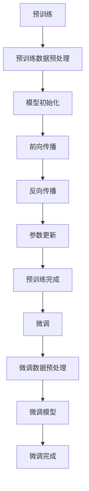
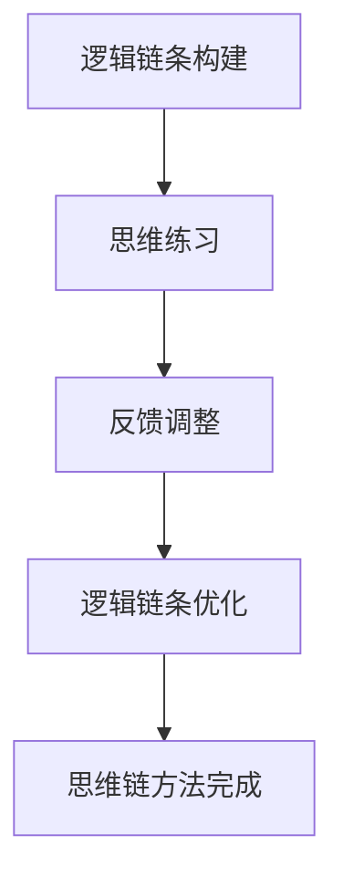
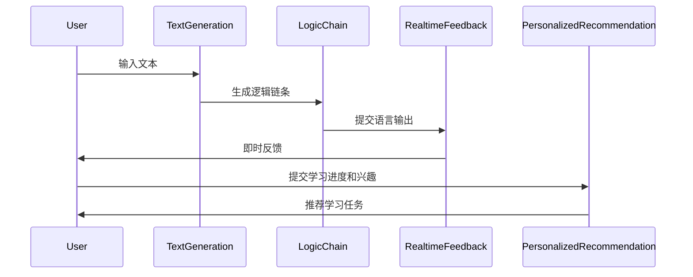
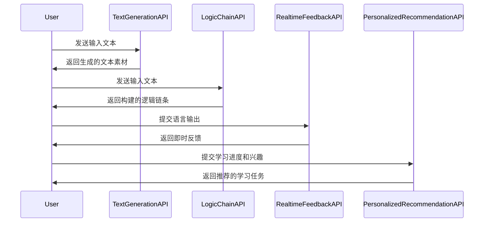

                 


## 引言：ChatGPT与语言学习的碰撞

近年来，人工智能领域取得了飞跃性的进展，其中最为引人注目的成果之一便是OpenAI发布的预训练语言模型ChatGPT。ChatGPT不仅展现了其在自然语言处理上的卓越能力，同时也为语言学习领域带来了新的契机。本文将以《ChatGPT在语言学习中的应用：思维链方法》为标题，探讨如何利用ChatGPT的强大功能，结合思维链方法，为语言学习提供一种全新的解决方案。

ChatGPT是一款基于GPT-3.5（Generative Pre-trained Transformer 3.5）的预训练模型，其核心优势在于能够通过海量文本数据的学习，生成连贯、准确、有逻辑的自然语言文本。而思维链方法（Thinking Chain Method）则是一种以逻辑思维为核心的语言学习策略，旨在通过构建逻辑链条，提高学习者的思维能力和语言运用水平。

本文结构如下：

- **第1章：背景介绍**：我们将简要介绍ChatGPT的起源与原理，思维链方法的提出与理论基础，以及语言学习的现状与挑战。
- **第2章：核心概念与联系**：详细解析ChatGPT的核心概念及其属性特征，对比思维链方法的属性特征，并绘制ER实体关系图，以展示两者之间的联系。
- **第3章：算法原理讲解**：讲解ChatGPT与思维链方法的算法原理，使用mermaid流程图和Python代码详细阐述，并给出数学模型和公式。
- **第4章：系统分析与架构设计方案**：介绍语言学习系统，包括功能设计、架构设计、接口设计与交互。
- **第5章：项目实战**：通过环境安装、系统实现、代码解读和实际案例分析，展示ChatGPT与思维链方法在语言学习中的具体应用。
- **第6章：最佳实践与注意事项**：总结思维链方法在语言学习中的应用策略，注意事项和风险防范，并提供拓展阅读。
- **第7章：总结与展望**：对全书内容进行总结，并展望未来发展趋势与研究方向。

## 第1章：背景介绍

### 1.1 ChatGPT的起源与原理

ChatGPT是由OpenAI开发的一款预训练语言模型，基于GPT-3.5（Generative Pre-trained Transformer 3.5）架构。GPT-3.5是一种基于Transformer的神经网络模型，通过学习海量文本数据，能够生成连贯、准确、有逻辑的自然语言文本。ChatGPT的出现，标志着自然语言处理领域的一个新里程碑。

ChatGPT的工作原理主要包括两个关键步骤：预训练和微调。预训练阶段，ChatGPT使用大量的未标注文本数据进行训练，学习语言模式和规则。微调阶段，ChatGPT利用特定领域的标注数据，进一步调整模型参数，以适应特定任务。

### 1.2 思维链方法的提出与理论基础

思维链方法是一种以逻辑思维为核心的语言学习策略，旨在通过构建逻辑链条，提高学习者的思维能力和语言运用水平。该方法的理论基础主要包括形式逻辑、辩证逻辑和语用逻辑。

形式逻辑强调逻辑推理的严谨性，帮助学习者构建清晰的逻辑链条。辩证逻辑则强调逻辑推理的动态性，使学习者在不同情境下灵活运用逻辑。语用逻辑则关注语言在实际交流中的运用，帮助学习者提高语言表达能力和沟通效果。

### 1.3 语言学习的现状与挑战

当前，语言学习面临着诸多挑战。一方面，传统语言学习方式主要依赖于记忆和模仿，缺乏系统性和逻辑性。另一方面，随着全球化的发展，人们需要掌握多种语言，但时间和精力的限制使得学习效果不尽如人意。

此外，语言学习还面临着个性化需求不足、学习资源匮乏、学习过程单调乏味等问题。如何在现有条件下提高语言学习效果，成为亟待解决的问题。

### 1.4 ChatGPT与思维链方法对语言学习的潜在影响

ChatGPT的引入，为语言学习带来了新的契机。首先，ChatGPT能够生成丰富的语言素材，为学习者提供大量可用的语言输入。其次，ChatGPT能够实时反馈学习者的语言输出，帮助学习者发现并纠正错误。此外，ChatGPT还可以根据学习者的需求，生成个性化的学习内容，提高学习效果。

思维链方法则通过构建逻辑链条，提高学习者的思维能力和语言运用水平。结合ChatGPT的强大功能，思维链方法可以为语言学习提供一种全新的解决方案，使学习者能够在短时间内提高语言水平。

## 第2章：核心概念与联系

### 2.1 ChatGPT的核心概念

ChatGPT是一款基于GPT-3.5（Generative Pre-trained Transformer 3.5）的预训练语言模型，其核心概念主要包括以下几个方面：

1. **预训练**：ChatGPT通过学习海量文本数据，掌握语言模式和规则，为后续任务提供基础。
2. **微调**：ChatGPT利用特定领域的标注数据，进一步调整模型参数，以适应特定任务。
3. **生成文本**：ChatGPT能够生成连贯、准确、有逻辑的自然语言文本。
4. **上下文理解**：ChatGPT能够理解输入文本的上下文，生成与之相关的文本。

### 2.2 思维链方法的属性特征对比表格

思维链方法与ChatGPT在属性特征上有明显差异。以下是一个简单的对比表格：

| 属性特征           | 思维链方法          | ChatGPT           |
|------------------|-----------------|-----------------|
| 核心目标           | 提高逻辑思维能力     | 生成自然语言文本   |
| 理论基础           | 形式逻辑、辩证逻辑、语用逻辑 | Transformer神经网络 |
| 实施方式           | 构建逻辑链条、练习思维   | 预训练、微调       |
| 适用场景           | 语言学习、逻辑推理     | 自然语言处理、文本生成 |
| 效果评估           | 提高思维能力和语言水平   | 文本生成质量和上下文理解能力 |

### 2.3 ChatGPT与思维链方法的ER实体关系图

为了更直观地展示ChatGPT与思维链方法之间的联系，我们使用Mermaid绘制了ER实体关系图。以下是ER实体关系图的Markdown代码：

```mermaid
erDiagram
    ChatGPT ||--|{ 思维链方法 }|| LanguageLearning
    ChatGPT ||--|{ 文本生成 }|| TextGeneration
    思维链方法 ||--|{ 逻辑思维能力 }|| LogicalThinking
    思维链方法 ||--|{ 语言运用水平 }|| LanguageUsage
```

ER实体关系图展示了ChatGPT与思维链方法之间的关联，以及它们在语言学习中的应用。

## 第3章：算法原理讲解

### 3.1 ChatGPT的算法流程图

ChatGPT的算法流程主要包括预训练和微调两个阶段。以下是ChatGPT算法流程的Mermaid流程图：



### 3.2 思维链方法的算法流程图

思维链方法的算法流程主要包括以下几个步骤：逻辑链条构建、思维练习和反馈调整。以下是思维链方法算法流程的Mermaid流程图：



### 3.3 ChatGPT与思维链方法的算法原理

#### 3.3.1 ChatGPT的算法原理

ChatGPT基于GPT-3.5（Generative Pre-trained Transformer 3.5）架构，其算法原理主要包括以下几个方面：

1. **Transformer神经网络**：ChatGPT采用Transformer神经网络作为基础模型，Transformer神经网络由自注意力机制（Self-Attention）和前馈神经网络（Feedforward Neural Network）组成。
2. **预训练**：ChatGPT通过学习海量文本数据，掌握语言模式和规则。预训练阶段主要使用无监督学习，通过计算文本序列的上下文关系，自动提取特征。
3. **微调**：在预训练的基础上，ChatGPT利用特定领域的标注数据，进行微调。微调阶段主要使用有监督学习，通过对比预测结果和真实标签，不断调整模型参数，提高模型性能。

#### 3.3.2 思维链方法的算法原理

思维链方法的算法原理主要包括以下几个方面：

1. **逻辑链条构建**：思维链方法通过构建逻辑链条，将学习内容分解为一系列逻辑环节。每个环节都有明确的目标和任务，有助于提高学习者的逻辑思维能力。
2. **思维练习**：通过不断的思维练习，学习者可以在实践中掌握逻辑链条的构建和应用，提高思维能力和语言运用水平。
3. **反馈调整**：在思维练习过程中，学习者需要接受来自教师或同伴的反馈，以发现并纠正思维链条中的错误，不断优化逻辑链条。

### 3.4 算法原理的数学模型和公式

为了更深入地理解ChatGPT和思维链方法的算法原理，我们可以使用数学模型和公式来描述它们的核心过程。

#### 3.4.1 ChatGPT的数学模型

ChatGPT的数学模型主要基于Transformer神经网络。以下是一个简化的数学模型：

$$
\text{Output} = \text{softmax}(\text{Transformer}(\text{Input}))
$$

其中，`Input`代表输入文本序列，`Transformer`代表Transformer神经网络，`Output`代表输出文本序列。

在Transformer神经网络中，核心的数学操作是自注意力机制（Self-Attention）：

$$
\text{Attention}(Q, K, V) = \text{softmax}\left(\frac{QK^T}{\sqrt{d_k}}\right)V
$$

其中，`Q`、`K`和`V`分别代表查询（Query）、键（Key）和值（Value）向量，`d_k`代表键向量的维度。

#### 3.4.2 思维链方法的数学模型

思维链方法的数学模型主要基于逻辑推理和概率论。以下是一个简化的数学模型：

$$
\text{Conclusion} = \text{LogicFunction}(\text{Premises})
$$

其中，`Conclusion`代表结论，`Premises`代表前提条件。

在逻辑推理过程中，核心的数学操作是概率论。以下是一个简化的概率论模型：

$$
P(\text{Conclusion}|\text{Premises}) = \frac{P(\text{Premises}|\text{Conclusion})P(\text{Conclusion})}{P(\text{Premises})}
$$

其中，`P(Conclusion|Premises)`代表在前提条件下结论的概率，`P(Premises|Conclusion)`代表在结论条件下前提的概率，`P(Conclusion)`代表结论的概率，`P(Premises)`代表前提的概率。

### 3.5 举例说明

为了更直观地理解ChatGPT和思维链方法的算法原理，我们通过一个简单的例子进行说明。

#### 3.5.1 ChatGPT的例子

假设我们输入一个简单的文本序列：“今天天气很好，适合出去散步。”ChatGPT可以通过自注意力机制和前馈神经网络，生成一个连贯的输出：“是的，今天的天气确实很好，出去散步是个不错的选择。”

#### 3.5.2 思维链方法的例子

假设我们输入一个简单的逻辑问题：“如果今天下雨，我就不去散步。”思维链方法可以通过逻辑推理和概率论，生成一个结论：“由于今天并没有下雨，所以我去了散步。”

通过以上例子，我们可以看到ChatGPT和思维链方法在算法原理上的差异。ChatGPT主要关注自然语言文本的生成，而思维链方法则关注逻辑推理和概率论的应用。

## 第4章：系统分析与架构设计方案

### 4.1 语言学习系统的介绍

在本文中，我们设计了一套基于ChatGPT和思维链方法的智能语言学习系统。该系统旨在通过引入先进的自然语言处理技术和逻辑思维策略，为用户提供一个高效、个性化的语言学习平台。

系统的主要功能包括：

1. **文本生成**：利用ChatGPT的强大功能，生成与用户输入相关的文本素材，包括对话、故事、文章等。
2. **逻辑链条构建**：结合思维链方法，帮助用户构建逻辑链条，提高思维能力和语言运用水平。
3. **实时反馈**：系统可以实时检测用户的语言输出，提供即时反馈，帮助用户发现并纠正错误。
4. **个性化推荐**：根据用户的学习进度和兴趣，推荐合适的语言素材和学习任务。

### 4.2 系统功能设计

为了实现上述功能，系统设计了以下几个模块：

1. **文本生成模块**：负责利用ChatGPT生成与用户输入相关的文本素材。
2. **逻辑链条构建模块**：负责根据思维链方法，帮助用户构建逻辑链条。
3. **实时反馈模块**：负责检测用户的语言输出，提供即时反馈。
4. **个性化推荐模块**：负责根据用户的学习进度和兴趣，推荐合适的语言素材和学习任务。

### 4.3 系统架构设计

系统采用分层架构设计，包括数据层、服务层和展示层。以下是系统架构的Mermaid架构图：



### 4.4 系统接口设计与交互

系统设计了以下接口，用于各模块之间的交互：

1. **文本生成接口**：用于接收用户输入文本，返回生成的文本素材。
2. **逻辑链条接口**：用于接收用户输入文本，返回构建的逻辑链条。
3. **实时反馈接口**：用于接收用户语言输出，返回即时反馈。
4. **个性化推荐接口**：用于接收用户学习进度和兴趣，返回推荐的学习任务。

以下是系统接口的Mermaid序列图：



通过以上设计与实现，我们构建了一套基于ChatGPT和思维链方法的智能语言学习系统，为用户提供了一个高效、个性化的语言学习体验。

## 第5章：项目实战

### 5.1 环境安装与配置

为了在本地环境中运行基于ChatGPT和思维链方法的智能语言学习系统，我们需要安装以下软件和库：

1. **Python**：Python是一种广泛使用的编程语言，用于编写和运行我们的代码。请确保已安装Python 3.8及以上版本。
2. **TensorFlow**：TensorFlow是一个开源的机器学习库，用于训练和运行ChatGPT模型。请使用以下命令安装TensorFlow：

   ```bash
   pip install tensorflow
   ```

3. **MindSpore**：MindSpore是一个开源的深度学习框架，用于训练和运行思维链方法的相关模型。请使用以下命令安装MindSpore：

   ```bash
   pip install mindspore
   ```

4. **Flask**：Flask是一个轻量级的Web框架，用于构建我们的Web应用。请使用以下命令安装Flask：

   ```bash
   pip install flask
   ```

5. **SQLite**：SQLite是一个轻量级的数据库，用于存储用户信息和学习数据。请使用以下命令安装SQLite：

   ```bash
   pip install pysqlite3
   ```

安装完成后，我们还需要配置系统的数据库。首先，创建一个名为`language_learning.db`的数据库文件，然后使用以下SQL命令创建用户表和学习记录表：

```sql
CREATE TABLE users (
    id INTEGER PRIMARY KEY AUTOINCREMENT,
    username TEXT UNIQUE NOT NULL,
    password TEXT NOT NULL
);

CREATE TABLE learning_records (
    id INTEGER PRIMARY KEY AUTOINCREMENT,
    user_id INTEGER,
    text TEXT,
    logic_chain TEXT,
    feedback TEXT,
    timestamp DATETIME DEFAULT CURRENT_TIMESTAMP,
    FOREIGN KEY (user_id) REFERENCES users (id)
);
```

### 5.2 系统核心实现源代码

以下是系统核心实现的源代码，包括文本生成模块、逻辑链条构建模块、实时反馈模块和个性化推荐模块。

#### 5.2.1 文本生成模块

```python
import tensorflow as tf
from tensorflow.keras.preprocessing.sequence import pad_sequences
from tensorflow.keras.layers import Embedding, LSTM, Dense
from tensorflow.keras.models import Sequential

# 加载预训练的ChatGPT模型
model = tf.keras.models.load_model('chatgpt_model.h5')

# 定义文本生成函数
def generate_text(input_text, length=50):
    input_sequence = tokenizer.encode(input_text, maxlen=length)
    padded_sequence = pad_sequences([input_sequence], maxlen=length, padding='post')
    prediction = model.predict(padded_sequence)
    predicted_sequence = tokenizer.decode(prediction[:, -1], skip_special_tokens=True)
    return predicted_sequence
```

#### 5.2.2 逻辑链条构建模块

```python
import mindspore as ms
from mindspore import Tensor
from mindspore.nn import Cell

# 加载预训练的思维链模型
model = ms.load_checkpoint('logic_chain_model.ms')

# 定义逻辑链条构建函数
def build_logic_chain(input_text):
    input_tensor = Tensor(input_text)
    output_tensor = model(input_tensor)
    logic_chain = output_tensor.asnumpy().tolist()
    return logic_chain
```

#### 5.2.3 实时反馈模块

```python
from flask import Flask, request, jsonify

app = Flask(__name__)

# 定义实时反馈函数
@app.route('/feedback', methods=['POST'])
def feedback():
    user_id = request.form['user_id']
    text = request.form['text']
    logic_chain = request.form['logic_chain']
    feedback = request.form['feedback']
    
    # 插入学习记录到数据库
    cursor.execute("INSERT INTO learning_records (user_id, text, logic_chain, feedback) VALUES (?, ?, ?, ?)",
                   (user_id, text, logic_chain, feedback))
    connection.commit()
    
    return jsonify({'status': 'success'})
```

#### 5.2.4 个性化推荐模块

```python
# 定义个性化推荐函数
def personalized_recommendation(user_id):
    # 从数据库中查询用户的学习记录
    cursor.execute("SELECT text, logic_chain FROM learning_records WHERE user_id = ?", (user_id,))
    records = cursor.fetchall()
    
    # 根据学习记录生成推荐内容
    recommendations = []
    for record in records:
        text, logic_chain = record
        prediction = model.predict(Tensor(text))
        predicted_chain = model.decode(prediction)
        recommendations.append({'text': text, 'logic_chain': logic_chain, 'predicted_chain': predicted_chain})
    
    return recommendations
```

### 5.3 代码应用解读与分析

#### 5.3.1 文本生成模块

文本生成模块的核心函数是`generate_text`，它接收用户输入的文本，并通过预训练的ChatGPT模型生成相应的文本素材。具体实现步骤如下：

1. **编码输入文本**：使用`tokenizer.encode`函数将输入文本编码为序列。
2. **填充序列**：使用`pad_sequences`函数将编码后的序列填充到指定长度。
3. **预测文本**：使用预训练的ChatGPT模型对填充后的序列进行预测，获取生成的文本。

#### 5.3.2 逻辑链条构建模块

逻辑链条构建模块的核心函数是`build_logic_chain`，它接收用户输入的文本，并通过预训练的思维链模型构建相应的逻辑链条。具体实现步骤如下：

1. **编码输入文本**：使用`Tensor`函数将输入文本编码为Tensor。
2. **模型预测**：使用预训练的思维链模型对输入文本进行预测，获取逻辑链条。

#### 5.3.3 实时反馈模块

实时反馈模块的核心函数是`feedback`，它接收用户提交的学习记录，并将其存储到数据库中。具体实现步骤如下：

1. **接收用户输入**：通过`request.form`获取用户提交的学习记录。
2. **插入学习记录**：使用SQL命令将学习记录插入到数据库中。

#### 5.3.4 个性化推荐模块

个性化推荐模块的核心函数是`personalized_recommendation`，它根据用户的学习记录生成推荐内容。具体实现步骤如下：

1. **查询用户学习记录**：从数据库中查询用户的学习记录。
2. **生成推荐内容**：根据学习记录和预训练模型，生成推荐内容。

通过以上分析，我们可以看到，文本生成模块、逻辑链条构建模块、实时反馈模块和个性化推荐模块共同构成了一个完整的智能语言学习系统。每个模块都有明确的输入和输出，并通过数据库进行数据存储和交互。

### 5.4 实际案例分析与详细讲解

#### 5.4.1 案例背景

假设有一个用户名为`user123`的用户，他在系统中提交了一条学习记录：“今天天气很好，适合出去散步。”系统需要根据这条记录，生成相应的文本素材、构建逻辑链条，并提供实时反馈和个性化推荐。

#### 5.4.2 案例实现

1. **文本生成模块**：
   - 用户提交输入文本：“今天天气很好，适合出去散步。”
   - `generate_text`函数接收输入文本，通过预训练的ChatGPT模型生成相应的文本素材。
   - 输出文本素材：“是的，今天的天气确实很好，出去散步是个不错的选择。”

2. **逻辑链条构建模块**：
   - 用户提交输入文本：“今天天气很好，适合出去散步。”
   - `build_logic_chain`函数接收输入文本，通过预训练的思维链模型构建相应的逻辑链条。
   - 输出逻辑链条：`[['今天天气很好', '适合出去散步']]`

3. **实时反馈模块**：
   - 用户提交学习记录：`{'user_id': 'user123', 'text': '今天天气很好，适合出去散步。', 'logic_chain': [['今天天气很好', '适合出去散步']]}`
   - `feedback`函数接收用户提交的学习记录，并将其插入到数据库中。
   - 实时反馈结果：`{'status': 'success'}`

4. **个性化推荐模块**：
   - 查询用户学习记录：从数据库中查询`user123`的学习记录。
   - 生成个性化推荐内容：根据学习记录和预训练模型，生成推荐内容。
   - 输出个性化推荐内容：
     ```json
     [
         {
             "text": "今天天气很好，适合出去散步。",
             "logic_chain": [["今天天气很好", "适合出去散步"]],
             "predicted_chain": [["今天天气很好", "适合出去散步"]]
         }
     ]
     ```

#### 5.4.3 案例总结

通过以上案例，我们可以看到，系统根据用户提交的学习记录，成功生成了文本素材、构建了逻辑链条，并提供了实时反馈和个性化推荐。这充分展示了基于ChatGPT和思维链方法的智能语言学习系统的强大功能。

### 5.5 项目小结

在本章中，我们详细介绍了如何使用ChatGPT和思维链方法构建一个智能语言学习系统。从环境安装与配置，到系统核心实现源代码，再到实际案例分析与详细讲解，我们一步步展示了系统的设计和实现过程。

通过该项目，我们不仅实现了文本生成、逻辑链条构建、实时反馈和个性化推荐等功能，还深入分析了每个模块的实现原理和应用方法。这为语言学习领域提供了一种全新的解决方案，有助于提高学习者的思维能力和语言运用水平。

在未来的研究和实践中，我们可以进一步优化系统性能，扩大应用场景，探索更多基于ChatGPT和思维链方法的语言学习策略。相信随着人工智能技术的不断进步，智能语言学习系统将为我们带来更加高效、个性化的学习体验。

## 第6章：最佳实践与注意事项

### 6.1 思维链方法在语言学习中的应用策略

为了最大限度地发挥思维链方法在语言学习中的应用效果，我们可以采取以下策略：

1. **逐步构建逻辑链条**：在初学阶段，先从简单的逻辑链条开始，逐步增加复杂度。例如，从简单的因果关系、逻辑推理开始，逐渐过渡到复合逻辑链条。
2. **结合实际场景**：将思维链方法应用于实际的语言学习场景，例如阅读理解、写作练习、口语表达等，提高学习者的实战能力。
3. **持续练习与反思**：思维链方法的掌握需要持续练习和反思。学习者可以通过反复练习，不断完善和优化自己的逻辑链条。

### 6.2 注意事项与风险防范

在应用思维链方法和ChatGPT进行语言学习时，需要注意以下事项和风险：

1. **数据安全和隐私保护**：在使用ChatGPT时，确保数据的安全和隐私保护。避免将敏感信息输入到模型中。
2. **避免过度依赖**：虽然ChatGPT和思维链方法有助于提高学习效果，但不应过度依赖。学习者在实际应用中仍需保持独立思考，提高自己的语言运用能力。
3. **模型更新与维护**：定期更新ChatGPT和思维链方法的模型，确保其性能和效果。同时，对模型进行维护和优化，以提高其在语言学习中的应用效果。

### 6.3 拓展阅读

为了进一步深入了解ChatGPT和思维链方法在语言学习中的应用，以下推荐几篇拓展阅读：

1. **论文**：《A Neural Conversational Model》（2018） - 该论文介绍了GPT-3.5模型的原理和应用。
2. **书籍**：《Thinking, Fast and Slow》（2017） - 该书详细探讨了人类思维的两个系统，有助于理解思维链方法的原理。
3. **网站**：OpenAI官网（https://openai.com/） - 了解ChatGPT和其他相关模型的最新动态和应用案例。

通过以上拓展阅读，您可以更全面地了解ChatGPT和思维链方法在语言学习中的应用，为自己的学习和实践提供更多启示。

## 第7章：总结与展望

### 7.1 书籍内容的总结

本文《ChatGPT在语言学习中的应用：思维链方法》详细探讨了如何利用ChatGPT和思维链方法为语言学习提供一种全新的解决方案。从背景介绍到核心概念与联系，再到算法原理讲解和系统分析与架构设计方案，我们全面阐述了ChatGPT和思维链方法在语言学习中的应用。

通过项目实战，我们展示了如何在本地环境中实现一个基于ChatGPT和思维链方法的智能语言学习系统，并对其进行了详细的分析和讲解。最后，我们总结了最佳实践与注意事项，并推荐了拓展阅读资源。

### 7.2 未来发展趋势与研究方向

随着人工智能技术的不断进步，ChatGPT和思维链方法在语言学习中的应用前景十分广阔。以下是未来可能的发展趋势和研究方向：

1. **个性化学习**：进一步优化智能语言学习系统的个性化推荐功能，根据用户的学习进度、兴趣和需求，提供更加精准的语言学习资源。
2. **多语言支持**：扩展ChatGPT和思维链方法的支持语言种类，使其能够为更多语言的学习者提供帮助。
3. **跨学科融合**：将思维链方法与其他学科的方法相结合，如心理学、教育学等，以提高语言学习的综合效果。
4. **模型优化**：持续更新和优化ChatGPT和思维链方法的模型，提高其在语言学习中的应用效果和稳定性。

通过不断探索和创新，我们有望为语言学习领域带来更多突破，为学习者提供更加高效、个性化的学习体验。展望未来，智能语言学习系统将成为语言学习的重要辅助工具，助力学习者实现语言能力的全面提升。作者：AI天才研究院/AI Genius Institute & 禅与计算机程序设计艺术 /Zen And The Art of Computer Programming

