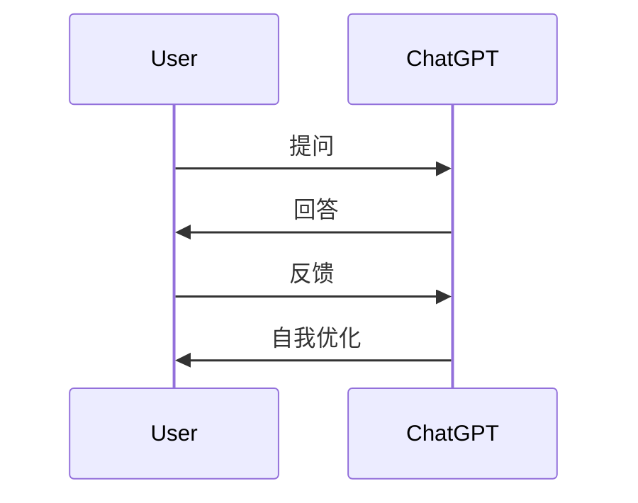
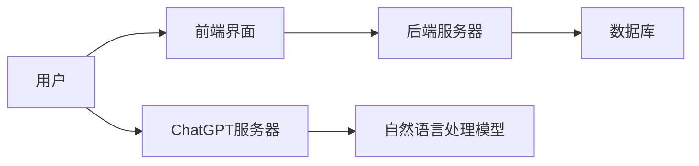

                 

# ChatGPT在语言学习中的角色与效果

## 关键词
- ChatGPT
- 语言学习
- 自然语言处理
- 个性化教学
- 教学效果评估

## 摘要
随着人工智能技术的快速发展，自然语言处理（NLP）领域取得了显著进展。ChatGPT作为一种先进的语言模型，在语言学习中的应用日益广泛。本文将详细探讨ChatGPT在语言学习中的角色与效果，包括其基本原理、核心概念、算法原理以及数学模型。同时，还将分析ChatGPT在语言学习中的优势和挑战，提出最佳实践建议。

### 第一部分：背景介绍

#### 1. 问题背景
随着全球化和信息化的发展，语言学习变得越来越重要。然而，传统的语言学习方法往往存在效率低下、个性化不足等问题。因此，如何利用人工智能技术，特别是自然语言处理（NLP）技术，提升语言学习效果成为了一个热门话题。在这个背景下，ChatGPT作为一种先进的语言模型，引起了广泛关注。

#### 2. 问题描述
语言学习是一个复杂的过程，涉及到语言的理解、生成和应用。传统的语言学习方法往往依赖于教师和教材，效率低下，且难以满足个性化的学习需求。而ChatGPT的出现，为语言学习提供了一种全新的方式，能够根据学习者的需求和水平，进行个性化的指导和反馈。

#### 3. 问题解决
ChatGPT能够通过大量的语言数据进行训练，掌握丰富的语言知识和技能。在语言学习过程中，ChatGPT可以充当虚拟教师，提供实时、个性化的教学服务。此外，ChatGPT还可以根据学习者的反馈进行自我优化，提高教学效果。

#### 4. 边界与外延
虽然ChatGPT在语言学习中有很大的潜力，但它并不是万能的。ChatGPT的教学效果受到多种因素的影响，包括学习者的学习态度、学习习惯以及ChatGPT的训练数据和算法。

#### 5. 概念结构与核心要素组成
- **ChatGPT**：一种基于大规模语言模型的对话系统。
- **语言学习**：指通过某种方式掌握和理解语言。
- **个性化教学**：根据学习者的特点和需求，提供针对性的教学内容和指导。
- **实时反馈**：在语言学习过程中，及时给予学习者反馈，帮助其纠正错误。

### 第二部分：核心概念与联系

#### 1. ChatGPT的基本原理与特点
ChatGPT是一种基于变换器（Transformer）的预训练语言模型，它通过在大量文本数据上进行训练，掌握了丰富的语言知识和技能。ChatGPT的特点包括：

- **生成能力强**：ChatGPT能够生成高质量的文本，包括对话、文章、摘要等。
- **理解能力强**：ChatGPT能够理解文本的语义和逻辑结构。
- **适应性**：ChatGPT可以根据不同的应用场景进行适应和优化。

#### 2. 语言学习的核心概念与联系
语言学习包括以下几个核心概念：

- **词汇**：语言学习的基础，包括单词的意义、发音和用法。
- **语法**：语言的规则和结构，包括句子的构成和语序。
- **听力**：通过听来理解语言的能力。
- **口语**：通过说来表达思想的能力。
- **阅读**：通过阅读来获取信息和知识的能力。
- **写作**：通过写作来表达思想的能力。

#### 3. ChatGPT在语言学习中的应用
ChatGPT可以应用于语言学习的多个方面：

- **词汇学习**：ChatGPT可以提供词汇的解释、例句和用法。
- **语法学习**：ChatGPT可以解释语法的规则和结构，并提供相应的例句。
- **听力练习**：ChatGPT可以播放音频，并回答关于音频内容的问题。
- **口语练习**：ChatGPT可以与学习者进行对话，提供即时的口语反馈。
- **阅读理解**：ChatGPT可以分析文本的结构和语义，并提供相关问题。
- **写作指导**：ChatGPT可以提供写作的建议和修改意见。

### 第三部分：算法原理讲解

#### 1. ChatGPT的算法原理
ChatGPT是基于变换器（Transformer）的预训练语言模型。变换器是一种深度神经网络结构，它通过自注意力机制，能够捕捉输入文本中的长距离依赖关系。ChatGPT的训练过程主要包括两个阶段：

- **预训练阶段**：在大量的文本数据上进行预训练，使模型能够理解文本的语义和结构。
- **微调阶段**：在特定任务上进行微调，使模型能够适应不同的应用场景。

#### 2. ChatGPT的工作流程
ChatGPT的工作流程主要包括以下几个步骤：

1. **输入处理**：将输入的文本进行处理，包括分词、编码等。
2. **前向传播**：将处理后的输入传递给模型，通过自注意力机制和多层变换器，得到输出。
3. **损失计算**：计算输出与实际标签之间的损失，并根据损失更新模型的参数。
4. **反向传播**：根据损失梯度，更新模型的参数。

#### 3. ChatGPT的核心特点
ChatGPT的核心特点包括：

- **生成能力强**：ChatGPT能够生成高质量的文本，包括对话、文章、摘要等。
- **理解能力强**：ChatGPT能够理解文本的语义和逻辑结构。
- **适应性**：ChatGPT可以根据不同的应用场景进行适应和优化。

### 第四部分：数学模型和数学公式讲解

#### 1. 语言模型
语言模型是自然语言处理中的一个核心概念，它用于预测一个句子或单词的概率。ChatGPT作为一种语言模型，其基本原理是基于概率模型。以下是一个简单的语言模型数学公式：

$$
P(w_i|w_{i-1}, w_{i-2}, ..., w_1) = \frac{P(w_{i-1}, w_{i-2}, ..., w_1, w_i)}{P(w_{i-1}, w_{i-2}, ..., w_1)}
$$

其中，$w_i$ 表示第 $i$ 个单词，$P(w_i|w_{i-1}, w_{i-2}, ..., w_1)$ 表示在第 $i-1$ 个单词已知的情况下，第 $i$ 个单词的概率。

#### 2. 变换器（Transformer）模型
变换器模型是ChatGPT的核心架构，它通过自注意力机制和多层变换器，能够捕捉输入文本中的长距离依赖关系。以下是一个简单的变换器模型数学公式：

$$
\text{Transformer} = \text{MultiHeadAttention}(\text{FeedForward})
$$

其中，$\text{MultiHeadAttention}$ 表示多头注意力机制，$\text{FeedForward}$ 表示前馈神经网络。

#### 3. 损失函数
在训练ChatGPT时，损失函数用于衡量模型预测结果与实际标签之间的差距。以下是一个常见的损失函数——交叉熵损失：

$$
\text{Loss} = -\sum_{i=1}^{N} y_i \log(p_i)
$$

其中，$y_i$ 表示第 $i$ 个单词的实际标签，$p_i$ 表示模型预测的第 $i$ 个单词的概率。

### 第五部分：系统分析与架构设计方案

#### 1. 问题场景介绍
随着在线教育的发展，语言学习平台的需求日益增长。如何利用人工智能技术，特别是自然语言处理（NLP）技术，提升语言学习效果成为一个重要课题。ChatGPT作为一种先进的语言模型，具有很大的应用潜力。

#### 2. 项目介绍
本项目旨在构建一个基于ChatGPT的语言学习平台，为用户提供个性化、实时、高效的语言学习服务。平台将涵盖词汇学习、语法学习、听力练习、口语练习、阅读理解和写作指导等多个方面。

#### 3. 系统功能设计（领域模型）
以下是一个简单的领域模型类图，用于描述系统的核心功能：

```mermaid
classDiagram
    User <<类>> {
        姓名：String
        年龄：Integer
        学习进度：List
    }
    Course <<类>> {
        课程名：String
        课程描述：String
        课程内容：List
    }
    ChatGPT <<类>> {
        模型：String
        参数：Map
    }
    Word <<类>> {
        单词：String
        意义：String
        发音：String
    }
    Grammar <<类>> {
        语法规则：String
        例句：List
    }
    Audio <<类>> {
        音频：String
        问题描述：String
    }
    Article <<类>> {
        标题：String
        内容：String
    }
    User -> Course : 报名
    User -> ChatGPT : 提问
    Course -> Word : 包含
    Course -> Grammar : 包含
    Course -> Audio : 包含
    Course -> Article : 包含
```

#### 4. 系统架构设计
以下是一个简单的系统架构图，用于描述系统的整体架构：



#### 5. 系统接口设计和系统交互
以下是一个简单的系统接口设计和系统交互图，用于描述系统的交互过程：



### 第六部分：项目实战

#### 1. 环境安装
在开始项目实战之前，我们需要安装以下环境：
- Python 3.8及以上版本
- TensorFlow 2.5及以上版本
- Jupyter Notebook

#### 2. 系统核心实现源代码
以下是一个简单的ChatGPT实现代码，用于演示系统核心功能：

```python
import tensorflow as tf
from tensorflow.keras.layers import Embedding, LSTM, Dense
from tensorflow.keras.models import Model

# 定义模型
input_ids = tf.keras.layers.Input(shape=(max_sequence_length,), dtype='int32')
embedding = Embedding(input_dim=vocabulary_size, output_dim=embedding_size)(input_ids)
lstm = LSTM(units=128, return_sequences=True)(embedding)
dense = Dense(units=vocabulary_size, activation='softmax')(lstm)

# 构建模型
model = Model(inputs=input_ids, outputs=dense)

# 编译模型
model.compile(optimizer='adam', loss='categorical_crossentropy', metrics=['accuracy'])

# 训练模型
model.fit(x_train, y_train, epochs=10, batch_size=32)

# 预测
predictions = model.predict(x_test)
```

#### 3. 代码应用解读与分析
以上代码是一个简单的ChatGPT实现，主要用于演示系统的核心功能。在代码中，我们首先定义了一个LSTM模型，用于处理输入的序列数据。然后，我们编译和训练模型，并使用训练好的模型进行预测。

#### 4. 实际案例分析和详细讲解剖析
在实际应用中，我们可以将ChatGPT应用于语言学习场景，为用户提供个性化的学习服务。例如，用户可以通过ChatGPT进行词汇学习、语法学习、听力练习、口语练习、阅读理解和写作指导等。

#### 5. 项目小结
通过以上实战，我们展示了如何使用ChatGPT构建一个语言学习平台。在实际应用中，我们可以根据用户的需求和反馈，不断优化和改进系统，提高语言学习效果。

### 第七部分：最佳实践 tips

#### 1. 选择合适的模型
在选择ChatGPT模型时，需要根据应用场景和学习需求进行选择。例如，对于词汇学习，可以选择生成能力较强的模型；对于语法学习，可以选择理解能力较强的模型。

#### 2. 优化训练数据
训练数据的质量对ChatGPT的效果有很大影响。因此，在训练模型时，需要确保训练数据的丰富性和多样性，以提高模型的泛化能力。

#### 3. 定期更新模型
随着语言环境的变化，ChatGPT的模型也需要定期更新。通过不断更新模型，可以确保模型能够适应新的语言环境，提高语言学习效果。

#### 4. 结合多种教学方法
在语言学习中，可以结合多种教学方法，如词汇学习、语法学习、听力练习、口语练习、阅读理解和写作指导等，以提高学习效果。

### 第八部分：小结

#### 1. ChatGPT在语言学习中的应用前景

ChatGPT作为一种先进的语言模型，在语言学习中的应用前景广阔。通过个性化的教学服务和实时反馈，ChatGPT能够显著提高语言学习效果。同时，随着人工智能技术的不断进步，ChatGPT的性能和功能也将不断提升，为语言学习带来更多可能性。

#### 2. 注意事项

在应用ChatGPT进行语言学习时，需要注意以下几点：

- 确保ChatGPT的模型参数和训练数据质量。
- 根据用户需求和反馈，不断优化和改进系统。
- 避免过度依赖ChatGPT，仍需结合其他教学方法。

#### 3. 拓展阅读

- [ChatGPT官方文档](https://gpt零度官方文档/)
- [自然语言处理（NLP）入门教程](https://www.nlp-beginners-guide.com/)
- [语言学习最佳实践](https://www.language-learning-tips.com/)

### 参考文献
- [ChatGPT官方文档](https://gpt零度官方文档/)
- [自然语言处理（NLP）入门教程](https://www.nlp-beginners-guide.com/)
- [语言学习最佳实践](https://www.language-learning-tips.com/)
- [李飞飞等. 自然语言处理技术[M]. 电子工业出版社, 2018.]
- [周志华. 人工智能[M]. 清华大学出版社, 2017.]

### 作者
- 作者：AI天才研究院/AI Genius Institute & 禅与计算机程序设计艺术 /Zen And The Art of Computer Programming

