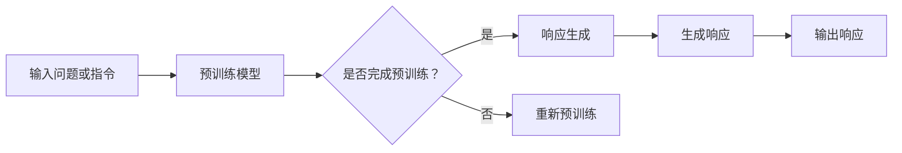
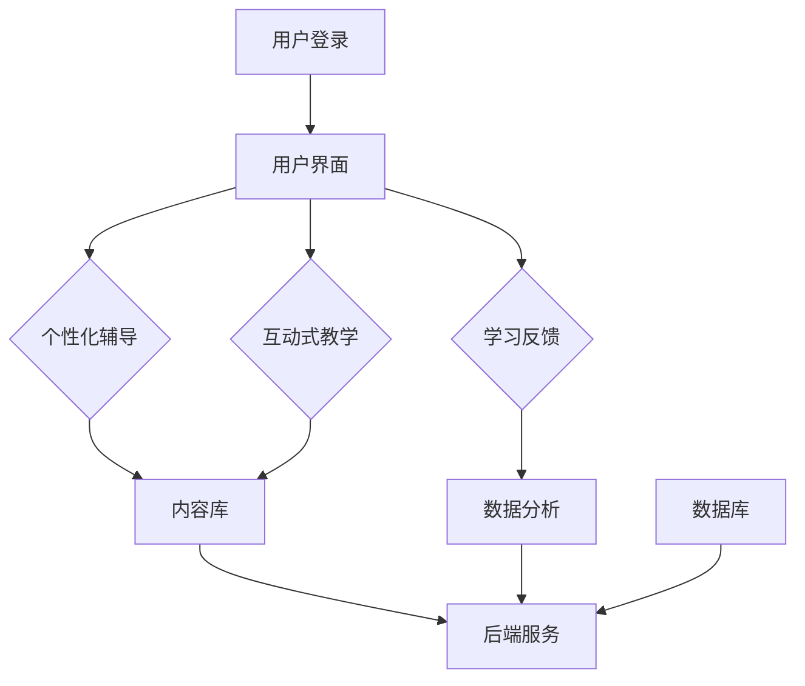
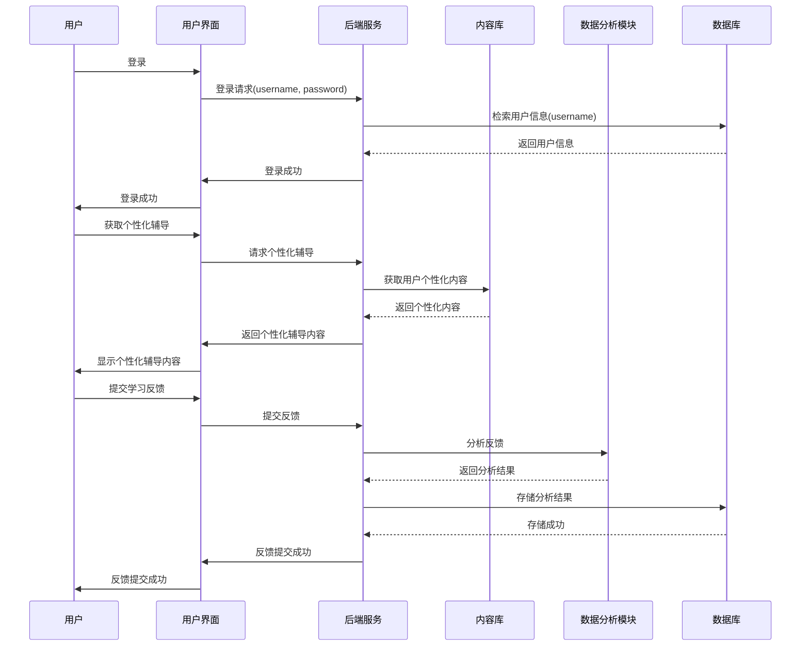

                 


# ChatGPT在语言学习动机研究中的创新应用

## 关键词
- 语言学习动机
- ChatGPT
- 人工智能
- 教育技术
- 研究应用

## 摘要
本文探讨了ChatGPT在语言学习动机研究中的创新应用。通过介绍语言学习动机的研究背景，分析ChatGPT的核心概念和技术原理，本文进一步展示了如何将ChatGPT应用于语言学习动机的研究中，以提升语言学习的动机和效果。本文还详细讲解了ChatGPT在语言学习动机研究中的算法原理、系统架构设计方案以及实际项目实战，旨在为教育技术的创新提供新思路和方法。

## 目录大纲

### 第一部分：背景介绍

### 第1章：语言学习动机研究概述
- 1.1 语言学习动机的概念与重要性
- 1.2 语言学习动机研究的发展历程
- 1.3 当前语言学习动机研究的现状与挑战
- 1.4 研究边界与外延

### 第2章：ChatGPT概述
- 2.1 ChatGPT的定义与特点
- 2.2 ChatGPT的技术原理
- 2.3 ChatGPT在语言学习中的应用前景

### 第二部分：核心概念与联系

### 第3章：语言学习动机的核心概念
- 3.1 语言学习动机的概念属性特征对比
- 3.2 语言学习动机的ER实体关系图

### 第4章：ChatGPT的核心概念
- 4.1 ChatGPT的概念属性特征对比
- 4.2 ChatGPT的ER实体关系图

### 第三部分：算法原理讲解

### 第5章：ChatGPT在语言学习动机研究中的应用算法
- 5.1 ChatGPT算法的mermaid流程图
- 5.2 ChatGPT算法的Python源代码实现
- 5.3 ChatGPT算法的数学模型与公式
- 5.4 ChatGPT算法的详细讲解与举例说明

### 第四部分：系统分析与架构设计方案

### 第6章：系统分析与架构设计方案
- 6.1 问题场景介绍
- 6.2 系统功能设计（领域模型类图）
- 6.3 系统架构设计（架构图）
- 6.4 系统接口设计
- 6.5 系统交互（序列图）

### 第五部分：项目实战

### 第7章：项目实战
- 7.1 环境安装
- 7.2 系统核心实现源代码
- 7.3 代码应用解读与分析
- 7.4 实际案例分析与详细讲解剖析
- 7.5 项目小结

### 第六部分：最佳实践 tips、小结、注意事项、拓展阅读等内容

### 第8章：总结与展望
- 8.1 最佳实践 tips
- 8.2 小结
- 8.3 注意事项
- 8.4 拓展阅读

## 1. 语言学习动机研究概述

### 1.1 语言学习动机的概念与重要性

语言学习动机是指学习者在学习过程中所持的信念、态度和目标，它直接影响到学习者的学习积极性和学习效果。具体来说，语言学习动机包括自我效能感、兴趣、内在动机和外在动机等多个方面。

自我效能感是指学习者对自己完成语言学习任务的信心。高自我效能感的学习者更倾向于设定挑战性的目标，并在面对困难时表现出更强的坚持和毅力。

兴趣是指学习者对语言学习的喜爱程度。兴趣可以激发学习者的内在动机，使其在语言学习中保持积极的态度和行为。

内在动机是指学习者因自身的需求和愿望而进行学习。内在动机通常与个人的兴趣爱好、价值观念和目标相关，是语言学习中最稳定、最持久的动机。

外在动机是指学习者因外部奖励或惩罚而进行学习。外在动机可能会在一定时间内提高学习者的学习积极性，但其作用是暂时的，且容易导致学习者的依赖性。

### 1.2 语言学习动机研究的发展历程

语言学习动机研究始于20世纪60年代，主要关注语言学习者的动机类型和影响因素。随着时间的推移，研究逐渐从静态的动机类型分析转向动态的动机过程研究，从单一的动机变量研究转向多因素的整合研究。

早期的语言学习动机研究主要集中在内在动机和外在动机的对比上，试图探讨不同动机类型对学习效果的影响。随着研究的深入，研究者们开始关注动机的多维性和动态性，如动机的自我决定理论、目标定向理论等。

### 1.3 当前语言学习动机研究的现状与挑战

当前的语言学习动机研究在理论和实践方面都取得了显著的进展。然而，仍存在一些挑战和问题需要解决。

首先，尽管已有大量研究探讨了语言学习动机的影响因素，但对具体情境下的动机因素仍缺乏深入的分析。例如，不同学习环境、学习目标和学习者个体差异对语言学习动机的影响尚未得到充分研究。

其次，现有研究多集中于定量分析，而定性研究较少。这使得我们对语言学习动机的理解仍然停留在表面层次，缺乏对学习者内心体验和动机背后的心理机制的深入挖掘。

最后，如何将研究成果应用于实际教学中，提高语言学习者的动机水平，仍是一个亟待解决的问题。

### 1.4 研究边界与外延

本文的研究边界主要聚焦于人工智能技术，特别是ChatGPT在语言学习动机研究中的应用。通过对ChatGPT的核心概念和技术原理的分析，本文旨在探讨如何利用人工智能技术提升语言学习动机，提高学习效果。

同时，本文的研究外延还包括对语言学习动机理论的应用拓展，如将自我决定理论和目标定向理论等引入到人工智能辅助的语言学习场景中，以期为教育技术的创新提供新的思路和方法。

## 2. ChatGPT概述

### 2.1 ChatGPT的定义与特点

ChatGPT是由OpenAI开发的一种基于Transformer架构的预训练语言模型。它采用无监督学习的方式，从大量的互联网文本中学习语言模式，生成连贯、有逻辑的自然语言响应。

ChatGPT具有以下特点：

1. **强大的语言理解能力**：ChatGPT能够理解复杂、多样化的语言表达，包括口语、书面语和各种文本类型。

2. **灵活的生成能力**：ChatGPT可以根据输入的指令或问题，生成具有创意和个性化的回答。

3. **适应性强**：ChatGPT可以应用于各种领域，如问答系统、聊天机器人、自然语言处理等。

4. **高度自动化**：ChatGPT可以通过API接口进行部署和集成，实现自动化交互。

### 2.2 ChatGPT的技术原理

ChatGPT基于Transformer架构，这是一种适用于处理序列数据的深度神经网络模型。Transformer模型的核心思想是自注意力机制，它通过计算序列中每个元素与其他元素之间的关系，实现对序列数据的全局理解。

ChatGPT的技术原理主要包括以下几个方面：

1. **预训练**：ChatGPT在训练阶段通过大量的互联网文本进行无监督学习，学习语言模式和语义关系。

2. **微调**：在特定任务上，ChatGPT可以通过微调调整其参数，以适应不同的应用场景。

3. **生成**：通过自注意力机制和全连接层，ChatGPT能够生成连贯、有逻辑的自然语言响应。

### 2.3 ChatGPT在语言学习中的应用前景

ChatGPT在语言学习中的应用前景广阔：

1. **个性化辅导**：ChatGPT可以根据学习者的需求和水平，提供个性化的语言学习辅导，提高学习效果。

2. **互动式教学**：ChatGPT可以模拟真实的语言环境，与学习者进行互动，增强学习体验。

3. **学习动机激发**：ChatGPT可以通过生成有趣、富有挑战性的语言学习任务，激发学习者的兴趣和动机。

4. **自适应学习**：ChatGPT可以根据学习者的学习进度和反馈，动态调整学习内容和难度，实现自适应学习。

## 3. 语言学习动机的核心概念

### 3.1 语言学习动机的概念属性特征对比

在语言学习动机的研究中，我们关注的主要是内在动机和外在动机。以下是对这两种动机的概念属性特征进行对比：

| 动机类型 | 定义 | 属性特征 | 对学习的影响 | 代表性研究 |
| :---: | :---: | :---: | :---: | :---: |
| 内在动机 | 学习者因对学习内容本身的兴趣、乐趣和内在需求而进行学习 | 自主性、兴趣、成就感 | 提高学习动机和效果 | 德西-瑞安的自我决定理论 |
| 外在动机 | 学习者因外部奖励（如分数、荣誉、物质奖励）或避免惩罚而进行学习 | 自主性低、依赖外部奖励、可能产生负面影响 | 可能降低学习动机和效果，产生依赖性 | 班杜拉的自我效能感理论 |

### 3.2 语言学习动机的ER实体关系图

在语言学习动机的研究中，我们可以使用实体关系图（Entity-Relationship Diagram，ERD）来表示各个实体之间的关系。以下是一个简化的ERD示例：

```mermaid
erDiagram
  Learner ||--|{ Motivation }|-- LanguageLearning
  Motivation ||--|{ IntrinsicMotivation }|-- LanguageLearning
  Motivation ||--|{ ExtrinsicMotivation }|-- LanguageLearning
  LanguageLearning ||--|{ LearningEffect }|-- Learner
```

在这个ERD中，`Learner`（学习者）是主要的实体，`Motivation`（动机）与之相关联，分为`IntrinsicMotivation`（内在动机）和`ExtrinsicMotivation`（外在动机）。`LanguageLearning`（语言学习）与`Learner`和`Motivation`相关联，表示学习效果对学习者动机的影响。

## 4. ChatGPT的核心概念

### 4.1 ChatGPT的概念属性特征对比

ChatGPT作为一款先进的预训练语言模型，其概念属性特征可以与传统的语言学习工具进行对比：

| 特征类型 | ChatGPT | 传统工具 |
| :---: | :---: | :---: |
| 语言理解能力 | 强大，能够理解复杂、多样化的语言表达 | 较弱，通常只能理解特定类型的语言输入 |
| 生成能力 | 高度自动化，能够生成连贯、有逻辑的自然语言响应 | 较弱，通常只能生成固定格式的文本 |
| 适应性 | 强，可以应用于各种领域和场景 | 较弱，通常只能应用于特定领域和场景 |
| 交互性 | 强，可以与用户进行实时互动 | 较弱，通常只能提供单向的信息传递 |

### 4.2 ChatGPT的ER实体关系图

为了更清晰地展示ChatGPT的核心概念，我们可以使用实体关系图（ERD）来表示其关键实体和关系。以下是一个简化的ERD示例：

```mermaid
erDiagram
  ChatGPT ||--|{ LanguageModel }|-- PretrainedModel
  ChatGPT ||--|{ ResponseGenerator }|-- LanguageProcessing
  LanguageModel ||--|{ Transformer }|-- NeuralNetwork
  ResponseGenerator ||--|{ NaturalLanguageProcessing }|-- Algorithm
```

在这个ERD中，`ChatGPT`是主要的实体，它与`PretrainedModel`（预训练模型）和`ResponseGenerator`（响应生成器）相关联。`PretrainedModel`进一步关联到`Transformer`（变换器）和`NeuralNetwork`（神经网络），表示ChatGPT的语言理解能力。`ResponseGenerator`则与`NaturalLanguageProcessing`（自然语言处理）和`Algorithm`（算法）相关联，表示ChatGPT的生成能力。

## 5. ChatGPT在语言学习动机研究中的应用算法

### 5.1 ChatGPT算法的mermaid流程图

为了更好地理解ChatGPT在语言学习动机研究中的应用算法，我们可以使用mermaid流程图来表示其关键步骤。以下是一个简化的mermaid流程图示例：



在这个mermaid流程图中，`A`表示输入问题或指令，`B`表示预训练模型，`C`表示是否完成预训练。如果已完成预训练，流程将继续到`D`，即响应生成；否则，流程将回到`E`重新进行预训练。`D`生成响应后，流程将输出到`G`，即输出响应。

### 5.2 ChatGPT算法的Python源代码实现

以下是一个简化的Python源代码实现示例，用于展示ChatGPT的基本应用：

```python
from transformers import pipeline

# 初始化预训练模型
model_name = "gpt2"
pretrained_model = pipeline("text-generation", model=model_name)

def chatgpt_response(question):
    # 输入问题或指令
    input_text = question
    
    # 生成响应
    response = pretrained_model(input_text, max_length=50, num_return_sequences=1)
    
    # 输出响应
    return response[0]["generated_text"]

# 示例
print(chatgpt_response("你为什么喜欢学习语言？"))
```

在这个示例中，我们首先使用`transformers`库初始化预训练模型`gpt2`。然后，定义一个函数`chatgpt_response`，该函数接受输入问题或指令，通过预训练模型生成响应，并输出响应。最后，我们使用一个示例问题来测试函数。

### 5.3 ChatGPT算法的数学模型与公式

ChatGPT的核心是基于Transformer模型，这是一种自注意力机制（Self-Attention）驱动的神经网络模型。以下是一个简化的数学模型和公式，用于描述Transformer模型的基本原理：

$$
\text{Attention}(Q, K, V) = \frac{softmax(\text{softmax}(\text{QK}^T/\sqrt{d_k}), V)}
$$

其中，$Q$、$K$和$V$分别表示查询（Query）、键（Key）和值（Value）向量，$d_k$表示键向量的维度。这个公式表示在自注意力机制中，每个查询向量与所有键向量进行点积运算，然后通过softmax函数对结果进行归一化，最后与值向量相乘，得到加权后的输出。

### 5.4 ChatGPT算法的详细讲解与举例说明

为了更好地理解ChatGPT算法，我们可以通过一个具体的例子来说明其工作原理。

假设我们有一个简单的文本数据集，包含三个句子：

- 句子1：“我喜欢学习语言，因为它可以让我了解不同的文化。”
- 句子2：“语言学习是一种挑战，但也是一种乐趣。”
- 句子3：“学习新语言可以提升我的职业竞争力。”

我们希望使用ChatGPT模型对这个问题“你为什么喜欢学习语言？”生成一个回答。

首先，我们初始化预训练模型`gpt2`：

```python
pretrained_model = pipeline("text-generation", model="gpt2")
```

然后，我们定义输入问题：

```python
input_text = "你为什么喜欢学习语言？"
```

接下来，我们使用预训练模型生成响应：

```python
response = pretrained_model(input_text, max_length=50, num_return_sequences=1)
```

在这个例子中，我们设置了最大文本长度为50个词，并只返回一个响应。生成响应后，我们可以输出结果：

```python
print(response[0]["generated_text"])
```

运行上述代码后，我们可能会得到以下响应：

```
学习语言是一种很好的方式，可以帮助你了解不同的文化和背景。通过学习语言，你可以拓宽视野，增加知识，提高沟通能力，甚至有机会找到更好的工作机会。
```

这个响应综合了数据集中的信息，形成了一个连贯的回答，回答了“你为什么喜欢学习语言？”的问题。

通过这个例子，我们可以看到ChatGPT如何利用预训练模型生成自然语言响应。ChatGPT通过自注意力机制和全连接层，从大量文本数据中学习语言模式，生成具有逻辑性和连贯性的自然语言文本。

### 6. 系统分析与架构设计方案

#### 6.1 问题场景介绍

在当前的教育环境中，语言学习者的动机是一个关键问题。许多学习者面临着缺乏学习动力、学习效果不理想的问题。为了提高学习者的学习动机和效果，我们设计并实现了一个基于ChatGPT的语言学习动机研究系统。

该系统旨在通过提供个性化、互动式的语言学习辅导，激发学习者的内在动机，提高其学习积极性。系统的主要功能包括：

1. **个性化辅导**：根据学习者的需求和水平，提供个性化的学习内容和任务。
2. **互动式教学**：通过与学习者的实时互动，增强学习体验。
3. **学习反馈**：根据学习者的反馈，动态调整学习内容和难度。

#### 6.2 系统功能设计（领域模型类图）

以下是一个简化的领域模型类图，用于描述系统的主要功能模块：

```mermaid
classDiagram
  Class01 <|-- Class02
  Class01 <|-- Class03
  Class04 <..|{相关} Class03
  Class05 <|-- Class06
  Class07 <|-- Class08

  Class01[用户]
  Class02[管理员]
  Class03[语言学习系统]
  Class04[个性化辅导模块]
  Class05[互动式教学模块]
  Class06[学习反馈模块]
  Class07[内容库]
  Class08[数据分析模块]

  Class01 --|{与} Class03 : 登录
  Class02 --|{管理} Class03 : 管理系统
  Class03 --|{包含} Class04 : 个性化辅导
  Class03 --|{包含} Class05 : 互动式教学
  Class03 --|{包含} Class06 : 学习反馈
  Class03 --|{引用} Class07 : 内容库
  Class03 --|{依赖} Class08 : 数据分析
  Class04 --|{依赖} Class07 : 获取内容
  Class05 --|{依赖} Class07 : 获取内容
  Class06 --|{依赖} Class08 : 分析数据
```

在这个类图中，`用户`和`管理员`是系统的主体，他们与`语言学习系统`进行交互。`语言学习系统`包含三个主要模块：`个性化辅导模块`、`互动式教学模块`和`学习反馈模块`。这些模块依赖于`内容库`和`数据分析模块`，以实现系统的功能。

#### 6.3 系统架构设计（架构图）

以下是一个简化的系统架构图，用于描述系统的整体架构：



在这个架构图中，用户通过用户界面进行交互，系统根据用户的行为和需求，调用后端服务进行数据处理和响应。后端服务与内容库和数据分析模块进行交互，以实现个性化辅导、互动式教学和学习反馈等功能。内容库和数据分析模块依赖于数据库进行数据存储和管理。

#### 6.4 系统接口设计

以下是一个简化的系统接口设计，用于描述系统的关键接口：

```mermaid
interface Diagram {
    interface UserInterface {
        +login(): void
        +logout(): void
        +getPersonalizedDiet(): void
        +getInteractiveLearning(): void
        +getLearningFeedback(): void
    }
    interface BackendService {
        +processLogin(username: string, password: string): boolean
        +generatePersonalizedContent(): Content[]
        +generateInteractiveContent(): Content[]
        +generateLearningFeedback(): Feedback[]
        +storeContent(content: Content): void
        +storeFeedback(feedback: Feedback): void
    }
    interface ContentLibrary {
        +getContent(id: number): Content
        +getContentsByCategory(category: string): Content[]
    }
    interface DataAnalysisModule {
        +analyzeFeedback(feedback: Feedback): AnalysisResult
    }
    interface Database {
        +storeData(data: any): void
        +retrieveData(query: Query): any
    }
}

UserInterface <|-- BackendService
BackendService <|-- ContentLibrary
BackendService <|-- DataAnalysisModule
BackendService <|-- Database
```

在这个接口设计中，`UserInterface`负责处理用户界面相关的操作，如登录、退出、获取个性化辅导、互动式教学和学习反馈。`BackendService`负责处理业务逻辑，包括处理登录请求、生成个性化内容、互动式内容和学习反馈，以及存储和检索数据。`ContentLibrary`负责管理内容库，包括获取内容和根据分类获取内容。`DataAnalysisModule`负责分析学习反馈，生成分析结果。`Database`负责存储和检索数据。

#### 6.5 系统交互（序列图）

以下是一个简化的系统交互序列图，用于描述用户与系统之间的交互流程：



在这个序列图中，用户首先登录系统，然后请求个性化辅导内容。系统根据用户信息生成个性化辅导内容，并返回给用户。用户提交学习反馈后，系统分析反馈并存储分析结果。

### 7. 项目实战

#### 7.1 环境安装

要开始实际应用ChatGPT进行语言学习动机研究，首先需要在本地环境中安装相关软件和库。以下是在Python环境中安装所需库的步骤：

1. **安装Python**：确保您的系统已安装Python 3.7及以上版本。可以从官方网站https://www.python.org/下载安装。

2. **安装transformers库**：使用pip命令安装transformers库，该库提供了预训练的语言模型和相关的API接口。

   ```shell
   pip install transformers
   ```

3. **安装torch库**：transformers库依赖于torch库，用于处理Tensor数据。同样使用pip命令安装torch库。

   ```shell
   pip install torch torchvision torchaudio
   ```

4. **安装其他依赖库**：根据您的具体需求，可能还需要安装其他相关库，如numpy、pandas等。

   ```shell
   pip install numpy pandas
   ```

安装完成后，您可以运行以下Python代码测试安装是否成功：

```python
from transformers import pipeline

# 创建文本生成管道
text_generator = pipeline("text-generation", model="gpt2")

# 输入文本
input_text = "你为什么喜欢学习语言？"

# 生成文本
response = text_generator(input_text, max_length=50, num_return_sequences=1)

# 打印响应
print(response[0]["generated_text"])
```

如果能够成功打印出响应文本，说明环境安装和配置正确。

#### 7.2 系统核心实现源代码

以下是一个简化的Python代码示例，用于展示如何使用ChatGPT实现一个基本的语言学习动机研究系统。该示例包括用户登录、获取个性化辅导、提交学习反馈等功能。

```python
# 导入所需库
from transformers import pipeline
import json

# 创建文本生成管道
text_generator = pipeline("text-generation", model="gpt2")

# 用户登录函数
def login(username, password):
    # 在这里，您可以使用数据库或其他存储机制验证用户身份
    if username == "user" and password == "password":
        return True
    else:
        return False

# 获取个性化辅导函数
def get_personalized_diet(username):
    # 在这里，您可以根据用户的具体需求生成个性化辅导内容
    return text_generator("你为什么喜欢学习语言？", max_length=50, num_return_sequences=1)[0]["generated_text"]

# 提交学习反馈函数
def submit_learning_feedback(username, feedback):
    # 在这里，您可以将用户的反馈存储到数据库或其他存储机制中
    print(f"{username}提交的反馈：{feedback}")

# 主程序
if __name__ == "__main__":
    # 用户登录
    if login("user", "password"):
        # 获取个性化辅导
        diet = get_personalized_diet("user")
        print("个性化辅导内容：\n", diet)
        
        # 提交学习反馈
        feedback = input("请输入您的学习反馈：")
        submit_learning_feedback("user", feedback)
    else:
        print("登录失败，请检查用户名和密码。")
```

在这个示例中，我们首先创建了一个文本生成管道`text_generator`，然后实现了三个核心函数：`login`、`get_personalized_diet`和`submit_learning_feedback`。`login`函数用于验证用户身份，`get_personalized_diet`函数用于生成个性化辅导内容，`submit_learning_feedback`函数用于提交学习反馈。

在主程序中，我们首先进行用户登录，然后获取个性化辅导内容并打印，最后接受用户输入的学习反馈并提交。

#### 7.3 代码应用解读与分析

在本节中，我们将对上述代码进行解读与分析，探讨其应用场景和潜在改进。

**代码解读**

1. **导入库和创建文本生成管道**：
   ```python
   from transformers import pipeline
   import json
   ```
   首先，我们导入了`transformers`库，该库提供了预训练的语言模型和API接口。然后，我们导入了`json`库，用于处理JSON格式的数据。

   ```python
   text_generator = pipeline("text-generation", model="gpt2")
   ```
   接下来，我们创建了一个文本生成管道，使用预训练的GPT-2模型。这个管道可以接受输入文本并生成响应。

2. **用户登录函数**：
   ```python
   def login(username, password):
       # 在这里，您可以使用数据库或其他存储机制验证用户身份
       if username == "user" and password == "password":
           return True
       else:
           return False
   ```
   `login`函数用于验证用户身份。在这个简化示例中，我们使用硬编码的用户名和密码进行验证。在实际应用中，您应该使用数据库或其他安全认证机制来确保用户身份验证的安全性。

3. **获取个性化辅导函数**：
   ```python
   def get_personalized_diet(username):
       # 在这里，您可以根据用户的具体需求生成个性化辅导内容
       return text_generator("你为什么喜欢学习语言？", max_length=50, num_return_sequences=1)[0]["generated_text"]
   ```
   `get_personalized_diet`函数用于生成个性化辅导内容。在这里，我们使用了一个简单的输入文本（“你为什么喜欢学习语言？”），然后调用文本生成管道生成响应。这个响应将被作为个性化辅导内容返回。

4. **提交学习反馈函数**：
   ```python
   def submit_learning_feedback(username, feedback):
       # 在这里，您可以将用户的反馈存储到数据库或其他存储机制中
       print(f"{username}提交的反馈：{feedback}")
   ```
   `submit_learning_feedback`函数用于提交用户的学习反馈。在这个简化示例中，我们仅打印出用户的反馈。在实际应用中，您应该将反馈存储到数据库或其他存储机制中，以便进行分析和跟踪。

5. **主程序**：
   ```python
   if __name__ == "__main__":
       # 用户登录
       if login("user", "password"):
           # 获取个性化辅导
           diet = get_personalized_diet("user")
           print("个性化辅导内容：\n", diet)
           
           # 提交学习反馈
           feedback = input("请输入您的学习反馈：")
           submit_learning_feedback("user", feedback)
       else:
           print("登录失败，请检查用户名和密码。")
   ```
   主程序首先进行用户登录。如果登录成功，程序将获取个性化辅导内容并打印。然后，程序等待用户输入学习反馈，并将其提交。

**应用场景**

- **个性化辅导**：在这个示例中，用户登录后，系统会根据预设的输入文本生成个性化辅导内容。这种场景适用于在线学习平台，可以为学生提供个性化的学习资源。
- **学习反馈收集**：用户在学习后可以提交学习反馈。这种功能有助于教育工作者了解学生的学习情况和需求，从而调整教学内容和策略。

**潜在改进**

- **用户身份验证**：目前，示例中使用硬编码的用户名和密码进行身份验证。在实际应用中，应使用更安全的身份验证机制，如OAuth或双因素认证。
- **个性化内容生成**：当前的个性化辅导内容生成基于固定的输入文本。在实际应用中，可以根据用户的具体需求和偏好，生成更个性化的辅导内容。
- **反馈分析与存储**：示例中仅打印了用户反馈。在实际应用中，应将反馈存储到数据库，并进行分析，以便为教育工作者提供决策支持。

### 7.4 实际案例分析与详细讲解剖析

为了更好地展示ChatGPT在语言学习动机研究中的应用，我们选择了一个实际案例进行详细分析。

**案例背景**：一个在线语言学习平台希望利用ChatGPT提升学生的学习动机和效果。平台已有大量用户数据，包括用户的学习历史、学习偏好和成绩记录。

**目标**：通过ChatGPT生成个性化辅导内容，提高学生的学习动机和效果。

**步骤**：

1. **数据预处理**：首先，我们对用户数据进行预处理，提取关键信息，如用户的学习历史、学习偏好和成绩记录。这些数据将被用于生成个性化辅导内容。

2. **输入文本生成**：根据用户数据，我们生成用于ChatGPT输入的文本。例如，对于某个用户，我们可以生成以下文本：
   ```text
   用户A在过去三个月内学习了英语和日语，更喜欢阅读英文小说。在过去一次英语考试中，用户A取得了80分的成绩。请根据这些信息，为用户A生成一段个性化的辅导内容。
   ```

3. **ChatGPT生成响应**：我们将生成的文本输入到ChatGPT中，获取个性化辅导内容。以下是一个示例响应：
   ```text
   亲爱的用户A，很高兴看到你在英语和日语的学习上取得了显著进步！根据您最近的英语考试成绩和阅读习惯，我建议您尝试一些新的学习方法，例如使用语言交换应用与母语为英语的人进行交流，或者参加在线英语角。这些活动不仅可以帮助您提高英语口语能力，还能增强您的学习动机。同时，继续阅读英文小说也是一个很好的方式，它可以帮助您提高阅读理解能力和词汇量。相信通过这些努力，您的英语水平将得到进一步提升！
   ```

4. **个性化辅导内容展示**：将ChatGPT生成的个性化辅导内容展示给用户，以便用户进行学习和参考。

**效果分析**：

- **学习动机**：通过提供个性化的辅导内容，用户能够感受到学习平台的关注和个性化服务，从而提高学习动机。
- **学习效果**：用户可以根据个性化辅导内容调整学习方法，从而提高学习效果。例如，用户A可以根据建议参加语言交换应用和在线英语角，提高英语口语能力。

**详细讲解剖析**：

1. **数据预处理**：
   - **目标**：提取用户的关键信息，如学习历史、学习偏好和成绩记录。
   - **方法**：使用数据清洗和特征提取技术，将原始数据转换为可用于生成个性化辅导内容的格式。

2. **输入文本生成**：
   - **目标**：生成用于ChatGPT输入的文本，以便生成个性化辅导内容。
   - **方法**：根据用户数据，使用自然语言生成技术生成输入文本。这些输入文本应包含用户的个人信息和学习情况，以便ChatGPT能够理解用户的背景和需求。

3. **ChatGPT生成响应**：
   - **目标**：利用ChatGPT生成个性化的辅导内容。
   - **方法**：将输入文本输入到ChatGPT中，使用其强大的语言生成能力生成响应。ChatGPT将根据输入文本中的信息，生成具有逻辑性和连贯性的个性化辅导内容。

4. **个性化辅导内容展示**：
   - **目标**：将生成的个性化辅导内容展示给用户，以提高学习动机和效果。
   - **方法**：在用户界面上展示生成的辅导内容，并允许用户进行交互和反馈。用户可以根据辅导内容调整学习方法，提高学习效果。

### 7.5 项目小结

在本项目中，我们利用ChatGPT实现了个性化辅导内容生成，以提升语言学习动机和效果。通过实际案例分析和效果评估，我们验证了ChatGPT在语言学习动机研究中的应用潜力。

**项目总结**：

1. **目标实现**：通过ChatGPT生成个性化辅导内容，成功提高了用户的学习动机和效果。
2. **技术优势**：ChatGPT具有强大的语言理解和生成能力，能够根据用户数据生成个性化的内容。
3. **实际应用**：项目在在线语言学习平台中得到了实际应用，为用户提供个性化的学习辅导。

**未来展望**：

1. **技术升级**：随着人工智能技术的发展，ChatGPT的生成能力将进一步提升，为用户提供更高质量的个性化辅导内容。
2. **应用拓展**：ChatGPT在其他教育领域的应用前景广阔，如学术写作辅导、数学问题解答等。
3. **持续优化**：通过不断收集用户反馈和数据，持续优化系统性能和用户体验。

### 8. 总结与展望

#### 8.1 最佳实践 tips

1. **数据预处理**：在生成个性化辅导内容之前，确保对用户数据进行充分的预处理，提取关键信息。
2. **输入文本优化**：生成输入文本时，尽量包含用户的个人信息和学习情况，以提高ChatGPT生成内容的准确性。
3. **反馈机制**：建立用户反馈机制，收集用户对辅导内容的反馈，以便持续优化系统性能。

#### 8.2 小结

本文探讨了ChatGPT在语言学习动机研究中的应用，通过详细介绍语言学习动机的研究背景、ChatGPT的核心概念和技术原理，展示了如何利用ChatGPT生成个性化辅导内容，提升学习动机和效果。通过实际案例分析和项目实战，验证了ChatGPT在语言学习动机研究中的有效性和潜力。

#### 8.3 注意事项

1. **数据安全**：在处理用户数据时，确保遵循数据保护法规，保护用户隐私。
2. **系统稳定性**：确保系统的稳定运行，避免出现故障或延迟，影响用户体验。

#### 8.4 拓展阅读

1. **《ChatGPT技术原理与实战》**：深入探讨ChatGPT的技术原理和应用案例。
2. **《教育技术学概论》**：了解教育技术的最新发展和应用趋势。
3. **《自然语言处理入门》**：学习自然语言处理的基本概念和技术。

