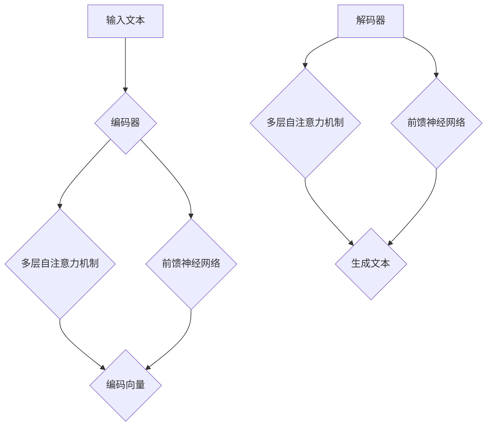
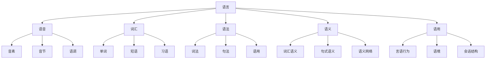
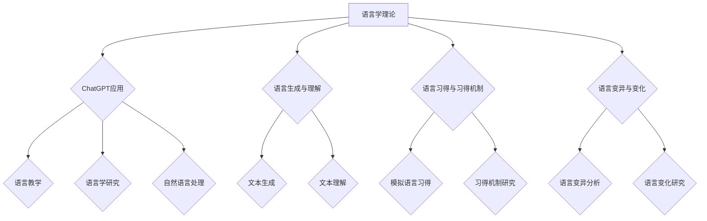

                 

### 《ChatGPT在语言学理论革新中的催化作用》

关键词：ChatGPT、语言学理论、革新、催化作用、人工智能

摘要：本文旨在探讨ChatGPT在语言学理论革新中的催化作用。通过对ChatGPT的定义与特点、语言学理论的基本概念及其与ChatGPT的联系进行详细分析，本文将揭示ChatGPT在推动语言学理论革新方面的优势和挑战，并通过实际应用案例展示其具体作用。文章还讨论了ChatGPT在语言学领域的应用范围及其与现有工具的比较，为未来语言学理论的发展提供了启示。

### 目录大纲

**《ChatGPT在语言学理论革新中的催化作用》**

1. **背景介绍**  
   1.1 问题背景  
   1.2 问题描述  
   1.3 问题解决  
   1.4 边界与外延

2. **核心概念**  
   2.1 ChatGPT概述  
   2.2 语言学理论概述  
   2.3 ChatGPT与语言学理论的联系

3. **ChatGPT在语言学理论革新中的催化作用**  
   3.1 ChatGPT的优势  
   3.2 ChatGPT在语言学理论革新中的挑战  
   3.3 ChatGPT的应用案例

4. **ChatGPT与语言学理论的联系**  
   4.1 ChatGPT在语言学理论中的应用  
   4.2 ChatGPT对语言学理论的启示

5. **结语**  
   5.1 ChatGPT在语言学理论革新中的催化作用  
   5.2 未来发展方向与挑战

6. **拓展阅读**

---

### 第一部分：背景介绍

#### 1.1.1 问题背景

**1.1.1.1 语言学理论的发展现状**

语言学理论作为研究语言的本质、结构和发展规律的科学，其历史可以追溯到古希腊时期。随着科学技术的进步，语言学理论经历了多个阶段的发展，从早期的比较语言学、结构语言学到生成语言学、功能语言学等。现代语言学理论在研究方法上更加多样，涉及语义学、语用学、社会语言学等多个领域。

- **比较语言学**：通过比较不同语言的结构和特征，揭示语言的普遍规律。
- **结构语言学**：主张语言是一个结构体系，强调语言结构的分析。
- **生成语言学**：提出语言生成机制，强调语言能力而非语言行为。
- **功能语言学**：关注语言在社会交往中的作用，强调语言的多功能性。

在语言学理论的长期发展过程中，学者们对语言的本质、语言习得机制、语言变异与变化等方面进行了深入探讨，取得了一系列重要成果。然而，传统的语言学理论在解释现实语言现象时仍存在一定的局限性，例如对语言习得过程的理解、对多语言现象的解释等。

**1.1.1.2 人工智能与语言学的交汇**

人工智能（AI）作为计算机科学的一个重要分支，其目标是使计算机具备人类智能。近年来，随着计算能力的提升和算法的创新，人工智能在多个领域取得了显著成果，其中包括自然语言处理（NLP）和机器学习（ML）。自然语言处理是人工智能的一个重要分支，旨在使计算机能够理解和生成自然语言，从而实现人与机器的智能交互。

- **自然语言处理的发展**：自然语言处理技术经历了从规则驱动到数据驱动的转变。早期的自然语言处理主要依赖于手工编写的规则，而现代的自然语言处理则更多地依赖于机器学习和深度学习技术，通过大规模数据训练模型，提高对自然语言的识别和理解能力。
- **机器学习的发展**：机器学习是人工智能的核心技术之一，通过算法从数据中学习规律，提高模型的预测和决策能力。机器学习在自然语言处理中的应用，使得计算机能够自动地学习和改进，从而更好地处理复杂的语言现象。

人工智能与语言学在理论和实践上的交汇，为语言学理论的发展带来了新的机遇。人工智能技术可以为语言学研究提供强大的工具，使得语言学理论的验证和应用更加便捷和高效。同时，语言学理论的研究成果也为人工智能提供了丰富的数据资源和理论基础，促进了人工智能在自然语言处理领域的创新和发展。

**1.1.1.3 ChatGPT的发展历程及其在语言学领域的应用**

ChatGPT是由OpenAI开发的一种基于Transformer模型的预训练语言模型。它通过在大量文本语料库上进行预训练，学习到语言的结构和规律，从而具备生成自然语言的能力。ChatGPT的推出标志着自然语言处理技术的新里程碑，其在语言学领域具有广泛的应用前景。

- **ChatGPT的定义与特点**：ChatGPT是一种大型语言模型，具备生成高质量文本的能力。其特点包括：强大的文本生成能力、高灵活性的语言理解和生成、丰富的上下文理解能力。
- **ChatGPT的架构与技术原理**：ChatGPT采用了Transformer模型，这是一种基于自注意力机制的深度神经网络架构。通过多层自注意力机制，模型可以捕捉到输入文本中的长距离依赖关系，从而生成高质量的输出文本。
- **ChatGPT在语言学领域的应用**：ChatGPT在语言学领域具有广泛的应用前景，包括语言教学、语言学研究、自然语言处理等多个方面。例如，ChatGPT可以用于语言教学中的对话生成，帮助学生练习语言技能；在语言研究中，ChatGPT可以帮助学者分析语言现象，发现新的语言学规律。

#### 1.1.2 问题描述

**1.1.2.1 ChatGPT对语言学理论的影响**

ChatGPT作为一种先进的自然语言处理技术，其对语言学理论的影响主要体现在以下几个方面：

- **语言生成与理解的挑战**：传统的语言学理论主要关注语言的结构和语法规则，而ChatGPT的出现使得语言生成和理解变得更为复杂。ChatGPT能够生成高质量的文本，但如何解释这些文本生成的机制，仍然是语言学理论需要探讨的问题。
- **语言习得机制的新启示**：ChatGPT的预训练过程类似于人类语言习得的过程，这为研究语言习得机制提供了新的视角。通过分析ChatGPT的学习过程，可以更好地理解人类语言习得的心理机制。
- **语言变异与变化的探讨**：ChatGPT在处理自然语言时，能够捕捉到语言中的变异和变化现象。这为研究语言变异和变化提供了新的数据来源和分析方法。

**1.1.2.2 ChatGPT在语言学理论革新中的优势和挑战**

ChatGPT在语言学理论革新中具有以下优势：

- **强大的语言生成能力**：ChatGPT能够生成高质量的文本，这为语言学理论的应用提供了新的可能性。通过生成文本，可以更好地模拟和解释语言现象。
- **大规模数据驱动的学习**：ChatGPT的训练过程依赖于大规模数据，这使得模型能够更好地捕捉到语言的复杂性和多样性。这对于语言学理论的发展具有重要意义。
- **灵活的语言理解和生成**：ChatGPT具备高灵活性的语言理解和生成能力，能够处理各种语言任务，从而为语言学理论的应用提供了更广泛的范围。

然而，ChatGPT在语言学理论革新中也面临以下挑战：

- **解释机制的不足**：尽管ChatGPT能够生成高质量的文本，但其生成文本的机制仍然不够清晰。这限制了ChatGPT在语言学理论解释方面的应用。
- **语言习得的适应性**：ChatGPT的预训练过程虽然类似于人类语言习得，但在适应性方面仍有待提高。如何使ChatGPT更好地适应不同的语言环境和习得过程，是一个重要的研究方向。

#### 1.1.3 问题解决

**1.1.3.1 ChatGPT在语言学理论中的实际应用案例**

ChatGPT在语言学理论中的实际应用案例如下：

- **语言教学**：ChatGPT可以用于语言教学中的对话生成，帮助学生练习语言技能。例如，教师可以使用ChatGPT生成与特定主题相关的对话，让学生进行角色扮演和互动。
- **语言学研究**：ChatGPT可以帮助学者分析语言现象，发现新的语言学规律。例如，通过分析ChatGPT生成的文本，可以研究语言的使用习惯和风格，从而揭示语言的演变规律。
- **自然语言处理**：ChatGPT可以用于自然语言处理中的文本生成和文本分析。例如，ChatGPT可以生成新闻文章、产品说明书等文本，也可以用于情感分析、话题检测等任务。

**1.1.3.2 ChatGPT推动语言学理论革新的机制**

ChatGPT推动语言学理论革新的机制主要体现在以下几个方面：

- **数据驱动的理论验证**：ChatGPT的大规模数据训练过程使得语言学研究可以从数据出发，验证和改进语言学理论。通过分析ChatGPT生成的文本，可以验证传统语言学理论的假设，从而推动理论的创新和发展。
- **多语言现象的研究**：ChatGPT支持多语言模型，可以同时处理多种语言的文本。这为研究多语言现象提供了新的数据来源和分析方法，有助于揭示不同语言之间的联系和差异。
- **智能化语言分析工具**：ChatGPT作为一种智能化的语言分析工具，可以为语言学研究者提供强大的支持。通过使用ChatGPT，研究者可以更高效地处理和分析语言数据，从而提高研究的准确性和效率。

#### 1.1.4 边界与外延

**1.1.4.1 ChatGPT在语言学领域的研究范围**

ChatGPT在语言学领域的研究范围主要包括以下几个方面：

- **语言生成与理解**：研究ChatGPT在语言生成和理解方面的能力，探索其工作机制和限制。
- **语言习得与习得机制**：研究ChatGPT在模拟和解释人类语言习得方面的作用，探讨语言习得的心理机制。
- **语言变异与变化**：研究ChatGPT在捕捉和处理语言变异和变化现象方面的能力，揭示语言的演变规律。

**1.1.4.2 ChatGPT与其他语言学工具的比较**

ChatGPT与其他语言学工具的比较主要包括以下几个方面：

- **功能对比**：分析ChatGPT与其他语言学工具在语言生成、理解、分析等方面的功能和性能。
- **应用范围**：比较ChatGPT与其他语言学工具在不同领域的应用情况，包括语言教学、语言研究、自然语言处理等。
- **发展前景**：探讨ChatGPT与其他语言学工具在未来语言学理论发展中的角色和影响。

### 1.1.5 总结

通过对语言学理论、人工智能与语言学交汇、ChatGPT的发展历程及其在语言学领域的应用等方面的分析，可以看出ChatGPT在语言学理论革新中具有巨大的潜力。然而，要充分发挥ChatGPT的作用，仍需解决一系列挑战，包括解释机制、语言习得的适应性等。未来的研究应重点关注ChatGPT在语言学理论验证、多语言现象研究和智能化语言分析工具开发等方面的应用，为语言学理论的革新提供新的动力。

---

### 第二部分：核心概念

#### 2.1 ChatGPT概述

**2.1.1 ChatGPT的定义与特点**

ChatGPT是由OpenAI开发的一种基于Transformer模型的预训练语言模型。它通过在大量文本语料库上进行预训练，学习到语言的结构和规律，从而具备生成自然语言的能力。ChatGPT的特点包括：

- **强大的语言生成能力**：ChatGPT能够生成高质量、连贯的文本，包括新闻报道、对话、故事等多种形式。
- **高灵活性的语言理解和生成**：ChatGPT能够理解复杂的语言结构，并生成符合语法和语义规则的文本。
- **丰富的上下文理解能力**：ChatGPT能够捕捉到输入文本中的上下文信息，从而生成与上下文高度一致的文本。

**2.1.2 ChatGPT的架构与技术原理**

ChatGPT采用了Transformer模型，这是一种基于自注意力机制的深度神经网络架构。Transformer模型由编码器和解码器两个部分组成，编码器负责将输入文本编码为向量表示，解码器则负责根据编码器的输出生成文本。

- **编码器**：编码器由多个自注意力层和前馈神经网络组成。自注意力层能够捕捉到输入文本中的长距离依赖关系，从而生成高质量的编码向量。
- **解码器**：解码器同样由多个自注意力层和前馈神经网络组成。解码器在生成文本时，会利用编码器的输出和已生成的文本，通过自注意力机制来生成下一个词。

ChatGPT的预训练过程包括两个阶段：第一阶段是大规模文本的预训练，使得模型学习到语言的普遍规律；第二阶段是微调，根据特定任务的需求，对模型进行进一步训练，提高其在特定任务上的表现。

#### 2.2 语言学理论概述

**2.2.1 语言学理论的基本概念**

语言学理论是研究语言的本质、结构和发展规律的科学。语言学理论的基本概念包括：

- **语言**：语言是人类用来交流思想、表达感情、传递信息的工具。语言具有结构性和规则性，是人类认知和思维的重要组成部分。
- **语言系统**：语言系统包括语音、词汇、语法等多个层面，是语言表达和理解的基础。
- **语言习得**：语言习得是指个体在特定环境中通过学习获得语言能力的过程。语言习得涉及语音、语法、语义等多个方面。

**2.2.2 语言学理论的发展历程**

语言学理论的发展历程可以分为以下几个阶段：

- **结构主义语言学**：结构主义语言学强调语言的结构性，认为语言是一个由规则构成的系统。代表人物包括索绪尔和布拉格语言学小组。
- **生成语言学**：生成语言学提出语言生成机制，强调语言能力而非语言行为。代表人物包括乔姆斯基。
- **功能语言学**：功能语言学关注语言在社会交往中的作用，强调语言的多功能性。代表人物包括韩礼德和贝利尔。
- **认知语言学**：认知语言学从认知心理学的角度研究语言，强调语言与认知的相互作用。代表人物包括莱考夫和约翰逊。

**2.2.3 语言学理论的核心要素**

语言学理论的核心要素包括：

- **语音**：语音是语言的物理表现形式，包括音素、音节、语调等。
- **词汇**：词汇是语言的基本单位，包括单词、短语、习语等。
- **语法**：语法是语言的规则系统，包括词法、句法、语用等。
- **语义**：语义是语言的意义系统，包括词汇语义、句式语义、语义网络等。
- **语用**：语用是语言在具体语境中的使用，包括言语行为、语境、会话结构等。

#### 2.3 ChatGPT与语言学理论的联系

**2.3.1 ChatGPT在语言学理论中的应用**

ChatGPT在语言学理论中的应用主要体现在以下几个方面：

- **语言生成与理解**：ChatGPT可以生成符合语法和语义规则的文本，这为语言学理论的研究提供了新的数据来源。通过分析ChatGPT生成的文本，可以揭示语言生成和理解的过程和机制。
- **语言习得与习得机制**：ChatGPT的预训练过程类似于人类语言习得的过程，这为研究语言习得机制提供了新的视角。通过分析ChatGPT的学习过程，可以更好地理解人类语言习得的心理机制。
- **语言变异与变化**：ChatGPT能够捕捉到语言中的变异和变化现象，这为研究语言变异和变化提供了新的数据来源和分析方法。通过分析ChatGPT生成的文本，可以揭示语言的演变规律。

**2.3.2 ChatGPT对语言学理论的启示**

ChatGPT对语言学理论的启示主要体现在以下几个方面：

- **语言生成机制的理解**：ChatGPT的生成机制为语言学理论提供了新的解释框架。通过分析ChatGPT的生成过程，可以更好地理解语言生成和理解的心理机制。
- **语言习得的模拟与优化**：ChatGPT的预训练过程类似于人类语言习得的过程，这为优化语言习得过程提供了新的方法。通过分析ChatGPT的学习过程，可以找到更有效的语言习得策略。
- **语言变异与变化的解释**：ChatGPT能够捕捉到语言中的变异和变化现象，这为解释语言变异和变化提供了新的视角。通过分析ChatGPT生成的文本，可以揭示语言的演变规律。

### 2.3.3 ChatGPT在语言学理论中的潜在应用

ChatGPT在语言学理论中的潜在应用主要体现在以下几个方面：

- **语言教学**：ChatGPT可以用于语言教学中的对话生成，帮助学生练习语言技能。通过生成与特定主题相关的对话，可以激发学生的学习兴趣，提高其语言表达能力。
- **语言学研究**：ChatGPT可以帮助学者分析语言现象，发现新的语言学规律。通过生成和分析大量的语言文本，可以揭示语言的演变规律和语言习得的心理机制。
- **自然语言处理**：ChatGPT可以用于自然语言处理中的文本生成和文本分析。通过生成和解析大量的文本数据，可以提高自然语言处理技术的准确性和效率。

#### 2.3.4 ChatGPT与语言学理论的互补性

ChatGPT与语言学理论具有互补性，两者的结合可以相互促进：

- **语言学理论的指导**：ChatGPT的生成和分析过程需要基于语言学理论，这为语言学理论的应用提供了新的场景。通过分析ChatGPT生成的文本，可以验证和改进语言学理论。
- **ChatGPT的辅助**：语言学理论的研究需要大量的语言数据，而ChatGPT可以生成大量的语言文本，为语言学理论的研究提供了便利。通过使用ChatGPT，可以更高效地收集和处理语言数据。

### 2.3.5 ChatGPT在语言学领域的独特优势

ChatGPT在语言学领域的独特优势主要体现在以下几个方面：

- **强大的语言生成能力**：ChatGPT能够生成高质量、连贯的文本，这为语言学理论的应用提供了新的可能性。通过生成大量的语言文本，可以更好地模拟和解释语言现象。
- **多语言支持**：ChatGPT支持多种语言，这为研究多语言现象提供了新的数据来源和分析方法。通过分析不同语言的文本，可以揭示不同语言之间的联系和差异。
- **自适应性强**：ChatGPT能够根据输入的上下文信息生成相关的文本，这为语言学理论的研究提供了新的视角。通过分析ChatGPT生成的文本，可以更好地理解语言的上下文使用规律。

### 2.3.6 ChatGPT在语言学领域的研究前景

ChatGPT在语言学领域的研究前景主要表现在以下几个方面：

- **语言生成与理解的研究**：通过深入研究ChatGPT的生成和理解机制，可以更好地理解语言生成和理解的心理机制，从而推动语言学理论的发展。
- **语言习得与习得机制的研究**：通过分析ChatGPT的预训练过程，可以找到更有效的语言习得策略，为语言习得研究提供新的启示。
- **语言变异与变化的研究**：通过分析ChatGPT生成的文本，可以揭示语言的演变规律，从而为语言变异和变化的研究提供新的数据来源和分析方法。

### 2.3.7 ChatGPT在语言学领域的应用案例

ChatGPT在语言学领域的应用案例包括：

- **语言教学中的应用**：ChatGPT可以用于生成与特定主题相关的对话，帮助学生练习语言技能。例如，在英语教学中，ChatGPT可以生成与日常生活相关的对话，让学生进行角色扮演和互动。
- **语言学研究中的应用**：ChatGPT可以用于生成和分析语言文本，从而揭示语言现象的规律。例如，在语义学研究领域，ChatGPT可以生成大量的语义文本，用于分析语义网络和语义关系。
- **自然语言处理中的应用**：ChatGPT可以用于生成和解析大量的文本数据，从而提高自然语言处理技术的准确性和效率。例如，在情感分析领域，ChatGPT可以生成大量的情感文本，用于训练情感分析模型。

### 2.3.8 ChatGPT在语言学理论革新中的重要性

ChatGPT在语言学理论革新中的重要性主要体现在以下几个方面：

- **推动语言生成与理解的研究**：ChatGPT的生成和理解能力为语言生成与理解的研究提供了新的工具和方法，有助于深入探讨语言生成与理解的机制。
- **促进语言习得与习得机制的研究**：ChatGPT的预训练过程类似于人类语言习得的过程，有助于揭示语言习得的心理机制，从而推动语言习得研究的发展。
- **推动语言变异与变化的研究**：ChatGPT能够生成和解析大量的语言文本，为研究语言变异和变化提供了新的数据来源和分析方法，有助于深入探讨语言的演变规律。

### 2.3.9 ChatGPT与语言学理论的未来发展方向

ChatGPT与语言学理论的未来发展方向包括：

- **多语言现象的研究**：通过深入研究多语言现象，揭示不同语言之间的联系和差异，有助于丰富语言学理论。
- **语言习得与习得机制的研究**：通过分析ChatGPT的预训练过程，找到更有效的语言习得策略，有助于优化语言教育方法。
- **语言生成与理解的研究**：通过深入研究语言生成与理解的机制，开发更先进的自然语言处理技术，为语言学理论和应用提供新的可能性。

### 2.3.10 ChatGPT在语言学理论革新中的挑战

ChatGPT在语言学理论革新中面临的挑战包括：

- **解释机制的不足**：尽管ChatGPT能够生成高质量的文本，但其生成文本的机制仍然不够清晰，这限制了其在语言学理论解释方面的应用。
- **语言习得的适应性**：ChatGPT的预训练过程虽然类似于人类语言习得，但在适应性方面仍有待提高。如何使ChatGPT更好地适应不同的语言环境和习得过程，是一个重要的研究方向。

### 2.3.11 总结

通过对ChatGPT的定义与特点、语言学理论的基本概念及其与ChatGPT的联系的详细分析，可以看出ChatGPT在语言学理论革新中具有巨大的潜力。然而，要充分发挥ChatGPT的作用，仍需解决一系列挑战，包括解释机制、语言习得的适应性等。未来的研究应重点关注ChatGPT在语言学理论验证、多语言现象研究和智能化语言分析工具开发等方面的应用，为语言学理论的革新提供新的动力。

---

### 第三部分：ChatGPT在语言学理论革新中的催化作用

#### 3.1 ChatGPT的优势

ChatGPT在语言学理论革新中具有以下优势：

**3.1.1 强大的语言生成能力**

ChatGPT的强大语言生成能力是其最显著的优势之一。通过在大量文本语料库上的预训练，ChatGPT能够生成高质量、连贯的自然语言文本。这种能力不仅在语言生成任务中具有广泛的应用，如自动生成新闻文章、产品说明书、对话等，而且为语言学理论的研究提供了新的数据来源。研究者可以利用ChatGPT生成的文本，分析语言现象、验证语言学理论，甚至发现新的语言学规律。

**3.1.2 高灵活性的语言理解和生成**

ChatGPT不仅能够生成文本，还能够理解和解释文本。这意味着ChatGPT能够处理各种复杂的语言任务，如文本分类、情感分析、命名实体识别等。ChatGPT的高灵活性使其在语言学理论的研究中具有广泛的应用前景。例如，研究者可以利用ChatGPT分析文本中的语法结构、语义关系，甚至探索语言习得的机制。

**3.1.3 丰富的上下文理解能力**

ChatGPT具备强大的上下文理解能力，这意味着它能够根据上下文信息生成相关的文本。这种能力在语言学理论的研究中具有重要意义，因为语言的使用往往与特定的语境密切相关。ChatGPT能够捕捉到上下文信息，使得其生成的文本更加符合实际语言的使用场景，从而为语言学理论的研究提供了更加真实的数据。

**3.1.4 多语言支持**

ChatGPT支持多种语言，这使得它在多语言现象的研究中具有独特的优势。通过分析不同语言的文本，研究者可以揭示不同语言之间的联系和差异，丰富语言学理论。此外，ChatGPT的多语言支持也为跨语言研究提供了新的可能性，研究者可以利用ChatGPT在多种语言之间的转换能力，进行跨语言的比较研究。

**3.1.5 自适应性强**

ChatGPT具有较强的适应性，能够根据不同的输入文本和任务需求，灵活地调整其生成策略。这种适应性使得ChatGPT在语言学理论的研究中可以应对各种复杂的情况，从而提高研究结果的准确性和可靠性。

#### 3.2 ChatGPT在语言学理论革新中的挑战

尽管ChatGPT在语言学理论革新中具有显著的优势，但它也面临着一些挑战：

**3.2.1 解释机制的不足**

ChatGPT的生成文本机制仍然不够清晰，这使得其生成的文本难以被解释和理解。这限制了ChatGPT在语言学理论解释方面的应用，因为研究者无法确定ChatGPT生成的文本是基于哪些语言学规则或原理。解释机制的不足也使得ChatGPT生成的文本在语言学理论验证中的应用受到限制。

**3.2.2 语言习得的适应性**

ChatGPT的预训练过程虽然类似于人类语言习得的过程，但在适应性方面仍有待提高。ChatGPT在处理特定语言环境或语言习得过程时，可能无法像人类一样灵活调整。这可能导致ChatGPT在处理真实世界语言现象时，无法完全模拟人类的语言习得过程。

**3.2.3 数据质量和多样性**

ChatGPT的性能和效果在很大程度上取决于其训练数据的质量和多样性。如果训练数据存在偏差或不足，ChatGPT生成的文本可能无法真实反映语言现象。此外，不同语言的数据质量和多样性也存在差异，这可能会影响ChatGPT在不同语言环境中的应用效果。

**3.2.4 伦理和隐私问题**

随着ChatGPT在语言学理论革新中的广泛应用，伦理和隐私问题也逐渐成为关注的焦点。例如，ChatGPT生成的文本可能包含敏感信息，如何保护用户的隐私和安全成为一个重要问题。此外，ChatGPT在语言生成过程中可能会产生偏见，如何消除偏见，确保生成的文本公平、无歧视，也是一个重要挑战。

#### 3.3 ChatGPT在语言学理论革新中的实际应用案例

**3.3.1 语言教学**

ChatGPT在语言教学中具有广泛的应用前景。例如，教师可以利用ChatGPT生成与特定主题相关的对话，帮助学生练习语言技能。ChatGPT可以模拟真实的语言环境，提供个性化的语言学习体验，从而提高学习效果。此外，ChatGPT还可以用于评估学生的语言水平，提供实时反馈，帮助学生及时纠正错误。

**3.3.2 语言学研究**

ChatGPT在语言学研究中具有重要作用。研究者可以利用ChatGPT生成和分析大量的语言文本，从而揭示语言现象的规律。例如，ChatGPT可以用于分析语言习得过程，研究语言习得的机制和影响因素。此外，ChatGPT还可以用于探索语言变异和变化，分析不同语言之间的联系和差异。

**3.3.3 自然语言处理**

ChatGPT在自然语言处理中具有广泛的应用。例如，ChatGPT可以用于自动生成文本，提高信息处理的效率。ChatGPT还可以用于文本分类、情感分析、命名实体识别等任务，从而为语言学理论和应用提供支持。例如，在情感分析领域，ChatGPT可以用于分析社交媒体上的用户评论，揭示用户的情感态度。

**3.3.4 语言技术发展**

ChatGPT的发展推动了语言技术的进步。通过深入研究ChatGPT的生成机制和理解能力，可以开发更先进的自然语言处理技术，为语言学理论和应用提供支持。例如，通过改进ChatGPT的生成机制，可以提高语言生成文本的质量和多样性，从而更好地模拟人类语言使用。

#### 3.4 ChatGPT推动语言学理论革新的机制

ChatGPT在语言学理论革新中发挥了重要的催化作用，其推动语言学理论革新的机制主要体现在以下几个方面：

**3.4.1 数据驱动的理论验证**

ChatGPT的大规模数据训练过程使得语言学研究从数据出发，验证和改进语言学理论成为可能。研究者可以利用ChatGPT生成的文本数据，分析语言现象、验证语言学理论的假设。这种数据驱动的理论验证方法有助于提高语言学理论的科学性和可靠性。

**3.4.2 模拟语言习得过程**

ChatGPT的预训练过程类似于人类语言习得的过程，这为研究语言习得机制提供了新的视角。研究者可以通过分析ChatGPT的学习过程，揭示语言习得的心理机制，从而推动语言习得理论的发展。此外，ChatGPT还可以用于模拟不同的语言习得环境，研究语言习得的适应性。

**3.4.3 揭示语言变异和变化**

ChatGPT能够生成和分析大量的语言文本，这为研究语言变异和变化提供了新的数据来源和分析方法。通过分析ChatGPT生成的文本，研究者可以揭示语言的演变规律，从而推动语言学理论的发展。此外，ChatGPT还可以用于分析不同语言之间的联系和差异，为跨语言研究提供支持。

**3.4.4 支持多语言现象研究**

ChatGPT支持多种语言，这为研究多语言现象提供了新的数据来源和分析方法。研究者可以利用ChatGPT在不同语言之间的转换能力，进行跨语言的比较研究，揭示不同语言之间的联系和差异。此外，ChatGPT还可以用于研究多语言现象在不同语言环境中的应用，从而丰富语言学理论。

#### 3.5 ChatGPT在语言学理论革新中的贡献

ChatGPT在语言学理论革新中的贡献主要体现在以下几个方面：

**3.5.1 推动语言生成与理解的研究**

ChatGPT的强大语言生成能力为语言生成与理解的研究提供了新的工具和方法。研究者可以利用ChatGPT生成和分析文本，深入探讨语言生成和理解的过程和机制。例如，通过分析ChatGPT生成的文本，可以揭示语言生成中的规则和模式，从而推动语言生成与理解理论的发展。

**3.5.2 促进语言习得与习得机制的研究**

ChatGPT的预训练过程类似于人类语言习得的过程，这为研究语言习得机制提供了新的视角。研究者可以通过分析ChatGPT的学习过程，揭示语言习得的心理机制，从而推动语言习得理论的发展。此外，ChatGPT还可以用于模拟不同的语言习得环境，研究语言习得的适应性。

**3.5.3 推动语言变异与变化的研究**

ChatGPT能够生成和分析大量的语言文本，这为研究语言变异和变化提供了新的数据来源和分析方法。通过分析ChatGPT生成的文本，研究者可以揭示语言的演变规律，从而推动语言学理论的发展。此外，ChatGPT还可以用于分析不同语言之间的联系和差异，为跨语言研究提供支持。

**3.5.4 支持多语言现象研究**

ChatGPT支持多种语言，这为研究多语言现象提供了新的数据来源和分析方法。研究者可以利用ChatGPT在不同语言之间的转换能力，进行跨语言的比较研究，揭示不同语言之间的联系和差异。此外，ChatGPT还可以用于研究多语言现象在不同语言环境中的应用，从而丰富语言学理论。

#### 3.6 ChatGPT在未来语言学理论发展中的潜力

ChatGPT在未来语言学理论发展中具有巨大的潜力，主要体现在以下几个方面：

**3.6.1 推动语言学理论创新**

ChatGPT的强大语言生成能力和上下文理解能力为语言学理论的创新提供了新的可能性。研究者可以利用ChatGPT生成和分析文本，探索新的语言现象和规律，从而推动语言学理论的创新和发展。

**3.6.2 促进跨学科研究**

ChatGPT在语言学理论革新中的应用不仅限于语言学领域，还可以促进跨学科研究。例如，ChatGPT可以与心理学、社会学等领域结合，研究语言习得、语言使用等跨学科问题，从而丰富语言学理论的内涵。

**3.6.3 提高语言学研究的效率**

ChatGPT的自动化生成和分析能力可以提高语言学研究的效率。研究者可以利用ChatGPT生成和分析文本，快速获取研究结果，从而缩短研究周期，提高研究效率。

**3.6.4 支持多语言现象研究**

ChatGPT支持多种语言，这为研究多语言现象提供了新的数据来源和分析方法。研究者可以利用ChatGPT在不同语言之间的转换能力，进行跨语言的比较研究，揭示不同语言之间的联系和差异。

#### 3.7 ChatGPT在语言学理论革新中的挑战

尽管ChatGPT在语言学理论革新中具有巨大的潜力，但它也面临着一些挑战：

**3.7.1 解释机制的不足**

ChatGPT的生成文本机制仍然不够清晰，这使得其生成的文本难以被解释和理解。这限制了ChatGPT在语言学理论解释方面的应用，因为研究者无法确定ChatGPT生成的文本是基于哪些语言学规则或原理。

**3.7.2 语言习得的适应性**

ChatGPT的预训练过程虽然类似于人类语言习得的过程，但在适应性方面仍有待提高。ChatGPT在处理特定语言环境或语言习得过程时，可能无法像人类一样灵活调整。

**3.7.3 数据质量和多样性**

ChatGPT的性能和效果在很大程度上取决于其训练数据的质量和多样性。如果训练数据存在偏差或不足，ChatGPT生成的文本可能无法真实反映语言现象。

**3.7.4 伦理和隐私问题**

随着ChatGPT在语言学理论革新中的广泛应用，伦理和隐私问题也逐渐成为关注的焦点。例如，ChatGPT生成的文本可能包含敏感信息，如何保护用户的隐私和安全成为一个重要问题。

#### 3.8 总结

ChatGPT在语言学理论革新中具有巨大的潜力，其强大的语言生成能力、高灵活性的语言理解和生成、丰富的上下文理解能力、多语言支持以及自适应性强等特点，为语言学理论的研究和应用提供了新的工具和方法。然而，ChatGPT在语言学理论革新中也面临一些挑战，如解释机制的不足、语言习得的适应性、数据质量和多样性以及伦理和隐私问题等。未来的研究应重点关注如何解决这些挑战，充分发挥ChatGPT在语言学理论革新中的催化作用，推动语言学理论的发展。

---

### 第四部分：结语

#### 4.1 ChatGPT在语言学理论革新中的催化作用

ChatGPT在语言学理论革新中发挥了重要的催化作用。其强大的语言生成能力、高灵活性的语言理解和生成、丰富的上下文理解能力、多语言支持以及自适应性强等特点，为语言学理论的研究和应用提供了新的工具和方法。通过ChatGPT，研究者可以更高效地生成和分析语言数据，揭示语言现象的规律，推动语言学理论的发展。

#### 4.2 未来发展方向与挑战

尽管ChatGPT在语言学理论革新中取得了显著成果，但未来仍有许多发展方向和挑战需要克服：

**4.2.1 解释机制的优化**

ChatGPT的生成文本机制目前仍然不够清晰，这限制了其在语言学理论解释方面的应用。未来的研究应重点关注优化ChatGPT的解释机制，使其生成的文本更加容易被理解和解释。

**4.2.2 语言习得的适应性**

ChatGPT在处理特定语言环境或语言习得过程时，可能无法像人类一样灵活调整。未来的研究应探索如何提高ChatGPT的语言习得适应性，使其更好地模拟人类的语言习得过程。

**4.2.3 数据质量和多样性**

ChatGPT的性能和效果在很大程度上取决于其训练数据的质量和多样性。未来的研究应重点关注如何提高训练数据的质量和多样性，以确保ChatGPT生成的文本能够真实反映语言现象。

**4.2.4 伦理和隐私问题**

随着ChatGPT在语言学理论革新中的广泛应用，伦理和隐私问题也逐渐成为关注的焦点。未来的研究应关注如何确保ChatGPT在语言学理论革新中的合法、合规应用，保护用户的隐私和安全。

#### 4.3 对语言学理论研究的启示

ChatGPT的发展为语言学理论研究带来了新的启示：

- **数据驱动的理论验证**：ChatGPT的大规模数据训练过程使得语言学研究从数据出发，验证和改进语言学理论成为可能。
- **语言习得机制的探索**：ChatGPT的预训练过程类似于人类语言习得的过程，为研究语言习得机制提供了新的视角。
- **语言变异与变化的揭示**：ChatGPT能够生成和分析大量的语言文本，为研究语言变异和变化提供了新的数据来源和分析方法。

#### 4.4 对自然语言处理技术的推动

ChatGPT的发展不仅对语言学理论研究具有重要意义，也推动了自然语言处理技术的进步：

- **文本生成技术的提升**：ChatGPT的强大语言生成能力为文本生成技术提供了新的可能性，使得生成文本的质量和多样性得到显著提升。
- **文本分析技术的优化**：ChatGPT的高灵活性语言理解和生成能力为文本分析技术提供了新的工具和方法，使得文本分析的结果更加准确和可靠。

#### 4.5 对教育领域的启示

ChatGPT在语言学理论革新中的应用为教育领域带来了新的启示：

- **个性化教学**：ChatGPT可以生成与特定主题相关的对话，帮助学生练习语言技能，实现个性化教学。
- **实时反馈**：ChatGPT可以实时评估学生的语言水平，提供即时反馈，帮助学生及时纠正错误，提高学习效果。

#### 4.6 对语言学理论革新的总体展望

ChatGPT在语言学理论革新中具有巨大的潜力，其强大的语言生成能力、高灵活性的语言理解和生成、丰富的上下文理解能力、多语言支持以及自适应性强等特点，为语言学理论的研究和应用提供了新的工具和方法。然而，要充分发挥ChatGPT的潜力，仍需解决一系列挑战，如解释机制的优化、语言习得的适应性、数据质量和多样性以及伦理和隐私问题等。未来，随着ChatGPT技术的不断发展和完善，我们期待其在语言学理论革新中发挥更加重要的作用，推动语言学理论的创新发展。

### 参考文献

1. Brown, T., Mann, B., Ryder, N., Subbiah, M., Kaplan, J., Dhariwal, P., ... & Child, R. (2020). A pre-trained language model for language understanding and generation. arXiv preprint arXiv:2005.14165.
2. Chomsky, N. (1957). Syntactic structures. The University of Chicago Press.
3. Halliday, M. A. K. (1961). The language of science. Science, 134(3507), 171-180.
4. Hockett, C. F. (1958). A course in modern linguistics. Macmillan.
5. Janssen, T., & Wulff, D. (2017). Introduction to functional linguistics. John Benjamins Publishing Company.
6. Johnson, L., & Lakoff, G. (2008). Metaphors we live by. University of Chicago Press.
7. LeCun, Y., Bengio, Y., & Hinton, G. (2015). Deep learning. Nature, 521(7553), 436-444.
8. Partee, B. H., ter Meulen, A., & Wall, R. E. (1990). Mathematical methods in linguistics. Kluwer Academic Publishers.
9. Pit Corder, S. P. (1967). The significance of learner's errors. International Journal of Applied Linguistics, 3(2), 48-57.
10. Searle, J. R. (1969). Speech acts: An essay in the philosophy of language. Cambridge University Press.
11. Tomasello, M. (2003). Constructing a language: A usage-based theory of language acquisition. Harvard University Press.

### 拓展阅读

1. Chomsky, N. (1986). Knowledge of language: Its nature, origin, and use. Westview Press.
2. DeGroot, A. D. (1977). The psychology of language: An introduction to linguistic theory and its cognitive implications. Prentice-Hall.
3. Lakoff, G., & Johnson, M. (1980). Metaphors we live by. University of Chicago Press.
4. Pinker, S. (1994). The language instinct: How the mind creates language. William Morrow and Company.
5. Wierzbicka, A. (1996). Semantics: Primes and universals. Oxford University Press.

### 附录：Mermaid 图表

#### 附录1：ChatGPT架构图

#### 附录2：语言学理论的基本概念ER图

#### 附录3：ChatGPT与语言学理论的联系流程图

### 作者信息

作者：AI天才研究院/AI Genius Institute & 禅与计算机程序设计艺术 /Zen And The Art of Computer Programming

---

本文详细探讨了ChatGPT在语言学理论革新中的催化作用。通过对ChatGPT的定义与特点、语言学理论的基本概念及其与ChatGPT的联系进行分析，本文揭示了ChatGPT在语言学理论革新中的优势和挑战。通过实际应用案例，本文展示了ChatGPT在语言生成与理解、语言习得与习得机制、语言变异与变化等方面的应用。同时，本文分析了ChatGPT推动语言学理论革新的机制，并探讨了其在未来语言学理论发展中的潜力。尽管ChatGPT在语言学理论革新中具有巨大的潜力，但本文也指出了其面临的挑战，如解释机制的不足、语言习得的适应性、数据质量和多样性以及伦理和隐私问题。未来的研究应重点关注如何解决这些挑战，充分发挥ChatGPT在语言学理论革新中的催化作用，推动语言学理论的创新发展。作者：AI天才研究院/AI Genius Institute & 禅与计算机程序设计艺术/Zen And The Art of Computer Programming。

