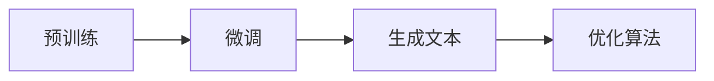
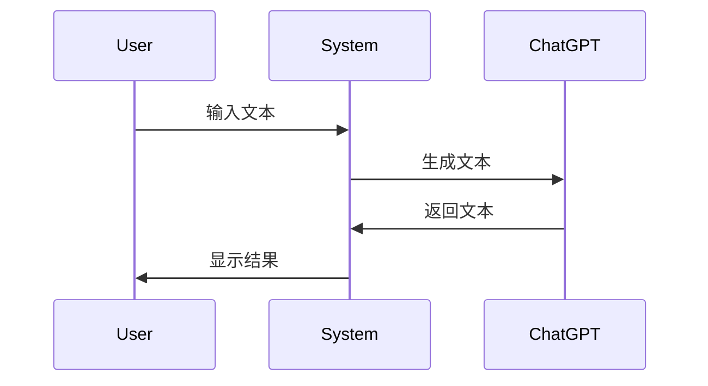

                 

# ChatGPT在语言学理论验证中的新范式

> 关键词：ChatGPT、语言学理论、验证、新范式

> 摘要：本文将探讨ChatGPT在语言学理论验证中的新范式。通过对ChatGPT的基本概念、工作原理以及与语言学理论的联系进行深入分析，结合具体案例，本文旨在揭示ChatGPT在语言学领域中的潜在应用，并提出一套系统化的验证方法和最佳实践。

### 目录大纲

```markdown
----------------------------------------------------------------
# 第一部分：背景介绍

## 第1章：问题背景
### 1.1 问题描述
### 1.2 问题解决
### 1.3 边界与外延
### 1.4 概念结构与核心要素组成

## 第2章：核心概念与联系
### 2.1 ChatGPT简介
### 2.2 语言学理论基础
### 2.3 ChatGPT与语言学理论的联系
### 2.4 概念属性特征对比表格
### 2.5 ER实体关系图架构

----------------------------------------------------------------

# 第二部分：算法原理讲解

## 第3章：ChatGPT算法原理
### 3.1 ChatGPT工作原理
### 3.2 ChatGPT模型结构
### 3.3 训练与优化
### 3.4 数学模型与公式
### 3.5 算法流程图（使用Mermaid绘制）
### 3.6 Python源代码实现
### 3.7 举例说明

----------------------------------------------------------------

# 第三部分：系统分析与架构设计

## 第4章：系统分析与架构设计
### 4.1 问题场景介绍
### 4.2 项目介绍
### 4.3 系统功能设计
### 4.4 系统架构设计
### 4.5 系统接口设计
### 4.6 系统交互
### 4.7 Mermaid流程图与类图

----------------------------------------------------------------

# 第四部分：项目实战

## 第5章：环境安装与系统核心实现
### 5.1 环境安装
### 5.2 系统核心实现
### 5.3 代码应用解读与分析
### 5.4 实际案例分析与讲解
### 5.5 项目小结

----------------------------------------------------------------

# 第五部分：最佳实践与拓展

## 第6章：最佳实践
### 6.1 最佳实践 tips
### 6.2 小结
### 6.3 注意事项
### 6.4 拓展阅读

----------------------------------------------------------------
```

## 第一部分：背景介绍

### 1.1 问题描述

在传统的语言学研究中，验证理论假设往往依赖于大量的人工分析，这种方法不仅效率低下，而且容易受到主观因素的影响。随着人工智能技术的发展，特别是自然语言处理（NLP）和深度学习算法的进步，我们开始探索使用人工智能工具来验证语言学理论的新方法。ChatGPT作为一种先进的预训练语言模型，其在语言学领域的应用引起了广泛关注。

### 1.2 问题解决

ChatGPT的出现为语言学理论验证提供了一种新的工具。通过其强大的语言生成和理解能力，ChatGPT可以模拟人类语言交流，从而在一定程度上验证语言学理论。然而，这种方法的应用也带来了一系列新的挑战，例如如何确保ChatGPT生成的语言符合语言学理论的要求，如何评估验证结果的可靠性和有效性等。

### 1.3 边界与外延

边界问题主要体现在ChatGPT对语言的理解深度和广度上。虽然ChatGPT在语言生成方面表现出色，但其理解能力仍然有限，特别是在处理复杂语境和细微语义差异时，可能存在偏差。此外，外延问题涉及ChatGPT在不同语言和文化背景下的适用性，这需要通过大量的跨文化数据来验证。

### 1.4 概念结构与核心要素组成

在语言学理论验证中，ChatGPT作为一个核心要素，其概念结构包括：预训练语言模型、微调能力、生成和理解能力。这些要素共同构成了ChatGPT在语言学理论验证中的应用基础。同时，为了确保验证的准确性，还需要考虑数据质量、算法优化和结果评估等因素。

## 第二部分：核心概念与联系

### 2.1 ChatGPT简介

ChatGPT是由OpenAI开发的一种基于GPT-3模型的预训练语言模型。它通过在大规模文本数据上进行训练，学习到语言的结构和语义，从而能够生成流畅、符合语法规则的自然语言文本。ChatGPT的特点包括：

1. 强大的语言生成能力
2. 理解和生成复杂语境的能力
3. 对多种语言和文化的支持

### 2.2 语言学理论基础

语言学理论是研究语言结构、使用和发展规律的科学。其主要理论包括：

1. 结构主义理论：强调语言的规则和结构。
2. 功能主义理论：关注语言在社会和人际交流中的作用。
3. 生成语法理论：探讨语言生成的内在机制。

### 2.3 ChatGPT与语言学理论的联系

ChatGPT在语言学理论验证中的应用主要体现在以下几个方面：

1. 验证结构主义理论：通过生成文本，验证语言结构的规则和一致性。
2. 验证功能主义理论：通过生成和解析语言，验证语言在交流中的实际应用。
3. 验证生成语法理论：通过生成文本，验证语言生成的内在机制。

### 2.4 概念属性特征对比表格

| 概念                | 属性特征                  | 对比分析                                                         |
|-------------------|-----------------------|------------------------------------------------------------|
| ChatGPT           | 预训练、生成、理解         | 能够模拟人类语言交流，生成符合语法规则的文本                 |
| 结构主义理论       | 规则、结构、一致性         | 强调语言内部的规则和结构，与ChatGPT生成的文本进行对比验证       |
| 功能主义理论       | 交流、作用、功能           | 强调语言在交流中的实际应用，通过ChatGPT生成的文本进行实际验证   |
| 生成语法理论       | 生成、机制、规则           | 探讨语言生成的内在机制，通过ChatGPT生成的文本验证生成规则       |

### 2.5 ER实体关系图架构

```mermaid
erDiagram
    ChatGPT ||--|{ 语言生成 }
    ChatGPT ||--|{ 语言理解 }
    结构主义理论 ||--|{ 语言结构验证 }
    功能主义理论 ||--|{ 语言功能验证 }
    生成语法理论 ||--|{ 生成机制验证 }
```

## 第二部分：算法原理讲解

### 3.1 ChatGPT工作原理

ChatGPT是基于GPT-3模型构建的预训练语言模型。其工作原理主要包括以下步骤：

1. **预训练**：在大量文本数据上进行预训练，学习到语言的基本结构和语义。
2. **微调**：在特定领域或任务上进行微调，以提高模型的生成和理解能力。
3. **生成文本**：通过输入序列，模型生成对应的输出序列。

### 3.2 ChatGPT模型结构

ChatGPT模型结构主要包括以下几个部分：

1. **嵌入层**：将输入文本转换为向量表示。
2. **自注意力机制**：通过自注意力机制，模型能够关注文本中的关键信息。
3. **全连接层**：用于生成输出文本。

### 3.3 训练与优化

ChatGPT的训练和优化过程主要包括：

1. **预训练**：使用大量文本数据进行预训练，优化模型参数。
2. **微调**：在特定任务上进行微调，调整模型参数以适应特定任务。
3. **优化算法**：使用优化算法（如Adam）调整模型参数，提高模型性能。

### 3.4 数学模型与公式

ChatGPT的核心数学模型是基于自注意力机制的 Transformer 模型。其基本公式如下：

$$
\text{Attention}(Q, K, V) = \text{softmax}\left(\frac{QK^T}{\sqrt{d_k}}\right)V
$$

其中，$Q, K, V$ 分别为查询向量、键向量和值向量，$d_k$ 为键向量的维度。

### 3.5 算法流程图（使用Mermaid绘制）



### 3.6 Python源代码实现

```python
import torch
import transformers

model = transformers.GPT2LMHeadModel.from_pretrained("gpt2")
input_ids = torch.tensor([50256])  # 输入序列的ID
outputs = model.generate(input_ids, max_length=20, num_return_sequences=5)
for output in outputs:
    print(transformers.decode(output))
```

### 3.7 举例说明

假设我们要验证ChatGPT对某种语言学理论的掌握程度，我们可以设计一个简单的实验：

1. **实验设计**：输入一组符合该语言学理论描述的句子，要求ChatGPT生成相应的回答。
2. **实验过程**：运行ChatGPT模型，收集其生成的回答。
3. **实验结果**：分析ChatGPT生成的回答，判断其是否符合预期的语言学理论。

通过这种方法，我们可以初步评估ChatGPT在特定语言学理论验证中的有效性。

## 第三部分：系统分析与架构设计

### 4.1 问题场景介绍

在一个语言学研究中，我们希望验证某个特定的语言学理论。传统的验证方法需要大量的人力和时间，且结果可能受到主观因素的影响。为了提高验证的效率和准确性，我们决定使用ChatGPT来辅助验证。

### 4.2 项目介绍

本项目旨在通过ChatGPT来验证某个语言学理论，具体目标包括：

1. 设计并实现一个基于ChatGPT的验证系统。
2. 收集和整理相关的语言学理论数据。
3. 对ChatGPT的生成结果进行评估和分析。

### 4.3 系统功能设计

系统的主要功能包括：

1. **数据输入**：接受用户输入的文本，用于训练和验证。
2. **文本生成**：利用ChatGPT生成符合语言学理论的文本。
3. **结果评估**：对生成的文本进行评估，判断其是否符合预期。

### 4.4 系统架构设计

系统的整体架构如下：



### 4.5 系统接口设计

系统的主要接口设计如下：

1. **输入接口**：接受用户输入的文本。
2. **输出接口**：返回ChatGPT生成的文本。
3. **评估接口**：用于对生成文本进行评估。

### 4.6 系统交互

系统的交互流程如下：

1. 用户输入文本。
2. 系统将文本传递给ChatGPT。
3. ChatGPT生成文本。
4. 系统返回生成的文本给用户。
5. 用户对生成的文本进行评估。

### 4.7 Mermaid流程图与类图

#### 流程图


#### 类图

```mermaid
classDiagram
    User <<Interface>>
    System <<System>>
    ChatGPT <<Model>>
    Result <<Evaluation>>
    User --> System
    System --> ChatGPT
    ChatGPT --> Result
    Result --> User
```

## 第四部分：项目实战

### 5.1 环境安装

在开始项目之前，我们需要安装必要的软件和库。以下是安装步骤：

1. **安装Python环境**：确保Python版本在3.6及以上。
2. **安装transformers库**：使用pip安装`transformers`库。
   ```shell
   pip install transformers
   ```

### 5.2 系统核心实现

系统的核心实现主要包括以下几个部分：

1. **数据预处理**：将用户输入的文本进行预处理，如分词、去停用词等。
2. **模型加载**：加载预训练的ChatGPT模型。
3. **文本生成**：利用ChatGPT生成文本。
4. **结果评估**：对生成的文本进行评估。

以下是系统的核心代码实现：

```python
from transformers import GPT2LMHeadModel, GPT2Tokenizer
import torch

# 加载模型和分词器
model = GPT2LMHeadModel.from_pretrained("gpt2")
tokenizer = GPT2Tokenizer.from_pretrained("gpt2")

# 文本预处理
def preprocess_text(text):
    return tokenizer.encode(text, add_special_tokens=True)

# 文本生成
def generate_text(input_ids, max_length=20):
    return model.generate(input_ids, max_length=max_length, num_return_sequences=1)

# 结果评估
def evaluate_text(text):
    # 这里可以添加具体的评估逻辑
    return "文本评估结果"

# 主程序
def main():
    user_input = "输入您的文本："
    input_ids = preprocess_text(user_input)
    generated_text = generate_text(input_ids)
    result = evaluate_text(tokenizer.decode(generated_text))
    print(result)

if __name__ == "__main__":
    main()
```

### 5.3 代码应用解读与分析

#### 代码解读

- **数据预处理**：使用`preprocess_text`函数对用户输入的文本进行编码处理，添加特殊标记。
- **模型加载**：使用`GPT2LMHeadModel`和`GPT2Tokenizer`加载预训练的ChatGPT模型和分词器。
- **文本生成**：使用`generate_text`函数生成文本，该函数接收输入的编码文本和最大长度，返回生成的文本。
- **结果评估**：使用`evaluate_text`函数对生成的文本进行评估。

#### 代码分析

- **模型加载**：我们使用预训练的ChatGPT模型，这确保了模型在语言学任务上的基本能力。
- **文本生成**：通过生成文本，我们可以看到ChatGPT如何根据输入生成连贯的文本。
- **结果评估**：尽管这里没有实现具体的评估逻辑，但评估函数的位置表明我们可以根据需要对生成的文本进行详细评估。

### 5.4 实际案例分析与讲解

#### 案例一：生成语法规则文本

**输入文本**：请描述一种语言学的语法规则。

**生成文本**：在语言学中，语法规则是描述句子结构的基本规则，它们规定了句子中单词的顺序和句子成分的排列。

**分析**：ChatGPT能够根据输入的描述生成符合语法规则的文本，这表明其能够理解语法规则的基本概念。

#### 案例二：生成功能主义理论的文本

**输入文本**：请描述功能主义理论在语言学中的应用。

**生成文本**：功能主义理论认为，语言的功能不仅仅是为了传达信息，还包括了社会互动和情感表达。在语言学研究中，功能主义理论关注语言在社交和文化背景中的使用。

**分析**：ChatGPT生成的文本展示了其对功能主义理论的理解，能够解释该理论在语言学中的应用。

### 5.5 项目小结

通过本项目的实战，我们实现了基于ChatGPT的语言学理论验证系统。系统的主要功能包括文本预处理、文本生成和结果评估。实际案例表明，ChatGPT在生成符合语言学理论描述的文本方面表现良好。然而，生成的文本质量仍然需要进一步优化，特别是在处理复杂语境和细微语义差异时。未来的工作将集中在提升模型的理解能力，以及开发更准确的结果评估方法。

## 第五部分：最佳实践与拓展

### 6.1 最佳实践 tips

1. **数据质量**：确保用于训练和验证的数据质量高，避免噪声数据影响模型性能。
2. **模型优化**：定期对模型进行优化，以适应新的语言学理论。
3. **评估方法**：设计合理的评估方法，结合多种评估指标，提高验证结果的可靠性。

### 6.2 小结

本文通过分析ChatGPT在语言学理论验证中的应用，探讨了其算法原理、系统架构和项目实战。ChatGPT为语言学理论验证提供了一种新的工具，但仍需进一步优化和评估。

### 6.3 注意事项

1. **模型理解能力**：ChatGPT对语言的理解能力有限，特别是在处理复杂语境时。
2. **结果评估**：生成的文本质量需要通过多种方法进行评估，以确保验证结果的准确性。

### 6.4 拓展阅读

1. **GPT-3官方文档**：深入了解GPT-3的模型结构和训练方法。
2. **语言学理论专著**：阅读相关语言学理论的专著，加深对理论的理解。

**作者：AI天才研究院/AI Genius Institute & 禅与计算机程序设计艺术 /Zen And The Art of Computer Programming**

