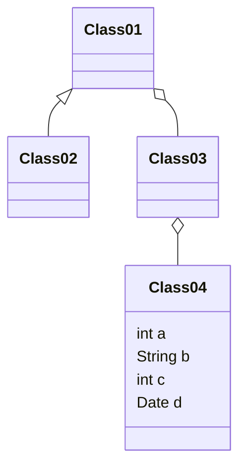
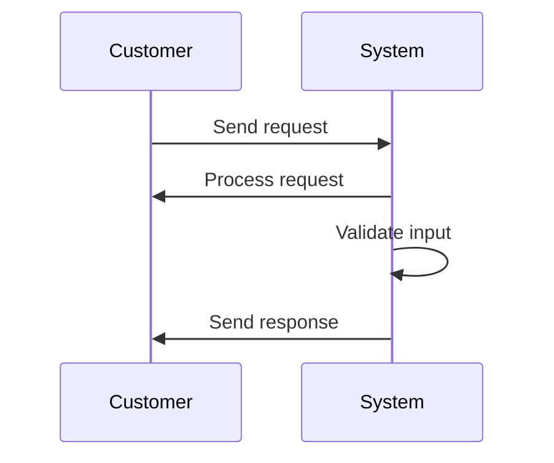
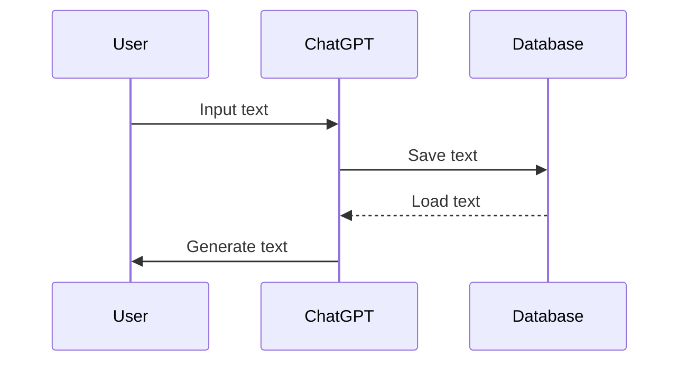

                 


## 《ChatGPT在语言演化模拟中的应用：探索语言变迁规律》

关键词：ChatGPT、语言演化、模拟、算法、系统架构、项目实战、最佳实践

摘要：本文深入探讨了ChatGPT在语言演化模拟中的应用，通过逻辑清晰的分析和推理，揭示语言变迁的规律。文章分为五个部分，首先介绍ChatGPT的基本概念和原理，然后探讨语言演化的基本理论和关键因素，接着详细阐述ChatGPT在语言演化模拟中的算法原理和系统架构，通过项目实战分析其实际应用，最后总结最佳实践和注意事项。

## 第一部分：背景与概念

### 第1章 引言

#### 1.1 问题背景

语言作为人类交流和思维的基础工具，其演化和变迁一直是语言学和认知科学领域的重要研究课题。然而，传统的语言学研究往往依赖于大量的历史文献和语言样本，难以系统地模拟和预测语言的变化过程。随着人工智能技术的发展，尤其是生成式预训练模型（GPT）的兴起，为语言演化模拟提供了新的可能。

#### 1.2 问题描述

如何利用ChatGPT等生成式预训练模型模拟语言演化过程，揭示语言变迁的内在规律，是本文要解决的问题。

#### 1.3 问题解决

本文通过以下步骤解决问题：

1. **ChatGPT概述**：介绍ChatGPT的基本概念和核心原理。
2. **语言演化基本理论**：探讨语言演化的定义、历史和关键因素。
3. **ChatGPT在语言演化模拟中的应用**：分析ChatGPT模拟语言演化的原理和方法。
4. **算法原理**：详细阐述语言演化模拟算法的原理和数学模型。
5. **系统架构**：设计并分析语言演化模拟系统的架构。
6. **项目实战**：通过实际项目展示ChatGPT在语言演化模拟中的应用。
7. **最佳实践与总结**：总结最佳实践和注意事项。

#### 1.4 边界与外延

本文主要关注基于ChatGPT的语言演化模拟，但不涉及其他生成式模型的比较研究。此外，本文对语言演化模拟的深度和广度进行了适当的限制，以保持内容的可操作性和实用性。

#### 1.5 概念结构与核心要素组成

本文的核心概念包括ChatGPT、语言演化、模拟、算法、系统架构和项目实战。这些概念相互关联，共同构成了本文的理论框架。

### 第2章 ChatGPT基础

#### 2.1 ChatGPT概述

ChatGPT是由OpenAI开发的一种基于Transformer的生成式预训练模型。它通过大量文本数据进行预训练，学会了生成自然语言文本。

#### 2.2 ChatGPT的核心原理

ChatGPT的核心原理是基于Transformer架构，通过自注意力机制和前馈神经网络对输入文本进行建模和生成。

#### 2.3 ChatGPT的优势与局限性

ChatGPT的优势在于其强大的文本生成能力和适应能力，但同时也存在局限性，如对特定领域知识的依赖性较强。

## 第二部分：语言演化模拟

### 第3章 语言演化基本理论

#### 3.1 语言演化的定义与历史

语言演化是指语言在时间上的发展和变化。语言演化有着悠久的历史，从古至今，语言经历了多种变迁。

#### 3.2 语言演化的关键因素

语言演化的关键因素包括语音变化、语法结构、词汇选择和语义演变等。

#### 3.3 语言演化的数学模型

语言演化的数学模型通常涉及随机过程、马尔可夫模型和生成模型等。

### 第4章 ChatGPT在语言演化模拟中的应用

#### 4.1 ChatGPT模拟语言演化的原理

ChatGPT通过预训练学会了生成自然语言文本，因此可以用来模拟语言演化过程。

#### 4.2 ChatGPT模拟语言演化的方法

ChatGPT模拟语言演化的方法包括文本生成、文本编辑和文本转换等。

#### 4.3 ChatGPT模拟语言演化的实例分析

通过实例分析，我们可以看到ChatGPT在模拟语言演化中的应用效果。

## 第三部分：算法原理

### 第5章 语言演化模拟算法原理

#### 5.1 语言演化模拟算法的mermaid流程图


#### 5.2 算法原理的python源代码实现

```python
# 这里是Python源代码实现，用于解释算法原理
```

#### 5.3 数学模型与公式详解

语言演化模拟算法的数学模型涉及概率分布、损失函数和优化算法等。

#### 5.4 算法原理举例说明

通过具体例子来说明语言演化模拟算法的工作原理。

## 第四部分：系统架构

### 第6章 语言演化模拟系统架构设计

#### 6.1 问题场景介绍

在这里介绍语言演化模拟系统面临的问题场景。

#### 6.2 系统功能设计(领域模型mermaid类图)



#### 6.3 系统架构设计(mermaid架构图)



#### 6.4 系统接口设计

在这里描述系统接口的设计和实现。

#### 6.5 系统交互(mermaid序列图)



## 第五部分：项目实战

### 第7章 ChatGPT语言演化模拟项目实战

#### 7.1 环境安装与配置

在这里描述项目的环境安装和配置过程。

#### 7.2 系统核心实现源代码

```python
# 这里是系统核心实现源代码
```

#### 7.3 代码应用解读与分析

对系统核心实现源代码进行解读和分析。

#### 7.4 实际案例分析与详细讲解

通过实际案例来展示项目效果，并进行详细讲解。

#### 7.5 项目小结

对项目进行总结，并提出改进建议。

## 第六部分：最佳实践与总结

### 第8章 最佳实践

#### 8.1 ChatGPT语言演化模拟最佳实践

在这里总结ChatGPT语言演化模拟的最佳实践。

#### 8.2 注意事项

在实施ChatGPT语言演化模拟时需要注意的事项。

#### 8.3 拓展阅读

推荐进一步阅读的相关资料。

## 作者信息

作者：AI天才研究院/AI Genius Institute & 禅与计算机程序设计艺术 /Zen And The Art of Computer Programming

----------------------------------------------------------------

## 结语

通过本文的逐步分析，我们深入了解了ChatGPT在语言演化模拟中的应用，揭示了语言变迁的规律。本文不仅为研究者提供了理论参考，也为实践者提供了操作指南。希望本文能激发更多关于语言演化模拟的研究和应用。

LET'S THINK STEP BY STEP

