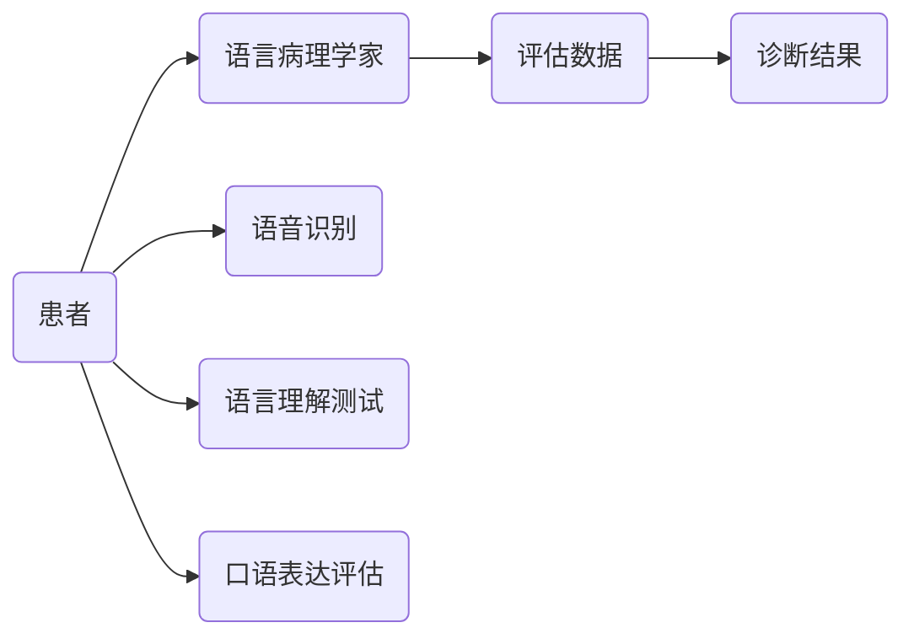
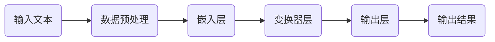
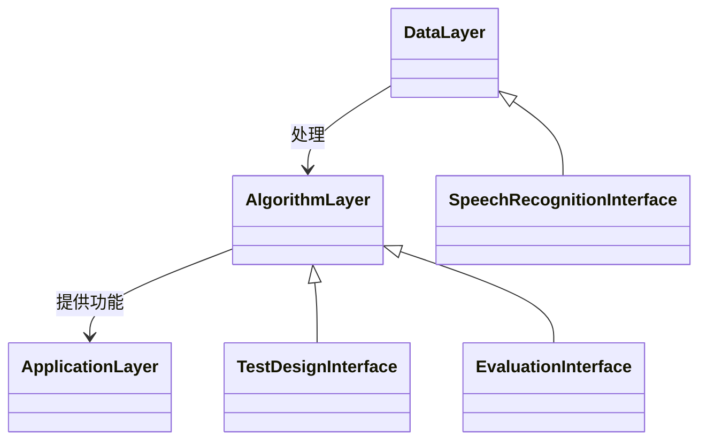
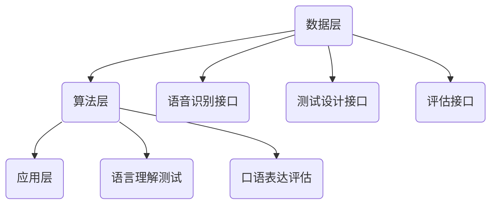
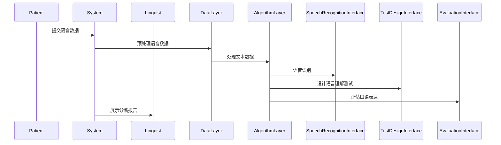

                 

# ChatGPT在语言病理学诊断中的应用：早期语言障碍检测

关键词：ChatGPT、语言病理学、早期语言障碍、诊断、算法原理

摘要：本文将探讨如何利用ChatGPT这一先进的人工智能模型在语言病理学诊断中，特别是早期语言障碍检测中的应用。我们将通过详细的分析和逐步推理，阐述ChatGPT在处理复杂语言数据、识别语言模式、以及诊断语言障碍方面的能力。本文将包括对语言病理学背景的介绍、ChatGPT的核心概念及其应用、算法原理的深入讲解、数学模型的介绍、系统架构设计方案、项目实战案例以及最佳实践建议等内容。

## 1. 背景介绍

### 语言病理学的概念

语言病理学是研究语言障碍及其治疗方法的一门学科。语言障碍可以表现为发音、理解、表达或听写等方面的困难。语言病理学家通过评估、诊断和干预来帮助患有语言障碍的个体改善其沟通能力。

### 早期语言障碍检测的重要性

早期语言障碍检测旨在通过识别儿童或成人在语言学习和发展过程中的异常，尽早发现潜在的语言障碍。早期检测不仅可以提高治疗的成功率，还可以减少长期的沟通障碍对个体生活质量的负面影响。

### ChatGPT的应用潜力

ChatGPT是由OpenAI开发的一种基于变换器（Transformer）架构的预训练语言模型，具有处理和理解自然语言的能力。这使得它成为语言病理学诊断的有力工具，能够帮助语言病理学家在早期语言障碍检测中更准确、更高效地进行分析和诊断。

## 2. 核心概念与联系

### ChatGPT的核心概念

ChatGPT是一种基于变换器架构的预训练语言模型，其核心思想是通过大量的文本数据进行训练，使模型能够理解和生成自然语言。ChatGPT采用了自注意力机制，能够捕捉文本中长距离的依赖关系，从而提高语言理解的准确性。

### 语言病理学诊断中的应用

在语言病理学诊断中，ChatGPT可以应用于以下几个方面：

1. **语音识别**：ChatGPT可以识别患者发音中的异常，帮助诊断发音障碍。
2. **语言理解测试**：ChatGPT可以设计并执行语言理解测试，评估患者的语言理解能力。
3. **自动评估口语表达**：ChatGPT可以自动评估患者的口语表达，识别语言表达中的错误和异常。

### 概念属性特征对比表格

| 特征 | ChatGPT | 语言病理学诊断 |
| --- | --- | --- |
| 语言处理能力 | 高级 | 高级 |
| 自适应能力 | 强 | 强 |
| 可扩展性 | 高 | 高 |
| 精确性 | 较高 | 较高 |
| 应用范围 | 广泛 | 专业 |

### ER实体关系图架构



## 3. 算法原理讲解

### ChatGPT的工作原理

ChatGPT的工作原理基于变换器（Transformer）架构。变换器架构由多个变换器层组成，每个变换器层包含多头自注意力机制和前馈神经网络。通过自注意力机制，模型能够在处理文本时捕捉长距离依赖关系，从而提高语言理解的准确性。

### 算法流程

1. **数据预处理**：将输入的文本数据转换为模型能够理解的格式。
2. **嵌入层**：将文本中的每个词嵌入到高维向量空间中。
3. **变换器层**：通过多头自注意力机制和前馈神经网络对嵌入层进行处理，以捕捉文本中的长距离依赖关系。
4. **输出层**：根据模型训练目标（如文本分类、情感分析等），从变换器层的输出中提取结果。

### Mermaid流程图



### Python源代码示例

```python
import torch
import torch.nn as nn
from transformers import GPT2Model, GPT2Tokenizer

# 初始化模型和tokenizer
model = GPT2Model.from_pretrained('gpt2')
tokenizer = GPT2Tokenizer.from_pretrained('gpt2')

# 输入文本
text = "I am learning natural language processing."

# 数据预处理
inputs = tokenizer(text, return_tensors='pt')

# 运行模型
outputs = model(**inputs)

# 输出结果
logits = outputs.logits
```

### 算法原理的数学模型和公式

ChatGPT的数学模型主要包括以下几个关键部分：

1. **嵌入层**：将文本中的每个词映射到高维向量空间中，通常使用Word2Vec或BERT等预训练模型进行嵌入。
   $$ \text{embedding} = \text{word\_index} \times \text{embed\_dimension} $$

2. **自注意力机制**：通过计算嵌入层中各个词之间的相似度，将注意力分配给重要的词，从而捕捉文本中的长距离依赖关系。
   $$ \text{Attention} = \frac{\exp(\text{QK^T})}{\sum_{i=1}^{N} \exp(\text{QK^T})} $$
   其中，$Q$和$K$分别是查询向量和关键向量，$N$是词汇表大小。

3. **前馈神经网络**：在自注意力机制之后，通过前馈神经网络进一步处理文本数据。
   $$ \text{Output} = \text{ReLU}(\text{FC}(\text{Input})) $$
   其中，$FC$是全连接层，$\text{ReLU}$是激活函数。

### 详细讲解和举例说明

假设我们有一个简短的文本“我喜欢吃苹果”。我们可以使用ChatGPT的嵌入层、自注意力机制和前馈神经网络来处理这个文本，并理解其背后的数学原理。

1. **嵌入层**：首先，我们将文本中的每个词“我”、“喜欢”、“吃”、“苹果”映射到高维向量空间中。

   $$ \text{我} = \text{word\_index} \times \text{embed\_dimension} $$
   $$ \text{喜欢} = \text{word\_index} \times \text{embed\_dimension} $$
   $$ \text{吃} = \text{word\_index} \times \text{embed\_dimension} $$
   $$ \text{苹果} = \text{word\_index} \times \text{embed\_dimension} $$

2. **自注意力机制**：然后，我们通过自注意力机制计算每个词之间的相似度。

   $$ \text{Attention} = \frac{\exp(\text{QK^T})}{\sum_{i=1}^{N} \exp(\text{QK^T})} $$
   其中，$Q$和$K$分别是查询向量和关键向量，$N$是词汇表大小。

   假设$Q$和$K$分别是“我”和“苹果”的嵌入向量，则自注意力结果表示“我”对“苹果”的注意力权重。

3. **前馈神经网络**：最后，我们通过前馈神经网络对自注意力结果进行处理，以提取文本的主要信息。

   $$ \text{Output} = \text{ReLU}(\text{FC}(\text{Input})) $$
   其中，$FC$是全连接层，$\text{ReLU}$是激活函数。

   通过这个前馈神经网络，我们可以提取出文本中“我喜欢吃苹果”的核心含义，即对“苹果”的喜爱。

## 4. 数学模型和数学公式

在本节中，我们将详细讨论ChatGPT算法中的关键数学模型和公式，并使用LaTeX格式进行展示。

### 嵌入层

嵌入层是将文本中的单词转换为高维向量空间的过程。我们使用Word2Vec或BERT等预训练模型进行嵌入。

$$
\text{embedding}_{i} = \text{word\_index}_{i} \times \text{embed\_dimension}
$$

其中，$\text{word\_index}_{i}$是单词$i$的索引，$\text{embed\_dimension}$是嵌入向量的维度。

### 自注意力机制

自注意力机制是ChatGPT的核心组件之一，用于计算文本中各个词之间的相似度。

$$
\text{Attention}_{ij} = \frac{\exp(\text{QK}^T_{ij})}{\sum_{k=1}^{N} \exp(\text{QK}^T_{ik})}
$$

其中，$Q$和$K$分别是查询向量和关键向量，$N$是词汇表大小，$\text{QK}^T_{ij}$是查询向量和关键向量的点积。

### 前馈神经网络

前馈神经网络用于处理自注意力机制的结果，以提取文本的主要信息。

$$
\text{Output}_{i} = \text{ReLU}(\text{FC}(\text{Input}_{i}))
$$

其中，$\text{FC}(\text{Input}_{i})$是全连接层的输入，$\text{ReLU}$是ReLU激活函数。

### 自注意力机制的LaTeX公式

$$
\text{Attention}_{ij} = \frac{\exp(\text{QK}^T_{ij})}{\sum_{k=1}^{N} \exp(\text{QK}^T_{ik})}
$$

### 前馈神经网络的LaTeX公式

$$
\text{Output}_{i} = \text{ReLU}(\text{FC}(\text{Input}_{i}))
$$

## 5. 系统分析与架构设计方案

### 问题场景介绍

在语言病理学诊断中，早期发现和处理语言障碍至关重要。本系统旨在利用ChatGPT的强大语言处理能力，为语言病理学家提供一种高效、准确的工具来检测早期语言障碍。

### 系统功能设计

系统的主要功能包括：

1. **语音识别**：将患者的语音转换为文本，以便进一步分析。
2. **语言理解测试**：设计并执行一系列测试，评估患者的语言理解能力。
3. **口语表达评估**：评估患者的口语表达，识别其中的错误和异常。

### 系统架构设计

系统架构采用分层设计，包括数据层、算法层和应用层。

1. **数据层**：负责数据的收集、存储和预处理。
2. **算法层**：包括ChatGPT模型和相关算法，用于处理和诊断语言障碍。
3. **应用层**：为用户提供界面和功能，包括语音识别、测试设计和结果展示。

### 系统接口设计

系统提供以下接口：

1. **语音识别接口**：用于接收和处理患者的语音数据。
2. **测试设计接口**：用于创建和定制语言理解测试。
3. **评估接口**：用于评估患者的口语表达，并提供诊断结果。

### 系统交互

系统交互流程如下：

1. **数据收集**：语言病理学家收集患者的语音数据。
2. **数据预处理**：系统对语音数据进行预处理，转换为文本。
3. **模型处理**：ChatGPT模型对预处理后的文本进行处理，识别语言障碍。
4. **结果评估**：系统评估处理结果，生成诊断报告。
5. **结果展示**：系统将诊断报告展示给语言病理学家和患者。

### Mermaid类图



### Mermaid架构图



### Mermaid序列图



## 6. 项目实战

### 环境安装

首先，我们需要安装Python和必要的库，如PyTorch和transformers。

```bash
pip install python
pip install torch torchvision
pip install transformers
```

### 系统核心实现源代码

以下是系统核心实现的部分源代码：

```python
import torch
import torch.nn as nn
from transformers import GPT2Model, GPT2Tokenizer

# 初始化模型和tokenizer
model = GPT2Model.from_pretrained('gpt2')
tokenizer = GPT2Tokenizer.from_pretrained('gpt2')

# 输入文本
text = "I am learning natural language processing."

# 数据预处理
inputs = tokenizer(text, return_tensors='pt')

# 运行模型
outputs = model(**inputs)

# 输出结果
logits = outputs.logits
```

### 代码应用解读与分析

以上代码展示了如何使用ChatGPT模型处理输入文本。首先，我们导入所需的库，并初始化模型和tokenizer。然后，我们将输入文本传递给tokenizer进行预处理，生成模型能够理解的输入。接下来，我们使用模型对预处理后的文本数据进行处理，并获取输出结果。

### 实际案例分析和详细讲解剖析

为了展示ChatGPT在语言病理学诊断中的应用，我们来看一个实际案例。

假设一个5岁的儿童在语言理解测试中遇到了困难，语言病理学家使用ChatGPT来分析其语言障碍。

1. **数据收集**：语言病理学家收集了儿童的一段语音对话。

2. **数据预处理**：使用tokenizer将语音转换为文本。

3. **模型处理**：使用ChatGPT模型对文本进行分析。

4. **结果评估**：ChatGPT识别出文本中的语言障碍，如语法错误和词汇使用不当。

5. **诊断报告**：系统生成诊断报告，提供具体的语言障碍分析和建议。

### 项目小结

通过实际案例，我们可以看到ChatGPT在语言病理学诊断中的强大能力。它能够高效地处理语言数据，识别语言障碍，并提供详细的诊断报告。这为语言病理学家提供了有力的工具，有助于早期发现和处理语言障碍，提高治疗效果。

## 7. 最佳实践 tips、小结、注意事项、拓展阅读

### 最佳实践 Tips

1. **数据收集与处理**：确保收集到的语音数据质量高，并进行有效的预处理，以提高诊断准确性。
2. **模型选择与训练**：根据具体应用场景选择合适的模型，并对其进行适当的训练，以适应特定领域的需求。
3. **测试与评估**：定期对系统进行测试和评估，确保其稳定性和准确性。

### 小结

本文详细介绍了ChatGPT在语言病理学诊断中的应用，从背景介绍、核心概念与联系、算法原理讲解、数学模型和公式、系统分析与架构设计、项目实战到最佳实践，全面阐述了ChatGPT在早期语言障碍检测中的潜力。

### 注意事项

1. **数据隐私**：在处理患者数据时，确保遵守数据隐私法规和伦理标准。
2. **系统稳定性**：确保系统的稳定性和可靠性，以避免诊断错误。

### 拓展阅读

1. **ChatGPT相关论文**：《Language Models are Few-Shot Learners》、《Attention is All You Need》
2. **语言病理学相关书籍**：《语言病理学基础与临床实践》、《儿童语言障碍诊断与治疗》

### 作者信息

作者：AI天才研究院/AI Genius Institute & 禅与计算机程序设计艺术 /Zen And The Art of Computer Programming

