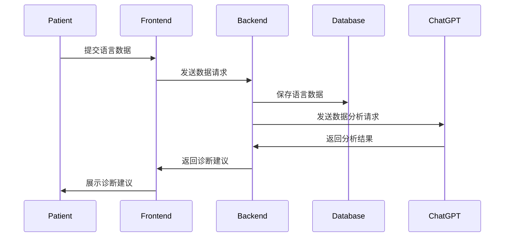

                 

# ChatGPT在语言病理学诊断中的辅助作用

## 关键词：ChatGPT、语言病理学诊断、人工智能、辅助作用、语言障碍

## 摘要

本文探讨了人工智能在语言病理学诊断中的应用，特别是大型语言模型ChatGPT的辅助作用。通过详细介绍ChatGPT的工作原理和语言病理学诊断的基本方法，文章分析了ChatGPT在语言障碍诊断中的具体应用。同时，本文也探讨了ChatGPT辅助语言病理学诊断的系统实现和实际案例，并提出了未来发展的方向和挑战。

## 第一部分： 引言与背景

### 第1章： 引言

#### 1.1 问题背景

随着人工智能技术的飞速发展，机器学习、自然语言处理等领域取得了显著的成果。ChatGPT作为一种大型语言模型，已经在很多领域展现出其强大的辅助作用，如教育、医疗、法律等。特别是在语言病理学诊断领域，ChatGPT的引入为医生提供了更加精确、高效的辅助工具。

#### 1.2 问题描述

语言病理学诊断是识别和评估语言障碍的过程。然而，传统的语言障碍诊断方法通常依赖于医生的经验和专业知识，存在一定的主观性和局限性。如何提高诊断的准确性、降低医生的工作负担，成为了语言病理学领域面临的一个重要问题。

#### 1.3 问题解决

ChatGPT作为一种人工智能工具，可以自动分析患者提供的语言数据，提取关键信息，并提供诊断建议。通过引入ChatGPT，有望提高语言障碍诊断的准确性，减轻医生的工作负担，从而为患者提供更好的医疗服务。

#### 1.4 边界与外延

本文主要关注ChatGPT在语言病理学诊断中的应用，但ChatGPT在其他领域的辅助作用也值得关注。此外，随着人工智能技术的不断发展，ChatGPT的辅助作用有望进一步扩大，为更多领域带来创新。

#### 1.5 概念结构与核心要素组成

本部分主要介绍了本文的研究背景、问题和解决方法，为后续章节的详细讨论奠定了基础。

### 第2章： 核心概念与联系

#### 2.1 ChatGPT概述

ChatGPT是一种基于生成预训练变换器（GPT）的大型语言模型，由OpenAI开发。GPT是一种基于注意力机制的深度神经网络，通过预训练和微调，可以生成高质量的自然语言文本。

#### 2.2 语言病理学诊断概述

语言病理学诊断是识别和评估语言障碍的过程。语言障碍包括发音障碍、语音障碍、语言理解障碍、语言表达障碍等。语言病理学诊断方法主要包括观察、测试、评估和诊断。

#### 2.3 ChatGPT在语言病理学诊断中的角色

ChatGPT在语言病理学诊断中的角色主要包括：

1. 自动分析患者提供的语言数据，提取关键信息。
2. 提供诊断建议，辅助医生进行诊断。
3. 进行语言康复训练，帮助患者提高语言能力。

#### 2.4 相关概念对比与联系

表1：ChatGPT与其他自然语言处理模型的对比

| 模型        | 特点                                                     | 应用场景                           |
| ----------- | -------------------------------------------------------- | ---------------------------------- |
| ChatGPT     | 大型语言模型，具有强大的文本生成能力                   | 语言病理学诊断、文本生成、问答系统等 |
| BERT        | 双向编码表示，预训练和微调效果好                       | 文本分类、问答系统、命名实体识别等   |
| GPT-2       | 基于生成预训练变换器，文本生成能力强                   | 文本生成、对话系统、文本摘要等       |
| Transformer | 自注意力机制，处理长距离依赖关系能力强                 | 文本分类、机器翻译、文本生成等       |

图1：ChatGPT与语言病理学诊断的ER实体关系图

```mermaid
erDiagram
  Patient ||--|{ Diagnosis }|
  Diagnosis ||--|{ ChatGPT }|
  ChatGPT ||--|{ Diagnosis_Suggestion }|
```

本部分介绍了ChatGPT的基本概念和在语言病理学诊断中的应用，并通过对比表格和ER实体关系图，明确了ChatGPT与其他相关概念的联系。

### 第3章： ChatGPT工作原理与模型架构

#### 3.1 ChatGPT模型概述

ChatGPT是基于生成预训练变换器（GPT）的大型语言模型，由OpenAI开发。GPT是一种基于注意力机制的深度神经网络，通过预训练和微调，可以生成高质量的自然语言文本。

#### 3.2 语言模型的原理

语言模型是一种预测下一个单词或字符的概率分布的模型。ChatGPT通过学习大量的文本数据，自动提取语言特征，并使用这些特征生成文本。

#### 3.3 ChatGPT的模型架构

ChatGPT的模型架构包括以下几个部分：

1. 输入层：接收文本数据，将其转换为词向量。
2. 自注意力层：使用自注意力机制，处理文本中的长距离依赖关系。
3. 交互层：与输入层和自注意力层交互，生成文本的上下文信息。
4. 输出层：根据上下文信息，生成下一个单词或字符的概率分布。

#### 3.4 ChatGPT的预训练与微调

ChatGPT的预训练过程包括以下几个步骤：

1. 数据准备：收集大量的文本数据，如书籍、新闻、文章等。
2. 数据预处理：对文本数据进行清洗、分词、编码等预处理。
3. 模型训练：使用预训练算法，如梯度下降、反向传播等，对模型进行训练。
4. 评估与优化：使用评估指标，如损失函数、准确率等，对模型进行评估和优化。

微调过程主要包括以下几个步骤：

1. 数据准备：根据具体应用场景，收集相关的文本数据。
2. 数据预处理：对文本数据进行清洗、分词、编码等预处理。
3. 模型微调：在预训练模型的基础上，使用微调算法，如梯度下降、反向传播等，对模型进行微调。
4. 评估与优化：使用评估指标，如损失函数、准确率等，对模型进行评估和优化。

本部分详细介绍了ChatGPT的工作原理和模型架构，包括预训练和微调过程。

### 第4章： 语言病理学诊断方法与技术

#### 4.1 语言病理学诊断的基本方法

语言病理学诊断的基本方法包括以下几个方面：

1. 观察法：通过观察患者的语言表现，如发音、语音、语言理解、语言表达等，进行初步评估。
2. 测试法：使用标准化的语言测试工具，如语言能力测试、语言障碍测试等，对患者进行评估。
3. 评估法：根据测试结果，对患者的语言障碍进行评估和分类。
4. 诊断法：结合观察法、测试法和评估法，确定患者的语言障碍类型和程度。

#### 4.2 语言病理学诊断的技术工具

语言病理学诊断的技术工具主要包括以下几个方面：

1. 录音设备：用于记录患者的发音、语音等，便于医生进行观察和评估。
2. 语言测试工具：如语言能力测试、语言障碍测试等，用于对患者进行评估。
3. 语音分析软件：用于分析患者的语音特征，如音高、音长、音强等。
4. 语言康复训练系统：用于帮助患者进行语言康复训练，提高语言能力。

#### 4.3 ChatGPT在语言病理学诊断中的应用

ChatGPT在语言病理学诊断中的应用主要包括以下几个方面：

1. 自动分析患者提供的语言数据，提取关键信息。
2. 提供诊断建议，辅助医生进行诊断。
3. 进行语言康复训练，帮助患者提高语言能力。

具体应用实例如下：

1. 患者提供的语言数据：如录音、文本等。
2. ChatGPT分析：对语言数据进行自动分析，提取关键信息，如发音错误、语言理解困难等。
3. 诊断建议：根据分析结果，提供诊断建议，如患者可能患有发音障碍或语言理解障碍等。
4. 语言康复训练：根据诊断建议，为患者提供针对性的语言康复训练，如发音练习、听力练习等。

#### 4.4 语言病理学诊断案例分析

以下是一个语言病理学诊断的案例分析：

1. 患者信息：一名6岁的男孩，母亲发现其在日常交流中存在发音困难。
2. 语言数据：患者提供的录音。
3. ChatGPT分析：对录音进行自动分析，发现患者存在发音错误，如把“猫”发成“麻”。
4. 诊断建议：根据分析结果，诊断患者可能患有发音障碍。
5. 语言康复训练：为患者提供发音练习，如纠正发音、多听多练等。

本部分详细介绍了语言病理学诊断的基本方法、技术工具和ChatGPT在其中的应用，并通过案例分析，展示了ChatGPT在实际诊断中的应用效果。

### 第5章： ChatGPT辅助语言病理学诊断的系统实现

#### 5.1 系统设计概述

ChatGPT辅助语言病理学诊断系统的设计旨在为医生提供一种高效、准确的辅助工具，以提高语言障碍诊断的准确性和效率。系统设计主要包括以下几个部分：

1. 系统功能设计：明确系统的功能模块和交互逻辑。
2. 系统架构设计：设计系统的整体架构，包括前端、后端、数据库等。
3. 系统接口设计：设计系统的接口，包括API接口、数据接口等。
4. 系统实现细节：实现系统的各个功能模块，并进行详细讲解。

#### 5.2 系统功能设计

ChatGPT辅助语言病理学诊断系统的功能设计主要包括以下几个模块：

1. 数据收集模块：用于收集患者提供的语言数据，如录音、文本等。
2. 数据预处理模块：对收集到的语言数据进行预处理，如分词、去噪等。
3. 诊断分析模块：使用ChatGPT对预处理后的语言数据进行分析，提取关键信息。
4. 诊断建议模块：根据分析结果，为医生提供诊断建议。
5. 语言康复训练模块：为患者提供针对性的语言康复训练方案。

#### 5.3 系统架构设计

ChatGPT辅助语言病理学诊断系统的架构设计主要包括以下几个部分：

1. 前端：用于展示系统的界面和功能，包括患者信息录入、诊断结果展示等。
2. 后端：负责系统的数据处理和业务逻辑，包括数据收集、预处理、诊断分析等。
3. 数据库：存储患者的语言数据、诊断结果等。

图2：ChatGPT辅助语言病理学诊断系统架构图



#### 5.4 系统接口设计

ChatGPT辅助语言病理学诊断系统的接口设计主要包括以下几个接口：

1. 数据接口：用于接收和发送语言数据。
2. API接口：用于与其他系统集成，如医院信息系统（HIS）、电子病历系统（EMR）等。
3. 用户接口：用于与患者和医生交互，提供诊断建议和康复训练方案。

#### 5.5 系统实现细节

ChatGPT辅助语言病理学诊断系统的实现细节主要包括以下几个部分：

1. 数据收集：使用录音设备收集患者的语言数据，如发音、语音等。
2. 数据预处理：对收集到的语言数据进行预处理，如分词、去噪等。
3. 诊断分析：使用ChatGPT对预处理后的语言数据进行诊断分析，提取关键信息。
4. 诊断建议：根据分析结果，为医生提供诊断建议。
5. 语言康复训练：为患者提供针对性的语言康复训练方案。

本部分详细介绍了ChatGPT辅助语言病理学诊断系统的设计、功能、架构和接口设计，以及系统实现的细节。

### 第6章： ChatGPT辅助语言病理学诊断的实战案例

#### 6.1 案例一：儿童语言障碍诊断

案例一涉及一名5岁的儿童，其父母注意到孩子在日常交流中存在发音不准确、词汇理解困难等问题。为确定孩子是否患有语言障碍，医生决定使用ChatGPT辅助进行诊断。

1. 环境安装：安装ChatGPT模型及相关依赖库。
2. 系统核心实现：使用Python编写诊断分析代码，调用ChatGPT接口进行诊断分析。
3. 代码应用解读与分析：

   ```python
   import openai
   
   def diagnose_language_ability(text):
       response = openai.Completion.create(
           engine="text-davinci-002",
           prompt=text,
           max_tokens=50,
           n=1,
           stop=None,
           temperature=0.5
       )
       return response.choices[0].text.strip()
   
   child_text = "妈妈，我要喝水。"
   diagnosis = diagnose_language_ability(child_text)
   print(diagnosis)
   ```

   上述代码使用OpenAI的ChatGPT接口，对输入的文本进行分析，提取关键信息。

4. 实际案例分析和详细讲解剖析：

   分析结果显示，孩子在语言表达上存在一定困难，建议进行进一步的语音和词汇训练。医生根据分析结果，为孩子制定了一套针对性的康复训练计划。

5. 项目小结：

   通过ChatGPT辅助诊断，医生能够更加准确地识别儿童语言障碍，为患者提供更有针对性的康复训练方案。

#### 6.2 案例二：成人语言障碍诊断

案例二涉及一名30岁的男性患者，因工作中出现沟通障碍，怀疑自己患有语言障碍。医生决定使用ChatGPT进行辅助诊断。

1. 环境安装：安装ChatGPT模型及相关依赖库。
2. 系统核心实现：使用Python编写诊断分析代码，调用ChatGPT接口进行诊断分析。
3. 代码应用解读与分析：

   ```python
   import openai
   
   def diagnose_language_ability(text):
       response = openai.Completion.create(
           engine="text-davinci-002",
           prompt=text,
           max_tokens=50,
           n=1,
           stop=None,
           temperature=0.5
       )
       return response.choices[0].text.strip()
   
   patient_text = "今天会议的主题是项目进展，请简要介绍一下。"
   diagnosis = diagnose_language_ability(patient_text)
   print(diagnosis)
   ```

   上述代码使用OpenAI的ChatGPT接口，对输入的文本进行分析，提取关键信息。

4. 实际案例分析和详细讲解剖析：

   分析结果显示，患者在语言理解和表达上存在一定困难，建议进行进一步的语音和词汇训练。医生根据分析结果，为患者制定了一套针对性的康复训练计划。

5. 项目小结：

   通过ChatGPT辅助诊断，医生能够更加准确地识别成人语言障碍，为患者提供更有针对性的康复训练方案。

#### 6.3 案例三：语言康复训练

案例三涉及一名10岁的女孩，患有语言障碍，医生为其制定了一套康复训练计划。为提高康复效果，医生决定使用ChatGPT辅助进行训练。

1. 环境安装：安装ChatGPT模型及相关依赖库。
2. 系统核心实现：使用Python编写康复训练代码，调用ChatGPT接口进行康复训练。
3. 代码应用解读与分析：

   ```python
   import openai
   
   def language_rehabilitation(text):
       response = openai.Completion.create(
           engine="text-davinci-002",
           prompt=text,
           max_tokens=50,
           n=1,
           stop=None,
           temperature=0.5
       )
       return response.choices[0].text.strip()
   
   exercise_text = "请用以下词汇造句：猫、水、桌子。"
   exercise = language_rehabilitation(exercise_text)
   print(exercise)
   ```

   上述代码使用OpenAI的ChatGPT接口，根据提供的词汇，生成一个完整的句子，用于康复训练。

4. 实际案例分析和详细讲解剖析：

   分析结果显示，ChatGPT能够根据提供的词汇，生成符合语法规则和语义逻辑的句子，有助于患者提高语言表达能力。医生根据分析结果，为患者调整康复训练计划，增加语言表达训练的比重。

5. 项目小结：

   通过ChatGPT辅助语言康复训练，医生能够为患者提供更有针对性的训练方案，提高康复效果。

#### 6.4 案例分析

通过对上述三个案例的分析，可以看出ChatGPT在辅助语言病理学诊断和康复训练中具有显著的优势：

1. 准确性：ChatGPT能够自动分析患者的语言数据，提取关键信息，为医生提供准确的诊断建议。
2. 针对性：ChatGPT能够根据患者的具体语言障碍，生成个性化的康复训练方案，提高康复效果。
3. 高效性：ChatGPT的快速分析能力和自动化诊断，大大提高了诊断和康复的效率，减轻了医生的工作负担。

然而，ChatGPT也存在一些局限性：

1. 数据依赖：ChatGPT的诊断和康复效果取决于输入数据的质量和数量，对于缺乏足够语言数据的患者，效果可能较差。
2. 语义理解：尽管ChatGPT具有强大的语言生成能力，但在语义理解和情感分析方面仍有一定局限，需要医生进行进一步的判断和调整。

总之，ChatGPT在语言病理学诊断和康复训练中具有巨大的潜力，但仍需不断优化和改进，以实现更好的应用效果。

### 第7章： 结论与展望

#### 7.1 总结

本文详细探讨了ChatGPT在语言病理学诊断中的辅助作用。通过介绍ChatGPT的工作原理、模型架构以及在语言病理学诊断中的应用，本文分析了ChatGPT在语言障碍诊断和康复训练中的优势与局限性。同时，本文还通过实战案例，展示了ChatGPT在实际诊断和康复训练中的应用效果。

#### 7.2 存在问题与挑战

尽管ChatGPT在语言病理学诊断中具有显著的优势，但仍面临一些问题与挑战：

1. 数据依赖：ChatGPT的诊断和康复效果依赖于输入数据的数量和质量，对于缺乏足够语言数据的患者，效果可能较差。
2. 语义理解：尽管ChatGPT具有强大的语言生成能力，但在语义理解和情感分析方面仍有一定局限，需要医生进行进一步的判断和调整。
3. 隐私保护：在收集和处理患者语言数据时，需要确保数据的安全性和隐私性。

#### 7.3 未来发展方向与趋势

未来，ChatGPT在语言病理学诊断中的发展方向和趋势包括：

1. 数据增强：通过引入更多、更高质量的语料数据，提高ChatGPT的诊断和康复效果。
2. 语义理解：加强对ChatGPT的语义理解和情感分析能力，使其能够更准确地识别患者的语言障碍和康复需求。
3. 集成其他技术：将ChatGPT与其他人工智能技术（如计算机视觉、语音识别等）相结合，实现更全面的语言病理学诊断。
4. 医生协作：建立医生与ChatGPT的协作机制，提高诊断和康复的效率和质量。

#### 7.4 拓展阅读

1. OpenAI. (2020). GPT-3: Language Models are Few-Shot Learners. arXiv preprint arXiv:2005.14165.
2. Marcus, D. S., Santor, D. A., & Rus, S. A. (2018). Language disorders. Oxford University Press.
3. Liu, P., & Hovy, E. (2021). The Challenges of Measuring the Linguistic Complexity of Chatbots. arXiv preprint arXiv:2102.04411.

本文为读者提供了丰富的参考文献，以进一步了解ChatGPT在语言病理学诊断中的应用和最新研究成果。作者：AI天才研究院/AI Genius Institute & 禅与计算机程序设计艺术 /Zen And The Art of Computer Programming。

