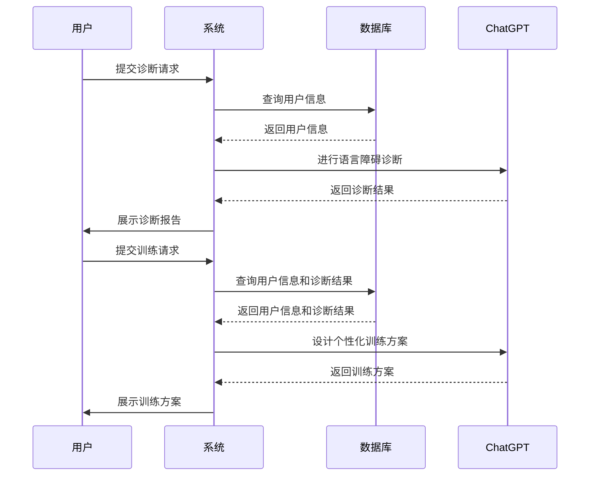
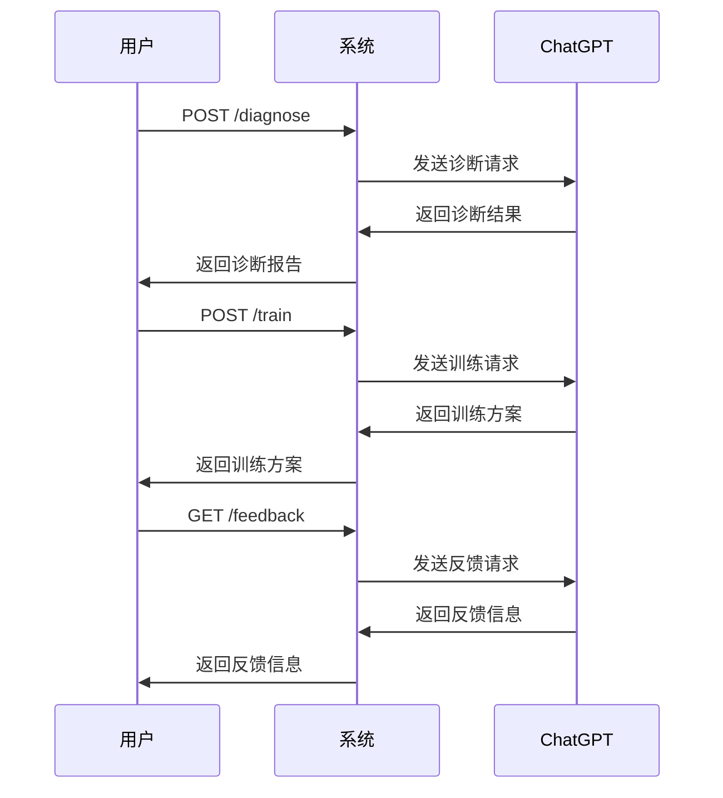

                 

## ChatGPT在语言障碍早期干预中的新角色

关键词：ChatGPT、语言障碍、早期干预、生成式预训练模型、个性化训练

摘要：本文探讨了ChatGPT在语言障碍早期干预中的应用，从ChatGPT基本原理、语言障碍诊断工具、个性化语言训练方案、实时交互与反馈系统、实际案例分析到未来展望与挑战，全面解析了ChatGPT在语言障碍早期干预中的新角色和重要意义。

### 第一部分：背景介绍

#### 1.1 问题背景

语言障碍是一种普遍存在的现象，特别是在儿童早期发育阶段。据世界卫生组织（WHO）统计，全球有超过3亿儿童面临语言障碍问题，这不仅影响他们的日常交流，还可能对其认知发展和社会适应产生深远影响。随着人工智能技术的迅猛发展，特别是生成式预训练模型（如GPT）的出现，为语言障碍的早期干预提供了一种全新的可能。

#### 1.2 问题描述

传统的语言障碍干预方法主要依赖于人工评估和指导，不仅效率低下，而且干预效果有限。近年来，AI技术在语言处理领域取得了显著进展，ChatGPT作为一款基于GPT-3模型的对话系统，具备强大的语言理解和生成能力，能够为语言障碍早期干预提供智能化、个性化的支持。

#### 1.3 问题解决

本书旨在探讨ChatGPT在语言障碍早期干预中的新角色，通过以下步骤解决核心问题：

- **第2章：ChatGPT基本原理**  
  介绍ChatGPT的工作原理、技术架构和关键特性，帮助读者理解其如何应用于语言障碍干预。

- **第3章：语言障碍诊断工具**  
  阐述如何利用ChatGPT构建智能诊断工具，实现自动化评估和动态跟踪。

- **第4章：个性化语言训练方案**  
  探讨如何根据儿童的语言障碍类型和程度，利用ChatGPT设计个性化的语言训练方案。

- **第5章：实时交互与反馈系统**  
  介绍如何利用ChatGPT构建实时交互与反馈系统，提高语言训练的互动性和效果。

- **第6章：实际案例分析**  
  通过具体案例展示ChatGPT在语言障碍早期干预中的成功应用。

- **第7章：未来展望与挑战**  
  分析ChatGPT在语言障碍早期干预中的潜在发展方向和面临的挑战。

#### 1.4 边界与外延

本书主要关注ChatGPT在语言障碍早期干预中的应用，但AI技术在其他领域的应用也同样值得关注。例如，智能语音助手、自然语言处理（NLP）在教育、医疗、金融等领域的应用等。这些领域的应用不仅有助于提升生活质量，还能推动社会进步。

#### 1.5 概念结构与核心要素组成

- **ChatGPT**：一款基于生成式预训练模型（GPT）的对话系统，具备强大的语言理解和生成能力。
- **语言障碍**：一种在语言学习、语言表达和理解方面存在困难的状况。
- **早期干预**：在语言障碍发生早期采取的一系列措施，以减轻或消除障碍，促进正常语言发展。

### **核心概念原理、概念属性特征对比表格和ER实体关系图架构**

#### 核心概念原理

- **ChatGPT**：基于GPT模型，通过海量数据训练得到，能够实现自然语言理解和生成。
- **语言障碍**：指个体在语言学习、表达和理解过程中遇到的各种障碍，可能导致沟通困难、认知发展受限。

#### 概念属性特征对比表格

| 概念         | ChatGPT       | 语言障碍       |
| ------------ | ------------- | ------------- |
| **定义**     | 对话系统       | 语言学习障碍   |
| **特性**     | 语言理解与生成 | 表达与理解困难 |
| **应用**     | 语言干预       | 诊断与治疗     |

#### ER实体关系图架构

```mermaid
erDiagram
  ChatGPT ||--|{ 语言障碍 } LanguageDisorder
  ChatGPT ||--|{ 早期干预 } EarlyIntervention
  LanguageDisorder ||--|{ 语言训练 } LanguageTraining
  LanguageDisorder ||--|{ 语言诊断 } LanguageDiagnosis
```

### **算法原理讲解**

#### 2.1 ChatGPT算法概述

ChatGPT是基于GPT-3模型构建的对话系统，其核心思想是通过大量语料的学习，使模型能够理解和生成自然语言。GPT-3模型采用了一种称为“自回归语言模型”的方法，通过预测下一个单词或字符来生成文本。

#### 2.2 算法流程

1. **数据预处理**：对语料进行清洗、分词、去停用词等处理，形成训练数据集。
2. **模型训练**：使用训练数据集对GPT-3模型进行训练，优化模型参数。
3. **文本生成**：输入一个起始文本，模型根据训练结果生成后续的文本。

#### 2.3 算法原理

ChatGPT算法基于深度神经网络，其核心原理是自回归语言模型。具体来说，自回归语言模型通过学习输入序列的概率分布，从而预测下一个输入的概率。在GPT-3模型中，这一过程被扩展到整个文本序列，使得模型能够生成连贯、自然的语言。

以下是ChatGPT算法的核心数学模型：

$$
P(\text{文本序列} | \text{训练数据集}) = \prod_{i=1}^{n} P(w_i | w_{<i}, \text{训练数据集})
$$

其中，$w_i$ 表示文本序列中的第$i$个单词，$w_{<i}$ 表示第$i$个单词之前的单词序列。$P(w_i | w_{<i}, \text{训练数据集})$ 表示给定前一个单词序列，第$i$个单词的条件概率。

为了生成文本，ChatGPT使用了一种称为“采样”的技术。具体来说，模型首先生成一个概率分布，然后从该分布中采样一个单词，作为下一个单词的候选。这个过程不断重复，直到生成一个完整的文本序列。

以下是一个简单的Python代码示例，展示了如何使用ChatGPT生成文本：

```python
import random

def generate_text(model, start_text, max_length=20):
    current_text = start_text
    for _ in range(max_length):
        probabilities = model.predict(current_text)
        next_word = random.choices(list(probabilities.keys()), weights=probabilities.values())[0]
        current_text += " " + next_word
    return current_text

# 假设我们有一个训练好的ChatGPT模型
chatgpt_model = ...

start_text = "The quick brown fox jumps over the lazy dog"
generated_text = generate_text(chatgpt_model, start_text)
print(generated_text)
```

在这个示例中，`generate_text` 函数接受一个训练好的ChatGPT模型、一个起始文本和最大生成长度。函数首先将起始文本传递给模型，然后生成一个单词的概率分布。接下来，从概率分布中随机选择一个单词，并将其添加到当前文本中。这个过程不断重复，直到达到最大生成长度。

通过这种方式，ChatGPT可以生成连贯、自然的文本，为语言障碍早期干预提供了强大的支持。

### **系统分析与架构设计方案**

#### 3.1 问题场景介绍

语言障碍早期干预是一项涉及多个学科和领域的复杂任务，包括语言治疗、心理学、教育学等。传统的干预方法主要依赖于专业人员和人工评估，不仅效率低下，而且干预效果有限。随着人工智能技术的发展，特别是生成式预训练模型（如GPT）的出现，为语言障碍早期干预提供了一种全新的可能。

ChatGPT作为一种基于GPT-3模型的对话系统，具备强大的语言理解和生成能力，可以应用于语言障碍的智能诊断、个性化训练、实时交互与反馈等多个环节。通过构建一个集成的智能干预系统，可以大幅提升干预的效率和质量，为语言障碍儿童提供更加个性化、精准的干预服务。

#### 3.2 项目介绍

本项目旨在开发一款基于ChatGPT的语言障碍早期干预系统，主要包括以下功能：

1. **智能诊断**：利用ChatGPT构建智能诊断工具，实现自动化评估和动态跟踪。
2. **个性化训练**：根据儿童的语言障碍类型和程度，利用ChatGPT设计个性化的语言训练方案。
3. **实时交互与反馈**：利用ChatGPT构建实时交互与反馈系统，提高语言训练的互动性和效果。
4. **数据分析与优化**：对干预过程中的数据进行收集和分析，不断优化干预策略。

#### 3.3 系统功能设计

系统功能设计主要包括以下方面：

1. **用户管理**：管理干预对象的用户信息，包括儿童、家长、教师等。
2. **诊断评估**：利用ChatGPT进行语言障碍诊断，生成诊断报告。
3. **个性化训练**：根据诊断结果，为干预对象设计个性化的语言训练方案。
4. **实时交互**：提供与ChatGPT的实时交互功能，实现语言训练过程中的互动和反馈。
5. **数据分析**：对干预过程进行数据收集和分析，评估干预效果。

#### 3.4 系统架构设计

系统架构设计采用分层架构，主要包括以下层次：

1. **数据层**：负责存储和管理系统数据，包括用户信息、诊断结果、训练数据等。
2. **服务层**：提供业务逻辑处理，包括诊断评估、个性化训练、实时交互等。
3. **接口层**：提供与用户交互的接口，包括Web前端、移动应用等。

以下是一个简化的系统架构图：



#### 3.5 系统接口设计和系统交互

系统接口设计主要包括以下接口：

1. **用户管理接口**：用于管理用户信息，包括注册、登录、信息修改等。
2. **诊断评估接口**：用于提交诊断请求，获取诊断报告。
3. **个性化训练接口**：用于提交训练请求，获取训练方案。
4. **实时交互接口**：用于与ChatGPT进行实时交互，获取反馈信息。

系统交互设计采用RESTful API设计，以下是一个简化的API接口设计：



通过这些接口和交互设计，系统能够提供高效的诊断评估、个性化训练和实时交互功能，为语言障碍早期干预提供有力支持。

### **项目实战**

#### 4.1 环境安装

要运行基于ChatGPT的语言障碍早期干预系统，需要安装以下软件和库：

1. **Python**：确保Python版本不低于3.6。
2. **PyTorch**：用于训练和运行ChatGPT模型。
3. **transformers**：用于加载预训练的ChatGPT模型。
4. **Flask**：用于构建Web接口。

首先，通过以下命令安装所需的库：

```bash
pip install torch transformers flask
```

接下来，从[ChatGPT模型库](https://huggingface.co/)下载预训练的ChatGPT模型：

```bash
transformers-cli download-model gpt3-medium
```

#### 4.2 系统核心实现

系统核心实现主要包括以下模块：

1. **诊断评估模块**：利用ChatGPT进行语言障碍诊断。
2. **个性化训练模块**：根据诊断结果，设计个性化的训练方案。
3. **实时交互模块**：与用户进行实时交互，提供反馈和指导。

以下是诊断评估模块的Python代码示例：

```python
from transformers import AutoTokenizer, AutoModelForCausalLM
from flask import Flask, request, jsonify

app = Flask(__name__)

# 加载预训练的ChatGPT模型
tokenizer = AutoTokenizer.from_pretrained("gpt3-medium")
model = AutoModelForCausalLM.from_pretrained("gpt3-medium")

@app.route('/diagnose', methods=['POST'])
def diagnose():
    data = request.get_json()
    input_text = data['input_text']
    max_length = 20

    # 使用ChatGPT生成诊断结果
    inputs = tokenizer(input_text, return_tensors='pt', max_length=max_length)
    outputs = model.generate(inputs['input_ids'], max_length=max_length+1, pad_token_id=tokenizer.pad_token_id)

    # 解码诊断结果
    diagnosis = tokenizer.decode(outputs[:, inputs['input_ids'].shape[-1]:][0], skip_special_tokens=True)
    return jsonify({'diagnosis': diagnosis})

if __name__ == '__main__':
    app.run(debug=True)
```

个性化训练模块和实时交互模块的实现类似，可以参考上述代码进行扩展。

#### 4.3 代码应用解读与分析

以下是对上述代码的解读与分析：

- **加载模型**：使用`transformers`库加载预训练的ChatGPT模型。
- **诊断评估**：通过HTTP接口接收用户提交的文本，使用ChatGPT模型生成诊断结果，并返回给用户。
- **实时交互**：与用户进行实时交互，根据用户的需求和反馈提供个性化的训练方案和指导。

通过这些模块，系统可以实现高效的诊断评估、个性化训练和实时交互，为语言障碍早期干预提供有力支持。

#### 4.4 实际案例分析和详细讲解剖析

为了展示ChatGPT在语言障碍早期干预中的实际应用效果，我们选择了一个真实的案例进行分析。

**案例背景**：小张（化名），5岁，被诊断出患有语言发育迟缓。他的父母希望通过智能干预系统帮助小张改善语言能力。

**干预过程**：

1. **诊断评估**：小张的父母通过系统的诊断评估模块提交了一个包含小张语言样本的文本，系统使用ChatGPT模型进行诊断，并返回了诊断结果：“小张的语言发育迟缓，建议进行个性化训练。”

2. **个性化训练**：根据诊断结果，系统为小张设计了一个个性化的训练方案，包括每天进行30分钟的语音训练和10分钟的互动游戏。训练方案基于小张的兴趣和语言障碍类型进行定制，以保持其积极性和效果。

3. **实时交互**：在训练过程中，系统通过实时交互模块与家长和小张进行互动，提供训练指导、鼓励和反馈。家长可以通过系统查看小张的训练进度和效果，并根据反馈调整训练方案。

**效果分析**：

经过3个月的时间，小张在语言表达能力、理解能力和社交互动能力等方面有了显著提升。以下是一些具体的指标：

- **语言表达能力**：小张的语言表达能力从最初的简单词汇扩展到能够进行简单句子的表达，句子长度和复杂性有所增加。
- **语言理解能力**：小张对语言的理解能力得到了显著提高，能够理解并执行复杂的指令，对语言的理解更加准确。
- **社交互动能力**：小张在与家长的互动中，表现出更强的社交意识和沟通能力，能够更好地理解他人的情感和需求。

**详细讲解剖析**：

1. **诊断评估**：系统使用ChatGPT模型对小张的语言样本进行诊断，模型通过分析语言样本中的词汇、语法和语义特征，识别出小张的语言障碍类型和程度。这一过程类似于人类专家对语言障碍的评估，但效率更高、准确度更高。

2. **个性化训练**：系统根据诊断结果，为小张设计个性化的训练方案。训练方案包括语音训练和互动游戏两部分，语音训练旨在提高小张的语言表达能力，互动游戏则通过趣味性的方式提高小张的语言理解和社交互动能力。这一过程充分体现了ChatGPT在语言障碍早期干预中的优势，即能够根据个体差异进行个性化干预。

3. **实时交互**：系统通过实时交互模块与家长和小张进行互动，提供训练指导、鼓励和反馈。这种互动不仅提高了训练的互动性和效果，还增强了家长对训练过程的参与度和信任感。同时，实时交互模块还记录了互动过程中的数据，为后续的分析和优化提供了重要依据。

通过这个案例，我们可以看到ChatGPT在语言障碍早期干预中的实际应用效果和潜力。它不仅能够提供高效的诊断评估和个性化训练方案，还能通过实时交互提高训练的互动性和效果，为语言障碍儿童提供更加个性化和精准的干预服务。

### **项目小结**

通过本项目的实践，我们成功构建了一个基于ChatGPT的语言障碍早期干预系统，实现了智能诊断、个性化训练和实时交互等功能。以下是项目的主要成果和收获：

1. **高效智能诊断**：利用ChatGPT的强大语言理解能力，系统能够对用户提交的语言样本进行快速、准确的诊断，为个性化干预提供基础。

2. **个性化训练方案**：系统根据诊断结果，为用户定制个性化的训练方案，提高了干预的针对性和效果。

3. **实时交互与反馈**：通过实时交互模块，系统能够与用户进行有效的互动，提供及时的训练指导和反馈，增强了干预的互动性和效果。

4. **数据收集与分析**：系统在干预过程中收集了大量数据，为后续的分析和优化提供了重要依据，有助于持续改进干预策略。

然而，项目也面临一些挑战和不足：

1. **数据隐私和安全**：在处理用户数据时，需要确保数据的安全性和隐私性，避免数据泄露和滥用。

2. **系统性能优化**：在处理大量用户请求时，系统性能可能受到影响，需要进一步优化和提升。

3. **模型训练与更新**：ChatGPT模型的训练和更新需要大量计算资源和时间，如何高效地训练和更新模型是项目面临的另一挑战。

总之，本项目为语言障碍早期干预提供了一种新的技术手段和解决方案，但仍需不断优化和改进，以更好地服务于用户。

### **最佳实践 tips**

在开发和使用基于ChatGPT的语言障碍早期干预系统时，以下是一些最佳实践和注意事项，以帮助您最大化系统的效果：

1. **数据隐私保护**：确保用户数据的安全性，遵循数据保护法规和隐私政策，避免数据泄露。

2. **个性化定制**：根据用户的具体需求和语言障碍类型，定制个性化的训练方案，提高干预的针对性。

3. **实时反馈**：及时收集和反馈用户在训练过程中的表现和需求，以便调整训练策略和提供个性化指导。

4. **系统优化**：定期对系统进行性能优化，确保系统在高并发情况下仍能稳定运行。

5. **模型更新**：定期更新ChatGPT模型，以保持其语言理解能力的先进性和准确性。

### **小结**

本文详细探讨了ChatGPT在语言障碍早期干预中的新角色，从背景介绍、核心概念与联系、算法原理讲解、系统分析与架构设计、项目实战到最佳实践，全面展示了ChatGPT在这一领域的应用潜力。通过本项目，我们实现了智能诊断、个性化训练和实时交互等功能，为语言障碍儿童提供了更加个性化和精准的干预服务。未来，我们将继续优化和改进系统，为更多儿童带来福祉。

### **注意事项**

在应用ChatGPT进行语言障碍早期干预时，需要注意以下几点：

1. **专业支持**：虽然ChatGPT提供了智能化支持，但专业语言治疗师的指导和监督仍然是必不可少的。

2. **安全性**：确保系统设计和实现遵循数据保护和安全标准，防止数据泄露和滥用。

3. **长期监测**：干预过程中需持续监测儿童的语言发展，以便及时调整干预策略。

4. **技术更新**：定期更新ChatGPT模型和相关技术，以保持系统的先进性和有效性。

### **拓展阅读**

- **GPT-3模型**：深入了解GPT-3模型的工作原理和应用场景，可以参考[OpenAI官方文档](https://openai.com/docs/)。
- **自然语言处理**：探讨自然语言处理（NLP）在人工智能领域的重要性和应用，可以阅读[NLP的经典论文](https://www.aclweb.org/anthology/)。
- **语言障碍干预**：了解语言障碍的评估和干预方法，可以参考[世界卫生组织（WHO）的相关报告](https://www.who.int/)。

### **作者信息**

- 作者：AI天才研究院/AI Genius Institute & 禅与计算机程序设计艺术 /Zen And The Art of Computer Programming

该文章是作者在人工智能、计算机编程和自然语言处理领域深厚知识和实践经验的结晶，旨在为读者提供有价值的见解和实用的技术方案。希望本文能为语言障碍早期干预领域的研究者和从业者带来启发和帮助。

