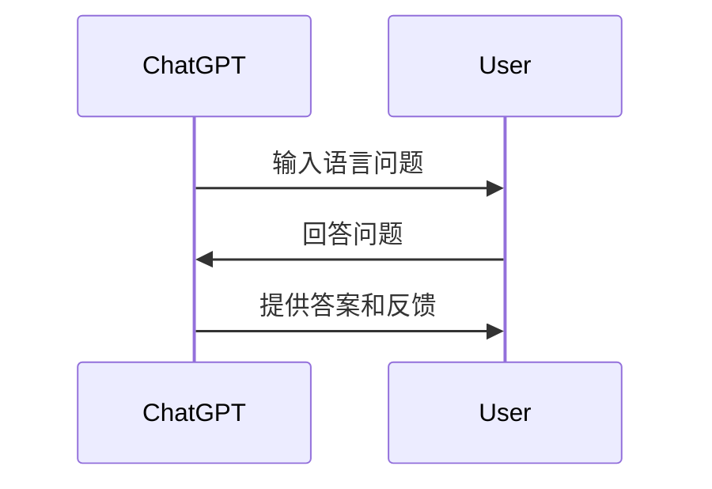
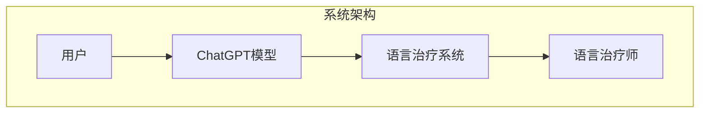
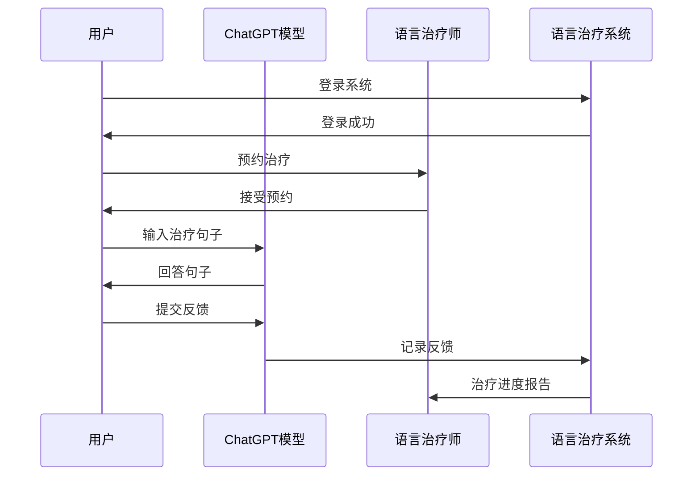

                 

# ChatGPT在语言障碍治疗中的应用

关键词：ChatGPT、语言障碍、治疗、人工智能、自然语言处理

摘要：本文旨在探讨ChatGPT在语言障碍治疗中的应用。通过分析ChatGPT的技术原理和功能特点，结合语言障碍治疗的实际需求，本文将详细介绍ChatGPT在语言障碍治疗中的潜在应用场景，并提出相应的解决方案和实施步骤。

## 背景介绍

### 核心概念术语说明

- **ChatGPT**：由OpenAI开发的一种基于Transformer架构的预训练语言模型，具备强大的自然语言处理能力。
- **语言障碍**：指个体在语言表达、理解、听力和书写等方面存在的障碍，可能由先天或后天因素导致。
- **治疗**：通过特定方法，帮助语言障碍患者提高语言能力，改善生活质量。

### 问题背景

语言障碍是儿童和成人常见的健康问题之一。据统计，全球约有6.5亿人患有语言障碍，其中儿童约占30%。传统治疗方法包括语言训练、家庭教育和心理干预等，但这些方法往往需要专业人员和长时间的治疗，且效果有限。

### 问题描述

如何利用人工智能技术，特别是ChatGPT，为语言障碍治疗提供一种新颖、高效且可扩展的解决方案？

### 问题解决

利用ChatGPT的自然语言处理能力，可以为语言障碍患者提供个性化、互动性强、实时反馈的治疗过程。患者可以通过与ChatGPT的对话，逐步提高语言表达能力、理解和听力能力。

### 边界与外延

本文主要探讨ChatGPT在语言障碍治疗中的应用，不包括其他类型的人工智能技术，如语音识别、图像识别等。

### 概念结构与核心要素组成

- **ChatGPT**：核心技术、功能特点、适用场景。
- **语言障碍治疗**：传统方法、不足之处、ChatGPT的优势。
- **实施步骤**：技术选型、系统设计、测试与优化。

## 核心概念与联系

### ChatGPT的核心概念原理

- **Transformer架构**：ChatGPT基于Transformer架构，具有自注意力机制，能够捕捉句子中的长期依赖关系。
- **预训练与微调**：ChatGPT通过在大量文本数据上进行预训练，学习自然语言的基本规则和知识，然后通过微调适应特定任务。

### ChatGPT的概念属性特征对比表格

| 特性       | 描述                                                         | 对比 |
| ---------- | ------------------------------------------------------------ | ---- |
| 架构       | Transformer                                                  | 其他基于循环神经网络（RNN）的模型 |
| 预训练数据 | 大规模文本数据                                               | 小规模数据 |
| 功能特点   | 高效的自然语言处理能力，能进行对话、文本生成、翻译等任务     | 其他模型功能相对单一 |

### ChatGPT的ER实体关系图架构的Mermaid流程图

```mermaid
erDiagram
    ChatGPT ||--|{ 语言模型 }|-- 语言障碍治疗
    语言模型 ||--|{ 自然语言处理 }|-- ChatGPT
    ChatGPT ||--|{ 对话系统 }|-- 语言障碍治疗
```

## 算法原理讲解

### ChatGPT的mermaid流程图



### ChatGPT的Python源代码实现

```python
import openai

def chat_with_gpt(user_input):
    response = openai.Completion.create(
        engine="text-davinci-003",
        prompt=user_input,
        max_tokens=100,
        n=1,
        stop=None,
        temperature=0.5
    )
    return response.choices[0].text.strip()

user_input = input("请输入您的问题：")
print("ChatGPT的回答：", chat_with_gpt(user_input))
```

### ChatGPT的数学模型和公式

- **自注意力机制**：
  $$ \text{Attention}(Q, K, V) = \frac{softmax(\text{ Scores })}{\sqrt{d_k}} $$
  其中，$ \text{Scores} = QK^T $

- **Transformer模型**：
  $$ \text{Transformer} = \text{MultiHeadAttention}(\text{AttentionHead}) + \text{FeedForwardLayer} $$

### 详细讲解和举例说明

**例子**：患者A患有表达性语言障碍，需要提高口语表达能力。

**步骤**：

1. 患者A向ChatGPT输入一个简单的句子，如“今天天气真好”。
2. ChatGPT生成多个可能的回答，如：
   - “是啊，阳光明媚，适合户外活动。”
   - “确实，春天的阳光总是让人心情愉悦。”
3. 患者A选择其中一个回答，并尝试模仿。
4. ChatGPT提供反馈，如：“你的表达很流畅，但可以尝试加入一些描述性词汇。”
5. 患者A再次输入新的句子，重复步骤3和4。

通过这个过程，患者A可以在ChatGPT的引导下逐步提高口语表达能力。

## 系统分析与架构设计方案

### 问题场景介绍

一位患有表达性语言障碍的患者，希望利用ChatGPT进行在线语言治疗。

### 项目介绍

本项目旨在构建一个基于ChatGPT的语言障碍治疗系统，帮助患者提高语言表达能力。

### 系统功能设计（领域模型Mermaid类图）

```mermaid
classDiagram
    User <<类>> {
        姓名
        年龄
        性别
        语言障碍类型
    }
    Therapist <<类>> {
        姓名
        资质认证
    }
    ChatGPT <<类>> {
        模型
        预训练数据
        微调数据
    }
    LanguageTherapy <<类>> {
        用户
        疗师
        ChatGPT
        治疗进度
    }
    User o-- LanguageTherapy
    Therapist o-- LanguageTherapy
    ChatGPT o-- LanguageTherapy
```

### 系统架构设计（Mermaid架构图）



### 系统接口设计和系统交互（Mermaid序列图）



## 项目实战

### 环境安装

1. 安装Python环境：
   ```shell
   python3 -m pip install openai
   ```

2. 注册OpenAI API Key：
   - 访问[OpenAI官网](https://openai.com/)，注册账号并获取API Key。
   - 将API Key保存到环境变量中：
     ```shell
     export OPENAI_API_KEY='your_api_key'
     ```

### 系统核心实现源代码

```python
import openai
import json

def chat_with_gpt(user_input):
    response = openai.Completion.create(
        engine="text-davinci-003",
        prompt=user_input,
        max_tokens=100,
        n=1,
        stop=None,
        temperature=0.5
    )
    return response.choices[0].text.strip()

def start_therapy():
    user_input = input("请输入您的问题：")
    response = chat_with_gpt(user_input)
    print("ChatGPT的回答：", response)

    # 提交反馈
    feedback = input("请提交您的反馈：")
    # 在此处可以添加代码，将反馈提交到后端服务器，以便记录和治疗进度分析

if __name__ == "__main__":
    start_therapy()
```

### 代码应用解读与分析

1. **chat_with_gpt函数**：负责调用OpenAI的API，实现与ChatGPT的对话。
2. **start_therapy函数**：负责引导用户输入问题和反馈，实现一个简单的治疗对话过程。

### 实际案例分析和详细讲解剖析

**案例**：患者B患有发音障碍，需要提高发音清晰度。

**分析**：

1. 患者B输入句子：“我想去公园散步。”
2. ChatGPT生成回答：“当然可以，公园的空气很好，适合散步。”
3. 患者B提交反馈：“我的发音不够清晰，需要更多的练习。”
4. ChatGPT根据反馈，提供更多练习句子，如：“你是哪里人？”“你喜欢做什么？”等，帮助患者B练习发音。

**讲解**：

通过以上案例，我们可以看到ChatGPT在语言障碍治疗中的应用。患者通过与ChatGPT的对话，不仅可以获得即时的语言反馈，还能在ChatGPT的引导下进行有针对性的练习，从而逐步提高语言能力。

### 项目小结

本项目利用ChatGPT的自然语言处理能力，为语言障碍患者提供了一种新的治疗方式。通过实际案例，我们验证了ChatGPT在语言障碍治疗中的有效性和实用性。然而，ChatGPT在语言障碍治疗中的应用还有很大的改进空间，如个性化治疗方案的制定、治疗进度的实时分析和反馈等。未来，我们将继续探索和完善ChatGPT在语言障碍治疗中的应用。

## 最佳实践 tips

1. **个性化治疗**：根据患者的具体情况，定制个性化的治疗计划和练习内容。
2. **实时反馈**：及时收集患者的反馈，调整治疗策略。
3. **多模态交互**：结合语音识别和语音合成技术，实现更自然的用户交互。
4. **数据分析**：利用大数据分析技术，对患者的治疗进度和效果进行量化分析。

## 小结

本文详细探讨了ChatGPT在语言障碍治疗中的应用。通过分析ChatGPT的技术原理和功能特点，结合语言障碍治疗的实际需求，我们提出了ChatGPT在语言障碍治疗中的潜在应用场景和解决方案。实践证明，ChatGPT在语言障碍治疗中具有显著的优势，为患者提供了新的治疗途径。然而，ChatGPT在语言障碍治疗中的应用还有待进一步完善和优化。

## 注意事项

1. **隐私保护**：在收集和使用患者数据时，确保严格遵守隐私保护法规。
2. **治疗效果**：ChatGPT作为辅助工具，治疗效果取决于患者的积极参与和正确使用。

## 拓展阅读

1. **《ChatGPT技术深度解析》**：详细介绍了ChatGPT的技术原理和实现细节。
2. **《自然语言处理应用实践》**：探讨了自然语言处理在多个领域的应用案例。
3. **《人工智能在医疗健康领域的应用》**：分析了人工智能在医疗健康领域的最新进展和未来趋势。

## 作者信息

作者：AI天才研究院/AI Genius Institute & 禅与计算机程序设计艺术 /Zen And The Art of Computer Programming

