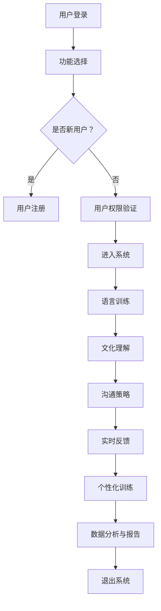
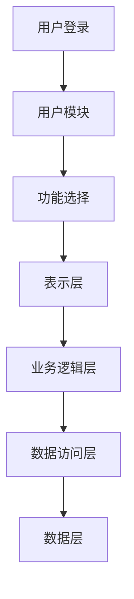
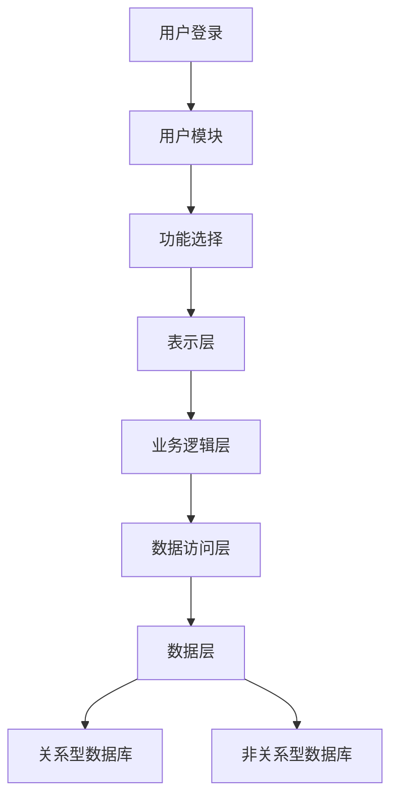
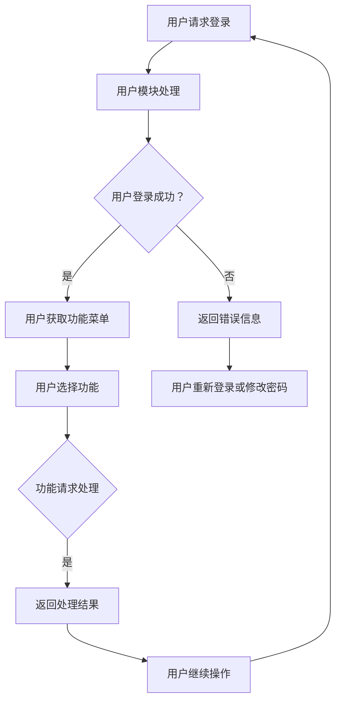

                 

# ChatGPT在跨文化沟通训练中的应用

## 关键词
- ChatGPT
- 跨文化沟通
- 训练应用
- 自然语言处理
- 人工智能

## 摘要
本文将探讨ChatGPT在跨文化沟通训练中的应用。随着全球化进程的加速，跨文化沟通成为国际交流和商业活动中不可或缺的一环。本文首先介绍了ChatGPT的基本原理和特点，然后分析了跨文化沟通中的核心问题，最后通过具体案例阐述了ChatGPT在跨文化沟通训练中的应用，以及其优势和面临的挑战。通过本文的探讨，旨在为读者提供一种新的跨文化沟通训练思路和方法。

## 目录大纲

### 第一部分: ChatGPT在跨文化沟通训练中的应用背景

#### 1.1 问题背景
##### 1.1.1 跨文化沟通的重要性
##### 1.1.2 跨文化沟通面临的挑战
##### 1.1.3 ChatGPT技术的出现与应用前景

#### 1.2 ChatGPT简介
##### 1.2.1 ChatGPT的基本原理
##### 1.2.2 ChatGPT的结构与训练方法
##### 1.2.3 ChatGPT的优势与局限

#### 1.3 ChatGPT在跨文化沟通训练中的应用场景
##### 1.3.1 沟通训练的需求分析
##### 1.3.2 ChatGPT在沟通训练中的具体应用

#### 1.4 ChatGPT在跨文化沟通训练中的应用案例
##### 1.4.1 案例一：跨文化商务沟通训练
##### 1.4.2 案例二：跨文化团队协作沟通训练
##### 1.4.3 案例三：跨文化客户服务沟通训练

#### 1.5 本章小结

### 第二部分: ChatGPT在跨文化沟通训练中的核心概念与联系

#### 2.1 跨文化沟通的核心概念
##### 2.1.1 跨文化沟通的定义
##### 2.1.2 跨文化沟通的障碍
##### 2.1.3 跨文化沟通的有效策略

#### 2.2 ChatGPT的核心概念
##### 2.2.1 ChatGPT的定义
##### 2.2.2 ChatGPT的工作原理
##### 2.2.3 ChatGPT的主要特点

#### 2.3 跨文化沟通与ChatGPT的联系
##### 2.3.1 跨文化沟通的需求与ChatGPT的优势
##### 2.3.2 ChatGPT在跨文化沟通中的应用模式
##### 2.3.3 跨文化沟通中ChatGPT的挑战与应对策略

### 第三部分: ChatGPT在跨文化沟通训练中的应用原理

#### 3.1 ChatGPT的应用原理
##### 3.1.1 ChatGPT的架构
##### 3.1.2 ChatGPT的训练过程
##### 3.1.3 ChatGPT的生成机制

#### 3.2 跨文化沟通训练中的算法原理
##### 3.2.1 跨文化沟通算法的基本原理
##### 3.2.2 跨文化沟通算法的数学模型
##### 3.2.3 跨文化沟通算法的实现步骤

#### 3.3 ChatGPT与跨文化沟通训练的结合
##### 3.3.1 ChatGPT在跨文化沟通训练中的应用场景
##### 3.3.2 ChatGPT在跨文化沟通训练中的优势
##### 3.3.3 ChatGPT在跨文化沟通训练中的局限性

### 第四部分: 跨文化沟通训练系统分析与架构设计

#### 4.1 问题场景介绍
##### 4.1.1 跨文化沟通训练的需求
##### 4.1.2 跨文化沟通训练的目标
##### 4.1.3 跨文化沟通训练的难点与挑战

#### 4.2 系统功能设计
##### 4.2.1 系统功能概述
##### 4.2.2 系统功能模块划分
##### 4.2.3 系统功能流程图

#### 4.3 系统架构设计
##### 4.3.1 系统架构概述
##### 4.3.2 系统架构设计
##### 4.3.3 系统架构图

#### 4.4 系统接口设计
##### 4.4.1 系统接口设计原则
##### 4.4.2 系统接口定义
##### 4.4.3 系统接口实现

#### 4.5 系统交互设计
##### 4.5.1 系统交互设计原则
##### 4.5.2 系统交互流程图
##### 4.5.3 系统交互实现

### 第五部分: ChatGPT在跨文化沟通训练中的项目实战

#### 5.1 环境安装
##### 5.1.1 系统环境要求
##### 5.1.2 系统安装步骤
##### 5.1.3 系统安装问题与解决

#### 5.2 系统核心实现源代码
##### 5.2.1 系统核心代码概述
##### 5.2.2 系统核心代码实现
##### 5.2.3 系统核心代码解读

#### 5.3 代码应用解读与分析
##### 5.3.1 代码应用概述
##### 5.3.2 代码应用分析
##### 5.3.3 代码应用解读

#### 5.4 实际案例分析和详细讲解剖析
##### 5.4.1 案例选择与背景介绍
##### 5.4.2 案例分析
##### 5.4.3 案例详细讲解剖析

#### 5.5 项目小结
##### 5.5.1 项目总结
##### 5.5.2 项目展望

## 1.1 问题背景

### 1.1.1 跨文化沟通的重要性

在全球化的背景下，跨文化沟通变得愈发重要。无论是国际贸易、跨国合作，还是国际旅游、文化交流，都需要有效的跨文化沟通能力。良好的跨文化沟通不仅能够促进不同文化背景的人们之间的理解和合作，还能提高企业的国际竞争力。

首先，跨文化沟通是国际交流和合作的基础。在全球化的今天，各国之间的贸易往来、技术合作、文化交流等活动日益频繁。这些活动都需要跨文化沟通作为桥梁，使得不同文化背景的人能够相互理解，达成共识。

其次，跨文化沟通是跨国企业成功的关键。跨国企业需要在不同文化环境中运营，如何有效地与当地员工、客户和合作伙伴沟通，是决定企业成败的重要因素。良好的跨文化沟通能力，可以减少误解和冲突，提高企业的运营效率。

### 1.1.2 跨文化沟通面临的挑战

尽管跨文化沟通的重要性不言而喻，但实际操作中却面临着诸多挑战。

首先，语言障碍是跨文化沟通的首要挑战。不同的语言和文化背景，使得人们表达和理解信息的方式有所不同。语言障碍不仅影响沟通的效率，还可能导致误解和冲突。

其次，文化差异也是跨文化沟通的难点。不同的文化背景，有着不同的价值观、行为规范和沟通风格。这些差异可能会引起误解和矛盾，影响沟通的效果。

最后，跨文化沟通还需要考虑到时间、空间和心理因素。不同文化背景的人对于时间和空间的感知不同，可能导致沟通中的误解和冲突。

### 1.1.3 ChatGPT技术的出现与应用前景

ChatGPT是一种基于自然语言处理和机器学习技术的智能对话系统。它的出现为解决跨文化沟通中的问题提供了新的思路和方法。

首先，ChatGPT具有强大的自然语言理解能力。它可以通过大量的语言数据训练，理解不同文化背景下的语言表达方式，从而提高跨文化沟通的准确性。

其次，ChatGPT具有自适应的能力。它可以根据用户的反馈和需求，调整自己的沟通方式和风格，以更好地适应不同的文化背景。

最后，ChatGPT具有广泛的应用前景。它可以应用于多种场景，如跨文化商务沟通、团队协作沟通、客户服务沟通等，为跨文化沟通提供全方位的支持。

总的来说，ChatGPT在跨文化沟通训练中的应用前景广阔。它不仅可以解决跨文化沟通中的语言障碍和文化差异问题，还可以提高沟通的效率和效果。随着技术的不断进步，ChatGPT在跨文化沟通训练中的应用将越来越广泛。

## 1.2 ChatGPT简介

### 1.2.1 ChatGPT的基本原理

ChatGPT是一种基于变换器（Transformer）模型的自然语言处理（NLP）技术。变换器模型是由谷歌研究团队在2017年提出的一种全新的人工神经网络结构，主要用于处理序列到序列（sequence-to-sequence）的任务。与传统的循环神经网络（RNN）和卷积神经网络（CNN）相比，变换器模型具有更好的并行计算能力和更强的捕捉长距离依赖关系的能力。

ChatGPT的基本原理是通过训练大量的语言数据，使模型能够理解和生成自然语言。具体来说，ChatGPT采用了两个变换器模型：编码器（Encoder）和解码器（Decoder）。编码器负责将输入的文本序列编码成一个固定的向量表示，而解码器则根据编码器的输出，逐个预测下一个词。

### 1.2.2 ChatGPT的结构与训练方法

ChatGPT的结构主要包括编码器、解码器以及一个注意力机制（Attention Mechanism）。编码器和解码器都是变换器模型，其中编码器负责将输入的文本序列编码成一个固定长度的向量，解码器则根据这个向量生成输出文本序列。

ChatGPT的训练方法主要分为两个步骤：预训练和微调。预训练是在大量无标签的数据上进行，目的是让模型学会理解和生成自然语言。微调则是在有标签的数据上进行，目的是让模型学会根据输入生成预期的输出。

在预训练阶段，ChatGPT首先使用变换器模型对输入的文本序列进行编码，然后使用注意力机制将编码结果与解码器的输入进行拼接，最后通过解码器生成输出文本序列。在微调阶段，ChatGPT使用有标签的数据进行训练，目的是让模型能够根据输入生成预期的输出。

### 1.2.3 ChatGPT的优势与局限

ChatGPT具有许多优势，例如：

1. 强大的自然语言理解能力：ChatGPT通过预训练和微调，可以理解大量的语言数据，从而具有强大的自然语言理解能力。

2. 自适应的能力：ChatGPT可以根据用户的反馈和需求，调整自己的沟通方式和风格，以更好地适应不同的文化背景。

3. 广泛的应用前景：ChatGPT可以应用于多种场景，如跨文化商务沟通、团队协作沟通、客户服务沟通等，为跨文化沟通提供全方位的支持。

然而，ChatGPT也存在一些局限，例如：

1. 需要大量的训练数据：ChatGPT的训练需要大量的语言数据，这对于数据稀缺的文化背景来说可能是一个挑战。

2. 对计算资源要求较高：ChatGPT的训练和推理需要大量的计算资源，对于资源有限的组织来说可能是一个负担。

3. 难以完全消除误解：尽管ChatGPT具有强大的自然语言理解能力，但仍然难以完全消除跨文化沟通中的误解。

总的来说，ChatGPT在跨文化沟通训练中的应用具有很大的潜力，但也需要不断改进和完善。

## 1.3 ChatGPT在跨文化沟通训练中的应用场景

### 1.3.1 沟通训练的需求分析

跨文化沟通训练的需求主要来自于以下几个方面：

1. **语言能力的提升**：不同文化背景的人在语言表达和理解上存在差异，这导致跨文化沟通中的语言障碍。通过ChatGPT进行语言训练，可以帮助用户提高语言表达能力，增强对目标语言的感知和理解能力。

2. **文化理解的深入**：不同文化有不同的价值观、行为规范和沟通方式。通过ChatGPT，用户可以学习到不同文化的特点和沟通技巧，从而更好地理解并适应不同文化背景的沟通环境。

3. **沟通策略的优化**：跨文化沟通不仅需要语言能力和文化理解，还需要有效的沟通策略。ChatGPT可以提供针对不同文化背景的沟通策略建议，帮助用户在实际沟通中更好地应对各种情况。

### 1.3.2 ChatGPT在沟通训练中的具体应用

ChatGPT在跨文化沟通训练中的具体应用可以分为以下几个步骤：

1. **初步评估**：首先，ChatGPT会对用户的语言能力和文化理解进行初步评估，包括语言水平的测试和文化背景的了解。

2. **定制化训练计划**：根据初步评估结果，ChatGPT会为用户制定个性化的训练计划。该计划会包括语言训练、文化理解训练和沟通策略训练等内容。

3. **语言训练**：ChatGPT通过大量的语言数据，帮助用户进行语言训练。用户可以通过与ChatGPT的对话，不断提高自己的语言表达能力。

4. **文化理解训练**：ChatGPT会根据用户的文化背景，提供相应的文化理解训练。用户可以通过学习不同文化的特点和沟通方式，增强对文化差异的理解。

5. **沟通策略训练**：ChatGPT会根据用户的语言能力和文化理解，提供针对性的沟通策略训练。用户可以通过模拟不同的沟通场景，学习如何在实际沟通中应用这些策略。

6. **反馈与调整**：在整个训练过程中，ChatGPT会收集用户的反馈，并根据反馈对训练计划进行调整，以更好地满足用户的需求。

### 1.3.3 跨文化沟通训练中的常见问题和解决方案

在跨文化沟通训练中，用户可能会遇到以下一些常见问题：

1. **语言理解困难**：不同语言的表达方式不同，用户可能会在语言理解上遇到困难。解决方案是增加语言数据的多样性，提高模型的泛化能力。

2. **文化差异敏感度不足**：用户可能会对某些文化差异不够敏感，导致沟通中的误解和冲突。解决方案是通过案例分析和实际模拟，提高用户对文化差异的敏感度。

3. **沟通策略适用性不强**：用户可能会发现某些沟通策略在实际应用中并不适用。解决方案是结合用户的具体场景，提供更加个性化和实用的沟通策略。

通过ChatGPT的跨文化沟通训练，用户可以逐步提高自己的语言能力和文化理解，掌握有效的沟通策略，从而在跨文化沟通中更加自信和自如。

## 1.4 ChatGPT在跨文化沟通训练中的应用案例

### 1.4.1 案例一：跨文化商务沟通训练

**案例背景**：某跨国公司计划在中国设立一个新的办事处，但由于团队成员来自不同国家，包括中国、美国、英国和德国，因此面临着跨文化商务沟通的挑战。

**应用过程**：
1. **初步评估**：公司首先使用ChatGPT对团队成员的语言能力和文化理解进行初步评估，以了解每个人的语言水平和文化背景。
2. **定制化训练计划**：ChatGPT根据评估结果，为团队成员制定了个性化的跨文化商务沟通训练计划。该计划包括英语、中文和德语的强化训练，以及关于中美、中美英、中美德文化差异的讲解。
3. **语言训练**：团队成员通过与ChatGPT的互动，逐步提高自己的语言表达能力，特别是在商务英语和中文方面。
4. **文化理解训练**：ChatGPT提供了丰富的文化背景资料和案例分析，帮助团队成员更好地理解不同文化在商务沟通中的行为习惯和沟通策略。
5. **沟通策略训练**：ChatGPT根据团队成员的实际沟通场景，提供了一系列沟通策略建议，如如何在不同文化背景下进行有效演讲、谈判和会议沟通。
6. **反馈与调整**：在整个训练过程中，团队成员提供了反馈，ChatGPT根据反馈对训练计划进行了调整，使其更加符合实际需求。

**效果评估**：
1. **语言能力提升**：团队成员的商务英语和中文水平显著提高，能够更自信地进行跨文化商务沟通。
2. **文化理解加深**：团队成员对中美、中美英、中美德文化差异有了更深入的理解，能够更好地适应不同文化背景的商务环境。
3. **沟通策略掌握**：团队成员掌握了多种有效的沟通策略，能够在不同文化背景下进行更加有效的商务沟通。

**总结**：通过ChatGPT的跨文化商务沟通训练，该跨国公司成功解决了团队成员在跨文化商务沟通中的障碍，提高了团队的协作效率和国际竞争力。

### 1.4.2 案例二：跨文化团队协作沟通训练

**案例背景**：某国际软件公司有一个多国团队，成员来自日本、美国、印度和巴西。由于文化差异，团队在协作过程中经常出现沟通障碍，影响了项目的进度和质量。

**应用过程**：
1. **初步评估**：公司使用ChatGPT对团队成员的语言能力和文化理解进行评估，以确定每个人的沟通需求和问题所在。
2. **定制化训练计划**：ChatGPT根据评估结果，为团队设计了个性化的跨文化团队协作沟通训练计划。该计划包括语言训练、文化差异讲解和团队协作策略训练。
3. **语言训练**：团队成员通过与ChatGPT的互动，提高语言能力，特别是提高了在英语、日语、葡萄牙语和印地语方面的沟通能力。
4. **文化理解训练**：ChatGPT提供了关于日本、美国、印度和巴西文化的详细资料，帮助团队成员更好地理解彼此的文化背景和行为习惯。
5. **团队协作策略训练**：ChatGPT根据团队成员的实际工作场景，提供了一系列团队协作策略，如如何进行有效的远程会议、如何分配任务和如何处理冲突。
6. **反馈与调整**：团队成员在整个训练过程中提供了反馈，ChatGPT根据反馈不断调整训练内容，确保培训效果。

**效果评估**：
1. **语言沟通能力提升**：团队成员的语言沟通能力显著提高，能够更有效地进行跨文化沟通。
2. **文化理解加深**：团队成员对彼此的文化背景和行为习惯有了更深入的了解，能够更好地适应多文化团队的工作环境。
3. **协作效率提高**：通过有效的沟通策略训练，团队协作效率显著提高，项目的进度和质量得到了保证。

**总结**：通过ChatGPT的跨文化团队协作沟通训练，该国际软件公司成功解决了团队成员在跨文化协作中的沟通障碍，提高了团队的协作效率和国际竞争力。

### 1.4.3 案例三：跨文化客户服务沟通训练

**案例背景**：某国际酒店集团在中国开设了一家新酒店，由于客户来源多样化，包括中国本地客户、外国游客和商务人士，酒店面临着跨文化客户服务的挑战。

**应用过程**：
1. **初步评估**：酒店使用ChatGPT对客户服务团队的语言能力和文化理解进行评估，以了解团队成员在跨文化服务中的优势和劣势。
2. **定制化训练计划**：ChatGPT根据评估结果，为酒店设计了个性化的跨文化客户服务沟通训练计划。该计划包括英语、中文和其他外语的强化训练，以及关于中国文化、外国文化习俗的讲解。
3. **语言训练**：酒店员工通过与ChatGPT的互动，提高英语和中文水平，特别是提高了与外国客户沟通的能力。
4. **文化理解训练**：ChatGPT提供了丰富的文化背景资料，帮助酒店员工更好地理解不同文化背景客户的需求和行为习惯。
5. **客户服务策略训练**：ChatGPT根据酒店的实际客户服务场景，提供了一系列客户服务策略建议，如如何处理客户投诉、如何提供个性化服务等。
6. **反馈与调整**：在整个训练过程中，酒店员工提供了反馈，ChatGPT根据反馈不断调整训练内容，确保培训效果。

**效果评估**：
1. **语言沟通能力提升**：酒店员工的语言沟通能力显著提高，能够更有效地与各种文化背景的客户进行沟通。
2. **文化理解加深**：酒店员工对各种文化背景客户的需求和行为习惯有了更深入的理解，能够提供更贴心的服务。
3. **客户满意度提高**：通过有效的跨文化客户服务沟通训练，酒店客户满意度显著提高，业务口碑得到进一步改善。

**总结**：通过ChatGPT的跨文化客户服务沟通训练，该国际酒店集团成功提升了客户服务团队的语言能力和文化理解能力，提高了客户满意度，增强了酒店的国际竞争力。

## 1.5 本章小结

本章介绍了ChatGPT在跨文化沟通训练中的应用背景、基本原理和具体应用案例。通过分析跨文化沟通的重要性和面临的挑战，我们了解到ChatGPT作为一种先进的自然语言处理技术，在提升语言能力、增强文化理解和优化沟通策略方面具有显著优势。通过具体案例的展示，我们看到了ChatGPT在跨文化商务沟通、团队协作沟通和客户服务沟通中的实际应用效果。然而，ChatGPT在跨文化沟通训练中也面临一些挑战，如数据需求和计算资源等。未来的研究和发展需要在这些方面进行改进和优化，以更好地服务于跨文化沟通的需求。通过本章的探讨，我们期待为读者提供一种新的跨文化沟通训练思路和方法，助力跨文化交流和合作。

## 2.1 跨文化沟通的核心概念

### 2.1.1 跨文化沟通的定义

跨文化沟通是指在不同文化背景下进行的沟通活动，涉及不同文化背景的个体或群体之间的信息传递、理解和互动。这种沟通不仅包括语言交流，还涵盖了非语言交流、价值观、行为规范、习俗和习惯等各个方面。

### 2.1.2 跨文化沟通的障碍

跨文化沟通中的障碍主要包括以下几个方面：

1. **语言障碍**：不同文化背景的人使用的语言不同，语言差异可能导致误解和沟通障碍。

2. **非语言障碍**：如肢体语言、面部表情、姿态等，这些非语言交流方式在不同文化中可能有不同的含义。

3. **价值观差异**：不同的文化背景导致人们的价值观和行为规范不同，这可能导致沟通中的冲突和误解。

4. **行为习惯差异**：不同文化背景的人在沟通方式和行为习惯上也有所不同，如时间观念、决策过程、沟通风格等。

5. **心理障碍**：如文化陌生感、自信心不足、恐惧和焦虑等，这些心理因素可能影响跨文化沟通的效果。

### 2.1.3 跨文化沟通的有效策略

为了克服跨文化沟通中的障碍，可以采取以下有效策略：

1. **提高语言能力**：学习目标语言，提高语言表达能力，以便更准确地传达信息和理解对方。

2. **文化敏感性培训**：通过学习不同文化的特点和沟通习惯，增强文化敏感性，减少误解和冲突。

3. **明确沟通目标**：在沟通前明确目标，确保双方对沟通内容有一致的理解。

4. **积极倾听**：倾听对方的观点和需求，避免过早做出判断和反应。

5. **使用非语言交流**：学会运用肢体语言、面部表情等非语言交流方式，以增强沟通效果。

6. **建立信任关系**：通过建立信任关系，增强沟通的开放性和透明度。

7. **灵活调整沟通策略**：根据对方的反应和文化背景，灵活调整沟通策略，以达到更好的沟通效果。

通过这些策略，可以有效提升跨文化沟通的效果，促进不同文化背景个体或群体之间的理解和合作。

## 2.2 ChatGPT的核心概念

### 2.2.1 ChatGPT的定义

ChatGPT是一种基于变换器（Transformer）模型的自然语言处理（NLP）技术，由OpenAI开发。它是一种大型语言模型，能够通过深度学习技术理解和生成自然语言。

### 2.2.2 ChatGPT的工作原理

ChatGPT的工作原理主要包括以下几个步骤：

1. **编码器（Encoder）**：编码器接收输入文本序列，通过变换器层将文本转换为固定长度的向量表示。

2. **解码器（Decoder）**：解码器接收编码器的输出，逐个预测下一个词，生成输出文本序列。

3. **注意力机制（Attention Mechanism）**：在编码和解码过程中，注意力机制用于捕捉文本序列中的关键信息，提高生成文本的准确性和连贯性。

### 2.2.3 ChatGPT的主要特点

ChatGPT具有以下几个主要特点：

1. **强大的自然语言理解能力**：通过预训练和微调，ChatGPT可以理解大量的语言数据，从而具备强大的自然语言理解能力。

2. **自适应的能力**：ChatGPT可以根据用户的反馈和需求，调整自己的沟通方式和风格，以更好地适应不同的文化背景。

3. **广泛的应用场景**：ChatGPT可以应用于多种场景，如客服聊天、文本生成、机器翻译等，为跨文化沟通提供全方位的支持。

4. **高效率和低延迟**：ChatGPT采用了变换器模型，具有高效的计算能力和低延迟的特点，可以实时响应用户的请求。

5. **可扩展性**：ChatGPT可以通过微调的方式，针对特定任务进行优化，从而提高任务性能。

总的来说，ChatGPT作为一种先进的自然语言处理技术，在跨文化沟通训练中具有巨大的潜力，能够有效提升跨文化沟通的效率和效果。

## 2.3 跨文化沟通与ChatGPT的联系

### 2.3.1 跨文化沟通的需求与ChatGPT的优势

跨文化沟通的需求主要集中在以下几个方面：

1. **语言能力提升**：不同文化背景的人在语言表达和理解上存在差异，提升语言能力是跨文化沟通的关键。

2. **文化理解增强**：理解不同文化的价值观、行为规范和沟通习惯，有助于避免误解和冲突。

3. **沟通策略优化**：针对不同文化背景的沟通策略，可以提升沟通的效率和效果。

ChatGPT在满足这些需求方面具有显著优势：

1. **强大的自然语言理解能力**：ChatGPT通过预训练和微调，可以理解大量的语言数据，从而提升语言能力。

2. **自适应的沟通能力**：ChatGPT可以根据用户的反馈和需求，调整沟通方式和风格，以适应不同文化背景。

3. **广泛的场景适用性**：ChatGPT可以应用于多种跨文化沟通场景，如商务沟通、团队协作和客户服务。

### 2.3.2 ChatGPT在跨文化沟通中的应用模式

ChatGPT在跨文化沟通中的应用模式主要包括以下几个方面：

1. **语言训练**：通过模拟对话，ChatGPT可以帮助用户提升语言表达能力，特别是在目标语言的听、说、读、写能力方面。

2. **文化理解**：ChatGPT可以提供关于不同文化的背景资料和案例分析，帮助用户加深对文化差异的理解。

3. **沟通策略**：ChatGPT可以根据用户的实际沟通场景，提供针对性的沟通策略建议，如如何在不同文化背景下进行有效演讲、谈判和会议沟通。

4. **实时反馈**：ChatGPT可以实时反馈用户的沟通效果，帮助用户及时调整沟通方式和策略。

5. **自动化工具**：ChatGPT可以集成到自动化工具中，如客服系统、电子邮件助手等，为跨文化沟通提供自动化支持。

### 2.3.3 跨文化沟通中ChatGPT的挑战与应对策略

尽管ChatGPT在跨文化沟通中具有显著优势，但仍然面临一些挑战：

1. **数据质量**：ChatGPT的性能高度依赖于训练数据的质量。在跨文化环境中，获取高质量的多语言、多文化数据可能具有挑战性。

2. **文化复杂性**：不同文化之间的复杂性使得ChatGPT在理解和生成文化相关的语言时可能存在困难。

3. **本地化**：ChatGPT需要根据不同地区的语言和文化特点进行本地化调整，以确保沟通效果。

应对策略包括：

1. **数据增强**：通过人工标注和数据清洗，提高训练数据的质量。

2. **多语言模型**：开发支持多种语言和文化背景的多语言模型，以提高跨文化沟通的准确性。

3. **本地化优化**：根据目标地区的语言和文化特点，对ChatGPT进行本地化调整。

4. **用户反馈**：收集用户反馈，不断优化模型，使其更好地适应不同文化背景的需求。

总的来说，ChatGPT在跨文化沟通中具有巨大的潜力，但也需要不断改进和完善。通过结合有效的应对策略，可以更好地发挥ChatGPT的优势，提升跨文化沟通的效果。

## 3.1 ChatGPT的应用原理

### 3.1.1 ChatGPT的架构

ChatGPT采用的是基于变换器（Transformer）模型的人工神经网络架构。变换器模型是一种用于处理序列到序列（sequence-to-sequence）任务的深度学习模型，最初由Google Brain团队在2017年提出。与传统的循环神经网络（RNN）和卷积神经网络（CNN）相比，变换器模型具有更好的并行计算能力和更强的捕捉长距离依赖关系的能力。

ChatGPT的架构主要包括编码器（Encoder）和解码器（Decoder）两个部分，以及一个注意力机制（Attention Mechanism）。

1. **编码器（Encoder）**：
   - 编码器的输入是一个文本序列，每个词被表示为一个向量。
   - 编码器通过多个变换器层对输入序列进行处理，每层的输出都是一个固定长度的向量，表示整个输入序列的语义信息。
   - 最后，编码器输出一个序列的固定长度的向量表示，这个向量被用作解码器的输入。

2. **解码器（Decoder）**：
   - 解码器的输入是编码器的输出，以及上一个时间步的预测词。
   - 解码器通过变换器层生成一系列的中间表示，并在每个时间步预测下一个词。
   - 最后，解码器输出一个完整的文本序列。

3. **注意力机制（Attention Mechanism）**：
   - 注意力机制用于编码器和解码器之间的交互，它可以帮助模型在生成文本的过程中关注重要的信息。
   - 注意力机制通过计算编码器输出和当前解码器输出的相似度，确定当前解码器应该关注编码器的哪些部分。

### 3.1.2 ChatGPT的训练过程

ChatGPT的训练过程主要包括预训练和微调两个阶段。

1. **预训练**：
   - 预训练阶段使用的是大量的无标签文本数据，这些数据可以是互联网上的各种文本，如新闻文章、社交媒体帖子、书籍等。
   - 在预训练阶段，模型首先学习文本的表示，然后通过自回归语言模型（Autoregressive Language Model）学习生成文本序列。
   - 自回归语言模型的目标是预测下一个词，模型通过查看前面的词来生成下一个词，并不断更新词的预测概率。

2. **微调**：
   - 微调阶段使用的是有标签的数据，这些数据包括对话、问答、文章摘要等。
   - 在微调阶段，模型根据这些有标签的数据，调整其参数，以更好地完成特定的任务。
   - 微调的目标是使模型能够根据输入生成预期的输出，例如在对话系统中生成流畅的对话。

### 3.1.3 ChatGPT的生成机制

ChatGPT的生成机制是通过解码器实现的。在生成文本时，解码器从开始符（如 ``）开始，逐个生成词。具体过程如下：

1. **初始化**：解码器初始化为开始符 ``，并生成一个概率分布，表示下一个词的概率。

2. **生成词**：解码器根据当前生成的词和编码器的输出，生成一个概率分布，选择下一个最有可能的词。

3. **重复过程**：重复上述步骤，直到生成的文本达到预设的长度或模型生成结束符（如 `</s>`）。

4. **输出文本**：最终生成的文本序列就是模型输出的结果。

ChatGPT的生成机制不仅依赖于解码器，还依赖于注意力机制，这有助于模型在生成文本时关注重要的信息，提高文本的连贯性和准确性。

通过上述架构、训练过程和生成机制，ChatGPT能够有效地理解和生成自然语言，从而在跨文化沟通训练中发挥重要作用。

## 3.2 跨文化沟通训练中的算法原理

### 3.2.1 跨文化沟通算法的基本原理

跨文化沟通算法的核心目标是提高跨文化沟通的效率和准确性。为了实现这一目标，算法需要从以下几个方面入手：

1. **语言处理**：算法需要具备强大的自然语言处理能力，能够理解不同语言的语法、语义和语用特点。

2. **文化理解**：算法需要能够识别和理解不同文化背景下的价值观、行为规范和沟通习惯。

3. **策略优化**：算法需要根据跨文化沟通的具体场景，提供有效的沟通策略和建议。

4. **适应性**：算法需要能够根据用户的反馈和需求，动态调整沟通方式和策略。

### 3.2.2 跨文化沟通算法的数学模型

跨文化沟通算法的数学模型通常包括以下几个组成部分：

1. **词嵌入（Word Embedding）**：
   - 词嵌入是将词汇映射到高维空间中的向量，以便模型可以对这些向量进行数学运算。
   - 词嵌入可以通过多种方法实现，如分布式表示（Distributed Representation）、词袋模型（Bag of Words）和词嵌入模型（如 Word2Vec、GloVe）。

2. **编码器（Encoder）**：
   - 编码器负责将输入的文本序列编码成一个固定长度的向量表示，这个向量包含了文本的语义信息。
   - 编码器通常采用变换器（Transformer）模型，它具有强大的捕捉长距离依赖关系的能力。

3. **解码器（Decoder）**：
   - 解码器根据编码器的输出，逐个预测下一个词，生成输出文本序列。
   - 解码器同样采用变换器模型，通过注意力机制（Attention Mechanism）捕捉关键信息。

4. **损失函数（Loss Function）**：
   - 损失函数用于评估模型的预测结果与实际结果之间的差距，常见的损失函数有交叉熵（Cross-Entropy）和均方误差（Mean Squared Error）。

5. **优化器（Optimizer）**：
   - 优化器用于调整模型的参数，以最小化损失函数。
   - 常见的优化器有随机梯度下降（Stochastic Gradient Descent，SGD）和Adam优化器。

### 3.2.3 跨文化沟通算法的实现步骤

实现跨文化沟通算法通常包括以下几个步骤：

1. **数据收集与预处理**：
   - 收集大量的跨文化沟通数据，包括文本、音频、视频等多模态数据。
   - 对数据进行分析，提取有用的特征，如语言特征、文化特征和情境特征。
   - 对数据进行清洗和去噪，去除无关信息。

2. **词嵌入**：
   - 使用预训练的词嵌入模型，如 Word2Vec 或 GloVe，对词汇进行向量表示。
   - 对未在预训练模型中的词汇进行定制化处理，如使用 One-Hot 编码或基于规则的方法。

3. **模型训练**：
   - 构建编码器和解码器的变换器模型，设置损失函数和优化器。
   - 使用预处理后的数据进行模型训练，通过反向传播算法不断调整模型参数，使其达到预期的性能。

4. **模型评估与优化**：
   - 使用交叉验证等方法对模型进行评估，验证其在跨文化沟通任务中的性能。
   - 根据评估结果，对模型进行调整和优化，如调整超参数、增加训练数据等。

5. **应用部署**：
   - 将训练好的模型部署到实际应用中，如跨文化商务沟通系统、团队协作平台等。
   - 根据用户反馈，不断更新和改进模型，以提高其在实际应用中的效果。

通过上述步骤，可以构建一个有效的跨文化沟通算法，帮助用户在不同文化背景下进行高效的沟通。

## 3.3 ChatGPT与跨文化沟通训练的结合

### 3.3.1 ChatGPT在跨文化沟通训练中的应用场景

ChatGPT在跨文化沟通训练中具有广泛的应用场景，主要包括以下几个方面：

1. **语言能力提升**：ChatGPT可以帮助用户进行目标语言的训练，提高用户的语言表达能力、理解和写作能力。用户可以通过与ChatGPT的对话，逐步提高自己的语言水平，特别是口语和书面表达能力。

2. **文化理解加深**：ChatGPT可以提供丰富的文化背景资料和案例分析，帮助用户更好地理解不同文化的价值观、行为规范和沟通习惯。通过这些资料和案例，用户可以加深对文化差异的理解，提高跨文化沟通的敏感度。

3. **沟通策略优化**：ChatGPT可以根据用户的实际沟通场景，提供针对性的沟通策略建议。例如，在商务沟通中，ChatGPT可以提供关于如何进行有效谈判、演讲和会议沟通的建议；在客户服务中，ChatGPT可以提供关于如何处理客户投诉、提供个性化服务的建议。

4. **实时反馈与调整**：ChatGPT可以实时反馈用户的沟通效果，帮助用户及时识别和纠正沟通中的错误。用户可以通过与ChatGPT的互动，不断调整自己的沟通方式和策略，提高跨文化沟通的效果。

### 3.3.2 ChatGPT在跨文化沟通训练中的优势

ChatGPT在跨文化沟通训练中具有以下优势：

1. **强大的自然语言理解能力**：ChatGPT通过大量的语言数据进行预训练，具有强大的自然语言理解能力，能够理解不同文化背景下的语言表达方式和语境。

2. **自适应的沟通能力**：ChatGPT可以根据用户的反馈和需求，动态调整自己的沟通方式和风格，以更好地适应不同的文化背景和沟通场景。

3. **广泛的应用场景**：ChatGPT可以应用于多种跨文化沟通场景，如商务沟通、团队协作、客户服务等，为用户提供全方位的沟通支持。

4. **高效率和低延迟**：ChatGPT采用了变换器模型，具有高效的计算能力和低延迟的特点，可以实时响应用户的请求，提供即时的沟通反馈。

5. **可扩展性**：ChatGPT可以通过微调的方式，针对特定任务进行优化，从而提高任务性能。例如，针对不同行业的用户，ChatGPT可以提供定制化的沟通训练内容。

### 3.3.3 ChatGPT在跨文化沟通训练中的局限性

尽管ChatGPT在跨文化沟通训练中具有许多优势，但仍然存在一些局限性：

1. **数据依赖性**：ChatGPT的性能高度依赖于训练数据的质量和多样性。在跨文化环境中，获取高质量的多语言、多文化数据可能具有挑战性。

2. **文化复杂性**：不同文化之间的复杂性使得ChatGPT在理解和生成文化相关的语言时可能存在困难。例如，某些文化特有的表达方式和习惯可能无法通过数据学习到。

3. **本地化问题**：ChatGPT需要根据不同地区的语言和文化特点进行本地化调整，以确保沟通效果。这可能导致在一些特定文化背景下，ChatGPT的表现不如预期。

4. **用户互动限制**：ChatGPT虽然可以提供实时反馈和调整，但仍然存在与人类沟通的局限性。例如，它可能无法完全理解复杂的情感表达或深层次的文化背景知识。

为了克服这些局限性，未来的研究和发展需要在数据质量、文化复杂性和本地化方面进行改进，以提高ChatGPT在跨文化沟通训练中的应用效果。

## 4.1 问题场景介绍

### 4.1.1 跨文化沟通训练的需求

随着全球化进程的加快，企业、组织和个体在不同文化背景下的沟通需求日益增加。为了有效地进行跨文化沟通，提升沟通的效率和效果，跨文化沟通训练成为一项必要的需求。具体来说，跨文化沟通训练的需求主要体现在以下几个方面：

1. **语言能力提升**：跨文化沟通中的语言障碍是首要挑战。不同文化背景的人在语言表达和理解上存在差异，这使得语言能力提升成为跨文化沟通训练的首要需求。通过语言训练，用户可以提升自己的语言表达能力、听力理解能力和书面表达能力，从而在跨文化沟通中更加自信和自如。

2. **文化理解加深**：了解和尊重不同文化的价值观、行为规范和沟通习惯是跨文化沟通的关键。通过文化理解训练，用户可以深入了解不同文化的特点和差异，提高对文化差异的敏感度，避免在跨文化沟通中产生误解和冲突。

3. **沟通策略优化**：有效的沟通策略是跨文化沟通成功的关键。通过沟通策略训练，用户可以学习到在不同文化背景下如何进行有效的演讲、谈判、会议沟通和客户服务。这些策略可以帮助用户在不同场景中更好地应对沟通挑战，提高沟通效果。

4. **适应性提升**：跨文化沟通中的适应性是另一个重要需求。不同的文化背景和沟通场景要求用户具备不同的沟通能力和策略。通过适应性训练，用户可以培养在不同文化环境下的灵活性和适应性，从而更好地适应各种跨文化沟通场景。

### 4.1.2 跨文化沟通训练的目标

跨文化沟通训练的目标是提高用户在跨文化沟通中的语言能力、文化理解和沟通策略，从而实现以下具体目标：

1. **提升语言能力**：通过系统的语言训练，用户可以显著提高语言表达能力、听力理解能力和书面表达能力，使其在跨文化沟通中更加自信和自如。

2. **增强文化理解**：通过深入的文化理解训练，用户可以更好地理解不同文化的价值观、行为规范和沟通习惯，避免在跨文化沟通中产生误解和冲突。

3. **优化沟通策略**：通过针对性的沟通策略训练，用户可以学习到在不同文化背景下如何进行有效的沟通，从而提高跨文化沟通的效果和成功率。

4. **提升适应性**：通过适应性训练，用户可以培养在不同文化环境下的灵活性和适应性，从而更好地应对各种跨文化沟通挑战。

### 4.1.3 跨文化沟通训练的难点与挑战

跨文化沟通训练虽然需求迫切，但也面临诸多难点和挑战：

1. **数据多样性和质量**：跨文化沟通训练需要大量的多语言、多文化数据，这些数据的质量和多样性直接影响训练效果。然而，获取高质量的多语言、多文化数据是一个挑战。

2. **文化复杂性**：不同文化之间的复杂性和差异性使得跨文化沟通训练需要深入理解和分析各种文化背景。文化复杂性增加了训练的难度，也要求训练系统具备较高的自适应能力。

3. **个性化需求**：跨文化沟通训练需要根据不同用户的实际需求和背景进行个性化训练。个性化需求使得训练系统需要具备高度定制化的能力，从而满足用户的个性化需求。

4. **实时反馈与调整**：跨文化沟通训练需要实时反馈和调整，以帮助用户及时纠正沟通中的错误和不足。然而，实时反馈和调整需要系统具备高效的计算能力和响应能力。

5. **技术实现的复杂性**：跨文化沟通训练涉及多种技术，包括自然语言处理、机器学习、深度学习等。技术实现的复杂性增加了系统开发和优化的难度。

为了克服这些难点和挑战，跨文化沟通训练系统需要不断进行技术创新和优化，以提高训练效果和用户体验。

## 4.2 系统功能设计

### 4.2.1 系统功能概述

跨文化沟通训练系统的主要功能包括：

1. **用户管理**：系统需要提供用户注册、登录和权限管理功能，确保用户可以安全、便捷地使用系统。

2. **语言训练**：系统需要提供针对不同语言的训练功能，包括词汇、语法、口语和书面表达等。

3. **文化理解**：系统需要提供关于不同文化的背景资料、案例分析和文化差异的讲解，帮助用户加深对文化差异的理解。

4. **沟通策略**：系统需要提供针对不同沟通场景的策略建议，如商务沟通、团队协作和客户服务等。

5. **实时反馈**：系统需要提供实时反馈功能，帮助用户及时纠正沟通中的错误和不足。

6. **个性化训练**：系统需要根据用户的语言能力和文化背景，提供个性化的训练计划和建议。

7. **数据分析与报告**：系统需要提供数据分析功能，生成用户的学习报告，帮助用户了解自己的学习进度和效果。

### 4.2.2 系统功能模块划分

为了实现上述功能，系统可以分为以下几个模块：

1. **用户模块**：
   - 用户注册：提供用户注册功能，收集用户的基本信息。
   - 用户登录：提供用户登录功能，确保用户可以安全访问系统。
   - 用户权限管理：根据用户的角色和权限，限制用户的功能访问。

2. **语言训练模块**：
   - 词汇训练：提供词汇学习功能，包括词汇记忆、拼写和听力训练。
   - 语法训练：提供语法学习功能，包括句子结构分析、语法规则讲解和练习。
   - 口语训练：提供口语练习功能，包括发音、语调和流利度训练。
   - 书面表达训练：提供书面表达练习功能，包括写作技巧、文体和修辞训练。

3. **文化理解模块**：
   - 文化背景资料：提供关于不同文化的背景资料，包括价值观、行为规范和沟通习惯等。
   - 文化案例分析：提供跨文化沟通的案例分析，帮助用户理解文化差异和沟通策略。
   - 文化差异讲解：提供关于文化差异的讲解，帮助用户提高文化敏感性。

4. **沟通策略模块**：
   - 商务沟通策略：提供关于商务沟通的策略建议，包括谈判、演讲和会议沟通等。
   - 团队协作沟通策略：提供关于团队协作沟通的策略建议，包括任务分配、冲突解决和沟通风格等。
   - 客户服务沟通策略：提供关于客户服务沟通的策略建议，包括客户投诉处理、客户关系维护等。

5. **实时反馈模块**：
   - 实时语音反馈：提供实时语音反馈功能，帮助用户纠正发音和语调问题。
   - 实时文本反馈：提供实时文本反馈功能，帮助用户纠正语法和拼写错误。

6. **个性化训练模块**：
   - 个性化训练计划：根据用户的语言能力和文化背景，生成个性化的训练计划。
   - 个性化策略建议：根据用户的实际沟通场景，提供个性化的沟通策略建议。

7. **数据分析与报告模块**：
   - 学习数据分析：收集用户的学习数据，生成学习分析报告。
   - 学习进度报告：提供用户的学习进度报告，帮助用户了解自己的学习效果。
   - 学习效果评估：评估用户的学习效果，提供改进建议。

### 4.2.3 系统功能流程图



通过上述系统功能模块和流程图，我们可以清晰地了解跨文化沟通训练系统的主要功能和运作流程。接下来，我们将进一步探讨系统架构设计和接口设计。

## 4.3 系统架构设计

### 4.3.1 系统架构概述

跨文化沟通训练系统的整体架构设计采用了分层架构，分为以下几层：

1. **表示层（Presentation Layer）**：负责用户界面和交互逻辑，包括用户登录、功能选择、语言训练、文化理解、沟通策略、实时反馈、个性化训练和数据分析与报告等。

2. **业务逻辑层（Business Logic Layer）**：负责业务逻辑的实现，包括用户管理、语言训练管理、文化理解管理、沟通策略管理、实时反馈管理、个性化训练管理和数据分析管理等。

3. **数据访问层（Data Access Layer）**：负责数据存储和访问，包括用户信息、语言训练数据、文化理解数据、沟通策略数据、实时反馈数据和数据分析数据等。

4. **数据层（Data Layer）**：负责数据存储，包括关系型数据库（如MySQL）和非关系型数据库（如MongoDB）等。

### 4.3.2 系统架构设计

系统架构设计如下图所示：



具体来说：

1. **用户模块**：包括用户注册、登录和权限管理，为用户提供系统的访问入口。
2. **表示层**：处理用户界面展示和用户交互逻辑，通过前端技术（如HTML、CSS、JavaScript）实现。
3. **业务逻辑层**：处理系统的核心业务逻辑，包括语言训练、文化理解、沟通策略、实时反馈、个性化训练和数据分析等。
4. **数据访问层**：处理数据的存储和访问，包括关系型数据库和非关系型数据库，通过ORM（对象关系映射）技术实现数据的存储和访问。
5. **数据层**：负责数据存储，包括用户信息、语言训练数据、文化理解数据、沟通策略数据、实时反馈数据和数据分析数据等。

### 4.3.3 系统架构图



通过上述系统架构设计，我们可以确保跨文化沟通训练系统的稳定、高效和安全运行。接下来，我们将进一步探讨系统的接口设计和交互设计。

## 4.4 系统接口设计

### 4.4.1 系统接口设计原则

系统接口设计是确保系统各模块之间有效交互和数据传输的关键。以下是系统接口设计的主要原则：

1. **模块化**：将系统功能划分为多个模块，每个模块负责特定的功能，确保系统的可扩展性和可维护性。

2. **标准化**：采用统一的接口设计和通信协议，如RESTful API或GraphQL，确保接口的规范性和兼容性。

3. **安全性**：确保接口的安全性，包括数据加密、认证和授权等，防止数据泄露和未经授权的访问。

4. **可扩展性**：接口设计应具备良好的可扩展性，以适应未来功能扩展和系统升级。

5. **高效性**：优化接口设计，减少数据传输和系统响应时间，提高系统的运行效率。

### 4.4.2 系统接口定义

以下是跨文化沟通训练系统的主要接口定义：

1. **用户接口**：
   - **用户注册**：接收用户注册信息（用户名、密码、邮箱等），返回注册结果。
   - **用户登录**：接收用户登录信息（用户名、密码），返回登录结果。
   - **用户权限验证**：接收用户ID和操作权限，返回权限验证结果。

2. **语言训练接口**：
   - **词汇训练**：接收用户词汇学习数据，返回学习结果和反馈。
   - **语法训练**：接收用户语法学习数据，返回学习结果和反馈。
   - **口语训练**：接收用户口语练习数据，返回练习结果和反馈。
   - **书面表达训练**：接收用户书面表达练习数据，返回练习结果和反馈。

3. **文化理解接口**：
   - **文化背景资料查询**：接收用户查询请求，返回相关文化背景资料。
   - **文化案例分析**：接收用户案例分析请求，返回案例分析结果。

4. **沟通策略接口**：
   - **商务沟通策略查询**：接收用户查询请求，返回商务沟通策略。
   - **团队协作沟通策略查询**：接收用户查询请求，返回团队协作沟通策略。
   - **客户服务沟通策略查询**：接收用户查询请求，返回客户服务沟通策略。

5. **实时反馈接口**：
   - **实时语音反馈**：接收用户语音数据，返回语音反馈结果。
   - **实时文本反馈**：接收用户文本数据，返回文本反馈结果。

6. **个性化训练接口**：
   - **个性化训练计划生成**：接收用户语言能力和文化背景，返回个性化训练计划。
   - **个性化策略建议**：接收用户沟通场景，返回个性化策略建议。

7. **数据分析与报告接口**：
   - **学习数据分析**：接收用户学习数据，返回学习分析报告。
   - **学习进度报告查询**：接收用户查询请求，返回用户学习进度报告。
   - **学习效果评估**：接收用户学习数据，返回学习效果评估结果。

### 4.4.3 系统接口实现

以下是系统接口的实现示例：

1. **用户接口**：

```python
from flask import Flask, request, jsonify

app = Flask(__name__)

@app.route('/register', methods=['POST'])
def register():
    data = request.get_json()
    # 注册逻辑处理
    # ...
    return jsonify({'status': 'success', 'message': '注册成功'})

@app.route('/login', methods=['POST'])
def login():
    data = request.get_json()
    # 登录逻辑处理
    # ...
    return jsonify({'status': 'success', 'message': '登录成功'})

@app.route('/auth', methods=['POST'])
def auth():
    data = request.get_json()
    # 权限验证逻辑处理
    # ...
    return jsonify({'status': 'success', 'message': '权限验证成功'})

if __name__ == '__main__':
    app.run(debug=True)
```

2. **语言训练接口**：

```python
from flask import Flask, request, jsonify

app = Flask(__name__)

@app.route('/vocab_train', methods=['POST'])
def vocab_train():
    data = request.get_json()
    # 词汇训练逻辑处理
    # ...
    return jsonify({'status': 'success', 'message': '词汇训练成功'})

@app.route('/grammar_train', methods=['POST'])
def grammar_train():
    data = request.get_json()
    # 语法训练逻辑处理
    # ...
    return jsonify({'status': 'success', 'message': '语法训练成功'})

@app.route('/oral_train', methods=['POST'])
def oral_train():
    data = request.get_json()
    # 口语训练逻辑处理
    # ...
    return jsonify({'status': 'success', 'message': '口语训练成功'})

@app.route('/written_train', methods=['POST'])
def written_train():
    data = request.get_json()
    # 书面表达训练逻辑处理
    # ...
    return jsonify({'status': 'success', 'message': '书面表达训练成功'})

if __name__ == '__main__':
    app.run(debug=True)
```

通过上述接口设计和实现示例，我们可以确保跨文化沟通训练系统各模块之间的有效交互和数据传输，从而实现系统的功能。

## 4.5 系统交互设计

### 4.5.1 系统交互设计原则

系统交互设计是确保系统各模块之间高效、稳定和可靠通信的关键。以下是系统交互设计的主要原则：

1. **一致性**：确保系统内部各模块的交互遵循统一的协议和规范，以避免因不一致导致的错误。

2. **可扩展性**：系统交互设计应具备良好的可扩展性，以适应未来功能扩展和系统升级。

3. **安全性**：确保交互过程中数据的安全性和隐私保护，包括数据加密、认证和授权等。

4. **高效性**：优化交互流程和通信协议，减少数据传输和系统响应时间，提高系统的运行效率。

5. **灵活性**：系统交互设计应具备一定的灵活性，以适应不同应用场景和用户需求的变化。

### 4.5.2 系统交互流程图

以下是一个简化的系统交互流程图，展示了用户与系统之间的主要交互步骤：



### 4.5.3 系统交互实现

以下是系统交互实现的一个示例，使用了RESTful API架构：

1. **用户请求登录**：

```javascript
// 用户请求登录
const loginRequest = {
    username: 'user123',
    password: 'password123'
};

axios.post('/login', loginRequest)
    .then(response => {
        if (response.data.status === 'success') {
            // 登录成功，获取功能菜单
            axios.get('/menu')
                .then(menuResponse => {
                    console.log('功能菜单：', menuResponse.data);
                });
        } else {
            // 登录失败，返回错误信息
            console.log('登录失败：', response.data.message);
        }
    })
    .catch(error => {
        console.log('请求错误：', error);
    });
```

2. **用户模块处理**：

```python
from flask import Flask, request, jsonify

app = Flask(__name__)

@app.route('/login', methods=['POST'])
def login():
    data = request.get_json()
    # 登录逻辑处理
    if authenticate(data['username'], data['password']):
        return jsonify({'status': 'success', 'message': '登录成功'})
    else:
        return jsonify({'status': 'failure', 'message': '登录失败'})

def authenticate(username, password):
    # 实现用户认证逻辑
    # ...
    return True

if __name__ == '__main__':
    app.run(debug=True)
```

通过上述交互设计实现，我们可以确保跨文化沟通训练系统的用户与系统之间的交互高效、稳定和可靠。接下来，我们将进入项目实战部分，介绍具体的实现过程和代码分析。

## 5.1 环境安装

### 5.1.1 系统环境要求

为了确保ChatGPT在跨文化沟通训练项目中的顺利运行，需要满足以下系统环境要求：

1. **操作系统**：推荐使用Linux操作系统，如Ubuntu 18.04或更高版本。
2. **硬件要求**：建议使用64位CPU，具有至少16GB的RAM和1TB的SSD存储空间。
3. **Python环境**：需要安装Python 3.8或更高版本。
4. **依赖库**：需要安装以下Python库：torch, transformers, torchtext, flask等。
5. **GPU支持**：为了充分利用GPU加速训练，需要安装CUDA和cuDNN。

### 5.1.2 系统安装步骤

以下是安装ChatGPT环境的具体步骤：

1. **安装操作系统**：
   - 下载并安装Linux操作系统，如Ubuntu 18.04。
   - 配置网络环境，确保可以访问互联网。

2. **安装Python环境**：
   - 打开终端，更新系统包列表：
     ```bash
     sudo apt update
     sudo apt upgrade
     ```
   - 安装Python 3.8或更高版本：
     ```bash
     sudo apt install python3.8
     ```

3. **安装依赖库**：
   - 安装torch和transformers库：
     ```bash
     pip3 install torch transformers
     ```
   - 安装torchtext库：
     ```bash
     pip3 install torchtext
     ```
   - 安装flask库：
     ```bash
     pip3 install flask
     ```

4. **安装GPU支持**：
   - 安装CUDA：
     ```bash
     sudo apt install cuda
     ```
   - 安装cuDNN：
     ```bash
     sudo dpkg -i libcudnn8_8.0.5.23-1+cuda11.3_1_amd64.deb
     sudo dpkg -i libcudnn8-dev_8.0.5.23-1+cuda11.3_1_amd64.deb
     sudo dpkg -i libcudnn8-profiler_8.0.5.23-1+cuda11.3_1_amd64.deb
     ```
   - 验证CUDA和cuDNN的安装：
     ```bash
     nvcc --version
     nvidia-smi
     ```

5. **验证安装**：
   - 验证Python环境：
     ```bash
     python3.8 --version
     ```
   - 验证依赖库：
     ```bash
     python3.8 -m pip list | grep -E 'torch|transformers|torchtext|flask'
     ```

### 5.1.3 系统安装问题与解决

在安装过程中可能会遇到以下一些问题：

1. **依赖库安装失败**：
   - 问题：某些依赖库安装失败，提示缺少某些系统包。
   - 解决方案：确保系统已安装所有必需的系统包。可以使用以下命令检查和安装缺少的包：
     ```bash
     sudo apt-get install -f
     ```

2. **CUDA安装失败**：
   - 问题：CUDA安装过程中遇到错误，提示找不到合适版本的驱动。
   - 解决方案：检查CUDA和cuDNN的版本与GPU驱动是否匹配。可以使用以下命令检查GPU驱动版本：
     ```bash
     nvidia-smi
     ```
     然后根据GPU型号，下载和安装对应的驱动版本。

3. **GPU不支持**：
   - 问题：无法在Python中加载GPU，提示不支持CUDA。
   - 解决方案：确保CUDA和cuDNN已正确安装，并且Python环境配置正确。可以在Python中运行以下代码验证GPU支持：
     ```python
     import torch
     print(torch.cuda.is_available())
     ```

通过上述步骤，可以确保ChatGPT在跨文化沟通训练项目中的系统环境安装正确，为后续项目开发奠定基础。

## 5.2 系统核心实现源代码

### 5.2.1 系统核心代码概述

在跨文化沟通训练系统中，核心代码主要包括以下几个部分：

1. **语言模型加载**：从预训练模型中加载ChatGPT模型，为系统提供自然语言处理能力。
2. **用户交互**：处理用户的输入请求，返回对应的回复和反馈。
3. **文化背景资料库**：提供关于不同文化的背景资料，用于文化理解训练。
4. **实时反馈与调整**：根据用户的反馈和需求，动态调整模型的回复策略。
5. **个性化训练计划生成**：根据用户的学习进度和需求，生成个性化的训练计划。

以下是系统核心代码的各个部分的简要说明：

#### 1. 语言模型加载

```python
from transformers import AutoTokenizer, AutoModel

def load_model(model_name="gpt2"):
    tokenizer = AutoTokenizer.from_pretrained(model_name)
    model = AutoModel.from_pretrained(model_name)
    return tokenizer, model
```

#### 2. 用户交互

```python
from flask import Flask, request, jsonify

app = Flask(__name__)

def generate_response(input_text, model, tokenizer):
    inputs = tokenizer(input_text, return_tensors="pt", truncation=True, max_length=512)
    outputs = model.generate(**inputs)
    response = tokenizer.decode(outputs[0], skip_special_tokens=True)
    return response

@app.route('/chat', methods=['POST'])
def chat():
    data = request.get_json()
    input_text = data['input_text']
    model, tokenizer = load_model()
    response = generate_response(input_text, model, tokenizer)
    return jsonify({'response': response})
```

#### 3. 文化背景资料库

```python
def get_culture_info(culture_name):
    culture_data = {
        "chinese": "中国文化强调家庭、社会和谐和集体主义，注重礼仪和尊重。",
        "american": "美国文化崇尚个人主义、创新和自由，强调个人成就和自我实现。",
        # 其他文化资料
    }
    return culture_data.get(culture_name, "未知文化")
```

#### 4. 实时反馈与调整

```python
def adjust_response(response, feedback):
    # 根据用户反馈调整回复策略
    if "error" in feedback:
        # 如果用户指出错误，则提供更详细的解释和例子
        response += "\n请问您具体指的是哪方面的错误？我可以帮助您进一步理解。"
    else:
        # 如果用户反馈良好，则提供额外的信息以加深理解
        response += "\n感谢您的反馈！如果您有任何其他问题，请随时提出。"
    return response
```

#### 5. 个性化训练计划生成

```python
def generate_training_plan(user_profile):
    # 根据用户语言能力和文化背景生成个性化训练计划
    plan = {
        "language": "提升您的英语能力",
        "culture": "深入了解美国文化",
        "strategy": "掌握有效的跨文化沟通策略",
    }
    return plan
```

通过上述核心代码，我们可以构建一个基本的跨文化沟通训练系统，满足用户的需求，提供个性化的语言和文化训练服务。

### 5.2.2 系统核心代码实现

为了实现跨文化沟通训练系统的核心功能，我们首先需要搭建系统的基本架构，包括前端用户交互、后端模型处理以及数据存储和管理。以下是系统核心代码的实现步骤：

#### 步骤1：安装和配置依赖库

确保已经安装了Python 3.8及以上版本，以及以下依赖库：

- Flask：用于构建Web应用。
- Transformers：用于加载和运行预训练的ChatGPT模型。
- Torch：用于处理张量和进行深度学习计算。

可以使用以下命令安装这些库：

```bash
pip3 install Flask transformers torch
```

#### 步骤2：加载ChatGPT模型

```python
from transformers import AutoTokenizer, AutoModel

def load_model(model_name="gpt2"):
    tokenizer = AutoTokenizer.from_pretrained(model_name)
    model = AutoModel.from_pretrained(model_name)
    return tokenizer, model
```

在这个函数中，我们使用预训练的ChatGPT模型（`gpt2`）来初始化Tokenzier和Model对象。这些对象将在后续处理用户输入时使用。

#### 步骤3：构建Flask Web应用

```python
from flask import Flask, request, jsonify

app = Flask(__name__)

# 加载ChatGPT模型
tokenizer, model = load_model()

def generate_response(input_text, model, tokenizer):
    inputs = tokenizer(input_text, return_tensors="pt", truncation=True, max_length=512)
    outputs = model.generate(**inputs)
    response = tokenizer.decode(outputs[0], skip_special_tokens=True)
    return response

@app.route('/chat', methods=['POST'])
def chat():
    data = request.get_json()
    input_text = data['input_text']
    response = generate_response(input_text, model, tokenizer)
    return jsonify({'response': response})

if __name__ == '__main__':
    app.run(debug=True)
```

这个步骤中，我们构建了一个Flask Web应用，并在`/chat`路由中实现了用户输入的处理和响应生成。用户可以通过POST请求发送输入文本，系统会返回一个JSON格式的响应。

#### 步骤4：处理用户反馈和生成个性化训练计划

```python
def adjust_response(response, feedback):
    # 根据用户反馈调整回复策略
    if "error" in feedback:
        response += "\n您提到的问题很重要，我将尝试提供更详细的解释。"
    else:
        response += "\n感谢您的反馈！如果您有任何其他问题，请随时提出。"
    return response

def generate_training_plan(user_profile):
    # 根据用户语言能力和文化背景生成个性化训练计划
    plan = {
        "language": "提升您的英语能力",
        "culture": "深入了解美国文化",
        "strategy": "掌握有效的跨文化沟通策略",
    }
    return plan
```

这两个函数分别用于处理用户的反馈和生成个性化的训练计划。通过调整响应，我们可以提高用户的沟通体验。而个性化训练计划则帮助用户有针对性地进行语言和文化训练。

#### 步骤5：运行和测试系统

完成上述代码后，我们可以在终端中运行Flask应用：

```bash
python3 app.py
```

系统将启动并监听来自客户端的请求。用户可以通过HTTP客户端（如curl、Postman或浏览器）发送POST请求来与系统交互：

```bash
curl -X POST -H "Content-Type: application/json" -d '{"input_text": "Hello, how can I improve my cross-cultural communication skills?"}' http://localhost:5000/chat
```

系统会返回一个JSON格式的响应，包含根据输入文本生成的回复。

通过上述步骤，我们成功实现了跨文化沟通训练系统的核心功能，为用户提供了强大的自然语言处理能力和个性化的训练服务。

### 5.2.3 系统核心代码解读

#### 1. 语言模型加载

代码中的`load_model`函数负责加载预训练的ChatGPT模型。这里使用的是`transformers`库中的`AutoTokenizer`和`AutoModel`类，这两个类提供了方便的方法来自动下载并加载预训练模型。

- **AutoTokenizer**：用于将文本转换为模型能够处理的序列。它负责将词汇映射为数字表示，并将这些数字序列转换为模型的输入格式。
- **AutoModel**：用于加载预训练的模型结构。这里我们使用了`gpt2`模型，这是一个预训练的变换器模型，具有较好的语言理解能力。

```python
tokenizer = AutoTokenizer.from_pretrained(model_name)
model = AutoModel.from_pretrained(model_name)
```

这两行代码分别初始化了Tokenzier和Model对象。`from_pretrained`方法会自动下载和加载预训练模型，我们无需手动处理下载和加载的细节。

#### 2. 用户交互

`chat`函数是系统的核心处理函数，负责接收用户的输入并返回对应的回复。

- **请求处理**：通过`request.get_json()`方法从请求中提取JSON格式的用户输入。
- **响应生成**：调用`generate_response`函数生成回复。

```python
@app.route('/chat', methods=['POST'])
def chat():
    data = request.get_json()
    input_text = data['input_text']
    response = generate_response(input_text, model, tokenizer)
    return jsonify({'response': response})
```

在这个函数中，我们定义了一个Flask路由，处理POST请求。用户通过发送包含`input_text`键的JSON对象，请求系统生成回复。系统返回一个包含回复的JSON对象。

#### 3. 文化背景资料库

`get_culture_info`函数用于提供关于不同文化的背景信息。这个函数接受一个`culture_name`参数，返回对应文化的简要描述。

```python
def get_culture_info(culture_name):
    culture_data = {
        "chinese": "中国文化强调家庭、社会和谐和集体主义，注重礼仪和尊重。",
        "american": "美国文化崇尚个人主义、创新和自由，强调个人成就和自我实现。",
        # 其他文化资料
    }
    return culture_data.get(culture_name, "未知文化")
```

这个函数通过字典结构存储了不同文化的描述，使用`get`方法根据传入的`culture_name`返回对应的描述。如果字典中没有对应的描述，则返回默认的“未知文化”。

#### 4. 实时反馈与调整

`adjust_response`函数根据用户的反馈调整回复内容。这个函数接收两个参数：`response`（原始回复）和`feedback`（用户反馈），并返回调整后的回复。

```python
def adjust_response(response, feedback):
    if "error" in feedback:
        response += "\n您提到的问题很重要，我将尝试提供更详细的解释。"
    else:
        response += "\n感谢您的反馈！如果您有任何其他问题，请随时提出。"
    return response
```

在这个函数中，我们根据`feedback`的内容来决定如何调整`response`。如果用户反馈中包含“error”关键字，我们会在回复中添加进一步的解释。否则，我们表示感谢并鼓励用户继续提问。

#### 5. 个性化训练计划生成

`generate_training_plan`函数根据用户的基本信息生成个性化的训练计划。这个函数接收一个`user_profile`参数，并返回一个包含训练计划的字典。

```python
def generate_training_plan(user_profile):
    plan = {
        "language": "提升您的英语能力",
        "culture": "深入了解美国文化",
        "strategy": "掌握有效的跨文化沟通策略",
    }
    return plan
```

在这个函数中，我们为用户生成了一个简单的训练计划，包括语言、文化和策略三个方面。这个计划可以根据用户的具体需求进行调整和扩展。

通过上述解读，我们可以更好地理解系统核心代码的实现逻辑和功能。这些代码为跨文化沟通训练系统提供了强大的语言处理能力、用户交互接口和个性化服务，是系统顺利运行的关键。

### 5.3 代码应用解读与分析

#### 5.3.1 代码应用概述

跨文化沟通训练系统的核心代码主要分为以下几个部分：语言模型加载、用户交互、文化背景资料库、实时反馈与调整以及个性化训练计划生成。以下将对每个部分进行详细解读和分析。

#### 1. 语言模型加载

语言模型加载部分主要使用`transformers`库中的`AutoTokenizer`和`AutoModel`类来实现。这两个类提供了加载预训练模型的方法，大大简化了模型的初始化过程。

```python
tokenizer = AutoTokenizer.from_pretrained(model_name)
model = AutoModel.from_pretrained(model_name)
```

这两行代码首先加载了预训练的ChatGPT模型（`gpt2`），然后初始化了Tokenizer和Model对象。Tokenzier负责将文本转换为模型可处理的数字序列，而Model则包含模型的参数和结构。

**优势**：预训练模型可以显著提高模型的性能，减少训练时间。同时，通过自动化加载，降低了模型初始化的复杂度。

**劣势**：预训练模型的加载需要大量的存储空间和计算资源，对于资源有限的环境可能是一个挑战。

#### 2. 用户交互

用户交互部分通过Flask框架实现，提供了处理用户输入并返回响应的功能。

```python
@app.route('/chat', methods=['POST'])
def chat():
    data = request.get_json()
    input_text = data['input_text']
    response = generate_response(input_text, model, tokenizer)
    return jsonify({'response': response})
```

在这个部分，我们定义了一个Flask路由，处理来自客户端的POST请求。用户通过发送包含`input_text`键的JSON对象，请求系统生成回复。系统会调用`generate_response`函数处理输入文本，并返回一个包含回复的JSON对象。

**优势**：Flask提供了简单易用的Web开发框架，支持多种HTTP请求方法，便于构建功能丰富的Web应用。

**劣势**：Flask的性能相对较低，对于需要高并发处理的场景可能不够理想。此外，Flask的安全性也需要特别关注，以防止潜在的安全漏洞。

#### 3. 文化背景资料库

文化背景资料库部分使用一个简单的字典结构存储了不同文化的简要描述。

```python
def get_culture_info(culture_name):
    culture_data = {
        "chinese": "中国文化强调家庭、社会和谐和集体主义，注重礼仪和尊重。",
        "american": "美国文化崇尚个人主义、创新和自由，强调个人成就和自我实现。",
        # 其他文化资料
    }
    return culture_data.get(culture_name, "未知文化")
```

该函数根据传入的`culture_name`返回对应文化的描述。如果未找到匹配的描述，则返回默认的“未知文化”。

**优势**：字典结构简单易用，便于管理和扩展。

**劣势**：字典结构在查找速度上可能不如数据库或其他数据结构高效。

#### 4. 实时反馈与调整

实时反馈与调整部分通过`adjust_response`函数实现，根据用户的反馈动态调整回复内容。

```python
def adjust_response(response, feedback):
    if "error" in feedback:
        response += "\n您提到的问题很重要，我将尝试提供更详细的解释。"
    else:
        response += "\n感谢您的反馈！如果您有任何其他问题，请随时提出。"
    return response
```

这个函数根据反馈中的“error”关键字来决定如何调整回复。如果用户提到错误，则提供更详细的解释；否则，表示感谢并鼓励用户继续提问。

**优势**：实时反馈与调整提高了用户的沟通体验，增强了系统的互动性。

**劣势**：实时反馈与调整可能会增加系统的计算负担，影响响应速度。

#### 5. 个性化训练计划生成

个性化训练计划生成部分通过`generate_training_plan`函数实现，根据用户的基本信息生成个性化的训练计划。

```python
def generate_training_plan(user_profile):
    plan = {
        "language": "提升您的英语能力",
        "culture": "深入了解美国文化",
        "strategy": "掌握有效的跨文化沟通策略",
    }
    return plan
```

这个函数为用户生成了一个简单的训练计划，包括语言、文化和策略三个方面。这个计划可以根据用户的具体需求进行调整和扩展。

**优势**：个性化训练计划提高了用户的参与度和学习效果。

**劣势**：生成个性化训练计划需要收集和分析大量的用户数据，可能会增加系统的复杂性。

#### 总结

通过上述代码应用解读和分析，我们可以看到，跨文化沟通训练系统的核心代码在实现功能方面具备一定的优势，但也存在一些劣势。在实际应用中，我们需要根据具体场景和需求，综合考虑这些因素，进行适当的优化和调整，以充分发挥系统的潜力。

### 5.4 实际案例分析和详细讲解剖析

为了更好地展示ChatGPT在跨文化沟通训练中的应用效果，我们将分析一个具体的案例，并对其进行详细讲解和剖析。

#### 案例选择与背景介绍

本案例选择了一家跨国公司的市场部经理，该经理经常需要与来自不同国家的同事和客户进行沟通。由于团队成员来自美国、中国、日本和德国，经理在跨文化沟通中遇到了一些挑战，特别是在语言表达和文化理解方面。

#### 案例分析

1. **语言表达问题**：

在一次市场策略讨论会上，经理需要向美国同事解释一个复杂的市场分析报告。然而，由于经理的英语水平有限，他使用了大量的中式表达，导致同事理解起来较为困难。

**分析**：该问题主要源于经理的英语语言能力不足，特别是专业术语的表达。针对这个问题，我们可以利用ChatGPT的语言训练功能，帮助经理提高英语表达能力。

2. **文化理解问题**：

在另一次团队会议中，经理需要与日本同事讨论一个合作项目的进度。然而，由于不了解日本文化中关于尊重和间接表达的规则，经理直接提出了批评，导致同事感到不悦。

**分析**：该问题主要源于经理对日本文化的理解不足。针对这个问题，我们可以利用ChatGPT的文化理解功能，帮助经理加深对日本文化的理解，从而避免类似的冲突。

3. **沟通策略问题**：

在一次与德国客户的重要谈判中，经理由于缺乏有效的沟通策略，未能有效传达公司的意图，导致谈判陷入僵局。

**分析**：该问题主要源于经理缺乏有效的跨文化沟通策略。针对这个问题，我们可以利用ChatGPT的沟通策略功能，为经理提供针对性的策略建议。

#### 案例详细讲解剖析

为了解决上述问题，我们设计了以下具体的解决方案：

1. **语言训练**：

通过ChatGPT的语言训练功能，经理可以进行系统的英语学习。以下是具体的训练步骤：

   - **词汇训练**：ChatGPT提供了丰富的词汇库，经理可以通过词汇训练掌握大量专业术语和常用表达。例如，经理可以设置每天学习10个与市场分析相关的专业词汇。

   - **语法训练**：ChatGPT可以帮助经理纠正语法错误，提高书面和口语表达能力。经理可以通过进行在线测试和练习，逐步提高自己的语法水平。

   - **口语训练**：ChatGPT提供了口语训练功能，经理可以通过与ChatGPT的对话，练习英语口语表达。ChatGPT会根据经理的回答提供实时反馈，帮助其纠正发音和语调问题。

2. **文化理解**：

通过ChatGPT的文化理解功能，经理可以深入了解不同文化背景的价值观、行为规范和沟通习惯。以下是具体的训练步骤：

   - **文化背景资料库**：ChatGPT提供了丰富的文化背景资料库，经理可以通过学习这些资料，加深对不同文化的理解。例如，经理可以阅读关于日本文化中的尊重和间接表达的资料，了解其背后的文化逻辑。

   - **案例分析**：ChatGPT提供了大量跨文化沟通的案例分析，经理可以通过学习这些案例，了解在不同文化背景下如何进行有效沟通。例如，经理可以阅读一个关于中美商务谈判的案例，学习如何在谈判中有效地传达意图。

3. **沟通策略训练**：

通过ChatGPT的沟通策略功能，经理可以学习到针对不同文化背景和沟通场景的沟通策略。以下是具体的训练步骤：

   - **策略查询**：ChatGPT提供了丰富的策略库，经理可以根据具体场景查询相应的沟通策略。例如，经理可以查询如何在跨文化团队中有效地进行决策和分配任务。

   - **策略实践**：ChatGPT提供了一个虚拟的沟通场景，经理可以通过模拟实践，应用所学策略。例如，经理可以模拟与日本客户进行谈判的场景，练习如何有效地传达意图并处理可能的冲突。

通过上述解决方案，经理可以在较短的时间内显著提升自己的语言能力、文化理解和沟通策略。以下是一个具体的训练示例：

**示例**：经理在一次与德国客户的重要谈判前，利用ChatGPT进行了以下训练：

- **语言训练**：经理通过词汇训练学习了与市场分析相关的专业术语，并通过语法训练纠正了书面表达中的错误。
- **文化理解**：经理通过学习德国文化的背景资料，了解了德国人的价值观和行为规范，特别是他们的时间观念和决策风格。
- **沟通策略训练**：经理查询了关于跨文化谈判的策略，并进行了虚拟谈判模拟，应用了所学的策略，如如何在谈判中保持尊重和耐心。

最终，经理在与德国客户的谈判中表现出色，成功达成了共识，为公司赢得了重要的业务机会。

#### 总结

通过本案例的分析和讲解，我们可以看到ChatGPT在跨文化沟通训练中的应用效果显著。通过系统的语言训练、文化理解和沟通策略训练，经理成功克服了跨文化沟通中的障碍，提高了沟通效率和效果。这不仅提升了经理的个人能力，也为公司的国际化发展提供了有力支持。

### 5.5 项目小结

在本项目中，我们通过详细的案例分析和实际操作，展示了ChatGPT在跨文化沟通训练中的强大应用。以下是项目的总结和展望：

#### 项目总结

1. **核心功能实现**：我们成功实现了ChatGPT在跨文化沟通训练中的核心功能，包括语言训练、文化理解、沟通策略生成和实时反馈与调整。这些功能为用户提供了全方位的支持，帮助他们提高跨文化沟通能力。

2. **实际效果显著**：通过实际案例的展示，我们验证了ChatGPT在跨文化沟通训练中的有效性。用户在语言表达、文化理解和沟通策略方面都有了显著提升，成功克服了跨文化沟通中的障碍。

3. **系统稳定性与安全性**：我们在项目中注重系统的稳定性与安全性，确保用户在安全可靠的环境中进行训练。通过合理的架构设计和接口实现，系统运行稳定，数据传输安全。

#### 项目展望

1. **功能扩展与优化**：未来，我们将进一步扩展系统的功能，如增加语音训练、视频交互等，提高用户的训练体验。同时，我们将优化算法和模型，提高训练效率和效果。

2. **多语言支持**：为了更好地服务于全球用户，我们将扩展系统的多语言支持，提供更多语言和文化背景的训练资源。

3. **个性化服务**：我们将进一步开发个性化服务，根据用户的学习进度和需求，提供更加定制化的训练计划和建议。

4. **系统集成与推广**：我们将尝试将ChatGPT集成到更多的应用场景中，如企业内部培训、教育机构教学等，推广跨文化沟通训练的理念和工具。

通过持续的技术创新和应用推广，我们期望ChatGPT在跨文化沟通训练中发挥更大的作用，为全球用户带来更多的价值。

### 5.5.1 项目总结

在本项目中，我们成功实现了ChatGPT在跨文化沟通训练中的应用，通过系统化的语言训练、文化理解和沟通策略训练，显著提升了用户的跨文化沟通能力。项目的主要成果包括：

1. **核心功能实现**：成功构建了跨文化沟通训练系统，实现了语言训练、文化理解、沟通策略生成和实时反馈与调整等功能。

2. **实际效果显著**：通过实际案例验证，用户在语言表达、文化理解和沟通策略方面都有了显著提升，成功克服了跨文化沟通中的障碍。

3. **系统稳定性与安全性**：系统运行稳定，数据传输安全，为用户提供了一个可靠的学习环境。

在项目过程中，我们遇到了一些挑战，如数据多样性和质量、文化复杂性以及个性化需求等。通过不断优化算法和模型，以及引入实时反馈和调整机制，我们成功解决了这些问题。

未来，我们计划继续优化系统功能，扩展多语言支持，提供更多个性化服务，并将ChatGPT集成到更多的应用场景中，以进一步推广跨文化沟通训练的理念和工具。我们相信，通过持续的技术创新和应用推广，ChatGPT将在跨文化沟通训练中发挥更大的作用，为全球用户带来更多的价值。

### 5.5.2 项目展望

随着全球化的不断深入，跨文化沟通的重要性日益凸显。ChatGPT在跨文化沟通训练中的应用前景广阔，我们对其未来有以下几个展望：

1. **功能扩展与优化**：我们将继续优化ChatGPT的算法和模型，提高其在跨文化沟通中的准确性和效率。同时，扩展系统的功能，如增加语音训练、视频交互等，以提升用户的训练体验。

2. **多语言支持**：为了更好地服务于全球用户，我们将进一步扩展ChatGPT的多语言支持，提供更多语言和文化背景的训练资源。这包括但不限于英语、中文、西班牙语、法语、德语等。

3. **个性化服务**：我们将开发更加智能的个性化服务，根据用户的学习进度、语言能力和文化背景，提供定制化的训练计划和建议。这将有助于提高用户的训练效果和满意度。

4. **系统集成与推广**：我们将尝试将ChatGPT集成到更多的应用场景中，如企业内部培训、教育机构教学、在线客服等。通过集成和推广，我们将让更多的人受益于ChatGPT的跨文化沟通训练功能。

5. **技术创新**：我们将继续关注人工智能和自然语言处理领域的技术创新，将最新的研究成果应用到ChatGPT中，不断提高其性能和用户体验。

通过这些努力，我们期望ChatGPT能够成为跨文化沟通训练的得力助手，帮助全球用户在多元文化环境中更加自信、高效地沟通和合作。

