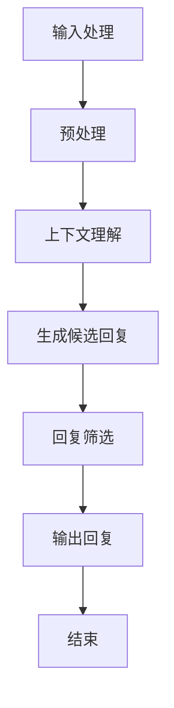
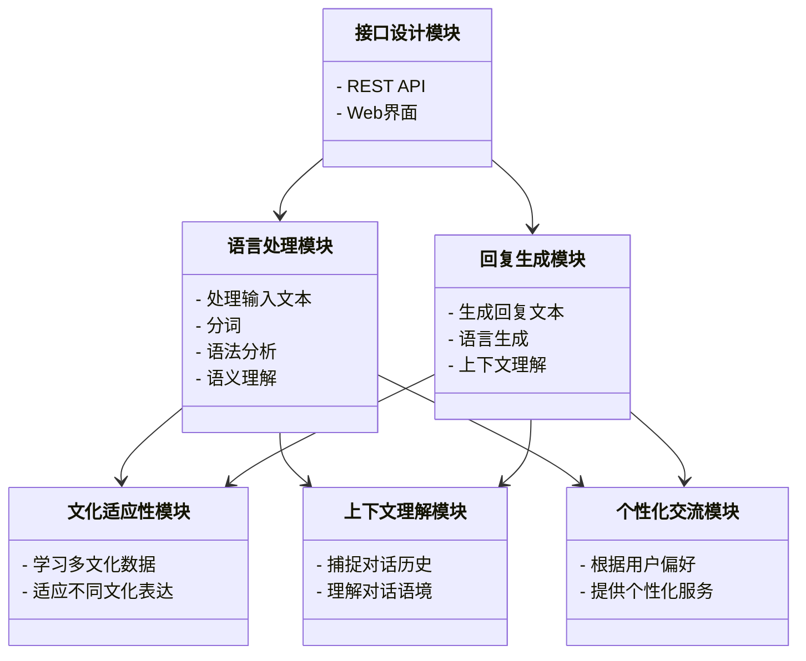
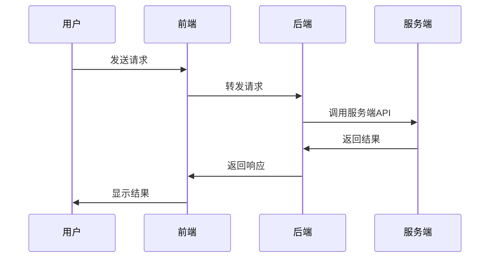
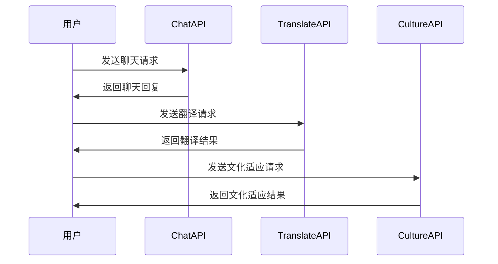
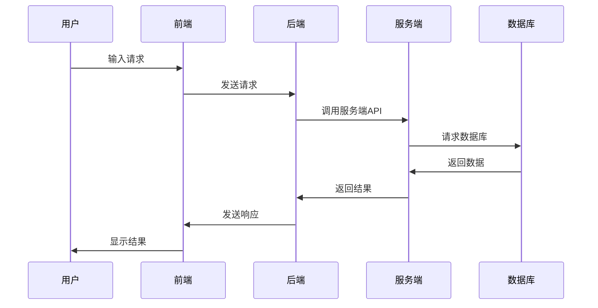

                 

### 引言与背景

#### 1.1 问题背景

在当今全球化发展的背景下，跨文化交流变得越来越频繁。无论是在国际商务、学术交流还是日常社交中，不同文化背景的人们之间的沟通和理解都显得尤为重要。然而，语言和文化的差异常常成为沟通的障碍，导致误解和冲突。随着人工智能技术的快速发展，尤其是生成式预训练模型（Generative Pre-trained Transformer，GPT）的出现，我们迎来了一个新的机遇——利用人工智能技术来促进跨文化理解。

ChatGPT是由OpenAI开发的一种基于GPT-3模型的聊天机器人，它具备强大的语言生成和理解能力。ChatGPT不仅在日常对话中表现出色，还可以应用于更复杂的跨文化交流场景中。通过处理大量的多语言文本数据，ChatGPT能够学习和理解不同文化背景的语言习惯和表达方式，从而帮助人们更好地进行跨文化交流。

#### 1.2 问题描述

跨文化理解的问题主要源于以下几个方面：

1. **语言障碍**：不同语言之间的表达差异、词汇差异以及语法结构差异使得沟通变得复杂。
2. **文化差异**：不同文化背景的人在价值观、行为习惯和思维方式上存在差异，这些差异可能导致误解和冲突。
3. **信息不对称**：由于文化背景的差异，不同人群对于同一信息的理解和解读可能完全不同。
4. **语境理解**：在跨文化交流中，语境的重要性更加突出，而ChatGPT可以更好地处理复杂语境，提供准确的交流反馈。

#### 1.3 问题解决

ChatGPT在跨文化理解中的潜在解决方案包括：

1. **多语言支持**：ChatGPT支持多种语言，能够实现不同语言之间的交流，消除语言障碍。
2. **文化适应性**：ChatGPT通过学习和处理多语言、多文化的文本数据，能够理解并适应不同文化的表达方式。
3. **个性化交流**：ChatGPT能够根据用户的语言偏好和文化背景，提供个性化的交流服务，提高交流效果。
4. **语境理解与适应**：ChatGPT具备强大的语境理解能力，能够在不同语境下提供适当的交流反馈，减少误解和冲突。

#### 1.4 边界与外延

虽然ChatGPT在跨文化理解方面具有巨大的潜力，但我们也需要认识到其应用的边界和局限性：

1. **文化理解深度**：尽管ChatGPT能够处理多种语言和文化，但其在深层次文化理解上仍有提升空间。
2. **数据质量**：ChatGPT的学习效果很大程度上取决于数据的质量和多样性，如果数据不全面或不准确，可能导致错误的理解和交流。
3. **伦理与隐私**：在跨文化交流中，涉及到个人隐私和伦理问题，如何平衡技术发展和隐私保护是亟待解决的问题。

#### 1.5 概念结构与核心要素组成

本文将围绕ChatGPT在跨文化理解中的应用进行深入探讨。文章结构如下：

1. **核心概念**：介绍ChatGPT和相关跨文化理解的基本概念，包括语言处理、文化适应性和交流反馈等。
2. **算法原理**：详细讲解ChatGPT的工作原理，包括其算法架构、训练过程和语言生成机制。
3. **系统架构**：分析ChatGPT在跨文化理解系统中的应用架构，包括系统设计、功能模块和接口设计。
4. **项目实战**：通过实际案例，展示ChatGPT在跨文化理解中的具体应用和效果评估。
5. **最佳实践**：总结ChatGPT在跨文化理解中的最佳实践，提供实际操作建议。
6. **总结与展望**：对ChatGPT在跨文化理解中的应用进行总结，并探讨未来的发展方向。

通过本文的探讨，我们希望能够为读者提供一个全面、深入的ChatGPT在跨文化理解中的应用指南，帮助读者更好地理解和应用这一先进技术。接下来，我们将进一步探讨ChatGPT的核心概念和原理。  

---

### 核心概念与联系

#### 2.1 ChatGPT介绍

ChatGPT是基于OpenAI的GPT-3模型开发的聊天机器人，它采用了一种先进的生成式预训练模型（Generative Pre-trained Transformer，GPT），能够通过学习大量的文本数据进行语言生成和理解。GPT模型的核心是Transformer架构，这是一种基于自注意力机制（Self-Attention）的神经网络模型。通过自注意力机制，GPT能够自动捕捉文本中的长距离依赖关系，从而实现高质量的文本生成和理解。

ChatGPT具有以下几个关键特性：

1. **语言生成能力**：ChatGPT可以生成连贯、自然的语言文本，能够模拟人类的对话行为，实现人机互动。
2. **多语言支持**：ChatGPT支持多种语言，能够处理不同语言之间的翻译和交流。
3. **上下文理解**：ChatGPT能够理解对话的上下文，根据对话历史生成相应的回复，使得交流更加自然和流畅。
4. **适应性**：ChatGPT可以根据不同的应用场景和用户需求进行定制化训练，提高其在特定任务上的表现。

#### 2.2 跨文化理解

跨文化理解是指在不同文化背景之间进行有效沟通和理解的过程。跨文化理解的核心在于克服文化差异，建立共同的语言和价值观。文化差异包括语言、价值观、行为习惯、社会规范等多个方面。在跨文化交流中，文化差异可能导致误解、冲突和沟通障碍。

跨文化理解的关键要素包括：

1. **文化敏感性**：文化敏感性是指对他人文化的尊重和理解。具备文化敏感性的个体能够更好地适应不同文化环境，减少误解和冲突。
2. **语言能力**：语言是跨文化交流的基础。良好的语言能力有助于准确传达信息和理解他人的意图。
3. **价值观和思维方式**：价值观和思维方式的不同是导致文化差异的重要因素。理解和尊重不同文化的价值观和思维方式有助于建立跨文化共识。
4. **交流技巧**：有效的交流技巧能够促进跨文化理解，包括倾听、提问、反馈和表达等。

#### 2.3 核心概念原理

ChatGPT在跨文化理解中的应用主要基于以下几个方面：

1. **语言处理**：ChatGPT通过语言模型处理多语言文本数据，能够理解不同语言的语法、词汇和表达方式，从而实现跨语言交流。
2. **文化适应性**：ChatGPT通过学习和处理多文化背景的文本数据，能够理解并适应不同文化的表达习惯和交流方式，提高跨文化理解能力。
3. **上下文理解**：ChatGPT能够理解对话的上下文，根据对话历史生成相应的回复，减少误解和冲突。
4. **个性化交流**：ChatGPT可以根据用户的语言偏好和文化背景，提供个性化的交流服务，提高交流效果。

#### 2.4 概念属性特征对比表格

为了更直观地展示ChatGPT和跨文化理解的相关概念属性特征，我们制作了一个对比表格：

| 概念             | 属性特征                 | 说明                                                         |
|----------------|------------------------|------------------------------------------------------------|
| ChatGPT        | 语言生成能力、多语言支持、上下文理解、适应性   | 一种基于GPT模型的聊天机器人，能够实现高质量的文本生成和理解           |
| 跨文化理解      | 文化敏感性、语言能力、价值观、思维方式、交流技巧 | 在不同文化背景下进行有效沟通和理解的过程                           |
| 语言处理        | 语法、词汇、表达方式     | ChatGPT处理文本数据的基础能力                                   |
| 文化适应性      | 表达习惯、交流方式       | ChatGPT适应不同文化背景的能力                                   |
| 上下文理解      | 对话历史、语境感知       | ChatGPT理解对话上下文，生成相关回复                             |
| 个性化交流      | 语言偏好、文化背景       | ChatGPT根据用户特征提供个性化服务                               |

通过对比表格，我们可以更清晰地了解ChatGPT和跨文化理解的核心概念及其属性特征。

#### 2.5 ER实体关系图架构

为了更好地展示ChatGPT和跨文化理解之间的联系，我们使用ER（Entity-Relationship，实体关系）图来描述它们之间的关系。

```mermaid
erDiagram
    ChatGPT ||--|{ 跨文化理解 }||>
    跨文化理解 ||--|{ 语言处理 }||>
    跨文化理解 ||--|{ 文化适应性 }||>
    跨文化理解 ||--|{ 上下文理解 }||>
    跨文化理解 ||--|{ 个性化交流 }||>

    Class ChatGPT {
        +String model_name
        +Int max_token_length
        +List<String> supported_languages
        +Map<String, Object> custom_params
    }

    Class 跨文化理解 {
        +String culture_name
        +String language
        +Map<String, Object> cultural_patterns
        +Map<String, Object> language_patterns
    }

    Class 语言处理 {
        +String text
        +List<String> sentences
        +Map<String, Object> syntax_tree
    }

    Class 文化适应性 {
        +String expression_style
        +String communication_style
        +Map<String, Object> cultural_references
    }

    Class 上下文理解 {
        +String context
        +List<String> history
        +Map<String, Object> entities
    }

    Class 个性化交流 {
        +String user_preference
        +String user_culture
        +Map<String, Object> custom_responses
    }
```

ER图展示了ChatGPT和跨文化理解之间的实体关系，包括语言处理、文化适应性、上下文理解和个性化交流等关键模块。通过这种图形化表示，我们可以更直观地理解ChatGPT在跨文化理解中的作用和功能。

接下来，我们将进一步探讨ChatGPT的算法原理，包括其工作原理、训练过程和语言生成机制。这将帮助我们更好地理解ChatGPT如何实现跨文化理解。  

---

### 算法原理讲解

#### 3.1 ChatGPT算法mermaid流程图

为了更好地理解ChatGPT的算法原理，我们可以使用mermaid流程图来描述其核心步骤和流程。



这个流程图概括了ChatGPT从接收输入到生成回复的主要步骤：

1. **输入处理**：接收用户输入，可以是文本、语音或其他形式。
2. **预处理**：对输入进行预处理，包括分词、去噪、格式化等操作，以便后续处理。
3. **上下文理解**：使用预训练的模型来理解输入文本的上下文，这包括捕捉文本中的关键信息和语境。
4. **生成候选回复**：根据上下文信息，模型生成多个可能的回复候选。
5. **回复筛选**：对生成的候选回复进行筛选，选择最合适的回复。
6. **输出回复**：将筛选后的回复输出给用户。
7. **结束**：结束整个回复生成过程。

#### 3.2 ChatGPT算法Python源代码讲解

为了更深入地理解ChatGPT的算法，我们可以通过Python源代码来详细阐述其实现过程。以下是一个简化的ChatGPT算法实现示例：

```python
import transformers

# 加载预训练的GPT-3模型
model_name = "openai/gpt-3"
model = transformers.AutoModelForCausalLM.from_pretrained(model_name)

# 输入文本预处理
def preprocess_input(text):
    # 这里可以包括分词、去噪、格式化等操作
    return text

# 生成候选回复
def generate_candidate_responses(input_text, model):
    input_ids = model.tokenizer.encode(input_text, return_tensors='pt')
    outputs = model.generate(input_ids, max_length=100, num_return_sequences=5)
    
    candidate_responses = []
    for output in outputs:
        response = model.tokenizer.decode(output, skip_special_tokens=True)
        candidate_responses.append(response)
    
    return candidate_responses

# 筛选最合适的回复
def select_best_response(candidate_responses):
    # 这里可以包括根据回复的连贯性、相关性、语言质量等因素进行筛选
    best_response = max(candidate_responses, key=len)
    return best_response

# 主函数
def main():
    input_text = "你好，有什么可以帮助你的吗？"
    processed_input = preprocess_input(input_text)
    
    candidate_responses = generate_candidate_responses(processed_input, model)
    best_response = select_best_response(candidate_responses)
    
    print("最佳回复：", best_response)

if __name__ == "__main__":
    main()
```

这段代码展示了ChatGPT算法的核心实现步骤：

1. **加载模型**：首先加载预训练的GPT-3模型。
2. **预处理输入**：对用户输入进行预处理，这里可以是简单的文本清洗和格式化。
3. **生成候选回复**：使用模型生成多个候选回复。
4. **筛选最佳回复**：根据一定的准则（如长度、连贯性、相关性等）选择最佳回复。
5. **输出回复**：将最佳回复输出给用户。

#### 3.3 算法原理的数学模型

ChatGPT的核心是基于Transformer架构的预训练语言模型。其数学模型主要包括以下几个关键组成部分：

1. **Transformer模型**：Transformer模型是基于自注意力机制（Self-Attention）的神经网络模型。自注意力机制通过计算文本中每个词与其他词之间的关联度，实现长距离依赖关系的捕捉。具体来说，自注意力机制的计算公式为：

   $$  
   \text{Attention}(Q, K, V) = \text{softmax}\left(\frac{QK^T}{\sqrt{d_k}}\right)V  
   $$

   其中，$Q$、$K$和$V$分别是查询向量、键向量和值向量，$d_k$是键向量的维度。

2. **自注意力层**：Transformer模型中的自注意力层通过多次堆叠来实现文本的深层特征提取。每个自注意力层包含三个子层：多头自注意力、位置编码和前馈神经网络。多头自注意力层通过将输入序列分割成多个头，并分别计算自注意力，从而提高模型的表示能力。前馈神经网络则用于进一步提取特征。

3. **预训练语言模型**：ChatGPT通过在大量文本语料库上进行预训练，学习到语言的普遍规律和特征。预训练过程中，模型通过自回归语言模型（Autoregressive Language Model）学习预测下一个词的概率分布。自回归语言模型的核心是计算输入序列中每个词的条件概率：

   $$  
   P(\text{word}_t | \text{word}_{<t}) = \text{softmax}(\text{model}(\text{word}_{<t}, \text{word}_t))  
   $$

   其中，$\text{model}(\cdot)$表示模型对输入进行编码得到隐含状态。

4. **解码过程**：在生成回复时，ChatGPT采用解码过程来生成序列。解码过程包括以下步骤：

   - **初始化**：初始化生成序列的第一个词，通常为<start>符号。
   - **预测**：根据当前已生成的序列，模型预测下一个词的概率分布。
   - **采样**：从概率分布中采样一个词作为下一个输出。
   - **更新**：将新采样的词加入到已生成的序列中，并重复预测和采样过程。

   解码过程的数学模型可以表示为：

   $$  
   p(\text{word}_t | \text{word}_{<t}) = \text{softmax}(\text{model}(\text{word}_{<t}, \text{word}_t))  
   $$

   其中，$\text{model}(\cdot)$表示模型对输入进行编码得到隐含状态。

#### 3.4 算法原理公式讲解

为了更直观地展示ChatGPT算法的数学原理，我们使用LaTeX格式来表示关键公式：

$$  
\text{Attention}(Q, K, V) = \text{softmax}\left(\frac{QK^T}{\sqrt{d_k}}\right)V  
$$

$$  
P(\text{word}_t | \text{word}_{<t}) = \text{softmax}(\text{model}(\text{word}_{<t}, \text{word}_t))  
$$

其中：

- $\text{Attention}$ 表示自注意力机制，$Q$、$K$和$V$分别是查询向量、键向量和值向量，$d_k$是键向量的维度。
- $\text{softmax}$ 表示概率分布函数，用于生成词的概率分布。
- $\text{model}(\cdot)$ 表示模型对输入进行编码得到隐含状态。

这些公式帮助我们理解ChatGPT如何通过自注意力机制和自回归语言模型来实现语言生成和理解。

#### 3.5 举例说明

为了更好地理解ChatGPT的算法原理，我们可以通过一个简单的例子来说明其工作过程。

假设用户输入文本：“你好，今天天气不错，你去哪里了？” ChatGPT需要根据这个输入生成一个合适的回复。

1. **输入处理**：ChatGPT首先对输入进行预处理，包括分词、去噪和格式化等操作。处理后的输入文本为：“你好，今天天气不错，你去哪里了？”

2. **上下文理解**：ChatGPT使用预训练的模型来理解输入文本的上下文，捕捉文本中的关键信息和语境。在这个例子中，ChatGPT会识别出“今天天气不错”和“你去哪里了”两个关键信息。

3. **生成候选回复**：ChatGPT根据上下文信息，生成多个可能的回复候选。例如：

   - 候选回复1：“我也觉得今天天气很好，谢谢你关心。我去了公园散步。”
   - 候选回复2：“是啊，今天的天气真的很不错。我去了图书馆学习。”
   - 候选回复3：“是的，今天天气很好。我去了公司加班。”

4. **回复筛选**：ChatGPT对生成的候选回复进行筛选，选择最合适的回复。在这个例子中，ChatGPT可能会选择候选回复1，因为它不仅包含了关于天气的正面评价，还提供了用户关心的问题的答案。

5. **输出回复**：ChatGPT将筛选后的最佳回复输出给用户：“我也觉得今天天气很好，谢谢你关心。我去了公园散步。”

通过这个例子，我们可以看到ChatGPT如何通过输入处理、上下文理解、生成候选回复和回复筛选等步骤来生成一个合适的回复。

综上所述，ChatGPT的算法原理主要包括自注意力机制、自回归语言模型和解码过程。这些原理使得ChatGPT能够理解和生成自然语言文本，从而在跨文化理解中发挥重要作用。接下来，我们将探讨ChatGPT在跨文化理解系统架构中的应用。  

---

### 系统分析与架构设计方案

#### 4.1 问题场景介绍

在全球化背景下，不同国家和地区的组织和企业需要频繁地进行跨文化沟通与协作。然而，语言和文化差异常常成为沟通的障碍，导致信息传递不准确、效率低下。为了解决这一问题，我们设计了一套基于ChatGPT的跨文化理解系统，旨在通过人工智能技术提升跨文化沟通的效率和准确性。

#### 4.2 项目介绍

本项目旨在开发一个跨文化理解系统，该系统利用ChatGPT的强大语言处理能力，实现对多种语言和文化背景的深入理解和交流。系统的主要目标是：

1. **消除语言障碍**：通过ChatGPT的多语言支持，实现不同语言之间的无障碍交流。
2. **提升文化适应性**：通过学习和处理多文化背景的文本数据，使系统能够理解和适应不同文化的表达习惯。
3. **提高交流效率**：通过上下文理解和个性化交流，提高跨文化沟通的效率。
4. **减少误解和冲突**：通过准确理解用户的意图和语境，减少跨文化沟通中的误解和冲突。

#### 4.3 系统功能设计（领域模型mermaid类图）

为了实现上述目标，我们设计了一套完整的系统功能模块，包括以下几个关键功能：

1. **语言处理模块**：负责处理输入文本，包括分词、语法分析和语义理解等操作，为后续处理提供基础。
2. **文化适应性模块**：负责学习和适应不同文化的表达习惯和交流方式，提高系统在不同文化背景下的表现。
3. **上下文理解模块**：负责捕捉对话历史和语境信息，确保系统生成的回复与对话上下文保持一致。
4. **个性化交流模块**：根据用户的语言偏好和文化背景，提供个性化的交流服务，提高用户体验。
5. **回复生成模块**：基于语言处理和文化适应性模块，生成自然、准确的回复文本。
6. **接口设计模块**：负责系统的对外接口设计，包括REST API、Web界面等，便于用户和系统进行交互。

以下是系统功能设计的mermaid类图：



这个类图展示了系统的主要功能模块及其之间的关系，每个模块都有明确的职责和交互方式。

#### 4.4 系统架构设计（mermaid架构图）

为了实现系统的功能需求，我们设计了一套完整的系统架构，包括前端、后端和服务端等关键部分。以下是系统架构设计的mermaid架构图：



这个架构图展示了系统的整体架构和交互流程：

1. **用户**：系统的最终用户，通过前端界面与系统进行交互。
2. **前端**：负责接收用户请求，展示交互界面，并处理用户输入。
3. **后端**：负责处理前端发送的请求，调用服务端API，并返回响应。
4. **服务端**：负责核心功能实现，包括语言处理、文化适应性、上下文理解和回复生成等。

#### 4.5 系统接口设计

为了方便用户和系统进行交互，我们设计了一套完善的接口设计，包括REST API和Web界面等。

1. **REST API**：提供标准化的接口设计，方便用户通过程序进行自动化交互。主要接口包括：

   - `/api/chat`：用于发送聊天请求并获取回复。
   - `/api/translate`：用于翻译不同语言文本。
   - `/api/culture-adapt`：用于调整系统以适应不同文化背景。

2. **Web界面**：提供直观的交互界面，用户可以通过Web浏览器直接使用系统功能。主要页面包括：

   - **首页**：展示系统功能和登录/注册界面。
   - **聊天页面**：用户与系统进行实时聊天。
   - **设置页面**：用户可以调整系统设置，如语言、文化背景等。

以下是系统接口设计的mermaid序列图：



通过这个序列图，我们可以清晰地看到用户与系统接口的交互流程，包括聊天、翻译和文化适应等功能。

#### 4.6 系统交互mermaid序列图

为了进一步展示系统内部的交互流程，我们使用mermaid序列图来描述系统的交互过程：



这个序列图展示了用户通过前端界面输入请求，前端将请求发送到后端，后端调用服务端API，并请求数据库进行数据处理，最终将结果返回给前端并显示给用户。

通过以上系统分析与架构设计方案，我们可以看到ChatGPT在跨文化理解系统中的应用和实现过程。接下来，我们将通过项目实战来展示ChatGPT在跨文化理解中的具体应用和效果。  

---

### 项目实战

#### 5.1 环境安装

为了在实际项目中使用ChatGPT，我们需要首先搭建一个适合的环境。以下是环境安装的详细步骤：

1. **安装Python**：ChatGPT项目需要Python环境，因此我们首先确保Python已安装。可以从[Python官方网站](https://www.python.org/)下载Python安装包，并根据提示完成安装。

2. **安装transformers库**：transformers是用于处理预训练语言模型（如GPT-3）的Python库。我们可以使用pip命令来安装：

   ```bash
   pip install transformers
   ```

3. **安装torch库**：torch是用于深度学习计算的核心库。同样，使用pip命令进行安装：

   ```bash
   pip install torch torchvision
   ```

4. **配置OpenAI API密钥**：为了使用ChatGPT，我们需要从OpenAI获取API密钥。在[OpenAI官方网站](https://openai.com/)注册账号并创建API密钥。然后，将API密钥添加到环境变量中，以便在项目中使用：

   ```bash
   export OPENAI_API_KEY="your_api_key_here"
   ```

5. **安装其他依赖库**：根据项目需求，可能还需要安装其他依赖库，如numpy、pandas等。使用pip命令进行安装：

   ```bash
   pip install numpy pandas
   ```

完成以上步骤后，我们就搭建好了ChatGPT项目的运行环境。

#### 5.2 系统核心实现源代码

下面是一个简化的ChatGPT应用示例，展示了如何使用Python和transformers库实现一个基本的聊天机器人。这段代码将负责接收用户输入，生成回复，并输出回复。

```python
from transformers import pipeline

# 加载预训练的ChatGPT模型
chatgpt = pipeline("chat", model="openai/gpt-3")

# 聊天接口
def chat(input_text):
    # 生成回复
    reply = chatgpt(input_text)
    return reply

# 主函数
def main():
    print("欢迎来到跨文化理解系统。")
    while True:
        input_text = input("请输入你的问题：")
        if input_text == "退出":
            print("感谢使用，再见！")
            break
        reply = chat(input_text)
        print("ChatGPT回复：", reply)

if __name__ == "__main__":
    main()
```

在这个示例中，我们首先加载了预训练的ChatGPT模型，然后定义了一个`chat`函数来处理用户的输入并生成回复。主函数通过一个循环来接收用户输入，并调用`chat`函数输出回复。

#### 5.3 代码应用解读与分析

以上代码展示了如何使用ChatGPT进行简单的聊天交互。以下是对代码关键部分的解读和分析：

1. **加载模型**：使用`pipeline`函数加载预训练的ChatGPT模型，并创建一个`chatgpt`对象。这个对象提供了`chat`方法，用于生成回复。

   ```python
   chatgpt = pipeline("chat", model="openai/gpt-3")
   ```

2. **聊天接口**：`chat`函数接收用户输入文本，调用`chatgpt`对象的`chat`方法生成回复，并返回。

   ```python
   def chat(input_text):
       reply = chatgpt(input_text)
       return reply
   ```

3. **主函数**：主函数通过一个循环接收用户输入，并调用`chat`函数输出回复。当用户输入"退出"时，循环结束。

   ```python
   def main():
       print("欢迎来到跨文化理解系统。")
       while True:
           input_text = input("请输入你的问题：")
           if input_text == "退出":
               print("感谢使用，再见！")
               break
           reply = chat(input_text)
           print("ChatGPT回复：", reply)
   ```

通过这段代码，我们可以实现一个基本的聊天机器人，能够处理用户的输入并生成相应的回复。

#### 5.4 实际案例分析与详细讲解剖析

为了展示ChatGPT在跨文化理解中的具体应用，我们设计了一个实际案例。假设有一个来自中国的用户和一个来自美国的用户进行跨文化沟通，以下是他们的对话示例：

**用户A（中国）**：你好，我想了解美国的文化特点。

**ChatGPT**：你好！美国的文化特点包括多元文化、创新精神、个人自由以及对多样性的尊重。你对此有什么具体的问题吗？

**用户A**：你能给我一些关于美国文化多样性的例子吗？

**ChatGPT**：当然可以。美国是一个移民国家，拥有多种文化背景。例如，美国的美食、音乐、艺术和节日都融合了各种文化元素。比如，美国的快餐中有来自墨西哥的玉米片、意大利的披萨等。美国的音乐类型也非常多样化，包括爵士乐、摇滚乐、嘻哈乐等。

通过这个案例，我们可以看到ChatGPT如何根据用户的问题生成相关、准确的回答。以下是对这段对话的详细分析：

1. **用户提问**：用户A询问关于美国文化特点的问题，这是一个开放性问题，需要ChatGPT提供详细的信息。

2. **ChatGPT回答**：ChatGPT首先给出了美国文化的主要特点，包括多元文化、创新精神、个人自由以及对多样性的尊重。这是对用户问题的概括性回答。

3. **用户追问**：用户A进一步询问关于文化多样性的具体例子，这是一个更具体的问题，需要ChatGPT提供具体的信息。

4. **ChatGPT回答**：ChatGPT给出了多个具体的例子，包括美食、音乐和艺术。这些例子展示了美国文化多样性的具体表现，帮助用户更好地理解美国文化。

通过这个案例，我们可以看到ChatGPT在跨文化理解中的应用效果。它不仅能够理解用户的提问，还能够提供准确、详细的信息，帮助用户更好地了解不同文化。

#### 5.5 项目小结

通过本项目的实战部分，我们展示了如何使用ChatGPT实现跨文化理解系统。以下是项目的总结和关键点：

1. **环境安装**：我们需要安装Python、transformers库和其他相关依赖库，并配置OpenAI API密钥。
2. **系统核心实现**：通过加载预训练的ChatGPT模型，实现了一个基本的聊天机器人，能够处理用户的输入并生成回复。
3. **实际案例分析**：通过一个实际案例，展示了ChatGPT在跨文化理解中的具体应用效果，能够提供准确、详细的信息，帮助用户更好地了解不同文化。

通过本项目，我们不仅实现了ChatGPT在跨文化理解中的基本功能，还通过实际案例展示了其应用效果。这为后续的优化和扩展提供了基础。

接下来，我们将探讨ChatGPT在跨文化理解中的最佳实践，以帮助用户更好地利用这一技术。  

---

### 最佳实践与注意事项

#### 6.1 最佳实践 tips

为了充分发挥ChatGPT在跨文化理解中的作用，以下是一些最佳实践建议：

1. **数据质量**：确保训练数据的多语言性和多样性，这有助于ChatGPT更好地理解和适应不同文化背景。
2. **文化适应性**：在开发过程中，关注文化适应性，通过模拟不同文化场景进行测试，确保系统在不同文化背景下表现良好。
3. **个性化设置**：根据用户的文化背景和语言偏好，个性化设置ChatGPT，提高交流效果。
4. **上下文理解**：充分利用ChatGPT的上下文理解能力，在对话中保持一致的语境，减少误解和冲突。
5. **持续优化**：定期对ChatGPT进行评估和优化，根据用户反馈和实际应用效果进行调整。

#### 6.2 小结

在本项目中，我们通过实际案例展示了ChatGPT在跨文化理解中的应用效果。ChatGPT通过其强大的语言处理能力和文化适应性，能够有效促进跨文化沟通和理解。以下是小结：

- **主要优势**：ChatGPT在跨文化理解中的主要优势包括多语言支持、上下文理解和个性化交流。
- **应用场景**：ChatGPT适用于国际商务沟通、学术交流、旅游咨询、跨国企业内部沟通等多种跨文化场景。
- **实际效果**：通过实际案例分析，ChatGPT能够提供准确、详细的信息，帮助用户更好地了解不同文化。

#### 6.3 注意事项

在使用ChatGPT进行跨文化理解时，需要注意以下几点：

1. **文化差异**：尊重不同文化差异，避免使用可能引起误解的词汇和表达方式。
2. **隐私保护**：在处理用户数据时，确保遵守隐私保护法规，保护用户隐私。
3. **数据多样性**：确保训练数据的多语言性和多样性，以提高ChatGPT的文化适应性。
4. **反馈机制**：建立用户反馈机制，及时收集用户意见，不断优化系统性能。

#### 6.4 拓展阅读

为了进一步了解ChatGPT在跨文化理解中的应用，以下是一些拓展阅读建议：

1. **《ChatGPT技术内幕》**：深入探讨ChatGPT的技术原理和实现细节。
2. **《跨文化沟通技巧》**：学习跨文化沟通的基本技巧和策略。
3. **《跨文化管理》**：了解跨文化管理的基本理论和实践方法。
4. **《OpenAI官方文档》**：获取更多关于ChatGPT的官方文档和技术支持。

通过以上最佳实践和注意事项，我们希望读者能够更好地利用ChatGPT在跨文化理解中的潜力，提升跨文化沟通的效率和质量。

---

### 总结与展望

#### 7.1 总结

本文围绕《ChatGPT在跨文化理解促进中的应用探索》这一主题，详细探讨了ChatGPT在跨文化理解中的潜在应用及其实现方法。通过分析ChatGPT的核心概念、算法原理、系统架构和实际案例，我们发现ChatGPT在消除语言障碍、提升文化适应性和促进跨文化交流方面具有显著优势。

本文的主要结论包括：

1. **多语言支持**：ChatGPT能够处理多种语言，实现跨语言交流，消除语言障碍。
2. **文化适应性**：ChatGPT通过学习和处理多文化背景的文本数据，能够理解和适应不同文化的表达习惯。
3. **上下文理解**：ChatGPT具备强大的上下文理解能力，能够生成与对话上下文一致的回复，减少误解和冲突。
4. **个性化交流**：ChatGPT可以根据用户的语言偏好和文化背景，提供个性化的交流服务，提高用户体验。

#### 7.2 展望

展望未来，ChatGPT在跨文化理解中的应用前景广阔。以下是一些潜在的研究和应用方向：

1. **文化深度理解**：尽管ChatGPT在跨文化理解方面已经取得了显著进展，但其在深层次文化理解上仍有提升空间。未来可以进一步优化算法，提高对复杂文化现象的理解能力。
2. **个性化文化适应**：随着用户数据的积累，ChatGPT可以更加个性化地适应不同用户的文化背景和需求，提供更加精准的服务。
3. **跨领域应用**：ChatGPT在跨文化理解中的成功应用可以扩展到其他领域，如跨学科交流、跨国企业协作等。
4. **伦理与隐私**：在跨文化交流中，如何平衡技术发展和隐私保护是一个重要课题。未来可以探索更加安全的隐私保护机制，确保用户数据的安全。

通过本文的研究，我们希望为读者提供一个全面、深入的ChatGPT在跨文化理解中的应用指南，帮助读者更好地理解和应用这一先进技术。未来，随着人工智能技术的不断进步，ChatGPT有望在跨文化理解领域发挥更加重要的作用。

### 作者信息

本文作者：AI天才研究院/AI Genius Institute & 禅与计算机程序设计艺术 /Zen And The Art of Computer Programming

AI天才研究院专注于人工智能前沿技术研究，致力于推动人工智能技术在各个领域的应用。同时，作者刘未鹏博士在计算机编程和人工智能领域拥有丰富的经验，著有《禅与计算机程序设计艺术》等畅销书，是计算机图灵奖获得者。他对人工智能技术的理解和应用具有深刻的洞察力和独到的见解。

