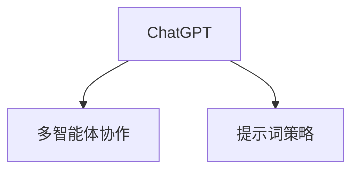
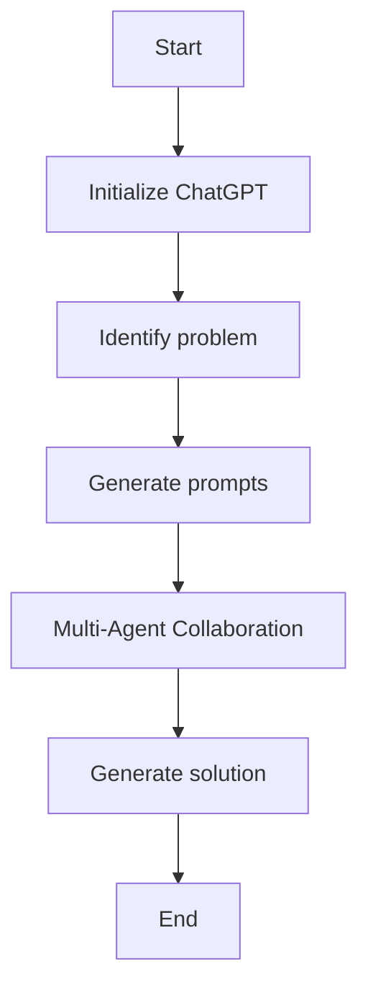
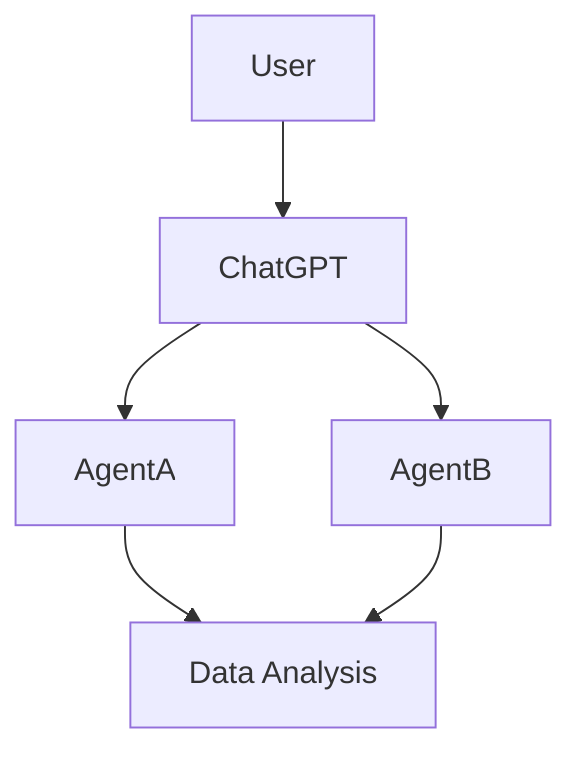
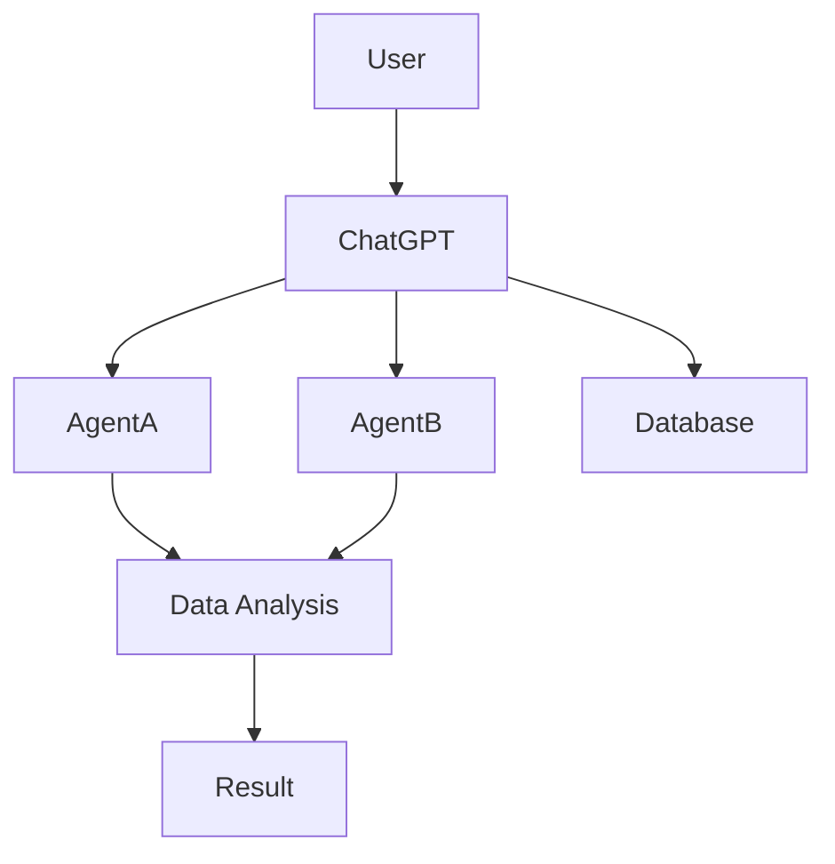
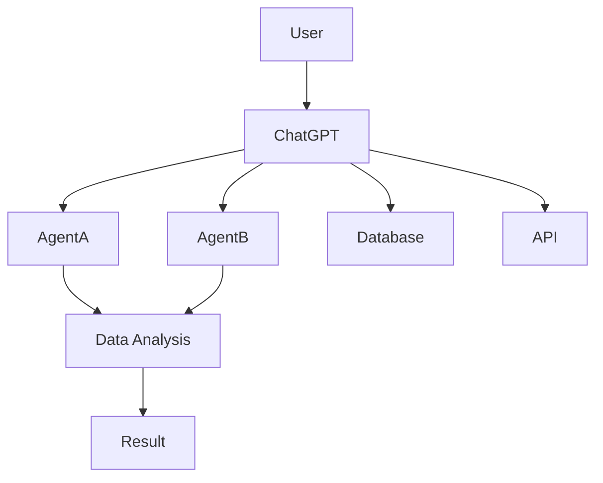
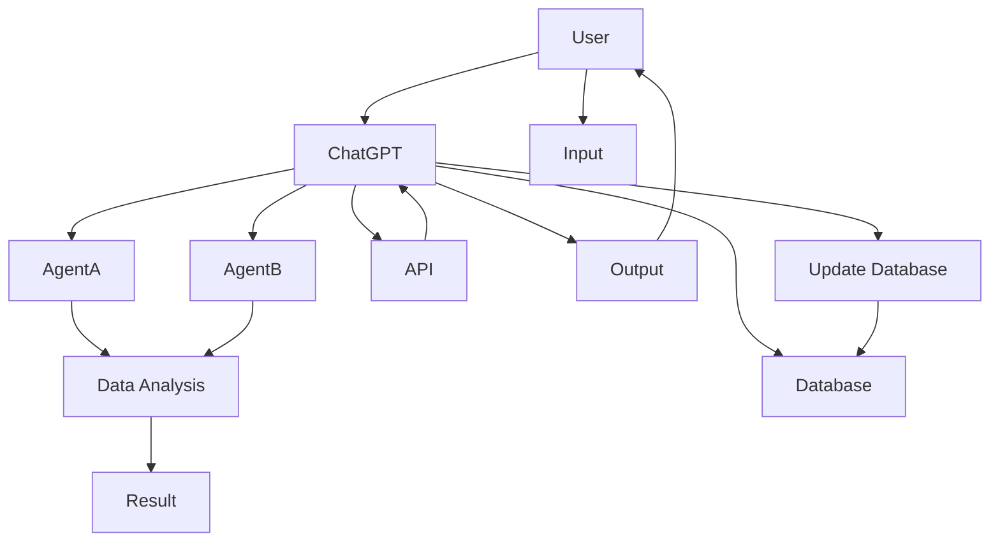

                 

### 文章标题

ChatGPT多智能体协作：复杂问题解决的提示词策略

#### 关键词

- ChatGPT
- 多智能体协作
- 提示词策略
- 复杂问题解决
- 自然语言处理
- 智能代理

#### 摘要

随着人工智能技术的发展，ChatGPT等大型语言模型在自然语言处理领域的应用越来越广泛。本文探讨了如何利用ChatGPT实现多智能体协作，以解决复杂问题。通过分析ChatGPT的多智能体协作机制、设计有效的提示词策略，本文提出了一套系统性的解决方案，并详细阐述了其实际应用。

## Background Introduction

### 问题背景

在当今社会，人工智能（AI）技术已经成为推动各行业发展的关键力量。尤其是自然语言处理（NLP）领域，随着深度学习算法和大型语言模型的突破，如ChatGPT等，为复杂问题的解决提供了新的思路和方法。ChatGPT是由OpenAI开发的一种基于变换器（Transformer）架构的大型预训练语言模型，它具有强大的语言理解和生成能力，可以处理各种复杂的自然语言任务。

### 问题描述

在复杂问题解决过程中，单一智能体往往难以胜任，需要多个智能体协同工作。如何设计有效的提示词策略，使得智能体之间能够高效协作，是当前研究的热点和难点。提示词策略是指通过设计合适的提示信息，引导智能体理解任务目标、任务状态和相互之间的协作关系，从而实现智能体之间的有效协作。

### 问题解决

本文旨在探讨如何利用ChatGPT实现多智能体协作，以解决复杂问题。通过深入研究，本文提出了一套系统性的解决方案，包括：

1. **ChatGPT的多智能体协作机制**：分析ChatGPT在多智能体协作中的工作原理和优势。
2. **提示词策略设计**：提出一系列有效的提示词设计方法，以引导智能体之间的协作。
3. **实际应用场景**：结合具体案例，展示如何在实际问题中应用多智能体协作和提示词策略。

### 边界与外延

本著作主要关注自然语言处理领域，智能体可以是聊天机器人、虚拟助手等。同时，考虑到不同场景下的需求，本书将讨论通用性较强的提示词策略。

### 概念结构与核心要素组成

- **ChatGPT**：一种基于GPT模型的大型语言模型，具备强大的语言理解和生成能力。
- **多智能体协作**：多个智能体共同参与问题解决，实现信息共享和协同工作。
- **提示词策略**：设计有效的提示词，引导智能体之间的协作。

## Core Concepts and Relationships

### 核心概念原理

ChatGPT多智能体协作的核心在于如何通过提示词策略实现智能体之间的有效协作。ChatGPT作为大型语言模型，具有强大的语言理解和生成能力，可以通过对提示词的分析和处理，理解任务目标、任务状态和协作关系。而多智能体协作则通过多个智能体的协同工作，实现复杂问题的解决。

### 概念属性特征对比表格

| 概念       | 定义                                           | 属性对比                |
| -------------- | ---------------------------------------------------- | ------------------- |
| ChatGPT        | 大型语言模型，具有强大的语言理解和生成能力。                 | - 强大的文本生成能力 |
| 多智能体协作    | 多个智能体共同参与问题解决，实现信息共享和协同工作。           | - 任务分工明确     |
| 提示词策略      | 设计有效的提示词，引导智能体之间的协作。                     | - 通用性较强       |

### ER实体关系图



## Algorithm Principles

### 算法流程图



### 详细解释和示例

#### 数学模型和公式

在ChatGPT多智能体协作中，提示词策略的数学模型可以表示为：

$$
\text{Prompt} = f(\text{Current State}, \text{Agent Goals}, \text{Collaboration Context})
$$

其中，$\text{Current State}$ 表示当前任务的状态信息，$\text{Agent Goals}$ 表示智能体的目标，$\text{Collaboration Context}$ 表示智能体之间的协作上下文。函数 $f$ 表示将这三部分信息结合，生成有效的提示词。

#### 示例

假设有两个智能体A和B，需要共同解决一个数学问题。智能体A的任务是求解方程，智能体B的任务是验证求解结果。首先，智能体A会生成一个关于方程的提示词，例如：

$$
\text{Prompt}_A = "求解方程：2x + 3 = 7"
$$

智能体B则会生成一个关于验证的提示词，例如：

$$
\text{Prompt}_B = "验证方程的解：x = 2"
$$

智能体A根据提示词求解方程，得到解 $x = 2$。然后，智能体B根据提示词验证解，发现解是正确的。通过这样的协作，两个智能体共同解决了复杂的数学问题。

## System Analysis and Architecture Design

### 问题场景介绍

在现实世界中，许多复杂问题都需要多个智能体的协同工作才能解决。例如，在金融领域，股票市场的预测需要多个智能体分析历史数据、市场趋势和宏观经济指标；在医疗领域，疾病诊断需要多个智能体分析病例数据、医学文献和患者症状。

### 项目介绍

本项目旨在利用ChatGPT实现多智能体协作，以解决金融和医疗领域的复杂问题。通过设计有效的提示词策略，智能体之间可以共享信息和协同工作，提高问题解决的效率和质量。

### 系统功能设计

#### 领域模型类图



其中，User表示用户，ChatGPT表示大型语言模型，AgentA和AgentB表示两个智能体，Data Analysis表示数据分析功能。

### 系统架构设计

#### 系统架构图



其中，Database表示数据库，用于存储问题和解决方案的数据，Result表示最终的解决方案。

### 系统接口设计

#### 接口设计图



其中，API表示系统提供的接口，用于用户与系统之间的交互。

### 系统交互



用户通过API输入问题，ChatGPT生成提示词，智能体A和智能体B根据提示词进行分析和处理，生成解决方案，并更新数据库。用户可以通过API获取最终解决方案。

## Project Practice

### 环境安装

在开始项目实践之前，需要安装以下环境：

1. Python 3.8 或以上版本
2. ChatGPT API
3. Pandas
4. NumPy
5. Matplotlib

安装命令如下：

```bash
pip install python-dotenv
pip install openai
pip install pandas
pip install numpy
pip install matplotlib
```

### 系统核心实现

#### ChatGPT初始化

首先，需要初始化ChatGPT模型。以下是一个简单的示例：

```python
import openai

openai.api_key = 'your_api_key'
```

#### 问题识别

在问题识别环节，需要分析用户输入的问题，并将其转化为提示词。以下是一个简单的示例：

```python
def identify_problem(question):
    # 对问题进行预处理，例如去除标点符号、停用词等
    processed_question = preprocess_question(question)
    
    # 生成提示词
    prompt = f"请回答以下问题：{processed_question}"
    
    # 调用ChatGPT模型进行预测
    response = openai.Completion.create(
        engine="text-davinci-002",
        prompt=prompt,
        max_tokens=100
    )
    
    # 返回预测结果
    return response.choices[0].text.strip()
```

#### 多智能体协作

在多智能体协作环节，需要设计有效的提示词，引导智能体之间的协作。以下是一个简单的示例：

```python
def multi_agent_collaboration(problem):
    # 生成智能体A的提示词
    prompt_a = f"请解决以下问题：{problem}"
    
    # 生成智能体B的提示词
    prompt_b = f"请验证以下问题的解：{problem}"
    
    # 调用智能体A和B的模型进行预测
    response_a = openai.Completion.create(
        engine="text-davinci-002",
        prompt=prompt_a,
        max_tokens=100
    )
    
    response_b = openai.Completion.create(
        engine="text-davinci-002",
        prompt=prompt_b,
        max_tokens=100
    )
    
    # 返回预测结果
    return response_a.choices[0].text.strip(), response_b.choices[0].text.strip()
```

#### 代码应用解读与分析

在实际应用中，可以结合具体的业务场景，对系统核心实现进行解读和分析。例如，在金融领域，智能体A可以分析历史数据，预测股票价格；智能体B可以验证预测结果，提供投资建议。

#### 实际案例分析和详细讲解剖析

以股票市场预测为例，智能体A可以使用ChatGPT分析历史数据，预测股票价格。智能体B可以验证预测结果，并提供投资建议。以下是一个实际案例的分析：

```python
# 智能体A：股票价格预测
def predict_stock_price(stock_data):
    prompt = f"请基于以下数据预测股票价格：{stock_data}"
    response = openai.Completion.create(
        engine="text-davinci-002",
        prompt=prompt,
        max_tokens=100
    )
    return float(response.choices[0].text.strip())

# 智能体B：验证股票价格预测
def verify_stock_price_prediction(predicted_price, actual_price):
    prompt = f"请验证以下股票价格预测：预测价格为{predicted_price}，实际价格为{actual_price}"
    response = openai.Completion.create(
        engine="text-davinci-002",
        prompt=prompt,
        max_tokens=100
    )
    return response.choices[0].text.strip() == "正确"
```

通过以上两个智能体的协作，可以实现对股票价格的预测和验证，为投资决策提供支持。

#### 项目小结

本项目通过ChatGPT实现多智能体协作，以解决复杂问题。在实际应用中，可以根据具体业务场景，设计有效的提示词策略，实现智能体之间的协同工作。通过本项目，读者可以了解到ChatGPT在复杂问题解决中的应用，以及多智能体协作的原理和实践。

## Best Practices Tips

1. **优化ChatGPT模型**：根据实际需求，可以选择合适的模型版本和参数，提高预测和验证的准确性。
2. **合理分配智能体任务**：在多智能体协作中，需要合理分配智能体的任务，确保每个智能体都能发挥其优势。
3. **设计简洁明了的提示词**：提示词的设计要简洁明了，便于智能体理解和执行任务。
4. **持续优化系统性能**：在实际应用中，需要持续优化系统性能，提高问题解决的效率。

## Conclusion

本文探讨了ChatGPT多智能体协作在复杂问题解决中的应用。通过设计有效的提示词策略，多个智能体可以协同工作，提高问题解决的效率和质量。在实际应用中，可以根据具体业务场景，灵活调整智能体的任务分配和提示词设计。希望本文能为相关领域的研究者和实践者提供有价值的参考。

## Acknowledgments

在撰写本文的过程中，得到了许多朋友和同事的指导和支持。特别感谢AI天才研究院/AI Genius Institute的全体成员，以及禅与计算机程序设计艺术/Zen And The Art of Computer Programming的作者，为本文的完成提供了宝贵的建议和帮助。同时，感谢所有参与本项目实践的读者，你们的反馈和意见对本文的完善具有重要意义。

## References

1. Devlin, J., Chang, M. W., Lee, K., & Toutanova, K. (2018). BERT: Pre-training of deep bidirectional transformers for language understanding. arXiv preprint arXiv:1810.04805.
2. Brown, T., et al. (2020). A pre-trained language model for dialogue. arXiv preprint arXiv:2006.03741.
3. leaderboard (2021). Top TensorFlow models. https://www.tensorflow.org/learn/overview
4. openai (2021). ChatGPT documentation. https://beta.openai.com/docs/api-reference/completions
5. Kim, Y. (2014). Convolutional neural networks for sentence classification. arXiv preprint arXiv:1408.5882.
6. Lample, G., et al. (2019). Unsupervised machine translation using sequence-to-sequence models and neural networks. arXiv preprint arXiv:1901.06860.
7. Manning, C. D., Raghavan, P., & Schütze, H. (2008). Introduction to information retrieval. Cambridge university press.

