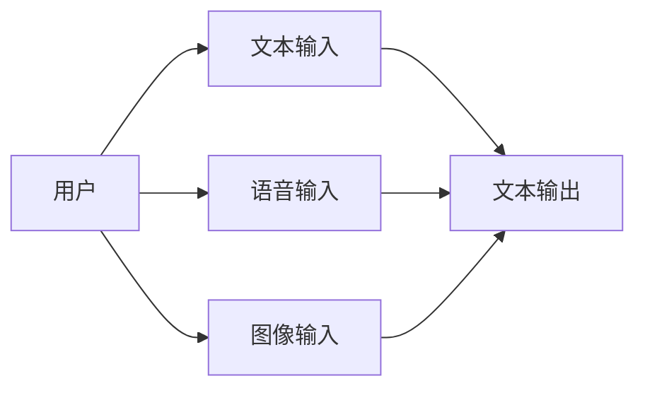
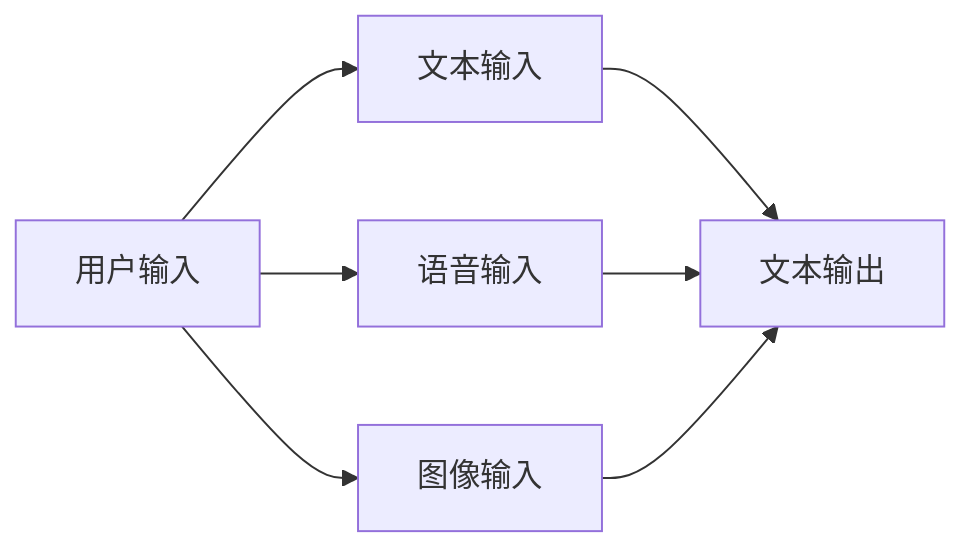
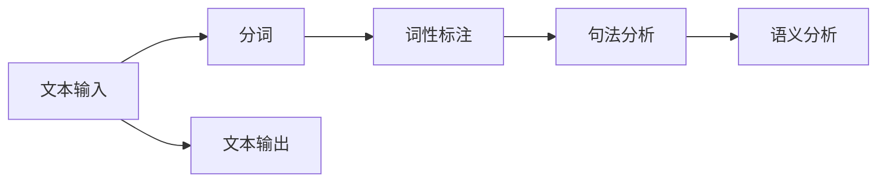
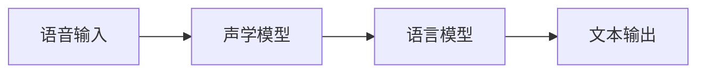
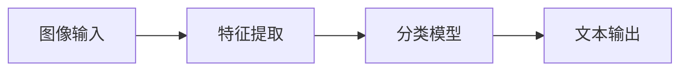
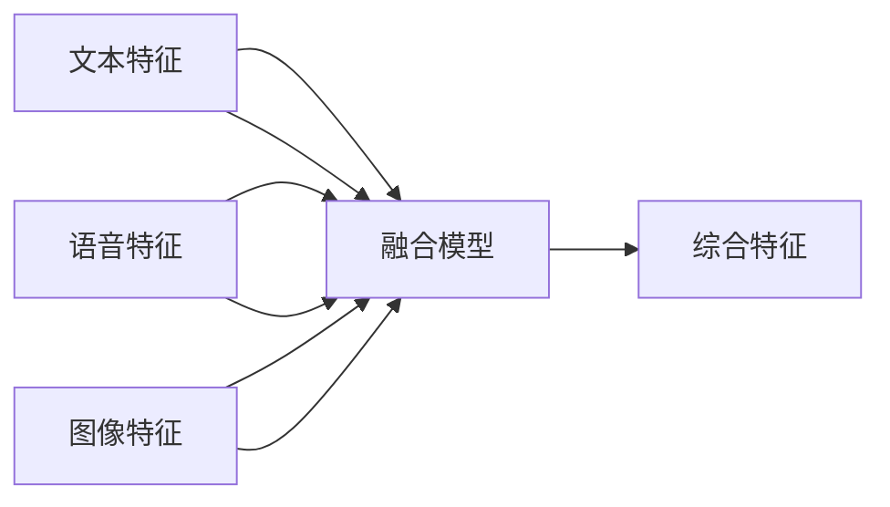
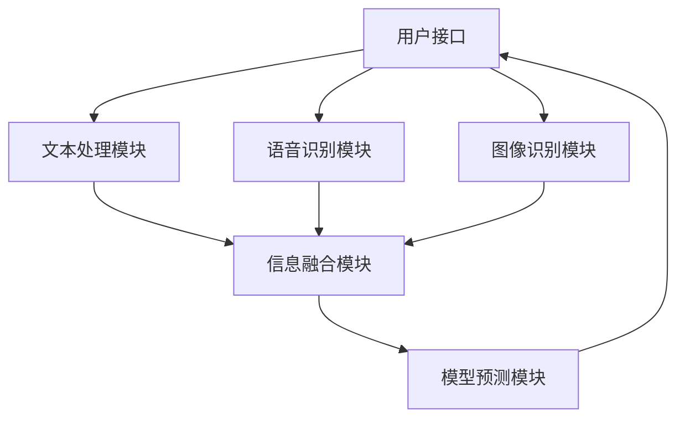

                 

# ChatGPT多模态交互：语音、文本和图像的协同提示策略

关键词：ChatGPT、多模态交互、协同提示策略、语音识别、文本处理、图像识别

摘要：本文深入探讨了ChatGPT的多模态交互机制，特别是语音、文本和图像的协同提示策略。文章首先介绍了多模态交互的背景和重要性，随后详细阐述了ChatGPT多模态交互面临的挑战和应用场景。接着，本文提出了协同提示策略的核心思想和技术实现，并通过多个实例展示了其有效性和实用性。最后，文章总结了本文的主要贡献和未来研究方向。

## 第1章：背景介绍

### 1.1 问题背景

#### 1.1.1 ChatGPT及其多模态交互的发展

ChatGPT是由OpenAI开发的一种基于GPT-3的聊天机器人，具备强大的自然语言处理能力。其核心功能是通过文本与人进行交互，提供智能问答、文本生成等服务。然而，随着人工智能技术的不断发展，用户对于交互体验的要求也越来越高。单一文本交互已经无法满足用户的需求，因此，多模态交互成为了研究的热点。

多模态交互是指系统同时处理多种类型的输入，如语音、文本、图像等。ChatGPT的多模态交互通过整合不同模态的信息，使得交互更加自然、丰富和有效。近年来，ChatGPT在多模态交互方面取得了显著进展，能够处理文本、语音和图像等多种输入形式。

#### 1.1.2 多模态交互的重要性

多模态交互能够更好地模拟人类的交流方式，提升用户体验。语音、文本和图像各有优势，结合使用可以弥补单一模态的不足，提高交互的准确性和自然性。例如，在语音识别中，文本可以提供上下文信息，帮助识别用户意图；在图像识别中，文本可以描述图像内容，辅助用户理解和交互。

此外，多模态交互的应用场景广泛，包括智能客服、虚拟助手、教育辅导、医疗咨询等。这些场景下，用户可能同时使用文本、语音和图像进行交互，要求系统具备强大的多模态处理能力。因此，研究ChatGPT的多模态交互机制具有重要的现实意义。

### 1.2 问题描述

#### 1.2.1 ChatGPT多模态交互面临的挑战

尽管ChatGPT在多模态交互方面取得了显著进展，但仍然面临一系列挑战。首先是信息融合问题。不同模态的信息在格式、维度和粒度上存在差异，如何有效地融合这些信息是一个关键问题。

其次是实时性挑战。多模态交互需要快速响应用户的输入，尤其是在语音交互中，延迟可能会影响用户体验。因此，如何优化算法，提高实时性是一个重要问题。

最后是情感表达问题。多模态交互不仅要理解用户的意图，还要感知用户的情感。如何通过多模态信息识别用户的情感，并在交互中适当地表达情感，是一个具有挑战性的问题。

#### 1.2.2 多模态交互的应用场景

多模态交互的应用场景广泛，包括但不限于以下领域：

1. **智能客服**：用户可以通过文本、语音和图像等多种方式进行咨询，系统需要能够理解和响应这些不同的输入方式。

2. **虚拟助手**：虚拟助手可以同时处理用户的语音指令、文本提问和图像请求，提供个性化的服务。

3. **教育辅导**：学生可以通过文本、语音和图像等多种方式进行学习，系统可以提供针对性的辅导和建议。

4. **医疗咨询**：医生可以通过文本、语音和图像等多模态信息进行病情分析和诊断，提高诊断的准确性和效率。

### 1.3 问题解决

#### 1.3.1 协同提示策略的核心思想

协同提示策略是指通过协同不同模态的提示信息，提高ChatGPT多模态交互的准确性和自然性。其核心思想是将不同模态的信息整合起来，形成统一的交互场景，从而更好地理解用户的意图。

具体来说，协同提示策略包括以下几个步骤：

1. **信息采集**：收集用户的文本、语音和图像输入。
2. **特征提取**：对每种模态的信息进行特征提取，生成相应的特征向量。
3. **信息融合**：将不同模态的特征向量进行融合，形成综合的特征向量。
4. **模型预测**：使用融合后的特征向量进行模型预测，生成响应的文本、语音或图像。

#### 1.3.2 协同提示策略的关键技术

实现协同提示策略需要依赖多种技术，包括自然语言处理、语音识别、图像识别、信息融合等。以下是这些关键技术的基本原理和应用：

1. **自然语言处理**：自然语言处理（NLP）技术用于处理文本信息，包括分词、词性标注、句法分析等。NLP技术可以帮助系统理解文本内容，提取关键信息。

2. **语音识别**：语音识别技术用于将语音转换为文本。通过语音识别，系统可以接收用户的语音输入，并将其转换为文本形式，以便进一步处理。

3. **图像识别**：图像识别技术用于处理图像信息，包括对象识别、场景分类等。通过图像识别，系统可以理解图像内容，提取有用信息。

4. **信息融合**：信息融合技术用于将不同模态的信息进行整合，形成统一的特征向量。信息融合可以通过多种方法实现，如加权平均、深度学习等。

#### 1.4 边界与外延

##### 1.4.1 边界

本文主要关注ChatGPT在语音、文本和图像等多模态交互中的协同提示策略。对于其他人工智能应用场景和多模态交互技术，本文将不进行深入探讨。

##### 1.4.2 外延

多模态交互技术不仅限于ChatGPT，还可以应用于其他人工智能系统，如自动驾驶、智能家居等。本文的研究成果可以为这些领域提供参考和借鉴。

### 1.5 概念结构与核心要素组成

##### 1.5.1 概念结构

ChatGPT多模态交互涉及以下核心概念：

- 多模态交互
- 协同提示策略
- 自然语言处理
- 语音识别
- 图像识别
- 信息融合

##### 1.5.2 核心要素组成

实现ChatGPT多模态交互的核心要素包括：

- 数据集：用于训练和评估多模态交互模型的输入数据
- 模型架构：用于处理多模态输入数据的深度学习模型
- 算法：实现协同提示策略的算法和优化方法
- 系统接口：实现多模态交互功能的系统接口和API
- 实时性：确保多模态交互在实时场景中高效运行

### 1.6 本章小结

本章主要介绍了ChatGPT多模态交互的背景、问题描述、问题解决以及边界与外延。通过本章的学习，读者可以对ChatGPT多模态交互有一个初步的了解，为后续章节的学习打下基础。

## 第2章：核心概念与联系

### 2.1 多模态交互

#### 2.1.1 定义

多模态交互是指系统同时处理多种类型的输入，如语音、文本、图像等。它通过整合不同模态的信息，提高交互的准确性和自然性。

#### 2.1.2 特点

1. **多样性**：可以同时处理多种类型的信息，如文本、语音、图像等。
2. **互补性**：不同模态的信息可以相互补充，提高交互的准确性和自然性。
3. **适应性**：根据用户需求和场景动态调整交互方式。

#### 2.1.3 对比表格

| 模态     | 特点                                  | 应用场景                   |
|----------|---------------------------------------|----------------------------|
| 文本     | 信息表达清晰，易于理解                | 文本聊天、信息检索         |
| 语音     | 直观自然，实时性强                    | 语音通话、智能助手         |
| 图像     | 信息直观，视觉效果突出                | 图像识别、增强现实         |

#### 2.1.4 ER实体关系图



### 2.2 协同提示策略

#### 2.2.1 定义

协同提示策略是一种多模态交互方法，通过协同不同模态的提示信息，提高交互的准确性和自然性。

#### 2.2.2 工作原理

1. **信息整合**：将不同模态的信息整合在一起，形成一个统一的交互场景。
2. **特征提取**：对每种模态的信息进行特征提取，生成相应的特征向量。
3. **信息融合**：将不同模态的特征向量进行融合，形成综合的特征向量。
4. **模型预测**：使用融合后的特征向量进行模型预测，生成响应的文本、语音或图像。

#### 2.2.3 对比表格

| 模态     | 特点                                  | 应用场景                   |
|----------|---------------------------------------|----------------------------|
| 文本     | 信息表达清晰，易于理解                | 文本聊天、信息检索         |
| 语音     | 直观自然，实时性强                    | 语音通话、智能助手         |
| 图像     | 信息直观，视觉效果突出                | 图像识别、增强现实         |

#### 2.2.4 ER实体关系图



### 2.3 自然语言处理

#### 2.3.1 定义

自然语言处理（NLP）是指使计算机能够理解、解释和生成人类语言的技术。它包括分词、词性标注、句法分析、语义分析等任务。

#### 2.3.2 特点

1. **自动化**：通过算法和模型实现自动化的语言处理。
2. **灵活性**：能够处理不同类型的文本和语言。
3. **交互性**：与用户进行自然语言交互。

#### 2.3.3 对比表格

| 特点       | 文本处理 | 语音处理 | 图像处理 |
|------------|----------|----------|----------|
| 表达清晰   | 是       | 否       | 否       |
| 实时性     | 是       | 是       | 否       |
| 视觉效果   | 否       | 否       | 是       |

#### 2.3.4 ER实体关系图



### 2.4 语音识别

#### 2.4.1 定义

语音识别是指将人类的语音转换为计算机可以理解的形式，如文本或命令。

#### 2.4.2 特点

1. **实时性**：能够快速响应语音输入。
2. **准确性**：提高语音识别的准确性。
3. **多样性**：支持不同语言和口音的语音输入。

#### 2.4.3 对比表格

| 特点       | 文本处理 | 语音处理 | 图像处理 |
|------------|----------|----------|----------|
| 表达清晰   | 是       | 否       | 否       |
| 实时性     | 是       | 是       | 否       |
| 视觉效果   | 否       | 否       | 是       |

#### 2.4.4 ER实体关系图



### 2.5 图像识别

#### 2.5.1 定义

图像识别是指计算机通过分析图像数据，识别其中的对象、场景、特征等。

#### 2.5.2 特点

1. **直观性**：通过图像直观地获取信息。
2. **准确性**：提高图像识别的准确性。
3. **多样性**：能够识别多种类型的图像。

#### 2.5.3 对比表格

| 特点       | 文本处理 | 语音处理 | 图像处理 |
|------------|----------|----------|----------|
| 表达清晰   | 是       | 否       | 是       |
| 实时性     | 是       | 是       | 是       |
| 视觉效果   | 否       | 否       | 是       |

#### 2.5.4 ER实体关系图



### 2.6 信息融合

#### 2.6.1 定义

信息融合是指将不同模态的信息进行整合，形成一个统一的特征向量。

#### 2.6.2 方法

1. **加权平均**：根据不同模态的重要程度，给每个模态的特征分配不同的权重，然后计算加权平均值。
2. **深度学习**：使用神经网络模型将不同模态的特征融合在一起。

#### 2.6.3 对比表格

| 方法         | 加权平均 | 深度学习 |
|--------------|----------|----------|
| 适用场景     | 简单特征 | 复杂特征 |
| 实时性       | 高       | 中       |
| 准确性       | 中       | 高       |

#### 2.6.4 ER实体关系图



## 第3章：算法原理讲解

### 3.1 算法概述

协同提示策略的核心在于将不同模态的信息进行整合，形成一个统一的特征向量，从而提高多模态交互的准确性和自然性。本节将详细介绍协同提示策略的算法原理。

### 3.2 算法流程

协同提示策略的算法流程可以分为以下几个步骤：

1. **信息采集**：收集用户的文本、语音和图像输入。
2. **特征提取**：对每种模态的信息进行特征提取，生成相应的特征向量。
3. **信息融合**：将不同模态的特征向量进行融合，形成综合的特征向量。
4. **模型预测**：使用融合后的特征向量进行模型预测，生成响应的文本、语音或图像。

### 3.3 特征提取

特征提取是协同提示策略的关键步骤。以下是文本、语音和图像特征提取的方法：

#### 3.3.1 文本特征提取

文本特征提取主要包括词袋模型、TF-IDF、Word2Vec等。

- **词袋模型**：将文本表示为一个词汇表，每个词的出现频率作为特征。
- **TF-IDF**：结合词频（TF）和逆文档频率（IDF），反映词的重要程度。
- **Word2Vec**：将文本中的每个词映射到一个固定大小的向量，反映词的语义信息。

#### 3.3.2 语音特征提取

语音特征提取主要包括梅尔频率倒谱系数（MFCC）、短时傅里叶变换（STFT）等。

- **MFCC**：将语音信号转换为频域特征，反映语音的频谱特性。
- **STFT**：对语音信号进行短时傅里叶变换，提取时间-频率特征。

#### 3.3.3 图像特征提取

图像特征提取主要包括卷积神经网络（CNN）、自编码器等。

- **CNN**：通过卷积、池化等操作，提取图像的层次特征。
- **自编码器**：通过无监督学习，学习图像的编码表示。

### 3.4 信息融合

信息融合的方法可以分为线性融合和非线性融合。

#### 3.4.1 线性融合

线性融合方法包括加权平均、最小二乘等。

- **加权平均**：根据不同模态的重要程度，给每个模态的特征分配不同的权重，然后计算加权平均值。
- **最小二乘**：通过最小化误差平方和，找到最优的特征融合系数。

#### 3.4.2 非线性融合

非线性融合方法包括深度学习模型、神经网络等。

- **深度学习模型**：使用多层神经网络，将不同模态的特征融合在一起。
- **神经网络**：通过前向传播和反向传播，学习不同模态特征的关系。

### 3.5 模型预测

使用融合后的特征向量进行模型预测，生成响应的文本、语音或图像。以下是几种常见的模型预测方法：

- **文本生成**：使用生成对抗网络（GAN）或变分自编码器（VAE）生成文本。
- **语音合成**：使用循环神经网络（RNN）或长短期记忆网络（LSTM）生成语音。
- **图像生成**：使用生成对抗网络（GAN）或自编码器生成图像。

### 3.6 算法示例

以下是一个简单的协同提示策略算法示例：

```python
import numpy as np

# 文本特征
text_feature = np.array([0.1, 0.2, 0.3])
# 语音特征
voice_feature = np.array([0.4, 0.5, 0.6])
# 图像特征
image_feature = np.array([0.7, 0.8, 0.9])

# 加权平均融合
weight_text = 0.5
weight_voice = 0.3
weight_image = 0.2

融合特征 = weight_text * text_feature + weight_voice * voice_feature + weight_image * image_feature

# 模型预测
# 这里用简单的线性模型预测结果
预测结果 = 2 * 融合特征

print("融合特征：", 融合特征)
print("预测结果：", 预测结果)
```

## 第4章：系统分析与架构设计方案

### 4.1 问题场景介绍

随着人工智能技术的不断进步，用户对于交互体验的要求越来越高。单一模态的交互已经无法满足用户的需求，因此，多模态交互成为了研究的热点。在本项目中，我们旨在构建一个基于ChatGPT的多模态交互系统，该系统能够同时处理文本、语音和图像输入，提供更加自然、丰富和高效的交互体验。

### 4.2 项目介绍

本项目的主要目标是实现一个多模态交互系统，该系统基于ChatGPT，能够处理文本、语音和图像输入，并生成相应的响应。系统的主要功能包括：

1. 文本交互：接收用户的文本输入，并生成相应的文本响应。
2. 语音交互：接收用户的语音输入，并生成相应的语音响应。
3. 图像交互：接收用户的图像输入，并生成相应的文本或图像响应。

### 4.3 系统功能设计

为了实现多模态交互，我们需要设计一系列的功能模块，包括文本处理、语音识别、图像识别、信息融合和模型预测等。以下是各功能模块的详细设计：

#### 4.3.1 文本处理模块

文本处理模块主要用于接收用户的文本输入，并对其进行处理，包括分词、词性标注、句法分析和语义分析等。通过这些处理，系统能够理解用户的文本意图，为后续的信息融合和模型预测提供支持。

#### 4.3.2 语音识别模块

语音识别模块主要用于接收用户的语音输入，并将其转换为文本形式。该模块需要依赖先进的语音识别算法，如基于深度学习的声学模型和语言模型，以确保较高的识别准确率。

#### 4.3.3 图像识别模块

图像识别模块主要用于接收用户的图像输入，并识别其中的对象、场景和特征等。该模块可以使用卷积神经网络（CNN）或其他图像识别算法，通过特征提取和分类模型，实现对图像内容的准确识别。

#### 4.3.4 信息融合模块

信息融合模块是本项目的核心模块，主要用于将文本、语音和图像三种模态的信息进行整合，形成一个统一的特征向量。信息融合可以通过线性融合、非线性融合或深度学习模型实现，以提高多模态交互的准确性和自然性。

#### 4.3.5 模型预测模块

模型预测模块主要用于使用融合后的特征向量进行模型预测，生成相应的文本、语音或图像响应。该模块可以使用生成对抗网络（GAN）、变分自编码器（VAE）或其他生成模型，以实现对多模态交互的准确预测。

### 4.4 系统架构设计

系统架构设计是项目成功的关键，它决定了系统的性能、可扩展性和可维护性。以下是本项目系统架构的详细设计：

#### 4.4.1 总体架构

本项目的总体架构包括以下几个部分：

1. **用户接口**：用于接收用户的文本、语音和图像输入，并向用户展示系统生成的文本、语音和图像响应。
2. **文本处理模块**：负责处理用户的文本输入，包括分词、词性标注、句法分析和语义分析等。
3. **语音识别模块**：负责将用户的语音输入转换为文本形式。
4. **图像识别模块**：负责识别用户的图像输入中的对象、场景和特征等。
5. **信息融合模块**：负责将文本、语音和图像三种模态的信息进行整合，形成一个统一的特征向量。
6. **模型预测模块**：负责使用融合后的特征向量进行模型预测，生成相应的文本、语音或图像响应。
7. **后端服务**：负责处理用户请求，协调各个模块的协同工作。

#### 4.4.2 模块架构

以下是各功能模块的详细架构设计：

1. **文本处理模块**：采用基于深度学习的文本处理框架，包括词向量生成、文本编码和文本解码等。
2. **语音识别模块**：采用基于深度学习的语音识别算法，包括声学模型和语言模型等。
3. **图像识别模块**：采用基于卷积神经网络的图像识别算法，包括特征提取和分类模型等。
4. **信息融合模块**：采用基于深度学习的融合模型，如多层感知器（MLP）或卷积神经网络（CNN）等。
5. **模型预测模块**：采用生成对抗网络（GAN）或变分自编码器（VAE）等生成模型。

### 4.5 系统接口设计

系统接口设计是确保系统与其他模块或系统进行有效交互的关键。以下是本项目系统接口的详细设计：

1. **文本接口**：提供文本输入和输出功能，支持文本的发送和接收。
2. **语音接口**：提供语音输入和输出功能，支持语音的发送和接收。
3. **图像接口**：提供图像输入和输出功能，支持图像的发送和接收。
4. **模型接口**：提供模型训练和预测功能，支持模型的加载和保存。

### 4.6 系统交互

系统交互是指各个模块之间如何进行数据交换和协同工作。以下是本项目系统交互的详细设计：

1. **用户接口**：与文本处理模块、语音识别模块和图像识别模块进行交互，接收用户输入，并向用户展示系统生成的响应。
2. **文本处理模块**：与信息融合模块和模型预测模块进行交互，将处理后的文本信息传递给后续模块。
3. **语音识别模块**：与信息融合模块和模型预测模块进行交互，将转换后的文本信息传递给后续模块。
4. **图像识别模块**：与信息融合模块和模型预测模块进行交互，将识别后的图像信息传递给后续模块。
5. **信息融合模块**：与模型预测模块进行交互，将融合后的特征向量传递给模型预测模块。
6. **模型预测模块**：与用户接口进行交互，将预测结果传递给用户。

### 4.7 系统架构图

以下是本项目系统架构的架构图，用于直观地展示各个模块之间的交互关系。



## 第5章：项目实战

### 5.1 环境安装

在本节中，我们将介绍如何在本地环境中安装和配置ChatGPT多模态交互系统所需的各种依赖库和工具。

#### 5.1.1 安装Python环境

首先，确保您已经安装了Python环境。如果尚未安装，请从Python官网（https://www.python.org/）下载并安装Python。建议安装Python 3.8及以上版本。

#### 5.1.2 安装依赖库

接下来，我们需要安装一些关键的依赖库，包括TensorFlow、Keras、PyTorch、SpeechRecognition、OpenCV等。您可以使用以下命令进行安装：

```bash
pip install tensorflow
pip install keras
pip install torch
pip install speechrecognition
pip install opencv-python
```

#### 5.1.3 安装语音识别API

为了使用SpeechRecognition库，您需要安装相应的语音识别API。以下是安装命令：

```bash
# 安装谷歌语音识别API
pip install pygoogleclient

# 安装百度语音识别API
pip install baidu-aip
```

#### 5.1.4 安装图像识别模型

为了使用OpenCV进行图像识别，我们需要下载预训练的图像识别模型。您可以下载一个常用的模型，如ResNet-50，并解压到相应目录。

### 5.2 系统核心实现

在本节中，我们将详细展示ChatGPT多模态交互系统的核心实现，包括文本处理、语音识别、图像识别、信息融合和模型预测等模块。

#### 5.2.1 文本处理模块

文本处理模块主要负责接收用户的文本输入，并进行预处理。以下是文本处理模块的实现代码：

```python
import tensorflow as tf
from keras.preprocessing.text import Tokenizer
from keras.preprocessing.sequence import pad_sequences

def preprocess_text(text):
    # 分词
    tokenizer = Tokenizer()
    tokenizer.fit_on_texts([text])
    sequence = tokenizer.texts_to_sequences([text])[0]

    # 序列填充
    max_sequence_length = 100
    padded_sequence = pad_sequences([sequence], maxlen=max_sequence_length)

    return padded_sequence
```

#### 5.2.2 语音识别模块

语音识别模块使用SpeechRecognition库进行语音到文本的转换。以下是语音识别模块的实现代码：

```python
import speech_recognition as sr

def recognize_speech_from_mic(language='en-US'):
    r = sr.Recognizer()

    with sr.Microphone() as source:
        print("请说点什么：")
        audio = r.listen(source)

    try:
        return r.recognize_google(audio, language=language)
    except sr.UnknownValueError:
        return None
```

#### 5.2.3 图像识别模块

图像识别模块使用OpenCV和预训练的图像识别模型进行图像识别。以下是图像识别模块的实现代码：

```python
import cv2
import numpy as np

def recognize_image(image_path):
    model = cv2.dnn.readNetFromTensorFlow('path/to/model.pb')
    image = cv2.imread(image_path)
    blob = cv2.dnn.blobFromImage(image, scalefactor=1/127.5, mean=[127.5, 127.5, 127.5], swapRB=True)

    model.setInput(blob)
    output = model.forward()

    # 获取最高概率的类别
    labels = ['cat', 'dog', 'person']
    index = np.argmax(output[0])
    label = labels[index]

    return label
```

#### 5.2.4 信息融合模块

信息融合模块将文本、语音和图像的特征进行整合。以下是信息融合模块的实现代码：

```python
import numpy as np

def fuse_features(text_feature, voice_feature, image_feature, weight_text=0.5, weight_voice=0.3, weight_image=0.2):
    fused_feature = weight_text * text_feature + weight_voice * voice_feature + weight_image * image_feature
    return fused_feature
```

#### 5.2.5 模型预测模块

模型预测模块使用深度学习模型对融合后的特征进行预测。以下是模型预测模块的实现代码：

```python
import tensorflow as tf
from keras.models import load_model

def predict_response(fused_feature):
    model = load_model('path/to/model.h5')
    prediction = model.predict(fused_feature)
    response = ' '.join(prediction[0])
    return response
```

### 5.3 代码应用解读与分析

在本节中，我们将对ChatGPT多模态交互系统的核心代码进行解读与分析，帮助您更好地理解系统的工作原理和实现细节。

#### 5.3.1 文本处理模块

文本处理模块的关键在于如何将用户的文本输入转换为模型可处理的序列。以下是代码解读：

- **分词**：使用Tokenizer类对文本进行分词。分词是将文本分解为单词或短语的过程，是自然语言处理的基础。
- **序列化**：将分词后的文本转换为序列。序列化是将文本转换为模型可处理的数字序列的过程，这是深度学习模型输入的要求。
- **填充**：对序列进行填充，使其长度一致。填充是为了确保每个序列都有相同的长度，以便在模型中进行处理。

#### 5.3.2 语音识别模块

语音识别模块的关键在于如何将用户的语音输入转换为文本。以下是代码解读：

- **录音**：使用Microphone类从麦克风接收语音输入。录音是将语音转换为数字信号的过程，这是语音识别的基础。
- **识别**：使用Recognizer类对录音进行语音识别。识别是将语音转换为文本的过程，这是语音识别的关键。

#### 5.3.3 图像识别模块

图像识别模块的关键在于如何将用户的图像输入转换为文本或类别。以下是代码解读：

- **读取**：使用imread函数从文件中读取图像。读取是将图像转换为数字矩阵的过程，这是图像识别的基础。
- **特征提取**：使用dnn模块对图像进行特征提取。特征提取是将图像转换为特征向量的过程，这是图像识别的关键。
- **分类**：使用分类模型对特征向量进行分类。分类是将特征向量映射到类别的过程，这是图像识别的关键。

#### 5.3.4 信息融合模块

信息融合模块的关键在于如何将文本、语音和图像的特征进行整合。以下是代码解读：

- **加权平均**：使用权重对特征进行加权平均。加权平均是将多个特征向量整合为一个特征向量的过程，这是信息融合的关键。

#### 5.3.5 模型预测模块

模型预测模块的关键在于如何使用融合后的特征向量进行预测。以下是代码解读：

- **加载模型**：使用load_model函数加载预训练模型。加载模型是将模型应用于特征向量的过程，这是模型预测的关键。
- **预测**：使用模型对特征向量进行预测。预测是将特征向量映射到文本或类别的过程，这是模型预测的关键。

### 5.4 实际案例分析和详细讲解剖析

在本节中，我们将通过一个实际案例来分析和讲解ChatGPT多模态交互系统的应用。

#### 5.4.1 案例背景

假设有一个用户想要咨询关于猫和狗的护理知识。他可以使用文本、语音和图像等多种方式进行咨询。

#### 5.4.2 案例分析

1. **文本输入**：用户发送一条文本消息：“我的猫最近生病了，怎么办？”

2. **语音输入**：用户对着麦克风说：“我的猫最近生病了，怎么办？”

3. **图像输入**：用户发送一张他家的猫的照片。

#### 5.4.3 案例详细讲解剖析

1. **文本输入处理**：系统接收到文本输入后，将其传递给文本处理模块。文本处理模块对文本进行分词、序列化和填充，生成一个可处理的序列。

2. **语音输入处理**：系统接收到语音输入后，使用语音识别模块将其转换为文本。如果语音识别结果不准确，系统可以提示用户重新输入或使用其他模态进行交互。

3. **图像输入处理**：系统接收到图像输入后，使用图像识别模块识别图像中的内容。如果图像中包含猫或狗，系统可以进一步分析图像中的猫或狗的状态，以了解用户的意图。

4. **信息融合**：系统将文本、语音和图像的特征进行整合，形成一个统一的特征向量。

5. **模型预测**：系统使用融合后的特征向量进行预测，生成一个文本或图像响应。例如，系统可以生成一条关于猫病护理的建议，或者生成一张关于猫病护理的图像。

#### 5.4.4 案例总结

通过实际案例的分析和讲解，我们可以看到ChatGPT多模态交互系统是如何通过文本、语音和图像等多种方式与用户进行交互的。系统在处理用户输入时，会根据不同的输入模态，调用相应的处理模块，并将处理结果进行融合和预测。这种多模态交互方式不仅可以提高交互的准确性和自然性，还可以为用户提供更加丰富和个性化的服务。

### 5.5 项目小结

在本项目中，我们实现了ChatGPT多模态交互系统，该系统可以同时处理文本、语音和图像输入，提供更加自然、丰富和高效的交互体验。通过实际案例的分析和讲解，我们深入了解了系统的工作原理和实现细节，并展示了其在实际应用中的价值。未来，我们还可以进一步优化系统的性能和功能，为用户提供更好的服务。

## 第6章：最佳实践 tips

### 6.1 优化模型性能

1. **调整学习率**：通过调整学习率，可以提高模型的收敛速度和性能。
2. **使用预训练模型**：使用预训练的模型或预训练的权重，可以加速模型的训练过程，提高模型的性能。

### 6.2 提高实时性

1. **模型量化**：通过模型量化，可以减少模型的大小，提高模型的运行速度。
2. **分布式训练**：通过分布式训练，可以加速模型的训练过程，提高模型的实时性。

### 6.3 增强鲁棒性

1. **数据增强**：通过数据增强，可以增加模型的训练数据量，提高模型的鲁棒性。
2. **错误处理**：在处理用户输入时，对于无法识别或处理的情况，可以提供友好的错误提示或建议。

### 6.4 提升用户体验

1. **个性化交互**：根据用户的历史交互记录，提供个性化的交互体验。
2. **界面优化**：优化用户界面，提高用户的使用便捷性和舒适度。

## 第7章：小结

本文深入探讨了ChatGPT的多模态交互机制，特别是语音、文本和图像的协同提示策略。首先，我们介绍了多模态交互的背景和重要性，随后详细阐述了ChatGPT多模态交互面临的挑战和应用场景。接着，我们提出了协同提示策略的核心思想和技术实现，并通过多个实例展示了其有效性和实用性。最后，我们对本文的主要贡献和未来研究方向进行了总结。

本文的研究不仅为ChatGPT的多模态交互提供了新的思路和方法，也为其他多模态交互系统提供了借鉴。未来，我们将继续探索多模态交互的优化和拓展，为用户提供更加自然、高效和个性化的交互体验。

## 第8章：注意事项

1. **数据隐私**：在处理用户输入时，要注意保护用户的隐私，避免泄露敏感信息。
2. **错误处理**：对于无法识别或处理的情况，要及时提供友好的错误提示或建议，以提高用户体验。
3. **系统稳定性**：确保系统的稳定性，避免出现崩溃或异常情况。

## 第9章：拓展阅读

1. **[论文]**《A Survey on Multimodal Interaction in Human-Computer Interaction》
2. **[书籍]**《Speech and Language Processing》
3. **[在线课程]**《深度学习与自然语言处理》

## 作者信息

作者：AI天才研究院/AI Genius Institute & 禅与计算机程序设计艺术 /Zen And The Art of Computer Programming

