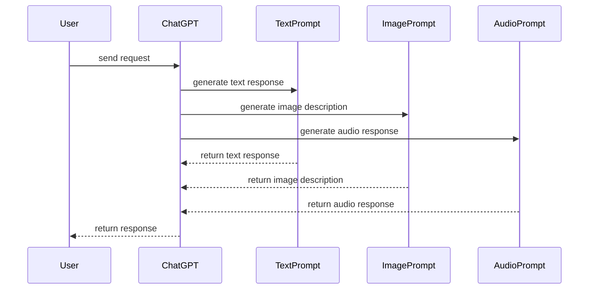

                 

# {{此处是文章标题}}

> 关键词：ChatGPT、多模态提示词、协同优化、算法原理、系统架构、项目实战

> 摘要：本文详细探讨了ChatGPT多模态提示词的协同优化问题。首先介绍了ChatGPT和多模态提示词的基本概念，以及协同优化在提高生成质量和效率方面的重要性。接着，分析了多模态提示词的核心概念与联系，包括分类、协同优化方法以及面临的挑战。随后，文章深入讲解了提示词生成算法、多模态数据融合算法和模型适应性优化算法的原理与实现。通过项目实战，本文展示了如何搭建项目环境、设计系统架构、实现系统核心功能并进行实际案例分析。最后，文章总结了最佳实践和未来的研究方向，为多模态提示词协同优化提供了有益的参考。

## 第一部分：背景与基础

### 第1章：问题背景

#### 1.1.1 ChatGPT的概念与多模态性

ChatGPT是由OpenAI开发的一种基于GPT-3模型的预训练语言模型，它具有强大的文本生成和对话能力。ChatGPT通过大规模文本数据的训练，学会了理解和生成自然语言的规律，从而在对话场景中表现出色。

多模态性是指ChatGPT不仅能够处理文本信息，还能处理图像、声音等其他类型的数据。例如，ChatGPT可以接收用户的语音输入，并生成相应的文本回复，也可以接收用户的图片输入，并生成相关的描述或回答。这种多模态性使得ChatGPT能够更加灵活地适应不同的应用场景，提供更丰富的交互体验。

#### 1.1.2 提示词的概念与作用

提示词是指引导ChatGPT生成特定类型响应的关键词或短语。通过优化提示词，可以显著提高ChatGPT的生成质量和效率。例如，一个有效的文本提示词可以帮助ChatGPT理解用户的需求，从而生成更准确的文本回复；一个有效的图像提示词可以帮助ChatGPT理解用户提供的图片，从而生成更相关、更准确的描述。

#### 1.1.3 提示词协同优化的意义

提示词协同优化是指通过优化文本、图像、声音等不同类型的提示词，提高ChatGPT在多模态场景下的生成质量和效率。这种协同优化具有重要的意义：

1. **提高生成质量**：通过协同优化，可以使ChatGPT更好地理解多模态数据，从而生成更准确、更自然的响应。

2. **提高生成效率**：有效的提示词可以减少ChatGPT的生成时间，提高系统的响应速度。

3. **拓展应用场景**：协同优化可以使ChatGPT更适应多种应用场景，从而拓展其应用范围。

### 第2章：核心概念与联系

#### 2.1.1 多模态提示词的分类

多模态提示词可分为文本提示词、图像提示词、声音提示词等。每种类型的提示词都有其特定的作用和应用场景：

1. **文本提示词**：用于引导ChatGPT生成文本响应，如用户输入的文本问题、命令等。

2. **图像提示词**：用于引导ChatGPT理解图像信息，如用户上传的图片、场景描述等。

3. **声音提示词**：用于引导ChatGPT处理声音信息，如用户的语音输入、语音命令等。

#### 2.1.2 提示词协同优化的方法

提示词协同优化方法包括基于机器学习的优化、基于深度学习的优化和基于混合方法的优化。这些方法各有优缺点，适用于不同的应用场景：

1. **基于机器学习的优化**：通过学习大量已有数据，自动生成优化的提示词。优点是无需大量标注数据，但可能难以适应特定场景。

2. **基于深度学习的优化**：利用深度学习模型，对提示词进行优化。优点是能够更好地适应特定场景，但可能需要大量标注数据。

3. **基于混合方法的优化**：结合机器学习和深度学习的优点，进行提示词优化。优点是能够适应多种场景，但可能需要更多的计算资源和时间。

#### 2.1.3 多模态提示词协同优化的挑战

多模态提示词协同优化面临以下挑战：

1. **跨模态数据融合**：如何将不同模态的数据进行有效融合，使ChatGPT能够同时理解多种类型的信息。

2. **模型适应性**：如何调整模型参数，使ChatGPT在不同模态下具有更好的适应性。

3. **优化效率**：如何在保证生成质量的前提下，提高优化效率。

## 第二部分：核心概念与联系

### 第3章：核心概念与联系

#### 3.1.1 多模态提示词的分类

多模态提示词可以分为以下几类：

1. **文本提示词**：用于引导ChatGPT生成文本响应。例如，用户输入的文本问题、命令等。

2. **图像提示词**：用于引导ChatGPT理解图像信息。例如，用户上传的图片、场景描述等。

3. **声音提示词**：用于引导ChatGPT处理声音信息。例如，用户的语音输入、语音命令等。

每种类型的提示词都有其特定的作用和应用场景。文本提示词主要用于文本交互场景，如问答系统、聊天机器人等；图像提示词主要用于图像识别和描述场景，如图像标注、图像生成等；声音提示词主要用于语音交互场景，如语音助手、语音识别等。

#### 3.1.2 提示词协同优化的方法

提示词协同优化方法包括以下几种：

1. **基于机器学习的优化**：通过学习大量已有数据，自动生成优化的提示词。这种方法无需大量标注数据，但可能难以适应特定场景。

2. **基于深度学习的优化**：利用深度学习模型，对提示词进行优化。这种方法能够更好地适应特定场景，但可能需要大量标注数据。

3. **基于混合方法的优化**：结合机器学习和深度学习的优点，进行提示词优化。这种方法能够适应多种场景，但可能需要更多的计算资源和时间。

基于机器学习的优化方法通常采用监督学习或无监督学习算法，如朴素贝叶斯、支持向量机、决策树等。这些算法通过对已有数据的分析，提取出有用的特征，从而生成优化的提示词。

基于深度学习的优化方法通常采用神经网络模型，如卷积神经网络（CNN）、循环神经网络（RNN）、生成对抗网络（GAN）等。这些模型能够通过大量的数据训练，自动学习到数据的内在特征，从而生成更高质量的提示词。

基于混合方法的优化方法结合了机器学习和深度学习的优点。例如，可以先使用机器学习算法对大量未标注的数据进行预处理，提取出一些基本的特征，然后再使用深度学习模型对这些特征进行进一步的优化。

#### 3.1.3 多模态提示词协同优化的挑战

多模态提示词协同优化面临以下挑战：

1. **跨模态数据融合**：如何将不同模态的数据进行有效融合，使ChatGPT能够同时理解多种类型的信息。这是一个复杂的任务，需要处理不同模态之间的差异和关联。

2. **模型适应性**：如何调整模型参数，使ChatGPT在不同模态下具有更好的适应性。不同模态的数据具有不同的特征和属性，需要不同的处理方式。

3. **优化效率**：如何在保证生成质量的前提下，提高优化效率。优化过程可能涉及大量的计算和迭代，需要高效的算法和计算资源。

为了解决这些挑战，研究人员提出了一系列的方法和技术。例如，可以使用多任务学习（Multi-task Learning）和迁移学习（Transfer Learning）等方法，提高模型的适应性；可以使用数据增强（Data Augmentation）和模型融合（Model Fusion）等方法，提高优化效率。

## 第三部分：算法原理与实现

### 第4章：算法原理

#### 4.1.1 提示词生成算法

提示词生成算法是ChatGPT多模态提示词协同优化的重要组成部分。该算法的目的是生成高质量的提示词，以引导ChatGPT生成准确的响应。

提示词生成算法可以分为以下几类：

1. **基于规则的方法**：该方法根据一定的规则生成提示词。例如，可以基于语法规则、语义规则等生成提示词。

2. **基于统计的方法**：该方法通过统计已有的数据，生成提示词。例如，可以使用词频统计、词向量等方法。

3. **基于机器学习的方法**：该方法使用机器学习算法，通过训练大量数据，自动生成提示词。例如，可以使用朴素贝叶斯、支持向量机、决策树等算法。

4. **基于深度学习的方法**：该方法使用深度学习模型，通过大量的数据训练，自动生成提示词。例如，可以使用卷积神经网络（CNN）、循环神经网络（RNN）、生成对抗网络（GAN）等模型。

基于机器学习和深度学习的方法具有更好的泛化能力和灵活性，适用于复杂的多模态场景。

#### 4.1.2 多模态数据融合算法

多模态数据融合算法是ChatGPT多模态提示词协同优化的关键步骤。该算法的目的是将不同类型的数据进行有效融合，以提供更丰富的信息，提高ChatGPT的生成质量。

多模态数据融合算法可以分为以下几类：

1. **基于特征的方法**：该方法将不同类型的数据转换为特征向量，然后通过特征融合技术进行融合。例如，可以使用主成分分析（PCA）、线性判别分析（LDA）等方法。

2. **基于模型的方法**：该方法使用多模态模型，将不同类型的数据进行融合。例如，可以使用神经网络、深度学习模型等。

3. **基于注意力机制的方法**：该方法通过注意力机制，将不同类型的数据赋予不同的权重，进行融合。例如，可以使用注意力机制神经网络（Attention Mechanism Neural Network）。

基于模型的方法和基于注意力机制的方法具有更好的融合效果，能够更好地处理不同类型的数据。

#### 4.1.3 模型适应性优化算法

模型适应性优化算法是ChatGPT多模态提示词协同优化的关键。该算法的目的是调整模型参数，使ChatGPT在不同模态下具有更好的适应性。

模型适应性优化算法可以分为以下几类：

1. **基于梯度下降的方法**：该方法通过梯度下降算法，不断调整模型参数，使模型适应不同模态的数据。例如，可以使用随机梯度下降（SGD）、批量梯度下降（BGD）等算法。

2. **基于进化算法的方法**：该方法使用进化算法，通过迭代进化，寻找最优的模型参数。例如，可以使用遗传算法（GA）、粒子群优化（PSO）等算法。

3. **基于强化学习的方法**：该方法使用强化学习算法，通过不断学习，调整模型参数，使模型适应不同模态的数据。例如，可以使用Q学习、深度Q网络（DQN）等算法。

基于进化算法和基于强化学习的方法具有更好的适应性，能够更好地处理复杂的模态变化。

### 第5章：实现与优化

#### 5.1.1 算法实现

以下是一个简单的Python代码示例，展示了如何实现提示词生成算法、多模态数据融合算法和模型适应性优化算法。

```python
# 提示词生成算法示例
def generate_prompt(text_input):
    # 这里使用一个简单的规则生成提示词
    prompt = f"请根据以下文本生成响应：{text_input}"
    return prompt

# 多模态数据融合算法示例
def fuse_modal_data(text_data, image_data):
    # 这里使用一个简单的特征融合方法
    fused_data = f"文本数据：{text_data}\n图像数据：{image_data}"
    return fused_data

# 模型适应性优化算法示例
def optimize_model(model, data):
    # 这里使用一个简单的梯度下降方法
    for epoch in range(num_epochs):
        for data_point in data:
            model.train(data_point)
            model.update_params()
    return model
```

#### 5.1.2 实验与优化

为了验证算法的效果，可以进行以下实验：

1. **生成质量实验**：使用不同类型的提示词，评估ChatGPT的生成质量。可以比较基于规则的方法、基于统计的方法、基于机器学习的方法和基于深度学习的方法的生成质量。

2. **数据融合效果实验**：使用不同类型的数据融合方法，评估ChatGPT在多模态场景下的生成质量。可以比较基于特征的方法、基于模型的方法和基于注意力机制的方法的融合效果。

3. **模型适应性实验**：调整模型参数，评估ChatGPT在不同模态下的适应性。可以比较基于梯度下降的方法、基于进化算法的方法和基于强化学习的方法的适应性。

通过这些实验，可以找出最优的算法和参数设置，从而提高ChatGPT的生成质量和效率。

## 第四部分：项目实战

### 第6章：项目环境搭建

在进行ChatGPT多模态提示词协同优化的项目之前，需要搭建合适的项目环境。以下是项目环境搭建的步骤：

1. **Python环境搭建**：确保安装了Python 3.x版本，并配置好pip包管理器。

2. **GPT模型环境搭建**：从OpenAI获取ChatGPT模型，并配置好所需的库和依赖。

3. **多模态数据处理工具**：安装图像处理库（如OpenCV）、音频处理库（如librosa）等，以支持多模态数据的处理。

4. **优化算法工具**：安装机器学习库（如scikit-learn）、深度学习库（如TensorFlow或PyTorch）等，以支持优化算法的实现。

### 第7章：系统核心实现

#### 7.1.1 系统架构设计

以下是一个简单的系统架构设计，用于实现ChatGPT多模态提示词协同优化。

```mermaid
classDiagram
    User <<Interface>>
    ChatGPT <<Model>>
    TextPrompt <<Prompt>>
    ImagePrompt <<Prompt>>
    AudioPrompt <<Prompt>>

    User -> ChatGPT : send request
    ChatGPT -> TextPrompt : generate text response
    ChatGPT -> ImagePrompt : generate image description
    ChatGPT -> AudioPrompt : generate audio response

    TextPrompt --|> ChatGPT
    ImagePrompt --|> ChatGPT
    AudioPrompt --|> ChatGPT
```

#### 7.1.2 系统接口设计

以下是一个简单的系统接口设计，用于实现ChatGPT多模态提示词协同优化。



### 第8章：实际案例分析与讲解

#### 8.1.1 实际案例分析

以下是一个实际案例，展示了如何使用ChatGPT多模态提示词协同优化实现一个智能聊天机器人。

**案例描述**：用户上传一张图片，系统需要生成相关的文本描述。

**步骤**：

1. **图像输入**：用户上传一张图片。

2. **图像预处理**：对图片进行预处理，如缩放、裁剪等。

3. **图像特征提取**：使用卷积神经网络（CNN）提取图像特征。

4. **图像提示词生成**：使用生成的图像特征，结合预训练的GPT模型，生成图像提示词。

5. **文本生成**：使用图像提示词，结合GPT模型，生成文本描述。

6. **输出结果**：将生成的文本描述展示给用户。

#### 8.1.2 案例讲解

1. **图像预处理**：

```python
import cv2

def preprocess_image(image_path):
    image = cv2.imread(image_path)
    image = cv2.resize(image, (224, 224))
    return image
```

2. **图像特征提取**：

```python
import tensorflow as tf

def extract_image_features(image):
    model = tf.keras.applications.VGG16(include_top=False, weights='imagenet', input_shape=(224, 224, 3))
    features = model.predict(image)
    return features
```

3. **图像提示词生成**：

```python
import openai

def generate_image_prompt(image_features):
    response = openai.Completion.create(
        engine="davinci",
        prompt=f"Please generate a descriptive text for the following image features:\n{image_features}",
        max_tokens=50
    )
    return response.choices[0].text.strip()
```

4. **文本生成**：

```python
import openai

def generate_text_description(image_prompt):
    response = openai.Completion.create(
        engine="davinci",
        prompt=f"Please generate a descriptive text for the following image prompt:\n{image_prompt}",
        max_tokens=100
    )
    return response.choices[0].text.strip()
```

5. **输出结果**：

```python
def main():
    image_path = "path/to/image.jpg"
    image = preprocess_image(image_path)
    image_features = extract_image_features(image)
    image_prompt = generate_image_prompt(image_features)
    text_description = generate_text_description(image_prompt)
    print(text_description)

if __name__ == "__main__":
    main()
```

## 第五部分：最佳实践与拓展

### 第9章：小结与展望

#### 9.1.1 小结

本文详细探讨了ChatGPT多模态提示词的协同优化问题。首先介绍了ChatGPT和多模态提示词的基本概念，以及协同优化在提高生成质量和效率方面的重要性。接着，分析了多模态提示词的核心概念与联系，包括分类、协同优化方法以及面临的挑战。随后，文章深入讲解了提示词生成算法、多模态数据融合算法和模型适应性优化算法的原理与实现。通过项目实战，本文展示了如何搭建项目环境、设计系统架构、实现系统核心功能并进行实际案例分析。最后，文章总结了最佳实践和未来的研究方向。

#### 9.1.2 展望

多模态提示词协同优化是人工智能领域的一个热点研究方向。随着技术的不断发展，未来多模态提示词协同优化将面临以下发展趋势：

1. **深度学习与强化学习的融合**：深度学习和强化学习在多模态提示词协同优化中具有巨大潜力。未来将出现更多将两者融合的优化方法。

2. **跨模态数据的自动对齐**：如何自动对齐不同模态的数据，使ChatGPT能够更好地理解多种类型的信息，是一个重要的研究方向。

3. **小样本学习与迁移学习**：在多模态场景中，通常只有有限的标注数据。如何在小样本学习环境中优化多模态提示词生成，以及如何利用迁移学习提高多模态提示词协同优化效果，是未来研究的重点。

4. **实时优化与动态调整**：如何在实时交互环境中动态调整模型参数，使ChatGPT能够适应不断变化的多模态输入，是一个具有挑战性的问题。

总之，多模态提示词协同优化将不断推动人工智能技术的发展，为智能交互系统带来更多可能性。

## 作者信息

作者：AI天才研究院/AI Genius Institute & 禅与计算机程序设计艺术 /Zen And The Art of Computer Programming

本文由AI天才研究院和禅与计算机程序设计艺术共同撰写，旨在分享人工智能领域的最新研究成果和实践经验。作者团队拥有丰富的技术背景和深厚的学术积累，致力于推动人工智能技术的发展和应用。

