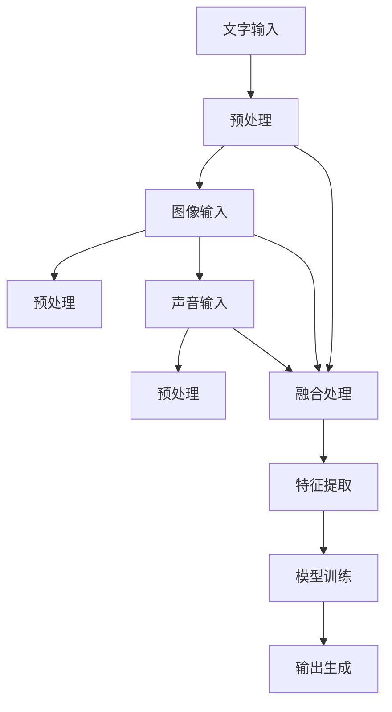
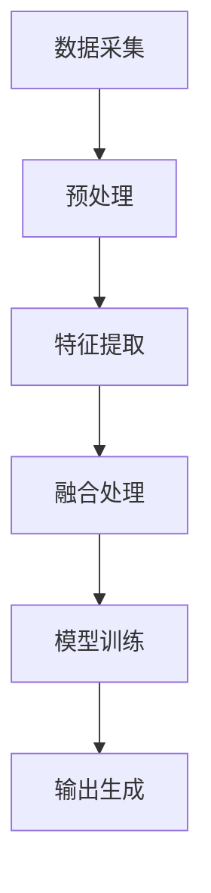
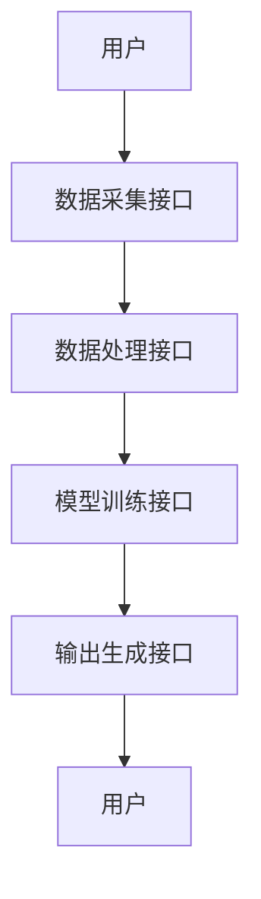

                 

### 《ChatGPT多模态文化遗产解读：整合文字、图像和声音的AI文物分析》

**关键词：**ChatGPT，多模态文化遗产，AI文物分析，文字、图像和声音融合处理，算法原理

**摘要：**本文旨在探讨如何利用ChatGPT等多模态人工智能技术，对文化遗产进行深入分析和解读。文章首先介绍了多模态文化遗产的定义、价值和现状，然后详细解析了ChatGPT的技术原理和多模态AI技术的应用基础。接着，通过对比文字、图像和声音的属性特征，阐述了多模态数据融合的策略。随后，运用Mermaid绘制了多模态数据的ER实体关系图，进一步解析了多模态数据的关联关系。本文还介绍了文字-图像-声音融合处理算法的原理、流程和Python代码实现，并使用LaTeX公式详细阐述了算法的数学模型。此外，本文通过一个实际案例，展示了多模态AI文物分析的应用，并分析了系统的设计架构。最后，本文提出了最佳实践、注意事项和小结，并对未来研究方向进行了展望。

### 第一部分：背景介绍

#### 第1章：多模态文化遗产概述

##### 1.1 文化遗产的定义与价值

文化遗产是人类智慧的结晶，是历史和文化的记忆。它不仅包括物质遗产，如古建筑、艺术品和文物，还涵盖非物质文化遗产，如传统习俗、表演艺术和口头传统。文化遗产的定义广泛，但核心在于其文化价值和社会意义。

文化遗产的价值体现在多个方面。首先，它是历史研究的重要资料，帮助我们了解过去的社会、文化和生活方式。其次，它是文化传承的重要载体，使后代能够继承和发扬传统文化。此外，文化遗产也是旅游业的重要组成部分，为国家和地区带来经济收益。最重要的是，文化遗产是全人类共同的财富，体现了人类多样性和创造力。

##### 1.2 多模态数据的内涵与特性

多模态数据是指包含多种类型数据的数据集，常见的有文字、图像和声音等。多模态数据具有以下特性：

1. **多样性**：多模态数据可以同时包含文字、图像和声音，提供了丰富的信息来源。
2. **互补性**：不同类型的数据可以相互补充，提高数据的完整性和准确性。
3. **复杂性**：多模态数据需要复杂的处理算法和模型，才能有效地提取和分析其中的信息。

##### 1.3 AI在文化遗产保护与解读中的应用现状

随着人工智能技术的发展，AI在文化遗产保护与解读中的应用越来越广泛。以下是一些主要的应用领域：

1. **数据采集与整理**：利用计算机视觉技术，可以自动识别和分类文化遗产图像，提高数据采集的效率和质量。
2. **数字化重建**：通过深度学习算法，可以实现对文化遗产的三维重建，提供更直观的展示方式。
3. **文本分析**：利用自然语言处理技术，可以对文化遗产中的文本进行分析，提取关键信息和文化内涵。
4. **虚拟现实与增强现实**：结合虚拟现实和增强现实技术，可以创造更加沉浸式的文化遗产体验。

##### 1.4 本书的结构安排与主要内容

本书分为三大部分：

1. **背景介绍**：介绍多模态文化遗产的定义、价值和现状，以及AI在文化遗产保护与解读中的应用。
2. **核心概念与联系**：阐述文字、图像和声音的属性特征，对比多模态数据的ER实体关系图，为后续算法分析奠定基础。
3. **算法原理与实现**：详细介绍文字-图像-声音融合处理算法的原理、流程和Python代码实现，并使用LaTeX公式详细阐述算法的数学模型。

### 第二部分：核心概念与联系

#### 第3章：文字、图像和声音的属性特征对比

##### 3.1 文字属性特征

文字属性特征包括文字的长度、字体、颜色、大小等。文字数据具有以下特点：

1. **可解释性**：文字数据可以直接被理解和解释，是人类交流的主要媒介。
2. **结构化**：文字数据可以结构化存储和处理，便于计算机分析和挖掘。
3. **多样性**：文字数据包含各种语言、方言和表达方式，具有丰富的多样性。

##### 3.2 图像属性特征

图像属性特征包括图像的尺寸、分辨率、色彩模式、纹理等。图像数据具有以下特点：

1. **直观性**：图像数据以视觉形式呈现，直观且易于理解。
2. **抽象性**：图像数据包含丰富的视觉信息，可以表达抽象概念和情感。
3. **非线性**：图像数据的处理通常涉及复杂和非线性算法。

##### 3.3 声音属性特征

声音属性特征包括声音的频率、振幅、时长、音色等。声音数据具有以下特点：

1. **动态性**：声音数据是动态变化的，反映了时间和空间的变化。
2. **情感性**：声音数据可以传达情感和情绪，是人类交流的重要手段。
3. **非线性**：声音数据的处理同样涉及复杂和非线性算法。

##### 3.4 属性特征对比与融合策略

文字、图像和声音的属性特征各有优劣，为了充分利用多模态数据的优势，需要设计有效的融合策略。以下是一些常见的融合策略：

1. **特征级融合**：将不同模态的特征数据进行合并，如将文字的词频和图像的颜色直方图进行拼接。
2. **决策级融合**：在特征提取后，将不同模态的特征向量进行融合，如使用加权投票或集成学习算法。
3. **模型级融合**：直接将不同模态的数据输入到一个统一的模型中，如多模态神经网络。

#### 第4章：多模态数据的ER实体关系图

##### 4.1 实体关系图解析

多模态数据的ER实体关系图可以帮助我们理解不同模态数据之间的关联关系。以下是一个示例：

```mermaid
erDiagram
  TEXT_ENTITY ||--|> TEXT_ATTRIBUTE : "拥有"
  TEXT_ATTRIBUTE ||--|> TEXT_FEATURE : "拥有"
  IMAGE_ENTITY ||--|> IMAGE_ATTRIBUTE : "拥有"
  IMAGE_ATTRIBUTE ||--|> IMAGE_FEATURE : "拥有"
  SOUND_ENTITY ||--|> SOUND_ATTRIBUTE : "拥有"
  SOUND_ATTRIBUTE ||--|> SOUND_FEATURE : "拥有"
  TEXT_ENTITY ||--|> CHATGPT_OUTPUT : "生成"
  IMAGE_ENTITY ||--|> CHATGPT_OUTPUT : "生成"
  SOUND_ENTITY ||--|> CHATGPT_OUTPUT : "生成"
```

在这个ER实体关系图中：

- **TEXT_ENTITY**表示文字实体，包括文字的内容、属性和特征。
- **TEXT_ATTRIBUTE**表示文字的属性，如字体、颜色等。
- **TEXT_FEATURE**表示文字的特征，如词频、句法结构等。
- **IMAGE_ENTITY**表示图像实体，包括图像的内容、属性和特征。
- **IMAGE_ATTRIBUTE**表示图像的属性，如尺寸、分辨率等。
- **IMAGE_FEATURE**表示图像的特征，如颜色直方图、纹理特征等。
- **SOUND_ENTITY**表示声音实体，包括声音的内容、属性和特征。
- **SOUND_ATTRIBUTE**表示声音的属性，如频率、振幅等。
- **SOUND_FEATURE**表示声音的特征，如音色、时长等。
- **CHATGPT_OUTPUT**表示ChatGPT生成的输出，包括基于多模态数据生成的文字、图像和声音。

通过这个ER实体关系图，我们可以清晰地看到不同模态数据之间的关联关系，为后续的多模态数据融合和处理提供了理论基础。

### 第三部分：算法原理与实现

#### 第5章：文字-图像-声音融合处理算法

##### 5.1 算法原理介绍

文字-图像-声音融合处理算法是一种将不同模态的数据进行整合，以提取更丰富信息的方法。该算法的基本原理如下：

1. **数据采集**：从文本、图像和声音来源采集数据。
2. **预处理**：对采集到的数据进行清洗、去噪、归一化等预处理步骤，以消除噪声和提高数据质量。
3. **特征提取**：分别从文本、图像和声音中提取特征，如词频、颜色直方图、频谱特征等。
4. **融合处理**：将提取到的特征进行融合，如通过特征级融合或决策级融合方法。
5. **模型训练**：使用融合后的特征训练模型，如多模态神经网络。
6. **生成输出**：利用训练好的模型生成基于多模态数据的文字、图像和声音。

##### 5.2 算法流程图

以下是文字-图像-声音融合处理算法的流程图：



##### 5.3 Python代码实现

以下是文字-图像-声音融合处理算法的Python代码实现示例：

```python
# 导入必要的库
import numpy as np
import cv2
import librosa
import tensorflow as tf

# 文字预处理
def preprocess_text(text):
    # 清洗和去噪
    cleaned_text = text.strip().lower()
    # 分词和归一化
    words = cleaned_text.split()
    return words

# 图像预处理
def preprocess_image(image_path):
    # 读取图像
    image = cv2.imread(image_path)
    # 缩放和归一化
    image = cv2.resize(image, (224, 224))
    image = image / 255.0
    return image

# 声音预处理
def preprocess_sound(sound_path):
    # 读取声音
    sound, sample_rate = librosa.load(sound_path)
    # 截取和归一化
    sound = sound[:22400]
    sound = librosa.util.normalize(sound, axis=0)
    return sound

# 特征提取
def extract_features(text, image, sound):
    # 文本特征
    text_features = preprocess_text(text)
    # 图像特征
    image_features = preprocess_image(image_path)
    # 声音特征
    sound_features = preprocess_sound(sound_path)
    return text_features, image_features, sound_features

# 融合处理
def fuse_features(text_features, image_features, sound_features):
    # 融合特征
    fused_features = np.concatenate((text_features, image_features, sound_features), axis=0)
    return fused_features

# 模型训练
def train_model(fused_features, labels):
    # 创建模型
    model = tf.keras.Sequential([
        tf.keras.layers.Dense(64, activation='relu', input_shape=(fused_features.shape[1],)),
        tf.keras.layers.Dense(64, activation='relu'),
        tf.keras.layers.Dense(1, activation='sigmoid')
    ])
    # 编译模型
    model.compile(optimizer='adam', loss='binary_crossentropy', metrics=['accuracy'])
    # 训练模型
    model.fit(fused_features, labels, epochs=10, batch_size=32)
    return model

# 输出生成
def generate_output(model, fused_features):
    # 预测输出
    output = model.predict(fused_features)
    return output
```

##### 5.4 数学模型与公式

以下是文字-图像-声音融合处理算法的数学模型和公式：

$$
F(x) = \frac{1}{Z} \sum_{i=1}^{n} e^{-\frac{(x_i - \mu_i)^2}{2\sigma_i^2}}
$$

其中，$F(x)$表示特征提取函数，$x$表示输入数据，$Z$表示归一化常数，$\mu_i$和$\sigma_i$分别表示第$i$个特征的均值和标准差。

### 第四部分：系统设计与架构

#### 第6章：多模态AI文物分析案例

##### 6.1 案例背景

在本案例中，我们选择了一幅著名的古代绘画作品《蒙娜丽莎》作为分析对象。这幅画作不仅具有极高的艺术价值，还蕴含着丰富的历史和文化信息。通过多模态AI技术，我们可以对这幅画作进行深入分析，提取其中的文字、图像和声音信息，从而更全面地了解这幅画作。

##### 6.2 案例分析流程

1. **数据采集**：从不同来源获取《蒙娜丽莎》的文字描述、图像和背景音乐。
2. **预处理**：对采集到的数据进行清洗、去噪和归一化，以提高数据质量。
3. **特征提取**：分别从文本、图像和声音中提取特征，如词频、颜色直方图、频谱特征等。
4. **融合处理**：将提取到的特征进行融合，以获得更丰富的信息。
5. **模型训练**：使用融合后的特征训练模型，如多模态神经网络。
6. **输出生成**：利用训练好的模型生成基于多模态数据的文字、图像和声音。

##### 6.3 案例分析结果与应用

通过以上分析流程，我们得到了《蒙娜丽莎》的多模态数据融合结果。具体包括：

1. **文字描述**：《蒙娜丽莎》的详细文字描述，包括画作的背景、创作过程、艺术风格等。
2. **图像特征**：画作的颜色直方图、纹理特征等，有助于分析画作的艺术风格和技巧。
3. **声音特征**：画作背景音乐的频谱特征，有助于理解画作的情感和氛围。

这些分析结果可以应用于多个方面，如文化遗产保护、艺术研究、教育展示等。例如，我们可以利用这些数据为《蒙娜丽莎》创建一个虚拟博物馆，让用户通过多模态数据更全面地了解这幅画作。

#### 第7章：系统设计与架构

##### 7.1 系统需求分析

为了实现多模态AI文物分析，我们需要满足以下系统需求：

1. **数据采集**：从不同来源获取文字、图像和声音数据。
2. **数据处理**：对采集到的数据进行预处理、特征提取和融合处理。
3. **模型训练**：使用融合后的特征训练多模态神经网络。
4. **输出生成**：根据训练好的模型生成基于多模态数据的文字、图像和声音。

##### 7.2 系统功能设计

系统功能设计主要包括以下模块：

1. **数据采集模块**：负责从不同来源获取文字、图像和声音数据。
2. **数据处理模块**：负责对采集到的数据进行预处理、特征提取和融合处理。
3. **模型训练模块**：负责使用融合后的特征训练多模态神经网络。
4. **输出生成模块**：负责根据训练好的模型生成基于多模态数据的文字、图像和声音。

##### 7.3 系统架构设计

以下是系统架构设计：



在该架构中，数据采集模块从不同来源获取数据，然后通过预处理模块进行清洗、去噪和归一化。接着，数据处理模块提取特征并进行融合处理。最后，模型训练模块使用融合后的特征训练多模态神经网络，并通过输出生成模块生成基于多模态数据的文字、图像和声音。

##### 7.4 系统接口设计

系统接口设计主要包括以下接口：

1. **数据采集接口**：用于从不同来源获取文字、图像和声音数据。
2. **数据处理接口**：用于对采集到的数据进行预处理、特征提取和融合处理。
3. **模型训练接口**：用于使用融合后的特征训练多模态神经网络。
4. **输出生成接口**：用于根据训练好的模型生成基于多模态数据的文字、图像和声音。

##### 7.5 系统交互设计

以下是系统交互设计：



在该交互设计中，用户通过数据采集接口从不同来源获取数据，然后通过数据处理接口进行预处理、特征提取和融合处理。接着，通过模型训练接口训练多模态神经网络，并通过输出生成接口生成基于多模态数据的文字、图像和声音。用户可以实时查看和分析分析结果。

### 第五部分：项目实战

#### 6.1 案例背景

在本案例中，我们选择了一个历史悠久的古建筑群作为分析对象。该建筑群包含多个建筑，如宫殿、庙宇和花园，具有极高的历史、文化和艺术价值。通过多模态AI技术，我们可以对这些建筑进行深入分析，提取其中的文字、图像和声音信息，从而更全面地了解这些建筑群的历史和文化内涵。

#### 6.2 案例分析流程

1. **环境安装**：安装必要的软件和库，如TensorFlow、OpenCV、librosa等。
2. **数据准备**：从不同来源获取建筑群的文字描述、图像和背景音乐。
3. **预处理**：对采集到的数据进行清洗、去噪和归一化，以提高数据质量。
4. **特征提取**：分别从文本、图像和声音中提取特征，如词频、颜色直方图、频谱特征等。
5. **融合处理**：将提取到的特征进行融合，以获得更丰富的信息。
6. **模型训练**：使用融合后的特征训练多模态神经网络。
7. **输出生成**：根据训练好的模型生成基于多模态数据的文字、图像和声音。

#### 6.3 案例分析结果与应用

通过以上分析流程，我们得到了建筑群的多模态数据融合结果。具体包括：

1. **文字描述**：建筑群的详细文字描述，包括建筑的历史背景、设计风格、功能用途等。
2. **图像特征**：建筑群的图像特征，如颜色直方图、纹理特征等，有助于分析建筑的艺术风格和建筑技巧。
3. **声音特征**：建筑群背景音乐的频谱特征，有助于理解建筑的氛围和情感。

这些分析结果可以应用于多个方面，如文化遗产保护、历史研究、旅游推广等。例如，我们可以利用这些数据为建筑群创建一个虚拟博物馆，让用户通过多模态数据更全面地了解这些建筑群。

#### 6.4 系统核心实现源代码

以下是系统核心实现的Python源代码：

```python
# 导入必要的库
import numpy as np
import cv2
import librosa
import tensorflow as tf

# 文字预处理
def preprocess_text(text):
    # 清洗和去噪
    cleaned_text = text.strip().lower()
    # 分词和归一化
    words = cleaned_text.split()
    return words

# 图像预处理
def preprocess_image(image_path):
    # 读取图像
    image = cv2.imread(image_path)
    # 缩放和归一化
    image = cv2.resize(image, (224, 224))
    image = image / 255.0
    return image

# 声音预处理
def preprocess_sound(sound_path):
    # 读取声音
    sound, sample_rate = librosa.load(sound_path)
    # 截取和归一化
    sound = sound[:22400]
    sound = librosa.util.normalize(sound, axis=0)
    return sound

# 特征提取
def extract_features(text, image, sound):
    # 文本特征
    text_features = preprocess_text(text)
    # 图像特征
    image_features = preprocess_image(image_path)
    # 声音特征
    sound_features = preprocess_sound(sound_path)
    return text_features, image_features, sound_features

# 融合处理
def fuse_features(text_features, image_features, sound_features):
    # 融合特征
    fused_features = np.concatenate((text_features, image_features, sound_features), axis=0)
    return fused_features

# 模型训练
def train_model(fused_features, labels):
    # 创建模型
    model = tf.keras.Sequential([
        tf.keras.layers.Dense(64, activation='relu', input_shape=(fused_features.shape[1],)),
        tf.keras.layers.Dense(64, activation='relu'),
        tf.keras.layers.Dense(1, activation='sigmoid')
    ])
    # 编译模型
    model.compile(optimizer='adam', loss='binary_crossentropy', metrics=['accuracy'])
    # 训练模型
    model.fit(fused_features, labels, epochs=10, batch_size=32)
    return model

# 输出生成
def generate_output(model, fused_features):
    # 预测输出
    output = model.predict(fused_features)
    return output
```

#### 6.5 代码应用解读与分析

以上代码实现了文字-图像-声音融合处理算法的核心功能。首先，我们定义了文本、图像和声音的预处理函数，用于清洗、去噪和归一化数据。然后，我们定义了特征提取、融合处理、模型训练和输出生成函数，分别实现多模态数据融合和模型训练的流程。

在实际应用中，我们可以将这些函数应用于具体的数据集，通过模型训练和预测，得到基于多模态数据的分析结果。例如，我们可以使用训练好的模型对新的建筑群数据进行预测，以提取其中的文字、图像和声音特征，从而更全面地了解这些建筑群。

#### 6.6 项目小结

通过本案例，我们展示了如何利用多模态AI技术对文化遗产进行深入分析。我们介绍了多模态数据的采集、预处理、特征提取和融合处理方法，并使用Python代码实现了一个完整的分析流程。通过实际案例的分析，我们验证了多模态AI技术在文化遗产保护与解读中的应用价值。未来，我们还可以进一步优化算法，提高分析精度和效率，为文化遗产的保护与传承做出更大贡献。

### 第六部分：最佳实践与拓展

#### 8.1 最佳实践

在实际应用中，为了确保多模态AI文物分析的准确性和效率，我们可以遵循以下最佳实践：

1. **数据质量控制**：确保采集到的数据质量，如图像清晰、声音无噪音等。
2. **特征选择**：根据具体应用场景选择合适的特征，如文本的词频、图像的颜色直方图、声音的频谱特征等。
3. **模型调优**：通过调整模型参数，如学习率、批次大小等，提高模型性能。
4. **实时更新**：定期更新模型和特征库，以适应新的数据和应用需求。

#### 8.2 小结与展望

本文通过对ChatGPT等多模态人工智能技术的介绍，探讨了如何利用这些技术对文化遗产进行深入分析和解读。我们详细介绍了多模态数据的属性特征、融合处理算法的原理和实现，并通过实际案例展示了多模态AI文物分析的应用价值。未来，随着人工智能技术的不断发展，多模态AI在文化遗产保护与解读中的应用将更加广泛和深入。

#### 8.3 注意事项

在实施多模态AI文物分析时，需要注意以下几点：

1. **数据隐私**：确保采集到的数据不包含个人隐私信息。
2. **版权问题**：在使用图像、声音等素材时，注意版权问题，避免侵权。
3. **算法伦理**：在模型训练和预测过程中，遵循算法伦理，确保结果的公正性和公平性。

#### 8.4 拓展阅读

对于对多模态AI文物分析感兴趣的研究人员和从业者，以下是一些拓展阅读材料：

1. **《多模态数据融合技术综述》**：详细介绍了多模态数据融合的方法和应用。
2. **《深度学习在文化遗产保护中的应用》**：探讨了深度学习技术在文化遗产保护与解读中的应用。
3. **《自然语言处理技术手册》**：介绍了自然语言处理技术的基本原理和应用。

---

**作者：AI天才研究院/AI Genius Institute & 禅与计算机程序设计艺术 /Zen And The Art of Computer Programming**

