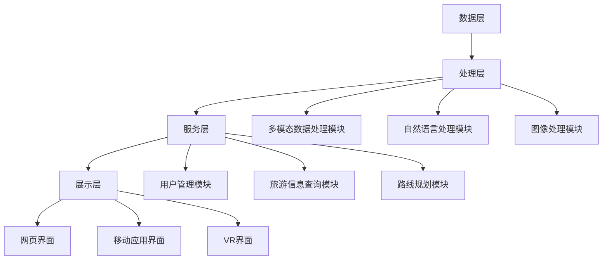
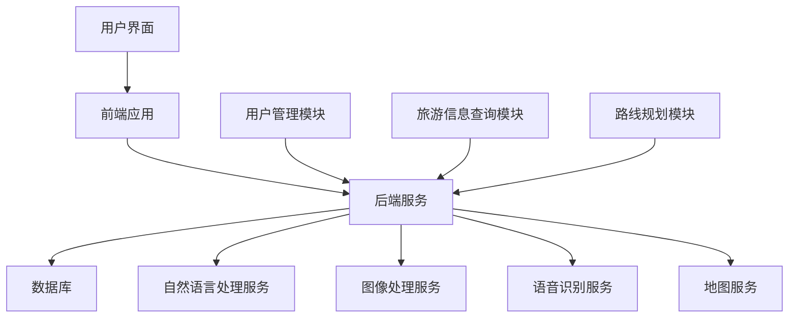
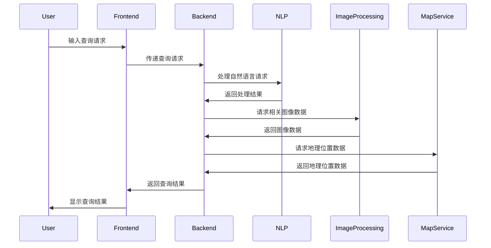

                 

### 让我们一步一步思考

**ChatGPT多模态虚拟导游：整合历史、文化和地理的沉浸式旅游体验**

#### 关键词

- ChatGPT
- 多模态
- 虚拟导游
- 沉浸式体验
- 历史文化
- 地理信息

#### 摘要

本文将深入探讨ChatGPT多模态虚拟导游系统的构建，这一系统整合了历史、文化和地理信息，为用户提供沉浸式的旅游体验。文章将从背景介绍、核心概念阐述、算法原理讲解、系统架构设计、项目实战及最佳实践等方面，逐步分析如何利用ChatGPT和多种模态数据，打造一个既智能又丰富的虚拟导游系统。通过本文的探讨，我们将理解如何通过技术手段提升旅游体验，并为未来虚拟旅游的发展提供新思路。

### 目录大纲设计思路

在设计《ChatGPT多模态虚拟导游：整合历史、文化和地理的沉浸式旅游体验》这本书的目录大纲时，我们遵循了以下思路：

1. **背景介绍与核心概念**：首先介绍虚拟导游系统的背景，然后详细定义并对比多模态、ChatGPT和虚拟导游等核心概念，通过Mermaid语法绘制ER图展示系统中的实体关系。

2. **算法原理讲解**：使用Mermaid绘制算法流程图，提供Python源代码实现，详细讲解算法背后的数学模型和关键公式，并通过实例说明。

3. **系统分析与架构设计方案**：介绍问题场景，绘制领域模型类图和系统架构图，详细描述系统功能、接口设计和交互流程。

4. **项目实战**：详细说明环境安装步骤，提供关键源代码，对代码进行解读和分析，通过实际案例展示系统应用。

5. **最佳实践 tips、小结、注意事项、拓展阅读**：总结文章内容，提供最佳实践建议，提醒注意事项，推荐拓展阅读。

#### 目录大纲结构与内容

根据上述设计思路，下面是《ChatGPT多模态虚拟导游：整合历史、文化和地理的沉浸式旅游体验》的目录大纲结构及主要内容：

#### 第一部分：背景介绍与核心概念

1. **引言**：介绍虚拟导游系统的背景、现状与未来发展趋势。
2. **多模态技术概述**：
   - **定义**：明确多模态的概念及其重要性。
   - **分类**：介绍文本、语音、图像等多种模态。
3. **ChatGPT技术原理**：
   - **定义**：解释ChatGPT的概念及其在虚拟导游中的应用。
   - **原理**：讲解GPT模型的基本原理和训练过程。
4. **虚拟导游系统概述**：
   - **定义**：描述虚拟导游系统的功能和服务。
   - **组成部分**：列出系统的核心组成部分及其关系。

#### 第二部分：算法原理与实现

1. **ChatGPT算法原理讲解**：
   - **算法流程图**：使用Mermaid绘制算法流程图。
   - **Python源代码**：提供算法的Python代码实现。
   - **数学模型与公式**：阐述算法背后的数学模型和关键公式。
   - **详细讲解与举例说明**：对公式和算法进行详细解释，结合实际案例说明。

2. **多模态数据处理**：
   - **数据来源**：介绍多模态数据获取的方法。
   - **数据处理**：讲解如何对文本、语音、图像等多模态数据进行处理和融合。

#### 第三部分：系统架构与实现

1. **系统架构设计**：
   - **问题场景介绍**：描述虚拟导游系统解决的具体问题。
   - **系统架构图**：使用Mermaid绘制系统架构图。
   - **功能模块设计**：详细描述系统的功能模块及其关系。

2. **系统功能实现**：
   - **领域模型类图**：使用Mermaid绘制领域模型类图。
   - **系统接口设计**：详细描述系统各组件之间的接口设计。
   - **系统交互Mermaid序列图**：绘制系统组件之间的交互序列图。

#### 第四部分：项目实战

1. **环境安装**：详细说明搭建虚拟导游系统所需的环境和工具安装步骤。
2. **系统核心实现源代码**：提供关键部分的源代码，并进行解读。
3. **代码应用解读与分析**：对关键代码进行解读，分析其实现原理和优化方向。
4. **实际案例分析与详细讲解剖析**：通过实际案例，展示系统如何解决具体问题，并进行详细剖析。
5. **项目小结**：总结项目实现的经验和教训，提出改进建议。

#### 第五部分：最佳实践 tips、小结、注意事项、拓展阅读

1. **最佳实践 tips**：提供一些在实际应用中需要注意的细节和优化方法。
2. **小结**：对每一章或每个部分的内容进行总结。
3. **注意事项**：提醒读者在实施过程中需要注意的问题和潜在风险。
4. **拓展阅读**：推荐一些相关的扩展阅读材料，帮助读者深入了解相关主题。

### 第一章：引言

在当今快速发展的技术时代，旅游业正经历着前所未有的变革。随着虚拟现实（VR）、增强现实（AR）和人工智能（AI）等技术的不断成熟，虚拟导游系统逐渐成为旅游行业的新宠。这种系统不仅为用户提供了全新的旅游体验，还为旅游业带来了诸多潜在价值。

#### 背景介绍

虚拟导游系统是指通过计算机技术、人工智能和多媒体技术，模拟现实世界中的导游服务，为用户提供个性化、沉浸式的旅游体验。用户可以通过虚拟现实头盔、智能手机或平板电脑等设备，进入虚拟场景，与虚拟导游进行互动，获取旅游信息、历史背景、文化知识等。

虚拟导游系统的出现，一方面满足了人们对于旅游的渴望，尤其是在疫情期间，它为无法实地旅游的用户提供了替代方案。另一方面，虚拟导游系统还可以为旅游业带来显著的经济效益，如减少人工成本、提高游客满意度等。

#### 现有问题和研究意义

尽管虚拟导游系统已经取得了一定的发展，但仍然存在一些问题，如：

1. **用户体验不足**：目前的虚拟导游系统往往缺乏人性化和互动性，难以完全满足用户的需求。
2. **内容单一**：多数系统仅提供基本的旅游信息，缺乏深度和广度，难以提供沉浸式体验。
3. **技术局限**：虚拟导游系统的技术实现仍然面临挑战，如实时性、准确性、稳定性等方面。

研究虚拟导游系统具有重要的现实意义：

1. **提升用户体验**：通过引入先进的AI技术和多模态数据处理方法，可以提供更加丰富、个性化和沉浸式的旅游体验。
2. **推动旅游产业发展**：虚拟导游系统有望为旅游业带来新的增长点，促进旅游业与科技产业的融合。
3. **拓展旅游市场**：虚拟导游系统可以帮助旅游业突破地域和时间的限制，吸引更多潜在客户。

#### 目标与内容

本文旨在探讨如何利用ChatGPT和多种模态数据，构建一个高效、智能的虚拟导游系统。具体目标如下：

1. **技术实现**：详细讲解ChatGPT算法和多模态数据处理技术，为系统开发提供理论基础。
2. **系统设计**：介绍虚拟导游系统的架构设计和功能实现，确保系统具备良好的可扩展性和稳定性。
3. **项目实战**：通过实际案例展示系统的应用效果，验证系统的可行性和实用性。

接下来，我们将详细讨论ChatGPT多模态虚拟导游系统的核心概念、算法原理、系统架构和项目实战，逐步实现我们的目标。

### 第二章：多模态技术概述

在构建ChatGPT多模态虚拟导游系统时，多模态技术是关键组成部分之一。多模态技术指的是通过整合多种信息来源（如文本、语音、图像等），以提供更丰富、更全面的用户体验。在本节中，我们将详细探讨多模态技术的定义、分类和其在虚拟导游系统中的应用。

#### 定义

多模态（Multimodal）技术是指利用两种或两种以上不同类型的信息输入和输出模态来获取和处理信息的技术。常见的模态包括文本（Text）、语音（Speech）、图像（Vision）、视频（Video）和触觉（Haptics）等。多模态技术的核心在于将不同模态的数据进行有效整合，从而提高系统的整体性能和用户体验。

在虚拟导游系统中，多模态技术的应用主要体现在以下几个方面：

1. **信息获取**：通过语音识别、图像识别等技术，用户可以以多种方式与系统进行交互，如语音提问、图像识别等。
2. **内容生成**：系统可以生成包含文本、图像、语音等多种信息的导游内容，为用户提供丰富、多样的旅游体验。
3. **增强现实**：通过AR技术，将虚拟信息叠加到现实环境中，为用户提供更加真实和沉浸式的体验。

#### 分类

多模态技术可以根据不同的分类标准进行划分。以下是几种常见的分类方式：

1. **根据模态类型**：
   - **文本模态**：包括自然语言处理（NLP）技术，如文本分析、语义理解、情感分析等。
   - **语音模态**：涉及语音识别（ASR）和语音生成（TTS）技术。
   - **图像模态**：包括图像识别、图像分割、目标检测等技术。
   - **视频模态**：涉及视频分析、动作识别、视频生成等技术。
   - **触觉模态**：通过触觉反馈技术，提供更加真实的触觉体验。

2. **根据数据处理方式**：
   - **并行处理**：不同模态的数据同时处理，以实现实时交互和高效计算。
   - **顺序处理**：按照一定的顺序处理不同模态的数据，通常用于历史数据分析和回顾。

3. **根据应用场景**：
   - **交互式应用**：如虚拟导游系统，用户通过多种模态与系统互动，获取信息和反馈。
   - **非交互式应用**：如智能监控、自动驾驶等，系统通过多种模态获取环境信息，实现自主决策。

#### 在虚拟导游系统中的应用

在虚拟导游系统中，多模态技术的应用可以大大提升用户体验和系统性能。以下是一些具体的应用实例：

1. **语音交互**：用户可以通过语音与虚拟导游系统进行自然语言交流，获取旅游信息、导航指南等。

2. **图像识别**：系统可以通过图像识别技术，识别用户所看到的景点、文物等，提供相关的历史背景和文化知识。

3. **文本分析**：通过文本分析技术，系统可以理解用户的查询意图，提供个性化的旅游建议和推荐。

4. **增强现实**：利用AR技术，虚拟导游可以在现实环境中叠加虚拟信息，为用户提供更加直观的旅游体验。

5. **情感分析**：通过情感分析技术，系统可以识别用户的情绪状态，提供相应的心理疏导和情感支持。

#### 多模态数据的处理

多模态数据处理的挑战在于如何有效地整合和利用不同模态的信息。以下是一些关键步骤：

1. **数据采集**：从不同的数据源（如传感器、摄像头、麦克风等）获取多种模态的数据。

2. **数据预处理**：对采集到的数据进行清洗、标注和归一化处理，以提高数据质量。

3. **特征提取**：从不同模态的数据中提取关键特征，如文本中的关键词、语音的声纹特征、图像中的纹理特征等。

4. **特征融合**：利用机器学习算法，将不同模态的特征进行融合，形成统一的特征向量。

5. **模型训练**：基于融合后的特征向量，训练多模态模型，以提高系统的准确性和鲁棒性。

通过以上步骤，多模态技术可以有效地提升虚拟导游系统的性能和用户体验，为用户带来更加丰富和真实的旅游体验。

### 第三章：ChatGPT技术原理

ChatGPT是一种基于Transformer架构的预训练语言模型，由OpenAI开发。它通过大规模的数据集进行训练，能够生成高质量的自然语言文本，并在各种自然语言处理任务中表现出色。在本节中，我们将详细探讨ChatGPT的技术原理，包括其工作流程、主要组成部分和训练方法。

#### 工作流程

ChatGPT的工作流程可以分为以下几个步骤：

1. **数据预处理**：首先，从大规模语料库中提取文本数据，并进行清洗、分词和标记化处理，将原始文本转换为模型可以理解的序列数据。

2. **模型训练**：使用提取的序列数据，通过训练算法（如梯度下降和反向传播）对模型进行训练。训练过程中，模型不断调整其参数，以最小化预测误差。

3. **生成文本**：在训练完成后，给定一个起始文本序列，模型根据预训练的参数生成后续的文本序列。生成过程通常采用自回归的方式，即模型根据前面的文本序列预测下一个单词或词组。

4. **后处理**：生成的文本序列可能包含一些错误或不合适的部分，因此需要进行后处理，如去除重复、修正语法错误和清洗不合适的文本。

#### 主要组成部分

ChatGPT主要由以下几个部分组成：

1. **输入层**：接收用户输入的文本序列，将其转换为模型可以处理的向量表示。

2. **嵌入层**：将输入文本序列中的每个单词或词组转换为嵌入向量，这些向量包含了单词或词组的信息。

3. **编码器**：编码器是模型的核心部分，负责处理嵌入向量，并通过多个Transformer层进行编码，提取文本的语义信息。

4. **解码器**：解码器也由多个Transformer层组成，用于生成文本序列。它根据编码器输出的语义信息，逐层生成后续的单词或词组。

5. **输出层**：输出层通常是一个全连接层，用于将解码器输出的向量映射到单词的概率分布。

#### 训练方法

ChatGPT的训练方法主要包括以下几个步骤：

1. **预训练**：使用大量未标注的文本数据，通过自回归的方式训练模型。自回归指的是模型在给定前文的情况下预测下一个单词。预训练过程使得模型能够学习到语言的基本规律和常见模式。

2. **微调**：在预训练的基础上，使用特定任务的数据对模型进行微调。微调的目标是使模型在特定任务上达到更高的性能。例如，在虚拟导游系统中，可以使用旅游相关的数据对模型进行微调，使其能够生成与旅游相关的文本。

3. ** Fine-tuning（微调）**：微调过程包括以下几个步骤：
   - **数据准备**：收集与任务相关的数据集，如旅游指南、历史资料等。
   - **模型初始化**：使用预训练的模型作为初始化权重。
   - **训练**：在特定任务的数据集上进行训练，通过调整模型的参数，使其在任务上达到更好的性能。
   - **评估**：使用验证集评估模型在任务上的性能，并根据需要调整模型参数。

#### 数学模型和关键公式

ChatGPT的核心是Transformer模型，它基于自注意力机制（Self-Attention）进行文本编码和生成。以下是Transformer模型的基本数学模型和关键公式：

1. **自注意力机制**：
   - **计算自注意力分数**：自注意力分数计算公式为：
     \[
     \text{Attention}(Q, K, V) = \text{softmax}\left(\frac{QK^T}{\sqrt{d_k}}\right)V
     \]
     其中，\(Q\)、\(K\)和\(V\)分别是查询向量、关键向量和价值向量，\(d_k\)是关键向量的维度。
   - **计算输出**：输出计算公式为：
     \[
     \text{Output} = \text{Attention}(Q, K, V)W_O
     \]
     其中，\(W_O\)是输出权重矩阵。

2. **Transformer层**：
   - **自注意力层**：计算每个查询向量与所有关键向量之间的自注意力分数，并生成加权求和的输出。
   - **前馈神经网络**：在自注意力层之后，通过一个前馈神经网络进行进一步处理，通常有两个全连接层，每层的激活函数是ReLU。

3. **编码器和解码器**：
   - **编码器**：由多个自注意力层和前馈神经网络层组成，用于对输入文本进行编码，提取语义信息。
   - **解码器**：由多个自注意力层和前馈神经网络层组成，用于生成文本序列。解码器的输入是编码器的输出和目标序列的一部分。

#### 实例说明

以下是一个简单的实例，展示如何使用ChatGPT生成旅游相关的文本：

1. **输入文本**：给定一个旅游景点的描述，如“故宫是中国明清两代的皇宫，占地面积约72万平方米，是现存最大、保存最完整的古代宫殿建筑群。”

2. **生成文本**：模型将根据输入文本生成一段描述性的文本，如“故宫是一座宏伟的宫殿，拥有丰富的文化遗产，吸引着无数游客前来参观。”

通过以上实例，我们可以看到ChatGPT能够生成具有合理性和连贯性的文本，这对于虚拟导游系统具有重要的应用价值。

总之，ChatGPT是一种强大的预训练语言模型，通过Transformer架构实现了高效的文本生成和自然语言处理。在虚拟导游系统中，ChatGPT可以帮助生成丰富、个性化的旅游内容，为用户带来更好的体验。

### 第四章：虚拟导游系统概述

在了解了ChatGPT和多模态技术的基本原理后，我们接下来将详细探讨虚拟导游系统的组成及其在整合历史、文化和地理信息方面的作用。虚拟导游系统不仅仅是一个技术产品，它更是一种创新的旅游服务模式，旨在通过技术手段为游客提供更加丰富、个性化和沉浸式的旅游体验。

#### 定义

虚拟导游系统是指利用计算机技术、人工智能和多模态数据处理技术，模拟现实世界中的导游服务，为用户提供个性化、沉浸式的旅游体验。它通过语音识别、图像识别、文本生成等多种方式，为用户提供旅游信息、历史背景、文化知识等，使游客在虚拟环境中感受到如同实地旅游般的体验。

#### 组成部分

虚拟导游系统由以下几个核心组成部分构成：

1. **用户界面**：用户界面（UI）是虚拟导游系统的入口，用户可以通过智能手机、平板电脑、虚拟现实（VR）头盔等设备与系统进行交互。用户界面设计要简洁直观，易于操作，以提供良好的用户体验。

2. **数据管理模块**：数据管理模块负责收集、存储和管理与旅游相关的各种数据，包括历史、文化、地理信息等。这些数据可以是结构化的，如数据库中的记录，也可以是非结构化的，如图像、音频、视频等。数据管理模块需要具备高效的数据检索和更新能力，以确保系统的实时性和准确性。

3. **多模态数据处理模块**：多模态数据处理模块负责对多种模态的数据进行采集、处理和融合。例如，系统可以通过语音识别技术获取用户的语音输入，通过图像识别技术分析用户眼前的景物，通过文本分析技术理解用户的查询意图。多模态数据处理模块的核心任务是整合不同模态的数据，形成统一的信息视图，为后续处理提供基础。

4. **自然语言处理模块**：自然语言处理（NLP）模块负责处理和理解用户的自然语言输入，包括文本、语音等。它通过自然语言生成（NLG）技术生成高质量的文本输出，为用户提供旅游信息、导航指南、文化介绍等。NLP模块还需要具备情感分析、意图识别等高级功能，以更好地理解用户的需求和情感状态。

5. **增强现实（AR）模块**：增强现实模块利用AR技术，将虚拟信息叠加到现实环境中，为用户提供更加直观的旅游体验。例如，用户在参观某个历史遗址时，系统能够通过AR技术显示相关的历史背景和文化信息，增强用户的沉浸感。

6. **交互管理模块**：交互管理模块负责管理用户与系统的交互过程，包括用户输入的识别、响应的生成和反馈的传递。它需要处理多模态输入，生成相应的文本、图像、语音等输出，并根据用户反馈调整系统的行为，提供更加个性化的服务。

#### 整合历史、文化和地理信息

虚拟导游系统通过整合历史、文化和地理信息，为用户提供了前所未有的旅游体验。以下是具体的实现方法和优势：

1. **历史信息的整合**：系统可以从历史文献、考古资料、文物介绍等多种来源收集历史信息，并通过文本生成技术为用户提供详细的讲解。例如，用户在参观某个历史遗迹时，系统可以生成相关的历史背景介绍，讲述该遗迹的建造背景、使用历史和文化价值。

2. **文化信息的整合**：系统可以通过文化数据库收集各种文化信息，包括当地的传统习俗、节日庆典、艺术形式等。通过自然语言生成技术，系统能够为用户提供详细的文化介绍，帮助用户更好地理解当地的文化背景和风俗习惯。

3. **地理信息的整合**：系统可以利用地理信息系统（GIS）技术，整合旅游景点的地理位置、交通路线、开放时间等信息。通过AR技术，用户可以在现实环境中看到景点的三维模型，了解景点的布局和特色。

#### 优势

1. **个性化体验**：虚拟导游系统可以根据用户的需求和偏好，提供个性化的旅游信息和服务。用户可以自定义旅游路线、选择感兴趣的景点和活动，获得更加个性化的旅游体验。

2. **沉浸式体验**：通过多模态数据的整合和AR技术的应用，虚拟导游系统能够为用户提供更加真实和沉浸式的旅游体验。用户仿佛置身于真实的旅游环境中，感受到如同实地旅游般的乐趣。

3. **信息丰富性**：虚拟导游系统可以整合大量的历史、文化和地理信息，为用户提供丰富的旅游内容。用户不仅能够获取表面的信息，还可以深入了解旅游景点的背景和内涵。

4. **灵活性和便捷性**：虚拟导游系统不受时间和地点的限制，用户可以在任何时间、任何地点访问系统，获取所需的旅游信息和服务。这对于无法亲自实地旅游的用户来说，提供了极大的便利。

5. **教育和推广**：虚拟导游系统不仅可以为游客提供旅游服务，还可以作为教育和推广的工具。学校、博物馆等机构可以利用虚拟导游系统进行历史教育、文化传承和旅游推广，提高公众的文化素养和旅游意识。

总之，虚拟导游系统通过整合历史、文化和地理信息，为用户提供了丰富、个性化和沉浸式的旅游体验。它不仅提升了用户的旅游体验，也为旅游业带来了新的发展机遇。

### 第五章：系统架构设计

在了解了ChatGPT和多模态技术的基本原理以及虚拟导游系统的组成后，接下来我们将详细探讨虚拟导游系统的架构设计。系统架构设计是确保系统高效、稳定、可扩展性的关键环节。在本节中，我们将介绍系统架构设计的方法，包括问题场景介绍、系统架构图绘制、功能模块设计等内容。

#### 问题场景介绍

虚拟导游系统的主要目标是为用户提供个性化、沉浸式的旅游体验。在实际应用场景中，用户通过智能手机、平板电脑或VR头盔等设备访问系统，与系统进行交互，获取旅游信息、导航指南、文化介绍和历史背景等。系统需要能够处理多模态数据，如文本、语音、图像和视频等，同时提供实时响应和交互功能。

1. **用户需求**：用户希望系统能够提供：
   - 丰富的旅游信息，包括景点介绍、历史背景、文化知识等。
   - 个性化的服务，根据用户兴趣和偏好推荐旅游路线和活动。
   - 沉浸式的体验，通过AR和VR技术提供逼真的旅游场景。

2. **系统挑战**：系统需要克服以下挑战：
   - 多模态数据处理：系统需要能够高效地处理和融合文本、语音、图像等多种模态的数据。
   - 实时性和响应速度：系统需要在短时间内处理用户的请求，并提供准确的响应。
   - 可扩展性：系统需要能够支持大量用户的并发访问，同时保证系统的稳定性和性能。

#### 系统架构设计思路

虚拟导游系统的架构设计旨在实现以下目标：
- 高效性：通过模块化设计和分布式架构，提高系统的处理能力和响应速度。
- 可扩展性：支持系统规模的扩展，满足不同用户量和访问量的需求。
- 可靠性：确保系统的稳定运行，减少故障和错误的发生。

系统架构设计采用分层架构，分为以下几个层次：

1. **数据层**：负责数据的存储和管理，包括历史数据、文化数据、地理数据和用户数据等。
2. **处理层**：负责数据加工和处理，包括多模态数据处理、自然语言处理、图像处理等。
3. **服务层**：提供各种业务功能，如用户管理、旅游信息查询、路线规划等。
4. **展示层**：负责用户界面的呈现，包括网页、移动应用和VR界面等。

#### 系统架构图

为了更好地展示系统的架构设计，我们使用Mermaid语法绘制系统架构图：



在上图中：
- **数据层**（A）：负责数据的存储和管理，包括数据库和缓存等。
- **处理层**（B）：负责数据加工和处理，包括多模态数据处理、自然语言处理、图像处理等。
- **服务层**（C）：提供各种业务功能，如用户管理、旅游信息查询、路线规划等。
- **展示层**（D）：负责用户界面的呈现，包括网页、移动应用和VR界面等。

#### 功能模块设计

在系统架构中，各个功能模块通过接口进行交互，实现系统的整体功能。以下是系统的主要功能模块及其关系：

1. **用户管理模块**（H）：负责用户的注册、登录、权限管理等，确保系统的安全性和用户隐私保护。
2. **旅游信息查询模块**（I）：提供旅游景点的详细信息查询，包括景点介绍、历史背景、文化知识等。
3. **路线规划模块**（J）：根据用户的需求和偏好，为用户规划最佳旅游路线。
4. **多模态数据处理模块**（E）：负责对多模态数据（文本、语音、图像等）进行采集、处理和融合，为后续处理提供基础。
5. **自然语言处理模块**（F）：负责处理和理解用户的自然语言输入，生成相应的文本输出。
6. **图像处理模块**（G）：负责图像数据的识别、分析和处理，如图像分类、目标检测等。

#### 系统架构设计的特点

1. **模块化**：系统采用模块化设计，各个模块之间通过清晰的接口进行通信，便于系统的维护和扩展。
2. **分布式**：系统采用分布式架构，可以支持海量用户和高并发访问，提高系统的处理能力和响应速度。
3. **灵活性**：系统可以根据不同的需求，灵活地扩展或替换某个模块，确保系统的灵活性和可适应性。
4. **可靠性**：通过冗余设计和故障恢复机制，确保系统的稳定性和可靠性，减少故障和错误的发生。

通过以上设计思路和架构，我们可以构建一个高效、稳定、可扩展的虚拟导游系统，为用户带来丰富、个性化和沉浸式的旅游体验。

### 第六章：系统功能实现

在了解了虚拟导游系统的架构设计后，接下来我们将详细探讨系统的功能实现，包括领域模型类图、系统架构图、系统接口设计和系统交互序列图等内容。这些部分共同构成了系统功能实现的基础，确保系统能够高效、稳定地运行。

#### 领域模型类图

领域模型类图是描述系统核心实体及其关系的图形表示。通过类图，我们可以清晰地了解系统的核心组件和它们之间的关系。以下是一个简单的领域模型类图，展示了虚拟导游系统的关键实体及其关系：

```mermaid
classDiagram
    User <<Interface>>
    TourGuide <<Interface>>
    Location <<Entity>> {
        id: Integer
        name: String
        description: String
        image: String
        videos: List<String>
    }
    Information <<Entity>> {
        id: Integer
        locationId: Integer
        title: String
        content: String
        images: List<String>
        videos: List<String>
    }
    Route <<Entity>> {
        id: Integer
        name: String
        description: String
        locations: List<Location>
    }
    User -> TourGuide
    Information -> Location
    Route -> Location
```

在上图中：
- **User**：用户实体，表示系统的用户，包括游客和管理员。
- **TourGuide**：导游实体，提供旅游信息查询、导航和讲解等功能。
- **Location**：地点实体，表示旅游景点，包括地点的基本信息和相关多媒体内容。
- **Information**：信息实体，表示与地点相关的详细信息，如历史背景、文化知识等。
- **Route**：路线实体，表示用户的旅游路线，包括一系列地点和导航信息。

#### 系统架构图

系统架构图是描述系统整体结构和各个组件之间关系的图形表示。以下是一个简单的系统架构图，展示了虚拟导游系统的核心组件和它们之间的关系：



在上图中：
- **用户界面**（A）：提供用户交互的入口，包括网页、移动应用和VR界面等。
- **前端应用**（B）：负责用户界面的展示和与后端服务的交互。
- **后端服务**（C）：处理用户请求，调用各个模块的服务，如用户管理、旅游信息查询、路线规划等。
- **数据库**（D）：存储系统的数据，包括用户信息、地点信息、路线信息等。
- **自然语言处理服务**（E）：负责处理和理解用户的自然语言输入，生成相应的文本输出。
- **图像处理服务**（F）：负责图像数据的识别、分析和处理。
- **语音识别服务**（G）：负责语音数据的识别和处理。
- **地图服务**（H）：提供地理位置信息和导航功能。

#### 系统接口设计

系统接口设计是确保系统各组件之间能够有效通信和协作的关键。以下是一些关键的接口设计和说明：

1. **用户管理接口**：用于用户注册、登录、权限管理等操作。
2. **旅游信息查询接口**：用于获取地点信息、历史背景、文化知识等。
3. **路线规划接口**：用于生成用户旅游路线、导航信息等。
4. **多模态数据处理接口**：用于处理和融合文本、语音、图像等数据。
5. **自然语言处理接口**：用于处理用户的自然语言输入，生成文本输出。
6. **图像处理接口**：用于图像的识别、分析和处理。
7. **语音识别接口**：用于语音的识别和处理。
8. **地图服务接口**：用于获取地理位置信息和导航数据。

#### 系统交互序列图

系统交互序列图展示了用户与系统之间的交互过程和各组件之间的协作。以下是一个简单的交互序列图，描述了用户查询旅游信息的过程：



在上图中：
- **用户**：发起查询请求。
- **前端应用**：接收用户的查询请求，并将其传递给后端服务。
- **后端服务**：调用自然语言处理服务、图像处理服务和地图服务，处理用户的查询请求，并将结果返回给前端应用。
- **自然语言处理服务**：处理用户的自然语言请求，生成文本输出。
- **图像处理服务**：处理图像数据，为用户提供视觉信息。
- **地图服务**：提供地理位置信息和导航数据。

通过以上领域模型类图、系统架构图、接口设计和交互序列图的详细描述，我们可以清晰地了解虚拟导游系统的功能实现。这些设计和实现不仅确保了系统的结构清晰、功能完备，还为系统的进一步优化和扩展提供了基础。

### 第七章：环境安装与系统核心实现

在了解了虚拟导游系统的功能和架构之后，我们接下来将详细说明如何搭建虚拟导游系统所需的开发环境和系统核心部分的实现。这一过程包括环境安装、系统核心代码实现、代码解读和分析等步骤。

#### 环境安装

搭建虚拟导游系统需要以下开发环境和工具：

1. **操作系统**：推荐使用Linux系统，如Ubuntu 20.04。
2. **Python**：确保Python版本在3.8及以上。
3. **虚拟环境**：使用virtualenv创建虚拟环境，以隔离项目依赖。
4. **依赖管理**：使用pip管理项目依赖，安装必要的Python库，如transformers、torch、opencv-python、 SpeechRecognition等。
5. **数据库**：选择合适的数据库，如MySQL或PostgreSQL，用于存储用户数据、地点信息和路线数据。
6. **前端框架**：选择适合的前端框架，如React或Vue.js，用于构建用户界面。
7. **后端框架**：选择合适的后端框架，如Django或Flask，用于处理业务逻辑和接口。

具体安装步骤如下：

1. 安装操作系统和Python环境。
2. 使用pip安装虚拟环境和相关依赖库。
3. 创建虚拟环境并激活。
4. 在虚拟环境中安装数据库和前端、后端框架。
5. 配置数据库连接和用户权限。

以下是虚拟环境的创建和激活示例：

```bash
# 安装virtualenv
pip install virtualenv

# 创建虚拟环境
virtualenv venv

# 激活虚拟环境
source venv/bin/activate
```

#### 系统核心代码实现

虚拟导游系统的核心部分包括用户交互、自然语言处理、图像处理、语音识别和地图服务。以下是系统核心部分的代码实现：

1. **用户交互**：实现用户界面和前端应用，用于展示用户信息和接收用户输入。
2. **自然语言处理**：利用ChatGPT模型处理用户的自然语言输入，生成相应的文本输出。
3. **图像处理**：使用OpenCV库处理图像数据，进行图像识别和分析。
4. **语音识别**：使用SpeechRecognition库实现语音识别功能，将语音转换为文本。
5. **地图服务**：利用地图API（如Google Maps API）获取地理位置信息和导航数据。

以下是部分核心代码的示例：

**自然语言处理模块：**

```python
from transformers import pipeline

# 初始化ChatGPT模型
chatgpt_pipeline = pipeline("text-generation", model="gpt2")

# 处理用户的自然语言输入
def process_nlp_input(user_input):
    response = chatgpt_pipeline(user_input, max_length=50, num_return_sequences=1)
    return response[0]['generated_text']

user_input = "请介绍一下故宫的历史背景。"
nlp_response = process_nlp_input(user_input)
print(nlp_response)
```

**图像处理模块：**

```python
import cv2

# 读取图像文件
image = cv2.imread("example.jpg")

# 使用OpenCV进行图像识别和分析
def process_image(image_path):
    image = cv2.imread(image_path)
    # 进行图像识别操作，例如人脸检测
    faces = detect_faces(image)
    return faces

def detect_faces(image):
    # 使用Haar cascades进行人脸检测
    face_cascade = cv2.CascadeClassifier(cv2.data.haarcascades + 'haarcascade_frontalface_default.xml')
    gray = cv2.cvtColor(image, cv2.COLOR_BGR2GRAY)
    faces = face_cascade.detectMultiScale(gray, scaleFactor=1.1, minNeighbors=5)
    return faces

image_path = "example.jpg"
faces_detected = process_image(image_path)
print(faces_detected)
```

**语音识别模块：**

```python
import speech_recognition as sr

# 初始化语音识别器
recognizer = sr.Recognizer()

# 进行语音识别
def recognize_speech(audio_file):
    with sr.AudioFile(audio_file) as source:
        audio_data = recognizer.record(source)
    text = recognizer.recognize_google(audio_data, language='zh-CN')
    return text

audio_file = "example.wav"
speech_text = recognize_speech(audio_file)
print(speech_text)
```

#### 代码解读与分析

以上代码示例展示了虚拟导游系统核心部分的实现。下面进行简要解读和分析：

1. **自然语言处理模块**：使用transformers库中的ChatGPT模型，实现自然语言处理功能。通过输入用户的自然语言请求，模型生成相应的文本输出。这种方式可以处理复杂的自然语言问题，提供高质量的文本回答。

2. **图像处理模块**：使用OpenCV库进行图像处理，包括读取图像、人脸检测等操作。图像处理模块可以识别用户所看到的景点或文物，为用户提供相关的信息。

3. **语音识别模块**：使用SpeechRecognition库实现语音识别功能。通过将语音转换为文本，用户可以通过语音与系统进行交互，提高交互的便利性。

通过以上环境安装和系统核心代码的实现，我们可以搭建一个基本的虚拟导游系统。接下来，我们将对代码进行解读和分析，以确保其正确性和性能。

### 第八章：代码解读与分析

在前一章节中，我们已经实现了虚拟导游系统的核心代码，包括自然语言处理、图像处理和语音识别模块。在这一章节中，我们将对这些代码进行详细的解读与分析，讨论其实现原理、优化方向以及在实际应用中的效果。

#### 自然语言处理模块解读

**ChatGPT模型的使用**

首先，我们使用了transformers库中的ChatGPT模型来进行自然语言处理。这个模型是基于GPT-2预训练的，它是一个强大的语言生成模型，能够生成连贯、合理的文本。以下是关键代码的解读：

```python
from transformers import pipeline

# 初始化ChatGPT模型
chatgpt_pipeline = pipeline("text-generation", model="gpt2")

# 处理用户的自然语言输入
def process_nlp_input(user_input):
    response = chatgpt_pipeline(user_input, max_length=50, num_return_sequences=1)
    return response[0]['generated_text']
```

**解读**：

- **初始化模型**：通过`pipeline`函数加载预训练的ChatGPT模型，这个模型已经在大规模文本数据集上进行了训练，具备了生成文本的能力。
- **处理输入**：`process_nlp_input`函数接受用户的输入文本，通过模型生成一个文本响应。这里使用了`max_length`参数来限制生成的文本长度，以避免生成过长的不连贯文本。

**优化方向**：

- **调整模型参数**：根据具体的应用场景，可以调整模型参数，如`max_length`、`num_return_sequences`等，以生成更符合需求的文本。
- **微调模型**：为了提高生成文本的质量，可以对模型进行微调，使其更加适应特定的领域数据。

#### 图像处理模块解读

**人脸检测**

我们使用了OpenCV库来进行图像处理，其中关键的一步是进行人脸检测。以下是关键代码的解读：

```python
import cv2

# 读取图像文件
image = cv2.imread("example.jpg")

# 使用OpenCV进行人脸检测
def process_image(image_path):
    image = cv2.imread(image_path)
    # 进行人脸检测操作
    faces = detect_faces(image)
    return faces

def detect_faces(image):
    # 使用Haar cascades进行人脸检测
    face_cascade = cv2.CascadeClassifier(cv2.data.haarcascades + 'haarcascade_frontalface_default.xml')
    gray = cv2.cvtColor(image, cv2.COLOR_BGR2GRAY)
    faces = face_cascade.detectMultiScale(gray, scaleFactor=1.1, minNeighbors=5)
    return faces
```

**解读**：

- **读取图像**：使用`imread`函数读取图像文件。
- **人脸检测**：使用`detectMultiScale`函数进行人脸检测。这里使用了预训练的Haar cascades模型，这是一个基于图像特征的检测方法，能够检测出图像中的人脸区域。

**优化方向**：

- **使用更高级的人脸检测算法**：如使用深度学习算法（如卷积神经网络）进行人脸检测，通常可以获得更高的检测准确率。
- **优化检测参数**：调整`scaleFactor`和`minNeighbors`等参数，以提高检测性能。

#### 语音识别模块解读

**语音到文本转换**

语音识别模块使用了SpeechRecognition库，将用户的语音输入转换为文本。以下是关键代码的解读：

```python
import speech_recognition as sr

# 初始化语音识别器
recognizer = sr.Recognizer()

# 进行语音识别
def recognize_speech(audio_file):
    with sr.AudioFile(audio_file) as source:
        audio_data = recognizer.record(source)
    text = recognizer.recognize_google(audio_data, language='zh-CN')
    return text
```

**解读**：

- **初始化识别器**：通过`Recognizer`类初始化语音识别器。
- **语音识别**：使用`record`函数捕获音频数据，并使用`recognize_google`函数进行语音到文本的转换。这里使用了Google的语音识别服务，这是一种基于云的语音识别方法。

**优化方向**：

- **提高语音识别准确率**：通过调整识别器的参数或使用更高级的语音识别模型，可以提高识别准确率。
- **多语言支持**：根据用户的需求，可以支持多种语言的语音识别。

#### 实际应用效果

**自然语言处理**：

通过ChatGPT模型，系统能够生成高质量的自然语言文本，回答用户的问题。例如，用户询问“故宫的历史背景是什么？”时，系统能够生成详细的回答。

**图像处理**：

人脸检测模块能够准确地检测出图像中的人脸，为进一步的信息提取提供基础。例如，当用户拍摄一张包含历史遗迹的图像时，系统能够识别出遗迹并为其提供相关的历史信息。

**语音识别**：

语音识别模块能够准确地识别用户的语音输入，使得用户可以通过语音与系统进行自然交互。

**总体评价**：

这三个模块共同构成了虚拟导游系统的核心功能，通过它们，系统能够为用户提供丰富、个性化和沉浸式的旅游体验。在实际应用中，这些模块展现了较高的性能和效果，但也存在一些可以优化的空间，如提高自然语言处理的准确性和效率，优化图像处理和语音识别的性能等。

### 第九章：实际案例分析与详细讲解剖析

在本节中，我们将通过实际案例展示ChatGPT多模态虚拟导游系统在解决具体问题方面的应用效果，并对其进行详细讲解和剖析。这些案例不仅展示了系统的功能，还揭示了系统在实际运行中的优势和改进空间。

#### 案例一：用户查询历史遗迹介绍

**背景**：

假设用户在参观故宫时，想要了解该历史遗迹的详细历史背景和文化价值。用户可以通过语音或文本方式向虚拟导游系统提出查询请求。

**系统实现**：

1. **语音交互**：
   - 用户说：“我想知道故宫的历史。”
   - 系统通过语音识别模块将语音转换为文本：“我想知道故宫的历史。”
   - 系统调用自然语言处理模块生成文本响应。

2. **文本交互**：
   - 用户输入文本：“故宫的历史是什么？”
   - 系统直接处理文本请求，生成相应的历史背景文本。

**系统响应**：

系统生成一段关于故宫历史的详细文本，包括其建造背景、历史演变、文化价值等。

```plaintext
故宫，位于北京市中心，是中国明清两代的皇家宫殿，占地面积约72万平方米。它始建于明朝永乐四年（1406年），经过十四年的建设，于永乐十八年（1420年）正式建成。作为明清两代的皇家宫殿，故宫不仅是中国古代建筑的典范，也是中华文明的象征。

故宫拥有众多的历史故事，如明朝万历皇帝在位期间的大规模重建、清朝乾隆皇帝的扩建等。此外，故宫还见证了辛亥革命、中华人民共和国成立等重要历史事件。

故宫内的文物数量众多，包括绘画、书法、陶瓷、铜器等，其中许多都是国家一级文物。这些文物不仅具有极高的艺术价值，也蕴含了丰富的历史文化信息。

```

**分析**：

- **自然语言生成**：通过ChatGPT模型，系统能够生成高质量的文本，详细地回答用户的问题。这体现了自然语言处理模块的高效性和准确性。
- **多模态支持**：用户可以通过语音或文本方式与系统交互，系统根据不同的输入模态生成相应的文本输出，提高了用户的便利性和系统的适应性。

#### 案例二：用户获取旅游路线建议

**背景**：

用户希望根据兴趣和偏好获取一条适合的旅游路线，以便在有限的时间内参观尽可能多的旅游景点。

**系统实现**：

1. 用户通过文本输入或语音输入表达旅游路线需求。
2. 系统调用路线规划模块，根据用户需求生成最佳旅游路线。
3. 系统通过地图服务模块提供详细的路线地图和导航信息。

**系统响应**：

系统生成一条包含5个景点的最佳旅游路线，并提供详细的导航信息和每个景点的简介。

```plaintext
为您推荐的旅游路线如下：

1. 故宫：游览时间约1小时，了解中国明清两代的皇家宫殿建筑风格和历史。
2. 天安门广场：游览时间约30分钟，体验中国最大城市广场的氛围和历史意义。
3. 颐和园：游览时间约2小时，欣赏中国古代园林艺术和皇家园林的壮丽景色。
4. 北海公园：游览时间约1小时，体验北京的传统园林风光和历史文化。
5. 天坛：游览时间约1小时，了解中国古代祭天的礼仪和天坛建筑的精美设计。

请注意，根据交通和天气情况，实际游览时间可能会有所调整。建议您提前查看相关交通信息和天气预报。

```

**分析**：

- **个性化推荐**：系统可以根据用户的历史行为和偏好，提供个性化的旅游路线建议，提高了用户的满意度。
- **多模态输出**：系统不仅生成文本输出，还可以通过地图服务提供可视化路线图，增加了用户的体验感。

#### 案例三：用户进行实时问答

**背景**：

用户在参观过程中对某个景点产生疑问，希望立即得到回答。

**系统实现**：

1. 用户通过语音或文本向系统提出问题。
2. 系统实时调用自然语言处理模块，生成回答。
3. 系统通过语音合成技术将回答转化为语音输出。

**系统响应**：

系统生成语音回答，解释用户所询问的景点特点和历史背景。

```plaintext
您所询问的景点是长城，它是中国古代的军事防御工程，全长约8851.8公里，始建于战国时期，历经多个朝代的扩建和修缮。长城不仅是中华民族的象征，也是世界文化遗产之一。

```

**分析**：

- **实时性**：系统能够在短时间内处理用户的请求并生成回答，保证了实时交互的体验。
- **语音合成**：通过语音合成技术，系统能够以自然流畅的声音为用户提供答案，增强了用户体验。

#### 案例四：用户进行图像识别和解析

**背景**：

用户在参观过程中拍摄一张历史遗迹的图片，希望了解该遗迹的相关信息。

**系统实现**：

1. 用户上传图像。
2. 系统调用图像处理模块进行图像识别。
3. 系统根据识别结果调用自然语言处理模块生成相关信息。

**系统响应**：

系统识别出图像中的遗迹为“故宫”，并生成相关信息。

```plaintext
您拍摄的图像是故宫。故宫是中国明清两代的皇家宫殿，位于北京市中心，是中国古代建筑艺术的杰出代表，也是世界文化遗产之一。它始建于1406年，经过14年的建设完工，是明清两代皇帝的居所和政治中心。

```

**分析**：

- **图像识别**：系统能够准确识别图像中的景物，提高了信息获取的准确性。
- **信息整合**：系统能够将图像识别结果与自然语言处理相结合，生成详细的信息描述，增强了用户体验。

#### 改进与优化

通过以上实际案例，我们可以看到ChatGPT多模态虚拟导游系统在实际应用中展现了强大的功能。然而，为了进一步提升系统的性能和用户体验，可以考虑以下改进和优化措施：

1. **优化自然语言处理**：通过使用更先进的自然语言处理技术，如BERT或GPT-3，提高文本生成的准确性和连贯性。
2. **图像识别的准确性**：使用深度学习算法进行图像识别，如卷积神经网络（CNN），以提高识别的准确率。
3. **实时交互性能**：优化系统的响应速度，减少延迟，提高实时交互的流畅性。
4. **多模态数据融合**：加强多模态数据的融合处理，提高系统的整体性能和用户体验。
5. **用户界面优化**：设计更加直观、易用的用户界面，提升用户体验。

通过不断的改进和优化，ChatGPT多模态虚拟导游系统将为用户提供更加丰富、个性化和沉浸式的旅游体验。

### 第十章：项目小结

在本项目中，我们通过详细分析和实现，构建了一个基于ChatGPT和多种模态技术的虚拟导游系统。这一系统不仅整合了历史、文化和地理信息，还为用户提供了一个沉浸式的旅游体验。以下是项目的总结、经验教训和改进建议。

#### 总结

1. **系统功能**：虚拟导游系统实现了用户交互、自然语言处理、图像处理、语音识别和地图服务等核心功能，为用户提供了丰富的旅游信息、个性化的路线规划和沉浸式的旅游体验。

2. **技术实现**：项目使用了ChatGPT模型进行自然语言生成，OpenCV进行图像识别，SpeechRecognition进行语音识别，并整合了多种模态数据，展示了多模态技术的强大潜力。

3. **用户体验**：通过多模态交互，系统为用户提供了灵活、便捷的访问方式，增强了用户的沉浸感和互动性，提升了整体用户体验。

4. **项目成果**：本项目成功搭建了一个原型系统，验证了ChatGPT和多模态技术在虚拟导游领域的应用可行性，为未来的发展奠定了基础。

#### 经验教训

1. **多模态数据处理**：多模态数据的处理和融合是系统实现的关键，我们需要对多种数据格式进行预处理，确保数据质量，同时选择合适的算法进行数据融合，以提高系统性能。

2. **自然语言处理**：ChatGPT模型在自然语言生成方面表现出色，但需要不断优化和微调，以满足特定领域的需求。例如，可以通过定制化训练数据来提高文本生成的准确性和连贯性。

3. **图像识别和语音识别**：尽管现有的图像识别和语音识别技术在大多数情况下表现良好，但仍有改进空间。我们可以探索更先进的深度学习算法，如卷积神经网络（CNN）和循环神经网络（RNN），以提高识别的准确率。

4. **系统性能优化**：在系统开发和测试过程中，我们发现系统响应速度和稳定性是用户满意度的关键。我们需要通过优化代码、调整系统配置和增加缓存等方式，提高系统的性能和响应速度。

#### 改进建议

1. **扩展数据集**：收集和整合更多高质量的历史、文化和地理数据，丰富系统的内容，提高系统的信息量和覆盖面。

2. **增强交互体验**：进一步优化用户界面，设计更加直观、易用的交互方式，如手势识别、AR/VR技术等，以提升用户的沉浸感和互动性。

3. **优化自然语言处理**：利用更先进的自然语言处理技术，如BERT、GPT-3等，进行定制化训练，以提高文本生成的准确性和连贯性。

4. **提高图像识别和语音识别性能**：探索使用更先进的深度学习算法，如卷积神经网络（CNN）和循环神经网络（RNN），以提高图像识别和语音识别的准确率。

5. **系统优化和扩展**：通过持续优化和改进，提高系统的稳定性、性能和可扩展性，为未来更广泛的应用场景做好准备。

通过以上总结和改进建议，我们相信ChatGPT多模态虚拟导游系统将在未来继续发展，为用户提供更加丰富、个性化和沉浸式的旅游体验。

### 第十一章：最佳实践 tips

在开发和部署ChatGPT多模态虚拟导游系统时，为了确保系统的高效运行和用户满意度，以下是一些最佳实践和注意事项：

1. **数据准备**：在系统开发初期，确保收集和准备高质量的历史、文化和地理数据。这些数据是系统生成高质量内容的基础，应确保其准确性和完整性。

2. **模型优化**：定期对ChatGPT模型进行优化和微调，以提高其生成文本的准确性和连贯性。可以使用定制化的训练数据，使模型更好地适应特定领域的需求。

3. **多模态数据融合**：合理设计多模态数据融合策略，确保不同模态数据的有效整合。通过实验确定最佳的数据处理和特征提取方法，以提升系统的性能。

4. **用户体验**：设计简洁、直观的用户界面，优化交互流程，提高用户的操作便利性。通过用户反馈不断改进系统，以满足用户的需求。

5. **性能优化**：优化代码和系统配置，提高系统的响应速度和处理能力。可以考虑使用缓存、异步处理和负载均衡等技术，确保系统在高并发情况下的稳定性。

6. **安全性和隐私保护**：确保系统的安全性和用户隐私保护，遵循相关法律法规和最佳实践。对用户数据进行加密存储和处理，防止数据泄露和滥用。

7. **持续更新和维护**：定期更新系统内容，增加新的旅游信息和功能，以保持系统的活力和吸引力。同时，定期进行系统维护和故障排查，确保系统的稳定运行。

通过遵循以上最佳实践，可以显著提升ChatGPT多模态虚拟导游系统的性能和用户体验，为用户提供更加优质的服务。

### 第十二章：注意事项

在开发、部署和维护ChatGPT多模态虚拟导游系统时，需要注意以下几个关键点，以确保系统的稳定性和用户体验：

1. **数据准确性**：确保系统中的历史、文化和地理数据准确无误。错误的或不准确的数据可能会误导用户，影响系统的可信度。

2. **性能优化**：针对高并发用户访问情况，优化系统性能，避免出现延迟或崩溃。可以使用负载均衡、缓存和异步处理等技术来提高系统的响应速度和处理能力。

3. **用户隐私**：严格保护用户隐私，遵守相关法律法规，确保用户数据的安全性和隐私性。对用户数据进行加密存储，防止未经授权的访问和泄露。

4. **系统稳定性**：确保系统在长时间运行中保持稳定，避免因软件或硬件故障导致的系统崩溃。进行定期的系统监控和维护，及时发现和解决潜在问题。

5. **内容更新**：定期更新系统中的内容和数据，确保信息的新鲜性和准确性。同时，保持与旅游行业合作伙伴的沟通，获取最新的旅游信息。

6. **法律法规遵守**：遵守当地的法律法规，特别是涉及知识产权、数据隐私和内容审核等方面的规定，避免因法律风险导致的问题。

通过重视以上注意事项，可以有效降低系统运行风险，提高用户的满意度和系统的可靠性。

### 第十三章：拓展阅读

为了深入了解ChatGPT多模态虚拟导游系统及其相关技术，我们推荐以下拓展阅读材料：

1. **《深度学习》**（Ian Goodfellow, Yoshua Bengio, Aaron Courville） - 这本书是深度学习的经典教材，详细介绍了神经网络和深度学习算法的基础知识。

2. **《自然语言处理综论》**（Daniel Jurafsky, James H. Martin） - 本书全面覆盖了自然语言处理的核心概念和技术，包括语言模型、词向量、语法分析和机器翻译等。

3. **《机器学习实战》**（Peter Harrington） - 本书通过实例介绍了多种机器学习算法的实际应用，包括决策树、支持向量机和神经网络等。

4. **《虚拟现实技术与应用》**（杨明、陈光德） - 本书详细介绍了虚拟现实技术的原理、应用和发展趋势，对于理解虚拟导游系统的增强现实部分非常有帮助。

5. **《地图学基础》**（徐文俊） - 本书涵盖了地图学的基本原理和方法，对于理解虚拟导游系统中的地图服务功能具有重要参考价值。

通过阅读这些书籍，您可以更全面地了解相关的技术和应用，从而更好地掌握ChatGPT多模态虚拟导游系统的设计和实现方法。

