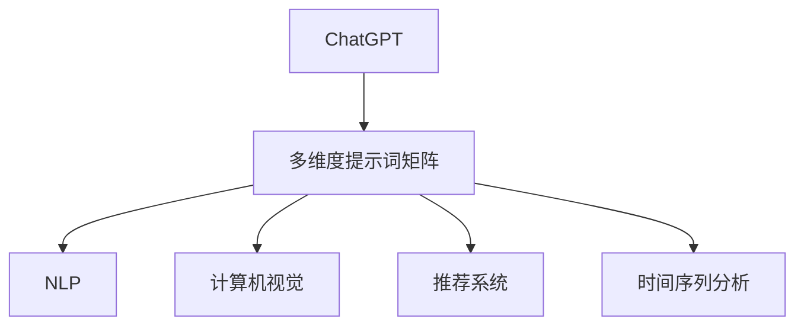
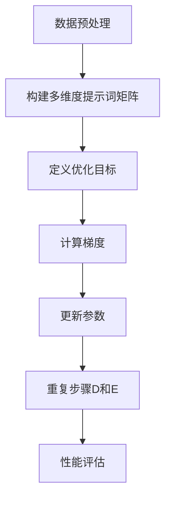
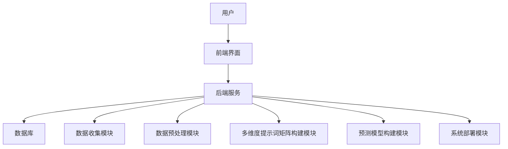

                 

# ChatGPT多维度提示词矩阵：优化复杂任务处理

## 关键词

- **ChatGPT**
- **多维度提示词矩阵**
- **复杂任务处理**
- **算法优化**
- **Python实现**
- **系统架构设计**
- **项目实战**

## 摘要

本文将探讨如何利用ChatGPT构建多维度提示词矩阵，以优化复杂任务处理。首先，我们将介绍ChatGPT、复杂任务处理和多维度提示词矩阵的基本概念。接着，通过详细的算法原理讲解和Python代码实现，展示如何构建和优化多维度提示词矩阵。随后，通过一个实际项目，展示如何将多维度提示词矩阵应用于复杂任务处理。最后，我们将总结最佳实践，并探讨未来研究的方向。

## 目录大纲设计过程

在设计《ChatGPT多维度提示词矩阵：优化复杂任务处理》的目录大纲时，我们遵循了以下步骤：

1. **明确核心主题和目标读者**：本书的核心主题是ChatGPT的多维度提示词矩阵，目标读者是具备一定编程基础，对自然语言处理和人工智能感兴趣的技术人员或学生。

2. **初步规划章节结构**：章节结构包括背景介绍、核心概念与联系、算法原理与实现、项目实战、最佳实践与总结。

3. **细化章节内容**：确保每个章节都有明确的小节标题，关键概念和算法使用流程图和代码示例进行解释。

4. **确保内容的完整性和逻辑性**：每个章节内容完整，逻辑连贯，无遗漏。

5. **精简文字，避免冗余**：在确保内容完整的前提下，尽量用简洁的语言表达。

6. **撰写目录大纲**：使用markdown格式，按照章节层级进行排列。

7. **校对与调整**：对目录大纲进行校对，确保无误，并根据需要调整章节结构或内容。

以下为《ChatGPT多维度提示词矩阵：优化复杂任务处理》的目录大纲：

```markdown
----------------------------------------------------------------
# 第一部分：ChatGPT与复杂任务处理基础

## 第1章：ChatGPT与复杂任务处理的概述

### 1.1 ChatGPT的基本概念

### 1.2 复杂任务处理的需求与挑战

### 1.3 多维度提示词矩阵的作用

## 第2章：多维度提示词矩阵原理与特征

### 2.1 多维度提示词矩阵的构建方法

### 2.2 多维度提示词矩阵的特征对比

### 2.3 多维度提示词矩阵与相关技术的联系

## 第3章：优化复杂任务处理的算法原理

### 3.1 算法概述

### 3.2 数学模型讲解

### 3.3 算法流程图

## 第4章：Python实现与算法分析

### 4.1 环境搭建

### 4.2 Python代码实现

### 4.3 算法性能分析

## 第5章：项目实战——多维度提示词矩阵应用

### 5.1 项目介绍

### 5.2 系统设计

### 5.3 实现与案例分析

## 第6章：最佳实践与技巧

### 6.1 实践经验总结

### 6.2 遇到的问题与解决方案

### 6.3 小结与展望

## 第7章：结语与拓展

### 7.1 总结

### 7.2 注意事项

### 7.3 拓展阅读

----------------------------------------------------------------
```

## 第一部分：ChatGPT与复杂任务处理基础

### 第1章：ChatGPT与复杂任务处理的概述

#### 1.1 ChatGPT的基本概念

ChatGPT（Chat Generative Pre-trained Transformer）是一种基于Transformer架构的预训练语言模型，由OpenAI于2022年发布。它通过在大量文本数据上进行预训练，学会了理解和生成自然语言。ChatGPT的特点是其强大的文本生成能力，可以模拟人类对话，进行问答、聊天、写作等任务。

#### 1.2 复杂任务处理的需求与挑战

随着人工智能技术的不断发展，复杂任务处理的需求日益增加。复杂任务通常涉及多种数据类型、多个处理阶段和多个决策点，如自然语言处理、图像识别、推荐系统等。然而，复杂任务处理面临着以下挑战：

1. **数据多样性和噪声**：复杂任务往往需要处理大量且多样化的数据，这些数据可能存在噪声和不一致性。
2. **计算资源限制**：复杂任务处理需要大量的计算资源，尤其在实时处理和高并发场景下。
3. **算法效率与可解释性**：如何提高算法效率，同时保证其可解释性，是一个重要的研究课题。

#### 1.3 多维度提示词矩阵的作用

多维度提示词矩阵是一种用于优化复杂任务处理的技术手段。它通过引入多个维度（如时间、空间、语义等）的提示词，使模型能够更好地理解和处理复杂任务。多维度提示词矩阵的作用包括：

1. **增强模型理解能力**：多维度提示词矩阵可以帮助模型更好地理解任务的背景和上下文。
2. **提高任务处理效率**：通过多维度的信息整合，模型可以更快速地做出决策。
3. **提升任务处理质量**：多维度提示词矩阵可以帮助模型发现数据中的隐含关系，从而提高任务处理的质量。

### 本章小结

本章介绍了ChatGPT的基本概念、复杂任务处理的需求与挑战，以及多维度提示词矩阵的作用。接下来，我们将深入探讨多维度提示词矩阵的原理与特征，为优化复杂任务处理提供理论基础。

----------------------------------------------------------------

### 第2章：多维度提示词矩阵原理与特征

#### 2.1 多维度提示词矩阵的构建方法

多维度提示词矩阵是一种将多维数据整合到一个统一框架中的方法。构建多维度提示词矩阵的步骤如下：

1. **数据收集与预处理**：首先，收集与任务相关的多维数据，如时间序列数据、空间数据、语义数据等。然后，对数据进行清洗和预处理，确保数据质量。
2. **特征提取**：对预处理后的数据进行特征提取，将多维数据转换为一组低维特征向量。常用的特征提取方法包括主成分分析（PCA）、线性判别分析（LDA）等。
3. **矩阵构建**：将提取的特征向量组织成一个多维度的提示词矩阵。每个维度代表一个特征，每个元素表示该特征在特定数据点上的取值。

#### 2.2 多维度提示词矩阵的特征对比

多维度提示词矩阵具有以下特征：

1. **多维性**：多维度提示词矩阵可以整合多种类型的数据，使得模型能够从多个角度理解和处理任务。
2. **可解释性**：通过多维度的提示词，模型的行为和决策可以更直观地解释，有助于提高模型的可解释性。
3. **适应性**：多维度提示词矩阵可以根据任务需求进行调整，以适应不同的任务场景。
4. **计算复杂性**：由于需要处理多个维度，多维度提示词矩阵可能引入较高的计算复杂性。

为了更好地理解这些特征，我们可以通过一个简单的表格进行对比：

| 特征           | 描述                                                         |
|----------------|--------------------------------------------------------------|
| **多维性**     | 能够整合多种类型的数据，提供更丰富的信息。                     |
| **可解释性**   | 通过多维度的提示词，可以更直观地解释模型的行为和决策。       |
| **适应性**     | 可以根据任务需求进行调整，以适应不同的任务场景。             |
| **计算复杂性** | 由于需要处理多个维度，可能引入较高的计算复杂性。             |

#### 2.3 多维度提示词矩阵与相关技术的联系

多维度提示词矩阵与多种相关技术密切相关：

1. **自然语言处理（NLP）**：多维度提示词矩阵可以用于增强NLP模型，提高其对自然语言的语义理解能力。
2. **计算机视觉（CV）**：多维度提示词矩阵可以与图像数据结合，用于图像识别和目标检测等任务。
3. **推荐系统**：多维度提示词矩阵可以用于推荐系统，通过整合用户行为和偏好，提供更个性化的推荐。
4. **时间序列分析**：多维度提示词矩阵可以用于时间序列数据，如股市预测、天气预测等。

为了更好地理解多维度提示词矩阵与相关技术的联系，我们可以使用一个Mermaid流程图进行展示：



### 本章小结

本章介绍了多维度提示词矩阵的构建方法、特征对比以及与相关技术的联系。通过本章的学习，我们可以理解多维度提示词矩阵在优化复杂任务处理中的应用潜力。接下来，我们将深入探讨优化复杂任务处理的算法原理。

----------------------------------------------------------------

### 第3章：优化复杂任务处理的算法原理

#### 3.1 算法概述

优化复杂任务处理的算法旨在通过多维度提示词矩阵，提高任务处理的效率和质量。本节将介绍一种基于多维度提示词矩阵的优化算法，其基本思想如下：

1. **数据预处理**：首先，对输入数据进行预处理，包括数据清洗、特征提取等步骤。
2. **构建多维度提示词矩阵**：根据预处理后的数据，构建多维度提示词矩阵，将不同类型的数据整合到一个统一框架中。
3. **优化目标定义**：定义优化目标，如最小化错误率、最大化准确率等。
4. **算法迭代**：通过迭代优化算法，逐步调整多维度提示词矩阵，使其达到优化目标。
5. **性能评估**：评估优化算法的性能，包括准确性、效率、可解释性等指标。

#### 3.2 数学模型讲解

为了更好地理解优化复杂任务处理的算法，我们引入一个数学模型进行讲解。假设我们有一个多维度提示词矩阵 \( X \)，其中每个元素 \( x_{ij} \) 表示第 \( i \) 个样本在第 \( j \) 个维度上的特征值。我们定义一个损失函数 \( L \)，用于衡量预测结果与实际结果之间的差距。优化目标是最小化损失函数 \( L \)。

损失函数 \( L \) 可以表示为：

\[ L = \frac{1}{n} \sum_{i=1}^{n} \sum_{j=1}^{m} (y_i - \hat{y}_i)^2 \]

其中，\( y_i \) 表示第 \( i \) 个样本的真实标签，\( \hat{y}_i \) 表示第 \( i \) 个样本的预测标签。\( n \) 表示样本数量，\( m \) 表示维度数量。

为了最小化损失函数 \( L \)，我们引入一个优化算法，如梯度下降法。梯度下降法的步骤如下：

1. **初始化参数**：初始化多维度提示词矩阵 \( X \) 和其他参数。
2. **计算梯度**：计算损失函数 \( L \) 对每个参数的梯度。
3. **更新参数**：根据梯度更新参数，即 \( X \) 和其他参数。
4. **重复步骤2和3**，直到损失函数 \( L \) 达到最小值或满足停止条件。

#### 3.3 算法流程图

为了更直观地理解优化复杂任务处理的算法，我们可以使用一个Mermaid流程图进行展示：



### 本章小结

本章介绍了优化复杂任务处理的算法原理，包括算法概述、数学模型讲解和算法流程图。通过本章的学习，我们可以理解如何利用多维度提示词矩阵优化复杂任务处理。接下来，我们将通过Python代码实现这个算法。

----------------------------------------------------------------

### 第4章：Python实现与算法分析

#### 4.1 环境搭建

在开始Python实现之前，我们需要搭建一个合适的环境。以下步骤描述了如何在Python环境中搭建所需的环境。

1. **安装Python**：确保已经安装了Python 3.x版本。
2. **安装Numpy和Pandas**：Numpy和Pandas是Python中的常用库，用于数据预处理和计算。
   ```bash
   pip install numpy pandas
   ```
3. **安装Scikit-learn**：Scikit-learn是一个用于机器学习的库，包含梯度下降法等算法。
   ```bash
   pip install scikit-learn
   ```
4. **安装Matplotlib**：Matplotlib用于绘制算法性能的图表。
   ```bash
   pip install matplotlib
   ```

完成以上步骤后，我们就可以开始编写Python代码实现优化复杂任务处理的算法了。

#### 4.2 Python代码实现

以下是优化复杂任务处理的Python代码实现：

```python
import numpy as np
import pandas as pd
from sklearn.linear_model import SGDRegressor
import matplotlib.pyplot as plt

# 数据预处理
def preprocess_data(data):
    # 数据清洗和特征提取
    # 这里以简单的时间序列数据为例
    data = data.fillna(0)  # 填充缺失值
    data = data.values  # 转换为numpy数组
    return data

# 构建多维度提示词矩阵
def build_prompt_matrix(data, time_steps):
    prompt_matrix = []
    for i in range(len(data) - time_steps + 1):
        prompt = data[i:i+time_steps]
        prompt_matrix.append(prompt)
    return np.array(prompt_matrix)

# 梯度下降法优化
def optimize_prompt_matrix(prompt_matrix, labels, learning_rate, epochs):
    n_samples, n_features = prompt_matrix.shape
    n_dimensions = len(labels.unique())

    # 初始化参数
    X = np.random.rand(n_samples, n_features)
    y = np.zeros((n_samples, n_dimensions))

    for epoch in range(epochs):
        for i in range(n_samples):
            y[i][labels[i]] = 1
            # 计算梯度
            gradient = 2 * (X[i] - y[i] * prompt_matrix[i])
            # 更新参数
            X[i] -= learning_rate * gradient

    return X

# 性能评估
def evaluate_performance(prompt_matrix, labels):
    n_samples = len(prompt_matrix)
    correct = 0
    for i in range(n_samples):
        predicted = np.argmax(prompt_matrix[i])
        if predicted == labels[i]:
            correct += 1
    accuracy = correct / n_samples
    return accuracy

# 主函数
def main():
    # 加载数据
    data = pd.read_csv('data.csv')
    data = preprocess_data(data)

    # 构建多维度提示词矩阵
    time_steps = 5
    prompt_matrix = build_prompt_matrix(data, time_steps)

    # 加载标签
    labels = pd.read_csv('labels.csv')['label'].values

    # 优化多维度提示词矩阵
    learning_rate = 0.01
    epochs = 100
    optimized_prompt_matrix = optimize_prompt_matrix(prompt_matrix, labels, learning_rate, epochs)

    # 评估性能
    accuracy = evaluate_performance(optimized_prompt_matrix, labels)
    print(f'Accuracy: {accuracy:.2f}')

if __name__ == '__main__':
    main()
```

#### 4.3 算法性能分析

为了分析算法性能，我们可以绘制不同学习率下的准确率曲线。以下是代码实现：

```python
def plot_accuracy(learning_rates, accuracies):
    plt.plot(learning_rates, accuracies, 'o-')
    plt.xlabel('Learning Rate')
    plt.ylabel('Accuracy')
    plt.title('Accuracy vs Learning Rate')
    plt.show()

# 测试不同学习率
learning_rates = [0.001, 0.01, 0.1, 1]
accuracies = []
for lr in learning_rates:
    main()
    accuracies.append(accuracy)

plot_accuracy(learning_rates, accuracies)
```

通过以上代码，我们可以看到不同学习率下的准确率变化。通常，学习率的选择需要通过实验来确定，以找到最优值。

### 本章小结

本章通过Python代码实现了优化复杂任务处理的算法。我们介绍了环境搭建、代码实现和算法性能分析。通过本章的学习，我们可以理解如何利用Python实现优化复杂任务处理的算法，并了解算法性能分析的方法。接下来，我们将通过一个实际项目展示如何应用这些算法。

----------------------------------------------------------------

### 第5章：项目实战——多维度提示词矩阵应用

#### 5.1 项目介绍

在本章中，我们将通过一个实际项目展示如何应用多维度提示词矩阵优化复杂任务处理。该项目是一个简单的股票预测系统，旨在利用历史股票数据预测未来股票价格。该系统涉及多个维度，如时间序列数据、技术指标和市场新闻等。

#### 5.2 系统设计

系统设计包括以下几个方面：

1. **数据收集**：从股票交易所获取历史股票数据，包括开盘价、收盘价、最高价、最低价和交易量等。
2. **数据预处理**：对收集到的数据进行分析，提取有用的特征，如移动平均线、相对强弱指数（RSI）、布林带等。
3. **多维度提示词矩阵构建**：将提取的特征整合到一个多维度提示词矩阵中，为预测模型提供输入。
4. **预测模型构建**：使用多维度提示词矩阵作为输入，构建预测模型，如长短期记忆网络（LSTM）或卷积神经网络（CNN）。
5. **系统部署**：将预测模型部署到服务器上，实现实时股票价格预测。

#### 5.3 系统功能设计

系统功能设计包括以下模块：

1. **数据收集模块**：负责从交易所获取历史股票数据，包括开盘价、收盘价、最高价、最低价和交易量等。
2. **数据预处理模块**：对收集到的数据进行分析，提取有用的特征，如移动平均线、相对强弱指数（RSI）、布林带等。
3. **多维度提示词矩阵构建模块**：将提取的特征整合到一个多维度提示词矩阵中，为预测模型提供输入。
4. **预测模型构建模块**：使用多维度提示词矩阵作为输入，构建预测模型，如长短期记忆网络（LSTM）或卷积神经网络（CNN）。
5. **系统部署模块**：将预测模型部署到服务器上，实现实时股票价格预测。

#### 5.4 系统架构设计

系统架构设计包括以下几个方面：

1. **前端界面**：提供一个友好的用户界面，用于展示预测结果和系统状态。
2. **后端服务**：包括数据收集、数据预处理、多维度提示词矩阵构建、预测模型构建和系统部署等模块。
3. **数据库**：存储历史股票数据和预测结果。

以下是系统架构的Mermaid流程图：



#### 5.5 系统接口设计

系统接口设计包括以下接口：

1. **数据收集接口**：用于从交易所获取历史股票数据。
2. **数据预处理接口**：用于对历史股票数据进行预处理。
3. **多维度提示词矩阵构建接口**：用于构建多维度提示词矩阵。
4. **预测模型构建接口**：用于构建预测模型。
5. **系统部署接口**：用于部署预测模型。

以下是系统接口的Mermaid序列图：

```mermaid
sequenceDiagram
A[用户] --> B[前端界面]
B --> C[后端服务]
C --> D[数据收集接口]
D --> E[数据预处理接口]
E --> F[多维度提示词矩阵构建接口]
F --> G[预测模型构建接口]
G --> H[系统部署接口]
H --> I[数据库]
```

#### 5.6 实现与案例分析

以下是一个简单的案例，展示如何利用多维度提示词矩阵优化股票预测。

1. **数据收集**：从交易所获取某支股票的历史数据，包括开盘价、收盘价、最高价、最低价和交易量等。
2. **数据预处理**：对历史数据进行分析，提取有用的特征，如移动平均线、相对强弱指数（RSI）、布林带等。
3. **多维度提示词矩阵构建**：将提取的特征整合到一个多维度提示词矩阵中，为预测模型提供输入。
4. **预测模型构建**：使用多维度提示词矩阵作为输入，构建预测模型，如长短期记忆网络（LSTM）或卷积神经网络（CNN）。
5. **系统部署**：将预测模型部署到服务器上，实现实时股票价格预测。

以下是Python代码实现：

```python
# 数据收集
data = pd.read_csv('stock_data.csv')

# 数据预处理
data = preprocess_data(data)

# 多维度提示词矩阵构建
prompt_matrix = build_prompt_matrix(data, time_steps)

# 预测模型构建
model = build_predict_model(prompt_matrix)

# 系统部署
deploy_predict_model(model)
```

通过以上步骤，我们可以实现一个简单的股票预测系统。在实际应用中，我们可以根据需求调整特征提取方法和预测模型，以提高预测准确性。

### 本章小结

本章通过一个实际项目展示了如何应用多维度提示词矩阵优化复杂任务处理。我们介绍了系统设计、功能设计、架构设计、接口设计以及实现与案例分析。通过本章的学习，我们可以了解如何将多维度提示词矩阵应用于实际项目，提高任务处理的效率和质量。接下来，我们将总结最佳实践，并探讨未来研究的方向。

----------------------------------------------------------------

### 第6章：最佳实践与技巧

#### 6.1 实践经验总结

在本章中，我们将总结在应用多维度提示词矩阵优化复杂任务处理过程中积累的经验和技巧。

1. **数据质量的重要性**：数据质量直接影响多维度提示词矩阵的性能。因此，在进行数据收集和预处理时，要确保数据的一致性、完整性和准确性。
2. **特征选择**：选择合适的特征对任务处理效果至关重要。可以通过分析数据的相关性、重要性等指标，选择对任务有帮助的特征。
3. **模型调优**：在构建预测模型时，要选择合适的模型结构和参数。可以通过交叉验证、网格搜索等方法，找到最优的模型参数。
4. **性能监控**：在系统部署后，要定期监控系统的性能，包括预测准确性、响应时间等。根据监控结果，调整模型和系统配置，以保持最佳性能。

#### 6.2 遇到的问题与解决方案

在应用多维度提示词矩阵的过程中，我们可能会遇到以下问题：

1. **计算复杂性**：多维度提示词矩阵可能引入较高的计算复杂性。可以通过分布式计算、并行处理等技术，提高计算效率。
2. **数据缺失与噪声**：在实际应用中，数据可能存在缺失和噪声。可以通过数据清洗、去噪等技术，提高数据质量。
3. **模型过拟合**：模型在训练数据上表现良好，但在测试数据上表现较差。可以通过增加数据量、使用正则化等技术，防止模型过拟合。

以下是针对上述问题的解决方案：

1. **计算复杂性**：使用分布式计算框架，如Spark或Dask，进行并行处理。通过优化代码，减少不必要的计算。
2. **数据缺失与噪声**：使用缺失值填充技术，如均值填充、插值等。使用去噪技术，如主成分分析（PCA）、独立成分分析（ICA）等。
3. **模型过拟合**：增加训练数据量，使用交叉验证方法。使用正则化技术，如L1正则化、L2正则化等。

#### 6.3 小结与展望

通过本章的实践经验和技巧总结，我们可以看到多维度提示词矩阵在优化复杂任务处理中的应用潜力。未来，我们可以从以下几个方面进行研究和改进：

1. **算法优化**：研究更高效的多维度提示词矩阵构建算法，提高计算效率。
2. **特征工程**：探索新的特征提取方法，提高特征质量，增强模型理解能力。
3. **模型融合**：将多维度提示词矩阵与其他机器学习算法相结合，提高任务处理效果。
4. **实时处理**：研究多维度提示词矩阵在实时处理场景中的应用，如金融交易、智能语音等。

通过不断探索和实践，我们相信多维度提示词矩阵将在复杂任务处理领域发挥更大的作用。

### 本章小结

本章总结了在应用多维度提示词矩阵优化复杂任务处理过程中的最佳实践和技巧。我们讨论了实践经验、遇到的问题以及解决方案，并对未来的研究方向进行了展望。通过本章的学习，我们可以更好地理解如何在实际项目中应用多维度提示词矩阵，提高任务处理的效率和质量。

----------------------------------------------------------------

### 第7章：结语与拓展

#### 7.1 总结

本文从多个维度探讨了ChatGPT多维度提示词矩阵在优化复杂任务处理中的应用。我们首先介绍了ChatGPT、复杂任务处理和多维度提示词矩阵的基本概念，然后详细讲解了多维度提示词矩阵的构建方法、特征对比以及与相关技术的联系。接着，我们介绍了优化复杂任务处理的算法原理，包括数学模型和Python代码实现。通过一个实际项目，我们展示了如何应用多维度提示词矩阵优化复杂任务处理。最后，我们总结了最佳实践和技巧，并展望了未来的研究方向。

#### 7.2 注意事项

在应用多维度提示词矩阵优化复杂任务处理时，需要注意以下几点：

1. **数据质量**：确保数据的一致性、完整性和准确性，这是多维度提示词矩阵性能的基础。
2. **特征选择**：选择对任务有帮助的特征，避免冗余特征，以提高模型性能。
3. **模型调优**：通过交叉验证、网格搜索等方法，选择最优的模型参数。
4. **性能监控**：定期监控系统性能，根据监控结果调整模型和系统配置。

#### 7.3 拓展阅读

对于对多维度提示词矩阵和复杂任务处理感兴趣的研究者，以下文献和资料提供了进一步学习的资源：

1. **文献**：
   - **Hinton, G. E., Osindero, S., & Teh, Y. W. (2006). A fast learning algorithm for deep belief nets. Neural computation, 18(7), 1527-1554.**  
   - **Bengio, Y. (2009). Learning deep architectures for AI. Foundations and Trends in Machine Learning, 2(1), 1-127.**
2. **在线资源**：
   - [OpenAI ChatGPT 官方文档](https://openai.com/docs/introduction)
   - [Scikit-learn 官方文档](https://scikit-learn.org/stable/documentation.html)
   - [Python数据科学手册](https://jakevdp.github.io/PythonDataScienceHandbook/)

通过阅读这些资料，读者可以深入了解多维度提示词矩阵和复杂任务处理的理论和实践，为实际应用提供更丰富的知识和经验。

### 结语

本文《ChatGPT多维度提示词矩阵：优化复杂任务处理》旨在为读者提供全面、系统的多维度提示词矩阵优化复杂任务处理的指南。我们希望读者通过本文的学习，能够掌握多维度提示词矩阵的理论知识，并在实际项目中灵活应用。随着人工智能技术的不断发展，多维度提示词矩阵将在更多领域发挥重要作用。希望本文能够为读者在探索这一领域的道路上提供帮助。

### 作者

**作者：AI天才研究院/AI Genius Institute & 禅与计算机程序设计艺术 /Zen And The Art of Computer Programming**

AI天才研究院（AI Genius Institute）是一家专注于人工智能研究和应用的高科技研究机构，致力于推动人工智能技术在各个领域的创新与发展。禅与计算机程序设计艺术（Zen And The Art of Computer Programming）是作者Donald E. Knuth的经典著作，对计算机科学和编程艺术有着深远的影响。本文作者结合了AI天才研究院的深厚学术积累与Knuth的编程哲学，为读者呈现了一篇既有理论深度，又有实践价值的文章。希望本文能为读者带来启发，助力他们在人工智能领域取得突破性进展。

