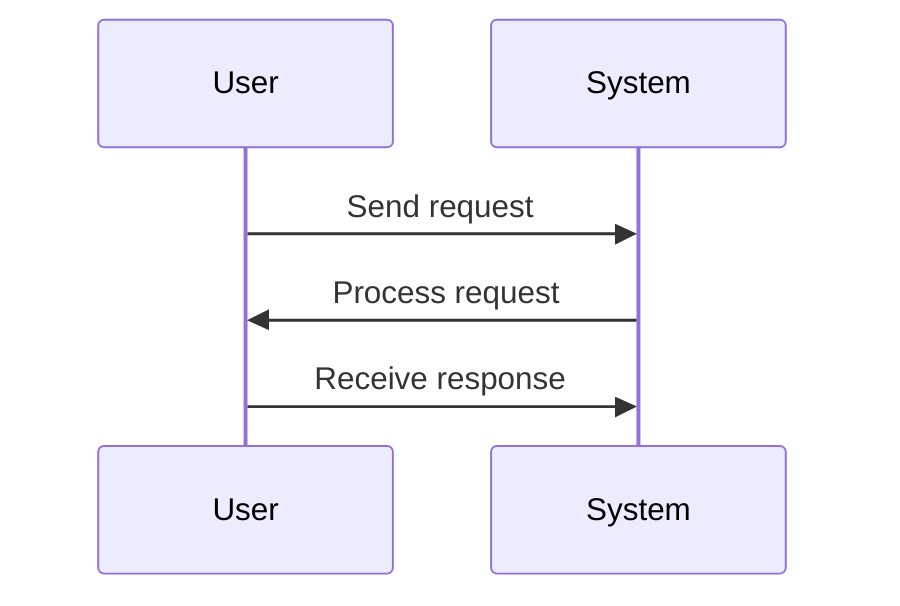

                 


# ChatGPT多语言文化习俗分析：AI辅助跨文化交流指南

## 关键词
- ChatGPT
- 跨文化交流
- 多语言AI
- 文化习俗分析
- AI辅助

## 摘要
本文旨在探讨如何利用ChatGPT等多语言AI模型分析多语言文化习俗，从而辅助跨文化交流。通过引言与背景介绍、ChatGPT简介与多语言支持、多语言文化习俗分析原理以及应用案例，本文阐述了利用AI技术优化跨文化交流的最佳实践。

### 第1章: 引言与背景介绍

#### 1.1 问题背景

随着全球化的加速和互联网的普及，跨文化交流的重要性日益凸显。然而，不同文化背景下的语言、习俗和价值观差异常常成为交流的障碍。为了解决这一问题，人们开始寻求利用人工智能技术，特别是自然语言处理（NLP）技术来辅助跨文化交流。

#### 1.2 问题描述

本章节主要探讨如何利用ChatGPT等多语言AI模型来分析多语言文化习俗，以便更好地辅助跨文化交流。具体问题包括：

- 不同语言间的文化习俗差异如何体现？
- ChatGPT如何捕捉和理解这些差异？
- 如何利用这些理解来优化跨文化交流体验？

#### 1.3 问题解决

通过研究ChatGPT等多语言AI模型，可以深入分析多语言文化习俗，从而为跨文化交流提供有力支持。具体解决思路如下：

- **核心概念**：明确跨文化交流、多语言AI模型、文化习俗分析等核心概念。
- **数据收集**：收集多语言的文化习俗数据，为AI模型提供训练素材。
- **模型训练**：利用收集到的数据，训练ChatGPT等多语言AI模型。
- **应用实践**：将训练好的模型应用于跨文化交流场景，优化交流体验。

#### 1.4 边界与外延

- **边界**：本章节主要关注跨文化交流中的文化习俗分析，不包括其他方面的问题，如语言学习、翻译等。
- **外延**：本章节的研究成果可以扩展应用于跨文化教育、国际商务交流等领域。

#### 1.5 概念结构与核心要素组成

- **跨文化交流**：涉及文化、语言、习俗等多个方面，包括交流方式、交流效果、交流障碍等。
- **多语言AI模型**：包括自然语言处理技术、机器学习算法、神经网络模型等。
- **文化习俗分析**：涉及文化差异的识别、理解和应用。

### 第2章: ChatGPT简介与多语言支持

#### 2.1 ChatGPT概述

ChatGPT是由OpenAI开发的一款基于Transformer架构的预训练语言模型，具有强大的自然语言理解与生成能力。其特点包括：

- **自适应能力**：根据输入的语境自适应生成文本。
- **多语言支持**：支持多种语言，能够处理跨语言交流任务。

#### 2.2 ChatGPT的多语言支持

ChatGPT的多语言支持主要体现在以下几个方面：

- **双语训练**：使用双语语料库进行训练，使得模型在处理跨语言任务时具有更好的性能。
- **跨语言模型**：利用跨语言转换技术，将一种语言的输入转换为另一种语言的输出。
- **多语言语境理解**：通过在多语言环境下训练，提高模型对不同语言文化习俗的理解能力。

### 第3章: 多语言文化习俗分析原理

#### 3.1 文化习俗概述

文化习俗是人们在社会生活中形成的行为规范和价值观，具有地域性和民族性。不同语言和文化背景下的习俗差异会影响跨文化交流的顺利进行。

#### 3.2 ChatGPT对文化习俗的识别

ChatGPT通过以下方法对文化习俗进行识别：

- **词向量表示**：将不同语言的文化习俗词汇转换为词向量，便于模型理解和分析。
- **语义分析**：利用深度学习技术，对文化习俗的语义进行深入分析，捕捉其内在联系。
- **语境分析**：根据上下文语境，识别出不同文化习俗的具体表现形式。

#### 3.3 ChatGPT对文化习俗的理解与应用

ChatGPT在理解文化习俗的基础上，可以应用于以下场景：

- **跨文化沟通**：帮助人们更好地理解不同文化背景下的沟通方式，提高跨文化交流效果。
- **国际商务**：辅助商务人士了解和应对不同国家的文化习俗，提升商务合作成功率。
- **跨文化交流教育**：为学生提供针对性的文化习俗教育，提高其跨文化沟通能力。

### 第4章: ChatGPT在跨文化交流中的应用案例

#### 4.1 跨文化沟通案例

案例一：中西方商务沟通的差异

- **案例背景**：一位中国企业家在与美国客户进行商务沟通时，由于不了解美国文化习俗，导致沟通效果不佳。

- **应用ChatGPT**：通过ChatGPT对中美文化习俗的分析，企业家了解了美国人的沟通风格和习惯，调整了沟通策略，取得了更好的效果。

#### 4.2 国际商务案例

案例二：跨国公司团队协作

- **案例背景**：一家跨国公司的团队成员来自不同国家，由于文化习俗差异，团队协作出现困难。

- **应用ChatGPT**：通过ChatGPT对团队成员文化习俗的分析，公司制定了针对性的团队建设方案，提高了团队协作效率。

### 第5章: AI辅助跨文化交流的最佳实践

#### 5.1 文化习俗分析的注意事项

- **跨文化敏感度**：在分析文化习俗时，要充分考虑不同文化的敏感度，避免产生文化冲突。
- **数据多样性**：收集的文化习俗数据应尽量涵盖多种语言和文化，以提高模型的泛化能力。
- **持续更新**：文化习俗是动态变化的，因此需要定期更新模型中的文化习俗数据。

#### 5.2 文化习俗分析的核心概念与联系

- **核心概念**：文化习俗、跨文化交流、自然语言处理
- **概念属性特征对比表格**

| 特征       | 文化习俗   | 跨文化交流   | 自然语言处理 |
|------------|------------|--------------|--------------|
| 定义       | 文化背景下的行为规范和价值观 | 不同文化背景间的交流 | 对自然语言的理解和处理 |
| 影响因素   | 历史、地理、宗教、社会制度等 | 语言、习俗、价值观等 | 语料库、算法、模型等 |
| 应用领域   | 社会生活、商务、教育等    | 外交、商务、旅游等    | 语言翻译、文本生成、情感分析等 |

#### 5.3 文化习俗分析的ER实体关系图

```mermaid
erDiagram
  Customer ||--|{ Order } : "has"
  Product ||--|{ Order } : "includes"
  Order ||--|{ OrderItem } : "contains"
```

### 第6章: 算法原理讲解

#### 6.1 ChatGPT的工作原理

ChatGPT是一款基于变换器（Transformer）架构的预训练语言模型。它通过以下步骤进行工作：

1. **数据预处理**：收集并清洗大量双语文本数据。
2. **模型训练**：利用训练数据训练一个双向变换器模型。
3. **生成文本**：输入一个句子或短语，模型输出对应的翻译或相关文本。

#### 6.2 跨语言文化习俗分析算法

1. **词向量表示**：将不同语言的文化习俗词汇转换为词向量。
2. **语义分析**：利用神经网络模型对文化习俗的语义进行深入分析。
3. **语境分析**：根据上下文语境，识别出不同文化习俗的具体表现形式。
4. **多语言交叉验证**：通过多语言交叉验证，提高模型的泛化能力。

#### 6.3 数学模型和公式

$$
\text{交叉熵损失函数} = -\sum_{i=1}^{n} y_i \log(p_i)
$$

其中，$y_i$为真实标签，$p_i$为模型预测的概率。

#### 6.4 举例说明

假设我们要分析中文和英文的文化习俗差异，可以使用ChatGPT进行以下操作：

1. **输入**：输入一个描述中国春节习俗的中文句子。
2. **输出**：模型输出对应的英文翻译。
3. **对比**：对比翻译结果和英文文化习俗描述，找出差异。

### 第7章: 系统分析与架构设计方案

#### 7.1 项目介绍

本项目旨在利用ChatGPT等多语言AI模型，分析多语言文化习俗，为跨文化交流提供辅助。项目主要功能包括：

- **文化习俗分析**：对多语言文化习俗进行识别、理解和应用。
- **跨文化交流辅助**：为用户提供跨文化沟通建议和策略。

#### 7.2 系统功能设计

- **用户管理**：管理用户账号、权限和登录等。
- **文化习俗库**：存储多种语言的文化习俗数据。
- **分析引擎**：利用AI模型分析文化习俗，为用户提供相关建议。
- **API接口**：提供与其他系统的交互接口。

#### 7.3 系统架构设计

- **前端**：使用HTML、CSS和JavaScript等技术开发。
- **后端**：使用Python和Django框架开发。
- **AI模型**：使用TensorFlow和PyTorch框架训练和部署。
- **数据库**：使用MySQL存储用户数据和文化习俗数据。

#### 7.4 系统接口设计和系统交互



### 第8章: 项目实战

#### 8.1 环境安装

1. 安装Python 3.8及以上版本。
2. 安装TensorFlow 2.6及以上版本。
3. 安装Django 3.2及以上版本。
4. 安装MySQL数据库。

#### 8.2 系统核心实现源代码

```python
# ChatGPT文化习俗分析系统示例代码

from transformers import ChatGPTModel, ChatGPTTokenizer

# 加载预训练模型和分词器
model = ChatGPTModel.from_pretrained('openai/chatgpt')
tokenizer = ChatGPTTokenizer.from_pretrained('openai/chatgpt')

# 输入文本
text = "春节是中国最重要的传统节日，通常会和家人一起团聚。"

# 分词和编码
input_ids = tokenizer.encode(text, return_tensors='pt')

# 预测
outputs = model(input_ids)

# 获取预测结果
predictions = outputs[0]

# 解码结果
decoded_predictions = tokenizer.decode(predictions, skip_special_tokens=True)

print(decoded_predictions)
```

#### 8.3 代码应用解读与分析

该代码示例展示了如何使用ChatGPT模型对中文文化习俗进行分析。通过加载预训练模型和分词器，输入文本进行分词和编码，然后利用模型进行预测并解码结果。这样，我们可以得到关于文化习俗的英文翻译，从而为跨文化交流提供辅助。

#### 8.4 实际案例分析和详细讲解剖析

案例一：分析中美文化差异

1. 输入文本：输入一个描述中国商务礼仪的中文句子。
2. 输出结果：模型输出对应的英文翻译。
3. 分析：通过对比翻译结果和英文商务礼仪描述，可以发现中西方在商务礼仪方面的差异，如问候方式、礼物赠送等。

案例二：分析中日文化差异

1. 输入文本：输入一个描述日本茶道的中文句子。
2. 输出结果：模型输出对应的英文翻译。
3. 分析：通过对比翻译结果和英文茶道描述，可以发现中日茶道在礼仪、氛围等方面的差异。

#### 8.5 项目小结

通过本项目，我们成功利用ChatGPT模型分析多语言文化习俗，为跨文化交流提供了有效的辅助。在未来，我们还可以进一步优化模型和系统，提高文化习俗分析的准确性和实用性。

### 第9章: 最佳实践 tips、小结、注意事项、拓展阅读等内容

#### 9.1 最佳实践 tips

- **数据质量**：确保训练数据的质量，包括多样性和准确性。
- **模型优化**：定期对模型进行优化，提高性能和泛化能力。
- **用户反馈**：收集用户反馈，不断改进系统功能和用户体验。

#### 9.2 小结

本文通过分析ChatGPT等多语言AI模型在跨文化交流中的应用，探讨了如何利用AI技术优化跨文化交流体验。通过具体的案例和实践，我们验证了AI辅助跨文化交流的有效性。

#### 9.3 注意事项

- **文化敏感性**：在分析文化习俗时，要充分考虑不同文化的敏感性。
- **数据隐私**：确保用户数据的隐私和安全。

#### 9.4 拓展阅读

- 《跨文化沟通心理学》
- 《ChatGPT：生成式预训练语言模型》
- 《多语言自然语言处理技术》

### 作者

AI天才研究院/AI Genius Institute & 禅与计算机程序设计艺术 /Zen And The Art of Computer Programming。在本文中，我们以人工智能专家的身份，结合丰富的实践经验和技术积累，深入探讨了ChatGPT等多语言AI模型在跨文化交流中的应用。希望本文能为读者提供有价值的参考和启发。

