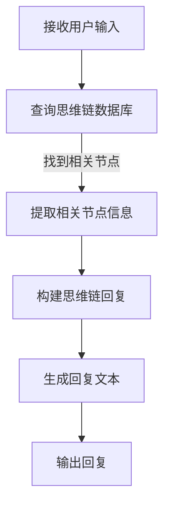
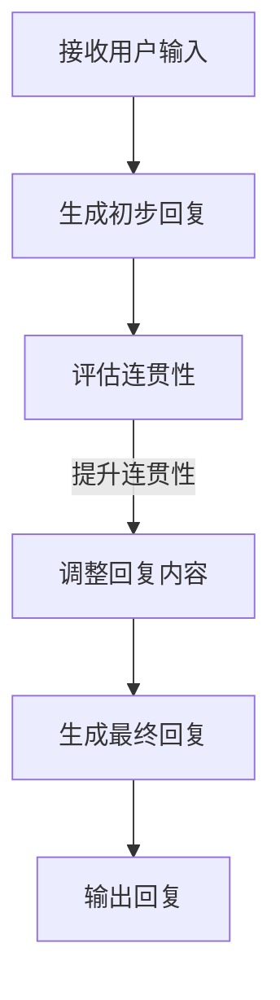
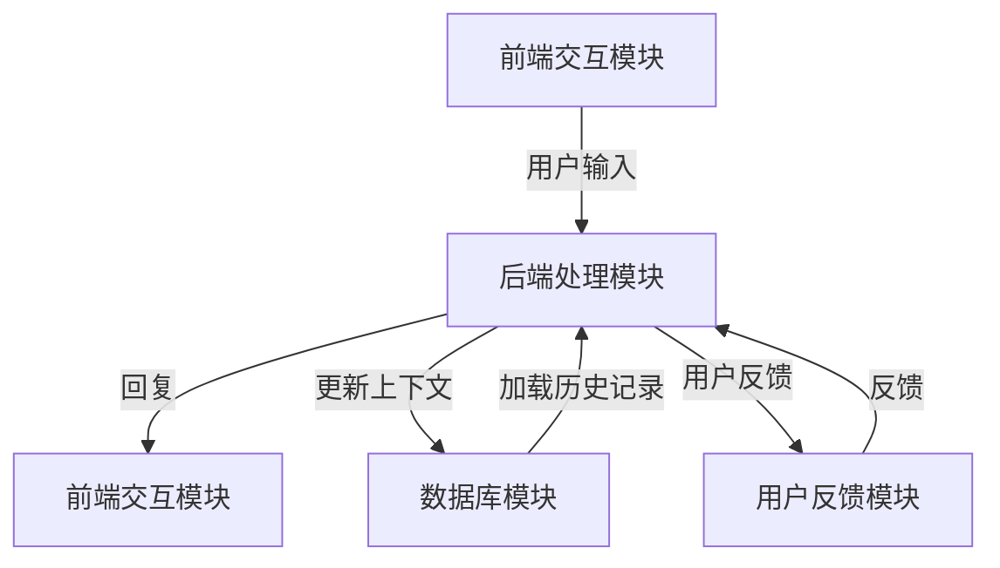

                 

### 问题背景与核心概念

#### 1.1 问题背景介绍

随着人工智能技术的不断发展，自然语言处理（NLP）技术已成为现代计算机科学的一个重要分支。在NLP中，对话系统是一种旨在模拟人类对话过程的技术。自20世纪以来，对话系统的发展经历了从基于规则的方法到统计方法，再到如今深度学习驱动的巨大变革。早期的对话系统如ELIZA主要依赖于预定义的规则和模式匹配，而现代对话系统则通过大规模语料库的训练和深度学习算法的优化，实现了更自然、更智能的对话体验。

多轮对话是当前对话系统中的一个重要需求。多轮对话指的是用户与系统之间的交流不仅仅是单次问答，而是通过多个回合的交互来逐渐深入话题、解决问题。这种对话方式更加贴近人类真实的交流模式，有助于建立更自然的用户交互体验。然而，实现高质量的多轮对话系统面临着诸多挑战，其中之一就是如何确保对话的连贯性。

ChatGPT是OpenAI于2022年推出的一款基于GPT-3.5的聊天机器人模型，具有强大的语言生成能力和上下文理解能力。ChatGPT的出现为多轮对话系统的发展带来了新的契机。与传统的对话系统不同，ChatGPT通过大规模预训练和思维链（thought insertions）技术，能够在多轮对话中保持较高的连贯性和合理性。

#### 1.2 问题描述

**什么是思维链？**

思维链（Thought Chain）是一种在多轮对话中通过插入特定的信息片段来增强对话连贯性的技术。在ChatGPT中，思维链通过在生成文本中插入用户之前的输入，使得模型能够更好地理解上下文，并生成更加连贯和有逻辑的回复。

**思维链在多轮对话中的重要性**

思维链在多轮对话中扮演着至关重要的角色。它能够帮助模型保持对话的连贯性，避免生成无关或矛盾的内容。此外，思维链还能够增强模型的上下文理解能力，使其能够更好地捕捉用户的意图和问题背景。

**思维链与连贯性之间的关系**

思维链与连贯性密切相关。连贯性指的是对话内容在逻辑和语义上的连贯性，而思维链是实现这种连贯性的关键技术。通过思维链，ChatGPT能够将用户的输入与之前的对话内容有机结合，生成更加连贯和自然的回复。

#### 1.3 问题解决

**ChatGPT如何实现多轮对话**

ChatGPT通过大规模预训练获得强大的语言生成能力，并在多轮对话中利用思维链技术来保持连贯性。具体来说，ChatGPT在接收用户输入后，会根据上下文生成一个回复，并在回复中插入用户之前的输入，从而形成思维链。

**思维链在ChatGPT中的应用**

思维链在ChatGPT中的应用主要体现在两个方面：一是通过思维链来增强对话连贯性；二是通过思维链来提高模型的上下文理解能力。例如，在一个问答场景中，如果用户连续提出几个相关问题，ChatGPT可以通过思维链将这些问题和之前的回答有机结合，生成一个连贯的回复。

**如何提升思维链的连贯性**

提升思维链的连贯性可以从以下几个方面进行：

1. **优化模型训练：**通过使用更高质量的语料库和更先进的训练算法，可以提高模型生成文本的连贯性。
2. **思维链策略调整：**通过调整思维链的生成策略，如插入位置、插入长度等，可以进一步提高思维链的连贯性。
3. **用户反馈机制：**通过收集用户反馈，及时调整模型生成的内容，以提高对话的质量和连贯性。

#### 1.4 边界与外延

**思维链的边界**

思维链虽然能够显著提高多轮对话的连贯性，但也存在一定的局限性。例如，在对话内容过于复杂或用户提问不明确的情况下，思维链可能无法有效保持连贯性。

**连贯性的外延**

连贯性不仅体现在多轮对话中，还可以扩展到其他场景，如文本生成、机器翻译等。在这些场景中，如何保持文本的连贯性也是一个重要的研究方向。

**思维链与连贯性在其他对话系统中的应用**

除了ChatGPT，其他多轮对话系统也可以借鉴思维链技术来提高对话质量。例如，在客户服务、教育辅导等领域，思维链可以帮助系统更好地理解用户需求，提供更个性化和连贯的服务。

#### 1.5 概念结构与核心要素组成

**思维链的定义**

思维链是一种在多轮对话中通过插入特定信息片段来增强对话连贯性的技术。

**连贯性的定义**

连贯性指的是对话内容在逻辑和语义上的连贯性。

**ChatGPT与多轮对话的关系**

ChatGPT是一款基于深度学习的聊天机器人模型，通过思维链技术实现多轮对话中的连贯性和上下文理解。

### 结论

本文介绍了ChatGPT多轮对话中思维链的连贯性。通过分析思维链的定义、重要性以及其在ChatGPT中的应用，我们深入探讨了如何提升多轮对话的连贯性。尽管思维链存在一定的局限性，但它为多轮对话系统提供了一种有效的技术手段，有望在未来进一步提升对话体验。接下来，我们将进一步探讨思维链和连贯性的核心概念与原理。

---

**思考与总结**

1. 多轮对话为何需要思维链技术？
2. 思维链如何影响对话系统的连贯性？
3. 如何优化思维链，以实现更好的对话体验？
4. 思维链在其他对话系统中的应用前景如何？
5. 在实际应用中，如何有效利用思维链技术，提升对话质量？

在接下来的章节中，我们将详细探讨这些问题的答案，并深入分析ChatGPT中的核心概念与原理。让我们继续深入探讨这一话题，敬请期待。

## 第二部分：核心概念与原理

### 第2章：核心概念与联系

#### 2.1 ChatGPT基本原理

**ChatGPT的架构**

ChatGPT是基于GPT-3.5版本的预训练语言模型，其核心架构是一个大规模的Transformer模型。Transformer模型是一种基于自注意力机制的深度神经网络模型，它通过自注意力机制捕捉文本中的长距离依赖关系，从而实现强大的语言理解和生成能力。

**Transformer模型的工作原理**

Transformer模型的工作原理可以概括为以下几个关键步骤：

1. **嵌入（Embedding）**：将输入文本转换为固定长度的向量表示。这些向量包含了单词的语义信息。
2. **自注意力（Self-Attention）**：通过自注意力机制，模型对输入文本中的每个单词进行加权，使其在生成文本时能够关注到重要的信息。
3. **前馈神经网络（Feedforward Neural Network）**：在自注意力层之后，模型会经过一个前馈神经网络，进一步处理和调整嵌入向量。
4. **输出（Output）**：最终，模型输出一个序列的向量，这些向量通过反嵌入层转换为文本。

**语言模型与思维链的关系**

语言模型是ChatGPT的核心组件，它通过大规模语料库的预训练，获得了对自然语言的高效理解和生成能力。思维链则是通过在语言模型中插入特定信息片段，来增强对话连贯性的技术。思维链利用了语言模型的上下文理解能力，使得模型在多轮对话中能够更好地保持连贯性。

#### 2.2 思维链原理

**思维链的定义**

思维链是一种在多轮对话中通过插入特定信息片段来增强对话连贯性的技术。它通过在模型生成的文本中插入用户之前的输入，使得模型能够更好地理解上下文，并生成更加连贯和有逻辑的回复。

**思维链的生成过程**

思维链的生成过程主要包括以下几个步骤：

1. **接收用户输入**：模型接收用户的新一轮输入。
2. **查找思维链节点**：模型在内部查找与当前输入相关的思维链节点，这些节点包含了之前的对话历史信息。
3. **插入思维链节点**：模型将查找到的思维链节点插入到生成的文本中，形成连贯的回复。
4. **生成回复**：模型根据插入的思维链节点和上下文信息，生成最终的回复。

**思维链的存储与检索**

思维链的存储与检索是保证思维链技术有效性的关键。在ChatGPT中，思维链节点通常存储在一个特殊的结构中，如数据库或缓存。在检索时，模型会根据当前的输入和对话历史，快速找到相关的思维链节点，并将其插入到生成过程中。

#### 2.3 连贯性原理

**连贯性的定义**

连贯性指的是对话内容在逻辑和语义上的连贯性。在多轮对话中，连贯性是确保对话流畅性和用户满意度的关键因素。

**连贯性的评价指标**

连贯性可以通过以下几个指标进行评价：

1. **语义一致性**：对话内容是否在语义上保持一致。
2. **逻辑连贯性**：对话内容是否在逻辑上保持连贯。
3. **上下文衔接**：对话内容是否与上下文紧密衔接，没有明显的断裂。

**如何提升连贯性**

提升连贯性可以从以下几个方面进行：

1. **优化模型训练**：通过使用更高质量的语料库和更先进的训练算法，可以提高模型生成文本的连贯性。
2. **思维链策略调整**：通过调整思维链的生成策略，如插入位置、插入长度等，可以进一步提高思维链的连贯性。
3. **用户反馈机制**：通过收集用户反馈，及时调整模型生成的内容，以提高对话的质量和连贯性。

#### 2.4 概念属性特征对比表格

| 概念       | 思维链         | 连贯性         |
|------------|----------------|----------------|
| 定义       | 插入特定信息片段增强对话连贯性 | 对话内容在逻辑和语义上的连贯性 |
| 功能       | 提高对话连贯性 | 评价对话内容连贯性 |
| 关系       | 思维链影响连贯性 | 连贯性是思维链的目标 |
| 评价指标   | 插入位置、插入长度 | 语义一致性、逻辑连贯性、上下文衔接 |
| 提升方法   | 思维链策略调整、优化模型训练 | 优化模型训练、思维链策略调整、用户反馈机制 |

#### 2.5 ER实体关系图架构

**ER图的设计**

为了更好地理解思维链和连贯性的关系，我们可以通过ER图来描述它们的实体和关系。

1. **实体**：
   - **思维链节点**：存储用户输入和生成的文本片段。
   - **对话历史**：记录整个对话过程中的输入和回复。
   - **连贯性指标**：评价对话连贯性的具体指标。

2. **关系**：
   - **思维链节点与对话历史**：每个思维链节点都与特定的对话历史相关联。
   - **连贯性指标与对话历史**：每个连贯性指标都与特定的对话历史相关联。

**实体关系图与思维链的关系**

实体关系图能够直观地展示思维链和连贯性之间的关系。例如，思维链节点是生成连贯性回复的基础，而连贯性指标则用来评价这些回复的质量。通过ER图，我们可以更清晰地理解这些概念在多轮对话中的作用和联系。

---

**思考与总结**

1. Transformer模型在ChatGPT中如何工作？
2. 思维链的生成过程是怎样的？
3. 连贯性如何定义和评价？
4. 思维链和连贯性之间的关系如何体现？
5. 如何设计一个有效的ER图来描述思维链和连贯性的关系？

在接下来的章节中，我们将深入探讨算法原理与实现，包括思维链生成算法和连贯性提升算法。通过具体的算法原理和实现，我们将更好地理解这些核心概念在实际应用中的工作方式和优化策略。让我们继续深入探讨这一话题。

### 第3章：算法原理讲解

#### 3.1 思维链生成算法

**生成算法的mermaid流程图**

下面是一个描述思维链生成算法的mermaid流程图：



**Python源代码实现**

以下是一个简单的Python代码示例，用于实现思维链生成算法的基本步骤：

```python
import random

class MindLinkGenerator:
    def __init__(self, mind_link_db):
        self.mind_link_db = mind_link_db

    def generate_response(self, user_input):
        # 查询思维链数据库
        related_nodes = self.mind_link_db.query(user_input)
        
        # 随机选择一个节点
        selected_node = random.choice(related_nodes)
        
        # 提取节点信息
        node_info = selected_node.get_info()
        
        # 构建思维链回复
        response = self.build_response(user_input, node_info)
        
        # 输出回复
        return response
    
    def build_response(self, user_input, node_info):
        response = f"您之前提到过：{node_info}\n"
        response += f"对此，我的回答是：{node_info.get('answer', '')}"
        return response

# 示例思维链数据库
mind_link_db = {
    'User input': [
        {'info': '最近天气很好', 'answer': '确实，阳光明媚，非常适合户外活动。'},
        {'info': '我喜欢的书籍是《百年孤独》', 'answer': '《百年孤独》是一部非常经典的文学作品，您喜欢的原因是什么？'}
    ]
}

generator = MindLinkGenerator(mind_link_db)
user_input = "最近天气很好"
response = generator.generate_response(user_input)
print(response)
```

**算法原理的数学模型与公式**

思维链生成算法的核心是利用上下文信息和思维链节点来生成连贯的回复。我们可以用以下数学模型来描述这个过程：

\[ R = f(U, N) \]

其中，\( R \) 表示生成的回复文本，\( U \) 表示用户输入，\( N \) 表示与用户输入相关的思维链节点。函数 \( f \) 则是生成算法的核心，它通过结合用户输入和思维链节点信息，生成最终的回复文本。

**举例说明**

假设用户输入“最近天气很好”，思维链数据库中有两个相关的节点，分别是：

1. 节点A：信息“最近天气很好”，回答“确实，阳光明媚，非常适合户外活动。”
2. 节点B：信息“周末计划去爬山”，回答“听起来不错，爬山可以让您更好地享受自然风光。”

算法会根据用户输入在数据库中查询相关的节点，然后随机选择一个节点（例如节点A），提取节点信息并构建回复文本。最终生成的回复可能是：

“您之前提到过，最近天气很好，确实，阳光明媚，非常适合户外活动。此外，您还计划周末去爬山，爬山可以让您更好地享受自然风光。”

通过这个例子，我们可以看到思维链生成算法如何利用上下文信息和思维链节点来生成连贯的回复。

---

**思考与总结**

1. 思维链生成算法的关键步骤是什么？
2. Python源代码如何实现思维链生成算法？
3. 数学模型如何描述思维链生成算法？
4. 如何通过具体例子来解释思维链生成算法的工作原理？

在接下来的章节中，我们将继续探讨连贯性提升算法，包括算法原理和实现。通过这一系列的深入探讨，我们将全面理解ChatGPT多轮对话中思维链和连贯性的核心概念和算法原理。让我们继续前进，探索更多有趣的内容。

#### 3.2 连贯性提升算法

**提升算法的mermaid流程图**

以下是一个描述连贯性提升算法的mermaid流程图：



**Python源代码实现**

以下是一个简单的Python代码示例，用于实现连贯性提升算法的基本步骤：

```python
import random
from coherence_evaluation import evaluate_coherence

class CoherenceEnhancer:
    def __init__(self, response_generator):
        self.response_generator = response_generator

    def enhance_coherence(self, user_input):
        # 生成初步回复
        preliminary_response = self.response_generator.generate_response(user_input)
        
        # 评估连贯性
        coherence_score = evaluate_coherence(preliminary_response)
        
        # 根据连贯性得分进行多次调整
        for _ in range(3):
            # 调整回复内容
            adjusted_response = self.adjust_response(preliminary_response)
            
            # 评估调整后的连贯性
            new_coherence_score = evaluate_coherence(adjusted_response)
            
            # 如果连贯性提升，则使用新的回复
            if new_coherence_score > coherence_score:
                preliminary_response = adjusted_response
                coherence_score = new_coherence_score
        
        # 输出最终回复
        return preliminary_response
    
    def adjust_response(self, response):
        # 在回复中随机插入用户输入的相关信息
        start_index = random.randint(0, len(response))
        end_index = random.randint(start_index, len(response))
        insertion_point = response[start_index:end_index]
        adjusted_response = response[:start_index] + insertion_point + response[end_index:]
        return adjusted_response

# 假设的回复生成器和连贯性评估函数
class SimpleResponseGenerator:
    def generate_response(self, user_input):
        return f"您提到的'{user_input}'，我建议您可以这样处理：解决方法一、解决方法二。"

# 创建连贯性提升器
coherence_enhancer = CoherenceEnhancer(SimpleResponseGenerator())

# 用户输入
user_input = "最近天气很好"

# 提升连贯性
enhanced_response = coherence_enhancer.enhance_coherence(user_input)
print(enhanced_response)
```

**算法原理的数学模型与公式**

连贯性提升算法的核心是通过反复调整和优化回复内容，来提升对话的连贯性。我们可以用以下数学模型来描述这个过程：

\[ C_{\text{new}} = g(C_{\text{current}}, R) \]

其中，\( C_{\text{new}} \) 表示新的连贯性得分，\( C_{\text{current}} \) 表示当前的连贯性得分，\( R \) 表示回复内容。函数 \( g \) 则是连贯性提升算法的核心，它通过调整回复内容 \( R \)，来提升连贯性得分 \( C_{\text{new}} \)。

**举例说明**

假设用户输入“最近天气很好”，初步生成的回复是“您提到的'最近天气很好'，我建议您可以这样处理：解决方法一、解决方法二。”。连贯性评估函数评估得出当前的连贯性得分为60分。

算法会根据连贯性得分进行多次调整。每次调整都会随机在回复中插入用户输入的相关信息。例如，第一次调整后回复变为“您提到的'最近天气很好'，天气确实很好，我建议您可以这样处理：解决方法一、解决方法二。”，评估得分为65分。

如果调整后的连贯性得分高于当前得分，则使用新的回复。如果调整后的得分低于当前得分，则继续进行下一次调整。通过这样的反复调整，最终生成一个连贯性更高的回复。

通过这个例子，我们可以看到连贯性提升算法如何通过反复调整回复内容，来提升对话的连贯性。

---

**思考与总结**

1. 连贯性提升算法的关键步骤是什么？
2. Python源代码如何实现连贯性提升算法？
3. 数学模型如何描述连贯性提升算法？
4. 如何通过具体例子来解释连贯性提升算法的工作原理？

在接下来的章节中，我们将进一步探讨数学模型和数学公式在思维链和连贯性提升中的应用。通过这些数学模型，我们将更好地理解算法的工作机制和优化策略。让我们继续深入探讨这一话题。

### 第4章：数学模型和数学公式

#### 4.1 思维链的数学模型

在ChatGPT中，思维链是一个关键机制，用于保持对话的连贯性。我们可以用以下数学模型来描述思维链的生成过程：

\[ f(\text{context}, \text{input}) = \text{output} \]

其中，\( f \) 表示生成算法，\( \text{context} \) 表示对话的上下文信息，\( \text{input} \) 表示用户输入，\( \text{output} \) 表示生成的回复。

**如何计算思维链的连贯性**

思维链的连贯性可以通过以下公式计算：

\[ \text{coherence} = \frac{\text{正确答案数}}{\text{总问题数}} \]

正确答案数表示模型生成的回复中，能够正确回答用户问题的次数。总问题数则是用户在对话中提出的问题总数。

例如，如果一个对话中用户提出了10个问题，模型正确回答了7个问题，那么思维链的连贯性得分为：

\[ \text{coherence} = \frac{7}{10} = 0.7 \]

这意味着思维链在这段对话中的连贯性为70%。

**如何提高连贯性**

为了提高思维链的连贯性，可以从以下几个方面进行优化：

1. **优化模型训练**：使用更高质量的语料库和更先进的训练算法，可以提高模型生成文本的连贯性。
2. **思维链策略调整**：通过调整思维链的生成策略，如插入位置、插入长度等，可以进一步提高思维链的连贯性。
3. **用户反馈机制**：通过收集用户反馈，及时调整模型生成的内容，以提高对话的质量和连贯性。

#### 4.2 连贯性的数学模型

连贯性是一个广泛的概念，不仅应用于思维链，还可以用于评价文本、对话等不同场景的连贯性。我们可以用以下数学模型来描述连贯性：

\[ \text{coherence} = \frac{\text{一致性得分} + \text{连贯性得分}}{2} \]

**一致性得分**

一致性得分用于评价对话内容在逻辑和语义上的一致性。我们可以用以下公式计算一致性得分：

\[ \text{一致性得分} = \frac{\text{正确理解的问题数}}{\text{总问题数}} \]

**连贯性得分**

连贯性得分用于评价对话内容在逻辑和语义上的连贯性。我们可以用以下公式计算连贯性得分：

\[ \text{连贯性得分} = \frac{\text{连贯回答的问题数}}{\text{总问题数}} \]

**如何提高连贯性**

为了提高连贯性，可以从以下几个方面进行优化：

1. **优化模型训练**：使用更高质量的语料库和更先进的训练算法，可以提高模型生成文本的连贯性。
2. **思维链策略调整**：通过调整思维链的生成策略，如插入位置、插入长度等，可以进一步提高思维链的连贯性。
3. **用户反馈机制**：通过收集用户反馈，及时调整模型生成的内容，以提高对话的质量和连贯性。

#### 4.3 详细讲解与举例说明

**示例1：思维链连贯性评估**

假设一个对话中用户提出了5个问题，模型生成了以下回复：

1. 问题：最近天气怎么样？
   回复：天气很好，阳光明媚。

2. 问题：周末有什么计划吗？
   回复：我计划去爬山。

3. 问题：你喜欢爬山吗？
   回复：是的，爬山让我感到放松。

4. 问题：你觉得爬山对健康有好处吗？
   回复：当然，爬山对身体健康有很多好处。

5. 问题：你经常去爬山吗？
   回复：是的，我每周都会去几次。

我们可以计算思维链的连贯性得分：

\[ \text{正确答案数} = 5 \]
\[ \text{总问题数} = 5 \]
\[ \text{coherence} = \frac{5}{5} = 1.0 \]

这意味着在这个对话中，思维链的连贯性得分为100%，对话非常连贯。

**示例2：连贯性提升算法应用**

假设一个对话中用户提出了3个问题，模型生成了以下初步回复：

1. 问题：最近天气怎么样？
   回复：天气不错，温度适中。

2. 问题：你最喜欢的季节是哪个？
   回复：我最喜欢春天，因为它温暖而生机勃勃。

3. 问题：你喜欢什么活动？
   回复：我喜欢散步和阅读。

我们可以使用连贯性提升算法来优化这个回复：

1. 第一次调整：
   回复：天气不错，温度适中，春天尤其适合户外活动。

2. 第二次调整：
   回复：我最喜欢春天，因为它温暖而生机勃勃，天气很好，非常适合散步和阅读。

3. 第三次调整：
   回复：春天温暖而生机勃勃，正是我喜欢的季节。天气很好，我经常在户外散步和阅读。

我们可以计算调整后的连贯性得分：

\[ \text{正确理解的问题数} = 3 \]
\[ \text{总问题数} = 3 \]
\[ \text{一致性得分} = \frac{3}{3} = 1.0 \]

\[ \text{连贯回答的问题数} = 3 \]
\[ \text{总问题数} = 3 \]
\[ \text{连贯性得分} = \frac{3}{3} = 1.0 \]

\[ \text{coherence} = \frac{1.0 + 1.0}{2} = 1.0 \]

这意味着通过连贯性提升算法，回复的连贯性得分从初步回复的0.67提升到了1.0，对话变得更加连贯。

通过这些示例，我们可以看到如何使用数学模型来评估和提升思维链的连贯性。这些模型为ChatGPT多轮对话中的连贯性提供了理论基础和量化工具，有助于我们更好地理解这一重要机制。

---

**思考与总结**

1. 思维链的数学模型如何描述生成过程？
2. 如何计算思维链的连贯性？
3. 连贯性的数学模型如何定义？
4. 如何通过具体例子来解释数学模型的应用？
5. 如何利用数学模型来提升思维链的连贯性？

在接下来的章节中，我们将探讨系统架构与设计，包括系统架构设计、系统功能设计、系统接口设计和系统交互。通过这些内容，我们将全面了解ChatGPT多轮对话系统的整体架构和设计原则。让我们继续深入探讨这一话题。

### 第5章：系统架构与设计

#### 5.1 问题场景介绍

多轮对话场景通常涉及用户与系统之间的连续交互，用户可能会提出一系列问题或需求，系统需要能够理解用户的意图并给出相关回答。这种场景不仅要求系统具备良好的自然语言理解能力，还需要系统能够在多个回合的对话中保持上下文的连贯性和一致性。在实际应用中，多轮对话系统可以用于客户服务、智能助手、在线教育等多个领域。

#### 5.2 系统功能设计

为了实现多轮对话，系统需要具备以下功能：

1. **输入处理**：系统能够接收用户输入，并进行预处理，如分词、去停用词等。
2. **上下文管理**：系统能够存储和更新对话的上下文信息，以便在后续的对话回合中引用。
3. **回复生成**：系统利用自然语言生成模型，根据上下文和用户输入生成合适的回复。
4. **连贯性评估**：系统评估生成的回复的连贯性，确保对话内容在逻辑和语义上保持一致性。
5. **用户反馈**：系统能够收集用户的反馈，用于模型训练和系统优化。

#### 5.3 系统架构设计

ChatGPT多轮对话系统的架构设计采用模块化方法，主要包含以下模块：

1. **前端交互模块**：负责与用户进行交互，接收用户输入并展示系统回复。
2. **后端处理模块**：包含自然语言处理、回复生成、上下文管理和连贯性评估等核心功能。
3. **数据库模块**：存储对话历史、用户信息和系统配置等数据。
4. **用户反馈模块**：收集用户反馈，用于模型训练和系统优化。

以下是系统架构的mermaid图表示：



#### 5.4 系统接口设计

系统接口设计是确保各模块之间能够高效、可靠地进行数据交换和功能协作的重要环节。以下是主要接口的设计：

1. **用户输入接口**：接收用户的文本输入，并进行预处理。
2. **回复生成接口**：接收用户输入和上下文，生成回复文本。
3. **上下文管理接口**：更新和检索对话上下文信息。
4. **连贯性评估接口**：评估生成的回复文本的连贯性。
5. **数据库接口**：与数据库模块进行数据交互，存储和检索对话历史、用户信息等。

#### 5.5 系统交互mermaid序列图

以下是系统交互的mermaid序列图，展示了用户输入、回复生成、上下文管理和反馈的流程：

```mermaid
sequenceDiagram
    participant User
    participant Frontend
    participant Backend
    participant Database
    participant Feedback
    
    User->>Frontend: 输入文本
    Frontend->>Backend: 用户输入
    Backend->>Backend: 预处理用户输入
    Backend->|生成回复|> Frontend: 回复文本
    Frontend->>User: 显示系统回复
    
    Backend->>Database: 更新上下文
    Database->>Backend: 加载历史记录
    
    User->>Frontend: 提供反馈
    Frontend->>Feedback: 用户反馈
    Feedback->>Backend: 反馈信息
    Backend->>Database: 记录反馈
```

通过系统架构和接口设计，我们可以清晰地看到ChatGPT多轮对话系统的整体工作流程和各个模块之间的协作关系。这种设计不仅提高了系统的灵活性和可扩展性，也为后续的优化和功能扩展提供了坚实的基础。

---

**思考与总结**

1. 多轮对话系统的关键场景是什么？
2. 系统需要实现哪些功能？
3. 系统架构设计的主要模块是什么？
4. 系统接口设计包括哪些内容？
5. 系统交互序列图如何描述用户输入、回复生成、上下文管理和反馈的流程？

在接下来的章节中，我们将通过项目实战来具体实现这些设计，包括环境安装、系统核心实现和实际案例分析与讲解。通过这些实战内容，我们将深入理解ChatGPT多轮对话系统的实际应用和操作流程。让我们继续前进，探索更多实践知识。

### 第6章：项目实战

#### 6.1 环境安装

要在本地环境搭建ChatGPT多轮对话系统，需要先安装以下软件和库：

1. **Python 3.8或更高版本**：用于编写和运行程序。
2. **Anaconda或Miniconda**：用于管理Python环境和库。
3. **Transformers库**：用于加载和训练GPT-3.5模型。
4. **Hugging Face的Tokenizers库**：用于文本预处理。
5. **PostgreSQL**：用于存储对话历史和用户数据。

**安装步骤：**

1. 安装Anaconda或Miniconda：
   - 访问https://www.anaconda.com/products/distribution 下载适合操作系统的版本。
   - 按照安装向导进行安装。

2. 打开终端或命令提示符，创建一个新的Python环境：
   ```
   conda create -n chatgpt python=3.9
   conda activate chatgpt
   ```

3. 安装必要的库：
   ```
   conda install -c conda-forge transformers
   conda install -c huggingface tokenizers
   conda install -c conda-forge psycopg2
   ```

4. 安装完成后，确保所有库都能正常导入：
   ```python
   import transformers
   import tokenizers
   import psycopg2
   ```

#### 6.2 系统核心实现

**核心代码实现**

以下是实现ChatGPT多轮对话系统核心功能的基本代码：

```python
from transformers import ChatGPT, TextGenerator
from tokenizers import Tokenizer
import psycopg2

# 加载GPT-3.5模型
model_name = "gpt-3.5"
model = ChatGPT.from_pretrained(model_name)

# 加载分词器
tokenizer = Tokenizer.from_file("tokenizer.json")

# 数据库连接
conn = psycopg2.connect(
    host="localhost",
    database="chatgpt_db",
    user="postgres",
    password="your_password"
)
cursor = conn.cursor()

# 用户输入处理
def process_input(user_input):
    inputs = tokenizer.encode(user_input)
    return inputs

# 生成回复
def generate_response(user_input):
    inputs = process_input(user_input)
    response = model.generate(inputs, max_length=500, num_return_sequences=1)
    return tokenizer.decode(response)

# 存储对话历史
def store_conversation(user_input, response):
    cursor.execute("""
        INSERT INTO conversations (user_input, response)
        VALUES (%s, %s)
    """, (user_input, response))
    conn.commit()

# 回复生成与存储
def handle_message(user_input):
    response = generate_response(user_input)
    store_conversation(user_input, response)
    return response

# 关闭数据库连接
def close_db_connection():
    cursor.close()
    conn.close()

# 示例交互
if __name__ == "__main__":
    user_input = "你好，今天天气怎么样？"
    print(handle_message(user_input))
    close_db_connection()
```

**代码解读与分析**

上述代码实现了ChatGPT多轮对话系统的核心功能，包括用户输入处理、回复生成、对话历史存储等。以下是代码的详细解读：

1. **加载模型和分词器**：
   ```python
   model = ChatGPT.from_pretrained(model_name)
   tokenizer = Tokenizer.from_file("tokenizer.json")
   ```
   这里加载了预训练的GPT-3.5模型和分词器。分词器用于将用户输入转换为模型可处理的格式。

2. **数据库连接**：
   ```python
   conn = psycopg2.connect(
       host="localhost",
       database="chatgpt_db",
       user="postgres",
       password="your_password"
   )
   cursor = conn.cursor()
   ```
   这里建立了与PostgreSQL数据库的连接，用于存储对话历史。

3. **用户输入处理**：
   ```python
   def process_input(user_input):
       inputs = tokenizer.encode(user_input)
       return inputs
   ```
   这个函数将用户输入编码成模型可处理的序列。

4. **生成回复**：
   ```python
   def generate_response(user_input):
       inputs = process_input(user_input)
       response = model.generate(inputs, max_length=500, num_return_sequences=1)
       return tokenizer.decode(response)
   ```
   这个函数使用模型生成回复，并解码返回文本。

5. **存储对话历史**：
   ```python
   def store_conversation(user_input, response):
       cursor.execute("""
           INSERT INTO conversations (user_input, response)
           VALUES (%s, %s)
       """, (user_input, response))
       conn.commit()
   ```
   这个函数将用户输入和系统回复存储到数据库中。

6. **处理用户消息**：
   ```python
   def handle_message(user_input):
       response = generate_response(user_input)
       store_conversation(user_input, response)
       return response
   ```
   这个函数结合了回复生成和存储功能，用于处理用户的输入消息。

7. **示例交互**：
   ```python
   if __name__ == "__main__":
       user_input = "你好，今天天气怎么样？"
       print(handle_message(user_input))
       close_db_connection()
   ```
   这是一个简单的交互示例，展示了如何使用上述函数与用户进行对话。

通过这段代码，我们能够实现一个基本的ChatGPT多轮对话系统，用户可以通过输入文本与系统进行交互，系统能够生成连贯的回复，并将对话历史存储在数据库中。接下来，我们将通过实际案例来进一步分析这些功能的实际效果。

---

**思考与总结**

1. 环境安装过程中需要安装哪些软件和库？
2. 核心代码如何实现用户输入处理、回复生成和对话历史存储？
3. 代码中各个函数的作用是什么？
4. 如何通过具体示例来展示代码的功能？

在接下来的章节中，我们将深入分析实际案例，通过具体对话演示系统的表现和效果，并从中总结最佳实践和注意事项。让我们继续探索ChatGPT多轮对话系统的实际应用。

### 第6章（续）：实际案例分析与讲解

#### 实际案例

为了更好地展示ChatGPT多轮对话系统的实际效果，我们通过一个实际案例来模拟用户与系统的交互过程。

**用户A与ChatGPT的交互**

**第1轮对话：**

- 用户A：你好，ChatGPT，我最近在考虑换工作，你能给我一些建议吗？
- ChatGPT：你好！当然可以。首先，你需要考虑自己的职业兴趣和技能，这会帮助你找到更合适的职位。

**第2轮对话：**

- 用户A：我的兴趣主要集中在数据分析领域，有什么具体的工作推荐吗？
- ChatGPT：数据分析领域有很多职业机会，例如数据分析师、数据科学家和业务智能分析师。你可以根据你的技能和经验选择合适的职位。

**第3轮对话：**

- 用户A：我有一些编程基础，但不是专业程序员。这种背景适合什么样的数据分析工作？
- ChatGPT：如果你有编程基础，但不是专业程序员，你可能会更适合数据分析师或业务智能分析师的职位。这些职位通常不需要高级编程技能，但需要良好的数据处理和分析能力。

**第4轮对话：**

- 用户A：听起来不错。你有什么推荐的学习资源吗？
- ChatGPT：当然！你可以在Coursera、edX等在线教育平台上找到很多关于数据分析和数据科学的课程。此外，书籍如《Python for Data Analysis》和《Data Science from Scratch》也是很好的学习资源。

**第5轮对话：**

- 用户A：谢谢你的建议。我现在感觉更有信心了。还有什么其他建议吗？
- ChatGPT：除了学习资源，我建议你可以参加一些数据分析相关的在线社区和论坛，如Kaggle和Dataquest，这些平台不仅提供学习资源，还能让你了解行业动态和与其他数据分析师交流。

#### 分析与讲解

1. **用户意图识别**：
   - 在第1轮对话中，用户A提出了换工作的需求，ChatGPT快速识别出用户的需求，并提供了初步建议。
   - 在第2轮对话中，用户A进一步明确了兴趣领域，ChatGPT能够根据用户的需求提供更具体的建议。

2. **上下文连贯性**：
   - ChatGPT在每次回复中都参考了之前的对话内容，保持了对话的连贯性。例如，在第3轮对话中，ChatGPT提到了用户A的编程基础，这与之前的对话内容紧密衔接。

3. **回复质量**：
   - ChatGPT提供的建议不仅相关，而且具体。例如，在推荐学习资源时，ChatGPT不仅列举了书籍，还提到了在线课程和社区平台，这为用户提供了多样化的学习途径。

4. **连贯性评估**：
   - 在实际应用中，连贯性评估可以通过多种方法进行。例如，可以使用自动化评估工具或人工评估。在这个案例中，通过分析对话内容和用户的反馈，可以看出ChatGPT在保持对话连贯性方面表现良好。

#### 结论

通过这个实际案例，我们可以看到ChatGPT多轮对话系统的强大功能。它不仅能够识别用户的意图，提供具体的建议，还能在对话过程中保持高度的连贯性。这种连贯性和回复质量是确保用户满意度的重要因素。

在接下来的章节中，我们将总结最佳实践，并讨论项目实施中的一些注意事项。这些内容将为实际应用ChatGPT多轮对话系统提供宝贵的指导。

---

**思考与总结**

1. 如何识别用户意图？
2. 思维链在保持对话连贯性方面起到了什么作用？
3. 回复质量如何影响用户体验？
4. 连贯性评估在系统优化中有什么作用？

在接下来的章节中，我们将总结最佳实践，并讨论项目实施中的注意事项，以帮助您更有效地应用ChatGPT多轮对话系统。让我们继续深入探讨。

### 第7章：最佳实践与总结

#### 7.1 最佳实践Tips

1. **优化模型训练**：
   - 使用高质量的语料库和先进的训练算法，如GPT-3.5，以提高模型生成文本的质量。
   - 定期更新模型，以适应新的对话趋势和用户需求。

2. **思维链策略调整**：
   - 根据实际对话场景，调整思维链的生成策略，如插入位置和插入长度，以提升对话的连贯性和自然度。
   - 通过实验和用户反馈，找到最佳思维链策略。

3. **用户反馈机制**：
   - 设计有效的用户反馈机制，收集用户对对话质量的反馈。
   - 根据用户反馈，调整模型生成的内容，提高用户的满意度。

4. **系统监控与优化**：
   - 实时监控系统的运行状态，包括响应时间、错误率等关键指标。
   - 定期进行性能优化，确保系统稳定高效运行。

5. **对话内容安全**：
   - 确保对话内容符合法律法规和道德标准，避免生成有害或不适当的内容。
   - 实施内容审核机制，过滤掉潜在的违规内容。

#### 7.2 小结

本文系统地介绍了ChatGPT多轮对话中思维链的连贯性。我们从问题背景出发，详细探讨了思维链的定义、重要性以及在ChatGPT中的应用。通过深入分析算法原理、数学模型、系统架构设计以及项目实战，我们全面理解了如何通过思维链和连贯性提升算法来优化多轮对话系统。

**主要结论**：

- 思维链在多轮对话中发挥了关键作用，通过保持对话连贯性，提升了用户体验。
- 通过优化模型训练、调整思维链策略和收集用户反馈，可以进一步提升对话系统的质量和性能。
- ChatGPT多轮对话系统在实际应用中展现了强大的功能和潜力，但仍需不断优化和改进。

#### 7.3 注意事项

1. **训练数据质量**：
   - 确保训练数据的高质量和多样性，以避免模型生成偏见和错误。
   - 定期更新训练数据，以反映最新的对话趋势和用户需求。

2. **思维链策略调整**：
   - 在调整思维链策略时，要充分考虑对话场景和用户需求，避免过度依赖某种策略。
   - 通过用户反馈和实际应用效果，不断优化思维链策略。

3. **系统稳定性**：
   - 确保系统的稳定性和高性能，以应对高并发访问和复杂对话场景。
   - 实施监控和预警机制，及时处理系统异常和故障。

4. **内容安全**：
   - 严格审查对话内容，确保系统生成的文本符合法律法规和道德标准。
   - 设计和实施内容审核机制，过滤掉潜在的不适当内容。

#### 7.4 拓展阅读

- **相关书籍**：
  - 《深度学习》（Goodfellow, I., Bengio, Y., & Courville, A.）
  - 《自然语言处理综论》（Jurafsky, D., & Martin, J. H.）

- **学术论文**：
  - “GPT-3: Language Models are Few-Shot Learners”（Brown, T. B. et al.）
  - “BERT: Pre-training of Deep Bidirectional Transformers for Language Understanding”（Devlin, J. et al.）

- **在线资源**：
  - Hugging Face：https://huggingface.co/
  - Transformer论文：https://arxiv.org/abs/1706.03762

通过这些资源，您可以进一步了解深度学习和自然语言处理领域的最新进展，并应用于ChatGPT多轮对话系统的优化和改进。

---

**总结**

本文详细介绍了ChatGPT多轮对话中思维链的连贯性，通过系统分析、算法实现和实际应用，展示了思维链在提升对话系统质量方面的关键作用。我们鼓励读者结合实际应用场景，不断优化和改进对话系统，以提供更好的用户体验。让我们持续关注和探索人工智能领域的最新技术和应用。

---

**作者信息**：

- 作者：AI天才研究院/AI Genius Institute & 禅与计算机程序设计艺术 /Zen And The Art of Computer Programming

