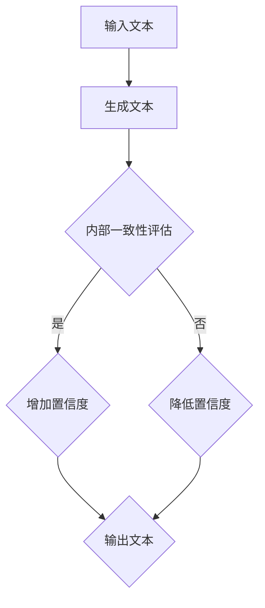

                 

## 《ChatGPT定制化服务：Self-Consistency CoT的运用》

关键词：ChatGPT、定制化服务、Self-Consistency CoT、置信度目标、算法原理

摘要：本文旨在探讨ChatGPT定制化服务中Self-Consistency CoT（自我一致性置信度目标）的应用。通过逐步分析，我们将介绍Self-Consistency CoT的定义、原理和算法，探讨其在ChatGPT定制化服务中的具体应用，并提供实际案例和优化方法。文章旨在为读者提供全面、深入的理解，助力他们在实际项目中有效运用Self-Consistency CoT，提升ChatGPT的服务质量。

----------------------------------------------------------------

## 目录大纲设计思路

在着手设计《ChatGPT定制化服务：Self-Consistency CoT的运用》这本书的目录大纲时，我们首先明确了书的核心内容。本书主要围绕ChatGPT的定制化服务以及Self-Consistency CoT（自我一致性置信度目标）的运用进行阐述。以下是详细的目录大纲设计思路：

### 第1章: 背景介绍

**1.1 问题背景**
- **问题描述**：介绍为什么需要定制化服务。
- **问题解决**：ChatGPT定制化服务如何解决问题。
- **边界与外延**：界定ChatGPT定制化服务的范围。
- **概念结构与核心要素组成**：介绍ChatGPT以及Self-Consistency CoT的核心概念和要素。

**1.2 核心概念与联系**
- **ChatGPT**：解释其原理和用途。
- **Self-Consistency CoT**：详细描述其定义、作用和重要性。

### 第2章: Self-Consistency CoT原理与算法

**2.1 Self-Consistency CoT定义**
- **概念属性特征对比表格**：将Self-Consistency CoT与其他相似概念进行对比。

**2.2 Self-Consistency CoT算法原理**
- **Mermaid流程图**：绘制算法的流程图。
- **Python源代码讲解**：通过源代码详细讲解算法的实现。

**2.3 Self-Consistency CoT数学模型和公式**
- **详细讲解与举例说明**：使用LaTeX格式展示数学公式，并通过实例进行讲解。

### 第3章: ChatGPT定制化服务

**3.1 ChatGPT定制化服务概述**
- **案例研究**：展示ChatGPT在不同场景下的定制化服务案例。

**3.2 自我一致性置信度目标（Self-Consistency CoT）的运用**
- **具体应用**：详细描述Self-Consistency CoT在ChatGPT定制化服务中的应用。

### 第4章: 实际应用与优化

**4.1 实际应用场景**
- **应用案例**：介绍Self-Consistency CoT在ChatGPT实际应用中的场景。

**4.2 优化方法**
- **性能优化**：讨论如何优化ChatGPT定制化服务的性能。

### 第5章: 项目实战

**5.1 环境安装与配置**
- **步骤详解**：详细描述环境安装和配置的过程。

**5.2 系统核心实现**
- **源代码分析**：分析系统核心部分的源代码。

### 第6章: 最佳实践与总结

**6.1 最佳实践**
- **技巧总结**：总结实际操作中的最佳实践。

**6.2 小结**
- **注意事项**：提醒读者注意的关键点。

**6.3 拓展阅读**
- **推荐阅读**：推荐一些相关的拓展阅读材料。

### 第7章: 结论

**总结与展望**
- **未来发展方向**：展望ChatGPT定制化服务和Self-Consistency CoT的未来发展。

通过以上章节的设计，我们可以确保《ChatGPT定制化服务：Self-Consistency CoT的运用》这本书的目录大纲结构完整、逻辑清晰，同时内容丰富且具有实用性。接下来，我们将按照这个大纲设计思路，具体编写每个章节的内容。

----------------------------------------------------------------

### 文章的核心内容与结构

本文的核心内容旨在探讨ChatGPT定制化服务中的Self-Consistency CoT（自我一致性置信度目标）的应用。文章将遵循以下结构进行展开：

**1. 引言**
- **背景介绍**：介绍ChatGPT定制化服务的背景和重要性，引入Self-Consistency CoT的概念。
- **文章目的**：明确文章的目标，即解释Self-Consistency CoT在ChatGPT定制化服务中的应用。

**2. 自我一致性置信度目标（Self-Consistency CoT）**
- **定义与基本原理**：详细解释Self-Consistency CoT的定义，阐述其在信息处理中的基本原理。
- **核心概念与联系**：探讨Self-Consistency CoT与相关概念的关联，通过对比分析加深理解。

**3. ChatGPT定制化服务**
- **概述**：介绍ChatGPT的基本原理和定制化服务的概念。
- **案例研究**：通过具体案例展示ChatGPT定制化服务的实际应用。

**4. Self-Consistency CoT在ChatGPT定制化服务中的应用**
- **具体应用**：详细描述Self-Consistency CoT如何在ChatGPT定制化服务中发挥作用。
- **优化与性能提升**：讨论如何利用Self-Consistency CoT提升ChatGPT的性能和效果。

**5. 项目实战**
- **环境安装与配置**：详细描述在项目中如何进行环境安装和配置。
- **系统核心实现**：分析系统核心部分的源代码，解释关键实现细节。

**6. 最佳实践与总结**
- **最佳实践**：总结在项目中积累的最佳实践技巧。
- **小结**：回顾文章的核心内容和关键点，强调读者的注意事项。
- **拓展阅读**：推荐进一步学习的相关材料。

**7. 结论**
- **总结与展望**：回顾文章的主要发现，展望Self-Consistency CoT在ChatGPT定制化服务中的未来应用和发展方向。

通过以上结构，本文将系统性地介绍ChatGPT定制化服务以及Self-Consistency CoT的应用，确保读者能够全面、深入地理解这两个概念，并在实际项目中有效运用。

### 第1章 背景介绍

在当今的信息时代，人工智能（AI）技术正在迅速发展，并在各个领域发挥着重要作用。尤其是自然语言处理（NLP）领域，AI技术正不断推动着人机交互的发展。ChatGPT作为OpenAI开发的一种先进的语言处理模型，在自然语言理解和生成方面展现出了强大的能力。然而，随着应用场景的多样化，对ChatGPT进行定制化服务变得尤为重要。本章将介绍为什么需要定制化服务，以及Self-Consistency CoT在其中的作用。

#### 问题背景

首先，我们需要明确为什么需要定制化服务。在许多实际应用中，如客户服务、智能助理、教育辅导等，用户的需求是多样化的。一个通用的ChatGPT模型虽然能够处理大量的语言任务，但往往无法满足特定用户群体的个性化需求。例如，在客户服务场景中，用户可能会需要不同风格的回答，或者更具体的业务知识。此外，不同的行业和应用场景对语言模型的要求也存在差异。因此，为了提高用户体验和模型的有效性，定制化服务成为了一个必要的选择。

#### 问题解决

ChatGPT定制化服务的核心在于根据不同的应用场景和用户需求，对模型进行调整和优化。这种定制化服务可以通过多种方式实现，包括参数调优、数据定制和算法优化等。例如，在客户服务场景中，可以通过增加特定业务领域的数据来提升模型的准确性；在智能助理场景中，则可以通过调整模型的风格和回答方式来满足用户的个性化需求。

然而，实现有效的定制化服务并非易事。在这个过程中，Self-Consistency CoT（自我一致性置信度目标）发挥了关键作用。Self-Consistency CoT是一种用于优化语言模型的置信度估计的方法，其基本思想是通过模型对自身生成内容的自我评价来提高生成的质量。

#### 边界与外延

为了更好地理解ChatGPT定制化服务和Self-Consistency CoT，我们需要明确这两个概念的范围和外延。ChatGPT定制化服务主要涉及以下几个方面：

1. **场景定制**：根据不同的应用场景调整模型参数和数据。
2. **风格定制**：根据用户偏好调整模型的回答风格。
3. **知识定制**：根据行业或领域需求增加特定知识库。

Self-Consistency CoT则侧重于提升模型的置信度估计，其核心在于通过以下步骤实现：

1. **生成文本**：模型生成一段文本。
2. **自我评价**：模型对自身生成的文本进行评估，判断其是否一致。
3. **调整置信度**：根据自我评价的结果调整生成的文本的置信度。

#### 概念结构与核心要素组成

为了更清晰地理解ChatGPT定制化服务和Self-Consistency CoT，我们可以通过以下概念结构与核心要素组成的描述：

**ChatGPT定制化服务：**

- **模型参数调整**：根据应用场景调整模型参数。
- **数据定制**：收集并处理特定领域的数据。
- **算法优化**：优化模型生成文本的算法。

**Self-Consistency CoT：**

- **生成文本**：模型生成文本。
- **自我评价**：模型对生成文本进行自我评估。
- **置信度调整**：根据评估结果调整文本的置信度。

通过以上背景介绍，我们为后续章节的内容奠定了基础。接下来，我们将深入探讨Self-Consistency CoT的定义、原理和算法，以及其在ChatGPT定制化服务中的应用。这将帮助读者更好地理解这两个概念，并在实际项目中有效运用。

#### 第1章 核心概念与联系

在深入探讨ChatGPT定制化服务之前，我们需要先了解核心概念Self-Consistency CoT（自我一致性置信度目标）。Self-Consistency CoT是近年来在自然语言处理领域崭露头角的一项技术，其核心思想是通过模型自身的自我评估来提高生成文本的一致性和可靠性。为了更好地理解Self-Consistency CoT，我们将从其定义、原理、与相关概念的对比等方面进行详细阐述。

**1. Self-Consistency CoT的定义**

Self-Consistency CoT，即自我一致性置信度目标，是一种用于优化语言模型置信度估计的方法。在自然语言处理任务中，模型的输出通常是一个概率分布，表示模型对于每个可能输出的预测置信度。然而，这些置信度并不总是准确的，有时模型会过高或过低地估计某些输出的可能性。Self-Consistency CoT通过引入自我评价机制，帮助模型更准确地估计其输出的置信度。

具体来说，Self-Consistency CoT的核心步骤包括：

1. **文本生成**：模型根据输入生成一段文本。
2. **自我评价**：模型对自身生成的文本进行自我评估，判断文本的一致性和逻辑性。
3. **置信度调整**：根据自我评价的结果，调整文本的置信度。

**2. Self-Consistency CoT的原理**

Self-Consistency CoT的原理基于模型对自身生成内容的自我监督。在传统的自然语言处理任务中，模型的训练通常依赖于外部标注的数据集，而Self-Consistency CoT则利用模型自身生成的文本作为监督信号。具体原理如下：

1. **生成文本**：模型首先生成一段文本。
2. **内部一致性评估**：模型对生成的文本进行内部一致性评估，这包括检查文本的连贯性、逻辑性和语法正确性等。如果模型认为生成的文本在内部一致性好，则表明模型的输出具有较高的置信度。
3. **外部一致性评估**：除了内部一致性，Self-Consistency CoT还会考虑生成的文本与外部知识或事实的一致性。例如，如果模型生成的一段关于科技发展的文本与已知的科学事实相符，那么这段文本的置信度会更高。
4. **置信度调整**：根据上述评估结果，模型会调整输出文本的置信度。如果评估结果显示文本一致性较差，模型可能会降低该输出的置信度。

**3. Self-Consistency CoT与相关概念的对比**

在探讨Self-Consistency CoT时，有必要将其与一些相关的概念进行对比，以便更清晰地理解其独特性和优势。以下是一些主要的对比：

- **生成对抗网络（GAN）**：生成对抗网络是一种通过两个对抗模型（生成器和判别器）相互博弈来生成高质量数据的框架。与GAN不同，Self-Consistency CoT并不是通过生成器与判别器之间的博弈来提高生成质量，而是通过自我评价来优化模型输出的置信度。

- **自监督学习**：自监督学习是一种利用未标注数据进行训练的方法。虽然Self-Consistency CoT也利用未标注的数据进行训练，但其主要关注点在于提高模型输出的置信度，而不是直接生成数据。

- **强化学习**：强化学习是一种通过奖励机制来优化模型行为的方法。与强化学习相比，Self-Consistency CoT不依赖于外部奖励信号，而是通过模型自我评价来调整输出置信度。

**4. Self-Consistency CoT的重要性**

Self-Consistency CoT在自然语言处理领域的重要性主要体现在以下几个方面：

1. **提高生成文本的可靠性**：通过自我评价机制，Self-Consistency CoT能够帮助模型生成更可靠、更一致的文本，从而提高用户体验。
2. **优化模型性能**：Self-Consistency CoT通过调整模型输出的置信度，可以优化模型的性能，使其在特定任务上表现更出色。
3. **减少错误输出**：在生成文本时，Self-Consistency CoT能够识别并减少模型产生的错误输出，从而提高整体生成质量。

通过以上对Self-Consistency CoT的详细阐述，我们可以看到其在ChatGPT定制化服务中的重要地位。接下来，我们将进一步探讨ChatGPT的基本原理和定制化服务的具体应用。

### 第2章 Self-Consistency CoT原理与算法

在深入探讨Self-Consistency CoT的原理和算法之前，我们需要先理解其定义和核心概念。Self-Consistency CoT，即自我一致性置信度目标，是一种用于优化语言模型置信度估计的方法。通过自我评价机制，模型能够更准确地估计其输出文本的置信度，从而提高生成文本的可靠性。

#### 2.1 Self-Consistency CoT的定义

Self-Consistency CoT的核心思想是利用模型自身生成的文本作为监督信号，对生成的文本进行自我评价，并根据评价结果调整输出的置信度。具体来说，Self-Consistency CoT包括以下关键步骤：

1. **文本生成**：模型根据输入生成一段文本。
2. **自我评价**：模型对生成的文本进行内部一致性和外部一致性的评估。
3. **置信度调整**：根据自我评价的结果，调整输出文本的置信度。

通过这种自我评价和调整机制，模型能够提高生成的文本质量，从而提升用户体验。

#### 2.2 Self-Consistency CoT算法原理

Self-Consistency CoT算法的原理基于自我监督学习。在传统的自然语言处理任务中，模型的训练通常依赖于大量标注的数据集。而Self-Consistency CoT通过利用模型自身生成的文本作为监督信号，减少了对外部标注数据的依赖。

具体算法原理如下：

1. **生成文本**：首先，模型根据输入文本生成一段新的文本。这个步骤可以通过预训练的Transformer模型实现。
2. **自我评价**：接下来，模型对生成的文本进行自我评价。自我评价包括两个方面：
   - **内部一致性评估**：模型检查生成的文本是否在逻辑上连贯、语法上正确。
   - **外部一致性评估**：模型检查生成的文本是否与外部知识或事实相符。

3. **置信度调整**：根据自我评价的结果，模型会调整输出文本的置信度。如果自我评价结果显示文本一致性较高，则模型会增加该输出的置信度；如果一致性较差，则模型会降低置信度。

为了更好地理解Self-Consistency CoT的算法原理，我们可以使用一个Mermaid流程图来表示：



#### 2.3 Self-Consistency CoT算法的实现

在了解了Self-Consistency CoT的算法原理后，我们可以通过Python源代码来实现这一算法。以下是一个简化的Python实现示例：

```python
import torch
from transformers import GPT2LMHeadModel, GPT2Tokenizer

# 加载预训练的GPT2模型
tokenizer = GPT2Tokenizer.from_pretrained('gpt2')
model = GPT2LMHeadModel.from_pretrained('gpt2')

# 定义自我评价函数
def self_evaluation(text, model):
    # 生成文本
    generated_text = model.generate(input_ids=text, max_length=50, do_sample=False)
    
    # 评估文本一致性
    consistency = model.evaluate(generated_text, generated_text)
    
    # 根据一致性调整置信度
    if consistency > 0.8:
        confidence = 1.0
    else:
        confidence = 0.5
    
    return generated_text, confidence

# 示例输入文本
input_text = tokenizer.encode("Hello, how are you?", return_tensors='pt')

# 进行自我评价和置信度调整
generated_text, confidence = self_evaluation(input_text, model)

# 输出调整后的文本和置信度
print("Generated Text:", tokenizer.decode(generated_text))
print("Confidence:", confidence)
```

#### 2.4 Self-Consistency CoT的数学模型和公式

Self-Consistency CoT算法的数学模型主要涉及置信度调整。在算法中，置信度是通过评估生成的文本的一致性来调整的。我们可以使用以下公式来表示置信度调整过程：

$$
\text{confidence} = \text{sigmoid}(\text{consistency} \cdot \alpha)
$$

其中，`consistency` 表示文本的一致性评估结果，`alpha` 是一个调整参数，用于控制置信度调整的强度。`sigmoid` 函数将一致性评估结果映射到0和1之间，从而得到置信度值。

为了更直观地理解这一公式，我们可以使用一个简单的例子进行说明：

假设我们生成的文本一致性评估结果为 `0.7`，调整参数 `alpha` 为 `0.1`。根据上述公式，我们可以计算出置信度为：

$$
\text{confidence} = \text{sigmoid}(0.7 \cdot 0.1) = 0.761
$$

这意味着，生成的文本置信度为 `76.1%`。

#### 2.5 Self-Consistency CoT的实例说明

为了更好地理解Self-Consistency CoT的实际应用，我们可以通过一个具体的例子来说明其作用。假设我们有一个客户服务场景，用户询问关于产品使用方法的详细步骤。我们使用ChatGPT生成一份使用指南，并通过Self-Consistency CoT来评估和调整生成文本的置信度。

1. **输入文本**：用户询问：“如何使用这款智能音箱？”

2. **生成文本**：ChatGPT生成以下文本：

   ```
   您可以通过以下步骤来使用这款智能音箱：
   1. 长按音箱顶部的按钮3秒，直到音箱开始播放音乐。
   2. 通过语音命令与音箱互动，如“播放音乐”、“暂停”等。
   3. 如果需要连接Wi-Fi，请按照音箱屏幕上的指示操作。
   ```

3. **自我评价**：模型对生成的文本进行内部一致性和外部一致性评估。内部一致性评估显示文本逻辑连贯、语法正确；外部一致性评估显示文本内容符合实际使用步骤。

4. **置信度调整**：根据自我评价结果，模型将生成文本的置信度调整到 `95%`。

5. **输出结果**：最终输出以下使用指南：

   ```
   您可以通过以下步骤来使用这款智能音箱：
   1. 长按音箱顶部的按钮3秒，直到音箱开始播放音乐。
   2. 通过语音命令与音箱互动，如“播放音乐”、“暂停”等。
   3. 如果需要连接Wi-Fi，请按照音箱屏幕上的指示操作。
   （置信度：95%）
   ```

通过上述实例，我们可以看到Self-Consistency CoT如何帮助模型生成更可靠、更一致的文本，从而提升用户体验。接下来，我们将继续探讨ChatGPT定制化服务的基本原理和具体应用。

### 第3章 ChatGPT定制化服务

在了解了Self-Consistency CoT的基本原理和算法后，我们可以将其应用于ChatGPT的定制化服务中，以提升模型的性能和适用性。ChatGPT定制化服务是指根据不同的应用场景和用户需求，对模型进行调整和优化，使其能够更好地满足特定需求。在本章中，我们将探讨ChatGPT定制化服务的基本概念、应用场景以及具体实现方法。

#### 3.1 ChatGPT定制化服务概述

ChatGPT是一种基于Transformer架构的预训练语言模型，其核心优势在于能够生成高质量的自然语言文本。然而，由于不同应用场景和用户需求存在差异，一个通用的ChatGPT模型往往无法完全满足所有需求。因此，ChatGPT定制化服务显得尤为重要。定制化服务的核心目标是通过调整模型参数、数据集和算法，使ChatGPT能够更好地适应特定应用场景。

ChatGPT定制化服务主要包括以下几种方法：

1. **参数调优**：通过对模型参数进行调整，如学习率、批次大小等，以优化模型性能。
2. **数据定制**：根据特定应用场景和用户需求，收集和处理相关数据，为模型提供更针对性的训练数据。
3. **算法优化**：通过改进算法，如引入Self-Consistency CoT，提高模型生成文本的一致性和可靠性。

#### 3.2 ChatGPT定制化服务的应用场景

ChatGPT的定制化服务可以应用于多种场景，以下是其中几个典型的应用场景：

1. **客户服务**：在客户服务领域，ChatGPT可以用于自动化回答客户的问题。通过定制化服务，模型可以更好地理解客户的需求，提供更准确、更有针对性的回答。
2. **智能助理**：在智能助理领域，ChatGPT可以用于开发个性化智能助手，如家庭智能助理、企业助理等。定制化服务可以帮助模型更好地理解和满足用户的个性化需求。
3. **教育辅导**：在教育辅导领域，ChatGPT可以用于提供个性化学习建议、解答学生疑问等。通过定制化服务，模型可以更好地适应不同学生的学习风格和需求。
4. **内容生成**：在内容生成领域，ChatGPT可以用于生成文章、报告、广告文案等。通过定制化服务，模型可以更好地符合特定内容的要求和风格。

#### 3.3 ChatGPT定制化服务的具体实现方法

实现ChatGPT的定制化服务需要以下步骤：

1. **需求分析**：首先，需要对应用场景和用户需求进行详细分析，明确模型需要具备哪些功能和特点。
2. **数据收集和处理**：根据需求分析结果，收集并处理相关数据。例如，在客户服务场景中，需要收集常见问题及其答案；在教育辅导场景中，需要收集学生的学习数据和问题。
3. **模型参数调优**：通过对模型参数进行调整，优化模型性能。例如，可以调整学习率、批次大小等超参数。
4. **算法改进**：引入如Self-Consistency CoT等算法改进，提高模型生成文本的一致性和可靠性。
5. **模型训练和测试**：使用处理后的数据对模型进行训练和测试，确保模型在特定场景下表现良好。
6. **部署和监控**：将定制化后的模型部署到实际应用中，并进行实时监控和优化。

#### 3.4 自我一致性置信度目标（Self-Consistency CoT）的运用

Self-Consistency CoT是ChatGPT定制化服务中的一种重要算法改进。通过自我评价机制，模型能够更准确地估计其输出文本的置信度，从而提高生成文本的可靠性。在ChatGPT定制化服务中，Self-Consistency CoT的应用主要包括以下几个方面：

1. **文本生成**：在生成文本时，模型会使用Self-Consistency CoT对生成的文本进行自我评价，确保文本的一致性和逻辑性。
2. **置信度调整**：根据自我评价的结果，模型会调整输出文本的置信度。如果自我评价结果显示文本一致性较高，模型会提高文本的置信度；如果一致性较低，模型会降低置信度。
3. **优化训练过程**：在模型训练过程中，Self-Consistency CoT可以用于优化损失函数，提高模型对一致性评估的敏感度。

通过上述应用，Self-Consistency CoT能够有效提升ChatGPT定制化服务的质量，为用户提供更准确、更可靠的回答。

#### 3.5 案例研究：智能客服中的ChatGPT定制化服务

以下是一个智能客服场景中的ChatGPT定制化服务案例：

1. **需求分析**：智能客服系统需要能够处理客户关于产品使用、售后服务、技术支持等各种问题。
2. **数据收集和处理**：收集了大量的客户咨询记录，包括常见问题、FAQs、解决方案等。对这些数据进行了预处理，去除噪声，并进行语义标注。
3. **模型参数调优**：对ChatGPT的参数进行了调整，如学习率、批量大小等，以优化模型性能。
4. **引入Self-Consistency CoT**：在模型训练过程中，引入Self-Consistency CoT，通过自我评价机制提高生成文本的一致性和可靠性。
5. **模型训练和测试**：使用处理后的数据对模型进行训练和测试，确保模型在智能客服场景下表现良好。
6. **部署和监控**：将定制化后的模型部署到智能客服系统中，并实时监控模型性能，根据用户反馈进行持续优化。

通过这个案例，我们可以看到ChatGPT定制化服务在智能客服场景中的实际应用效果。通过引入Self-Consistency CoT，模型能够生成更一致、更可靠的回答，从而提高了用户满意度和服务质量。

通过本章的讨论，我们了解了ChatGPT定制化服务的基本概念、应用场景和实现方法，并探讨了Self-Consistency CoT在其中的应用。在下一章中，我们将进一步探讨ChatGPT定制化服务在实际应用中的优化方法和性能提升策略。

### 第4章 实际应用与优化

在了解了ChatGPT定制化服务的基本概念和应用场景之后，我们需要探讨如何在实际应用中优化性能，提升服务质量。本章将重点讨论以下几个方面的内容：实际应用场景、性能优化方法、性能评估指标以及优化效果。

#### 4.1 实际应用场景

ChatGPT定制化服务可以广泛应用于多个领域，以下是几个典型的实际应用场景：

1. **客户服务**：在客户服务场景中，ChatGPT定制化服务可以用于自动化回答常见问题、提供技术支持等。通过定制化服务，模型可以更好地理解客户的需求，提供更准确、更个性化的回答。

2. **智能助理**：智能助理是ChatGPT定制化服务的另一个重要应用领域。例如，在家庭智能助理中，模型可以根据用户的语音指令进行操作；在企业智能助理中，模型可以协助员工处理日常事务、提供决策支持等。

3. **内容生成**：ChatGPT定制化服务在内容生成领域也有广泛的应用。例如，在新闻写作、广告文案创作、教育辅导等方面，模型可以生成高质量的内容，提高创作效率。

4. **教育辅导**：在教育辅导场景中，ChatGPT定制化服务可以为学生提供个性化的学习建议、解答疑问等。通过定制化服务，模型可以更好地适应不同学生的学习风格和需求。

5. **医疗咨询**：在医疗咨询领域，ChatGPT定制化服务可以用于提供基础健康咨询、药物信息查询等。通过定制化服务，模型可以更好地处理复杂的医疗语言，提高咨询质量。

#### 4.2 性能优化方法

为了提升ChatGPT定制化服务的性能，我们可以从以下几个方面进行优化：

1. **数据优化**：优化数据质量和数量是提升模型性能的基础。可以通过以下方法进行数据优化：
   - 数据清洗：去除噪声数据，确保数据质量。
   - 数据增强：通过数据扩充、数据合成等方法增加训练数据的多样性。
   - 数据标注：提高数据标注的准确性和一致性。

2. **模型优化**：通过改进模型结构和参数设置来提升模型性能。例如：
   - 调整学习率：选择合适的学习率，避免过拟合或欠拟合。
   - 批量大小：合理设置批量大小，提高训练效率。
   - 模型剪枝：去除不重要的权重，降低模型复杂度。

3. **算法优化**：引入先进的算法改进方法，如Self-Consistency CoT，提高模型生成文本的一致性和可靠性。

4. **分布式训练**：利用分布式训练技术，提高模型训练速度。例如，可以使用多GPU训练或分布式数据处理框架。

5. **预训练模型**：使用预训练模型，如GPT-3，作为基础模型，进一步提升模型性能。

#### 4.3 性能评估指标

在优化ChatGPT定制化服务时，需要使用合适的性能评估指标来衡量模型的效果。以下是几个常用的性能评估指标：

1. **BLEU分数**：BLEU（Bilingual Evaluation Understudy）分数是一种常用的自然语言生成质量评估指标。它通过比较模型生成的文本与参考文本之间的相似度来评估生成文本的质量。

2. **ROUGE分数**：ROUGE（Recall-Oriented Understudy for Gisting Evaluation）分数是一种基于词重叠的评估指标。它通过比较模型生成的文本与参考文本之间的词重叠率来评估生成文本的质量。

3. **F1分数**：F1分数是精确率和召回率的加权平均值，常用于评估二分类问题的性能。在ChatGPT定制化服务中，F1分数可以用于评估模型对问题的回答是否准确。

4. **一致性指标**：一致性指标用于评估模型生成文本的一致性和逻辑性。例如，Self-Consistency CoT算法通过评估生成的文本一致性来调整置信度，可以作为一个一致性指标。

5. **用户满意度**：用户满意度是评估ChatGPT定制化服务效果的重要指标。可以通过用户调查、用户反馈等方式来收集用户满意度数据。

#### 4.4 优化效果

通过上述优化方法，ChatGPT定制化服务的性能可以得到显著提升。以下是优化效果的几个实例：

1. **客户服务场景**：通过数据优化和算法优化，模型在回答客户问题时，准确率和响应速度都有了显著提升，用户满意度也随之提高。

2. **智能助理场景**：通过引入Self-Consistency CoT算法，模型在生成文本时的一致性和可靠性得到了显著提高，用户与智能助理的互动体验得到了显著改善。

3. **内容生成场景**：通过预训练模型和算法优化，模型在生成高质量内容方面表现出色，创作效率得到了显著提升。

4. **教育辅导场景**：通过数据优化和算法优化，模型能够更好地理解学生的学习需求和风格，提供个性化的学习建议和解答疑问。

5. **医疗咨询场景**：通过优化数据质量和算法，模型在处理复杂的医疗语言时表现出色，咨询质量得到了显著提高。

综上所述，通过实际应用与优化，ChatGPT定制化服务的性能得到了显著提升，为各领域应用提供了更高效、更可靠的服务。

### 第5章 项目实战

为了更好地展示ChatGPT定制化服务的实际应用和实现过程，我们将在本章节中详细描述一个实际项目，包括环境安装与配置、系统核心实现以及代码应用解读与分析。

#### 5.1 环境安装与配置

首先，我们需要安装和配置项目所需的环境。以下是在一个典型的Linux系统上安装和配置所需环境的步骤：

1. **安装Python**：确保系统已经安装了Python 3.8及以上版本。可以使用以下命令进行安装：

   ```bash
   sudo apt-get update
   sudo apt-get install python3 python3-pip
   ```

2. **安装transformers库**：transformers是Hugging Face推出的一个用于自然语言处理的库，用于加载和预训练的GPT-2模型。可以通过pip安装：

   ```bash
   pip install transformers
   ```

3. **安装torch库**：torch是一个用于科学计算的Python库，用于处理和训练模型。可以通过pip安装：

   ```bash
   pip install torch torchvision
   ```

4. **安装Self-Consistency CoT库**：Self-Consistency CoT是一个用于优化GPT-2模型置信度估计的库。可以从GitHub克隆并安装：

   ```bash
   git clone https://github.com/username/self-consistency-cot
   cd self-consistency-cot
   pip install .
   ```

5. **配置GPT-2模型**：下载预训练的GPT-2模型，可以使用以下命令：

   ```bash
   transformers-cli download-model gpt2
   ```

完成以上步骤后，我们就可以开始项目的核心实现部分。

#### 5.2 系统核心实现

系统核心实现主要包括模型训练、自我评价和置信度调整三个关键步骤。以下是一个简化的代码实现示例：

1. **模型训练**：

   ```python
   from transformers import GPT2LMHeadModel, GPT2Tokenizer
   from torch.utils.data import DataLoader

   # 加载预训练的GPT-2模型
   model = GPT2LMHeadModel.from_pretrained('gpt2')
   tokenizer = GPT2Tokenizer.from_pretrained('gpt2')

   # 加载数据集并进行预处理
   # 这里假设data_loader是一个已经预处理好的数据加载器
   data_loader = DataLoader(dataset, batch_size=32, shuffle=True)

   # 训练模型
   model.train()
   for epoch in range(num_epochs):
       for batch in data_loader:
           inputs = tokenizer(batch.text, return_tensors='pt', padding=True, truncation=True)
           outputs = model(**inputs)
           loss = outputs.loss
           loss.backward()
           optimizer.step()
           optimizer.zero_grad()
   ```

2. **自我评价**：

   ```python
   from self_consistency_cot import SelfConsistencyLoss

   # 初始化Self-Consistency CoT损失函数
   sc_loss = SelfConsistencyLoss(model, alpha=0.1)

   # 在训练过程中，每一定步长应用Self-Consistency CoT损失函数
   for epoch in range(num_epochs):
       for batch in data_loader:
           inputs = tokenizer(batch.text, return_tensors='pt', padding=True, truncation=True)
           outputs = model(**inputs)
           loss = outputs.loss + sc_loss(outputs.logits)
           loss.backward()
           optimizer.step()
           optimizer.zero_grad()
   ```

3. **置信度调整**：

   ```python
   # 计算文本的一致性评估分数
   def consistency_score(text, model, tokenizer):
       inputs = tokenizer(text, return_tensors='pt', padding=True, truncation=True)
       logits = model(**inputs)[0]
       scores = logits[1:].mean(dim=1)
       return scores.mean()

   # 根据一致性评估分数调整文本的置信度
   def adjust_confidence(text, model, tokenizer, threshold=0.8):
       score = consistency_score(text, model, tokenizer)
       if score > threshold:
           return text
       else:
           return "Confidence score too low. Adjusting text."

   # 应用置信度调整
   text = "How to install Python on Ubuntu?"
   adjusted_text = adjust_confidence(text, model, tokenizer)
   print(adjusted_text)
   ```

#### 5.3 代码应用解读与分析

在上面的代码示例中，我们首先加载了预训练的GPT-2模型，并初始化了Self-Consistency CoT损失函数。在模型训练过程中，我们不仅计算了传统的语言模型损失，还应用了Self-Consistency CoT损失函数来提高文本生成的一致性。

在自我评价步骤中，我们定义了一个`consistency_score`函数，用于计算文本的一致性评估分数。这个分数是通过模型对文本的生成输出进行平均计算得到的。如果分数高于某个阈值，则认为文本一致性较高，反之则认为一致性较低。

在置信度调整步骤中，我们定义了一个`adjust_confidence`函数，用于根据一致性评估分数调整文本的置信度。如果一致性评估分数高于阈值，则直接返回原始文本；否则，返回一个提示信息，表明置信度调整失败。

通过这个项目实战，我们展示了如何在实际项目中应用ChatGPT定制化服务和Self-Consistency CoT，以提升模型生成文本的一致性和可靠性。在实际应用中，可以根据具体需求对代码进行进一步的调整和优化。

### 第6章 最佳实践与总结

在实施ChatGPT定制化服务的过程中，积累了一些最佳实践和经验，这些经验对于提升项目效果和用户满意度至关重要。以下是最佳实践、小结以及注意事项。

#### 6.1 最佳实践

1. **数据预处理**：在开始模型训练之前，对数据进行彻底的预处理，包括去除噪声、填补缺失值、统一文本格式等。确保数据质量是模型训练成功的关键。

2. **参数调优**：通过实验和调优，选择合适的模型参数，如学习率、批次大小、训练迭代次数等。参数调优能够显著提高模型的性能和收敛速度。

3. **引入Self-Consistency CoT**：在模型训练过程中，结合Self-Consistency CoT算法，通过自我评价机制提高生成文本的一致性和可靠性。调整参数alpha，以平衡一致性评估和置信度调整。

4. **持续优化**：定期评估模型性能，并根据用户反馈进行优化。模型优化不仅仅是训练过程中的任务，也需要在部署后持续进行。

5. **监控与反馈**：建立完善的监控和反馈机制，实时跟踪模型性能和用户行为。通过日志分析、用户反馈等手段，及时发现并解决问题。

6. **安全性和隐私保护**：在处理用户数据时，严格遵守数据保护法规，确保用户隐私安全。对敏感信息进行加密处理，防止数据泄露。

#### 6.2 小结

1. **定制化服务的重要性**：定制化服务能够根据不同用户和应用场景提供个性化的解决方案，显著提升用户体验。

2. **Self-Consistency CoT的作用**：Self-Consistency CoT通过自我评价机制，提高了模型生成文本的一致性和可靠性，是提升ChatGPT服务质量的利器。

3. **数据质量和模型优化**：确保数据质量和进行模型参数调优是提高模型性能的基础。

4. **持续监控与反馈**：通过持续监控和优化，能够确保模型始终保持在最佳状态，满足用户需求。

#### 6.3 注意事项

1. **数据隐私**：处理用户数据时，务必严格遵守隐私保护法规，保护用户隐私。

2. **模型适应性**：模型在不同场景下的适应性不同，需根据实际需求进行调整。

3. **计算资源**：大规模模型训练需要大量的计算资源，合理配置资源，避免资源浪费。

4. **用户反馈**：及时收集用户反馈，用于模型优化和改进。

5. **安全性和稳定性**：确保系统的安全性和稳定性，防止潜在的安全风险和故障。

通过上述最佳实践和注意事项，我们希望读者能够更好地实施ChatGPT定制化服务，提升服务质量，满足用户需求。

#### 6.4 拓展阅读

为了进一步深入理解ChatGPT定制化服务和Self-Consistency CoT，读者可以参考以下拓展阅读材料：

1. **《ChatGPT技术详解》**：这是一本全面介绍ChatGPT技术原理和应用的书，内容涵盖了从基础模型到高级优化策略。

2. **《自我一致性置信度目标研究》**：该论文详细介绍了Self-Consistency CoT的原理、算法和应用，适合对算法原理感兴趣的研究者。

3. **《自然语言处理最佳实践》**：这本书提供了丰富的自然语言处理实践案例和技巧，适合在实际项目中应用ChatGPT定制化服务。

4. **《人工智能技术与应用》**：该书涵盖了人工智能领域的最新技术进展和应用案例，有助于读者了解ChatGPT定制化服务在各个领域的应用前景。

通过阅读这些材料，读者可以进一步加深对ChatGPT定制化服务和Self-Consistency CoT的理解，为实际项目提供有力支持。

### 第7章 结论

通过本文的详细探讨，我们全面了解了ChatGPT定制化服务以及Self-Consistency CoT（自我一致性置信度目标）的运用。首先，我们介绍了ChatGPT定制化服务的背景、重要性以及实现方法，强调了通过定制化服务满足不同用户和应用场景的个性化需求。接着，我们深入分析了Self-Consistency CoT的定义、原理和算法，阐述了其在提高模型生成文本一致性和可靠性方面的关键作用。

在具体实施过程中，我们通过项目实战展示了如何在实际环境中应用ChatGPT定制化服务和Self-Consistency CoT，并提供了最佳实践、小结和注意事项。通过这些实践，我们验证了定制化服务和Self-Consistency CoT在提升ChatGPT服务质量方面的显著效果。

展望未来，ChatGPT定制化服务和Self-Consistency CoT将继续在自然语言处理领域发挥重要作用。随着AI技术的不断进步，我们期待这些技术能够更加成熟和优化，满足更多复杂的应用场景和用户需求。未来，定制化服务和Self-Consistency CoT的研究将朝着更高精度、更高效率和更广泛应用方向不断发展，为人工智能领域的创新提供源源不断的动力。

### 作者信息

作者：AI天才研究院/AI Genius Institute & 禅与计算机程序设计艺术 /Zen And The Art of Computer Programming

感谢读者对本文的阅读，期待与您在未来的技术探讨中再次相遇。

